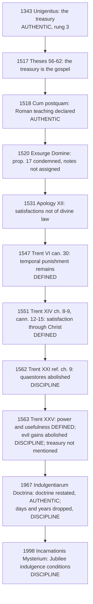

# Theology of Debt · Lesson 3.6: Luther, Trent and the reform of indulgences

> ⏱ ~15 min · Module 3: Sin as debt · Builds on: [3.4 Aquinas: satisfaction, merit and the debt of punishment](03-04-aquinas-satisfaction-and-the-debt-of-punishment.md), [3.5 The Christian Jubilee and the treasury of the Church](03-05-the-christian-jubilee-and-the-treasury.md) · Unlocks: [4.1 The Fathers against usury](04-01-the-fathers-against-usury.md), [Module 6](06-02-international-debt-and-the-jubilee-call.md)

## Why this matters

By 1517 the debt picture of sin had a working institution: guilt forgiven, a [temporal punishment](../reference.md#temporal-punishment) still owed, and a [treasury](../reference.md#the-treasury-of-the-church) from which the Church could pay it down. Luther attacked the treasury, and the Lutheran confessions went on to attack satisfaction itself. Trent answered with anathemas on some points, silence on others, and reform decrees against the trade. Getting those three kinds of answer apart is this lesson's whole job, because on indulgences a claim is easily pitched a rung too high or too low.

## The idea

Think of a debt that has already been forgiven, where some consequence of it still has to be worked off. Three questions follow. Does any such remainder exist once God forgives? If it does, can the Church help pay it? And if the Church pays, what does it pay *with*?

Luther and the Lutheran confessions said no to the first question, and so to the rest. Christ's satisfaction covers everything, and nothing is left for us to pay God. Trent said yes to the first two questions and defined both. On the third, what the payment is drawn from, Trent said nothing at all. The answer to that question, the treasury of Christ's and the saints' merits, is papal teaching of real weight. It is not a conciliar definition. Meanwhile everyone, Trent included, agreed that the *money* had to go.

## Source

Three texts, one voice each.

**Luther, *Ninety-Five Theses* (1517), theses 58 and 62** (Philadelphia edition, 1915):

> 58. Nor are they the merits of Christ and the Saints, for even without the pope, these always work grace for the inner man, and the cross, death, and hell for the outward man.
>
> 62. The true treasure of the Church is the Most Holy Gospel of the glory and the grace of God.

**The Apology of the Augsburg Confession** (1531), Art. XII, the part the *Triglot Concordia* (1921) heads "Of Confession and Satisfaction", §50:

> we can safely affirm that canonical satisfactions are not necessary by divine Law for the remission of guilt, or eternal punishment, or the punishment of purgatory.

**Trent, Session XXV, Decree concerning Indulgences** (4 December 1563; Waterworth, 1848), abridged:

> Whereas the power of conferring Indulgences was granted by Christ to the Church ... the sacred holy Synod teaches, and enjoins, that the use of Indulgences, for the Christian people most salutary ... is to be retained in the Church ... It ordains generally by this decree, that all evil gains for the obtaining thereof ... be wholly abolished.

Between the second and third ellipses the decree anathematizes two positions: that indulgences are useless, and that the Church has no power to grant them. It then asks for moderation in granting them.

Read the three texts together. In thesis 58 Luther does not deny that Christ's merits exist or that they work. He denies they are the fund the pope draws on, because they already work "without the pope". Thesis 62 offers a different treasure, the gospel. And thesis 61 still grants that the pope's power suffices to remit penalties. So in 1517 the objection targets the *treasury*, not every indulgence. The Apology goes further. Satisfactions lose any divine-law standing, and elsewhere (§78) it says indulgences had once simply remitted public church penances, and the keys have no power over purgatory. Trent's decree, for its part, never mentions a treasury.

## The argument

**The Lutheran case,** as its confessions state it, at full strength:

1. Christ's death is satisfaction for guilt *and* for eternal death (Apology XII, Triglot §43, from Hosea 13:14). *In words:* no part of the debt was left for the sinner to pay.
2. So forgiveness received by faith is total. Afflictions and good works follow repentance and God commands them, but they are fruits, not compensation (§46, §50).
3. Canonical satisfactions are human traditions. Treating them as payment "obscures" Christ's benefit (§47–49).
4. The keys loose and bind sins on earth. They do not reach purgatory (§78–79).
5. ∴ Indulgences that claim to remit a debt owed to God's justice, from a treasury of merits, rest on nothing. The Church's one treasure is the gospel (thesis 62).

**Rome's answers, in order:**

6. **Leo X, *Cum postquam*** (9 November 1518), addressed to his legate Cajetan. It declared as Roman teaching that the pope, by the keys, remits the temporal punishment due to actual sins, drawing on the superabundant merits of Christ and the saints: to the living by way of absolution, to the dead by way of suffrage. Guilt is not in view; it is remitted in the sacrament.
7. ***Exsurge Domine*** (15 June 1520) lists forty-one of Luther's propositions. Proposition 17 is thesis 58's denial of the treasury. They are condemned together under a string of notes (heretical, scandalous, false, offensive to pious ears, and so on), and the bull does not say which note fits which proposition.
8. **Trent, Session VI, canon 30** (1547): anathema on anyone who says that, once justified, a penitent owes no temporal punishment, in this life or in purgatory. *In words:* forgiving guilt does not automatically cancel the whole debt.
9. **Session XIV** (1551), chapters 8–9 and canons 12–15. It is false that God always remits the whole punishment together with the guilt (ch. 8; can. 12). Satisfaction for temporal punishment is made to God through Christ's merits: by penances the priest imposes, by penances taken on freely, and by God's own chastisements patiently borne (ch. 9; can. 13). Such satisfactions are a worship of God, not human traditions that obscure grace (can. 14). Chapter 8 answers premise 3 head-on: our satisfaction is not "so our own" as not to be through Christ, "in whom we satisfy". *In words:* the Lutheran dichotomy of Christ's payment against ours is denied. Ours is made in his, which is [3.4](03-04-aquinas-satisfaction-and-the-debt-of-punishment.md)'s head and members as one mystical person.
10. **Session XXV** (1563): the power and usefulness of indulgences, defined as in the Source; moderation urged; "evil gains" abolished. The year before, Session XXI's reform decree (ch. 9, 1562) had already abolished the alms-collectors (*quaestores*) and ordered indulgences published by bishops, free of charge.
11. **Paul VI, *Indulgentiarum Doctrina*** (1 January 1967). It restates the doctrine: temporal punishment (§2), the communion of saints, and the treasury as the infinite value of Christ's expiation and merits, with the saints' works added (§5). Then it reforms the practice. The count of days and years is dropped (norm 4). A partial indulgence is measured by the charity of the act itself (norm 5). No more than one plenary indulgence a day (norm 6).
12. **The Catechism, CCC 1471–1479**, follows *Indulgentiarum Doctrina*. It glosses temporal punishment as a consequence that follows from the nature of sin, not vengeance inflicted from outside (1472), and places the treasury in the communion of saints (1474–1477).

**Mark the levels.** Items 8 and 9 (temporal punishment can remain after guilt is forgiven; our satisfactions are made through Christ) and the *power and usefulness* of indulgences in item 10 are **defined**. They carry conciliar anathemas and sit on rung 1 of the [ladder](../../fundamental-theology/lessons/04-04-the-ladder-of-doctrinal-authority.md). Understating them is an error. **The treasury** (items 6, 7, 11, 12, and Clement VI's *Unigenitus* from [3.5](03-05-the-christian-jubilee-and-the-treasury.md)) is **authentic papal teaching**, rung 3. Popes have taught it repeatedly, and Leo X condemned its denial. But the global censure in *Exsurge* fixes no note on proposition 17, and Trent passed over the treasury in silence. The manuals graded it variously, and the 1912 *Catholic Encyclopedia* calls it "dogmatically set forth" in *Unigenitus*, which overreaches. Do not call it defined. **Moderation, the ban on evil gains, the end of the *quaestores*, Paul VI's norms and the conditions for the Jubilee indulgence of 2000** are **discipline**. They bind, they can be changed, and they sit on no rung. See [the levels](../reference.md#the-levels-in-this-course).

## Timeline

## Worked examples

**Example 1: a clean case.** *"Catholics must believe that the Church can grant indulgences."* True, and at the top: Session XXV anathematizes denying the power. Now change one word: *"Catholics must believe, as defined, that indulgences draw on a treasury of the saints' merits."* This is false as a claim about level. The mechanism is rung-3 teaching (*Cum postquam*, *Indulgentiarum Doctrina* §5, CCC 1476–1477), owed religious submission but not faith. Leaving the explanation undefined is how Trent worked: it defined *that* satisfaction is made through Christ and *that* the Church can grant indulgences, and said nothing about *how*.

**Example 2: where it strains.** *"Trent admitted that Luther was right about the abuses."* Half true. Trent's own decree says abuses had crept in, and that the heretics blasphemed indulgences on the abuses' account. It abolished the gains and, in Session XXI, the collectors. What it denied was Luther's *remedy*. Removing the money did not remove the doctrine, because in the Catholic view the power stood on the keys, not on the fundraising. A Lutheran will reply that the trade was the doctrine's natural fruit. A debt that can be paid down invites a price, and so Paul VI still had to strip the arithmetic of days and years in 1967. That reply is fair. Whether the doctrine is separable from its abuse is the real point of contention between the two sides, and it is argued out in [`apologetics-catholic-claims`](../../apologetics-catholic-claims/syllabus.md). This lesson needs only the levels. The abuse is conceded at the level of fact, the doctrine is defined at rung 1, and the reforms are discipline.

## Watch out

- **Overstating:** "The treasury of merit is dogma." It is rung 3. Trent's decree never names it, and *Exsurge*'s global censure fixes no note on proposition 17.
- **Understating:** "Indulgences are a pious custom Catholics may take or leave." Catholics may choose not to *seek* one. But denying the Church's power to grant them, or calling them useless, falls under the anathema of Session XXV.
- **Reading 1517 as 1531.** The *Theses* still allow the pope to remit penalties he imposed (theses 5, 61). Rejecting satisfactions outright comes later, in the Apology.
- **"Indulgences forgive sins."** Not in *Cum postquam*, Trent or the Catechism. The remission concerns temporal punishment for sins whose guilt is already forgiven. The practice itself, including how an indulgence is gained, belongs to [`sacraments-and-liturgy`](../../sacraments-and-liturgy/syllabus.md). Purgatory as doctrine belongs to [`creation-grace-last-things`](../../creation-grace-last-things/syllabus.md).

## One-liner

> Trent defined that a debt can remain after forgiveness and that the Church can help pay it; it left the treasury to the popes and abolished the money.

## Problems

**P1 (🟢)** *(Exegetical.)* Trent, Session VI, canon 30 (Waterworth):

> If any one saith, that, after the grace of Justification has been received, to every penitent sinner the guilt is remitted, and the debt of eternal punishment is blotted out in such wise, that there remains not any debt of temporal punishment to be discharged either in this world, or in the next in Purgatory, before the entrance to the kingdom of heaven can be opened (to him); let him be anathema.

(a) Name the three items the canon keeps distinct, and say which one it says *may* remain. (b) Does the canon say temporal punishment *always* remains for every penitent? Name the words that decide it. (c) Name two things the canon does not mention that a reader might import into it. **Two sentences per part.**

**P2 (🟡)** *(Exegetical.)* Assign each item its level (rung 1, rung 3, or discipline with no rung), and **name the act** that fixes it. (a) Denying that the treasury of the Church is the merits of Christ and the saints was condemned in *Exsurge Domine*. What level does this give the treasury? (b) The Apostolic Penitentiary's conditions for gaining the Jubilee indulgence of 2000, published with *Incarnationis Mysterium*. (c) CCC 1471's definition of an indulgence as a remission of temporal punishment for sins whose guilt is forgiven, which the Church dispenses from the treasury of the satisfactions of Christ and the saints. Split it. (d) Session XXI's abolition of the *quaestores*. **Two sentences per item.**

**P3 (🔴)** *(Exegetical.)* An **invented** Reformation-Day blog post, written for this problem and quoting no real person:

> "Let's be honest about Trent. The Council dogmatically defined the treasury of merit, the Pope's bank account of saints' good works. It declared that no Catholic can be saved without indulgences, and it never admitted a single abuse; it simply cursed Luther for pointing them out. Nothing changed until Vatican II."

Find four errors and correct each from a text in this lesson. **150 words or fewer.**

Solutions

**P1** *(Exegetical.)*

**Must hit, strict:** (a) **Guilt**, the **debt of eternal punishment**, and the **debt of temporal punishment**. The first two are remitted to the penitent; the third may remain, to be discharged in this world or in purgatory. (b) **No.** The anathema falls on saying that *to every penitent* guilt and eternal debt are remitted *in such wise that there remains not any* temporal debt. It condemns the universal negative ("never any remainder"). It does not assert a universal positive ("always a remainder"). (c) Any two of: **indulgences**; the **treasury**; **how** the temporal debt is discharged (penance, satisfactions, the keys); the **size** of the remainder or whether it is measured in time. The canon defines only that a remainder can exist. Its level is rung 1, because it carries an anathema.

**Wrong turns:** reading "debt of temporal punishment" as a second guilt. Guilt is already remitted. Reading (b) as "everyone goes to purgatory". Treating the canon as a definition of indulgences, which it never mentions.

**Model answer:** (a) It distinguishes guilt, the debt of eternal punishment and the debt of temporal punishment. The first two are forgiven; the third can remain, to be paid here or in purgatory. (b) No: it condemns the claim that *every* penitent is left with *not any* temporal debt. That denies the "never" without asserting "always". (c) It says nothing of indulgences and nothing of a treasury. Both must be sought in other texts, and the treasury in texts of lower weight.

**P2** *(Exegetical.)*

**Must hit, strict:** (a) **Rung 3.** The act is a papal condemnation, which binds Catholics not to hold proposition 17. But the censure is global, with no note assigned to this proposition, and no council has defined the treasury, so the treasury is authentic papal teaching and not defined. (b) **Discipline, no rung.** The act is a disciplinary decree of the Penitentiary for one Jubilee. It is binding on anyone who wants the indulgence, and changeable. (c) **Split:** that the Church can grant indulgences, and that temporal punishment can remain after forgiveness, are **rung 1** (Trent XXV; VI can. 30). That she dispenses them *from the treasury* is **rung 3**. The Catechism restates *Indulgentiarum Doctrina* and adds no weight of its own. (d) **Discipline, no rung.** The act is a conciliar reform decree, not a canon.

**Wrong turns:** ranking (a) at rung 1 because the censure list includes "heretical". Ranking (c) whole at a single level because it sits in the Catechism. Calling (d) doctrine because a council enacted it.

**Model answer:** (a) Rung 3: *Exsurge* binds Catholics to reject proposition 17, but the censure is global and nothing defines the treasury. (b) Discipline: a Penitentiary decree setting conditions for one Jubilee, binding and changeable. (c) Rung 1 for the power and for the surviving temporal punishment (Trent XXV; VI can. 30); rung 3 for the treasury. The Catechism adds no weight. (d) Discipline: a reform chapter of Session XXI.

**P3** *(Exegetical.)*

**Must hit, strict:** any four of: (1) Trent **did not define the treasury** and never names it; it is rung-3 papal teaching. (2) Trent defined the **power and usefulness** of indulgences, **not their necessity** for salvation. (3) Trent **admitted abuses**: they "crept therein", "evil gains" were to be abolished, and bishops were to collect and report the rest (XXV); the *quaestores* were abolished (XXI ch. 9). (4) The anathemas fall on **positions**, uselessness and the denial of the power, not on criticizing abuses. (5) **Change did not wait for Vatican II**: Trent's own reforms, then Paul VI in 1967, a papal constitution and not a decree of Vatican II. Credit also "bank account": the treasury is the infinite merit of Christ, with the saints' works added through him (ID §5), not a deposit of saints' works.

**Wrong turns:** correcting (2) by saying indulgences are optional *and so* the anathema is soft. Using the lesson's own concession ("abuses were real") to agree with the post's last sentence.

**Model answer:** First, Trent never mentions the treasury. It is papal teaching at rung 3, and its core is Christ's infinite merit, not a ledger of saints' works. Second, Trent defined that the Church has the power to grant indulgences and that they are useful, not that anyone needs one to be saved. Third, Trent named the abuses itself: it abolished "all evil gains", told bishops to collect and report the rest, and in Session XXI ended the *quaestores*. Fourth, its anathemas fall on two doctrinal positions, not on critics of abuses, and reform began at Trent. Paul VI's 1967 revision was a papal act, not a decree of Vatican II.

## Flashback

**From Lesson [3.4](03-04-aquinas-satisfaction-and-the-debt-of-punishment.md) (Aquinas: satisfaction, merit and the debt of punishment):** *(Exegetical.)* An **invented** case. Paul, away from the sacraments for years, repents, confesses and is absolved. His sister Anna, out of love for him, fasts through Lent and offers it for whatever temporal punishment Paul still owes. Using I-II q.87 aa.6–8: (a) Can Anna's fasting count toward Paul's debt? Say which kind of punishment one person can bear for another, and on what condition. (b) Name two things Anna cannot take from Paul however much she fasts, with the article that rules each out. (c) What human practice does q.87 a.7 compare this to, and where does 3.4 find the same pattern in Christ? **Two sentences per part.**

Solution

**Must hit, strict:** **(a)** **Yes**, as **satisfactory** punishment: taken on voluntarily, it can be borne for another. The condition is that they are "one in will by the union of love" (a.7; a.8 "in so far as they are, in some way, one"). **(b)** **Penal** punishment, which is personal, "because the sinful act is something personal" (a.8). The **stain**, which goes only when Paul's own will accepts the order of divine justice (a.6). Credit guilt and the eternal debt, provided the answer says absolution has already lifted them. **(c)** Men "take the debts of another upon themselves" (a.7), the grammar of a **surety**. Christ bore satisfactory punishment "not for His, but for our sins" (a.7 ad 3), and head and members are one mystical person (III q.48 a.2 ad 1).

**Wrong turns:** saying Anna's fasting forgives Paul's sin; guilt is not in play. Saying Anna can take Paul's punishment in every sense, which a.8 excludes for penal punishment ( Ezekiel 18:20 in the *sed contra*). Calling this machinery defined: Trent defines that temporal debt can remain (VI can. 30), not Aquinas's account of who may pay it.

**Model answer:** (a) Yes: satisfactory punishment is voluntary, and one who is united to another by love can bear it for him. (b) She cannot bear his penal punishment, which is personal because the sinful act is personal (a.8), and she cannot remove his stain, which only his own will's return to God removes (a.6). (c) Aquinas compares it to someone taking on another's debts, as a surety does, and 3.4 finds the same pattern in Christ, who bore satisfactory punishment for our sins as head of one mystical person with his members.

## Connections

- **Backward:** [3.4](03-04-aquinas-satisfaction-and-the-debt-of-punishment.md) gave the debt of punishment and the one mystical person that Trent XIV ch. 8 relies on ("in whom we satisfy"). [3.5](03-05-the-christian-jubilee-and-the-treasury.md) built the treasury that thesis 58 denies. The events of 1517–1563, including the Fugger loan behind the St Peter's campaign, are [`church-history` 6.1](../../church-history/lessons/06-01-the-late-medieval-church-and-luthers-protest.md) and [6.4](../../church-history/lessons/06-04-trent-and-catholic-reform.md); the Fuggers as lenders to kings are [`history-of-debt` 2.4](../../history-of-debt/lessons/02-04-lending-to-kings.md).
- **Forward:** Module 4 turns from the debt of sin to money debt. The same skill carries over: separating a council's definition from its discipline is exactly what Vienne and Lateran V require in [4.2](04-02-from-canon-to-council.md) and [5.1](05-01-the-monti-di-pieta-and-lateran-v.md). The Jubilee indulgence of 2000 returns alongside the Jubilee debt campaign in [6.2](06-02-international-debt-and-the-jubilee-call.md).
- **Sideways:** in the debt thread, [`history-of-debt`](../../history-of-debt/syllabus.md) supplies the institutions of lending that Module 4 turns to; [`philosophy-of-debt`](../../philosophy-of-debt/syllabus.md) asks whether a forgiven debt can leave any obligation behind, the secular form of canon 30; [`economics-of-debt`](../../economics-of-debt/syllabus.md) has no treasury, only balance sheets. The Lutheran–Catholic dispute argued to a verdict is [`apologetics-catholic-claims`](../../apologetics-catholic-claims/syllabus.md).
