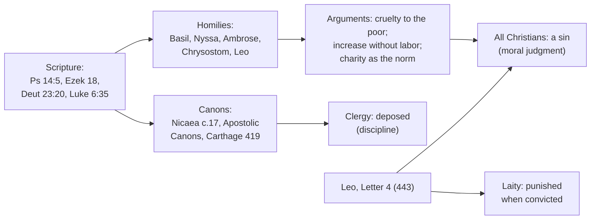

# Theology of Debt · Lesson 4.1: The Fathers against usury

> ⏱ ~15 min · Module 4: Usury: the prohibition · Builds on: [1.1 Lending in the covenant](01-01-lending-in-the-covenant.md), [1.4 Creditors under judgment](01-04-creditors-under-judgment.md), [`fundamental-theology` 5.5 The loci theologici](../../fundamental-theology/lessons/05-05-the-loci-theologici.md) · Unlocks: [4.2 From canon to council](04-02-from-canon-to-council.md), [4.3 Aquinas on usury](04-03-aquinas-on-usury-ii-ii-q78.md)

## Why this matters

Every later stage of the usury doctrine claims the Fathers. The medieval canonists cite them, Aquinas answers objections with them, and a millennium and a half later, when Noonan argues that the teaching changed and McCall argues that it stands, both sides are arguing about what the Fathers condemned. Module 3 read the Fathers on sin as a debt owed to God. This lesson reads them on money debts between people. You need three things from it: which texts the Fathers argued from, which arguments they used, and a distinction the whole module turns on. A **canon** that punishes clergy for lending at interest is one kind of act. A **moral judgment** that lending at interest is a sin for everyone is another.

## The idea

Remember that the Torah forbade interest (*neshek*) on a loan to a poor brother and allowed it from the foreigner ([1.1](01-01-lending-in-the-covenant.md)). The Fathers read that law through two further texts. The first is the Psalm's portrait of the man who may dwell on God's holy hill: he has not put out his money to usury (Ps 15:5, DR 14:5). The second is Ezekiel's portrait of the just man, who has not lent upon usury nor taken any increase, and of the wicked man who has, and "shall not live" (Ezek 18:8, 13; [1.4](01-04-creditors-under-judgment.md)). Christ's command then set the standard for the Christian lender:

> "lend, hoping for nothing thereby" (Luke 6:35, DR)

The fourth century added the pulpit. Basil preached on Psalm 14, Gregory of Nyssa preached *Against Usurers*, Ambrose wrote *On Tobias*, and Chrysostom returned to the theme in his homilies ([`patristics` 3.6](../../patristics/lessons/03-06-john-chrysostom.md)). The councils, meanwhile, legislated for one class of Christian only: the clergy.

## Source

Canon 17 of the Council of Nicaea (325), in *Nicene and Post-Nicene Fathers*, second series, vol. 14. The bracket is the translator's.

> "Forasmuch as many enrolled among the Clergy, following covetousness and lust of gain, have forgotten the divine Scripture, which says, 'He hath not given his money upon usury,' and in lending money ask the hundredth of the sum [as monthly interest], the holy and great Synod thinks it just that if after this decree any one be found to receive usury ... he shall be deposed from the clergy"

Read it slowly. **Whom it binds:** those "enrolled among the Clergy." Laypeople are not named. **What it forbids:** "the hundredth," one percent a month. That was the customary Roman rate: 12 percent a year simple, or about 12.7 percent compounded monthly ($1.01^{12} - 1 \approx 0.127$). The omitted middle of the canon also forbids evasions: a "secret transaction", demanding "the whole and one half" (the *hemiolia*, repayment of 150 percent of what was lent, often in kind), and "any other contrivance whatever for filthy lucre's sake." **Its ground:** Scripture, the Psalm. **Its sanction:** deposition. It declares nothing, and it teaches only by presupposing a moral judgment it never states.

## The argument

The Fathers' case against usury, reconstructed. The homilies of Basil and Nyssa and Ambrose's *On Tobias* are **paraphrased** throughout; this course relies on no public-domain English version of them.

1. **Scripture forbids it.** Ps 14:5 and Ezek 18 place usury among the marks of the man excluded from God's presence. Luke 6:34–35 asks more than the Law did: the Christian lends to those who cannot repay, and expects nothing back. Jerome, commenting on Ezekiel, widened "increase" to any surplus over the principal, in kind as well as in coin.
2. **It is cruelty to the poor.** Basil's homily pictures the borrower as a suppliant who comes in need, and the lender who answers need with a heavier burden. He plays on the Greek *tokos*, which means both "offspring" and "interest": money breeds, and the brood is the poor man's ruin. He even tells the poor to sell their goods or work with their hands rather than borrow. Nyssa likewise has the usurer profit from another's misfortune.
3. **It is increase without labor.** In Nyssa's picture the usurer sits at home and ploughs with pen and paper. He profits from time and another's need, not from any work of his own. *In words:* the Fathers did not yet argue that money is sterile (that is Aristotle via the scholastics, [4.3](04-03-aquinas-on-usury-ii-ii-q78.md)); they argued that profit extracted from need, without work, is unjust.
4. **Charity is the norm of a loan.** A loan is a work of mercy, and the only lawful return is from God. Leo the Great's sermon on the December fast (Sermon 17) turns the word around: let the lover of money practise a "holy usury" by lending to the Lord, since "usury of money is the death of the soul." (His Latin plays on *fenus* and *funus*, interest and funeral.)
5. **The exception is war.** Deuteronomy 23:20 allowed interest from the foreigner. Ambrose, in *On Tobias*, reads "foreigner" as the enemy, like Israel's ancient foes. In paraphrase: take interest only from one you could lawfully kill, because the right to exact interest reaches exactly as far as the right of war. Your brother is first every fellow in the faith, then every fellow under Roman law.
6. **So the clergy are deposed and all Christians sin.** Nicaea (325) deposes clerics who take usury, and the Apostolic Canons (c.44) depose those who will not stop. The African code (Carthage, 419, canon 5) forbids clergy usury of any kind and adds that what is blameworthy in laymen deserves still sharper censure in clerics. Leo's Letter 4 (443) grieves that laymen "who desire to be called Christians" practise it too, and orders the convicted punished.

**Mark the levels.** Nicaea canon 17 is a **disciplinary canon** of an ecumenical council. It binds clergy, its sanction is deposition, and as law it sits **off the ladder**. It is binding as discipline and could be changed by competent authority. It defines no doctrine, though its stated ground presupposes that usury is wrong. Leo's Letter 4 is a papal letter to the bishops of particular Italian provinces. Its penal clause is discipline, and its moral premise, that lay usury is sin, is taught with ordinary papal authority to those churches: **authentic magisterium, not a definition**. The Fathers' near-unanimous condemnation is **locus 6 by consent on a matter of morals** ([`fundamental-theology` 5.5](../../fundamental-theology/lessons/05-05-the-loci-theologici.md)), which makes it a heavy witness. Vincent's threefold test is a private theological tool, not itself magisterial ([`fundamental-theology` 5.1](../../fundamental-theology/lessons/05-01-vincent-of-lerins.md)). What the consensus *condemned*, whether any gain on a loan or gain wrung from need, is the question [5.4](05-04-did-the-usury-doctrine-change.md) argues. Do not settle it here. The heavier act, Vienne's decree, comes in [4.2](04-02-from-canon-to-council.md).

## Map of positions

## Worked examples

**Example 1: the clean case.** A presbyter in Asia Minor in 330 lends 100 solidi to a farmer and asks for one solidus a month. Canon 17 applies on its face: he is clergy, and he asks "the hundredth." He is deposed. Suppose he disguises it: he lends grain and asks back half as much again at harvest. The *hemiolia* clause and "any other contrivance" catch that too. Every element of the canon is satisfied, and its stated ground (the Psalm) explains why.

**Example 2: where the texts strain.** Gregory of Tours reports (*History of the Franks* III.34, as cited in the Schaff excursus to canon 17) that Bishop Desideratus of Verdun borrowed from King Theodebert to relieve his ruined city, promising repayment with lawful interest (*cum usuris legitimis*). Run the tools.

- **Nicaea** binds clergy as *lenders*. The bishop is a borrower, so the canon is silent.
- **The moral argument** condemns the lender who profits from need. Here the lender is a king, and the need is the bishop's flock. If the sin lies in the taking, the bishop cooperates in it (the tools for that are [`moral-theology` 4.2](../../moral-theology/lessons/04-02-double-effect-and-cooperation-as-catholic-method.md)'s); if it lies in exploiting need, the king is the one exploiting it.
- **Lawful interest** suggests that sixth-century Gaul distinguished a legal rate from forbidden usury. The same excursus notes that councils after Nicaea tended to soften the rule for lower clergy, and that, generally speaking, the early Church imposed no penalty on laymen.

The hard part is plain. The Fathers' preaching is near-unanimous, while the early canons bind clergy and practice varied. Carolingian councils later carry the ban to the laity by law ([4.2](04-02-from-canon-to-council.md)). The texts give no verdict on the bishop, and a reader who reports one has gone past them.

## Watch out

- **"Nicaea defined that interest is sinful" overstates.** It is a disciplinary canon for clergy. It defines nothing.
- **"The Fathers only condemned clerical lending" understates.** The canons target clergy, but the homilies, the African code and Leo's letter treat usury as a sin for every Christian.
- **Vincent's canon is not itself magisterial.** The Fathers' moral consensus is heavy by consent (locus 6), not by being "Vincentian."
- **Ambrose's foreigner rule is not an ethnic rule.** It turns on the right of war, not on being a Jew or a pagan. Its later use to frame Christian–Jewish lending belongs to [`church-history` 5.3](../../church-history/lessons/05-03-heresy-inquisition-and-the-jews.md) and [`history-of-debt` 2.2](../../history-of-debt/lessons/02-02-jewish-lenders-and-the-monti-di-pieta.md). Read it soberly.
- **Challoner's footnote to Deut 23:20 is not a Father.** The Douay note calling usury "a crying sin" is eighteenth-century commentary.

## One-liner

> The Fathers condemned usury from Scripture, as cruelty to the poor and gain without labor, and made charity the norm of a loan. The canons deposed clergy for it and defined nothing, while the moral judgment reached every Christian. What exactly "usury" named is the question the whole module inherits.

## Problems

**P1 (🟢)** *(Exegetical)* Leo the Great, Letter 4 (443), to the bishops of Campania, Picenum, Etruria "and all the provinces" (NPNF2-12):

> "IV. Usurious practices forbidden for clergy and for laity. This point, too, we have thought must not be passed over, that certain possessed with the love of base gain lay out their money at interest, and wish to enrich themselves as usurers. For we are grieved that this is practised not only by those who belong to the clergy, but also by laymen who desire to be called Christians. And we decree that those who have been convicted be punished sharply, that all occasion of sinning be removed."

(a) Whom does the passage bind, and which words decide it? (b) What does it name as the sin, and what as the remedy? (c) Give the level of the penal clause and of the moral premise, and name the act behind each. **Two sentences per part.**

**P2 (🟡)** *(Exegetical)* An invented case. Milan, 390. A Christian grain merchant asks his bishop whether he may take interest on a loan of grain to each of three borrowers: (i) a Christian farmer ruined by drought; (ii) a pagan trader from Gaul who lives peacefully in the city and wants the grain for resale; (iii) the envoy of a tribe at war with the empire, who is buying supplies during a short truce. (a) Apply Ambrose's foreigner rule from *On Tobias*, as the lesson paraphrased it, to each borrower. (b) Where does the rule stop giving a verdict? **120 words or fewer in total.**

**P3 (🔴)** *(Exegetical)* An **invented** leaflet paragraph, not the words of any real person:

> "At Nicaea in 325 the whole Church infallibly defined that charging any interest is a mortal sin for every Christian. That is why the Council deposed lay moneylenders. And since the Church today allows interest, it has contradicted a dogma of an ecumenical council."

Name **four** errors and correct each from this lesson, giving the correct level where one is at stake. **150 words or fewer.**

Solutions

**P1** *(Exegetical)*

**Must hit, strict (a):** it binds **clergy and laity** alike. The deciding words are "not only by those who belong to the clergy, but also by laymen who desire to be called Christians" (and the heading, "for clergy and for laity"). It is addressed to bishops of particular provinces, who are to enforce it.

**Must hit, strict (b):** the sin is laying out money at interest to enrich oneself, driven by "love of base gain"; the lender is called a usurer. The remedy is sharp punishment of **the convicted**, so that "all occasion of sinning be removed." The punishment is remedial discipline, not a doctrinal pronouncement.

**Must hit, strict (c):** the **penal clause is discipline**: a papal act of governance for those provinces, binding as law and off the ladder. The **moral premise**, that usury by laymen is a sin, is taught by the same papal letter as **authentic magisterium** (rung 3) to particular churches. It is **not a definition**.

**Wrong turns:** reading "laymen who desire to be called Christians" as excluding lay Christians, when it reproaches them for falling short of the name they claim. Calling the letter a dogmatic definition because a pope wrote it. Calling the moral premise "mere discipline," which understates it.

**Model answer:** (a) Clergy and laity, decided by "not only ... clergy, but also ... laymen." (b) Lending at interest for base gain is the sin; punishing the convicted is the remedy. (c) The penalty is papal discipline for those provinces; the premise that lay usury is sin is authentic papal teaching to those churches, not a definition.

**P2** *(Exegetical)*

**Must hit, strict (a):** (i) **No interest.** A Christian is a brother, and he is also the needy borrower the homilies protect. (ii) **No interest.** A peaceful pagan living under Roman law is a brother in Ambrose's second sense, and not an enemy one may lawfully kill, so the right of war does not reach him. Being a non-Christian is not the test. (iii) **The rule's permission applies on its face.** His people are at war with the empire, so the right of war, and with it the "right of usury," extends to him.

**Must hit, strict (b):** the **truce**. The rule ties interest to the right of war, and a truce suspends hostilities without ending the war. Ambrose's text does not say whether a truce suspends the right. A second gap: (ii) wants the grain for resale, not from need, and the rule does not ask why the borrower borrows.

**Wrong turns:** allowing interest from (ii) because he is a pagan or a foreigner, which treats the rule as ethnic or religious when it turns on war. Refusing (iii) on grounds of general charity, which answers a different question from the one the rule settles.

**Model answer:** (i) and (ii) may not be charged: the farmer is a brother, and the peaceful Gaul lives under Roman law and is no enemy one may lawfully kill, whatever his religion. (iii) falls under the exception, since his people are at war with the empire. The rule stops at the truce, because it does not say whether suspended hostilities suspend the right, and it never asks whether the borrower borrows from need or for profit.

**P3** *(Exegetical)*

**Must hit, strict (four of):**
1. **"Infallibly defined"**: canon 17 is a **disciplinary canon**. It defines nothing, and as law it is off the ladder.
2. **"Charging any interest"**: the canon names the hundredth, the *hemiolia* and any contrivance for filthy lucre. What "usury" covers is the open question of 5.4.
3. **"For every Christian" / "deposed lay moneylenders"**: the canon binds **clergy**, and deposition is a clerical penalty. Laymen are reached by the moral teaching (the homilies; Leo, Letter 4) and not by this canon.
4. **"Mortal sin"**: the canon grades no sin. It names covetousness and sets a penalty.
5. **"Contradicted a dogma"**: a disciplinary canon is not a dogma, and discipline can change. Whether the *moral teaching* changed or developed is **freely disputed** (5.4) and is not settled by this leaflet.

**Wrong turns:** "correcting" the leaflet by saying the Fathers never thought usury sinful, which understates. Settling 5.4 in the correction, in either direction.

**Model answer:** Nicaea's canon 17 is a disciplinary canon, not an infallible definition. It deposes *clergy* who take the hundredth, the *hemiolia* or any disguised gain, so it cannot have deposed lay lenders; laymen were reached by the Fathers' moral teaching and by Leo's letter, not by the canon. It calls nothing a "mortal sin." And since it is discipline, not dogma, later practice cannot "contradict a dogma" of Nicaea. Whether the moral teaching behind it changed is the freely disputed question of 5.4.

## Flashback

**From Lesson [3.5](03-05-the-christian-jubilee-and-the-treasury.md) (The Christian Jubilee and the treasury of the Church):** *(Exegetical.)* Level assignment. Give each claim its level (defined; authentic magisterium; scholastic theology; discipline with no rung; or no magisterial level at all) and **name the act, or the absence of one, that fixes it**. **Two sentences per item.**

(a) After guilt and eternal punishment are forgiven, a debt of temporal punishment can remain, to be discharged in this life or in purgatory.
(b) The surplus of Christ's and the saints' satisfactions exceeds the whole debt of punishment owed by everyone now living (the Supplement, q.25 a.1).
(c) The Holy Year is held every twenty-five years.
(d) "Thou shalt not go out from thence till thou repay the last farthing" (Matthew 5:26, Douay-Rheims) describes the debt of punishment paid after death.

Solution

**Must hit, strict:** (a) **Defined.** Trent, Session VI, canon 30, anathematizes anyone who says no debt of temporal punishment remains for any penitent; calling it a pious opinion understates it. (b) **Scholastic theology.** The act is a theological article, compiled after Aquinas's death from his *Sentences* commentary. Papal teaching adopted the treasury's core (*Unigenitus*, *Indulgentiarum Doctrina*, CCC 1476–1477) but not this quantitative step, so the treasury's rung-3 weight does not transfer to it. (c) **Discipline, no rung.** The interval is changeable papal law: Boniface VIII envisaged a hundred years (1300), Clement VI's *Unigenitus* cut it to fifty (1343), and the later fifteenth century set twenty-five. (d) **No magisterial level as exegesis.** No act defines this reading; it is the tradition's widely received use of the verse, and purgatory itself is taught elsewhere ([`creation-grace-last-things`](../../creation-grace-last-things/syllabus.md)).

**Wrong turns:** lifting (b) to authentic teaching because the treasury is taught at rung 3. Calling (c) doctrine because popes decreed it, or because fifty echoes Leviticus. Citing (d) as a defined interpretation, or dismissing it as a modern invention. Understating (a).

**Model answer:** (a) Defined: Trent VI canon 30 anathematizes the denial that any temporal debt remains. (b) Scholastic theology: the Supplement argues it, and papal teaching took up the treasury without endorsing this measurement. (c) Discipline: the interval was set and reset by papal law, from a hundred years to fifty to twenty-five, and sits on no rung. (d) No defined exegesis: the reading is the tradition's use of the verse, and no act of the magisterium fixes it.

## Connections

- **Backward:** [1.1](01-01-lending-in-the-covenant.md) gave *neshek*, the poor brother and the foreigner clause that Ambrose reinterprets. [1.4](01-04-creditors-under-judgment.md) read Ezekiel 18 as covenant judgment. [3.2](03-02-the-fathers-alms-satisfaction-and-ransom.md) showed the same Fathers turning alms into a loan to God, the root of Leo's "holy usury."
- **Forward:** [4.2](04-02-from-canon-to-council.md) carries the ban to the laity by law and reaches Vienne. [4.3](04-03-aquinas-on-usury-ii-ii-q78.md) replaces the Fathers' moral pictures with an argument from ownership. [5.4](05-04-did-the-usury-doctrine-change.md) asks what their consensus condemned. On the card: [usury](../reference.md#usury), [Nicaea canon 17](../reference.md#nicaea-canon-17), [the patristic arguments](../reference.md#the-patristic-arguments-against-usury), [the war exception](../reference.md#the-war-exception), [the levels](../reference.md#the-levels-in-this-course).
- **Sideways:** the Fathers as theologians are [`patristics`](../../patristics/syllabus.md)'s: [Basil 3.2](../../patristics/lessons/03-02-basil-the-great.md), [the Gregories 3.3](../../patristics/lessons/03-03-the-two-gregories.md), [Ambrose 4.1](../../patristics/lessons/04-01-ambrose-of-milan.md), [Leo 5.2](../../patristics/lessons/05-02-leo-the-great.md). Nicaea as an event is [`church-history` 2.1](../../church-history/lessons/02-01-nicaea-and-the-imperial-church.md). In the debt thread, [`history-of-debt` 2.1](../../history-of-debt/lessons/02-01-commerce-around-the-prohibition.md) shows the commerce that grew up around the ban, and [`philosophy-of-debt`](../../philosophy-of-debt/syllabus.md) tests whether interest is unjust without the Fathers' premises.
