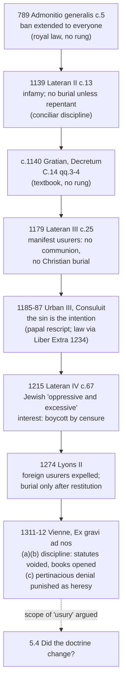

# Theology of Debt · Lesson 4.2: From canon to council

> ⏱ ~15 min · Module 4: Usury: the prohibition · Builds on: [4.1 The Fathers against usury](04-01-the-fathers-against-usury.md) · Unlocks: [4.3 Aquinas: *Summa Theologiae* II-II q.78](04-03-aquinas-on-usury-ii-ii-q78.md)

## Why this matters

In [4.1](04-01-the-fathers-against-usury.md) the canons bound clergy: Nicaea deposed a cleric who took "the hundredth", while the Fathers preached against lay usury as a sin. Between 789 and 1312 that changed. The ban became law for everyone, then carried penalties, then acquired a papal account of *where the sin lies*. Finally an ecumenical council said that to deny it pertinaciously was heresy. Every later argument about whether the doctrine "changed" (5.4) turns on what these texts are. Some are laws, and law can be repealed. One is a declaration about faith, which cannot be. This lesson teaches you to tell them apart.

## The idea

A church does two different things with a moral conviction. It can **teach** it: *usury is a sin*. And it can **legislate** around it: *manifest usurers shall not be buried in consecrated ground*. The law presupposes the teaching, but the two are not the same act. The law has a sanction, a jurisdiction and a shelf life. The teaching has a level on [the ladder](../reference.md#the-levels-in-this-course).

Read the medieval series with one question per text: **is this act imposing a penalty, or declaring what must be believed?** Most of it is penalty. The penalties get steadily heavier, from exclusion at death to expulsion to the voiding of city statutes. That escalation tells you the Church thought the teaching was settled; it does not by itself raise the teaching's level. Then, once, at Vienne, the council does something of a different kind.

## Source

Two short texts carry the lesson's two turns.

**The extension to all (789).** Charlemagne's *Admonitio generalis*, issued at Aachen, chapter 5 (MGH, *Capitularia* I, no. 22; the lesson's translation of the Latin):

> Likewise in the same council, and in the decrees of Pope Leo, and also in the canons called apostolic, just as the Lord himself commanded in the law, lending anything at usury is altogether forbidden to everyone.

"The same council" is Nicaea, cited in the chapter before. Read the grammar: the king cites a clerical canon (Nicaea 17), Leo's letter and the Law, and draws a conclusion addressed to *omnibus*, everyone. The clerical discipline has been read as evidence of a universal moral norm.

**The text that located the sin (Luke 6:35, Douay-Rheims):**

> But love ye your enemies: do good, and lend, hoping for nothing thereby: and your reward shall be great...

The Vulgate's *mutuum date, nihil inde sperantes* reads, to a canonist, like a legal clause. "Hoping" names an inner act. Once a pope read it that way, the sin could be committed without a contract.

## The argument

1. **By 789 the prohibition bound laity in law**, on the ground that Scripture and the canons forbid usury to all. *In words:* a clerical discipline became a norm for every Christian, and a king enforced it.
2. **Gratian's *Decretum* (c. 1140) gathered the texts for the schools** (Causa 14, questions 3–4). He reinforced the rule that [usury](../reference.md#usury) is anything demanded beyond the principal (*sors*). He was a teacher compiling authorities, not a legislator; his collection became the textbook of canon law.
3. **The general councils attached penalties.** Lateran II (1139) canon 13 condemns the greed of usurers as forbidden by both Testaments. It declares them infamous for life and denies them Christian burial unless they repent. Lateran III (1179) canon 25 complains that many practise usury as if it were permitted. It denies *manifest* usurers communion at the altar and, if they die unrepentant, Christian burial. A cleric who admits or buries them must give back what he received and is suspended until he makes satisfaction.
4. **A pope located the sin in the intention.** See [*Consuluit*](../reference.md#consuluit) below.
5. **Lyons II (1274) turned from persons to places.** Its constitution *Usurarum voraginem* orders Lateran III observed. It forbids any community or person to let houses to usurers from outside the territory, and orders notorious usurers expelled within three months. The next constitution refuses burial to a notorious usurer until restitution is made or pledged, and voids his will otherwise. (They are numbered 26 and 27 in the standard modern edition.)
6. **Vienne (1311–12) struck at the civic law and at the doctrine.** See [Vienne's decree](../reference.md#the-council-of-vienne-on-usury) below.

∴ **The sequence moves from penalty to declaration.** Premises 1–5 enforce a teaching they presuppose. Premise 6 contains one clause of a different kind.

### Consuluit

Urban III (pope 1185–87) answered a priest's question in the decretal *Consuluit*, later placed in the *Liber Extra* (X 5.19.10), which Gregory IX promulgated as universal law in 1234. The question was about a man who lends with no agreement for more, but would not lend unless he expected more back. It also asked about a merchant who charges more for goods sold on credit. The answer: both act wrongly **because of the intention of gain**, for Luke 6:35 says to lend hoping for nothing. *In words:* usury is a sin of the will before it is a clause in a contract. That is why a confessor could find usury where a judge found no contract.

### Lateran IV canon 67

The canon has to be taught as it is. Lateran IV (1215) says that as Christians are restrained from usury, Jewish lenders are exhausting Christian resources, and its language about Jews is hostile. Its remedy is aimed at **oppressive and excessive** interest. Christians are to be compelled by censure to cut off dealings with Jewish lenders who take it, until those lenders make satisfaction. Princes are told not to punish Christians for the boycott. Jews holding property that once paid tithes must make them good to the churches. Two things follow. The canon did not bind Jews by the Christian prohibition; it policed the *degree* of their lending. So in effect it tolerated moderate Jewish interest while condemning any Christian interest. And it stands next to canon 68 on distinctive dress. The institution and its consequences are [`history-of-debt` 2.2](../../history-of-debt/lessons/02-02-jewish-lenders-and-the-monti-di-pieta.md) and [`church-history` 5.3](../../church-history/lessons/05-03-heresy-inquisition-and-the-jews.md). The Church's own later judgment on the hostility behind such legislation is *Nostra Aetate* 4 (1965), which deplores hatred and persecution of Jews at any time and from any source.

### The Council of Vienne on usury

The decree *Ex gravi ad nos* (Clementines 5.5, sole chapter; decree 29 in the modern numbering) has three parts. (a) Communities had statutes, sometimes sworn, that compelled debtors to pay usury and obstructed its recovery. Officials who make, keep or apply such statutes are excommunicated, and must strike them from the books within three months. (b) Money-lenders can be compelled by censure to open their account books. (c) Whoever **pertinaciously asserts that practising usury is not a sin** is to be punished as a heretic, and local ordinaries and inquisitors are to proceed against suspects as against suspected heretics. Note what (c) targets: an *assertion*, held obstinately. Lending at usury was a grave sin; denying that it was a sin was heresy.

### Disciplinary canon and doctrinal declaration

A **disciplinary canon** is law: it binds those under the legislator's jurisdiction, carries a sanction, and can be changed by the same authority. It presupposes moral teaching but does not raise that teaching up the ladder ([`fundamental-theology` 4.5](../../fundamental-theology/lessons/04-05-reading-a-documents-weight.md)). A **doctrinal declaration** says what belongs to faith, and is graded by the ladder ([`fundamental-theology` 4.4](../../fundamental-theology/lessons/04-04-the-ladder-of-doctrinal-authority.md)). One document can hold both: Vienne's (a) and (b) are discipline; its (c) is not.

**Mark the levels.** The *Admonitio generalis* is royal legislation: no magisterial act, no rung. Gratian is a private compilation: a canonist's authority, below the seam. The canons of Lateran II, III and IV and of Lyons II are [**disciplinary decrees of general councils**](../reference.md#disciplinary-canon-and-doctrinal-declaration): binding law when enacted, not doctrinal definitions, and changeable as law. The moral teaching they presuppose, that usury is sin, was the Church's constant ordinary teaching. *Consuluit* is a papal rescript made universal law. Its reading of Luke 6:35 is authentic papal teaching given in legal form; it defines nothing. **Vienne's clause (c)** is the heaviest act in the series. An ecumenical council treats pertinacious denial that usury is sinful as heresy, which places *usury is a sin* within the faith, and this must not be demoted to "mere discipline". What the decree does **not** settle by its own words is what "usury" denotes: profit from a loan as such, or any interest whatever. That scope is what [5.4](05-04-did-the-usury-doctrine-change.md) argues, and no lesson settles it by fiat.

## Timeline

Every box up to G is law or a textbook; only H(c) declares something about faith.

## Worked examples

**Example 1 (clean): sort Lateran III canon 25.** *Act:* a general council's canon. *What it does:* excludes manifest usurers from communion and burial and suspends clergy who bury them. *Kind:* discipline. It names a sanction and a class of persons, and "manifest" is a juridical test (public notoriety), not a moral one. A secret usurer was no less a sinner but fell outside the canon. *Level:* binding law then, not a definition. The moral premise it cites, that usury is forbidden in both Testaments, is constant teaching it presupposes. The canon does not define it.

**Example 2 (hard): a banker's statute in 1315.** A city statute requires debtors to pay agreed interest of 10 percent on loans from licensed bankers. A magistrate enforces it. He privately holds that such lending is sinful but that the city needs credit. Run Vienne. Part (a) catches him squarely: he knowingly applies a statute compelling usury, so he falls under excommunication. Part (c) does not: he asserts nothing, let alone pertinaciously. Now vary it. A jurist writes that "a moderate charge on a merchant's loan is no sin at all". Does (c) reach him? It depends on whether his charge is *usury* in the decree's sense. If it is profit on the loan as such, he is asserting the heretical proposition. If the charge is for a real loss or risk, he may be describing something the later tradition never called usury ([4.4](04-04-the-extrinsic-titles.md)). The decree's weight is plain; its reach depends on a definition it assumes and does not give. That is where the strain sits.

## Watch out

- **Overstating a canon.** You might think Lateran III's refusal of burial "defined" that usury is a mortal sin. A penalty presupposes the judgment; it is disciplinary law, not a definition.
- **Understating Vienne.** You might file Vienne with the other canons as "medieval discipline, since changed". Clause (c) treats a doctrinal proposition as belonging to faith. Demoting it is as much an error as stretching its scope to "all interest".
- **Heresy attaches to the assertion, not the practice.** A usurer was a public sinner; the heretic was the one who pertinaciously said usury is no sin.
- **[Lateran IV](../reference.md#lateran-iv-canon-67)'s "excessive" is not a moderate-interest rule for Christians.** It governed Jewish lenders, who were not under the Christian prohibition. Christian *usura* remained any gain on the loan ([`history-of-debt` 2.1](../../history-of-debt/lessons/02-01-commerce-around-the-prohibition.md)).

## One-liner

> For five centuries the Church legislated penalties around a teaching it took as settled; at Vienne it said, once, that denying the teaching was heresy, and left the word "usury" for later centuries to define.

## Problems

**P1 (🟢) *(Exegetical.)*** Apply *Consuluit*'s test (the intention of gain, Luke 6:35) to three invented cases, **one sentence each**, and say in a fourth sentence where the decretal stops giving a verdict.
(i) Marta lends 200 florins interest-free to a wealthy guild master. She would not have lent at all except that he always sends lenders a generous present.
(ii) Paolo lends 200 florins to a neighbour expecting nothing. On repaying, the neighbour, unprompted, gives him a cask of wine.
(iii) Paolo, pleased, lends again to the same neighbour, now half-expecting another cask, though he would lend anyway.

**P2 (🟡) *(Exegetical.)*** Assign each act its kind and level, **naming the act that fixes it**, in **two sentences each**: (a) the *Admonitio generalis* c.5 (789); (b) Lateran IV canon 67 (1215); (c) Lyons II's *Usurarum voraginem* (1274); (d) *Consuluit* as it stands in the *Liber Extra*.

**P3 (🔴) *(Exegetical.)*** An invented history blog says:

> "Until 1311 the usury rules were only clerical discipline, which is why Lateran IV could let Jews lend at interest. Then the Council of Vienne infallibly declared that charging any interest at all is heresy — so every modern bank manager is, by the Church's own dogma, a heretic."

Identify **four** errors and correct each. **150 words or fewer.**

Solutions

**P1** *(Exegetical)*

**Must hit, strict:** (i) usury in *Consuluit*'s sense: she lends *for* the expected gain, and would not lend without it, which is the decretal's own case. (ii) not usury: no intention of gain when lending, and the gift is unrequested. (iii) the hard one: he would lend anyway, so the gain is not the *reason* for lending, yet he now "hopes" for something. *Consuluit* condemns lending with the intention of gain and cites "hoping for nothing". It does not say whether a hope that is not the motive counts. That is the stopping point.
**Wrong turns:** calling (i) licit because there is no contract; the decretal exists precisely to reach that case. Calling (ii) usury because money came back with more; the intention test clears it. Asserting a confident verdict on (iii) from *Consuluit* alone.
**Model answer:** (i) Usury: Marta lends because of the present she expects, which is the intention of gain *Consuluit* condemns even without a contract. (ii) Not usury: Paolo lent hoping for nothing, and an unrequested gift afterwards is not a gain he sought. (iii) Doubtful: his lending is not motivated by the wine, but he now hopes for it. (iv) *Consuluit* locates the sin in lending for gain; it does not say whether a hope that is not the motive already makes the loan usurious, which later theology addressed by distinguishing a debt of justice from a debt of friendship (ST II-II q.78 a.2 ad 2, read in [4.3](04-03-aquinas-on-usury-ii-ii-q78.md)).

**P2** *(Exegetical)*

**Must hit, strict:** (a) royal capitulary: law for the Frankish realm, **no magisterial rung**; it cites Nicaea, Leo and the Law as its grounds. (b) disciplinary canon of a general council: a sanction (boycott by censure) on dealings with Jewish lenders taking oppressive and excessive interest; **law, not a definition**. It does not teach that moderate interest is licit. (c) disciplinary constitution of a general council: expulsion of foreign usurers, penalties of suspension, excommunication and interdict; **law, not a definition**. (d) papal rescript made universal law by Gregory IX's promulgation of the *Liber Extra* (1234). Its reading that the intention of gain is the sin is **authentic papal teaching in juridical form**, not a definition.
**Wrong turns:** calling any of these "dogma" because the penalties are severe. Calling (d) merely a private letter: its incorporation made it law for the whole Latin Church. Reading (b) as permitting Christian interest below "excessive".
**Model answer:** (a) Charlemagne's capitulary of 789 is royal law extending the ban to everyone. It carries no magisterial level, only the authorities it cites. (b) Lateran IV c.67 is a disciplinary canon penalizing oppressive Jewish interest through a boycott. It binds as law and defines nothing. (c) Lyons II's constitution is disciplinary law expelling foreign usurers under graded censures. Its authority is that of a general council legislating, not defining. (d) *Consuluit* is Urban III's answer to a case, made universal law in the *Liber Extra* of 1234. Its teaching that the intention of gain is the sin is authentic papal teaching in legal form, not a definition.

**P3** *(Exegetical)*

**Must hit, strict:** any four of: (1) not "only clerical": the ban bound laity in law from 789, and Lateran II and III penalized usurers generally while presenting usury as forbidden by both Testaments; (2) Lateran IV did not "let" Jews lend. Jews were outside the Christian prohibition, and the canon penalized *oppressive and excessive* interest by a Christian boycott; (3) Vienne's heresy clause targets **pertinacious assertion that usury is not a sin**, not the act of charging; (4) "any interest at all" settles by fiat the scope of "usury" that the decree does not define (5.4 argues it); (5) "heretic" requires pertinacious denial, not a job.
**Wrong turns:** "correcting" the blog by calling Vienne mere discipline; clause (c) is doctrinal in weight. Defending Lateran IV as benign; its language is hostile, and it tolerated in Jews what it condemned in Christians.
**Model answer:** First, lay usury was forbidden in law from 789, and Lateran II and III penalized usurers as such, not clerics only. Second, Lateran IV granted no licence. Jews were not bound by the Christian prohibition, and the canon imposed a boycott on oppressive and excessive Jewish interest. Third, Vienne made heresy of the *pertinacious assertion* that usury is not sinful; practising usury was a grave sin, not heresy. Fourth, the decree does not define "usury". Whether it means profit on a loan as such or any interest is the disputed question, so the blog's "any interest" is its own addition. A bank manager asserts nothing by lending.

## Flashback

**From Lesson [3.6](03-06-luther-trent-and-the-reform-of-indulgences.md) (Luther, Trent and the reform of indulgences):** *(Exegetical.)* Close reading. Luther, *Ninety-Five Theses* (1517), theses 5, 21 and 34 (Philadelphia edition, 1915):

> 5. The pope does not intend to remit, and cannot remit any penalties other than those which he has imposed either by his own authority or by that of the Canons.
>
> 21. Therefore those preachers of indulgences are in error, who say that by the pope's indulgences a man is freed from every penalty, and saved;
>
> 34. For these "graces of pardon" concern only the penalties of sacramental satisfaction, and these are appointed by man.

(a) What power over penalties does Luther still grant the pope here, and how does that differ from the Apology's position of 1531? (b) Which Roman act, the following year, taught against the limit in theses 5 and 34, and at what level? (c) Thesis 21 bundles two claims about the preachers' error. On which does Catholic teaching agree with Luther, and on which not? **Two sentences per part.**

Solution

**Must hit, strict:** (a) He grants the pope power to remit the penalties the pope or the canons **imposed**, penalties "appointed by man"; he denies only that indulgences reach any debt owed to God. The Apology goes further: canonical satisfactions are not necessary by divine law for remitting guilt, eternal punishment or purgatory's punishment (§50), and the keys have no power over purgatory (§78), so 1517 should not be read as 1531. (b) **Leo X, *Cum postquam*** (9 November 1518), addressed to Cajetan: the pope, by the keys, remits the temporal punishment due to actual sins, drawing on the superabundant merits of Christ and the saints. It is **authentic papal teaching, rung 3**, not a definition; Trent later defined the Church's power to grant indulgences and their usefulness (Session XXV), but not their scope in these terms and not the treasury. (c) **Agreement:** no indulgence saves or remits guilt; guilt is not in view in *Cum postquam*, and Trent itself reformed the preaching and abolished "evil gains". **Disagreement:** Roman teaching held that an indulgence can remit temporal punishment owed before God, and a plenary one the whole of it, so "freed from every penalty" is not an error on Rome's account if it means temporal punishment.
**Wrong turns:** reading the theses as already rejecting all indulgences or all satisfaction. Promoting *Cum postquam* to a definition, or citing Trent XXV as having defined that indulgences reach purgatory. Treating thesis 21 as wholly anti-Catholic, or wholly conceded.
**Model answer:** (a) In 1517 Luther still lets the pope remit penalties imposed by himself or the canons, and denies only that indulgences reach a debt before God; the Apology later denies that satisfactions are required by divine law at all and that the keys reach purgatory. (b) *Cum postquam* (1518) taught that the pope remits temporal punishment due for actual sins from the merits of Christ and the saints. That is authentic papal teaching, not a definition. (c) Rome agrees that indulgences do not save or forgive guilt, and Trent condemned the gains that bred such preaching. It disagrees that a plenary indulgence cannot remit the whole temporal punishment owed to God.

## Connections

- **Backward:** [4.1](04-01-the-fathers-against-usury.md) supplied Nicaea canon 17 and Leo's letter, the two authorities the *Admonitio generalis* turns into a law for everyone. The ladder and the discipline/doctrine sort are [`fundamental-theology` 4.4–4.5](../../fundamental-theology/lessons/04-04-the-ladder-of-doctrinal-authority.md).
- **Forward:** [4.3](04-03-aquinas-on-usury-ii-ii-q78.md) gives the argument these canons presuppose. [4.4](04-04-the-extrinsic-titles.md) supplies what a charge must be to fall outside "usury". [5.4](05-04-did-the-usury-doctrine-change.md) makes Vienne's scope the pressure point.
- **Sideways:** in the debt thread, [`history-of-debt` 2.1–2.2](../../history-of-debt/lessons/02-02-jewish-lenders-and-the-monti-di-pieta.md) shows what lenders, cities and Jewish communities did under these canons. [`philosophy-of-debt`](../../philosophy-of-debt/syllabus.md) asks whether the ban was just. [`economics-of-debt`](../../economics-of-debt/syllabus.md) asks what a credit market does when interest is forbidden. Lateran IV as an event is [`church-history` 5.1](../../church-history/lessons/05-01-papal-monarchy-innocent-iii-to-boniface-viii.md).
