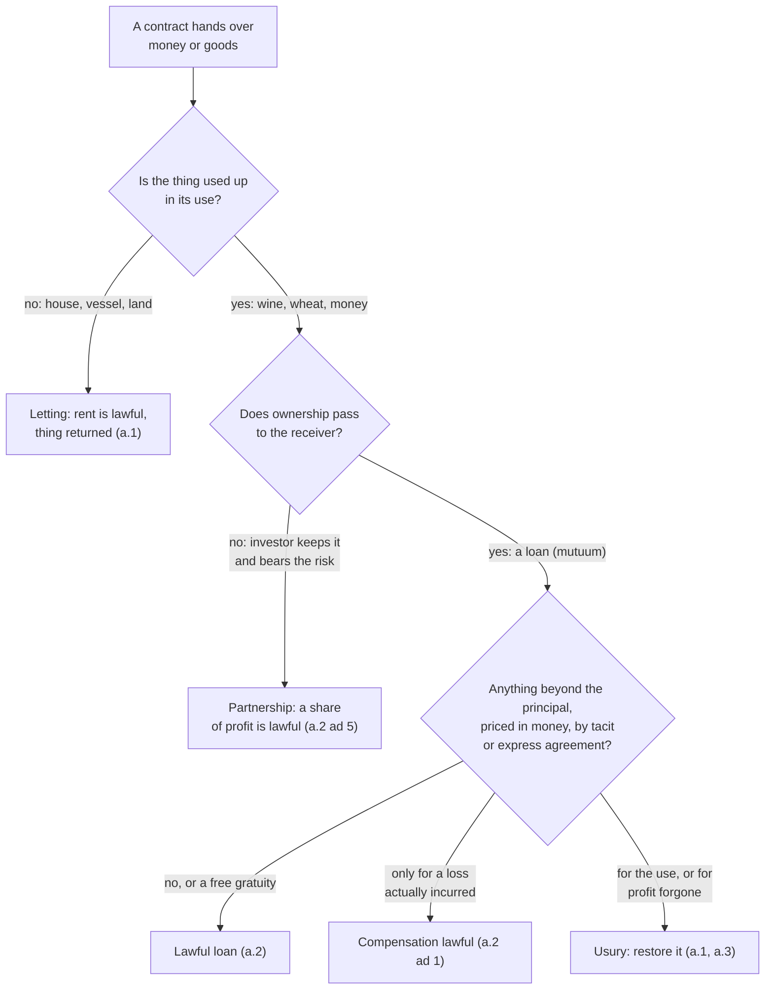

# Theology of Debt · Lesson 4.3: Aquinas: *Summa Theologiae* II-II q.78

> ⏱ ~15 min · Module 4: Usury: the prohibition · Builds on: [4.1 The Fathers against usury](04-01-the-fathers-against-usury.md), [4.2 From canon to council](04-02-from-canon-to-council.md) · Unlocks: [4.4 The extrinsic titles](04-04-the-extrinsic-titles.md), [4.5 Contracts that are not loans](04-05-contracts-that-are-not-loans.md)

## Why this matters

The Fathers condemned usury as cruelty to the poor ([4.1](04-01-the-fathers-against-usury.md)), and the canons turned that into penalties ([4.2](04-02-from-canon-to-council.md)). Neither said exactly *what* makes a loan's surplus unjust. Aquinas did, around 1271–72, in four short articles. The extrinsic titles, the census, the triple contract and *Vix Pervenit* are all built out of its distinctions, or against them. Read the whole question once, carefully, and the rest of the module becomes legible ([`thomistic-synthesis` 1.2](../../thomistic-synthesis/lessons/01-02-reading-a-whole-question.md) on how to read a whole question).

## The idea

Lend a neighbour your house for a year. He lives in it and hands it back. You may charge rent, because the house survives its use. Using it and owning it are two things, so you can sell one and keep the other.

Now lend him a jar of wine. Its only use is to be drunk. To grant the use *is* to hand over the wine, so the loan makes it his. When he returns an equal jar, you have everything you gave. Ask for a second payment "for the use", and you are charging for something that no longer exists apart from the wine already repaid.

Aquinas's claim is that money, for this purpose, is wine, not a house. Its proper use is to be spent. Everything else in q.78 is sorting. What counts as an "extra" (a.2)? What may a lender recover without taking one (a.2 ad 1)? What must a usurer give back (a.3)? Does the borrower sin (a.4)?

## Source

ST II-II q.78 a.1, the body (English Dominican Province, 1920). The argument opens with wine and wheat, not coins:

> "Accordingly if a man wanted to sell wine separately from the use of the wine, he would be selling the same thing twice, or he would be selling what does not exist, wherefore he would evidently commit a sin of injustice."

Two different charges are joined by "or". *Selling the same thing twice* assumes the use is already in the price of the wine. *Selling what does not exist* assumes there is no separable use to sell. Either way the verdict is **injustice**, not unkindness. That is the shift from the Fathers. The victim need not be poor; the equality of the exchange has been broken, whoever the borrower is.

## The argument

**a.1 in one paragraph** (its step-by-step reconstruction is left for the module's boss problem, and its soundness is tested as philosophy in [`philosophy-of-debt`](../../philosophy-of-debt/lessons/02-02-aquinas-selling-what-does-not-exist.md) 2.2). Some things are used by being consumed, like wine, wheat and, according to Aristotle as Aquinas reads him, money, whose proper use is to be spent in exchange. For such things the use cannot be counted apart from the thing, so lending one of them transfers its ownership. A lender who takes back an equal amount has been fully repaid. A charge for the "use" on top of that is a price for nothing, which is unequal and therefore unjust. Things whose use leaves them standing, like a house, can be let for rent. [Usury](../reference.md#usury) is the payment taken for the use of money lent. Like any ill-gotten gain, it must be restored.

What the replies add:

1. **The loan is a transfer, and risk goes with ownership.** In a [*mutuum*](../reference.md#mutuum) the money becomes the borrower's. He holds it at his own risk and must repay it all whatever happens (a.2 ad 5). Repayment of exactly what was lent satisfies the equality of justice (a.1 ad 5). *In words:* the lender's claim is fixed and safe, so there is nothing left for a surcharge to pay for.
2. **Usury is a sin against [commutative justice](../reference.md#commutative-justice).** This is the justice of exchanges between persons, measured by equality of thing to thing ([`moral-theology` 3.3](../../moral-theology/lessons/03-03-the-cardinal-virtues-and-the-gifts.md)). [Restitution](../reference.md#restitution) is that same justice's act: putting a person back in possession of what is his (q.62 a.1). That is why a.1 ends with restoring, and why a.3 exists.
3. **Deuteronomy 23 is toleration, not permission** (a.1 ad 2). The Law forbade usury to a brother and allowed it from a foreigner "not as though it were lawful", but to avoid a greater evil. Under the Gospel every man is a neighbour, so the prohibition is universal. The promise in Deut 28:12 that Israel would "fenerate" to the nations means only that it would lend. The hard part should be taught as hard: the greater evil Aquinas names is a charge of avarice against the Jews, drawn from Isaiah 56:11. That reading had a long history in how Christians spoke of Jewish lenders ([`church-history` 5.3](../../church-history/lessons/05-03-heresy-inquisition-and-the-jews.md); the institutions are [`history-of-debt` 2.2](../../history-of-debt/lessons/02-02-jewish-lenders-and-the-monti-di-pieta.md)). Civil law's tolerance of usury is read the same way (ad 3). Leaving a sin unpunished does not make it just.
4. **"Money" includes anything priced in money** (a.2). A gift, a service or a promise to lend back (ad 4) is usury if it is required by tacit or express agreement. A gratuity given freely is lawful. So is gratitude and goodwill, which no one can price.
5. **Loss incurred, yes; profit forgone, no** (a.2 ad 1). The lender may contract for compensation for a loss he actually suffers, since that avoids a loss rather than selling the use of money. Not for the gain he would have made, because "he must not sell that which he has not yet and may be prevented in many ways from having". These are the later [*damnum emergens*](../reference.md#damnum-emergens) and [*lucrum cessans*](../reference.md#lucrum-cessans). The second was admitted by later theologians under conditions ([4.4](04-04-the-extrinsic-titles.md)).
6. **Partnership keeps ownership, so it may share profit** (a.2 ad 5). Money entrusted to a merchant stays the investor's, at the investor's risk, and he may claim part of its profits ([4.5](04-05-contracts-that-are-not-loans.md)). A pledge's fruits must be counted toward repayment, or they are usury (ad 6).
7. **Restitution follows the kind of thing** (a.3). If usury took money, wheat or wine, the usurer restores what he took, plus any loss his holding it caused. He keeps what he earned with it, since that is the fruit of his own industry, not of the thing. If it took a house or land, he restores the property *and* its fruits, which grew on another man's property. Goods bought with usurious money are his, but the victims have a claim on them up to what was taken (ad 2, citing the decretal *Cum tu sicut asseris*). The proceeds are his because his industry, not the money, is their principal cause (ad 3).
8. **The borrower may use the usurer's sin** (a.4). One may never *induce* anyone to lend at usury:

   > "yet it is lawful to borrow for usury from a man who is ready to do so and is a usurer by profession; provided the borrower have a good end in view, such as the relief of his own or another's need."

   He does not consent to the usurer's sin. He makes use of it, as a man among thieves points out his goods to save his life (Jer 41:8). The scandal is passive, rising from the usurer's malice (ad 2). Depositing money with a usurer *to share his usurious profit* makes one a participant (ad 3). Aquinas's category is *using* another's sin. Mapping it onto the later formal and material cooperation of [`moral-theology` 4.2](../../moral-theology/lessons/04-02-double-effect-and-cooperation-as-catholic-method.md) is a later tradition's work, done by his readers.

**Mark the levels.** Q.78 is a theologian's article, not a magisterial act. The Church's commendations of the Common Doctor prescribe a teacher, not a list of theses ([`thomistic-synthesis` 6.5](../../thomistic-synthesis/lessons/06-05-what-the-church-has-said-about-thomism.md)). So separate three things ([the levels in this course](../reference.md#the-levels-in-this-course)). (i) **The conclusion**, that taking usury on a loan is a sin, did not rest on Aquinas. The canons carried it before him ([4.2](04-02-from-canon-to-council.md)). After his death (1274), the Council of Vienne (1311–12) treated the assertion that usury is not sinful as heresy. That decree's weight is stated there; what "usury" denotes in it is exactly what [5.4](05-04-did-the-usury-doctrine-change.md) argues, and is not settled here. (ii) **The consumptibles argument** is Thomas's own reasoning. It was the schools' standard account for centuries, but no council or pope has defined it. (iii) **Particular replies** carry his authority as a theologian, and no more. The proof is a.2 ad 1: later theologians admitted profit forgone, which they could not have done had a Summa reply been a definition.

## Map of the question

## Worked examples

**Example 1: three loans, one farmer.** A farmer lends a neighbour 100 bushels of wheat for 110 back at harvest, lends his cart for a season at a fee, and lends his cousin 50 florins to be repaid as 50 florins plus a day's labour at haying.

- The wheat is consumed in use, so ownership passed. The 10 bushels are a price for use: **usury** (a.1).
- The cart survives its use and comes back. The fee is **rent, lawful** (a.1 body, the house; ad 6, the silver vessel).
- The day's labour is priced in money and required by agreement: **usury**, however friendly it looks (a.2 body and ad 3). Had the cousin come to help at haying unasked, it would be a lawful gratuity.

**Example 2: time in a sale (a.2 ad 7), where the tool strains.** Three sales, each at a just price of 100 florins.

- A seller asks 110 because the buyer will pay in six months. Aquinas: **usury**. The waiting is in effect a loan, and the extra 10 is its price.
- A buyer pays 90 now for goods to be delivered in six months. **Usury** again. The early payment is a loan, and the discount is its price.
- A seller takes 95 in cash today instead of 100 in six months. **Not usury.**

The third case looks like the mirror image of the first two, so what separates them? Aquinas's principle is not that time has no value. It is that no one may *exact* a price for time from another party to a loan. In the third case the seller gives up part of what is due to him; nobody is charged for waiting. The strain is that all three verdicts presuppose a determinate just price to measure from. Where the price itself moves with time and risk, the line gets hard to draw. Those are the contracts [4.5](04-05-contracts-that-are-not-loans.md) examines (the institutions are [`history-of-debt` 2.1](../../history-of-debt/lessons/02-01-commerce-around-the-prohibition.md)).

## Watch out

- **Overstating the level.** "St Thomas defined that interest is sinful" is wrong twice. A Summa article defines nothing, and the magisterial weight on usury comes from the canons and Vienne ([4.2](04-02-from-canon-to-council.md)), with its scope argued in [5.4](05-04-did-the-usury-doctrine-change.md).
- **Understating it.** "The usury ban was just Aquinas's opinion" is also wrong. The conclusion stood in conciliar texts before and after him. Only his *argument* and his *particular replies* are a theologian's.
- ***Usura* is not "excessive interest".** In q.78 any agreed surplus on a *mutuum* is usury, however small.
- **Q.78 does not forbid profit on money.** A partner who keeps ownership and risk may share profits (a.2 ad 5). The target is one contract.
- **A.4 is not a blank cheque for borrowers.** It needs a good end, and it forbids inducing anyone to lend at usury.
- **"Deuteronomy allowed usury to foreigners."** For Aquinas it *tolerated* it, "not as though it were lawful".

## One-liner

> A loan of money hands over the money itself, so a charge for its "use" sells nothing and breaks the equality of commutative justice; everything else in q.78 is sorting what counts as a charge, what the usurer owes back, and how the borrower may use another's sin, all at the weight of a theologian, not a council.

## Problems

**P1 (🟢) *(Exegetical.)*** Four invented arrangements. For each, say whether q.78 calls it usury, and cite the article or reply that decides. **Two sentences each.**

(a) A farmer lends his tractor for the harvest, charges 300 florins, and takes the tractor back.
(b) A merchant lends 5,000 florins interest-free, on condition that the borrower promise to lend *him* 5,000 florins next year if he asks.
(c) A borrower pledges an orchard for a loan of 800 florins. The lender harvests and sells the apples, and still demands the full 800.
(d) A lender makes it known that borrowers who do not bring him a Christmas ham will not get another loan.

**P2 (🟡) *(Exegetical (a) · Formal (b).)*** An invented case. Over ten years Marco, a usurer by profession, collected **1,200 florins** of usury from several borrowers. He bought a shop with it, which has since earned **3,000 florins** of profit. He also took Bettina's vineyard as usury, and has sold **400 florins** of wine from it. One borrower, Giulio, had to sell an ox **150 florins** below its just price because Marco was holding the usury he had paid. Marco repents.

(a) Using a.3 and its replies, say which of these Marco must restore and which he may keep, with the reason for each. **100 words or fewer.**
(b) Compute the cash Marco owes, and say what else he must hand over.

**P3 (🔴) *(Exegetical.)*** An **invented** parish-bulletin paragraph, not the words of any real person:

> "St Thomas has settled the matter, and the Church infallibly teaches it with him: every profit made on money is a sin, so no Catholic may put savings into anyone's business. Borrowers, by contrast, never sin, whatever they borrow for. You may even talk a reluctant lender into charging you interest if it gets you the loan. And since Deuteronomy allowed usury toward foreigners, the Church's rule is only a later discipline."

Name **four** distinct errors and correct each from q.78 or this lesson. **150 words or fewer.**

Solutions

**P1** *(Exegetical)*

**Must hit, strict:**
- (a) **Not usury.** A tractor survives its use and comes back, so its use can be sold apart from its ownership, like the house in the a.1 body and the silver vessel in ad 6.
- (b) **Usury.** An obligation to lend in return can be priced in money, so binding the borrower to a future loan is a priced surcharge (a.2 ad 4). The lender could lawfully borrow something at the same time, but not bind a future loan.
- (c) **Usury.** The fruits of a pledge must be counted toward repayment. Taking them *and* the full principal is the same as taking money for lending (a.2 ad 6).
- (d) **Usury.** The ham is priced in money and required by tacit agreement (a.2 body; ad 3). A ham brought spontaneously, with nothing implied, would be a lawful gratuity.

**Wrong turns:** calling (a) usury because "something extra is paid". The test is whether the thing is consumed in use, not whether money changes hands. Calling (b) lawful because "no interest is charged". Calling (d) lawful because it is only a gift in kind. A.2 exists to close that door.

**Model answer:** as above, two sentences each.

**P2** *(Exegetical (a) · Formal (b))*

**Must hit, strict (a):**
- **1,200 florins of usury: restore.** It was taken from others by an unjust exchange (a.1 body; a.3).
- **3,000 florins of shop profit: keep.** Money is consumed in use, so what it earns is the fruit of his industry, not of the thing (a.3 body). His industry is the principal cause (ad 3).
- **Giulio's 150 florins: restore.** A.3 excepts the case where the other party is injured by losing some of his own goods through the lender's retaining them.
- **The vineyard and its 400 florins of wine: restore both.** Land does not perish in use, so its fruits grew on another's property and are due to her (a.3 body, second paragraph).
- **The shop itself** is Marco's (ad 2), but the victims have a claim on it as on his other goods. If he cannot pay otherwise it is sold, and the price is restored up to the amount taken.

**Must hit, strict (b):** cash $= 1200 + 150 + 400 = 1750$ florins, **plus the vineyard itself** returned to Bettina. The 3,000 florins of profit are not owed.

**Wrong turns:** making him restore the shop profits because a rotten root rots the branches. That is a.3's first objection, which Aquinas rejects because the money is only matter, not an active cause (ad 1). Treating the vineyard like the money and letting him keep the wine. Forgetting Giulio's loss.

**Model answer (a):** He restores the 1,200 florins of usury, and the 150 florins Giulio lost because Marco held his money. He keeps the shop's profits, which are the fruit of his own industry, not of the money. He returns Bettina's vineyard *with* the 400 florins of wine, since land's fruits belong to its owner. The shop is his, but it answers for the debt if he cannot pay otherwise.

**P3** *(Exegetical)*

**Must hit, strict (four of):**
1. **"Infallibly teaches it with him"** overstates. Q.78 is a theologian's article, and the Church commends Thomas as a teacher without defining his theses. The ban's magisterial weight comes from the canons and Vienne, not from the Summa.
2. **"Every profit made on money is a sin"** misreads the text. A partner who keeps ownership and bears the risk may lawfully share profits (a.2 ad 5).
3. **"Whatever they borrow for"** drops a.4's condition: a good end, such as relief of one's own or another's need.
4. **"Talk a reluctant lender into charging you"** is the one thing a.4 excludes. It is never lawful to *induce* a man to lend at usury, only to borrow from one already ready to.
5. **"Only a later discipline"** misreads a.1 ad 2. Deuteronomy tolerated usury to avoid a greater evil, "not as though it were lawful". For Aquinas, usury is unjust in itself (a.1), which is not the status of a discipline.

**Wrong turns:** "correcting" error 1 by saying the ban is only Aquinas's opinion, which understates the canons and Vienne. Correcting error 2 by citing the extrinsic titles as Aquinas's own. He allows only loss incurred, and the other titles are 4.4's.

**Model answer:** Q.78 is a theologian's article, not an infallible act. The Church commends Thomas as a teacher, and the ban's magisterial weight comes from the canons and Vienne. He does not condemn every profit on money: a partner who keeps ownership and risk may share profits (a.2 ad 5). A.4 permits borrowing from a usurer only for a good end, such as relief of need. It also forbids ever inducing someone to lend at usury, so talking a lender into it is excluded. And Deuteronomy's allowance was a toleration "not as though it were lawful"; for Aquinas usury is unjust in itself, not a later discipline.

## Flashback

**From Lesson [4.1](04-01-the-fathers-against-usury.md) (The Fathers against usury):** *(Formal (a) · Exegetical (b).)* Nicaea canon 17 (325), in summary: a cleric who, after the decree, is found to receive usury, whether "the hundredth" (one percent of the sum a month), the *hemiolia* (repayment of the whole and one half), a secret transaction, or any other contrivance for gain, is deposed. Three **invented** cases from 330:

(i) Theon, a deacon, lends 30 measures of wheat in March and is to receive 45 at the July harvest, four months later.
(ii) Kyros, a presbyter, lends 200 denarii for eight months "free of interest", on the prior understanding that the borrower will present him with 16 denarii's worth of oil when he repays.
(iii) Demetrios, a layman, lends 200 denarii at the hundredth.

(a) Compute the simple monthly rate in (i) and (ii), and compare each with the hundredth. (b) For each case say whether the canon reaches the lender and by which clause, and name what reaches the one it does not. **Two sentences per case in (b).**

Solution

**Must hit, strict (a):** (i) $45 - 30 = 15$ measures on 30, so $15/30 = 50\%$ over four months, $50\%/4 = 12.5\%$ a month, which is $12.5$ times the hundredth (150 percent a year simple). (ii) $16/200 = 8\%$ over eight months, $8\%/8 = 1\%$ a month: exactly the hundredth, 12 percent a year simple.
**Must hit, strict (b):** (i) **Reached**: repaying the whole and one half is the *hemiolia*, named in the canon, and a loan in kind is no escape. (ii) **Reached**: the oil is agreed in advance, so it is the hundredth by "secret transaction" or "other contrivance"; calling it a gift does not change what was bargained for. (iii) **Not reached**: the canon binds only those "enrolled among the Clergy", and deposition is a clerical penalty. Demetrios is reached by the Fathers' **moral teaching** that usury is a sin for every Christian (the homilies; Leo's Letter 4, which punishes convicted laymen), not by the canon.
**Wrong turns:** treating the hundredth as a legal ceiling below which a cleric is safe; the operative clause is receiving usury by any means. Calling the canon a definition, or concluding that because the canon misses Demetrios his lending was licit.
**Model answer:** (a) Theon takes 15 on 30 in four months, 12.5 percent a month, twelve and a half times the hundredth; Kyros takes 16 on 200 in eight months, 1 percent a month, the hundredth itself. (b) Theon is deposed under the *hemiolia* clause, since grain loans are covered. Kyros is deposed because a pre-arranged "gift" is the hundredth by contrivance. Demetrios is outside the canon, which disciplines clergy only; the moral teaching of the Fathers and of Leo condemns his lending as sin.

## Connections

- **Backward:** [4.1](04-01-the-fathers-against-usury.md) gave the proof-texts (Psalm 14 (15):5, Ezekiel 18) that q.78 cites, and the Fathers' charge of cruelty. Aquinas recasts it as injustice. [4.2](04-02-from-canon-to-council.md) gave the canons whose conclusion he argues for. Commutative justice is [`moral-theology` 3.3](../../moral-theology/lessons/03-03-the-cardinal-virtues-and-the-gifts.md). Cooperation and restitution among cooperators are its [3.5](../../moral-theology/lessons/03-05-social-sin-and-cooperation-in-the-sins-of-others.md) and [4.2](../../moral-theology/lessons/04-02-double-effect-and-cooperation-as-catholic-method.md).
- **Forward:** a.2 ad 1 is where [4.4](04-04-the-extrinsic-titles.md) starts, and profit forgone is the title that moved. A.2 ad 5 opens [4.5](04-05-contracts-that-are-not-loans.md) on partnership, census and the triple contract. *Vix Pervenit* ([5.2](05-02-vix-pervenit.md)) restates a.1's core, and [5.4](05-04-did-the-usury-doctrine-change.md) asks whether a.1's premise about money survived. The [syllabus](../syllabus.md) holds the boss problem that reconstructs a.1.
- **Sideways (the debt thread):** [`history-of-debt` 2.1](../../history-of-debt/lessons/02-01-commerce-around-the-prohibition.md) shows what merchants did around this question, with a.2 ad 5 as its source. [`philosophy-of-debt`](../../philosophy-of-debt/syllabus.md) takes Aristotle on money (2.1) and tests a.1 for soundness (2.2). [`economics-of-debt`](../../economics-of-debt/syllabus.md) explains why an investor chooses a loan or an equity share: the ownership and risk split of a.2 ad 5, in modern terms.
