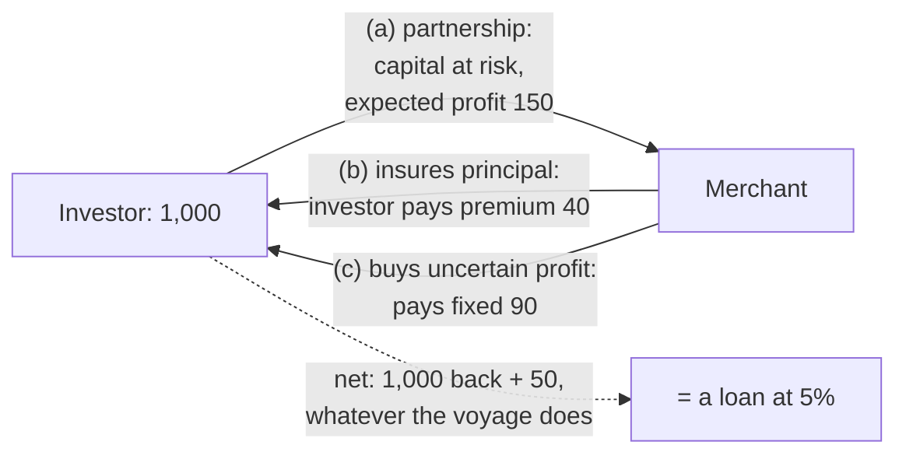

# Theology of Debt · Lesson 4.5: Contracts that are not loans

> ⏱ ~15 min · Module 4: Usury: the prohibition · Builds on: [4.3 Aquinas: *Summa Theologiae* II-II q.78](04-03-aquinas-on-usury-ii-ii-q78.md), [4.4 The extrinsic titles](04-04-the-extrinsic-titles.md) · Unlocks: [5.1 The Monti di Pietà and Lateran V](05-01-the-monti-di-pieta-and-lateran-v.md), [5.2 *Vix Pervenit*](05-02-vix-pervenit.md), [5.4 Did the usury doctrine change?](05-04-did-the-usury-doctrine-change.md)

## Why this matters

The usury doctrine condemned one contract: the loan of money (*mutuum*) with a charge for the loan as such. It never condemned profit on money. A person with capital could still earn by entering a partnership, buying a rent, or dealing in foreign money, and the Church approved all three. Then, in the early sixteenth century, a German theologian argued that three approved contracts, signed together, were also approved, even though together they paid exactly what a loan at five percent pays. A pope condemned the package in 1586. This lesson asks what the moralists were testing when they sorted contracts into "loan" and "not a loan", and why the same test that approved the parts could condemn the whole.

[`history-of-debt` 2.1](../../history-of-debt/lessons/02-01-commerce-around-the-prohibition.md) teaches these contracts as institutions: how the money moved and who used them. This lesson takes only the moral verdicts.

## The idea

Recall the ground from [4.3](04-03-aquinas-on-usury-ii-ii-q78.md): in a *mutuum* the money becomes the borrower's, he bears every risk to it, and he owes back the same amount. Charging for that transfer sells something that does not exist ([mutuum](../reference.md#mutuum)).

So the moralists' test for any contract that pays a return on money was never "is there profit?" It was three questions:

1. **Who owns the capital** while it is out?
2. **Who bears the risk** if it is lost?
3. **Can the investor demand the principal back** regardless of how things go?

A loan answers: the borrower; the borrower; yes. Each licit contract below changes at least one answer. The triple contract rebuilt all three answers of a loan out of parts that each changed one.

## Source

The principle that decides every case in this lesson is in the reply to the seventh objection of ST II-II q.78 a.2 (English Dominican Province). The objection concerned sales on credit:

> "If a man wish to sell his goods at a higher price than that which is just, so that he may wait for the buyer to pay, it is manifestly a case of usury: because this waiting for the payment of the price has the character of a loan"

Read the last clause closely. The contract is a *sale*, and Aquinas does not deny it. But one element inside it, the seller's waiting, "has the character of a loan", and whatever is charged for that element is priced as a loan is priced. The moral species of a contract is fixed by what each of its elements actually does, not by the name on the document. That clause justified approving the partnership and the census, and it was the ground for condemning the triple contract.

## The argument

1. **Partnership (*societas*).** In the reply just before (a.2 ad 5, read in [4.3](04-03-aquinas-on-usury-ii-ii-q78.md)), Aquinas holds that one who entrusts money to a merchant to form a partnership keeps ownership, so the money trades at *his* risk, and his share of the profit is fruit of his own property. The canonists drew the corollary: a "partner" whose capital is guaranteed by the working partner has not kept the risk, so he is a lender ([societas](../reference.md#societas)). *In words:* share the loss or you are not a partner.
2. **The census.** A buyer pays a lump sum for a yearly rent charged on fruitful property, usually land or a house. He buys a right to income, not a promise to repay ([census](../reference.md#census)). Martin V's bull *Regimini universalis* (1425), answering doubts raised in the Empire, declared such rents not usurious. Callixtus III reissued it under the same title in 1455. On the moralists' reading of the bulls, four conditions made it a sale: the rent rests on real, fruitful property; the rent is in proportion to that property's yield; the **seller** may redeem by returning the price, but the **buyer** cannot demand it; and if the property perishes, the rent fails with it. *In words:* the buyer owns a stream from a thing, and he carries the thing's risk.
3. **Exchange (*cambium*).** A bill of exchange buys money payable in another place, often in another currency, at a rate fixed now, with conversion back at a rate nobody yet knows. The moralists judged it a real exchange, not a loan, because money truly moved between places and the return was uncertain. **Dry exchange** (*cambium siccum*) was a bill drawn and returned with no real transfer between places; its "exchange" was only a form around a time-payment. The moralists commonly condemned it as a disguised loan ([dry exchange](../reference.md#dry-exchange)). *In words:* the place and the uncertainty must be real, or the waiting is all that is being paid for.
4. **The triple contract.** An investor (a) enters a partnership with a merchant, (b) buys insurance of his principal from the same merchant for a premium, and (c) sells the merchant his uncertain share of profit for a smaller fixed annual sum ([the triple contract](../reference.md#the-triple-contract)). Each part, taken alone, was a contract the moralists approved. The investor now owns nothing at risk and can demand his principal back with a fixed gain whatever happens.
5. **Eck's defence.** Johann Eck, the Ingolstadt theologian later famous as Luther's opponent, defended contracts of this kind in disputations of 1514–16, at Bologna in 1515 among them, in a cause associated with the Fugger bankers of Augsburg. His case: each contract is licit and fairly priced; three licit contracts made between the same parties cannot become illicit merely by being combined; and a moderate fixed return (five percent is the figure usually reported) is a fair price for giving up an uncertain larger one.
6. **Sixtus V's reply.** The constitution *Detestabilis avaritia* (1586) declared usurious any partnership in which the capital is guaranteed to the investor or the working partner is bound to pay a fixed gain free of risk, and subjected those who make such contracts to the canonical penalties for notorious usurers (described, not quoted). By premise 1 and the Source's principle, the combination is judged by what it does: principal back, fixed gain, no risk, one counterparty. That is a *mutuum* with a price.

**Mark the levels.** That partnership is licit because the investor keeps ownership and risk is **common teaching** (rung 4): Aquinas's reply carries a theologian's weight, not a magisterial act's, and the canonists agreed. The census bulls of Martin V and Callixtus III are **papal decisions resolving a disputed practice**, authentic ordinary magisterium (rung 3) *for the practice they approve under their conditions*. They define nothing about usury in general. The condemnation of dry exchange is **common teaching** among the moralists (rung 4). *Detestabilis avaritia* is a **papal constitution condemning a contract with canonical penalties**, rung 3 as a moral judgment. What it reaches is **argued**: later moralists, among them Azor and Lessius, continued to defend triple contracts they held to be separately priced, reading the bull narrowly, and by the late seventeenth century that defence was widespread. Do not call the bull a definition. Do not call it a pastoral opinion either: it declared contracts usurious and attached penalties.

## The case

The dashed edge is the whole dispute. Every solid edge was a licit contract. The dashed edge is what the investor actually holds.

## Worked examples

**Example 1: the census on a vineyard (clean).** A vine-grower sells a rent of 60 a year, charged on his vineyard, for 1,000. The buyer's yield is $60/1000 = 6\%$ a year, the same cash as a loan of 1,000 at 6 percent. Run the three questions. **Ownership:** the buyer owns a right to rent from the vineyard; the vineyard stays the grower's, and the price is now the grower's to use. **Risk:** if a flood ruins the vineyard, the rent fails, and the buyer's 1,000 is gone with it. **Principal:** the buyer can never demand the 1,000; the grower may return it and end the rent when he chooses. Two of three answers differ from a loan. **Verdict: licit census,** at the level of the bulls. Identical cash flows did not decide it. The difference lies in who holds which right when things go wrong.

**Example 2: the triple contract (where the test strains).** Numbers are illustrative. An investor puts 1,000 into a merchant's venture with an expected profit of 15 percent (150). He buys insurance of his principal from the merchant at a premium of 4 percent (40), and sells the merchant his uncertain share of profit for a fixed 9 percent (90). Net to the investor, in every outcome:

$$1000 + 90 - 40 = 1050.$$

The merchant keeps the actual profit $X$, pays out 90, receives 40, and must make good any loss of principal, so his net is $X - 90 + 40 = X - 50$:

| Venture's profit $X$ | Investor receives | Merchant's net |
|---|---|---|
| −300 (loss) | 1,050 | −350 |
| 0 | 1,050 | −50 |
| 150 (expected) | 1,050 | 100 |
| 400 | 1,050 | 350 |

The investor's column never moves. The merchant's net is always $X - 50$: he has borrowed 1,000 at 5 percent and keeps whatever the money earns. (Whether the premium and the price of the gain were *fair* is a separate question, algebraic and reserved for later; the models that price risk are [`economics-of-debt`](../../economics-of-debt/syllabus.md)'s.)

Now see where it strains. Eck's premise is not foolish. The insurance was a real contract elsewhere, and so was a sale of an expected gain. If a *third party* had insured the principal, many moralists would have let the partnership stand. So the decision cannot rest on "three contracts" as such. It rests on the **same counterparty** holding every leg, which collapses ownership and risk back onto the merchant. That is Aquinas's credit-sale clause applied to a bundle: one element of the combination, a guaranteed return of money after a lapse of time, "has the character of a loan".

## Watch out

- **"The Church forbade all profit on money."** It forbade one contract's charge. Partnership profit, census rents and real exchange gains were approved.
- **"Same cash flows, so same morality."** The census in Example 1 pays exactly what a 6 percent loan pays. What differs is who bears loss and who can call the principal.
- **"*Detestabilis avaritia* is a dogmatic definition"** overstates: it is a papal constitution condemning a contract. **"It was only advice"** understates: it declared contracts usurious with canonical penalties. Its *reach* (whether separately priced triple contracts fall under it) is what later moralists argued.
- **"The census bulls taught that interest is licit"** overstates their scope. They approved one contract under stated conditions, and a personal rent, redeemable at the buyer's demand, fails those conditions ([`history-of-debt` 2.1](../../history-of-debt/lessons/02-01-commerce-around-the-prohibition.md)).
- **Do not confuse the non-loan contracts with the [extrinsic titles](../reference.md#the-extrinsic-titles).** Titles justify something extra *on a loan* ([4.4](04-04-the-extrinsic-titles.md)). These contracts are not loans at all.

## One-liner

> A return on money is licit when the investor keeps ownership or bears real risk, and is sold what truly exists; the triple contract failed because, bundled with one counterparty, it handed back all three marks of a loan.

## Problems

**P1 (🟢)** *(Exegetical)* Classify each invented contract as **partnership**, **census**, **real exchange**, or **a loan in disguise**, and name the feature that decides it. **Two sentences each.**

(a) Livia gives 2,000 florins to a cloth merchant "as a partner" for a year. The contract says she will receive her 2,000 back plus 160 in any event, and bears no share of any loss.
(b) Tomás pays 800 to a miller for a yearly rent of 44 charged on the mill. The miller may end the rent at any time by repaying 800; Tomás may never demand it. If the mill burns, the rent ceases.
(c) A Florentine banker "buys" a bill payable in Bruges, but by agreement no correspondent in Bruges ever receives or pays anything. The bill is returned to Florence after three months and settled at a pre-agreed higher sum.

**P2 (🟡)** *(Formal (a) · Exegetical (b))* A landowner sells a rent of 72 a year charged on a vineyard that yields about 110 a year, for a price of 1,200. (a) Compute the buyer's annual yield, the share of the vineyard's yield the rent takes, and what the buyer has received if the seller redeems after 10 years. Compare with a 1,200 loan at 6 percent simple interest for 10 years. (b) The same numbers can describe a census and a loan. Name the two features that make this a census under the conditions the moralists read in the bulls, and say what single change to the contract would make it a loan in all but name. **80 words or fewer for (b).**

**P3 (🔴)** *(Exegetical)* Two positions, paraphrased. **Eck's side:** partnership, insurance and the sale of an uncertain gain are each licit and fairly priced, so a contract composed of all three is licit. **The condemnation's side:** the combination returns principal plus a fixed gain, without risk, from one counterparty, so it is a loan with a price. (a) Name the single premise the two sides divide on. (b) Use the Source (q.78 a.2 ad 7) to say which side that text favors and which words do the work. (c) Say what fact about a particular triple contract would weaken the condemnation's side for that case. **150 words or fewer in total.**

Solutions

**P1** *(Exegetical)*

**Must hit, strict:**
- (a) **A loan in disguise.** She keeps no risk: principal and a fixed gain (8 percent) are guaranteed by the working partner, which is exactly what *Detestabilis avaritia* declared usurious, and what the canonists already held makes a "partner" a lender.
- (b) **Census.** The rent rests on a fruitful thing and fails if it perishes, and only the seller can redeem. The buyer cannot call his principal and carries the mill's risk.
- (c) **A loan in disguise: dry exchange.** No money moves between places and the return is pre-agreed, so the only thing being paid for is three months' use of money.

**Wrong turns:** calling (a) a partnership because the document says "partner", which is the name-over-substance error the Source rules out. Calling (b) usurious because 44 on 800 is a steady 5.5 percent; a return alone does not make a loan. Calling (c) a real exchange because a bill was drawn.

**Model answer:** as above, two sentences each.

**P2** *(Formal (a) · Exegetical (b))*

**Must hit, strict (a):** yield $72/1200 = 0.06 = 6\%$ a year. The rent takes $72/110 \approx 65\%$ of the vineyard's yield, so it is covered by the fruits. Over 10 years the buyer receives $10 \times 72 = 720$ in rent, then his 1,200 back on redemption. The loan: $1200 \times 0.06 \times 10 = 720$ in interest, then 1,200 principal. **Identical cash.**

**Must hit, strict (b):** (1) the rent is charged on fruitful property and fails if the property perishes, so the buyer bears its risk; (2) only the seller may redeem, so the buyer cannot demand his principal. **The change:** let the buyer demand the 1,200 back at will (or charge the rent on the seller's person rather than the vineyard, so it survives the vineyard's loss). Either change hands the risk or the call right back and makes it a loan in all but name.

**Wrong turns:** concluding from the identical cash that the census *is* a loan, which forgets that the verdict turns on rights, not numbers. Treating the 65 percent proportion as the decisive feature; it is a condition of the bulls but does not by itself separate a sale from a loan. Annualizing the 720 as compound interest; the comparison is simple.

**Model answer (b):** This is a census because the rent is charged on the vineyard and dies with it, and because only the seller can redeem. The buyer bought income from a thing and carries its risk. Give the buyer the right to demand his 1,200 at will and it becomes a loan at 6 percent.

**P3** *(Exegetical)*

**Must hit, strict (a):** the premise that **a combination of licit contracts is licit whenever each part is**, that is, that a contract's moral species is the sum of its parts' species rather than fixed by what the whole does. Eck affirms it; the condemnation denies it.

**Must hit, strict (b):** ad 7 favors the **condemnation's side**. A sale is licit, yet "this waiting for the payment of the price has the character of a loan", so the element that functions as a loan is judged as one. The words doing the work are "has the character of a loan": the verdict follows what an element does, not what the contract is called.

**Must hit, strict (c):** a fact that restores risk or separates the counterparties. For example, the principal is insured by an independent third party at a market premium, or the investor still bears loss beyond some limit. Then the whole no longer returns principal plus a fixed gain from the one borrower.

**Wrong turns:** naming "five percent is too high" as the crux; the condemnation holds at any rate. Reading ad 7 as condemning sales on credit as such, when it condemns only the surcharge for waiting. Saying the bull "defined" the answer, which overstates its level and skips the argument.

**Model answer:** (a) They divide on whether a bundle of licit contracts is licit because each part is, or is judged by what the whole does. (b) Ad 7 sides with the condemnation. It admits the contract is a sale, yet treats the waiting inside it as a loan because it "has the character of a loan". The element is judged by its function. (c) If an independent insurer, not the merchant, guaranteed the principal at a fair premium, the merchant would no longer hold every leg, and the loan-shaped whole would not exist.

## Flashback

**From Lesson [4.3](04-03-aquinas-on-usury-ii-ii-q78.md) (Aquinas: *Summa Theologiae* II-II q.78):** *(Exegetical.)* Close reading. Article 4 asks whether one may borrow from a usurer. Its third objection says that if borrowing is lawful, so should depositing money with a usurer be, yet that seems as wrong as leaving a sword with a madman. Aquinas replies (ad 3, English Dominican Province, 1920):

> "If one were to entrust one's money to a usurer lacking other means of practising usury; or with the intention of making a greater profit … by reason of the usury, one would be giving a sinner matter for sin, so that one would be a participator in his guilt. If, on the other hand, the usurer … has other means of practising usury, there is no sin in entrusting it to him that it may be in safer keeping"

Three **invented** depositors, Florence, 1300:

(i) Gemma, fleeing a siege, leaves 200 florins with Lapo, a usurer by profession who lends large sums of his own, purely for safe keeping. She will take back exactly 200.
(ii) Piero leaves 500 florins with Lapo, on the understanding that Lapo will lend them at usury and pay him a third of what they earn.
(iii) Bice leaves 300 florins, purely for safe keeping, with Nuccio, a usurer who has no money of his own and lends only what depositors leave with him.

(a) The reply names two ways a depositor becomes "a participator". Name them, with the deciding words, and say whether both must be present. (b) Give a verdict on each depositor. (c) A preacher cites this reply as "the Church's teaching on formal and material cooperation". Correct him on the level, and on whose vocabulary that is. **Two sentences per part.**

Solution

**Must hit, strict (a):** (1) Entrusting money to a usurer **"lacking other means of practising usury"**, which supplies the very "matter for sin". (2) Entrusting it **"with the intention of making a greater profit … by reason of the usury"**, which makes the usury one's own aim. The clauses are joined by **"or"**, so **either alone** suffices. The contrasting case, a usurer with other means and a deposit "that it may be in safer keeping", is using a sinner for a good purpose, a.4's principle.

**Must hit, strict (b):** **Gemma: no sin.** Lapo has other means, and her end is safe keeping, the case the reply expressly allows. **Piero: participator.** He deposits for a share of the usury, the second clause, whatever Lapo's other means. **Bice: participator.** Her purpose is innocent, but Nuccio lacks other means, so her 300 florins are the matter of his sin, the first clause.

**Must hit, strict (c):** Q.78 is a **theologian's article, not a magisterial act**. The Church commends Thomas as a teacher without defining his theses, so the reply carries his weight as a theologian and no more. His categories are **using another's sin** and **participating in his guilt**. Formal and material cooperation is **the later tradition's vocabulary**, applied to him by his readers ([`moral-theology` 4.2](../../moral-theology/lessons/04-02-double-effect-and-cooperation-as-catholic-method.md)).

**Wrong turns:** clearing Bice because her intention is good. The first clause does not depend on intention. Condemning Gemma because Lapo is a notorious usurer: notoriety is not the test; his other means are. Reading the two clauses as jointly required. Calling the reply defined teaching, or putting "material cooperation" in Aquinas's mouth.

**Model answer:** (a) A depositor shares the usurer's guilt if the usurer has no other means of lending, or if the depositor aims at a profit from the usury; either suffices, because the clauses are joined by "or". (b) Gemma does not sin, since Lapo has other means and she seeks only safety. Piero shares Lapo's guilt by intending a profit from his usury. Bice shares Nuccio's, because her money is the only matter he has to sin with, whatever her purpose. (c) The reply is a theologian's article, carrying Thomas's authority as a teacher, not a magisterial act. "Formal and material cooperation" is the later tradition's language; Aquinas speaks of using another's sin and of participating in his guilt.

## Connections

- **Backward:** [4.3](04-03-aquinas-on-usury-ii-ii-q78.md) supplied the ownership premise and the partnership reply (a.2 ad 5); [4.4](04-04-the-extrinsic-titles.md) supplied compensation *on* a loan, which this lesson keeps apart from contracts that are not loans. Justice in exchange is [`moral-theology` 3.3](../../moral-theology/lessons/03-03-the-cardinal-virtues-and-the-gifts.md). How to read the weight of a papal act is [`fundamental-theology` 4.4](../../fundamental-theology/lessons/04-04-the-ladder-of-doctrinal-authority.md) ([the levels in this course](../reference.md#the-levels-in-this-course)).
- **Forward:** [5.1](05-01-the-monti-di-pieta-and-lateran-v.md) adds labor, cost and risk as the tests of a licit charge. [5.2](05-02-vix-pervenit.md) will say that other contracts, distinct from the loan, can yield a just return, and warn against presuming them. [5.4](05-04-did-the-usury-doctrine-change.md) asks whether the growth of these contracts is development or change; the fate of the triple contract after 1586 is evidence for both sides.
- **Sideways:** the institutions (the commenda, the four-party bill, the civic rent) are [`history-of-debt` 2.1](../../history-of-debt/lessons/02-01-commerce-around-the-prohibition.md). Whether bundling licit contracts can create an illicit one, and whether the ownership argument survives, is [`philosophy-of-debt`](../../philosophy-of-debt/syllabus.md)'s question. Why investors prefer equity-like or debt-like contracts, and how insurance and risk are priced, belongs to [`economics-of-debt`](../../economics-of-debt/syllabus.md). Modern Islamic finance faces the same question about bundled contracts under its own ban.
