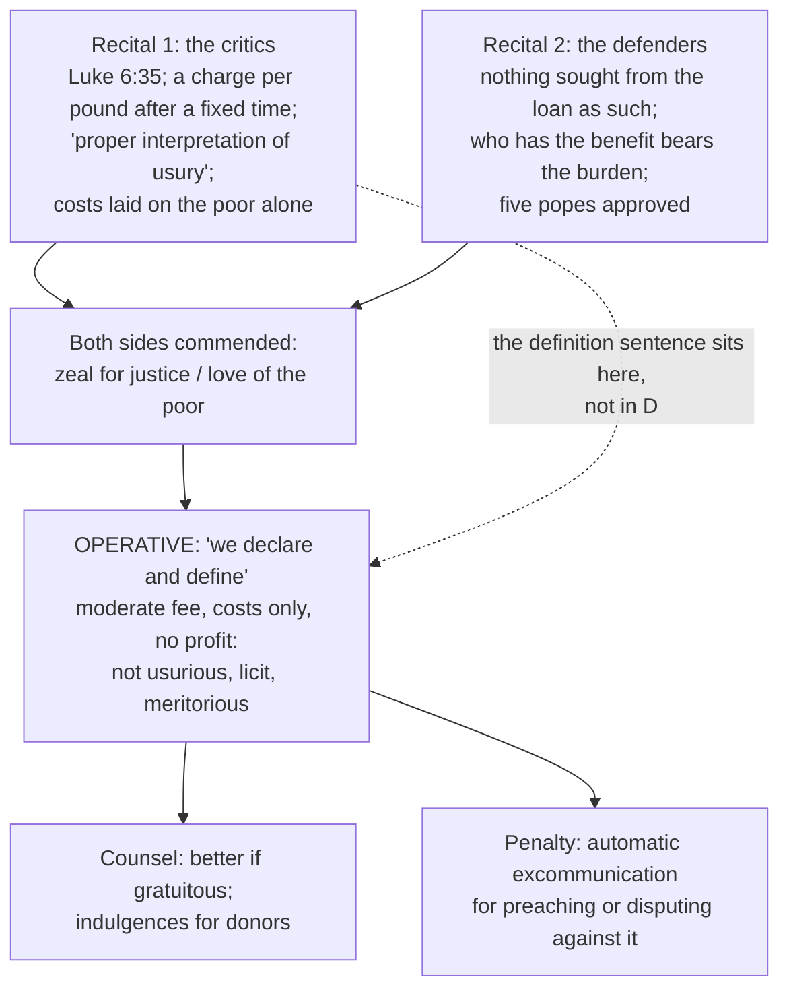

# Theology of Debt · Lesson 5.1: The Monti di Pietà and Lateran V

> ⏱ ~15 min · Module 5: Usury: development · Builds on: [4.3 Aquinas: *Summa Theologiae* II-II q.78](04-03-aquinas-on-usury-ii-ii-q78.md), [4.4 The extrinsic titles](04-04-the-extrinsic-titles.md), [`history-of-debt` 2.2 Jewish lenders and the Monti di Pietà](../../history-of-debt/lessons/02-02-jewish-lenders-and-the-monti-di-pieta.md) · Unlocks: [5.2 *Vix Pervenit*](05-02-vix-pervenit.md), [5.4 Did the usury doctrine change?](05-04-did-the-usury-doctrine-change.md)

## Why this matters

For fifty years, Franciscan and Dominican theologians fought over whether a pawnshop run as a charity was committing usury. An ecumenical council finally settled it, ruling on a *particular lending institution*, and the ruling contains the sentence most often quoted as "the Church's definition of usury". Two things decide how much that sentence can carry: where it sits in the bull, and what the council actually declared.

## The idea

The institution itself is [`history-of-debt` 2.2](../../history-of-debt/lessons/02-02-jewish-lenders-and-the-monti-di-pieta.md)'s subject. Briefly: in 1462 a civic fund at Perugia began lending small sums to the poor against pledges, after the preaching of the Observant Franciscan Michele Carcano. The planning is credited to his confreres Barnabas of Terni and Fortunato Coppoli. Within a few decades such [monti di pietà](../reference.md#monti-di-pieta) ("mounts", that is funds, "of piety") had spread across Italy.

The theological problem is simple. The monte gives 10 florins and, after some months, takes back 10 florins *plus* a little. On the medieval definition of [usury](../reference.md#usury), anything demanded beyond the principal of a *mutuum* by reason of the loan is usury ([4.3](04-03-aquinas-on-usury-ii-ii-q78.md)). So is the "little" a price for the loan, or a price for something else?

- **The Franciscans:** something else. Appraisers, clerks, a notary, a warehouse and losses on pledges cost money. A fund that pays those costs out of its capital shrinks until it closes. The borrower who benefits pays the running costs, and the fund makes no profit.
- **The Dominican critics**, among them the young Tommaso de Vio (later Cardinal Cajetan) in his *De monte pietatis* (1498): the charge is fixed in advance, grows with the sum and the time, and is demanded of the borrower as a condition of the loan. That is exactly what usury looks like, whatever it is called. They also argued that the monti's costs should be carried by the city, not by the poor who borrow.

Hold one hard fact beside this. The preaching that founded many monti was also a campaign against the licensed Jewish lenders, and it was often openly hostile to Jews. At Trent in 1475 a Franciscan Lenten preacher, Bernardino da Feltre, was followed by a fabricated ritual-murder charge and the execution of Jews. [`history-of-debt` 2.2](../../history-of-debt/lessons/02-02-jewish-lenders-and-the-monti-di-pieta.md) and [`church-history` 5.3](../../church-history/lessons/05-03-heresy-inquisition-and-the-jews.md) tell that history. A theology of the monti that leaves it out is not telling the truth about them. The council's text, for its part, speaks only of the poor and of "usurers".

## Source

Session X of the Fifth Lateran Council (4 May 1515), under Leo X, issued the bull *Inter multiplices* on the monti. It reports the critics' case and the defenders', commends both, then rules. Two sentences carry the doctrine (the lesson's translation from the Latin).

The first sits **inside the report of the critics' case**. It follows their appeal to Luke 6:35 (no loan should look for anything beyond the principal), and it opens with "for" (*enim*):

> "For this is the proper interpretation of usury: when gain and increase are sought from the use of a thing that does not bear fruit, with no labor, no expense and no risk."

The second is the **operative clause**:

> "…with the approval of the sacred council, we declare and define that the aforesaid mounts of piety, instituted by the civic authorities and hitherto approved and confirmed by the authority of the Apostolic See, in which something moderate is received beyond the principal, solely for the expenses of the officials and of the other things pertaining to their upkeep, for their indemnity only, and without profit to the mounts, neither show any appearance of evil nor offer an incentive to sin, nor are in any way to be disapproved. Rather, such a loan is meritorious, ought to be praised and approved, and is by no means to be thought usurious."

Three details repay a slow reading. *Fetus*, the word rendered "increase", literally means "offspring": the old image of money that is made to breed although it is barren. *Quae non germinat*, "that does not bear fruit", is the [consumptibles](../reference.md#consumptibles) point of [4.3](04-03-aquinas-on-usury-ii-ii-q78.md) in a single clause: money is not a field. And the operative clause never repeats the definition. It rules on a fee that is limited to costs and makes no profit.

The bull then adds a counsel and a penalty (paraphrased). The monti would be "more perfect" if they were entirely free, with founders paying at least half the officials' wages. The faithful are to be encouraged by indulgences to give for this purpose ([3.5](03-05-the-christian-jubilee-and-the-treasury.md) explains the currency). Anyone, religious or secular, who from then on preaches or disputes against the declaration, in speech or in writing, incurs excommunication automatically (*latae sententiae*). The Latin is excerpted in Denzinger–Hünermann, DH 1442–1444.

## The argument

The council's reasoning, reconstructed from the defenders' case that the operative clause adopts:

1. **Usury is gain sought from the loan as such** (*ratione mutui*). *In words:* what is condemned is charging for the lending itself.
2. **A monte seeks nothing from the loan as such.** What it charges covers the officials' wages and the upkeep of the institution.
3. **A legal maxim: whoever receives the benefit should also bear the burden** (*qui commodum sentit, onus quoque sentire debeat*). *In words:* it is just for the borrower who uses the service to pay what the service costs.
4. **So a moderate charge, limited to expenses and yielding no profit, is not usury.** It pays for labor and outlay, not for the use of money.
5. **The charity is real.** It keeps the poor from worse lenders, and five earlier popes (Paul II, Sixtus IV, Innocent VIII, Alexander VI and Julius II) had approved it. So the loan is meritorious.
6. **The dispute disturbs the peace of Christendom**, so it is closed, with excommunication for anyone who reopens it.

Now set the "proper interpretation" beside premise 4. If usury is gain without labor, expense or risk, then a fee tied to labor and expense falls outside it. Read this way, the sentence both condemns the critics' target and supplies the defenders' exit. Whatever its standing, it names three **tests**: *labor*, *expense* (*sumptus*) and *risk* (*periculum*). Later moralists used exactly these. Expense lines up with [*damnum emergens*](../reference.md#the-extrinsic-titles), risk with *periculum sortis* ([4.4](04-04-the-extrinsic-titles.md)). But the council approved only the first two, and only up to cost. It said nothing about paying the lender for risk.

**Two readings of the definition sentence.**

- **(A) The council's own definition.** Many later writers cite the sentence as Lateran V's definition of usury. The operative clause only makes sense on it: the fee passes precisely *because* it is tied to labor and expense.
- **(B) A report of the critics' premise.** The sentence stands inside the recital of one side's argument, introduced by *enim*. It calls itself an *interpretatio*, not a decree. The words "declare and define" govern a different sentence. And later theologians went on defining usury by the loan contract, not by this formula. On this reading the council ruled on the monti and left the definition where it found it, as one party's gloss.

Both readings agree about the operative clause. They disagree only about whether its reasoning **raised a premise to conciliar teaching**. That question returns in [5.4](05-04-did-the-usury-doctrine-change.md).

**Mark the levels.** The act is a bull of Lateran V, which the Church counts as an ecumenical council, issued "with the approval of the sacred council" under the words "we declare and define" and enforced by automatic excommunication. What that act settles: that monti approved by the Holy See, charging a moderate fee solely for expenses and without profit, are not usurious and are licit and meritorious. That judgment is **at least authentic magisterium, and binding**: after 1515 no Catholic could teach otherwise. Whether it is an **infallible definition** is **argued**. The formula points high. But its object is a verdict on a type of contract, conditioned on facts (moderate, cost-only, no profit), and canon 749 §3's rule sends doubt down a rung ([`fundamental-theology` 4.4](../../fundamental-theology/lessons/04-04-the-ladder-of-doctrinal-authority.md), [4.5](../../fundamental-theology/lessons/04-05-reading-a-documents-weight.md)). The **"proper interpretation" sentence** is not in the operative clause. Whether it carries conciliar weight is **argued** (readings A and B). Calling it "defined dogma" overstates both the sentence and the act. The critics are **commended** for their zeal for justice, not condemned, and the penalty looks forward. See [the levels in this course](../reference.md#the-levels-in-this-course).

## Anatomy of the bull

## Worked examples

**Example 1: a monte that passes.** An invented monte has 4,500 florins out on loan on average. Its yearly costs are wages 180, storage 60, and losses on unredeemed pledges 45, for a total of 285 florins. The fee that exactly covers costs is

$$\frac{285}{4500} \approx 6.33\% \text{ a year.}$$

At that rate it charges for labor and expense, makes no profit, and falls squarely under the operative clause. Now suppose donors take up the bull's counsel and pay half the wages. The borrowers' share of the costs falls to $285 - 90 = 195$ florins, and the fee to $195/4500 \approx 4.33\%$. The council calls that "more perfect"; both are licit, and one is more generous.

**Example 2: where the text strains.** The same monte charges 8%. That brings in $0.08 \times 4500 = 360$ florins against 285 in costs: a surplus of 75 florins, or about 1.67 points of the rate. Three questions, and the bull answers only the first cleanly.

- *If the surplus is paid out to backers,* it is profit taken from the loan. The clause's condition "without profit to the mounts" fails, so the approval does not cover this monte.
- *If the surplus is a reserve against a bad year,* is it "expense"? Losses on pledges are a real cost, but they vary. The text requires moderation and no profit. It gives no accounting rule for reserves.
- *If the surplus is added to the lending fund,* the poor are the beneficiaries. Still, it is gain produced by the loans. The bull's counsel points the other way: lower the fee.

The critics' deeper objection, that the city and not its poorest borrowers should pay for its charity, is answered not by arithmetic but by the counsel: subsidize.

## Watch out

- **"Lateran V solemnly defined usury" overstates.** The "declare and define" governs the ruling on the monti. The definition sentence sits in the critics' recital, and its weight is argued.
- **"It was only a pastoral tolerance" understates.** A conciliar bull that "declares and defines", calls the loan meritorious and excommunicates opponents is a binding magisterial judgment, whatever its exact rung.
- **You might think the council approved interest.** It approved a fee limited to costs, and it explicitly excluded profit. Nothing in it permits a charge for the use of money, or yet for risk.
- **You might read the definition's three tests as three licenses.** "Usury is gain *without* labor, expense or risk" does not say that any gain *with* risk is licit. Risk later grounds a title only when it is real and priced to the risk ([4.4](04-04-the-extrinsic-titles.md)). [5.2](05-02-vix-pervenit.md) presses exactly that.
- **Don't take the preachers' portrait of Jewish lenders as the Church's teaching.** The bull does not mention Jews, and the campaign's hostility is history to be reckoned with, not doctrine.

## One-liner

> Lateran V declared the monti's cost-only fee not usurious and meritorious, at a weight that binds. The famous "gain without labor, expense or risk" sentence sits in the critics' mouth, so how much it defines is argued, but its three tests shaped everything after.

## Problems

**P1 (🟢)** *(Exegetical (a) · Evaluative (b))* Three **invented** institutions, each lending small sums against pledges.

- **St Anne's parish fund** charges a flat 15 dollars per loan, calculated to pay its part-time clerk. It ends each year with no surplus.
- **The city pawn office** charges 1% a month, stated as the cost of storing and insuring pledges. Its audited costs match that.
- **Pledge Plus**, a private firm, charges a 3% monthly "service fee". Its costs are 1% a month, and the rest is paid to shareholders.

(a) Using only the operative clause of *Inter multiplices*, say for each whether the clause's reasoning clears the charge, and name the words that decide it. One sentence each. (b) The clause approved monti "instituted by the civic authorities" and "approved by the Apostolic See". Does the city pawn office's charge stand or fall on that detail? 80 words or fewer.

**P2 (🟡)** *(Formal (a) · Exegetical (b))* An **invented** monte has 12,000 ducats out on loan on average. Its yearly costs are wages 540, rent 150 and losses on pledges 90. It charges 7.5% a year. (a) Find the cost-covering fee, the surplus in ducats and in percentage points, and the fee if donors paid half the wages. (b) The surplus is paid as a dividend to the citizens who put up the capital. Does the operative clause cover this monte? Name the condition. Two sentences.

**P3 (🔴)** *(Exegetical)* An **invented** op-ed paragraph, not the words of any real person:

> "In 1515 the Fifth Lateran Council infallibly defined usury as gain without labor, cost or risk. Every bank takes risk, so the council itself approved all bank interest. The Dominicans who had opposed the pawnshops were condemned as heretics."

Name **three** errors and correct each from the bull. 120 words or fewer.

Solutions

**P1** *(Exegetical (a) · Evaluative (b))*

**Must hit, strict (a):**
- **St Anne's:** cleared. The fee pays the officials' expenses, is moderate and makes no profit ("solely for the expenses of the officials… without profit"). A flat fee is not a problem: the clause regulates what the fee pays for, not its shape.
- **City pawn office:** cleared. Storage and custody are "things pertaining to their upkeep", and the fee equals audited cost. A time-based fee is not disqualifying, because the monti themselves charged per pound after a fixed time, and custody costs grow with time.
- **Pledge Plus:** not cleared. Two points of the 3% are profit to shareholders, which fails "without profit". The 1% cost share would pass on its own.

**Must hit, any verdict (b):** distinguish the clause's **approval** (addressed to monti set up by civic authority and approved by Rome) from its **reasoning** (a cost-only, profit-free charge on a loan is not usury). Then say which one the verdict rests on. Either verdict passes if both are named.

**Wrong turns:** failing St Anne's because the fee is charged "beyond the principal", which is the critics' position the council rejected. Failing the pawn office because the fee rises with time. Clearing Pledge Plus because its costs are real.

**Model answer (b), one of several:** The approval named civic monti confirmed by the Holy See, so the pawn office is not *approved* by the bull. But the charge is judged licit by the reasoning, which condemns only gain from the loan as such. A cost-only fee is not that, whoever collects it. So the charge stands on the reasoning; only the bull's formal approval (and its praise as meritorious) depends on the detail.

**P2** *(Formal (a) · Exegetical (b))*

(a) Costs $= 540 + 150 + 90 = 780$ ducats. Cost-covering fee $= 780/12000 = 6.5\%$. Income at 7.5% $= 0.075 \times 12000 = 900$, so the surplus is $900 - 780 = 120$ ducats, or $120/12000 = 1$ percentage point. With half the wages donated, costs are $780 - 270 = 510$, and the fee is $510/12000 = 4.25\%$.

(b) **Must hit, strict:** no. The clause approves a charge "without profit to the mounts", solely for expenses. A dividend to capital-providers is gain from the loans, so this monte falls outside the approval.

**Wrong turns:** dividing costs by the fund's total capital rather than the sum out on loan. Treating the surplus as licit because the fee is still "moderate": moderation is necessary, not sufficient.

**Model answer (b):** No: the clause covers only a moderate charge for expenses that yields no profit, and a dividend is profit from the loans. The 1-point surplus is exactly the part the bull does not approve.

**P3** *(Exegetical)*

**Must hit, strict (three of):**
1. **"Infallibly defined usury"** overstates. The definition sentence sits in the recital of the critics' case, introduced by *enim*. "Declare and define" governs the ruling on the monti, and even that ruling's rung is argued.
2. **"Approved all bank interest"** has no basis. The council approved only a moderate fee for expenses, without profit. It says nothing about risk compensation or profit-making lenders.
3. **The logic runs backward.** "Usury is gain *without* risk" does not imply that any gain *with* risk is licit. A risk title must be real and proportionate (4.4).
4. **"Condemned as heretics"** is false. The bull commends the critics' zeal for justice. It imposes automatic excommunication on those who preach or dispute against the declaration *from then on*: a penalty, not a finding of heresy.

**Wrong turns:** "correcting" the op-ed by claiming the council condemned all interest. It ruled only on the monti. Accepting "defined" because the words "declare and define" appear somewhere in the bull.

**Model answer:** The "gain without labor, cost or risk" sentence appears in the bull's summary of the critics' argument, and the council's "declare and define" governs its ruling on the monti. Even that ruling's infallibility is argued. The council approved a moderate, cost-only, profit-free fee, not interest, and not risk premiums. And a definition of usury as gain without risk does not license any gain with risk. The critics were praised for their zeal, and the excommunication applies to those who oppose the ruling from then on.

## Flashback

**From Lesson [4.4](04-04-the-extrinsic-titles.md) (The extrinsic titles):** *(Exegetical.)* Level assignment. Give each claim its level (defined; authentic ordinary magisterium; common teaching; a single theologian's teaching) and **name the act, or the absence of one, that fixes it**. If a claim misstates its source, say so. **Two sentences per item.**

(a) A lender may agree in advance on compensation for a loss that the loan will actually cause him.
(b) Titles that are not innate or intrinsic to the loan can concur with it and give a just ground for receiving something beyond the principal.
(c) Compensation for profit forgone may never be agreed, since the lender would be selling what he does not yet have.
(d) The four extrinsic titles, *damnum emergens*, *lucrum cessans*, *periculum sortis* and *poena conventionalis*, are defined Church teaching.

Solution

**Must hit, strict:**
- (a) **Common teaching.** *Damnum emergens* is admitted by Aquinas (ST II-II q.78 a.2 ad 1) and by the canonists and theologians after him, and **no council or pope has defined it**. That it may be agreed *at the outset* is Aquinas's own position; many medieval canonists admitted it only for loss arising after the loan, typically through the borrower's delay.
- (b) **Authentic ordinary magisterium** (rung 3). The act is *Vix Pervenit* §3.III, Benedict XIV's encyclical of 1745 to the bishops of Italy, whose propositions he "approves and confirms" and orders taught. It uses no defining formula, and **how far its authority reaches beyond Italy is argued**.
- (c) **A single theologian's teaching.** Aquinas refuses the claim in a.2 ad 1, a Summa reply and not a magisterial act. Later common teaching admitted *lucrum cessans* under conditions (Hostiensis narrowly, then Soto, Molina and Lessius), and that reversal overturned no definition.
- (d) **Misstated: no act defines any title.** The four are common teaching (the Catholic Encyclopedia of 1912, a secondary source, reports them admitted without dispute since the late sixteenth century). *Vix Pervenit* recognizes that titles *can* exist, but it names and lists none.

**Wrong turns:** calling (b) a definition, or "only advice to Italian bishops": it was confirmed, commanded and backed by penalties. Calling (c) a magisterial ruling that later theologians defied. Rescuing (d) by citing *Vix Pervenit*, which lists no titles. Giving (a) rung 3 because *Vix Pervenit* allows titles in general: the encyclical does not name this one.

**Model answer:** (a) Common teaching, from Aquinas's ad 1 and the canonists, with no defining act; stipulating it in advance is Aquinas's own position, narrower among many canonists. (b) Authentic ordinary magisterium, *Vix Pervenit* §3.III; it is binding at that rung, but it is not a definition, and its reach beyond Italy is argued. (c) A theologian's teaching, Aquinas's ad 1; later common teaching admitted the title under conditions, and no definition was overturned. (d) False as stated: no council or pope has defined the titles, which are common teaching; *Vix Pervenit* allows that titles exist but names none.

## Connections

- **Backward:** [4.3](04-03-aquinas-on-usury-ii-ii-q78.md) gives the *mutuum* and the barren-money argument that *quae non germinat* compresses. [4.4](04-04-the-extrinsic-titles.md) gives the titles that "expense" and "risk" anticipate. [4.5](04-05-contracts-that-are-not-loans.md) shows the other route around the ban: a contract that is not a loan. The monte is a real loan with a charge that is not *for* the loan. [3.5](03-05-the-christian-jubilee-and-the-treasury.md) explains the indulgences the bull offers donors.
- **Forward:** [5.2](05-02-vix-pervenit.md) defines the sin by the loan contract and never cites Lateran V; comparing the two definitions is Boss 5's work. [5.4](05-04-did-the-usury-doctrine-change.md) asks whether 1515 is the first step of a change or an application of an unchanged rule. [6.3](06-03-the-ethics-of-personal-debt.md) meets the monti's heirs in credit unions and charitable lenders.
- **Sideways:** [`history-of-debt` 2.2](../../history-of-debt/lessons/02-02-jewish-lenders-and-the-monti-di-pieta.md) has the institution, its fee arithmetic, and the anti-Jewish campaigns. [`philosophy-of-debt`](../../philosophy-of-debt/syllabus.md) asks whether a cost-only charge is where the justice of interest *begins*. [`economics-of-debt`](../../economics-of-debt/syllabus.md) would split a lending rate into cost of funds, default loss and administration, of which the monte's fee is the last. The card: [*Inter multiplices*](../reference.md#inter-multiplices).
