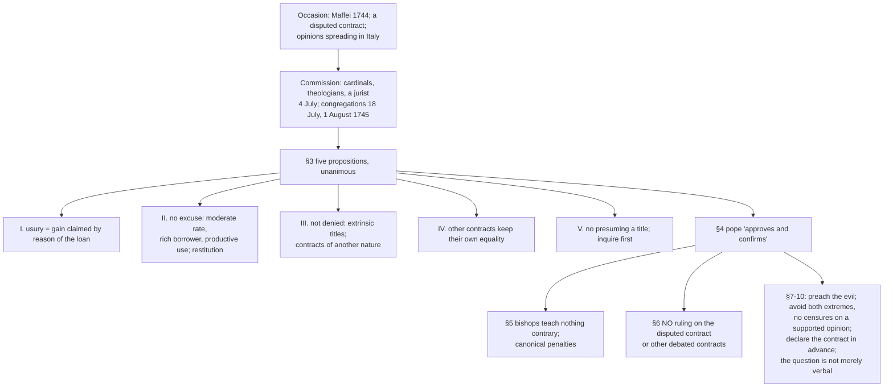

# Theology of Debt · Lesson 5.2: *Vix Pervenit* (1745)

> ⏱ ~15 min · Module 5: Usury: development · Builds on: [4.3 Aquinas: *Summa Theologiae* II-II q.78](04-03-aquinas-on-usury-ii-ii-q78.md), [4.4 The extrinsic titles](04-04-the-extrinsic-titles.md), [4.5 Contracts that are not loans](04-05-contracts-that-are-not-loans.md), [5.1 The Monti di Pietà and Lateran V](05-01-the-monti-di-pieta-and-lateran-v.md) · Unlocks: [5.3 "Not to be disturbed"](05-03-not-to-be-disturbed.md), [5.4 Did the usury doctrine change?](05-04-did-the-usury-doctrine-change.md)

## Why this matters

Every later argument about Catholic teaching on interest runs through one short papal letter. People who say the Church "never changed" cite it. People who say it changed completely cite it too, as the last clear statement before the change. Both sides need to know exactly what it says. It condemns less than its critics claim and more than its lenient readers hope, and it openly declines to settle several questions.

## The idea

**The occasion.** In 1744 Scipione Maffei, a Veronese nobleman, antiquarian and man of letters, published at Verona *Dell'impiego del danaro* ("On the employment of money"), in three books. It defended taking a moderate interest on loans to merchants and the well-off. The Dominican Daniele Concina and the Veronese priest Pietro Ballerini answered him in print, and the quarrel spread. The encyclical's own opening says only that "a new controversy" had arisen "whether a certain contract ought to be judged valid", and that opinions out of harmony with sound doctrine were circulating in Italy.

**The background.** Two centuries earlier John Calvin, answering a correspondent's inquiry in a letter usually dated 1545, had refused a blanket prohibition. Paraphrased: interest is not wholly forbidden, but it must answer to justice and charity. It may never be taken from the poor, and the borrower should gain from the money as much as the lender does. Maffei's case was not Calvin's, but it made the same moves: a moderate rate, a rich borrower, a productive use. Keep those three in mind. The encyclical rejects exactly these three.

**The procedure.** Benedict XIV (pope 1740–58, formerly Prospero Lambertini, himself a canonist) did not simply write a letter. He convened cardinals, theologians from monastic, mendicant and clerical orders, and a lawyer experienced in the courts. He met them on 4 July 1745, had them write opinions, and heard them in two congregations (18 July and 1 August). He then issued, on **1 November 1745**, an encyclical letter addressed to the patriarchs, archbishops, bishops and ordinaries **of Italy**. Its core is five propositions the commission "approved by unanimous consent" (§3), which the pope then "approves and confirms" (§4).

Latin to hold onto: *mutuum*, the loan of a consumable ([mutuum](../reference.md#mutuum)); *sors*, the principal; *usura*, usury; *lucrum*, gain; *titulus*, a title, meaning a ground in justice for a claim; *ratione ipsius mutui*, "by reason of the loan itself".

## Source

§3.I, the definition of the sin (the lesson's translation from the Latin):

> "The kind of sin called usury, which has its proper seat and place in the contract of loan, consists in this: that someone, from the loan itself, which by its own nature asks only that as much be returned as was received, wants more returned to him than was received, and therefore claims that some gain beyond the principal is owed him by reason of the loan itself. Every gain of this kind that exceeds the principal is therefore illicit and usurious."

Three words carry the definition. *Sedem*, "seat": the sin lives **in a contract**, not in money, not in profit, and not in lending as such. *Suapte natura*, "by its own nature": the *mutuum* is by definition an exchange of equals, as in [4.3](04-03-aquinas-on-usury-ii-ii-q78.md). And *ipsius ratione mutui*: what is condemned is gain claimed **because of** the loan. That phrase leaves room for gain claimed because of something else.

The rest of §3, paraphrased closely:

- **II. No excuse** comes from the gain being moderate and small, from the borrower being rich, or from his putting the money to profitable use by buying estates or trading. The loan's law is equality of what is given and what is returned. Whoever takes more "by force of the loan itself" is bound to **restitution** by [commutative justice](../reference.md#commutative-justice), whose office is to keep each contract's equality and to repair it when it is broken.
- **III. Two things are not denied.** First, other *titles* ("as they are called"), not innate or intrinsic to the loan, may concur with it and give a just cause for claiming something beyond the principal ([the extrinsic titles](../reference.md#the-extrinsic-titles)). Second, a person may often invest money through **contracts of a wholly different nature from the loan**, to buy annual revenues or to carry on lawful trade, and take honest gains from them ([4.5](04-05-contracts-that-are-not-loans.md)).
- **IV. Those other contracts have their own equality.** Whatever is taken beyond it is, if not usury, "certainly some other true injustice", which also carries a duty of restitution. Kept justly, they sustain commerce for the common good (Proverbs 14:34: justice exalts a nation).
- **V. The warning.** No one may presume that a title, or another just contract, is always present, so that a moderate surplus is always licit whenever money is lent. Before taking gain, one must first **inquire whether a real title or a real non-loan contract is in fact present**. (P1 reads this passage.)

## The argument

1. **A *mutuum* by its nature demands only an equal return** (§3.I). *In words:* lending a sum means being owed that sum back.
2. **So gain claimed by reason of the loan itself exceeds what the contract gives**, and it is illicit whatever its size or the borrower's wealth or use (§3.I–II).
3. **What is taken against commutative justice must be restored** (§3.II).
4. **Gain may be just on another ground**: a title extrinsic to the loan, or a different contract such as a rent or a partnership (§3.III). *In words:* the ban is on pricing the loan, not on every return to money.
5. **Those other grounds are facts to be established, not presumptions** (§3.V).
6. **Therefore**: the question of usury is not merely a matter of words even where money usually yields fruit. Licit and illicit gain differ, and one must be restored in both the internal and external forum, while the other may be kept (§10).

Then come the pastoral clauses. §5: bishops and preachers are to teach nothing contrary to the propositions, and anyone who does so is subject to the canonical penalties for contempt of apostolic mandates. §6: the pope **decides nothing** about the contract that started the controversy, nor about other contracts on which theologians disagree. §7–10 are four instructions (see the figure). The most striking is §8. Confessors must avoid two extremes, the rigorist who calls any gain from money usurious and the laxist who thinks no gain is. They are to consult the most esteemed authors and follow what reason and authority confirm, and they may not brand a contrary opinion with grave censures when it has reasons and eminent support.

**Mark the levels.** The act is an **encyclical letter** of Benedict XIV to the bishops of Italy, in which he "approves and confirms" his commission's propositions and orders them taught, backed by canonical penalties. On the ladder of [`fundamental-theology` 4.4](../../fundamental-theology/lessons/04-04-the-ladder-of-doctrinal-authority.md), that is **authentic papal magisterium** (rung 3) at the least. It is not a definition: no formula proposes anything as revealed or as definitively held, and canon 749 §3 sends doubt down ([4.5](../../fundamental-theology/lessons/04-05-reading-a-documents-weight.md)). **How far its authority reaches is argued** ([the levels in this course](../reference.md#the-levels-in-this-course)). *Narrow:* it was addressed only to Italy, and the Catholic Encyclopedia (1912, secondary) concludes that it was therefore not infallible. *Wider:* the same article reports that the Holy Office, on 29 July 1836, declared incidentally that it applied to the whole Church. And its core restates what almost all theologians, the decretals and the Fathers taught (§4 claims exactly this), which is the mark of an ordinary universal teaching that no single address can confine. What §6 leaves undecided, and the opinions §8 shields, are **freely disputed**. The claim that usury is no sin was treated as heresy at Vienne ([4.2](04-02-from-canon-to-council.md)). *Vix Pervenit* does not settle whether Vienne's "usury" means exactly its §3.I definition. That question belongs to [5.4](05-04-did-the-usury-doctrine-change.md).

## Anatomy of the encyclical

## Worked examples

**Example 1: the clean case.** An invented Bolognese silk merchant is flush with cash and lends 1,000 scudi for a year to a landowner buying an estate. He asks 40 beyond the principal, "since you will do well out of it." Run §3. It is a *mutuum*. The 40 is claimed because of the loan, and all three excuses he could plead (4% is moderate, the borrower is rich, the money will be put to profitable use) are rejected by name in §3.II. There is no title: he had surplus cash, so he suffered no loss and gave up no gain, and he bears no unusual risk. **The 40 is usurious, and restitution is owed.**

**Example 2: where the text stops.** Change one fact. The merchant keeps his money in trade and would have earned roughly 6% in the year, so he asks 4% "for the gain I give up." Now §3.III is in play: forgone profit (*lucrum cessans*, [4.4](04-04-the-extrinsic-titles.md)) is a title extrinsic to the loan. §3.V then asks a question the encyclical cannot answer for him. Is the forgone gain *real* in this case, or is he presuming it, as he would for anyone who asked? The letter lists no titles, fixes no rate and sets no test beyond "inquire diligently". And §6 expressly declines to rule on disputed contracts. The verdict turns on facts and on the moralists' conditions ([4.4](04-04-the-extrinsic-titles.md)), not on the encyclical's text. §9 adds one practical demand: declare the contract and its terms beforehand, so that the title is visible and not a cover for a disguised usury (*palliata usura*).

## Watch out

- **"*Vix Pervenit* infallibly defined the usury doctrine for the whole Church"** overstates. It is an encyclical to Italy, with no defining formula. Its wider reach is argued, and the 1836 extension is reported as incidental.
- **"It was only advice to Italian bishops"** understates. The pope approved and confirmed the propositions, commanded that they be taught, and attached penalties. That is binding authentic magisterium, with a claim to restate the common teaching.
- **Don't read it as condemning all return on money.** §3.III and §8 name that view as an extreme. Partnership, rents and trade are expressly allowed.
- **Don't read it as permitting "moderate" interest.** Moderation is the first excuse §3.II rejects.
- **Don't say it defined the titles.** It says titles *can* exist and warns against presuming them. It names none.
- **Don't make Maffei a condemned heretic.** The letter names no author and no book, and §6 leaves his contract undecided. He reprinted his book in Rome in 1746 with the encyclical bound in, together with a letter of his own to the pope.

## One-liner

> *Vix Pervenit* puts usury in the loan contract itself, as gain claimed by reason of the loan, and rejects the moderate-rate, rich-borrower and productive-use excuses. It leaves titles and other contracts open but forbids presuming them. It binds as authentic papal teaching; how far beyond Italy is argued.

## Problems

**P1 (🟢)** *(Exegetical)* Close reading of §3.V (the lesson's translation):

> "But this must be carefully noted: anyone will persuade himself falsely, and only rashly, that there are always to be found, ready everywhere, either other lawful titles together with the loan, or, apart from the loan, other just contracts, by whose protection it is always lawful, whenever money, grain or anything of that kind is lent to another, to receive a moderate surplus beyond the whole and safe principal… For no one can fail to know that in many cases a man is bound to help another by a simple and bare loan, as Christ the Lord himself teaches: 'From him that would borrow of thee, turn not away'; and likewise that in many circumstances no other true and just contract can have place besides the loan alone."

(a) What exactly does the passage call false: the existence of titles, or something else? Name the words that decide it. (b) Give the passage's two grounds for the warning. (c) Does the passage forbid charging a surplus on a loan that is covered by a real title? **Two sentences per part.**

**P2 (🟡)** *(Exegetical)* An **invented** diocesan-newsletter paragraph, not the words of any real person:

> "In *Vix Pervenit*, an infallible decree for the whole Church, Benedict XIV condemned every profit made from money, which is why the Church once forbade investing in trade. He also ordered that anyone who defends a more lenient opinion on a disputed contract be publicly censured."

Name **three** errors and correct each from the encyclical, with its section. **120 words or fewer.**

**P3 (🔴)** *(Exegetical (a) · Evaluative (b))* An **invented** case. In 1750 a widow in Padua hands 500 ducats to a cloth merchant "to be employed in his trade". He promises her 25 ducats a year and the return of the 500 on demand, "whatever befalls the business". No written terms were drawn up. (a) Using only *Vix Pervenit*, say which question must be answered before any verdict, what follows on each answer, and which section blocks the widow from simply assuming the better answer. **100 words or fewer.** (b) Her confessor says the encyclical settles the case. Is he right? Name the section that bears on his claim, and give a verdict with one reason. **80 words or fewer.**

Solutions

**P1** *(Exegetical)*

**Must hit, strict:**
- (a) It denies a **universal presumption**: that titles or just non-loan contracts are *always* to be found, *ready everywhere*, so that a surplus is *always* lawful *whenever* anything is lent. The decisive words are "always" (*semper*), "ready everywhere" (*praesto ubique*), "whenever… always" (*quotiescumque… toties semper*). It does not deny that titles exist; §3.III has just affirmed that they can.
- (b) (i) Charity often **obliges a simple, bare loan**, as in Christ's command (Matt 5:42): where lending itself is a duty, a surplus has no title to stand on. (ii) Often **no other just contract is available**: the only transaction that fits the need is a loan.
- (c) No. A real title is exactly the case §3.III leaves open. The passage requires that one first **inquire** whether the title is real, and it forbids assuming it.

**Wrong turns:** reading "anyone will persuade himself falsely" as a denial that titles exist, which contradicts §3.III. Reading the Christ citation as forbidding all interest; it is cited to show that many loans *must* be bare, not that every loan must.

**Model answer:** (a) The falsehood is the claim that titles or just contracts are *always* at hand, so that a surplus is lawful *whenever* one lends; "always", "ready everywhere" and "whenever" decide it, and titles themselves are not denied. (b) Charity often obliges a bare loan (Matt 5:42), and often a loan is the only contract that fits the case. (c) No: a real title still grounds a surplus under §3.III; the passage demands that its reality be checked first.

**P2** *(Exegetical)*

**Must hit, strict (three of):**
1. **"Infallible decree for the whole Church"** overstates. It is an encyclical to the bishops of Italy (address; §5), with no defining formula. Its wider reach is argued (the Holy Office's incidental 1836 declaration, the claim to restate common teaching), and it is not established as infallible.
2. **"Every profit made from money"** is false. §3.I condemns gain claimed *by reason of the loan*. §3.III allows titles and contracts of another nature, including lawful trade. §8 names the view that any gain from money is usurious as a vicious extreme.
3. **"Forbade investing in trade"** is false. §3.III expressly allows placing money in lawful trade and taking honest gains, and §3.IV says such contracts serve the common good.
4. **"Ordered… publicly censured"** reverses §8, which forbids insults and grave censures against a contrary opinion that has reasons and eminent support. §5's penalties fall on teaching *against the §3 propositions*, and §6 leaves disputed contracts undecided.

**Wrong turns:** "correcting" error 1 by calling the letter mere advice (understatement). Treating §5's penalties as covering any lenient opinion on a contract.

**Model answer:** The letter was addressed to Italy's bishops and uses no defining formula, so its reach beyond Italy is argued, not settled. It condemns gain claimed by reason of the loan (§3.I), not all profit from money, and §8 calls the latter view an extreme. §3.III expressly allows lawful trade and honest gains. And §8 forbids grave censures on a well-supported contrary opinion. §6 decides nothing about disputed contracts, and §5's penalties fall on those who teach against the §3 propositions.

**P3** *(Exegetical (a) · Evaluative (b))*

**Must hit, strict (a):** the first question is **what contract this is**: a *mutuum* or a contract "of another nature" such as a partnership (§3.I, §3.III). **If a loan,** the 25 is claimed by reason of the loan, and it is usurious unless a real extrinsic title is present (§3.I–III), with restitution owed (§3.II). **If a partnership,** she must share its risk; the moralists add that a guarantee of principal "whatever befalls" cuts against a partnership ([4.5](04-05-contracts-that-are-not-loans.md)), though the encyclical itself does not say so. A non-loan contract that breaks its own equality is "some other true injustice" (§3.IV). **§3.V** forbids presuming a title or a just contract; §9 notes that undeclared terms are exactly what breeds this doubt.

**Must hit, any verdict (b):** cite **§6** (no ruling on the contract that caused the controversy, or on others on which theologians differ) and **§8** (no grave censure of a supported contrary opinion). Then say whether *this* contract is a disputed kind or falls plainly under §3.I. Either verdict passes if both sections are weighed.

**Wrong turns:** calling it licit because it is "for trade", which is the productive-use excuse of §3.II. Calling it usury without asking what contract it is, which skips §3.III. Treating the guaranteed capital as decisive by the encyclical's own words; the encyclical never says that, and the point comes from the moralists ([4.5](04-05-contracts-that-are-not-loans.md)).

**Model answer (b), one of several:** Only partly. Read as a loan, it falls squarely under §3.I, and the encyclical settles it: usury, unless she has a real title. But whether a guaranteed "investment in trade" is a loan or a partnership is the kind of question §6 declines to decide, and §8 protects a well-supported view either way. So the confessor may apply §3.I once the facts show a loan. He may not claim the encyclical classified the contract.

## Flashback

**From Lesson [4.5](04-05-contracts-that-are-not-loans.md) (Contracts that are not loans):** *(Exegetical (a) · Formal and Exegetical (b) · Exegetical (c).)* A **census** is a lump sum paid for a yearly rent charged on fruitful property.

(a) Reconstruct, in numbered premises (P1, P2, … ∴ C), the moralists' argument that a census bought under the conditions they read in the papal census bulls is not usury. Use the three questions that separate a loan from other contracts (who owns, who bears the risk, who can recall the principal) and the four conditions. **100 words or fewer.**
(b) An **invented** contract. A knight sells, for 1,000, a rent of 90 a year charged on a meadow that yields about 60 a year. Only the knight may redeem, and the rent ceases if the meadow is lost. Compute the buyer's annual yield on his price and the rent as a share of the meadow's yield. Then name the premise of (a) that fails, and say what the 30 a year beyond the meadow's fruit amounts to.
(c) Give the level of the census bulls, naming the acts, and say whether their approval reaches the knight's contract. **Two sentences each for (b)'s last step and (c).**

Solution

**Must hit, strict (a):** P1: a *mutuum* makes the money the borrower's, puts every risk on him, and obliges him to return the principal whatever happens. P2: usury is a charge for such a loan as such. P3: the census buyer buys a right to a yearly rent charged on real, fruitful property, in proportion to its yield. P4: if the property perishes, the rent fails, so the buyer carries the property's risk. P5: only the seller may redeem; the buyer cannot demand the price back. ∴ C: the census lacks the marks of a loan, so its rent is not a price for a loan, and it is not usury.

**Must hit, strict (b):** yield $90/1000 = 9\%$ a year. Share of the meadow's yield: $90/60 = 1.5$, i.e. **150%**. The condition that fails is **proportion to the property's yield** (in P3). The meadow can pay at most 60, so the other 30 a year must come from the knight's other goods and labor. That part rests on his **person**, not on the thing, which is how a personal debt is paid, not a rent on land.

**Must hit, strict (c):** Martin V's *Regimini universalis* (1425) and Callixtus III's reissue under the same title (1455) are **papal decisions resolving a disputed practice**: **authentic ordinary magisterium (rung 3) for the practice they approve, under their conditions**. They define nothing about usury in general, and a rent that outruns its property's fruit fails the conditions, so the approval **does not reach** the knight's contract.

**Wrong turns:** passing the contract because P4 (risk) and P5 (redemption) still hold. Those are necessary, not sufficient, and the proportion condition exists for exactly this case. Treating the 9% rate itself as the fault: a 9% census within the fruit could pass. Calling the bulls definitions, or calling them mere tolerance.

**Model answer (b), last step, and (c):** The rent takes 150% of the meadow's fruit, so it breaks the proportion condition, and 30 a year can be paid only from the knight's person and other goods, as a personal debt is. That part is no longer a rent bought from a thing. The census bulls of Martin V (1425) and Callixtus III (1455) are papal decisions, authentic ordinary magisterium for the contract they approve under their conditions, and not definitions about usury. Because this rent outruns its property, their approval does not cover it.

## Connections

- **Backward:** §3.I is q.78 a.1's equality of the *mutuum* ([4.3](04-03-aquinas-on-usury-ii-ii-q78.md)) in magisterial form. §3.III makes room for [4.4](04-04-the-extrinsic-titles.md)'s titles and [4.5](04-05-contracts-that-are-not-loans.md)'s contracts. [5.1](05-01-the-monti-di-pieta-and-lateran-v.md)'s Lateran V defined usury by labor, expense and risk; *Vix Pervenit* defines it by the loan contract and does not cite Lateran V.
- **Forward:** [5.3](05-03-not-to-be-disturbed.md): nineteenth-century confessors asked Rome whether penitents who took the legal rate could be left in peace, and Rome answered pastorally, without revoking *Vix Pervenit*. [5.4](05-04-did-the-usury-doctrine-change.md): §10's refusal to call the question a matter of names alone because money usually yields fruit is the exact point on which the change and continuity readings divide. [6.1](06-01-usury-and-finance-in-modern-teaching.md) asks what remains of §3.I in modern finance.
- **Sideways:** [`history-of-debt` 2.1](../../history-of-debt/lessons/02-01-commerce-around-the-prohibition.md) shows the contracts the encyclical left to the moralists. [`philosophy-of-debt`](../../philosophy-of-debt/syllabus.md) tests the equality premise without theology. [`economics-of-debt`](../../economics-of-debt/syllabus.md) models §10's claim that money usually yields fruit as an opportunity cost. The card: [*Vix Pervenit*](../reference.md#vix-pervenit), [restitution](../reference.md#restitution).
