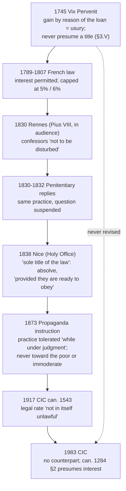

# Theology of Debt · Lesson 5.3: "Not to be disturbed": the nineteenth-century responses

> ⏱ ~15 min · Module 5: Usury: development · Builds on: [5.2 *Vix Pervenit*](05-02-vix-pervenit.md), [4.4 The extrinsic titles](04-04-the-extrinsic-titles.md), [`moral-theology` 4.1 Casuistry and probabilism](../../moral-theology/lessons/04-01-casuistry-and-the-probabilism-controversy.md), [`fundamental-theology` 4.5 Reading a document's weight](../../fundamental-theology/lessons/04-05-reading-a-documents-weight.md) · Unlocks: [5.4 Did the usury doctrine change?](05-04-did-the-usury-doctrine-change.md), [6.1 Usury and finance in modern teaching](06-01-usury-and-finance-in-modern-teaching.md)

## Why this matters

Ask when the Church "allowed interest" and you will usually be told 1830. That answer is half right, and the wrong half matters. Between 1830 and 1838 Rome told confessors, several times, to stop refusing absolution to people who took the moderate interest the civil law allowed. Each time it declined to say *why*, and in 1873 it said in so many words that the question was still open. Read those replies precisely and you can say what changed in the Church's practice, what did not change in its teaching, and why [5.4](05-04-did-the-usury-doctrine-change.md)'s question is hard.

## The idea

[5.2](05-02-vix-pervenit.md) left the doctrine in 1745 at its sharpest: any gain demanded *by reason of the loan itself* is [usury](../reference.md#usury), however moderate the rate or rich the borrower. Gain is licit only on an extrinsic title, or through a contract that is not a loan. And no one may presume that a title is always present (§3.V).

Then the law of Europe moved. A French decree of October 1789 permitted stipulated interest. The Civil Code of 1804 (art. 1905) allowed interest on a simple loan of money, and a law of 1807 capped it, at 5 percent in civil matters and 6 in commercial. Catholic merchants, widows living on invested savings, and parish trustees now lent at a rate the state called lawful. Confessors split. Some refused absolution until the interest was given back. Others absolved. Bishops wrote to Rome.

The theologians who defended the practice offered two rationales (both paraphrased from the manual literature):

- **The [legal title](../reference.md#titulus-legis)** (*titulus legis*). The civil law, legislating for the common good, can itself create a just title to moderate interest. Or, on a weaker version, the law's rate is a fair public presumption that the usual titles are present.
- **Money as productive capital.** Where anyone can put money into shares, rents or trade at a return, lending always costs the lender a gain. So [*lucrum cessans*](../reference.md#lucrum-cessans) (profit forgone) is no longer occasional. It is the normal condition of every loan.

Notice the collision. The second rationale says, in effect, that a title is always present, which is exactly what *Vix Pervenit* §3.V forbade anyone to presume. Rome's answers are shaped by that collision. They protect the practice and leave the theory undecided.

An analogy: an appeals court that grants a **stay** does not decide the case. It says what may be done while the case is pending. The nineteenth-century replies are stays.

## Source

The replies are short answers to *dubia* (formal questions), collected in Denzinger–Hünermann. All translations are the lesson's own.

**Rennes, 1830.** The bishop of Rennes described confessors who try to dissuade a penitent from lending to merchants at interest. If he persists, they require him to promise, with filial obedience, to abide by the Pope's judgment "if one is given, whatever it may be". Then they absolve, though they think the contrary opinion more probable. Could the bishop approve them? Pius VIII answered in audience on 18 August 1830 (DH 2722–2724):

> "To the first: they are not to be disturbed (*non esse inquietandos*). To the second: answered in the first."

Note who is "not to be disturbed": the **confessors**, not the interest.

**Nice, 1838.** The Holy Office replied to the bishop of Nice on 17 January 1838 (DH 2743). The question put the case exactly:

> "Whether penitents who have taken a moderate gain from a loan on the sole title of the law (*solo legis titulo*), in doubtful or bad faith, may be absolved sacramentally with no burden of restitution imposed, provided they are sincerely sorry … and are ready with filial obedience to abide by the commands of the Holy See? Reply: Affirmative, provided they are ready to abide by the commands of the Holy See (*dummodo parati sint stare mandatis S. Sedis*)."

**The summary, 1873.** An instruction of the Congregation for the Propagation of the Faith collected eleven earlier replies and closed with five conclusions (DH 3105–3109). Numbers 1–2 restate *Vix Pervenit*: nothing may be taken by force of the loan itself, but something may be taken on an extrinsic title. Numbers 3–4:

> "3. Even when every other title is lacking, such as *lucrum cessans*, *damnum emergens*, and the risk of losing the principal or of undertaking unusual labor to recover it, the title of the civil law alone can be held sufficient in practice, both by the faithful and by their confessors, who therefore may not disturb their penitents on this matter, so long as this question hangs under judgment and the Holy See has not explicitly defined it. 4. The toleration of this practice can by no means be extended to excusing usury toward the poor, however small, or usury that is immoderate and exceeds the limits of natural equity."

Three phrases decide the reading. "**In practice**" (*in praxi*) makes the title of the law a rule for conscience and confession, not a thesis. "**So long as this question hangs under judgment**" (*donec quaestio haec sub iudice pendeat*) says the doctrinal question is open. It is the Holy See saying, of its own reply, that the reply is not a definition. And **toleration** (*tolerantia*) is the Holy See's own word for what it is granting. Number 5 adds that no universal line between moderate and immoderate can be drawn. It must be judged case by case, by place, persons and time.

## The argument

The replies' reasoning, reconstructed:

1. **The doctrine stands.** Gain by reason of the loan itself is usury (*Vix Pervenit*, restated in 1873 nos. 1–2).
2. **Whether the civil law creates a title is doubtful.** Serious theologians hold it does, others deny it, and the Holy See has not decided.
3. **A confessor may not impose an obligation that is genuinely doubtful** (the practical-doubt rule of the manuals, [`moral-theology` 4.1](../../moral-theology/lessons/04-01-casuistry-and-the-probabilism-controversy.md)). *In words:* where the law itself is uncertain, the penitent is not bound to restitution, and absolution may not be refused.
4. **So a penitent who takes moderate legal interest may be absolved without restitution**, and the confessors who do so are not to be disturbed.
5. **The toleration has conditions:** moderation, not from the poor, and readiness to obey a future decision. *In words:* the permission is conditional, and the condition is submission, not a verdict.
6. **The doctrinal question is left pending** "until the Holy See defines it".

Premise 3 is why the formula is familiar. In July 1831 the Sacred Penitentiary told the archbishop of Besançon, in the same words, that a confessor who follows Alphonsus Liguori's opinions was not to be disturbed (DH 2725–2726). "Not to be disturbed" is the Roman formula for *practically safe*. It does not mean *true*.

**The 1917 Code.** Canon 1543, among the canons on contracts in the Code's part on the Church's temporal goods, put the settlement into universal law. No gain may be taken on a loan of fungibles "by reason of the contract itself". But agreeing on the legal rate is "not in itself unlawful" unless it is shown to be immoderate, and a higher rate may be agreed on a just and proportionate title. The 1983 Code has no counterpart to [canon 1543](../reference.md#canon-1543). It simply tells administrators to pay the interest due on a loan or mortgage (can. 1284 §2 5°) and to invest surplus funds with the ordinary's consent (6°). No act has revised *Vix Pervenit*. The Catechism still uses the word "usurious" without defining it (CCC 2269, 2438). That silence is the ground [5.4](05-04-did-the-usury-doctrine-change.md) fights over.

**Mark the levels.** The replies of 1830–1838 are **pastoral directives to confessors**: practical norms for the tribunal of penance, given by the Pope in audience, the Holy Office or the Penitentiary. They are **not doctrinal definitions, and they said so** ("so long as this question hangs under judgment"). They do not teach that interest is licit, and they do not teach that the legal title is valid. What they settle, and bind confessors to, is a **practical** judgment: the legal-title opinion may safely be followed, on conditions. The 1873 instruction's nos. 1–2 carry *Vix Pervenit*'s own weight, since an instruction that restates doctrine does not raise or lower it. Its nos. 3–5 are the same pastoral toleration. Whether the legal title is a real title was **freely disputed** then, and no later act has closed the question. Canon 1543 is **universal law of the Latin Church (discipline)**, binding as law until 1983. What its permission implies doctrinally is **argued**: that the legislator accepted the legal title, or only a presumption for practice. The reach of *Vix Pervenit* itself is [5.2](05-02-vix-pervenit.md)'s question. See [the levels in this course](../reference.md#the-levels-in-this-course).

## Timeline

## Worked examples

**Example 1: the clean case.** Lyon, 1834. A silk merchant's brother lends him 10,000 francs at the legal commercial rate of 6 percent, which is 600 francs a year. He asks no risk premium and claims no forgone profit. He confesses it as a doubt. His confessor applies the replies. The gain is moderate and legal, the borrower is not poor, and the penitent is ready to abide by a future decision. So he is absolved, and no restitution is imposed. What the confessor may **not** tell him is "the Church has declared your interest just". It has declared that he may not be troubled for it.

**Example 2: where it strains.** Same year. A lender advances 200 francs at 5 percent, the legal civil rate, to a weaver who needs it to buy bread for the winter. The rate is legal and moderate, so the title of the law seems to cover it. But the 1873 summary's no. 4 excludes usury "toward the poor, however small", and *Vix Pervenit* §3.V recalls that a simple, free loan is often *owed* to someone in need (it cites Matt 5:42). The confessor's toleration does not reach this case. Only a real extrinsic title survives it, for example a genuine loss the lender suffers. The replies give no rule for where "poor" begins, and no. 5 says the line between moderate and immoderate cannot be drawn in general either. The pastoral settlement stops just where the hard cases start.

## Watch out

- **"In 1830 Rome declared interest morally legitimate" overstates.** The answer concerned *confessors*, it was given as a practical norm, and later replies said the question was pending. Calling any of them a doctrinal definition is an error.
- **"It was only a dodge, with no authority" understates.** These were binding directives from the Holy See to confessors, and canon 1543 was universal law for some 65 years. A confessor who kept refusing absolution was acting against them.
- **You might think "not to be disturbed" means "not guilty".** It means "not to be pressed in confession". It is the same formula used of Alphonsus's followers in 1831.
- **You might think canon 1543 abolished the doctrine.** Its first clause repeats it: no gain "by reason of the contract itself". The permission follows *after* the "but".
- **You might think the 1983 Code repealed canon 1543's permission, and so interest is forbidden again.** Its silence repeals the canon as law. It restores nothing, and no act has either revised or reaffirmed *Vix Pervenit*.

## One-liner

> Rome never said interest was just. From 1830 it told confessors to stop disturbing those who took the moderate legal rate, on condition of obedience and "so long as the question hangs under judgment", and in 1917 wrote that toleration into law.

## Problems

**P1 (🟢)** *(Exegetical (a) · Evaluative (b))* Two **invented** penitents in France in 1835. The legal civil rate is 5 percent.

- **Madame R.**, a widow, lives on her savings of 20,000 francs, lent to a Lyon merchant house at 5 percent. She claims no forgone profit and no special risk. She will obey whatever Rome later decides.
- **Monsieur T.** lends small sums to market porters at 20 percent a year, well above the legal rate. He says the risk is high but keeps no record of losses.

(a) Using the 1838 reply and the 1873 conclusions, say whether each may be absolved without restitution, and name the words that decide it. Two sentences each. (b) T.'s confessor thinks some real risk title might cover part of the 20 percent. In 80 words or fewer, say what the confessor must establish before allowing any of it, and whether the replies help him.

**P2 (🟡)** *(Exegetical)* Canon 1543 of the 1917 Code (the lesson's translation of the Latin):

> "If a fungible thing is given to someone so that it becomes his, and later the same amount in the same kind is to be returned, no gain can be taken by reason of that contract itself. But in the lending of a fungible thing it is not in itself unlawful to agree on the legal gain, unless it is clear that it is immoderate, or even on a greater gain, if a just and proportionate title supports it."

(a) Which words restate *Vix Pervenit*'s definition? (b) Name the three conditions under which interest may be agreed, and say which words carry the burden of proof. (c) One reader says the canon adopts the legal-title theory; another says it only fixes a rule for practice. Quote the two words each would point to. 120 words or fewer in all.

**P3 (🔴)** *(Exegetical)* An **invented** paragraph from a popular history, not the words of any real person:

> "In 1830 Pope Pius VIII declared that moderate interest is morally legitimate, finally reversing *Vix Pervenit*. The Holy Office confirmed the new doctrine in 1838, and the 1917 Code made it Church law. The Church had changed its teaching."

Name **three** errors and correct each from the texts. Then say, in one sentence, which question the paragraph's last sentence raises that the texts themselves do not settle. 130 words or fewer.

Solutions

**P1** *(Exegetical (a) · Evaluative (b))*

**Must hit, strict (a):**
- **Madame R.:** yes. Her gain is "moderate", taken "on the sole title of the law", she is ready "to abide by the commands of the Holy See" (1838), and she is not lending to the poor (1873 no. 4). The replies allow absolution "with no burden of restitution imposed".
- **Monsieur T.:** not on the replies. His rate exceeds the legal rate, so the title of the law does not cover it. And 1873 no. 4 excludes both usury toward the poor and immoderate usury, and he fails on both counts. He must restore whatever part of the gain no real title supports.

**Must hit, any verdict (b):** the risk title (*periculum sortis*, [4.4](04-04-the-extrinsic-titles.md)) must be **real** and **proportionate**: an actual risk to the principal, priced to that risk. *Vix Pervenit* §3.V forbids presuming it. The replies help only negatively: they cover the legal rate, not his excess, and 1873 no. 5 leaves "immoderate" to case-by-case judgment. Either verdict on the portion passes if both points are made.

**Wrong turns:** clearing T. because "the replies allowed interest". They allowed moderate legal interest, on conditions. Refusing R. because *Vix Pervenit* condemns moderate interest, which ignores the toleration. Treating her readiness to obey as optional: it is the stated condition.

**Model answer (b), one of several:** He must show a real, recorded risk of loss and a charge proportioned to it. Without that, the title is presumed, which *Vix Pervenit* forbids. The replies do not help: they tolerate only the legal rate, and they exclude usury toward the poor and immoderate usury. At most, a documented default rate could justify a premium above 5 percent; the rest is restitution.

**P2** *(Exegetical)*

**Must hit, strict:**
(a) "No gain can be taken **by reason of that contract itself**" (*ratione ipsius contractus*), which is *Vix Pervenit*'s *ipsius ratione mutui*. The opening clause is the definition of the *mutuum*.
(b) (1) The legal rate, (2) unless it is clear that it is **immoderate**, or (3) a higher rate on a **just and proportionate title**. The burden lies in "**unless it is clear**" (*nisi constet*): the legal rate is presumed licit until immoderation is shown. A higher rate needs a title that is positively present ("supports it").
(c) The legal-title reading points to "**legal gain**": the law's rate needs no further title. The practical reading points to "**in itself**" (*per se*), a presumption that can be rebutted, not a thesis about the title.

**Wrong turns:** reading "not in itself unlawful" as "just in all cases". Missing that the first clause keeps the prohibition. Treating the higher-rate clause as unconditional.

**Model answer:** (a) "No gain by reason of the contract itself". (b) Legal rate; unless clearly immoderate ("nisi constet" puts the burden on showing immoderation); higher only with a just, proportionate title. (c) "Legal gain" for the theory reading; "in itself" for the presumption reading.

**P3** *(Exegetical)*

**Must hit, strict (three of):**
1. **"Declared moderate interest morally legitimate."** Pius VIII answered that *confessors* who absolve such penitents are "not to be disturbed". That is a pastoral directive, not a declaration on the morality of interest.
2. **"Reversing *Vix Pervenit*."** No reply revised it. The 1873 summary restates its doctrine (nos. 1–2) before tolerating the practice.
3. **"Confirmed the new doctrine in 1838."** The 1838 reply allowed absolution "provided they are ready to abide by the commands of the Holy See", which is a conditional toleration pending a decision.
4. **"The 1917 Code made it Church law."** Canon 1543 made a practical permission law, and its first clause repeats the prohibition. It is discipline, and what it implies doctrinally is argued.

**Final sentence:** whether the teaching changed or developed is freely disputed ([5.4](05-04-did-the-usury-doctrine-change.md)). The texts show changed *practice* under an unrevised doctrine and do not answer the question.

**Wrong turns:** "correcting" the paragraph by saying the Church never allowed any interest (the toleration and canon 1543 are real). Calling the replies infallible because a pope approved one.

**Model answer:** Pius VIII's 1830 answer said the confessors were not to be disturbed. It was a pastoral norm, not a declaration that interest is moral. Nothing reversed *Vix Pervenit*: the 1873 summary restates it, and tolerates the practice only "so long as this question hangs under judgment". The 1838 reply made absolution conditional on readiness to obey a future decision. It confirmed no doctrine. Canon 1543 legislated a permission after repeating the prohibition. Whether all this is a change of teaching is the open question.

## Flashback

**From Lesson [5.1](05-01-the-monti-di-pieta-and-lateran-v.md) (The Monti di Pietà and Lateran V):** *(Exegetical.)* Find the crux. Two positions from the fifty-year quarrel over the monti di pietà, paraphrased:

- **The Franciscan defenders:** the monte's small charge pays appraisers, clerks, a notary, a warehouse and losses on pledges. Without it the fund shrinks until it closes. The borrower who benefits should bear the running costs, and the fund takes no profit.
- **The Dominican critics** (Cajetan among them): the charge is fixed in advance, grows with the sum and the time, and is demanded of the borrower as a condition of the loan. That is what usury looks like, whatever it is called. And the city, not the poor who borrow, should bear the costs of its charity.

(a) Name the single premise the two sides divide on. (b) Say what evidence about a particular monte would move a critic on that premise, and which of the critics' two objections that evidence leaves untouched. (c) What did Lateran V's *Inter multiplices* (1515) "declare and define" about the crux, at what level? Did it adopt, in its own voice, the formula of usury as gain without labor, expense or risk? **Two sentences per part.**

Solution

**Must hit, strict (a):** whether a charge that is **demanded as a condition of the loan and scales with sum and time** is *thereby* a price for the loan itself (the critics), or whether a charge of that shape can be the price of the **labor and expense** of the service that accompanies the loan (the defenders). In short: does a charge's form fix what it pays for, or do its measure and purpose?
**Must hit, strict (b):** **Accounts** showing that the fee equals the monte's real costs and yields no profit to the fund or to anyone behind it. That leaves untouched the critics' **second** objection, that the city should carry the costs rather than the poorest borrowers. That objection is about who ought to pay, not about usury, and the bull answers it with a **counsel** (better if free, with founders paying at least half the officials' wages), not a ruling.
**Must hit, strict (c):** In its operative clause the council "declares and defines" that monti approved by the Holy See, charging something moderate **solely for expenses and without profit**, are **not usurious**, and that the loan is **meritorious**. It forbids anyone from then on to preach or dispute against this, on pain of automatic excommunication. The ruling is **at least authentic magisterium and binding**; whether it is an infallible definition is **argued**. The gain-without-labor-expense-or-risk formula **sits in the report of the critics' case**, introduced by "for" (*enim*), and not in the operative clause. Whether it carries conciliar weight is **argued** (5.1's readings A and B), so it may not be called the council's own definition.
**Wrong turns:** making the crux the *size* of the fee, which both sides could agree to cap. Treating (b)'s audit as answering both objections. Saying the council defined usury as gain without labor, expense or risk. Saying the critics were condemned: the bull commends their zeal for justice.
**Model answer:** (a) They divide on whether a charge fixed in advance, scaled to sum and time and required for the loan is by that fact a price for lending, or can be a price for the service's labor and costs. (b) Audited accounts showing the fee equals cost with no profit would move a critic on that premise. They leave standing his claim that the city, not the poor, should pay, which the bull answers only with a counsel to subsidize. (c) The council declared the monti's moderate, cost-only, profit-free charge not usurious and meritorious, a binding ruling whose infallibility is argued. The "labor, expense or risk" formula appears in its report of the critics' argument, so whether the council made it its own is argued, not settled.

## Connections

- **Backward:** [5.2](05-02-vix-pervenit.md) supplies the definition the replies leave standing and the §3.V warning that the "productive capital" rationale presses against. [4.4](04-04-the-extrinsic-titles.md) supplies the titles that the 1873 summary lists and the title of the law is added to. [5.1](05-01-the-monti-di-pieta-and-lateran-v.md) is the earlier case of Rome approving a practice while leaving the definition of usury where it found it.
- **Forward:** [5.4](05-04-did-the-usury-doctrine-change.md) asks whether 1830–1917 is change or development, with these replies as the change reading's best evidence and the continuity reading's too. [6.1](06-01-usury-and-finance-in-modern-teaching.md) picks up the word "usurious" in modern teaching. Newman, in his *Letter to the Duke of Norfolk* (1875), cited an 1831 Penitentiary reply as a case where the Holy See suspended its decision ([`fundamental-theology` 5.2](../../fundamental-theology/lessons/05-02-newmans-theory-of-development.md)).
- **Sideways:** [`moral-theology` 4.1](../../moral-theology/lessons/04-01-casuistry-and-the-probabilism-controversy.md) gives the probabilist machinery the replies run on. [`history-of-debt`](../../history-of-debt/syllabus.md) has the legal and commercial world that made the question urgent. [`philosophy-of-debt`](../../philosophy-of-debt/syllabus.md) asks the question Rome left pending: can a state's law create a just title to interest? [`economics-of-debt`](../../economics-of-debt/syllabus.md) models the opportunity cost behind the "productive capital" rationale. The card: [*non inquietandos*](../reference.md#non-inquietandos).
