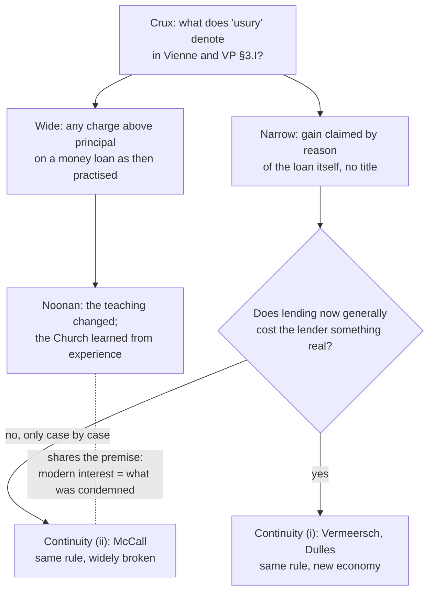

# Theology of Debt · Lesson 5.4: Did the usury doctrine change?

> ⏱ ~15 min · Module 5: Usury: development · Builds on: [5.2 *Vix Pervenit*](05-02-vix-pervenit.md), [5.3 "Not to be disturbed"](05-03-not-to-be-disturbed.md), [`fundamental-theology` 5.1 Vincent of Lérins](../../fundamental-theology/lessons/05-01-vincent-of-lerins.md), [5.2 Newman's theory of development](../../fundamental-theology/lessons/05-02-newmans-theory-of-development.md) · Unlocks: [6.1 Usury and finance in modern teaching](06-01-usury-and-finance-in-modern-teaching.md)

## Why this matters

In 1311 an ecumenical council ordered that anyone who obstinately denied that usury is a sin be punished as a heretic. Today the Code of Canon Law tells Church administrators to pay the interest due on their loans and to invest surplus funds (can. 1284 §2, 5°–6°). Either the Church changed a moral teaching it had backed with the heresy penalty, or "usury" never meant what a modern reader assumes. The question is **freely disputed**; this lesson finds the crux and picks no winner.

## The idea

The facts are agreed. For some six centuries popes, councils and theologians taught that gain demanded on a loan by reason of the loan is sin against justice, and must be restored. *Vix Pervenit* restated it in 1745 ([5.2](05-02-vix-pervenit.md)). From the 1820s Roman responses told confessors not to disturb penitents who took the legal rate, while declining to call such interest licit in itself ([5.3](05-03-not-to-be-disturbed.md)). The 1917 Code (can. 1543) kept the formula, no gain by reason of the loan itself, and allowed the legal rate to be agreed. The 1983 Code has no usury canon.

Three readings of those facts, each as its defenders would put it.

- **The change reading (John T. Noonan).** In *A Church That Can and Cannot Change* (2005) Noonan holds that the deposit of faith cannot change but that moral doctrine has, on slavery, religious liberty and usury. Paraphrased: the old rule forbade *any* profit on a loan. It rested on Scripture as the popes read it (a twelfth-century decretal of Urban III, *Consuluit*, took Luke 6:35 as a precept), and it was enforced with restitution and the heresy penalty. The Church now lends, borrows and invests at interest. Calling that the "same" teaching because a formula survived prizes words over what they forbade. The honest account is that the Church learned, from experience of a commercial economy, that what it had condemned was not always unjust. For Noonan such change is how moral teaching grows, and is no scandal.
- **Continuity (i): the rule stands, the facts changed.** Paraphrased from its classic statements (Arthur Vermeersch in the 1912 *Catholic Encyclopedia*; Avery Dulles replying to Noonan in 2005): the principle was always that the loan as such is barren and gain needs a ground outside it. Where money had few productive outlets, a loan cost the lender nothing and a charge was unjust. Where investment is open to all, parting with money costs something real, and a moderate charge pays for it. The magisterium clarified; it did not overturn. Its common form says titles, above all *lucrum cessans*, are now nearly always present. Vermeersch himself rejected presumed titles and argued that holding money now has a general value that may be priced. His verdict is blunt: "The change in the attitude of the Church is due entirely to a change in economic matters that require the present system."
- **Continuity (ii): the rule stands, and is broken daily (Brian McCall, *The Church and the Usurers*, 2013).** Paraphrased: usury is profit charged on a loan of money as such, and the doctrine's principles are unchanged. What changed is Catholic practice and attention. Titles are real only when proven case by case, so much modern lending, including interest on mortgages for the basic need of shelter, is usurious. He ties modern debt crises to it and asks for a return to the prohibition.

(i) and (ii) share the continuity thesis and split over the facts. Noonan and (ii) share a premise, that interest as now practised is what the old rule condemned, and split over whether the rule was right.

## Source

*Vix Pervenit* ([vix pervenit](../reference.md#vix-pervenit)), §10, the fourth instruction to the bishops. The lesson's own translation from the Latin:

> "Fourthly, we exhort you not to give a hearing to the foolish talk of those who keep saying that the question of usury raised in our time is one of name only, since from money granted to another in any way whatever, fruit is for the most part obtained. How false that is, and how foreign to the truth, we plainly see if we weigh that the nature of one contract is wholly different and separate from the nature of another… There is indeed a very clear difference between fruit lawfully taken from money, which may therefore be kept in both forums, and fruit unlawfully got from money, which the judgment of both forums orders restored."

A crude form of continuity (i) sounds very like the view refused here: money usually bears fruit now, so the old question is only verbal. Benedict XIV answers that fruit is licit or not by *which contract* produced it. That does not deny that titles can become common. §3.V adds the sharper warning that anyone persuading himself that lawful titles or other contracts "are always found and everywhere at hand" does so "falsely, and only rashly". So continuity (i) must hold that titles are *often* present, never presumed, and that §10 targets only the claim that the loan's nature no longer matters. Continuity (ii) reads both paragraphs as condemning modern practice outright.

## The argument

Noonan's case, reconstructed:

1. From the twelfth to the eighteenth century the magisterium taught that any gain on a loan, beyond the principal, by reason of the loan, is sin. (Lateran III, Vienne, Aquinas, VP §3.I.)
2. "By reason of the loan" was applied to ordinary interest on ordinary loans: taking it required restitution. *In words: the rule bit on real lending, not a philosopher's abstraction.*
3. Today ordinary interest on ordinary loans is taken by Catholics, paid and earned by Church institutions under canon law, and taught nowhere as sin.
4. A teaching that forbade X and now permits X has changed, whatever formula survives.
5. ∴ The usury teaching changed.

The continuity readings deny premise 4's application by denying that **X is the same act**. Premise 1's "by reason of the loan" names the *mutuum* considered alone; premise 2 held in a world without titles, so the act forbidden then and the act permitted now differ in morally relevant circumstances. Continuity (ii) instead denies premise 3's *moral* claim: many who take such interest are wrong to.

**The crux** sits in one word. What does "usury" denote in Vienne and in VP §3.I ([usury](../reference.md#usury))? If it denotes *every charge above principal on a money loan as then practised*, Noonan wins the historical point. If it denotes *gain claimed from the loan contract itself, excluding any title*, continuity has room ([the extrinsic titles](../reference.md#the-extrinsic-titles)). The texts' own wording, *ipsius ratione mutui*, favours the narrow sense. Noonan's reply is about what the tradition *did*: it denied that forgone profit was a title in Aquinas's day, applied the rule to ordinary merchants, and treated the titles as narrow exceptions. Evidence on one question would move the argument: could lenders then have claimed titles as widely as lenders now do?

**The development tools.** Vincent's growth clause, taken into Vatican I (*Dei Filius* ch. 4), allows growth "in the same doctrine, the same sense, the same meaning". So the crux is Vincent's question. Of Newman's notes ([development of doctrine](../reference.md#development-of-doctrine)), three bite:

- **Preservation of type.** Continuity: the type is "the loan is gratuitous; gain needs a title". Noonan: the type was a *practice* of gratuitous lending, and that is gone.
- **Continuity of principles.** Commutative justice and equality in exchange run through q.78, VP §3.II and the titles alike. This is continuity's strongest ground.
- **Conservative action upon its past.** Does modern practice protect the old condemnation or let it go? The nineteenth-century responses ([non inquietandos](../reference.md#non-inquietandos)) cut both ways: they kept the formula and withheld endorsement, yet allowed the practice.

The parallel case is the 2018 revision of CCC 2267 on the death penalty ([`moral-theology` 5.4](../../moral-theology/lessons/05-04-the-death-penalty-and-ccc-2267.md)), argued through the same split between principle and application.

**Mark the levels** ([the levels in this course](../reference.md#the-levels-in-this-course)). Vienne's decree (*Ex gravi*, Clementines 5.5): an ecumenical council ordered that obstinately asserting that the practice of usury is not sinful be punished as heresy That usury is a sin therefore stands **at least as theologically certain**, and whether it is *de fide* is argued. A Catholic cannot say the tradition erred in calling usury sin. **What the decree's "usury" denotes is not settled by the decree**, and that is this lesson's crux. *Vix Pervenit*: an encyclical to the bishops of Italy, **authentic magisterium** for its addressees. How far its authority reaches is **argued**. The 1912 *Catholic Encyclopedia* reports a Holy Office statement of 1836 applying it to the whole Church, and denies that this makes it infallible. The nineteenth-century responses: **pastoral directives, not definitions**, and they said so. Can. 1543 (1917): **law**, off the ladder, though it restates the principle. Noonan, Vermeersch, Dulles and McCall: **theologians and scholars**, no rung. Newman's notes: **no rung**. Whether the teaching changed or developed: **freely disputed** ([change or development](../reference.md#change-or-development)).

## Map of positions

## Worked examples

**Example 1: a mortgage split into titles.** An invented bank lends 300,000 dollars for a house at 7.00% a year, and splits the rate as a lender would (the decomposition is [`economics-of-debt`](../../economics-of-debt/syllabus.md)'s; numbers illustrative):

| Component | Rate | First-year dollars | Candidate title |
|---|---|---|---|
| Expected inflation | 2.50% | 7,500 | keeping the principal whole |
| Real cost of the bank's funds | 2.00% | 6,000 | *damnum emergens* (it pays depositors) |
| Expected default loss: 1% default chance × 40% lost | 0.40% | 1,200 | *periculum sortis* |
| Servicing and administration | 0.35% | 1,050 | expense, as with the monti (5.1) |
| **Residual** | **1.75%** | **5,250** | *lucrum cessans*, or nothing |
| Total | 7.00% | 21,000 | |

(Components are simply added, a standard approximation.)

Now run the three readings. **Continuity (i)**: the residual, a quarter of the rate, is the return the bank's capital could earn elsewhere, which is *lucrum cessans* as Lessius generalized it ([4.4](04-04-the-extrinsic-titles.md)). Every line has a title, so the loan is licit. **Continuity (ii)**: the default and servicing lines pass if real, but the residual is profit charged because a loan was made. A title must be a loss this lender actually suffered, not a market average. **Noonan**: the medieval canonist would have refused the residual line, Accepting the table is itself the change.

**Example 2: where it strains.** Inflation compensation fits no classical title. VP §3.I says a loan asks back just as much (*tantundem*) as was received. Is that the same *number* of coins or the same *value*? If value, the 2.50% is not gain at all, and the principal is merely restored. If number, it is gain above principal and must find a title. Neither Vienne nor VP decides it; neither faced sustained inflation of a paper currency. Noonan reads that silence as the old categories running out; continuity (i) reads it as the principle meeting a new fact.

## Watch out

- **Overstating Vienne.** "Vienne defined that interest is heresy" is wrong twice: the decree targets obstinately *asserting that usury is not sinful*, and "usury" is the disputed term.
- **Understating Vienne.** "It was just medieval discipline" misses that the heresy penalty presupposes that usury's sinfulness belongs with the faith. Neither side of this debate may say that.
- **Overstating *Vix Pervenit*.** It went to the bishops of Italy; its reach is argued, not "infallible for the whole Church".
- **Misreporting Noonan.** He claims moral teaching changed, not dogma or the deposit of faith.

## One-liner

> Everyone grants the formula survived. The fight is over whether Vienne's "usury" meant the loan as such or the lending of its day: the narrow sense gives continuity (whether titles are now common or rare), the wide sense gives Noonan's change.

## Problems

**P1 (🟢)** *(Exegetical)* Two positions, paraphrased:

- **A:** "From the twelfth to the eighteenth century, confessors required restitution of ordinary interest from ordinary merchants. Today the same charge is licit. The teaching changed."
- **B:** "The teaching was always that gain from the loan as such is unjust. Then, lenders rarely lost anything by lending; now, they nearly always forgo a return. The teaching is the same; the cases differ."

(a) Name the single premise B must deny in A. (b) Name one kind of historical evidence that would move the dispute toward A, and one that would move it toward B. 100 words or fewer in all.

**P2 (🟡)** *(Evaluative)* Canon 1284 §2 of the 1983 Code directs Church administrators to pay at the stated time the interest due on a loan or mortgage (5°) and, with the ordinary's consent, to invest money left over after expenses (6°). Apply Newman's note of **preservation of type** to this one test: does a Church that writes these rules into its own law preserve the type of the usury teaching? State the type you are testing, then your verdict. 100 words or fewer.

**P3 (🔴)** *(Exegetical)* An **invented** seminary-exam answer, not the words of any real person:

> "The Council of Vienne defined that all interest is heresy. *Vix Pervenit* repeated this infallibly for the whole Church. In the nineteenth century the Holy Office reversed it by declaring moderate interest licit. So, as Noonan proves, the Church changed a dogma."

Name **four** errors and correct each, giving the correct level where a level is at stake. 150 words or fewer.

Solutions

**P1** *(Exegetical)*

**Must hit, strict (a):** B denies that the charge then and the charge now are **the same act in the morally relevant sense**. That is, it denies that "ordinary interest" then and now falls under the same description, because the presence of a title (forgone gain) changes the act. B need not deny A's history of restitution.

**Must hit, strict (b):** toward A: evidence that medieval lenders commonly *did* forgo real returns (open investment outlets, partnerships, the census), yet restitution was still required. Toward B: evidence that such outlets were genuinely scarce, *or* that confessors released lenders who could prove a real title.

**Wrong turns:** saying B denies that the Church ever condemned interest (it concedes this). Offering a verdict instead of evidence. Naming "the Church's authority" as evidence: it does not settle a historical premise.

**Model answer:** (a) B denies that the act then condemned and the act now permitted are the same act, because a title now present changes it. (b) Toward A: proof that medieval lenders forwent real profits and were still made to restore. Toward B: proof that such profits were rarely available, or that proven titles were honoured.

**P2** *(Evaluative)*

**Must hit, any verdict:** state a **type** before judging (for example "gratuitous loan, gain only on a real title", or "a Church that does not live on interest"). Apply it to *both* 5° (paying interest, which is the borrower's side and was never itself usury) and 6° (investing, which may be a non-loan contract). Reach a one-line verdict. Note that one note is evidence, not proof.

**Wrong turns:** treating paying interest as committing usury (q.78 a.4 allows borrowing at usury for a good end). Assuming "invest" means "lend". Giving a verdict with no type stated, so the note does no work. Giving 1284 a rung it lacks: it is law, and it does not define usury.

**Model answer, one of several:** Type: a loan as such earns nothing; gain needs a title or a different contract. 5° is the borrower's side, which even Aquinas allowed for a good end, so it does not touch the type. 6° commands investing, not lending, and a partnership or share is a non-loan contract (4.5). Verdict: the type is preserved, though the canon's silence on how funds are placed means the note is not fully tested. (A "not preserved" answer passes if it argues that the type was a *practice* of gratuitous lending that the Church no longer keeps.)

**P3** *(Exegetical)*

**Must hit, strict (four of):**
1. **Vienne "defined that all interest is heresy."** It decreed that obstinately *asserting that usury is not sinful* be punished as heresy. Its object is an assertion, and "usury" there is the disputed term, not "all interest". Level: usury's sinfulness is at least theologically certain; whether it is *de fide* is argued. The decree's scope is unsettled.
2. **VP "infallibly for the whole Church."** It was an encyclical to the bishops of Italy, authentic magisterium for them. Its wider reach is argued.
3. **"Reversed it by declaring interest licit."** The responses were pastoral directives: penitents were not to be disturbed. They declined to declare interest licit in itself, and they said they were not definitions.
4. **"As Noonan proves … changed a dogma."** Noonan argues that *moral* teaching changed and holds the deposit of faith cannot. His is one side of a freely disputed question.

**Wrong turns:** correcting 1 by calling Vienne "only discipline", which understates it. Correcting 4 by asserting continuity as the Church's answer.

**Model answer:** Vienne punished as heresy the obstinate assertion that usury is not sinful. That makes usury's sinfulness at least theologically certain, but it leaves what "usury" covers open, and "usury" is not "all interest". *Vix Pervenit* went to Italy's bishops; its wider authority is argued, not infallible by assertion. The nineteenth-century responses told confessors not to disturb penitents taking legal interest, pointedly without declaring it licit, and they were pastoral, not definitions. Noonan claims moral teaching changed, not dogma, and whether it changed is freely disputed.

## Flashback

**From Lesson [5.2](05-02-vix-pervenit.md) (*Vix Pervenit* (1745)):** *(Exegetical.)* Close reading. *Vix Pervenit* §9, the third instruction to the bishops (this lesson's translation from the Latin):

> "Thirdly, those who wish to stay free of every stain of usury, and to give their money so as to receive only lawful fruit, are to be warned to declare beforehand the contract, its conditions, and what fruit they ask from the money. This helps to avoid anxiety and scruples and to prove the contract in the external forum; it also shuts out disputes over whether money seemingly well given in fact hides a disguised usury."

(a) Name the three things the passage says the advance declaration achieves, and say whose conscience or which forum each serves. (b) An **invented** lender reads the passage and says: "I wrote the 6 percent into the loan agreement before handing over the money, exactly as §9 asks, so the 6 percent is lawful fruit." Using the passage's own wording and §3 of the encyclical, say what is wrong. **Two sentences per part.**

Solution

**Must hit, strict (a):** (1) It spares the lender **anxiety and scruples**: his own conscience, the internal forum. (2) It lets the contract be **proved in the external forum**, before a court or a Church judge. (3) It **shuts out disputes** about whether an apparently proper transaction hides a **disguised usury** (*palliata usura*), which serves both forums and the peace of the community.

**Must hit, strict (b):** §9 is addressed to those who wish to receive **only lawful fruit**: it presupposes that the fruit is already lawful on some other ground and makes that ground visible; it does not create it. If the declared contract is a *mutuum* and the 6 percent is asked for the loan itself, §3.I makes it usury and §3.II denies that its moderation excuses it; lawful fruit needs a real extrinsic title or a contract of another nature (§3.III), established by inquiry and not presumed (§3.V). The declaration only turns a possibly disguised usury into an open one.

**Wrong turns:** reading §9 as a formality that validates whatever it records. Reading it the other way, as a condition without which any gain is usury: it is an admonition ("are to be warned") for peace of conscience and for proof, not a new definition of the sin. Answering (b) from the modern sense of usury ("6 percent is not exploitative"), which is not the encyclical's question.

**Model answer:** (a) Declaring the contract beforehand spares the lender anxiety and scruples in his own conscience, lets the contract be proved in the external forum, and forestalls disputes over whether the money hides a disguised usury. (b) The passage speaks to people who want to take only *lawful* fruit, so it assumes the fruit is lawful on another ground and makes that ground visible, not lawful. If the 6 percent is charged for the loan itself, §3.I–II make it usury however moderate, and only a real title or a different contract (§3.III), found by inquiry and not presumed (§3.V), would change that.

## Connections

- **Backward:** [4.1](04-01-the-fathers-against-usury.md)–[4.5](04-05-contracts-that-are-not-loans.md) supply the rule, the titles and the non-loan contracts that every reading claims. [5.1](05-01-the-monti-di-pieta-and-lateran-v.md)'s labor/expense/risk tests reappear as the mortgage table's lines. [5.2](05-02-vix-pervenit.md) and [5.3](05-03-not-to-be-disturbed.md) are the texts the crux turns on.
- **Forward:** [6.1](06-01-usury-and-finance-in-modern-teaching.md) asks what modern teaching means by "usury" when it still condemns it, and whether consumer interest qualifies. [6.3](06-03-the-ethics-of-personal-debt.md) meets continuity (ii)'s question about a household mortgage from the borrower's side.
- **Sideways:** [`fundamental-theology` 5.2](../../fundamental-theology/lessons/05-02-newmans-theory-of-development.md) and [5.5](../../fundamental-theology/lessons/05-05-the-loci-theologici.md) own the method and weigh Vienne. [`moral-theology` 5.4](../../moral-theology/lessons/05-04-the-death-penalty-and-ccc-2267.md) runs the parallel case. In the debt thread, [`history-of-debt` 2.1](../../history-of-debt/lessons/02-01-commerce-around-the-prohibition.md) gives the commerce that tests Noonan's historical premise, and [6.1](../../history-of-debt/lessons/06-01-the-american-mortgage-and-2008.md) the mortgage itself. [`philosophy-of-debt`](../../philosophy-of-debt/syllabus.md) asks whether the residual line is just, as philosophy. [`economics-of-debt`](../../economics-of-debt/syllabus.md) owns the rate decomposition.
