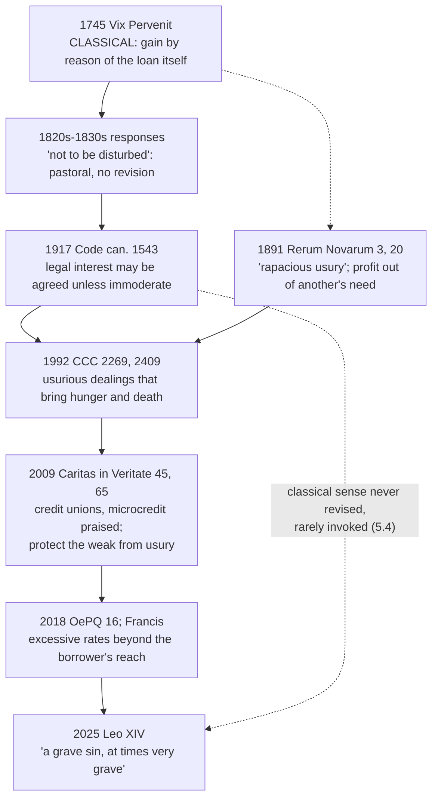

# Theology of Debt · Lesson 6.1: Usury and finance in modern teaching

> ⏱ ~15 min · Module 6: Debt in modern Catholic teaching · Builds on: [5.2 *Vix Pervenit*](05-02-vix-pervenit.md), [5.3 "Not to be disturbed"](05-03-not-to-be-disturbed.md), [5.4 Did the usury doctrine change?](05-04-did-the-usury-doctrine-change.md) · Unlocks: [6.2 International debt and the Jubilee call](06-02-international-debt-and-the-jubilee-call.md), [6.3 The ethics of personal debt](06-03-the-ethics-of-personal-debt.md)

## Why this matters

In 2018 Pope Francis told an Italian anti-usury council that usury is a serious sin. In 2025 Leo XIV told the same council it is a grave sin, "at times very grave". In the same years, Rome praised credit unions and microcredit, and both of them lend at interest. So either the popes condemn what they praise, or "usury" no longer means what it meant in 1745. This lesson shows which, and at what weight each text speaks.

## The idea

There are two senses of the word, and you must always ask which one a text is using.

- **The classical sense** ([usury](../reference.md#usury), 4.3 and 5.2): any gain taken *by reason of the loan itself*, however small, from the borrower of a *mutuum*. A 1% charge with no title behind it is usury. A 40% charge fully covered by real [extrinsic titles](../reference.md#the-extrinsic-titles) is not.
- **The modern magisterial sense** ([usury in modern teaching](../reference.md#usury-in-modern-teaching)): lending that **exploits need**. That means rates beyond what the borrower can bear, profit drawn from someone's distress, and debt that crushes. It is close to what Italian criminal law calls *usura*, which is loan-sharking above a legal threshold. The anti-usury foundations that Francis and Leo addressed exist to fight it.

The two senses cut across each other. A cheap loan with no title is usury in the first sense and not the second. An expensive loan whose price is all real cost may pass the first test and fail the second.

What joins them is history. The nineteenth-century responses told confessors not to trouble penitents who took the moderate legal rate (*[non inquietandos](../reference.md#non-inquietandos)*), and the 1917 Code (can. 1543) let legal interest be agreed unless immoderate ([5.3](05-03-not-to-be-disturbed.md)). Neither act revised *Vix Pervenit*. After that, the documents simply stopped arguing about the classical sense. The word stayed in use and its referent moved.

## Source

*Rerum Novarum* (Leo XIII, 15 May 1891), §3 in the Vatican numbering, Vatican English translation (public domain). The pope is listing what has left workers "surrendered, isolated and helpless":

> "The mischief has been increased by rapacious usury, which, although more than once condemned by the Church, is nevertheless, under a different guise, but with like injustice, still practiced by covetous and grasping men."

And §20, among the duties of the rich:

> "…to exercise pressure upon the indigent and the destitute for the sake of gain, and to gather one's profit out of the need of another, is condemned by all laws, human and divine."

Look at three things. The adjective *rapacious* is doing work: the sentence condemns a *kind* of usury, and it does not say that all interest is usury. "More than once condemned by the Church" points back to the councils and *Vix Pervenit*. "Under a different guise" says the old injustice survives in new contract forms. Whether that means classical usury disguised or a wider exploitation is Boss 6's question. §20 states the principle the modern sense rests on: profit drawn *out of the need of another*. The same paragraph forbids cutting workers' earnings "by usurious dealing". In 1891, then, the vocabulary of exploitation and the vocabulary of usury already stand side by side.

## The argument

The modern documents, in order (the post-1930 texts paraphrased):

1. ***Rerum Novarum* §3, §20 (1891).** It condemns "rapacious usury" as one cause of the workers' misery, and it condemns profit taken from another's need. *In words:* usury is named as oppression of the poor, not analysed as a contract.
2. **The Catechism.** CCC 2269 places the gravest case under the **fifth** commandment. When usurious and greedy dealings bring hunger and death to others, those responsible indirectly commit homicide, and it is imputable to them (the footnote cites Amos 8:4–10). CCC 2409, under the seventh commandment, forbids forcing up prices by exploiting another's ignorance or hardship. CCC 2438 calls for replacing "abusive if not usurious" financial systems between nations, which is [6.2](06-02-international-debt-and-the-jubilee-call.md)'s subject. CCC 2449 lists the Old Testament ban on loans at interest among the laws that protected the poor. *In words:* nowhere in 2401–2463 does the Catechism treat interest on a loan as such. It condemns usury by its effects.
3. ***Caritas in Veritate* (Benedict XVI, 2009).** §45 commends "ethical" finance, especially micro-credit and micro-finance, and warns that the label can be abused. §65 says all of finance must be used ethically. It commends credit unions and traces micro-finance to the civil humanists, "especially… the birth of pawnbroking", that is, the [monti di pietà](../reference.md#monti-di-pieta). It asks that the weak be helped to defend themselves against usury, and that microcredit not become a tool of exploitation. *In words:* interest-bearing lending to the poor is praised, and usury is its corruption.
4. ***Oeconomicae et Pecuniariae Quaestiones* (Congregation for the Doctrine of the Faith and the Dicastery for Promoting Integral Human Development, dated 6 January 2018, published 17 May 2018).** §16 affirms that credit has an irreplaceable social function. It judges that applying excessively high interest rates, really beyond the reach of borrowers, is ethically illegitimate and harmful to the economy, and it lists this *alongside* "usurious activities". It encourages cooperative credit, microcredit and public credit. *In words:* the line falls between service and exploitation, not between lending free and lending at interest.
5. **Papal addresses to Italy's National Anti-Usury Council.** Francis (3 February 2018): usury is a serious sin that kills life and tramples human dignity. He praised the foundations for rescuing over 25,000 families. Leo XIV (18 October 2025): usury is a grave sin, at times very grave. He quoted CCC 2269, extended it to usurious financial systems among nations, and tied the council's work to the Jubilee.
6. **Therefore,** in magisterial usage, at least from 2009 and plausibly from 1891, "usury" names **exploitative lending**. The same documents approve institutions that lend at interest.
7. **What does not follow.** No act declares that the classical sense is withdrawn, or that it is satisfied because titles now almost always exist. Whether ordinary consumer interest is usury in the classical sense remains [5.4](05-04-did-the-usury-doctrine-change.md)'s question.

**Mark the levels** ([the levels in this course](../reference.md#the-levels-in-this-course); genres per [`fundamental-theology` 4.5](../../fundamental-theology/lessons/04-05-reading-a-documents-weight.md)).

- ***Rerum Novarum*** is an encyclical to the bishops of the world. Its principle that profiting from another's need is unjust is **authentic ordinary magisterium (rung 3)**. The usury sentence is a diagnosis, and it defines no term.
- **CCC 2269** keeps the weight of what it summarizes. That lethal exploitation of the poor is gravely wrong is **at least rung 3**, and it restates constant moral teaching. The Catechism does not raise it to a definition, and its silence on interest as such repeals nothing.
- ***Caritas in Veritate***: its principles about finance are **rung 3**. The endorsement of microfinance and credit unions is a **prudential judgment** about means.
- ***OePQ*** is a dicastery document that Francis "approved… and ordered its publication". That is ordinary approval (*in forma communi*), so the act stays the dicasteries', and the document calls itself "considerations for an ethical discernment". The judgment in §16 carries the weight of the teaching it restates. Its structural proposals (separating banking functions, §22; public oversight of rating agencies, §25) are **prudential**.
- **The addresses** are papal teaching in person, at most **rung 3 at its lightest grade**. They restate, and neither defines "usury".
- **Whether modern consumer interest is usury in the classical sense** is **freely disputed (rung 5)**.

## Timeline: one word, two referents

## Worked examples

**Example 1: usury in both senses (invented).** A street lender advances a family 1,000 dollars for a funeral at 10% a week and holds the husband's car title. Simple annual rate: $10\% \times 52 = 520\%$. Compounded weekly: $1.10^{52} - 1 \approx 141.04$, which is about 14,104% a year.

- **Classical:** the charge is for the loan itself. No loss the lender incurs, no forgone profit and no risk comes close to 520% (a risk title must be real and proportionate, [4.4](04-04-the-extrinsic-titles.md)). So it is usury.
- **Modern:** the price comes from the family's need and is beyond their reach, which is what *OePQ* §16 and *Rerum Novarum* §20 describe. It is usury here too.

Both senses convict, and the case is easy.

**Example 2: where the modern test strains (invented).** A microfinance fund lends a market vendor 200 dollars for a year. Servicing a loan that small (visits, bookkeeping, collection) costs the fund about 40 dollars, so expense alone needs $40/200 = 20\%$. Add a cost of funds of 8% and an expected default loss of 3%, and cost-recovery is $20 + 8 + 3 = 31\%$. The fund charges 32%.

- **Classical:** the 20 points are an expense in the manner of the Monti (5.1), the 3 points are risk, and the 8 points count as forgone gain *if* the fund's money had a real alternative use. Only the 1-point residual is open to question.
- **Modern:** *Caritas in Veritate* praises exactly this kind of lending. But *OePQ* judges a rate by whether it is beyond the borrower's reach, not by the lender's costs. A fully cost-justified 32% can still crush a vendor whose margins are thin. The documents give no formula for this. They call for discernment, and they warn that microcredit can be exploited.

So the two senses answer different questions. The classical sense asks what the lender is paid *for*. The modern sense asks what the loan *does* to the borrower.

## Watch out

- **"The Church now defines usury as rates above the legal limit" overstates.** No act defines the modern sense. It is how the documents use the word, read from context. An audience address cannot define anything.
- **"Condemning exploitative lending is only papal opinion" understates.** That it is unjust to profit from another's need is authentic ordinary teaching (rung 3), with roots in Amos and the Fathers. The prudential part is the *means*: caps, regulation, microfinance.
- **You might think the Catechism's silence is permission.** It says nothing about interest as such. Silence does not repeal *Vix Pervenit*, and it does not reaffirm it either.
- **You might think the fifth-commandment placement shrinks usury to lending that kills.** CCC 2269 names the gravest case. CCC 2409 and *OePQ* §16 condemn exploitation well short of death.
- **Praise for credit unions does not settle 5.4.** It shows that the Magisterium treats interest-bearing lending to the poor as a good work. How that fits the classical doctrine is still disputed.

## One-liner

> Modern teaching condemns usury as lending that feeds on need, and it praises honest credit. It never formally withdraws the classical sense, so "is this interest usury?" always needs one more question first: in which sense?

## Problems

**P1 (🟢)** *(Formal (a) · Exegetical (b))* An **invented** payday lender charges a fee of 17 dollars per 100 dollars borrowed for 14 days. A warehouse worker borrows 500 dollars for rent and, unable to repay, rolls the loan over ten times, paying only the fee each time.

(a) Find the simple annual rate (365-day year), the effective annual rate if a 14-day loan is rolled over 26 times, and the worker's total fees after the ten rollovers, with the 500 dollars still owed.
(b) Name the feature of the transaction that *OePQ* §16 and *Rerum Novarum* §20 each target, and say in one sentence why a lender's reply that "the fee is disclosed and the borrower agreed" does not meet it. Three sentences in all.

**P2 (🟡)** *(Exegetical (a) · Evaluative (b))*
(a) Give the act and the rung for each item, one line each: (i) *Rerum Novarum* §3's sentence on "rapacious usury"; (ii) CCC 2269 on usurious dealings that bring hunger and death; (iii) Francis's 2018 statement to the Anti-Usury Council that usury is a serious sin; (iv) *OePQ* §22's proposal to separate banking functions.
(b) An **invented** parish credit union lends members 15,000 dollars for a car at 9% a year. Its cost of funds is 4%, expected defaults are 1% and administration is 2%, and the remaining 2 points go to members' dividends. Is the loan usury in the **classical** sense? Any verdict passes; name the titles and the premise your verdict rests on. 100 words or fewer.

**P3 (🔴)** *(Exegetical)* An **invented** bank-newsletter paragraph, not the words of any real person:

> "Catholics can borrow and lend with a clear conscience: the modern Catechism permits whatever rate the market sets. It moved usury out of the seventh commandment and into the fifth, so only lending that literally kills is condemned. And when Benedict XVI praised microcredit, the Church formally withdrew *Vix Pervenit*."

Name **three** errors, correct each from this lesson or Module 5, and give the correct level wherever a level is at issue. 130 words or fewer.

Solutions

**P1** *(Formal (a) · Exegetical (b))*

(a) Rate per period $= 17/100 = 17\%$ for 14 days.
Simple annual rate $= 17\% \times 365/14 \approx 443.2\%$.
Effective annual rate with 26 rollovers $= 1.17^{26} - 1 \approx 58.27$, which is about **5,827%**.
Fee per rollover $= 0.17 \times 500 = 85$ dollars, so ten rollovers cost $10 \times 85 = 850$ dollars, and the 500 dollars is still owed. The worker has paid 1.7 times the principal in fees.

**Must hit, strict (b):** *OePQ* §16 targets a rate beyond the borrower's reach, which the rollover proves, since he cannot repay principal. *Rerum Novarum* §20 targets profit drawn out of another's need, and the loan was taken for rent. Consent does not answer either one: neither text makes agreement a defence, because what they condemn is exploiting the need that produces the agreement.

**Wrong turns:** multiplying by 26 and calling the product the effective rate, which ignores compounding. Calling the loan usury "because it charges interest", which is the classical sense and not what these texts use. Treating disclosure as the issue.

**Model answer (b):** Both texts target the fact that the price is fixed by the borrower's need and exceeds what he can bear. The rollover shows it, since fees of 850 dollars have not reduced the debt. Agreement does not cure it, because the need that makes a desperate borrower agree is exactly what the texts forbid exploiting.

**P2** *(Exegetical (a) · Evaluative (b))*

**Must hit, strict (a):**
- (i) An encyclical of Leo XIII to the bishops. The principle it expresses is **rung 3**. The sentence is a diagnosis and defines no term.
- (ii) The Catechism, a compendium whose paragraphs keep the weight of their sources. That lethal exploitation is gravely wrong is **at least rung 3** (constant teaching). The Catechism does not make it a definition.
- (iii) A papal address, **rung 3 at its lightest grade** at most. It restates and defines nothing.
- (iv) A dicastery document with ordinary papal approval (*in forma communi*). The proposal is a **prudential** application, not doctrine.

**Must hit, any verdict (b):** map the parts to titles: defaults to *periculum sortis*, administration to expense (Monti-style, 5.1), cost of funds to *lucrum cessans* **only if** the members' money had a real alternative use. Then locate the verdict on the 2-point dividend. Either it is gain by reason of the loan (usury), or it is the return of a *societas* in which members own the union and share its losses (4.5), or it is licit under the post-1830 practice (then say at what level that practice stands).

**Wrong turns:** answering in the modern sense ("9% isn't exploitative"). Citing *Caritas in Veritate*'s praise of credit unions as a ruling on the classical question. Assuming a title exists without the fact that grounds it, which is *Vix Pervenit*'s warning.

**Model answer (b), one of several:** Defaults (1) are risk, administration (2) is expense, and cost of funds (4) is forgone gain, since the deposits would otherwise earn elsewhere. The 2-point dividend is the crux. Members own the union and bear its losses, so the dividend is a partner's share in a common enterprise, not gain charged to the borrower by reason of the loan. Not usury. The premise my verdict rests on is that the union is a true partnership. If the members' capital were guaranteed, the dividend would be a fixed return on a loan.

**P3** *(Exegetical)*

**Must hit, strict (three of):**
1. **"Permits whatever rate the market sets."** False. CCC 2409 forbids exploiting another's hardship, and *OePQ* §16 calls rates beyond the borrower's reach ethically illegitimate. Silence about interest as such is not permission.
2. **"Only lending that kills."** CCC 2269 names the gravest case (indirect homicide). CCC 2409 and *OePQ* §16 condemn exploitation well short of death. The prohibition of unjust exploitation is rung 3.
3. **"Moved usury" as a doctrinal act.** A catechism's arrangement changes no teaching, since paragraphs keep their sources' weight.
4. **"Formally withdrew *Vix Pervenit*."** No act has revised it (5.3). The praise of microcredit is a prudential endorsement (rung 3 principle, prudential means). Whether the classical sense still binds modern lending is freely disputed (rung 5, 5.4).

**Wrong turns:** "correcting" the paragraph by saying the Church still condemns all interest (Module 5 shows the titles and the responses). Calling CCC 2269 a definition.

**Model answer:** The Catechism does not permit any market rate. CCC 2409 condemns exploiting hardship, and *OePQ* §16 calls rates beyond the borrower's reach illegitimate; that principle is rung 3. CCC 2269 treats only the lethal extreme under the fifth commandment, and exploitation short of death is still condemned. The Catechism's arrangement changes no teaching in any case. Benedict's praise of microcredit is a prudential endorsement. No act revised *Vix Pervenit*, and whether its classical sense still bites modern lending is freely disputed.

## Flashback

**From Lesson [5.3](05-03-not-to-be-disturbed.md) ("Not to be disturbed": the nineteenth-century responses):** *(Exegetical.)* Apply to a hard case. An **invented** case, 1880, in a country whose civil law allows a legal rate of 5 percent. Signor V., a shopkeeper, lends his savings to a prosperous wholesale grocer at 5 percent. He claims no forgone profit, no loss and no special risk, and he tells his confessor he will abide by whatever the Holy See may decide. His confessor, Don P., refuses absolution unless he restores the interest: "*Vix Pervenit* §3.V forbids you to presume a title, and the law's rate is exactly such a presumption."

(a) Measured against Rome's replies of 1830–1873, is Don P. within his rights as a confessor? What may he still hold as a theologian? (b) Don P.'s appeal to §3.V treats one question as already settled. Which question, and what did the Holy See say about its status? (c) Suppose that in 1890 the Holy See had decided that the civil law creates no title. What would happen to Signor V.'s toleration, on the replies' own terms? **Two sentences per part.**

Solution

**Must hit, strict (a):** **No.** Signor V. meets every condition of the replies: the moderate legal rate, taken on the title of the law alone, from a borrower who is not poor, with readiness to abide by the Holy See's commands. The 1830 answer said confessors who absolve such penitents are "not to be disturbed", and the 1873 instruction said the title of the law may be held sufficient **in practice** and confessors **may not disturb** such penitents. As a theologian Don P. may still hold that the legal title is no real title, because the replies never declared it valid; what he may not do is impose that opinion as a condition of absolution.
**Must hit, strict (b):** the question **whether the civil law itself creates a real title** (or only a presumption that the usual titles are present). The 1873 instruction said the toleration holds **"so long as this question hangs under judgment"** and the Holy See has not defined it: Rome itself declared the question open, so a confessor cannot treat it as closed by §3.V.
**Must hit, strict (c):** the toleration would **lapse**: it was granted only while the question was pending, and the 1838 reply made absolution conditional on the penitent being **ready to abide by the commands of the Holy See**. Signor V. would be bound by his own stated readiness to stop taking interest on the title of the law alone.
**Wrong turns:** saying the replies declared moderate interest just, so Don P. is simply wrong about the doctrine (they declined to say so). Saying the replies bound only penitents and left confessors free (the 1830 answer and 1873 no. 3 are addressed precisely to confessors). In (c), asserting that the replies prescribe restitution of past interest after such a decision: they say nothing about that.
**Model answer:** (a) No: Signor V. meets the replies' conditions, and from 1830 to 1873 Rome told confessors not to disturb such penitents, since the title of the law may be held sufficient in practice. Don P. may still argue as a theologian that the legal title is no title, since Rome never declared it valid; he may not make that opinion a condition of absolution. (b) He treats as settled whether the civil law can create a real title. Rome said the toleration held "so long as this question hangs under judgment", so the Holy See itself had declared it open. (c) The toleration would end, since it was granted only while the question was pending. Signor V. had promised to abide by the Holy See's commands, so he would be bound to stop taking interest on the title of the law alone.

## Connections

- **Backward:** [5.2](05-02-vix-pervenit.md) gives the classical definition. [5.3](05-03-not-to-be-disturbed.md) explains why later documents could stop arguing about it without revising it. [5.4](05-04-did-the-usury-doctrine-change.md) asks what that silence means. [5.1](05-01-the-monti-di-pieta-and-lateran-v.md) is the pawnbroking that *Caritas in Veritate* §65 names as the root of microfinance.
- **Forward:** [6.2](06-02-international-debt-and-the-jubilee-call.md) carries CCC 2438's "abusive if not usurious" financial systems to the debts of nations. [6.3](06-03-the-ethics-of-personal-debt.md) takes the borrower's and the lender's duties one case at a time. Boss 6 close-reads *Rerum Novarum* §3.
- **Sideways:** [`history-of-debt` 6.5](../../history-of-debt/lessons/06-05-student-and-consumer-debt.md) shows how usury *laws* became rate caps and then were exported away. [`philosophy-of-debt`](../../philosophy-of-debt/syllabus.md) 3.1–3.2 gives the secular account of exploitation that the modern sense resembles, and tests rate caps against it. [`economics-of-debt`](../../economics-of-debt/syllabus.md) has the models behind Example 2's cost of small loans. [`catholic-social-teaching`](../../catholic-social-teaching/syllabus.md) owns *Rerum Novarum* and *Caritas in Veritate* as wholes. [`moral-theology` 3.5](../../moral-theology/lessons/03-05-social-sin-and-cooperation-in-the-sins-of-others.md) explains the sinful structures that Leo XIV's address says usury feeds.
