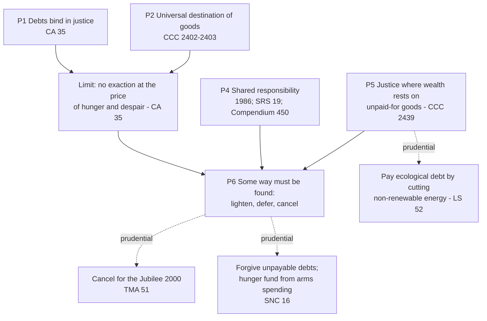

# Theology of Debt · Lesson 6.2: International debt and the Jubilee call

> ⏱ ~15 min · Module 6: Debt in modern Catholic teaching · Builds on: [1.2 The seventh year](01-02-the-seventh-year-deuteronomy-15.md), [1.3 The Jubilee](01-03-the-jubilee-the-land-is-mine.md), [2.1 "The acceptable year of the Lord"](02-01-the-acceptable-year-of-the-lord.md), [`history-of-debt` 5.5 Jubilee 2000 and HIPC](../../history-of-debt/lessons/05-05-jubilee-2000-and-hipc.md) · Unlocks: [6.3 The ethics of personal debt](06-03-the-ethics-of-personal-debt.md)

## Why this matters

Twice in thirty years a pope has used a Jubilee to ask creditor nations to forgive debts: John Paul II for 2000, Francis for 2025. Campaigners heard a command. Critics heard an economist's error in a cassock. Both usually misread the texts, and in the same way: they flatten a principle the Church teaches and a policy it proposes into a single claim. This lesson pulls the two apart.

## The idea

The modern teaching has four moves, and only the last is a policy.

1. **Debts bind.** A loan freely contracted creates a claim in [commutative justice](../reference.md#commutative-justice). The documents never deny this. They open with it.
2. **The claim has a limit.** Goods exist for everyone, and a people has a right to subsistence and development. So a creditor may not press payment when the price is hunger for a whole population. This is the old [pledge law](01-01-lending-in-the-covenant.md) (the cloak back by sunset) at the scale of a nation.
3. **Responsibility is shared.** Bad lending and bad borrowing made the crisis together, and the people who suffer mostly did neither.
4. **So find a way out:** lighten, defer, or cancel. Use the Jubilee as the occasion.

The events belong to [`history-of-debt` 5.5](../../history-of-debt/lessons/05-05-jubilee-2000-and-hipc.md): the 1980s crisis, HIPC, the Birmingham human chain. The secular moral argument belongs to [`philosophy-of-debt`](../../philosophy-of-debt/lessons/05-02-moral-hazard-and-fairness-to-those-who-paid.md) 5.2 and 6.3, and the default models to [`economics-of-debt`](../../economics-of-debt/syllabus.md) Modules 6–8. This lesson asks what the Church teaches, and at what weight.

## Source

These documents are modern and under copyright, so they are paraphrased here and cited by section. All were checked on vatican.va.

- **Pontifical Commission *Iustitia et Pax*, *At the Service of the Human Community: An Ethical Approach to the International Debt Question* (27 December 1986).** This is a curial document. Its thesis is **co-responsibility**: creditors, debtors, banks and the multilateral institutions all share in the causes of the crisis and in its remedy. It also holds that debt service must not strangle a debtor's economy or force privations incompatible with human dignity.
- ***Sollicitudo Rei Socialis* 19 (1987)** cites that document and diagnoses the mechanism. Capital borrowed for development, accepted legitimately if sometimes imprudently and hastily, became a brake on development. Countries now had to export the capital they needed just to service the debt.
- ***Centesimus Annus* 35 (1991)** is the text to read slowly. It opens: "The principle that debts must be paid is certainly just." Then comes the limit. It is not right to demand payment when the effect is political choices that bring hunger and despair to entire peoples, or unbearable sacrifices. In such cases ways must be found to lighten, defer or even cancel the debt, consistent with peoples' right to subsistence and progress. The same section tells weaker nations to make the effort and sacrifices to use their opportunities, and to secure political and economic stability.
- ***Tertio Millennio Adveniente* 51 (1994)**, "in the spirit of" Leviticus 25:8–12, asks Christians to propose the Jubilee as a time to consider substantially reducing, if not cancelling outright, the international debt.
- ***Laudato Si'* 51–52 (2015)** says a true "ecological debt" exists, above all between North and South. It comes from trade imbalances and from some countries' disproportionate use of natural resources over long periods. Developed countries should help pay it by limiting their use of non-renewable energy and by helping poorer countries with sustainable development.
- ***Spes Non Confundit* 16 (9 May 2024)**, the bull announcing the Jubilee of 2025, asks affluent nations to forgive the debts of countries that will never be able to repay them. It calls this justice more than generosity. It quotes *Laudato Si'* 51 and grounds itself on Leviticus 25:23 (the land is the Lord's, and we are its tenants). The same section renews the proposal to fund an end to hunger out of military spending.

Two more texts carry the principles at the Catechism's weight. **CCC 2439**: rich nations owe the poor a duty of solidarity and charity. The duty becomes one of **justice** when their prosperity came from resources that were not fairly paid for. **CCC 2442**: pastors do not intervene directly in the political structuring of society, which is the laity's task. The *Compendium of the Social Doctrine of the Church* 450 (2004) lists the causes on both sides. On the creditor side: exchange-rate swings, speculation, neo-colonialism. On the debtor side: corruption, bad administration, misused loans.

## The argument

1. **A debt freely contracted binds in justice** (CA 35; the course's whole Module 4 presupposes it). *In words:* repayment is the norm, and relief is the exception that needs a reason.
2. **Created goods are destined for all, and peoples have a right to subsistence and progress** (CA 35; CCC 2402–2403, read in [1.3](01-03-the-jubilee-the-land-is-mine.md)).
3. **A claim cannot rightly be exacted at a price that violates 2.** *In words:* the right to be paid survives, but the right to *collect now, at any cost*, does not. This is the national analogue of the excusing cause of grave necessity ([6.3](06-03-the-ethics-of-personal-debt.md)).
4. **Responsibility for unpayable debt is shared** (1986; SRS 19; Compendium 450). Lenders lent hastily, and borrowers misused the money. The hungry are mostly neither.
5. **Where the creditor's wealth rests on unpaid-for goods, relief is owed in justice, not only in charity** (CCC 2439). *In words:* this is the premise *Laudato Si'*'s "ecological debt" and *Spes Non Confundit*'s "justice, not generosity" both stand on.
6. **∴ Creditors and debtors together must find ways to lighten, defer or cancel, and debtors must use relief for their people** (CA 35).
7. **The Jubilee is a fitting occasion** (TMA 51; SNC 16). *In words:* the biblical year of release is invoked as a model and a time, not re-enacted as law.

**The objection the documents meet.** *Moral hazard*: forgive today, and tomorrow's governments borrow recklessly and tomorrow's lenders lend recklessly, both expecting a rescue. The documents never use the phrase, but they meet its substance three ways. They keep premise 1, so relief is an exception with conditions, not a new norm. They put duties on debtors: stability and effort (CA 35), and the named sins of corruption and misuse (Compendium 450). And through premise 4 they put losses on the lenders who took the risk, which is where an incentive argument says losses belong. What the documents do not settle is the empirical question: how much future imprudence a given relief program actually causes. That is [`economics-of-debt`](../../economics-of-debt/syllabus.md) 8.1's question.

**Mark the levels** ([the levels in this course](../reference.md#the-levels-in-this-course)). Premises 1–5 are **authentic ordinary magisterium**. They are taught in encyclicals and the Catechism and repeated across popes, and they are owed religious submission. None is defined. Premise 6 in its general form (some way must be found) is the same teaching applied. **Which way, for which debts, and when** is **prudential** (syllabus Note 6). This covers TMA 51's "reduce or cancel for 2000", SNC 16's appeal, the military-spending fund, and LS 52's energy prescription. Each is a serious papal judgment that deserves a hearing, and none obliges a Catholic economist to agree. CCC 2442 says as much about the division of labor. The 1986 document is a **curial** text. Its principles gained papal weight when SRS 19 and CA 35 took them up; its particular proposals carry the commission's weight alone. [Ecological debt](../reference.md#ecological-debt) splits the same way. The moral claim applies CCC 2439, so it is authentic teaching. Its size and its accounting rest on empirical premises that, by *Laudato Si'* 188's own statement, the Church does not presume to settle.

## Principle and proposal

Solid edges are teaching (authentic ordinary magisterium). Dashed edges are proposals whose application is prudential.

## Worked examples

**Example 1: the test is not a ratio.** An invented country, Corvania, has external debt with a present value of 1,200 million dollars and exports of 1,000 million. That is 120% of exports, under HIPC's 150% threshold ([`history-of-debt` 5.5](../../history-of-debt/lessons/05-05-jubilee-2000-and-hipc.md)), so the creditors' framework offers nothing. But debt service takes 600 of 2,400 million in revenue (25%), while health gets 216 million (9%). Debt service is about 2.8 times the health budget, and child malnutrition is rising. CA 35's test is about *effects on a people*, not a ratio. On these facts the limit in premise 3 plausibly applies even though HIPC does not. What CA 35 does not tell you is the remedy: whether to defer, reschedule or write down, and by how much. That is left to prudence.

**Example 2: where the text strains.** Corvania's government now argues that the North owes it an ecological debt larger than its financial debt, and proposes to **net** the two to zero. *Laudato Si'* 52 contrasts the two debts. It notes that foreign debt has become a means of controlling poor countries, while ecological debt goes unacknowledged. It says the developed world should pay the ecological debt *in kind*, by cutting non-renewable energy use and helping with sustainable development. It never proposes offsetting one against the other, and it names no amount. So the doctrine supports the claim's moral basis (CCC 2439). The netting, the valuation, and whether *this* creditor (perhaps a pension fund in a small country) is the right debtor are prudential and empirical questions the texts leave open.

## Watch out

- **"The Church teaches that all poor countries' debts must be cancelled" overstates twice.** CA 35 affirms that debts must be paid, and "lighten, defer or even cancel" is a range of remedies. Specific cancellation calls are prudential.
- **"It's just the Pope's economic opinion" understates.** The limit on exaction, shared responsibility, and the justice-duty of CCC 2439 are authentic ordinary magisterium, owed religious submission.
- **You might think the Jubilee law is being revived.** The release calendar is a [judicial precept](../reference.md#judicial-precepts), not binding after Christ ([1.2](01-02-the-seventh-year-deuteronomy-15.md)). TMA 51 appeals to the "spirit" of Leviticus 25. The moral core binds; the calendar does not.
- **Odious debt is not a Church doctrine.** The shared-responsibility premise points the same way, and a lender who knew is more responsible. But no magisterial act adopts Sack's three conditions ([`philosophy-of-debt`](../../philosophy-of-debt/lessons/06-03-whose-debt-is-it.md) 6.3).

## One-liner

> Debts bind, but not at the price of a people's hunger; responsibility is shared, so a way out must be found. Which way, and when, is prudence, and the Jubilee is its occasion, not its law.

## Problems

**P1 (🟢)** *(Exegetical)* Give each item its level (authentic ordinary magisterium, prudential application, empirical claim carrying no magisterial weight, or no act at all) and name the act or statement that fixes it. One line each.

(i) Rich nations owe relief in justice, not only charity, where their prosperity rests on resources not fairly paid for (CCC 2439).
(ii) *Laudato Si'* 51's claim that a true ecological debt exists between North and South, taken as a moral claim.
(iii) The quantity of that ecological debt, and which emissions caused which harms.
(iv) *Spes Non Confundit* 16's appeal to affluent nations to forgive the debts of countries that will never repay.
(v) "Catholics must believe that debt cancellation in a Jubilee year is a defined doctrine."

**P2 (🟡)** *(Exegetical (a) · Evaluative (b))* An **invented** case. Northbridge Bank lent 2,000 million dollars to Estaria, a middle-income country, in 2015. The borrower was an unelected government, and Northbridge's own due-diligence file warned that about 40% would go to a presidential compound and the security police, as it did. Estaria is now governed by an elected government. Its people are not starving, but schools are closing. It asks Northbridge for a write-down. Its finance ministry says part of any relief will fund a larger army.

(a) State what the principles of this lesson say to Northbridge and to Estaria's government. Say where they stop giving a verdict. 100 words or fewer. (b) Should Northbridge write down the 800 million that went to the compound and police? Should any relief be conditioned on Estaria not expanding its army? Mark what is prudential. 150 words or fewer.

**P3 (🔴)** *(Exegetical)* Find the crux. **Objector** (paraphrased, no real person): every act of relief teaches future governments and lenders that debts can be escaped. More reckless lending follows, and more future hunger with it. So relief harms the poor it means to help, and the principle that debts must be paid should be applied without exception. **The documents' reply**, as reconstructed in this lesson: the limit on exaction, shared responsibility, and duties laid on debtors. Name the single premise that one side must deny, and say what kind of evidence would move it. 120 words or fewer.

Solutions

**P1** *(Exegetical)*

**Must hit, strict:**
- (i) **Authentic ordinary magisterium.** The Catechism, promulgated by John Paul II as a sure norm of teaching, states it. It is not defined.
- (ii) **Authentic ordinary magisterium.** An encyclical applies (i). The act is *Laudato Si'* 51, and *Spes Non Confundit* 16 repeats it.
- (iii) **Empirical, no magisterial weight.** *Laudato Si'* 188 says the Church does not presume to settle scientific questions.
- (iv) **Prudential application.** It is a papal appeal ("I ask") in a bull of indiction, applying (i) and CA 35 to a class of cases. It deserves a serious hearing but obliges no particular policy.
- (v) **No act.** No council or pope has defined it. The Jubilee calendar is a judicial precept ([1.2](01-02-the-seventh-year-deuteronomy-15.md)), and the calls to cancel are prudential. The statement overstates.

**Wrong turns:** calling (ii) "prudential" because the topic is environmental, which confuses its moral claim with its measurement (iii). Calling (iv) "binding teaching" because a pope wrote it in a bull: the genre of an appeal and its object, a policy, set the level. Calling (i) "defined" because it is in the Catechism.

**Model answer:** see must-hit.

**P2** *(Exegetical (a) · Evaluative (b))*

**Must hit, strict (a):**
- **To Northbridge:** the loan still binds in principle (CA 35). But it knew where 40% would go, so its share of responsibility is heavy (1986; SRS 19; Compendium 450), and it is bound to seek a way out with Estaria.
- **To Estaria:** it must honor what binds and use relief for its people (CA 35's debtor duties). Diverting relief from schools to arms runs against CA 28 and SNC 16's priorities.
- **Where the texts stop:** CA 35's limit (hunger and despair) is not clearly met, and odious debt is not Church teaching. So the texts give no verdict on the size of a write-down or on conditions.

**Must hit, any verdict (b):**
- Weigh Northbridge's knowledge (premise 4) against premise 1.
- Address moral hazard on both sides: the lender's, and a government's that spends relief on arms.
- On conditions, weigh the debtor's sovereignty and self-direction against the purpose of relief.
- Label the verdict prudential (CCC 2442), not taught.

**Wrong turns:** "the Church requires cancellation" (overstates). "Odious, so void" presented as Catholic doctrine. Treating (b) as settled by (a).

**Model answer (b), one of several:** Yes to a write-down of most of the 800 million. Northbridge lent knowing the money would fund a palace and a police force, so on the shared-responsibility premise the loss is largely its own. A lender who bears such losses is exactly what the moral-hazard argument asks for. Conditioning relief on the army is defensible but risky. The relief exists for the people, and CA 35 lays duties on debtors. Still, creditors dictating a nation's defense budget sits uneasily with self-determination. A condition earmarking the relief for schools is narrower and serves the same end. All of this is prudential judgment, which Catholics may reach differently.

**P3** *(Exegetical)*

**Must hit, strict:**
- **The crux is the empirical premise that relief of this kind is anticipated and changes future borrowers' and lenders' behavior enough to cause more harm than it relieves.** The objector needs it. The documents' side must deny it for *conditioned, loss-sharing* relief, or else hold that it is outweighed.
- **Evidence that would move it:** comparative evidence on whether relieved countries re-borrowed recklessly afterward, and whether their creditors lent more loosely. Evidence on whether loss-sharing and conditions curb that. ([`economics-of-debt`](../../economics-of-debt/syllabus.md) 8.1)

**Wrong turns:**
- Naming "debts must be paid" as the crux. Both sides affirm it.
- Treating the limit on exaction as refuted by incentives: the limit is a principle, and the objection bites on how relief is designed, which is the prudential rung.
- Answering with a verdict instead of a crux.

**Model answer:** The disagreement is not over whether debts bind, since CA 35 affirms it. The question is whether relief designed with lender losses and debtor duties still produces enough future imprudence to outweigh the hunger it prevents. That is an empirical claim, and it would move on evidence about re-borrowing and lending after HIPC-style relief. Even if it holds, it strikes at the prudential design of relief, not at the principle that no creditor may exact payment at the price of a people's hunger.

## Flashback

**From Lesson [5.4](05-04-did-the-usury-doctrine-change.md) (Did the usury doctrine change?):** *(Formal (a) · Exegetical (b–c).)* *Vix Pervenit* §3.I says a *mutuum* by its nature asks that just as much (*tantundem*) be returned as was received. An **invented** loan: a lender advances 10,000 units of a paper currency for one year, in a year when prices rise 12%, and the borrower repays 11,500.

(a) Compute the surplus above principal if *tantundem* means the same **number** of units, and if it means the same **value**. Give the real rate of return. (b) For each reading, say what part of the repayment must find a title for the loan to be licit, and name one candidate title for it. (c) Does any magisterial act decide between the two readings? One sentence, with the status of the question. **Two sentences per part for (b)–(c).**

Solution

**Must hit, strict (a):** Number reading: surplus $= 11{,}500 - 10{,}000 = 1{,}500$, which is 15% nominal. Value reading: restoring the value needs $10{,}000 \times 1.12 = 11{,}200$, so the surplus is $11{,}500 - 11{,}200 = 300$. Real rate $= 11{,}500 / 11{,}200 - 1 \approx 2.68\%$. Inflation compensation is $1{,}200/1{,}500 = 80\%$ of the nominal surplus.

**Must hit, strict (b):** **Number reading:** all 1,500 is gain above principal and needs a title, including the 1,200 that merely offsets inflation, which fits no classical title neatly (at most an argued *damnum emergens*). **Value reading:** the 1,200 is simply the principal restored, and only the 300 needs a title, for example *periculum sortis* if the risk to the principal is real, or *lucrum cessans* if the lender really gave up a return elsewhere, established and not presumed (§3.V).

**Must hit, strict (c):** **No act decides it.** Neither Vienne nor *Vix Pervenit* faced sustained inflation of a paper currency, so the question is open and argued: Noonan reads the silence as the old categories running out, continuity (i) as an old principle meeting a new fact.

**Wrong turns:** dividing 300 by 10,000 and calling 3% the real rate (the 300 is in end-of-year units; divide by 11,200). Treating the value reading as the Church's answer, or the number reading as *Vix Pervenit*'s plain sense: the text says *tantundem* and no more. Presuming *lucrum cessans* for the 300 without facts.

**Model answer:** (a) Surplus 1,500 (15%) on the number reading; 300 on the value reading, a real return of about 2.68%. (b) On the number reading the whole 1,500 needs a title, and the 1,200 of it that only offsets inflation fits no classical title comfortably. On the value reading only the 300 needs one, such as a real risk to the principal or a real forgone return. (c) No magisterial act decides it, because neither Vienne nor *Vix Pervenit* faced paper inflation; the question is open, and the change and continuity readings each claim the silence.

## Connections

- **Backward:** [1.1](01-01-lending-in-the-covenant.md)'s pledge laws are the small-scale form of premise 3. [1.2](01-02-the-seventh-year-deuteronomy-15.md) and [1.3](01-03-the-jubilee-the-land-is-mine.md) supply the release laws and Leviticus 25:23, which SNC 16 cites. [2.1](02-01-the-acceptable-year-of-the-lord.md) left open whether Luke 4 carries a social program, and this lesson's proposals do not settle that. [3.5](03-05-the-christian-jubilee-and-the-treasury.md) gave the Church's holy years, which became the occasion of these calls. [5.4](05-04-did-the-usury-doctrine-change.md) gave the tools for separating principle from application.
- **Forward:** [6.3](06-03-the-ethics-of-personal-debt.md) scales the same structure down to one household: the duty to repay, grave necessity as an excusing cause, and the creditor's conscience.
- **Sideways:** [`history-of-debt` 5.5](../../history-of-debt/lessons/05-05-jubilee-2000-and-hipc.md) has the campaign, HIPC's arithmetic and odious debt. [`philosophy-of-debt`](../../philosophy-of-debt/lessons/05-02-moral-hazard-and-fairness-to-those-who-paid.md) 5.2 separates the incentive objection from the desert objection, and 6.3 tests collective responsibility. [`economics-of-debt`](../../economics-of-debt/syllabus.md) 6.2 and 8.1 model willingness to pay and the ex-ante cost of forgiveness. [`catholic-social-teaching`](../../catholic-social-teaching/syllabus.md) 6.1–6.2 own integral ecology and development in general. Card: [shared responsibility](../reference.md#shared-responsibility-for-international-debt), [Centesimus Annus 35](../reference.md#centesimus-annus-35).
