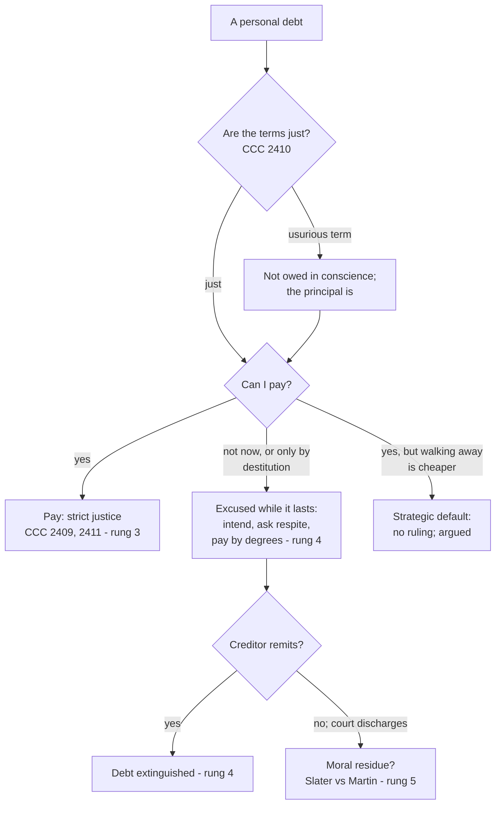

# Theology of Debt · Lesson 6.3: The ethics of personal debt

> ⏱ ~15 min · Module 6: Debt in modern Catholic teaching · Builds on: [2.2 "Forgive us our debts"](02-02-forgive-us-our-debts.md), [4.3 Aquinas on usury](04-03-aquinas-on-usury-ii-ii-q78.md), [5.1 The Monti di Pietà](05-01-the-monti-di-pieta-and-lateran-v.md), [6.1 Usury and finance in modern teaching](06-01-usury-and-finance-in-modern-teaching.md) · Unlocks: Boss problem 6 ([syllabus](../syllabus.md)), [`philosophy-of-debt` 5.3](../../philosophy-of-debt/syllabus.md)

## Why this matters

Everything so far has been about lenders, councils and nations. This lesson is about the debt in your own name: the loan you owe, the loan you are owed, and the friend's loan you signed for. The tradition has a precise answer to "must I pay?" It has a precise answer to "what if I can't?" And on "what if a court says I needn't?", its own manuals split. Knowing which of these answers binds, and at what weight, is the whole skill.

## The idea

Four questions, one per party.

- **The debtor who can pay.** A loan hands over ownership of the money (the [*mutuum*](../reference.md#mutuum) of [4.3](04-03-aquinas-on-usury-ii-ii-q78.md)). What you owe back is the lender's, and keeping it when you could return it is a kind of theft. The Catechism places this under the seventh commandment. CCC 2409 names the deliberate retention of goods lent. CCC 2410 says contracts must be kept to the extent their commitments are morally just. CCC 2411 puts contracts under [commutative justice](../reference.md#commutative-justice) and names paying one's debts among its strict duties.
- **The debtor who cannot.** Inability excuses, but only while it lasts, and it leaves duties behind: the intention to pay, the request for time, payment by degrees. These are the manuals' [excusing causes](../reference.md#excusing-causes).
- **The lender.** Nobody is bound to lend every time they are asked. But lending to someone in need is a work of mercy, and a creditor stands before the same petition as a debtor ([2.2](02-02-forgive-us-our-debts.md)).
- **The third party:** the co-signer, and the employee of a lender. Here suretyship and cooperation come in.

## Source

Aquinas asks whether restitution must be made at once (ST II-II q.62 a.8). The body says yes: to keep another's property is to go on sinning. The second objection says no one is bound to the impossible. His reply (English Dominican translation):

> "When one is unable to restore at once, this very inability excuses one from immediate restitution: even as a person is altogether excused from making restitution if he is altogether unable to make it. He is, however, bound either himself or through another to ask the person to whom he owes compensation to grant him a remission or a respite."

Three words carry it. **"Excuses"**: inability removes the fault; it does not cancel the debt. **"Altogether"**: total inability excuses totally, partial inability excuses partially. **"Ask"**: the excused debtor still has something to do. He cannot just go quiet. He must go to the creditor, who alone can grant **remission** (the debt forgiven) or **respite** (time).

Does "restitution" cover a loan? Yes. In a.6 Aquinas lists the loan as a case where the borrower is bound by the taking itself, not only by the thing, even if he has lost the money, because otherwise the one who did him a favour would lose by it. See the card's [restitution](../reference.md#restitution).

## The argument

1. **What is lent is owed back in strict justice.** A borrower who can pay and does not is keeping what is not his (q.62 a.6, a.8; CCC 2409, 2411). *In words:* an unpaid loan is the lender's money in your pocket.
2. **The contract binds to the extent it is just** (CCC 2410). A usurious term is not owed in conscience. The principal is ([4.3](04-03-aquinas-on-usury-ii-ii-q78.md); for modern exploitative rates, [6.1](06-01-usury-and-finance-in-modern-teaching.md)).
3. **Inability excuses while it lasts** (q.62 a.8 ad 2). The manuals made it two-sided. *Physical* impossibility means you have no means. *Moral* impossibility means paying would cost you or your dependants the necessities of life. Thomas Slater SJ, *A Manual of Moral Theology for English-Speaking Countries* (vol. 1, 1918 edition, the chapter "Causes which excuse from restitution"):

   > "If a man has no means, or if he cannot make restitution without reducing himself to beggary, it will be sufficient if he have the wish and intention to restore when he is able to do so."

   He adds that if one can reasonably lay by a little at a time, doing so is of obligation. *In words:* grave necessity suspends the debt; it does not dissolve it.
4. **The creditor can end it.** A creditor's free remission extinguishes the debt. The manuals treated this as beyond dispute.
5. **Lending itself is ordinarily a counsel.** "Give to him that asketh of thee, and from him that would borrow of thee turn not away" (Matthew 5:42, Douay–Rheims). Aquinas reads the lending counsels this way: no one is always bound to lend, which is why lending counts among the counsels (q.78 a.1 ad 4). Almsgiving from one's surplus to a neighbour in need is a precept (q.32 a.5). So a loan becomes a duty where the need is real and a gift would be owed anyway. Sirach 29:2 puts the two duties in one verse: lend to your neighbour in his need, and repay him on time.
6. **Bankruptcy discharge is where the manuals divide.** Slater held that everything turns on what the civil law intends. A law may justly release an honest debtor, and English absolute discharge did. But in most countries, America included, discharge only bars suit, so the moral duty to pay in full revives if the debtor can. The American edition's own note, by Michael Martin SJ, disputes this for the United States Bankruptcy Act of 1898. The Act itself defines discharge as a release from debts. Its purpose is a fresh start. And creditors who expect nothing further have in effect remitted the rest (premise 4). The same book gives both answers. The 1907 *Catholic Encyclopedia* article "Moral Aspect of Bankruptcy", also by Slater, gives his side.

**Mark the levels.** That a debtor able to pay must pay a just debt is taught by the Catechism as the content of the seventh commandment (CCC 2409–2411): **at least rung 3**, authentic ordinary magisterium, applying a revealed commandment. Calling it "a manual opinion" understates it. The **excusing causes** (inability, grave necessity, remission, payment by degrees) are **rung 4, common teaching**. They come from Aquinas and the manuals; no magisterial act lists them, and the Catechism does not enumerate them. That lending is ordinarily a counsel and becomes a duty in grave need is also **rung 4**. **Whether a discharge leaves a moral residue** is **rung 5, freely disputed**, and the dispute runs through a single manual. **Strategic default** by a debtor who can pay has **no magisterial ruling**. Premise 1 applies to it (rung 3); whether a non-recourse contract changes what was promised is argued. See [the levels in this course](../reference.md#the-levels-in-this-course).

## Map of the debtor's questions

## Worked examples

**Example 1 (clean): Maria and her brother.** Maria borrowed 3,000 dollars from her brother Luis, interest-free, and then lost her job. Her unemployment benefit covers rent and food and nothing more.

- *Must she pay now?* No. Paying would cut into necessities, which is moral impossibility (premise 3). The excuse is real, not a loophole.
- *What is she bound to?* To keep the intention to pay. To tell Luis and ask for time, as q.62 a.8 ad 2 requires, rather than avoiding him. Once she is working again and can lay by 150 dollars a month, to pay: $3000 / 150 = 20$ months.
- *Luis's side.* He may insist, justly, on eventual payment. He may also remit the debt, which ends it (premise 4). The tradition does not make remission a strict duty. But Luis prays "as we forgive our debtors" as a creditor, and Sirach 29 and Luke 6:35 describe the lender who gives time and hopes for nothing. Whether the petition *obliges* a creditor to forgive a money debt is an open question ([2.2](02-02-forgive-us-our-debts.md)). That it *examines* him is not. Did I press when I could have waited? Did I shame? Did I lend at all?

**Example 2 (hard): the payday-loan clerk.** Dev works the counter at a storefront lender. Its loans run at annual rates in the hundreds of percent, marketed to people who cannot get credit elsewhere. [6.1](06-01-usury-and-finance-in-modern-teaching.md) showed that modern magisterial usage calls such lending usury in the wider sense of exploiting need. CCC 2409 also forbids profiting from another's ignorance or hardship. Run [`moral-theology` 4.2](../../moral-theology/lessons/04-02-double-effect-and-cooperation-as-catholic-method.md)'s apparatus without re-teaching it.

- The **janitor** and the **IT contractor** give mediate, remote material cooperation. It is licit for a proportionate reason, such as needing the wage.
- **Dev** does not want the borrowers exploited, so his cooperation is not explicit formal. But his act is writing the contract itself. If the loan's terms are unjust in themselves, his is immediate material cooperation in an unjust act, which 4.2 excludes. It may even be implicit formal.
- **The strain.** Is a given 400% loan unjust in itself, or unjust only when it exploits a particular borrower's hardship? The first reading makes Dev's job illicit. The second makes it depend on the customer. That is [6.1](06-01-usury-and-finance-in-modern-teaching.md)'s unsettled question about modern consumer interest, rung 5, and the cooperation analysis inherits its uncertainty. What *is* settled: CCC 2412 binds those who knowingly share in an injustice to restitution in proportion to their part. So "I only worked there" is not automatically the end of the matter.

The positive alternative has a history. The [monti di pietà](../reference.md#monti-di-pieta) ([5.1](05-01-the-monti-di-pieta-and-lateran-v.md)) lent to the poor at cost. Their modern heirs include the credit unions: Alphonse Desjardins's *caisses populaires* in Quebec (from 1900), and St. Mary's Bank in Manchester, New Hampshire (1908), organized by the parish priest Pierre Hevey with Desjardins's help and counted as the first credit union in the United States.

## Watch out

- **"Can't pay, so I owe nothing" overstates the excuse.** Inability suspends the debt while it lasts. It leaves the intention, the request for time, and payment by degrees.
- **"Bankruptcy is theft, full stop" and "a discharge settles it in conscience" both overstate.** The residue question is rung 5, with Slater and his own American editor on opposite sides.
- **Calling the duty to repay "just the manuals" understates it.** The Catechism teaches it under the seventh commandment (CCC 2409–2411). Only the list of excusing causes is manual common teaching.
- **CCC 2408 is not a debtor's excuse clause.** It says taking another's goods in urgent necessity, to meet immediate essential needs, is not theft. The manuals' moral-impossibility excuse runs on a related logic, but reading 2408 as the Catechism's ruling on repayment stretches it.
- **Suretyship is a real promise.** Sirach warns against it and praises it, in the same chapter. Both warnings and praise assume the surety pays.

## One-liner

> A just debt you can pay is owed in strict justice; inability suspends it but leaves you owing the asking, the intending and the paying-by-degrees; a creditor can end it by remission; and whether a court's discharge ends it in conscience is a question the manuals themselves left open.

## Problems

**P1 (🟢)** *(Exegetical)* Give each claim its rung from [the levels in this course](../reference.md#the-levels-in-this-course), and name the act or source that fixes it. One sentence each.

- (a) A borrower who can repay a just loan and keeps the money sins against the seventh commandment.
- (b) A debtor who could repay only by leaving his children without food is excused for as long as that lasts.
- (c) After a United States bankruptcy discharge, an honest debtor who later becomes rich is bound in conscience to pay the discharged balance.
- (d) A homeowner who can pay but walks away from an underwater mortgage commits theft.

**P2 (🟡)** *(Exegetical (a) · Evaluative (b))* An **invented** case. Tomás co-signed his friend Jake's 12,000-dollar car loan. Jake has stopped paying and disappeared. The bank now demands 9,000 dollars from Tomás. He can pay 300 dollars a month without hardship. He reads Sirach 29 (Douay–Rheims; modern numbering in brackets):

> "A good man is surety for his neighbour: and he that hath lost shame, will leave him to himself." (29:18 [29:14]) "Evil suretyship hath undone many of good estate, and hath tossed them as a wave of the sea." (29:23 [29:18]) "Recover thy neighbour according to thy power, and take heed to thyself that thou fall not." (29:26 [29:20])

(a) Is Tomás bound to pay the bank, and on what ground? Does any excusing cause apply? Two sentences. (b) Tomás argues: "Sirach calls this an *evil* suretyship that ruins good men, so God does not want me to pay." Is that a good reading of the passage? 100 words or fewer.

**P3 (🔴)** *(Exegetical (a) · Evaluative (b))* An **invented** case. Ana owes 400,000 dollars on a non-recourse mortgage: by law, the lender's only remedy on default is to take the house. The house is now worth 250,000 dollars. Ana can afford the payments but plans to stop paying and let the bank foreclose.

- **Position A:** Ana promised to repay the loan. Walking away while able to pay is deliberate retention of goods lent (CCC 2409), and the foreclosure law only limits what the bank can *enforce*.
- **Position B:** The contract itself names surrender of the house as the lender's full remedy, and the rate was priced for that. Walking away performs one of the contract's terms rather than breaking it.

(a) Name the single premise the two positions divide on, and say what would settle it for a particular contract. (b) Give your verdict and your best reason. 120 words or fewer for (b).

Solutions

**P1** *(Exegetical)*

**Must hit, strict:**
- **(a) At least rung 3.** The Catechism teaches it as the content of the seventh commandment: CCC 2409 (deliberate retention of goods lent) and 2411 (commutative justice requires paying debts).
- **(b) Rung 4, common teaching.** The source is Aquinas, q.62 a.8 ad 2 (inability excuses), and the manuals' "moral impossibility" (Slater). No magisterial act enumerates it.
- **(c) Rung 5, freely disputed.** Slater says the residue remains in America; Martin's American note in the same manual says the 1898 Act releases in conscience. No act of the Church settles it.
- **(d) No magisterial ruling.** The premise that contracts bind is rung 3 (CCC 2410). Whether this default breaks the contract is argued (rung 5), so the claim as stated overstates.

**Wrong turns:** calling (a) defined dogma because the Decalogue is revealed; no act defines this formulation. Calling (a) "a manual opinion." Citing CCC 2408 as fixing (b); 2408 concerns taking in urgent necessity, not repayment. Answering (c) from the civil law alone, since the question is the moral effect.

**Model answer:** (a) At least rung 3: the Catechism teaches it under the seventh commandment, CCC 2409 and 2411. (b) Rung 4: Aquinas (q.62 a.8 ad 2) and the manuals' moral impossibility, with no magisterial act. (c) Rung 5: Slater and Martin disagree within one manual, and nothing settles it. (d) Overstated: CCC 2410 (rung 3) says contracts bind, but whether a non-recourse default breaks one has no ruling and is argued.

**P2** *(Exegetical (a) · Evaluative (b))*

**Must hit, strict (a):** yes. A surety freely took on the obligation to pay if the principal debtor did not. Keeping that promise is owed in commutative justice (CCC 2410–2411). No excusing cause applies: he can pay 300 dollars a month without hardship, so there is no physical or moral impossibility. At most he may ask the bank for terms, and he keeps his own claim against Jake.

**Must hit, any verdict (b):** read what "evil suretyship" describes in 29:23 [29:18], which is ruin as a *consequence* of suretyship, and whether the passage treats the surety's duty as void. Weigh 29:18 [29:14], which praises the surety and blames the one who abandons him. Weigh 29:26 [29:20], which counsels prudence *before* taking the risk. Any verdict passes if it engages all three verses.

**Wrong turns:** treating Sirach's warning as a release clause. Using an excusing cause that the facts rule out. Denying that a surety's promise is a real debt.

**Model answer (b), one of several:** No. The passage warns about suretyship as a *risk* ("undone many of good estate") and counsels caution beforehand ("take heed... that thou fall not"). It never says a surety may renege. Its praise is for the surety who stands by his neighbour (29:18 [29:14]), and its blame is for the one who "hath lost shame", which here is Jake. Sirach 8:16 [8:13] says it outright: whoever stands surety should think of himself as the one who will pay. The warning bites before signing. After signing, Tomás's remedy is prudence in future and his claim against Jake.

**P3** *(Exegetical (a) · Evaluative (b))*

**Must hit, strict (a):** the crux is **what Ana promised**. Did she promise to repay 400,000 dollars, with foreclosure as a mere enforcement limit (A)? Or did she promise to pay *or* surrender the house, with the lender accepting the house as full satisfaction (B)? Both sides accept CCC 2410: contracts bind. What would settle it: the contract's own terms and the shared understanding of the parties when they made it. Is there a promise-to-pay clause? Did the law and the lender's pricing treat surrender as full performance, or only as a remedy?

**Must hit, any verdict (b):** state which reading of the promise you adopt and why. Say whether that makes walking away retention of goods lent (CCC 2409) or performance. Note that there is no magisterial ruling, so the verdict is argued (rung 5). Address one cost the other side raises: the lender's loss for A, or the bargained-for risk for B.

**Wrong turns:** treating the civil law's non-recourse rule as settling the moral question, when legal unenforceability is not release (compare Slater on discharge). Treating Ana as excused by inability; she can pay. Claiming a magisterial ruling either way.

**Model answer (b), one of several:** I side with A. A mortgage note is a promise to repay a sum, and the non-recourse rule, like Slater's American discharge, limits what the creditor can *compel*, not what was *promised*. Ana can pay, so no excusing cause applies, and handing over a house worth 150,000 dollars less than she owes keeps the lender's money. B would be right for a contract that expressly offered surrender as full satisfaction. The verdict turns on the contract's terms, and nothing here is a magisterial ruling.

## Flashback

**From Lesson [6.1](06-01-usury-and-finance-in-modern-teaching.md) (Usury and finance in modern teaching):** *(Exegetical.)* Find the crux. An **invented** case. Helena keeps 50,000 dollars idle in a current account that pays nothing and would not otherwise invest it. She lends it for a year to her brother-in-law, a prosperous property developer, at 3%, which is 1,500 dollars. The loan is fully secured, and he can repay easily. Two readers disagree:

- **A:** "Modern teaching condemns usury as lending that exploits need, at rates beyond the borrower's reach. He is rich and 3% is trivial for him, so there is no usury here."
- **B:** "She loses nothing, forgoes nothing and risks nothing, so the 1,500 dollars is claimed by reason of the loan itself. That is usury, and no act has withdrawn that definition."

(a) Which sense of "usury" does each reader use, and is each right on its own terms? (b) Name the single premise they divide on, what would settle it, and its present status. **Two sentences per part.**

Solution

**Must hit, strict (a):** A uses the **modern magisterial sense** (exploiting need: *Rerum Novarum* §20, *OePQ* §16) and is right on its terms: nothing here feeds on need or exceeds the borrower's reach. B uses the **classical sense** (*Vix Pervenit* §3.I) and is right on its terms: with no real *damnum emergens*, *lucrum cessans* or *periculum sortis*, the gain is claimed by reason of the loan, and §3.II rejects exactly A's facts (a moderate rate, a rich borrower, a productive use) as excuses.

**Must hit, strict (b):** they divide on **whether the modern usage has replaced the classical sense or only sits beside it unwithdrawn**; neither disputes the other's reading of the facts. It would be settled by a magisterial act that withdraws or reaffirms the classical definition, and none exists (the responses and can. 1543 were pastoral and disciplinary, not revisions), so whether the classical sense still binds such lending is **freely disputed (rung 5)**.

**Wrong turns:** treating A and B as disagreeing about the facts. Answering with a verdict on Helena instead of a crux. Citing the nineteenth-century toleration as a ruling that such interest is just (it was a practical norm for confessors). Rescuing B's case with a presumed *lucrum cessans* when the facts exclude it. Calling A's sense a formal redefinition: no act defines the modern sense either.

**Model answer:** (a) A uses the modern sense, exploitation of need, and on it Helena's loan is plainly not usury; B uses the classical sense, gain by reason of the loan itself, and with no title present the 1,500 dollars is exactly what *Vix Pervenit* §3.I–II condemns. (b) The crux is whether modern usage has displaced the classical definition or merely stopped invoking it. Only an act withdrawing or reaffirming that definition would settle it; none has been issued, so the question is freely disputed.

## Connections

- **Backward:** [4.3](04-03-aquinas-on-usury-ii-ii-q78.md) gave the *mutuum* and commutative justice, which premise 1 applies from the borrower's side. [5.1](05-01-the-monti-di-pieta-and-lateran-v.md) gave the cost-only lender whose heirs are the credit unions. [6.1](06-01-usury-and-finance-in-modern-teaching.md) gave the modern, wider sense of usury on which the payday-clerk case turns. [2.2](02-02-forgive-us-our-debts.md) gave the petition that makes every creditor examine himself. Cooperation is [`moral-theology` 3.5](../../moral-theology/lessons/03-05-social-sin-and-cooperation-in-the-sins-of-others.md) and [4.2](../../moral-theology/lessons/04-02-double-effect-and-cooperation-as-catholic-method.md).
- **Forward:** Boss problem 6(d) in the [syllabus](../syllabus.md) puts the whole lesson to work on one parishioner's debt.
- **Sideways:** [`history-of-debt` 4.2](../../history-of-debt/lessons/04-02-debtors-prisons-and-the-invention-of-bankruptcy.md) tells how discharge was invented, as a prize for debtors who disclosed their assets. That is exactly why its moral effect was open to the manualists' argument. [`history-of-debt` 6.5](../../history-of-debt/lessons/06-05-student-and-consumer-debt.md) has the credit card and the nondischargeable student loan. [`philosophy-of-debt`](../../philosophy-of-debt/lessons/05-03-bankruptcy-as-a-moral-institution.md) 5.3 argues bankruptcy as a moral institution. [`economics-of-debt`](../../economics-of-debt/syllabus.md) models household default and the rate premium Slater predicted a discharge law would produce. The card: [suretyship](../reference.md#suretyship), [bankruptcy discharge and conscience](../reference.md#bankruptcy-discharge-and-conscience).

The course began with a law that made the creditor's claim bend. In the seventh year the loan was released, and in the fiftieth the land went home, because the land and the people were the Lord's ([1.2](01-02-the-seventh-year-deuteronomy-15.md), [1.3](01-03-the-jubilee-the-land-is-mine.md)). It ends in the same place, at the scale of one household. The debtor owes, really owes, and justice does not bend for convenience. But the tradition never lets the claim be the last word. Inability suspends it. A creditor can remit it. And every creditor prays, daily, to be released as he releases. The Jubilee was never a rule for cancelling debts on demand. It was a reminder, written into the calendar, that every creditor is also a debtor to God.
