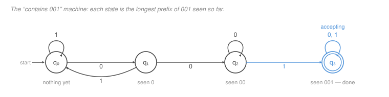

# Automata & Computability · Lesson 1.1: Deterministic finite automata

> ⏱ ~15 min · Module 1: Finite Automata & Regular Languages · Builds on: [discrete-mathematics 2.2 (relations)](../../discrete-mathematics/lessons/02-02-relations-equivalence-and-order.md), [2.3 (functions)](../../discrete-mathematics/lessons/02-03-functions-and-cardinality.md) · Unlocks: 1.2 (NFAs & the subset construction)

## Why this matters

Before you can ask *what can a computer do*, you need a computer simple enough to answer the question about. The deterministic finite automaton is that computer: fixed, finite memory, one left-to-right pass over the input, no going back. It is weak enough to be completely understood and strong enough to be everywhere — `grep`'s literal matcher, a lexer's token scanner, a TCP connection's state machine, the validator on a form field. Every one of them is this object.

It also sets the register for the whole course. A DFA is not code you run; it is a mathematical object you reason about. The question is never "does this implementation work on my test cases" but "does this machine accept **exactly** the strings I claimed, and can I prove it."

## The idea

Imagine reading a string one character at a time through a slot, with nothing to write on. All you may keep is a single sticky note with a fact on it — and that note can only hold one of finitely many possible facts, fixed before you started. Each character you read tells you how to update the note. When the input runs out, you look at your note and say yes or no.

That is the whole model. The "facts" are called **states**, the update rule is the **transition function**, and the yes-notes are the **accepting states**.

The design skill is entirely in choosing the facts. For "does this string contain `001`?" the right note is *how much of `001` have I got going right now* — nothing, `0`, `00`, or done. Four facts, and each new character updates the note without ever looking back at what you read. That is what makes finite memory enough: you never need the input again, only the summary.

And the design skill's flip side is the impossibility skill. If a language needs you to remember something with infinitely many possible values — a count that can grow without bound, say — no finite sticky note will do, and no DFA exists. That is Lesson 1.5.

## The formal version

A **deterministic finite automaton** is a 5-tuple $M = (Q, \Sigma, \delta, q_0, F)$ where

- $Q$ is a **finite** set of states,
- $\Sigma$ is a finite **alphabet** (the input symbols),
- $\delta : Q \times \Sigma \to Q$ is the **transition function**,
- $q_0 \in Q$ is the **start state**,
- $F \subseteq Q$ is the set of **accept states**.

In words: from any state, reading any symbol, you go to exactly one state. "Deterministic" is precisely that $\delta$ is a *function* — total (defined on every pair) and single-valued.

A **run** of $M$ on a string $w = w_1w_2\cdots w_n$ (each $w_i \in \Sigma$) is the sequence of states $r_0, r_1, \dots, r_n$ with

$$r_0 = q_0, \qquad r_{i} = \delta(r_{i-1},\, w_i) \ \text{ for } 1 \le i \le n.$$

$M$ **accepts** $w$ if $r_n \in F$, and **rejects** otherwise. Note there is exactly one run per string, so acceptance is never ambiguous.

The **language of $M$** is the set of strings it accepts:

$$L(M) = \{\, w \in \Sigma^* : M \text{ accepts } w \,\}.$$

In words: $L(M)$ is everything the machine says yes to — nothing more, nothing less. Here $\Sigma^*$ is the set of *all* finite strings over $\Sigma$, including the empty string $\varepsilon$; $|w|$ denotes the length of $w$.

A language $A \subseteq \Sigma^*$ is **regular** if $A = L(M)$ for some DFA $M$.

Two habits worth forming now. First, "$M$ recognizes $A$" is a claim of *equality* of sets — it needs both directions, every string in $A$ accepted and every string outside $A$ rejected. A machine that accepts everything in $A$ and also some junk does not recognize $A$. Second, $\delta$ being total means there is no "stuck" — a DFA that wants to reject early does so with a **trap state** (also called a dead state) that loops to itself and is not accepting.

## Picture

Read the diagram as the sticky note: the state name *is* the fact you are keeping. The self-loop on $q_0$ labelled `1` says a `1` from scratch teaches you nothing. The back-edge $q_1 \xrightarrow{1} q_0$ says a `1` after a lone `0` destroys your progress — but the self-loop on $q_2$ labelled `0` says an extra `0` after `00` does **not**, because you still have `00` in hand. That single asymmetry is the whole subtlety of the machine, and it is exactly what a careless design gets wrong (see P3).

Conventions in the diagram, standard everywhere: an arrow from nowhere marks the start state, a double circle marks an accept state, and an edge labelled `0, 1` stands for two edges.

## Worked examples

**Example 1 (mechanical): even number of `1`s.** Take $\Sigma = \{0,1\}$ and

$$A = \{\, w \in \Sigma^* : w \text{ has an even number of } 1\text{s} \,\}.$$

The fact to keep is the parity of the count so far — two possible values, so two states. Let $Q = \{E, O\}$ ($E$ = "even so far"), $q_0 = E$, $F = \{E\}$, and

| $\delta$ | `0` | `1` |
|---|---|---|
| $E$ | $E$ | $O$ |
| $O$ | $O$ | $E$ |

Run it on $w = 1011$:

$$E \xrightarrow{\,1\,} O \xrightarrow{\,0\,} O \xrightarrow{\,1\,} E \xrightarrow{\,1\,} O.$$

The run ends in $O \notin F$, so $M$ rejects — correctly, since $1011$ has three `1`s. Note $\varepsilon$ is accepted: the run is just $r_0 = E \in F$, and zero is even.

Why this is a *proof* and not a spot-check: the invariant "after reading a prefix $u$, the machine is in state $E$ iff $u$ has an even number of `1`s" holds for $u = \varepsilon$ and is preserved by every transition (reading `0` changes neither the count's parity nor the state; reading `1` flips both). By induction on $|u|$ it holds for all prefixes, and applying it to $u = w$ gives $L(M) = A$. **Every DFA correctness proof is this induction** — find the invariant that names what each state means, check it survives one step.

**Example 2 (why you'd care): substring search.** The machine in the Picture recognizes $\{w : w \text{ contains } 001\}$. Trace $w = 01001$:

$$q_0 \xrightarrow{\,0\,} q_1 \xrightarrow{\,1\,} q_0 \xrightarrow{\,0\,} q_1 \xrightarrow{\,0\,} q_2 \xrightarrow{\,1\,} q_3 \in F. \quad \text{Accept.}$$

And $w = 01010$:

$$q_0 \xrightarrow{\,0\,} q_1 \xrightarrow{\,1\,} q_0 \xrightarrow{\,0\,} q_1 \xrightarrow{\,1\,} q_0 \xrightarrow{\,0\,} q_1 \notin F. \quad \text{Reject.}$$

The point is the cost. This machine reads each character once, does one table lookup, and keeps four states' worth of memory — so searching a text of length $n$ for a fixed pattern of length $m$ costs $\Theta(n)$ time and $O(m)$ space, *independent of the pattern*, with no backtracking over the text. That is the Knuth–Morris–Pratt guarantee, and the back-edges of the diagram are precisely KMP's failure function. The naive nested-loop matcher, by contrast, re-reads the text and costs $\Theta(nm)$ in the worst case. The automaton is not just a proof device here; it is the algorithm.

## Watch out

- **You might think** a state has to "mean" something about the machine's position in the input — **but actually** a state is a summary of the *entire prefix read so far*, and the only useful summary is one that answers "what would I still need to know to finish the job?" Two prefixes should share a state exactly when no future input can tell them apart. That is the germ of the Myhill–Nerode idea in Lesson 1.5, and it is also how you know your state count is not wasteful.
- **You might think** a machine that reaches an accept state mid-run has accepted — **but actually** only the state *after the last symbol* counts. In the substring machine $q_3$ happens to be a trap, so passing through it is the same as ending there; in general it is not. A DFA for "ends in `01`" visits its accept state repeatedly and can still reject.
- **You might think** you can leave a transition undefined when it "can't happen" — **but actually** $\delta$ is total by definition, and the missing arrow is where the bugs hide. If a symbol should be fatal, send it to an explicit non-accepting trap state that loops to itself. (Lesson 1.2's NFAs *do* allow missing transitions, which is one of the things that makes them easier to design.)

## One-liner

> A DFA is one sticky note with finitely many possible facts on it: choose the facts so that each character updates the note without ever re-reading the input, and the machine writes itself.

## Problems

**P1 (🟢)** Let $M$ be the DFA over $\Sigma = \{0,1\}$ with $Q = \{r_0, r_1, r_2\}$, start $r_0$, $F = \{r_0\}$, and

| $\delta$ | `0` | `1` |
|---|---|---|
| $r_0$ | $r_0$ | $r_1$ |
| $r_1$ | $r_2$ | $r_0$ |
| $r_2$ | $r_1$ | $r_2$ |

(a) Write the full run of $M$ on $1001$ and on $1011$, and say whether each is accepted. (b) Now read the inputs as binary numerals, most significant bit first. Describe $L(M)$ in one sentence, and name what each state $r_i$ remembers.

**P2 (🟡)** Design a DFA over $\Sigma = \{a, b\}$ recognizing

$$\{\, w : w \text{ has an even number of } a\text{s } \textbf{and} \text{ an odd number of } b\text{s} \,\}.$$

Give $Q$, $\delta$ as a table, $q_0$, and $F$, and say in one line what each state means. Then state the invariant you would induct on to prove it correct — you need not write the induction out.

**P3 (🔴)** A colleague hands you this machine and claims it recognizes $\{w : w \text{ contains } 001\}$. It is the machine from the Picture with a single transition changed: from $q_2$, reading `0` now returns to $q_1$ instead of staying at $q_2$.

| $\delta$ | `0` | `1` |
|---|---|---|
| $q_0$ | $q_1$ | $q_0$ |
| $q_1$ | $q_2$ | $q_0$ |
| $q_2$ | $q_1$ | $q_3$ |
| $q_3$ | $q_3$ | $q_3$ |

Find the **shortest** string on which the claim fails, exhibit the two runs (this machine's and the correct one's) side by side, and state in one sentence the design principle the buggy transition violates.

Solutions

**P1** (a) On $1001$:

$$r_0 \xrightarrow{\,1\,} r_1 \xrightarrow{\,0\,} r_2 \xrightarrow{\,0\,} r_1 \xrightarrow{\,1\,} r_0 \in F. \quad \textbf{Accept.}$$

On $1011$:

$$r_0 \xrightarrow{\,1\,} r_1 \xrightarrow{\,0\,} r_2 \xrightarrow{\,1\,} r_2 \xrightarrow{\,1\,} r_2 \notin F. \quad \textbf{Reject.}$$

(b) $L(M) = \{w : w \text{ is a binary numeral for a multiple of } 3\}$ (with $\varepsilon$ accepted, reading it as $0$). State $r_i$ remembers *the value read so far, modulo 3* — that is, after reading prefix $u$, the machine is in $r_i$ iff $\operatorname{value}(u) \equiv i \pmod 3$.

The transitions are exactly the arithmetic of appending a bit: appending bit $b$ maps a numeral of value $v$ to value $2v + b$, so the residue goes $i \mapsto (2i + b) \bmod 3$. Check: $r_1$ on `0` gives $(2\cdot 1 + 0) \bmod 3 = 2 = r_2$ ✓; $r_2$ on `0` gives $4 \bmod 3 = 1 = r_1$ ✓; $r_2$ on `1` gives $5 \bmod 3 = 2 = r_2$ ✓. And indeed $1001_2 = 9$, a multiple of 3 — accepted; $1011_2 = 11$, remainder 2 — rejected in $r_2$, which is the correct residue.

This is the general recipe: *"divisible by $k$" is regular for every $k$, with $k$ states, one per residue.* The finite memory suffices because a residue is bounded even though the number is not.

**P2** Track the two parities independently; the state is the pair. $Q = \{(e,e), (e,o), (o,e), (o,o)\}$, where the first coordinate is the parity of the $a$-count and the second the parity of the $b$-count. Start $q_0 = (e,e)$ (nothing read: both counts zero, both even). Accept $F = \{(e,o)\}$ — even $a$s, odd $b$s.

| $\delta$ | `a` | `b` |
|---|---|---|
| $(e,e)$ | $(o,e)$ | $(e,o)$ |
| $(e,o)$ | $(o,o)$ | $(e,e)$ |
| $(o,e)$ | $(e,e)$ | $(o,o)$ |
| $(o,o)$ | $(e,o)$ | $(o,e)$ |

Reading `a` flips the first coordinate and leaves the second alone; reading `b` does the reverse.

**Invariant:** after reading prefix $u$, the machine is in state $(p, q)$ where $p$ is the parity of the number of `a`s in $u$ and $q$ the parity of the number of `b`s in $u$. It holds at $u = \varepsilon$ (both even) and is preserved by each transition by the flip rule above; induct on $|u|$ and apply at $u = w$.

Four states is also the *minimum*: the four strings $\varepsilon, a, b, ab$ have pairwise different parity pairs, and for any two of them some suffix sends one into $F$ and the other out, so no two can share a state. (Lesson 1.5 makes this argument formal.)

**P3** The shortest failure is $w = \mathbf{0001}$, which contains `001` (as its last three characters) but which the buggy machine rejects.

| | $q$ start | after `0` | after `0` | after `0` | after `1` | verdict |
|---|---|---|---|---|---|---|
| **buggy** | $q_0$ | $q_1$ | $q_2$ | $q_1$ | $q_0$ | reject ✗ |
| **correct** | $q_0$ | $q_1$ | $q_2$ | $q_2$ | $q_3$ | **accept** ✓ |

(No shorter string works: on strings of length $\le 3$ the two machines agree, since the buggy transition $q_2 \xrightarrow{0} q_1$ is only reachable after `00`, and the disagreement then needs one more symbol to surface. The other length-4 strings containing `001` are $0010, 0011, 1001$; check that the buggy machine reaches $q_3$ on each, because none of them feeds a third `0` into $q_2$.)

**The principle violated:** a state must record the *longest* usable prefix of the pattern still in hand, and reading a `0` in state $q_2$ ("I have `00`") leaves you with `00` still in hand — the last two characters are `00` — not merely `0`. The buggy machine throws away progress that the input did not actually destroy. Stated generally: **a transition may only discard information the new symbol genuinely invalidates.** Everything KMP does is the careful bookkeeping of exactly this.

## Connections

- **Backward:** $\delta : Q \times \Sigma \to Q$ is a function on a Cartesian product, exactly the object from [discrete-mathematics 2.3](../../discrete-mathematics/lessons/02-03-functions-and-cardinality.md); the correctness argument is the induction from [discrete-mathematics 1.4](../../discrete-mathematics/lessons/01-04-induction-and-strong-induction.md), with the state invariant as $P(n)$. The "divisible by 3" machine is [modular arithmetic](../../discrete-mathematics/lessons/04-03-modular-arithmetic-and-congruences.md) wearing a state diagram.
- **Forward:** Lesson 1.2 drops determinism and shows you lose nothing; Lesson 1.4 combines DFAs to build new regular languages; Lesson 1.5 proves some languages have no DFA at all. The trap state you build here becomes the "reject" state of the Turing machine in Lesson 3.1.
- **Sideways:** this is the state machine of a network protocol and a UI flow, and its $\Theta(n)$ substring search is the automaton view of KMP — a topic [algorithms](../../algorithms/syllabus.md) picks up as string matching. In [digital-logic](../../digital-logic/syllabus.md) the same object is a synchronous sequential circuit: states are flip-flop contents and $\delta$ is the next-state combinational logic.
