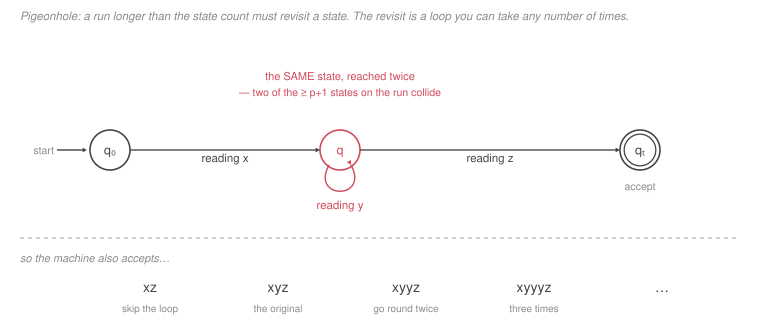

# Automata & Computability · Lesson 1.5: The pumping lemma & non-regularity

> ⏱ ~15 min · Module 1: Finite Automata & Regular Languages · Builds on: [1.1 (DFAs)](01-01-deterministic-finite-automata.md), [1.4 (closure properties)](01-04-closure-properties-of-regular-languages.md) · Unlocks: 2.1 (context-free grammars)

## Why this matters

Everything so far has been constructive: here is a machine, here is a bigger machine. This lesson makes the first *negative* claim of the course — a proof that **no** machine of a given kind can exist, for any amount of cleverness or any number of states.

That is a different and more valuable skill. Showing something is possible needs one example; showing it is impossible needs an argument that rules out every candidate at once. This lesson gives you the standard tool for finite automata, and the same shape of argument will carry you to the pumping lemma for context-free languages (Lesson 2.3), to undecidability (Lesson 4.1) and to every impossibility result in distributed systems and cryptography. Knowing what *cannot* be built is the thing an LLM will confidently get wrong for you, and it is where the time you save is largest.

The concrete lesson: **finite memory cannot count without bound.** Matching brackets, balancing parentheses, checking that a field has as many opens as closes — none of it is regular. That is why HTML is not parsed with a regular expression, and why the answer to "can I just use a regex for this?" is often a firm no with a theorem behind it.

## The idea

Suppose a DFA has $p$ states and you feed it a string of length $p$ or more. The run visits $p+1$ or more states (counting the start), so by the **pigeonhole principle** some state must appear twice.

Look at what that means. The machine went $q_0 \to \cdots \to q \to \cdots \to q \to \cdots \to$ accept. The middle stretch is a **loop**: it starts and ends at the same state. A DFA has no memory beyond its current state, so it cannot tell how many times it has gone round. Take the loop zero times, once, twice, a hundred times — the machine ends in exactly the same place and gives exactly the same verdict.

So if the machine accepts one string with a loop in it, it accepts infinitely many: the same string with that middle chunk repeated any number of times. Splitting the string as $x$ (before the loop), $y$ (the loop), $z$ (after), the machine accepts $xy^iz$ for **every** $i \ge 0$.

Now flip it into a weapon. If you can produce a string in your language such that *every* legal way of cutting out a loop breaks membership when you repeat it, then your language has no DFA. Not "no DFA I could find" — no DFA at all, because the argument never looked at a particular machine, only at the number of its states.

And there is a genuinely adversarial structure to using it, which is where people go wrong. **You do not get to choose the decomposition.** The pigeonhole tells you a loop exists somewhere in the first $p$ symbols; the adversary picks where. Your job is to choose a string so cruel that *no* choice of loop survives.

## The formal version

**Pumping lemma for regular languages.** If $A$ is regular, then there is a number $p \ge 1$ (the **pumping length**) such that every string $s \in A$ with $|s| \ge p$ can be written $s = xyz$ with

$$\textbf{(i)}\ xy^iz \in A \ \text{ for every } i \ge 0, \qquad \textbf{(ii)}\ |y| > 0, \qquad \textbf{(iii)}\ |xy| \le p.$$

In words: long enough members of $A$ contain a chunk, starting within the first $p$ symbols and non-empty, that can be deleted or repeated freely without leaving $A$.

*Proof.* Let $M$ be a DFA for $A$ with $p$ states, and let $s = s_1\cdots s_n \in A$ with $n \ge p$. Its run is $r_0, r_1, \dots, r_n$, a list of $n+1 \ge p+1$ states drawn from a set of size $p$. By pigeonhole two of the first $p+1$ of them coincide: $r_j = r_k$ for some $0 \le j < k \le p$. Put $x = s_1\cdots s_j$, $y = s_{j+1}\cdots s_k$, $z = s_{k+1}\cdots s_n$. Then (ii) holds since $j < k$, and (iii) holds since $k \le p$. For (i): reading $y$ from state $r_j$ returns to $r_j$, so reading $y$ any number of times returns to $r_j$, and reading $z$ from there ends at $r_n \in F$ regardless. $\blacksquare$

**Using it to prove non-regularity.** The lemma is an implication — regular $\Rightarrow$ pumpable — so you use its contrapositive, and the quantifier structure becomes a game of four moves:

| move | who | what |
|---|---|---|
| 1 | adversary | picks $p$; you know nothing about it but $p \ge 1$ |
| 2 | **you** | pick a string $s \in A$ with $|s| \ge p$, written in terms of $p$ |
| 3 | adversary | picks the split $s = xyz$ obeying $|y| > 0$ and $|xy| \le p$ |
| 4 | **you** | pick an $i \ge 0$ and show $xy^iz \notin A$ |

If you have a winning strategy — a choice of $s$, and for *every* legal split a choice of $i$ — then $A$ is not regular. Move 2 is the creative one: choose $s$ so that constraint (iii) traps the adversary's $y$ inside a region where repeating it visibly breaks the pattern.

**Two warnings, both load-bearing.**

First, the lemma is **necessary but not sufficient**. Some non-regular languages satisfy the pumping condition anyway (P3), so "it pumps" proves nothing. Pumping can refute regularity; it can never establish it.

Second, there is a *complete* test you have already seen. Call $u, v$ **[distinguishable](../reference.md#distinguishable-strings)** for $A$ if some $z$ has exactly one of $uz, vz$ in $A$ — the argument from [Lesson 1.2's P3](01-02-nfa-and-the-subset-construction.md). The **Myhill–Nerode theorem** says $A$ is regular **iff** the number of pairwise-distinguishable strings is finite, and the minimum DFA has exactly that many states. So an infinite pairwise-distinguishable family proves non-regularity, and unlike pumping it never fails when the language is genuinely irregular.

## Picture

The state $q$ in the middle is the pigeonhole collision, drawn once because it *is* one state — the run passes through it twice. Since the machine's entire memory is "which state am I in," the two visits are indistinguishable to it, and that is the whole lemma. Condition (iii), $|xy| \le p$, is the statement that the collision happens within the first $p$ symbols; that is what lets you, in move 2, choose a string whose first $p$ symbols are all of one kind.

## Worked examples

**Example 1 (mechanical): $A = \{0^n1^n : n \ge 0\}$ is not regular.**

*Move 1.* The adversary hands you $p$.

*Move 2.* Choose $s = 0^p1^p$. It is in $A$ and $|s| = 2p \ge p$. ✓

*Move 3.* The adversary picks $s = xyz$ with $|y| > 0$ and $|xy| \le p$. Here is the trap: the first $p$ symbols of $s$ are all `0`s, so $|xy| \le p$ forces $y$ to consist **entirely of `0`s**. Say $y = 0^k$ with $1 \le k \le p$. The adversary has no other option.

*Move 4.* Take $i = 2$. Then

$$xy^2z = 0^{p+k}1^p.$$

This has $p + k$ zeros and $p$ ones, and $k \ge 1$, so the counts differ and $xy^2z \notin A$. Contradiction, so $A$ is not regular. $\blacksquare$

($i = 0$ works just as well, giving $0^{p-k}1^p$. Either direction breaks it; you only need one.)

Concretely, with $p = 4$ and $s = 00001111$, the four legal splits give $y \in \{0, 00, 000, 0000\}$, and pumping to $i=2$ yields $000001111$, $0000001111$, $00000001111$, $000000001111$ — none of which is in $A$. The proof above is the same check done for all $p$ at once.

**Example 2 (why you'd care): closure as a force multiplier.** Once you have *one* non-regular language, [Lesson 1.4's](01-04-closure-properties-of-regular-languages.md) contrapositive gives you many more for almost no work.

Claim: $B = \{w \in \{0,1\}^* : w \text{ has equally many } 0\text{s and } 1\text{s}\}$ is not regular.

Direct pumping is fiddly here, because a badly chosen $s$ (like $0101\dots$) *can* be pumped. So do not pump. Instead: $0^*1^*$ is regular (it is a regular expression), and

$$B \cap 0^*1^* = \{0^n1^n : n \ge 0\} = A.$$

(Both inclusions are immediate: a string in $0^*1^*$ is $0^n1^m$, and it has equal counts iff $n = m$.) If $B$ were regular then $B \cap 0^*1^*$ would be regular by closure under intersection — but it equals $A$, which Example 1 says is not. So $B$ is not regular. $\blacksquare$

**Recipe:** *to kill a suspicious language, intersect it with a simple regular language that filters away the strings that pump, and reduce to a known irregular one.* Two more in the same style: $\{w : w \text{ has more } 0\text{s than } 1\text{s}\}$ (intersect with $0^*1^*$, get $\{0^n1^m : n>m\}$) and the language of balanced parentheses (intersect with `(`$^*$`)`$^*$, get $\{(^n)^n\}$). The last one is why you cannot validate nested brackets — HTML, JSON, arithmetic expressions — with a regular expression, no matter how long. You need the stack of Lesson 2.2.

## Watch out

- **You might think** you may choose the decomposition $xyz$ — **but actually** the adversary does, and this is the single most common bug in a pumping proof. If your argument contains a phrase like "take $y$ to be the block of `1`s," you have proved nothing. You choose $s$ and $i$; the adversary chooses $p$ and the split. All you know about the split is $|y| > 0$ and $|xy| \le p$ (P1).
- **You might think** "$A$ satisfies the pumping condition" means $A$ is regular — **but actually** the implication runs one way only. There are non-regular languages that pump (P3), so a successful pump is not evidence of anything. If you want a two-way test, use Myhill–Nerode distinguishability.
- **You might think** every non-regular language needs its own pumping proof — **but actually** most of them are one closure step away from a language you have already killed. Reach for intersection-with-a-regular-language first (Example 2); it is shorter, and it fails less often than a hand-rolled pumping argument.

## One-liner

> Finite memory cannot count without bound: a run longer than the state count must loop, the machine cannot tell how many times it went round, and any language that notices the difference has no automaton at all.

## Problems

**P1 (🟢)** A student submits this proof.

> **Claim.** $A = \{0^n1^n : n \ge 0\}$ is not regular.
> **Proof.** Suppose $A$ is regular with pumping length $p$. Take $s = 0^p1^p$. Write $s = xyz$ where $x = 0^{p-1}$, $y = 01$ and $z = 1^{p-1}$. Then $xy^2z = 0^{p-1}0101 1^{p-1}$, which is not of the form $0^n1^n$. Contradiction. $\square$

The conclusion is true but the proof is wrong. (a) State precisely which move of the game the student got wrong. (b) Check the student's split against conditions (ii) and (iii) — does it even satisfy them? (c) Fix the proof in two lines.

**P2 (🟡)** Prove that $C = \{0^m1^n : m > n \ge 0\}$ is not regular, by the pumping game. Say explicitly why your choice of $s$ constrains the adversary's $y$, and which $i$ you pump to and why. *(Hint: think about which direction of pumping is the damaging one here.)*

**P3 (🔴)** Let $\Sigma = \{a,b,c\}$ and

$$L \;=\; \underbrace{\{\,a^m b^n c^n \ :\ m \ge 1,\ n \ge 0\,\}}_{L_1} \ \cup\ \underbrace{\{\,b^n c^m \ :\ n, m \ge 0\,\}}_{L_2}.$$

(a) Show $L$ satisfies the pumping lemma with pumping length $p = 1$ — that is, every non-empty $s \in L$ can be written $s = xyz$ with $x = \varepsilon$ and $y$ the first symbol, and $xy^iz \in L$ for all $i \ge 0$. (Two cases: $s \in L_1$, and $s \in L_2$ with no `a`.)

(b) Show $L$ is nevertheless **not** regular, using closure. *(Hint: intersect with a well-chosen regular language.)*

(c) In one sentence, say what (a) and (b) together establish about the pumping lemma as a test.

Solutions

**P1** (a) The student got **move 3** wrong: they chose the decomposition themselves. The lemma says *there exists* a decomposition satisfying (i)–(iii) — the adversary supplies it — so a proof must handle **every** legal split, not one convenient one. Refuting a single split refutes nothing.

(b) The student's split does not even satisfy the conditions. With $x = 0^{p-1}$ and $y = 01$ we get $|xy| = (p-1) + 2 = p+1 > p$, violating **(iii)**. (Condition (ii), $|y| = 2 > 0$, is fine.) So the split is not one the lemma ever offered — which is a second, independent flaw. And note the split is not even a factorization of $s$ into $xyz$ unless $p \ge 1$; for $p = 1$, $x = \varepsilon$, $y = 01$, $z = \varepsilon$, and $s = 01$ ✓, but $|xy| = 2 > 1$ still fails.

(c) The fix is Example 1: since the first $p$ symbols of $s = 0^p1^p$ are all `0`s, condition (iii) forces $y = 0^k$ with $1 \le k \le p$ — *the adversary has no other choice*. Then $xy^2z = 0^{p+k}1^p$ has unequal counts, so it is not in $A$. Contradiction. $\blacksquare$

The repair is exactly one sentence long, and it is the sentence the student skipped: **argue that the constraints leave the adversary no useful freedom.**

**P2** Suppose $C$ is regular with pumping length $p$. Choose

$$s = 0^{p+1}1^{p}.$$

It is in $C$ (since $p+1 > p$) and $|s| = 2p+1 \ge p$. ✓

Now the constraint. The first $p$ symbols of $s$ are all `0`s, so $|xy| \le p$ forces $y$ to lie entirely inside the `0`-block: $y = 0^k$ with $1 \le k \le p$. That is the only freedom the adversary has, and it does not help them.

Pump **down**: take $i = 0$. Then

$$xy^0z = 0^{p+1-k}1^{p}.$$

Since $k \ge 1$ we have $p+1-k \le p$, so the number of `0`s is no longer strictly greater than the number of `1`s, and $xy^0z \notin C$. Contradiction; $C$ is not regular. $\blacksquare$

*Why down and not up.* Pumping **up** would give $0^{p+1+k}1^p$, which has *more* `0`s than `1`s and is therefore still in $C$ — the pump succeeds and proves nothing. Whenever the language is defined by an inequality with slack in one direction, you must pump in the direction that consumes the slack. (This is the second most common bug in a pumping proof, after P1's.)

**P3**

**(a)** Let $s \in L$ with $|s| \ge 1$. Set $x = \varepsilon$, $y = $ the first symbol of $s$, $z = $ the rest. Then $|y| = 1 > 0$ ✓ and $|xy| = 1 \le p = 1$ ✓. Check (i) in two cases.

*Case $s \in L_1$:* $s = a^m b^n c^n$ with $m \ge 1$, so the first symbol is `a` and $y = a$, giving $xy^iz = a^{m-1+i}b^nc^n$.
 - If $i \ge 1$ then $m-1+i \ge m \ge 1$, so $xy^iz \in L_1 \subseteq L$. ✓
 - If $i = 0$ then $xy^0z = a^{m-1}b^nc^n$. If $m \ge 2$ this is in $L_1$ ✓. If $m = 1$ it is $b^nc^n$, which is in $L_2$ (take the exponents $n$ and $n$) ✓.

*Case $s \in L_2$ with no `a`:* $s = b^nc^m$. The first symbol is `b` (if $n \ge 1$) or `c` (if $n = 0$).
 - If $y = b$: $xy^iz = b^{n-1+i}c^m \in L_2$ for every $i \ge 0$ ✓ — $L_2$ puts no constraint relating $n$ and $m$.
 - If $y = c$ (so $n = 0$, $s = c^m$, $m \ge 1$): $xy^iz = c^{m-1+i} \in L_2$ (with $n = 0$) ✓.

Every case checks out, so $L$ satisfies the pumping lemma with $p = 1$. (Confirmed by exhaustive check on every string over $\{a,b,c\}$ of length up to 8 and every $i \le 5$.)

The reason it works is that $L_2$ is a *regular escape hatch*: $L_1$ is the part with a real constraint, and every way of pumping an $L_1$ string either stays in $L_1$ or falls harmlessly into $L_2$.

**(b)** $L$ is not regular. Intersect with the regular language $ab^*c^*$ (a regular expression, hence regular):

$$L \cap ab^*c^* = \{\,ab^nc^n : n \ge 0\,\}.$$

*Why:* a string of $L$ matching $ab^*c^*$ has exactly one `a`, so it is not in $L_2$ (which has none); being in $L_1$ with $m = 1$ forces the `b`- and `c`-counts equal.

If $L$ were regular, then by closure under intersection so would be $\{ab^nc^n\}$. But that is not regular: pumping with $s = ab^pc^p$ forces $y$ inside the first $p$ symbols — which is `a` followed by `b`s — so $y$ contains no `c`, and pumping to $i=2$ changes the count of `a`s or `b`s without changing the `c`s, leaving the language. (Equivalently, delete the leading `a` by a homomorphism and reduce to $\{b^nc^n\}$, which is Example 1 with renamed symbols.) So $L$ is not regular. $\blacksquare$

**(c)** The pumping lemma is a **necessary but not sufficient** condition for regularity: passing it is no evidence at all, so it can only ever be used to refute regularity, never to establish it. (For a test that works in both directions, use Myhill–Nerode distinguishability.)

## Flashback

**From Lesson 1.3 (Regular expressions & Kleene's theorem):** A colleague proposes two regular expressions for the language $\{w \in \{0,1\}^* : w \text{ contains at least two } 1\text{s}\}$:

$$R_1 = 0^*10^*10^*, \qquad R_2 = (0 \cup 1)^*1(0\cup1)^*1(0\cup1)^*.$$

Exactly one of them is correct. Say which, and give the **shortest** string that separates them, stating which expression matches it.

Solution

$R_2$ is correct; $R_1$ is wrong.

$R_1 = 0^*10^*10^*$ allows only `0`s in the three gaps, so it matches exactly the strings with **exactly two** `1`s — it cannot accommodate a third. $R_2$ puts $(0\cup1)^*$ in every gap, so the extra `1`s have somewhere to live; it matches exactly the strings with **at least two** `1`s.

The shortest separating string is $\mathbf{111}$ (length 3): it has three `1`s, so it is in the language and matched by $R_2$, but not matched by $R_1$. Nothing shorter works — over $\{0,1\}$ the two expressions agree on all $2^0 + 2^1 + 2^2 = 7$ strings of length $\le 2$, and $111$ is the shortest of the length-3 disagreements (the others are all length $\ge 4$: $0111$, $1011$, $1101$, $1110$, …).

*Moral, the same one as [1.3's P3](01-03-regular-expressions-and-kleenes-theorem.md):* to refute a claimed equivalence, exhibit one string; to confirm one, you need an argument. Here the argument is the count-of-`1`s reading of each expression.

## Connections

- **Backward:** the proof is the [pigeonhole principle](../../discrete-mathematics/lessons/03-03-inclusion-exclusion-and-pigeonhole.md) applied to a DFA's run, and Example 2 is [Lesson 1.4's](01-04-closure-properties-of-regular-languages.md) closure contrapositive. The distinguishability idea is [Lesson 1.2's P3](01-02-nfa-and-the-subset-construction.md) pushed from finitely many strings to infinitely many.
- **Forward:** $\{0^n1^n\}$ is exactly the language a *stack* handles, which is the point of Module 2; Lesson 2.3's CFL pumping lemma is this argument run on a parse tree instead of a run, with the same adversarial structure and the same classic misuse. The gap between "necessary" and "sufficient" recurs in Lesson 4.3, where Rice's theorem finally gives an if-and-only-if.
- **Sideways:** this theorem is the honest answer to "can I parse HTML with a regex?" — no, because matching nested tags is $\{(^n)^n\}$ in disguise. It is also why a streaming system with fixed memory cannot verify a balanced-transaction invariant in one pass, and why [databases](../../databases/syllabus.md) need a stack (or a spill to disk) rather than a finite-state filter for nested structure.
