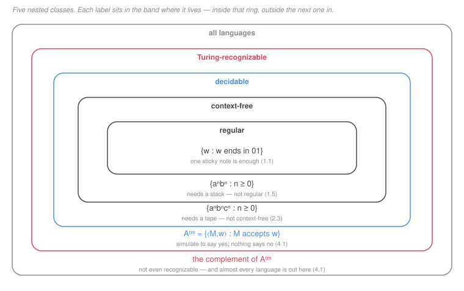

# Automata & Computability · Lesson 3.4: Decidable vs Turing-recognizable

> ⏱ ~15 min · Module 3: Turing Machines & Computability · Builds on: [3.1 (deciders and recognizers)](03-01-turing-machines.md), [3.3 (the universal machine)](03-03-church-turing-thesis-and-the-universal-machine.md) · Unlocks: 4.1 (diagonalization & the halting problem)

## Why this matters

You have met the distinction twice — in Lesson 3.1's composite-number search and in Lesson 3.3's universal machine — and both times the moral was the same: **a machine that always says yes when the answer is yes may still never say no.** This lesson makes that into a clean theory, and gets one exact theorem out of it:

$$A \text{ is decidable} \iff A \text{ and } \overline{A} \text{ are both Turing-recognizable}.$$

That is the tool Module 4 runs on. It converts every undecidability result into a statement about complements, and it is how you show a language is not merely undecidable but **not even recognizable** — the strongest negative result available.

The lesson also delivers the last good news in this course. Every question you might ask about a *finite automaton* or a *grammar* — does it accept this string, is its language empty, do two of them agree — is decidable, with an algorithm you can write down. Then you climb one rung to Turing machines and almost all of it collapses. Seeing the two tables side by side is the point: it is not that these questions are hard, it is that the *object* changed.

## The idea

Think of a recognizer as a **searcher**. It has a way to find evidence, and when it finds it, it says yes. The catch is that "I have not found it yet" and "there is nothing to find" look identical from outside.

Now suppose you have two searchers: one hunting for evidence that $w \in A$, and one hunting for evidence that $w \notin A$. Run them **at the same time**, alternating steps. Exactly one of them will eventually succeed — because $w$ is either in $A$ or not — so you always get an answer in finite time. You have built a decider out of two recognizers.

That is the whole theorem, and the interleaving is the same [dovetailing](../reference.md#dovetailing) move as [Lesson 3.2](03-02-tm-variants-and-robustness.md). Running one to completion and then the other would be fatal, for the familiar reason: the first might never finish.

The converse is easy, and the contrapositive is where the value is. If $A$ is recognizable but **not** decidable, then $\overline{A}$ cannot be recognizable — otherwise the parallel trick would decide $A$. So the moment Lesson 4.1 shows $A_{\mathrm{TM}}$ is undecidable, you get for free that $\overline{A_{\mathrm{TM}}}$ is outside the recognizable class entirely.

The second half of the lesson is a survey, and its shape is worth naming in advance. Questions about DFAs, NFAs, regexes and CFGs are decidable because those machines are **analysable**: you can determine everything about a DFA's behaviour from its transition graph, without running it forever, since a DFA on a string of length $n$ halts in $n$ steps. Turing machines are not analysable that way — a TM's behaviour is not readable off its table — and that is where the wall is.

## The formal version

Recall from [Lesson 3.1](03-01-turing-machines.md): $A$ is **Turing-recognizable** if some TM accepts exactly the strings of $A$ (and may loop on the rest); $A$ is **decidable** if some TM halts on every input and accepts exactly $A$. Say $A$ is **co-Turing-recognizable** if $\overline{A} = \Sigma^* \setminus A$ is Turing-recognizable.

**Theorem.** $A$ is decidable $\iff$ $A$ is both Turing-recognizable and co-Turing-recognizable.

*($\Rightarrow$)* A decider for $A$ is in particular a recognizer for $A$. Swapping its accept and reject states gives a decider — hence a recognizer — for $\overline{A}$. (This swap is legal precisely because a decider always halts; it is the [Lesson 1.4](01-04-closure-properties-of-regular-languages.md) complement trick, and it fails for the same reason there when the machine can fail to halt.)

*($\Leftarrow$)* Let $M_1$ recognize $A$ and $M_2$ recognize $\overline{A}$. Define $M$: on input $w$, run $M_1$ and $M_2$ **in parallel**, alternating one step of each. If $M_1$ accepts, accept; if $M_2$ accepts, reject.

Every $w$ is in $A$ or in $\overline{A}$, so one of $M_1, M_2$ accepts $w$ after finitely many steps, so $M$ halts on every input — it is a decider. It accepts $w$ exactly when $M_1$ does, i.e. exactly when $w \in A$. $\blacksquare$

**Corollary.** If $A$ is Turing-recognizable and undecidable, then $\overline{A}$ is **not** Turing-recognizable.

**Decidable problems about the lower machine classes.** Write $\langle \cdot \rangle$ for the encoding of [Lesson 3.3](03-03-church-turing-thesis-and-the-universal-machine.md). Each of the following is **decidable**:

| language | question | algorithm |
|---|---|---|
| $A_{\mathrm{DFA}} = \{\langle D,w\rangle : D \text{ accepts } w\}$ | does this DFA accept this string? | simulate $D$ on $w$ for $\lvert w\rvert$ steps |
| $A_{\mathrm{NFA}}$, $A_{\mathrm{REX}}$ | same, for NFAs / regexes | convert (subset construction, Thompson), then use $A_{\mathrm{DFA}}$ |
| $E_{\mathrm{DFA}} = \{\langle D\rangle : L(D) = \varnothing\}$ | is this DFA's language empty? | mark reachable states; accept iff no accept state is marked |
| $EQ_{\mathrm{DFA}} = \{\langle C,D\rangle : L(C) = L(D)\}$ | do these two DFAs agree? | build the **symmetric difference** DFA $(L(C) \cap \overline{L(D)}) \cup (\overline{L(C)} \cap L(D))$ by the product construction, then test it with $E_{\mathrm{DFA}}$ |
| $A_{\mathrm{CFG}} = \{\langle G,w\rangle : w \in L(G)\}$ | does this grammar generate this string? | convert $G$ to Chomsky normal form; a CNF derivation of $\lvert w\rvert = n > 0$ has exactly $2n-1$ steps, so try all derivations of that length (or run CYK in $O(n^3)$) |
| $E_{\mathrm{CFG}} = \{\langle G\rangle : L(G) = \varnothing\}$ | is this grammar's language empty? | mark terminals, then mark any variable with a fully-marked right-hand side, until no change; accept iff $S$ is unmarked |

Every one of these halts for a stated reason — a step bound, or a marking loop that must terminate because a finite set only grows so far. That is the pattern to look for.

**And the boundary.** $EQ_{\mathrm{CFG}} = \{\langle G,H\rangle : L(G) = L(H)\}$ is **undecidable**. The $EQ_{\mathrm{DFA}}$ algorithm above cannot be copied, because it needs complement and intersection, and [Lesson 2.3](02-03-cfl-pumping-lemma-and-closure.md) showed context-free languages are closed under neither. **The missing closure property and the undecidability are the same fact.**

$A_{\mathrm{TM}} = \{\langle M,w\rangle : M \text{ accepts } w\}$ is **Turing-recognizable** — run the universal machine — and Lesson 4.1 proves it undecidable. By the corollary, $\overline{A_{\mathrm{TM}}}$ is then not recognizable at all.

## Picture

Read it as five claims, one per band, each proved somewhere in this course. The innermost three separations you have already done: $\{a^nb^n\}$ escapes regular by [1.5](01-05-pumping-lemma-and-non-regularity.md), $\{a^nb^nc^n\}$ escapes context-free by [2.3](02-03-cfl-pumping-lemma-and-closure.md), and each is decidable by an explicit machine.

The outer two are Module 4's business, and note their asymmetry — it is the theorem of this lesson, drawn. $A_{\mathrm{TM}}$ sits in the recognizable ring: you can search for an accepting run and say yes when you find one. Its complement sits *outside*, because if both were recognizable, the parallel construction would put $A_{\mathrm{TM}}$ in the decidable ring. **Complementation reflects a language across the decidable boundary, and only inside that boundary does it stay put.**

One thing the diagram cannot draw to scale: the outermost band is almost everything. There are countably many Turing machines (each is a finite string) and uncountably many languages (each is a subset of the countable set $\Sigma^*$), so all but a vanishing fraction of languages are unrecognizable. Lesson 4.1 makes that precise — and then does something harder, exhibiting a *specific* one.

## Worked examples

**Example 1 (mechanical): $EQ_{\mathrm{DFA}}$ is decidable.** Given $\langle C, D\rangle$, we must decide whether $L(C) = L(D)$.

The trick is to reduce equality to emptiness, using a set identity: two sets are equal iff their symmetric difference is empty.

$$L(C) = L(D) \iff \big(L(C) \cap \overline{L(D)}\big) \cup \big(\overline{L(C)} \cap L(D)\big) = \varnothing.$$

Every operation on the right is one the regular languages are closed under, *constructively*, by [Lesson 1.4](01-04-closure-properties-of-regular-languages.md): complement by swapping accept states, intersection and union by the product construction. So:

> **On input $\langle C, D\rangle$:** if either is not a well-formed DFA encoding, reject. Build $\overline{C}$ and $\overline{D}$ by swapping accept states. Build the two product machines and then their union — a DFA $E$ with at most $(2|Q_C||Q_D|)^2$ states, recognizing the symmetric difference. Run the $E_{\mathrm{DFA}}$ algorithm on $\langle E \rangle$: mark the start state, repeatedly mark anything one step from a marked state, and accept iff no accept state of $E$ ever gets marked.

It halts because the construction is finite and the marking loop runs at most $|Q_E|$ rounds. And it is *correct* because $E$ accepts exactly the strings on which $C$ and $D$ disagree, so $E$'s language is empty exactly when they agree everywhere.

Two things to take away. First, the algorithm never enumerates strings — there are infinitely many, and a decider cannot afford that. It answers a question about infinitely many strings by **analysing the machines**, which is possible only because a DFA's behaviour is fully determined by its finite transition graph. Second, **the algorithm is exactly the closure properties, cashed in.** The same construction fails for CFGs precisely at the step where you would complement, which is why $EQ_{\mathrm{CFG}}$ is undecidable.

**Example 2 (why you'd care): using the theorem in its contrapositive form.** Suppose (granting Lesson 4.1 in advance) that $A_{\mathrm{TM}}$ is undecidable. What can you say about

$$\overline{A_{\mathrm{TM}}} = \{\,\langle M,w\rangle : M \text{ does not accept } w\,\} \cup \{\,\text{strings that are not valid encodings}\,\}?$$

**It is not Turing-recognizable.** Suppose it were. $A_{\mathrm{TM}}$ *is* recognizable — run the universal machine $U$ on $\langle M,w\rangle$ and accept if it accepts. Then by the theorem, $A_{\mathrm{TM}}$ would be decidable, contradicting the assumption. $\blacksquare$

Two-line proof, and it produces the strongest kind of negative result in the subject: not "we have no algorithm," not even "no algorithm exists," but "**no algorithm can even confirm the yes-instances**." There is no procedure that reliably announces "this program will not accept this input," even given forever to do it.

Notice the shape, because it is reusable and it is how Module 4's harder results get proved. To show some $B$ is not recognizable:

1. show $\overline{B}$ *is* recognizable (usually easy — exhibit a search);
2. quote that $\overline{B}$ is undecidable;
3. conclude by the corollary.

And notice what the theorem does *not* say. It says nothing about a language whose complement you have not classified: recognizable and co-recognizable are two independent bits, and a language may have neither, one, or both. Both $\Rightarrow$ decidable is the entire content.

## Watch out

- **You might think** "not decidable" and "not recognizable" are two ways of saying the same thing — **but actually** there is a genuine class strictly between, and $A_{\mathrm{TM}}$ lives in it. "Undecidable" means no machine always halts with the right answer; "unrecognizable" means no machine even accepts the right set. The second is strictly stronger, and proving it is what the theorem of this lesson is for.
- **You might think** you can complement a recognizer by swapping its accept and reject states — **but actually** that only works for a **decider**. On a string where the machine loops, the swapped machine also loops, so it fails to accept a string it should. This is the exact analogue of [Lesson 1.4's](01-04-closure-properties-of-regular-languages.md) NFA complement trap: negation needs a machine that always produces a verdict.
- **You might think** the decidable problems in the table are decidable because automata are small — **but actually** it is because they are **analysable**: a DFA's whole future is a walk on a finite graph, and a CFG's derivations of a given length are finitely many and bounded. Nothing about size matters. Turing machines break this not by being bigger but by having behaviour that cannot be read off their description — the point Lesson 4.3 turns into Rice's theorem.

## One-liner

> A recognizer searches and a decider answers, and you can build the second from two of the first — which is why an undecidable but recognizable language must have an unrecognizable complement.

## Problems

**P1 (🟢)** Give a decision procedure for $E_{\mathrm{DFA}} = \{\langle D \rangle : L(D) = \varnothing\}$.

(a) State the algorithm. (b) Say precisely why it halts. (c) Say why "enumerate all strings and test each" is not an acceptable alternative, being specific about which of the two clauses of "decider" it violates. (d) Give the number of rounds of the marking loop in the worst case, in terms of $|Q|$.

**P2 (🟡)** Classify each language as **decidable**, **recognizable but (as far as this course shows) not decidable**, or **not recognizable**. One line of justification each. You may use, without proof, that $A_{\mathrm{TM}}$ is undecidable.

(a) $\{\langle G, w\rangle : G \text{ is a CFG and } w \in L(G)\}$
(b) $\{\langle D \rangle : D \text{ is a DFA and } L(D) = \Sigma^*\}$
(c) $A_{\mathrm{TM}} = \{\langle M, w\rangle : M \text{ accepts } w\}$
(d) $\{\langle M, w\rangle : M \text{ does not accept } w\}$
(e) $\{\langle M, w\rangle : M \text{ accepts } w \text{ within } 100 \text{ steps}\}$

**P3 (🔴)** Let $L$ be a language over $\Sigma$.

(a) Prove: if $L$ is recognizable and $\overline{L}$ is recognizable, then $L$ is decidable. Be explicit about why running one recognizer *to completion* before the other would break the proof.
(b) Suppose $L$ is **infinite** and recognizable. Prove that $L$ has an infinite **decidable** subset. *(Hint: use an enumerator for $L$ and keep only the strings that arrive in increasing order of length.)*
(c) A colleague concludes from (b): "every recognizable language is decidable, since it contains a decidable subset with the same elements." Say exactly where that goes wrong.

Solutions

**P1** (a) **On input $\langle D \rangle$:** if it is not a well-formed DFA encoding, reject. Otherwise mark the start state $q_0$. Then repeat until no new state gets marked: mark any state that has a transition into it from an already-marked state. Finally, accept iff **no** accept state of $D$ is marked.

Correctness: the marked set is exactly the set of states reachable from $q_0$, and $D$ accepts some string iff some accept state is reachable (a path from $q_0$ to an accept state spells such a string, and conversely an accepted string's run is such a path).

(b) Each round of the loop either marks at least one new state or terminates the loop. States are never unmarked, and $|Q|$ is finite, so there can be at most $|Q|$ productive rounds plus one final unproductive one. The rest of the procedure is a fixed amount of work. **The machine therefore halts on every input** — including malformed ones, which the first line disposes of.

(c) "Enumerate all strings and test each" fails the **halting** clause. It would correctly reject as soon as it found a string $D$ accepts, but on a DFA whose language really is empty it would run forever, testing longer and longer strings and never concluding. So it is a recognizer for $\overline{E_{\mathrm{DFA}}}$, not a decider for $E_{\mathrm{DFA}}$. (It satisfies the "accepts exactly the right strings" clause for the complement; it violates "halts on every input.")

(d) At most $|Q|$ productive rounds — one state marked per round in the worst case, starting from a marked $q_0$, so at most $|Q| - 1$ productive rounds after the first mark — plus one round that marks nothing and stops the loop. So $\le |Q|$ rounds, each costing a scan of the transition table.

**P2** (a) **Decidable.** Convert $G$ to Chomsky normal form; a CNF grammar derives a string of length $n \ge 1$ in exactly $2n - 1$ steps, so only finitely many derivations need checking (or run CYK in $O(n^3)$). The bound is what makes it a decider.

(b) **Decidable.** $L(D) = \Sigma^*$ iff $L(\overline{D}) = \varnothing$, so complement $D$ by swapping accept states (legal — a DFA always halts) and run the $E_{\mathrm{DFA}}$ algorithm from P1.

(c) **Recognizable, not decidable.** Recognizable by the universal machine ([Lesson 3.3](03-03-church-turing-thesis-and-the-universal-machine.md)): simulate $M$ on $w$ and accept if it accepts. Undecidable by Lesson 4.1, which we are granting.

(d) **Not recognizable.** This is (essentially) $\overline{A_{\mathrm{TM}}}$. If it were recognizable then, since $A_{\mathrm{TM}}$ is recognizable, the theorem would make $A_{\mathrm{TM}}$ decidable — contradiction. (Example 2 in full.)

(e) **Decidable.** Simulate $M$ on $w$ for at most 100 steps and answer. The explicit step bound guarantees halting. Note how little it takes to cross the line: $A_{\mathrm{TM}}$ with *any* fixed computable step bound is decidable, and it is the absence of a bound — not the simulation — that makes $A_{\mathrm{TM}}$ hard. (Compare [Lesson 3.3's P3](03-03-church-turing-thesis-and-the-universal-machine.md).)

**P3** (a) Let $M_1$ recognize $L$ and $M_2$ recognize $\overline{L}$. Define $M$: **on input $w$, run $M_1$ and $M_2$ in parallel — one step of $M_1$, then one step of $M_2$, alternating.** If $M_1$ accepts, accept; if $M_2$ accepts, reject.

*It halts on every input.* Every $w$ lies in $L$ or in $\overline{L}$. If $w \in L$ then $M_1$ accepts $w$ after some finite number $t$ of its own steps, so $M$ reaches that point after at most $2t$ of its interleaved steps and accepts. If $w \notin L$ then $M_2$ accepts after finitely many steps, and $M$ rejects. Either way $M$ halts.

*It is correct.* $M$ accepts $w$ iff $M_1$ does, iff $w \in L$. So $M$ is a decider for $L$. $\blacksquare$

*Why sequential execution breaks it.* Suppose $M$ ran $M_1$ to completion first. On a $w \notin L$, $M_1$ is under no obligation to halt — a recognizer may loop on non-members — so $M$ could hang before $M_2$ ever runs, and $M$ would not be a decider. The interleaving is not stylistic: it is the only way to make progress on both searches when neither is guaranteed to finish. (Same move as the dovetailing of [Lesson 3.2](03-02-tm-variants-and-robustness.md), and the same reason the NTM simulation there had to be breadth-first.)

(b) Let $E$ be an enumerator for $L$ ([Lesson 3.2](03-02-tm-variants-and-robustness.md): recognizable $\iff$ enumerable). Run $E$ and keep a record of the longest string kept so far. Define

$$S = \{\, s_1, s_2, s_3, \dots \,\}$$

where $s_1$ is the first string $E$ prints, and $s_{i+1}$ is the next string $E$ prints that is **strictly longer** than $s_i$.

*$S$ is infinite.* $L$ is infinite, so it contains strings of unboundedly many lengths; $E$ eventually prints each of them, so after $s_i$ some longer member is eventually printed. Hence the process never stalls.

*$S$ is decidable.* On input $w$, run the selection process, generating $s_1, s_2, \dots$ in order. Their lengths strictly increase, so after at most $|w| + 1$ of them the process produces some $s_j$ with $|s_j| > |w|$ — at which point no later element can equal $w$. So: accept if $w$ appeared among $s_1, \dots, s_j$; reject otherwise. This always halts, because the strictly increasing lengths give a **computable stopping point**. $\blacksquare$

The essential ingredient is that $S$ is enumerated *in increasing order of length*. An enumerable set listed in increasing order is always decidable — you can stop looking once the list passes your candidate. An enumerable set listed in arbitrary order gives you no such stopping rule, and that is exactly the difference between recognizable and decidable.

(c) The final clause is simply false: $S$ is an infinite subset of $L$, not all of $L$. The construction throws away every string $E$ prints that is not longer than everything kept so far — and for a language like $A_{\mathrm{TM}}$ that is almost all of it. **"Contains an infinite decidable subset" is a very weak property** (every infinite recognizable language has one, by (b), including the undecidable ones), and it says nothing about membership for the strings that were discarded. The colleague's error is the same one as [Lesson 3.3's P3(c)](03-03-church-turing-thesis-and-the-universal-machine.md): a fact about *some* elements silently promoted to a claim about *every* element.

## Flashback

**From Lesson 3.2 (TM variants & robustness):** Consider a Turing machine restricted so that its head may only move **right** — never left. It may still write. Prove that such machines recognize exactly the **regular** languages.

Solution

**Every regular language is recognized by such a machine.** A DFA is already one: never write (or write back the symbol you read), always move right, and enter $q_{\text{accept}}$ or $q_{\text{reject}}$ on hitting the first blank, according to whether the DFA's state is accepting.

**Every such machine recognizes a regular language.** The head moves right at every step, so it visits each cell **at most once** — meaning no cell is ever re-read after being written. The writing is therefore invisible to the computation: deleting every write instruction changes nothing about which states the machine passes through. What remains is a machine that reads the input left to right, one symbol per step, updating a state from a finite set — a DFA, except for what happens after the input ends.

After the input, the machine reads blanks forever, so its state evolves by the fixed map $q \mapsto \delta(q, \sqcup)$. Iterating a function on a finite set of size $|Q|$, the sequence of states is eventually periodic and enters its cycle within $|Q|$ steps. So the machine accepts *after* the input iff it reaches $q_{\text{accept}}$ within $|Q|$ blank-steps of the state it was in when the input ran out — a property of that state alone, computable once and for all.

So define a DFA with the same states, the same transitions on $\Sigma$, and accept set

$$F = \{\, q \in Q : \text{iterating } \delta(\cdot,\sqcup) \text{ from } q \text{ reaches } q_{\text{accept}} \text{ before } q_{\text{reject}} \,\}.$$

It accepts exactly the strings the right-moving machine accepts. Hence the language is regular. $\blacksquare$

**The moral.** Writing is powerful only in combination with the ability to come back and read what you wrote. Take away leftward motion and the tape becomes a scratch pad nobody reads, and you fall all the way back to [Module 1](01-01-deterministic-finite-automata.md). Compare [Lesson 3.2's P3(d)](03-02-tm-variants-and-robustness.md), where taking away *writing* while keeping two-way motion also lands on the regular languages, by a quite different argument. **Both ingredients are necessary; neither alone is worth anything.**

## Connections

- **Backward:** the parallel-simulation proof is [Lesson 3.2's](03-02-tm-variants-and-robustness.md) dovetailing; the $EQ_{\mathrm{DFA}}$ algorithm is [Lesson 1.4's](01-04-closure-properties-of-regular-languages.md) closure constructions used as subroutines; and $A_{\mathrm{TM}}$'s recognizability is exactly the universal machine of [Lesson 3.3](03-03-church-turing-thesis-and-the-universal-machine.md).
- **Forward:** Lesson 4.1 supplies the missing piece — that $A_{\mathrm{TM}}$ is undecidable — and this lesson's corollary immediately upgrades that to "$\overline{A_{\mathrm{TM}}}$ is unrecognizable." Lesson 4.2 uses reductions to move both properties around, and Lesson 4.3 shows that essentially *every* interesting question about a TM's language lands in the undecidable region.
- **Sideways:** the decidable/recognizable split is the theory behind "sound but incomplete" static analysis. A type checker or a linter is a decider that answers a *restricted* question (the analogue of P2(e)'s step bound); a full "does this program crash?" checker would be a decider for something in $A_{\mathrm{TM}}$'s neighbourhood. Tools cope by deciding an approximation and reporting false positives — see [programming-languages](../../programming-languages/syllabus.md). In [mathematical-logic](../../mathematical-logic/syllabus.md) the same split is "provable" (recognizable — search for a proof) versus "true" (not), which is Gödel's incompleteness theorem in one line.
