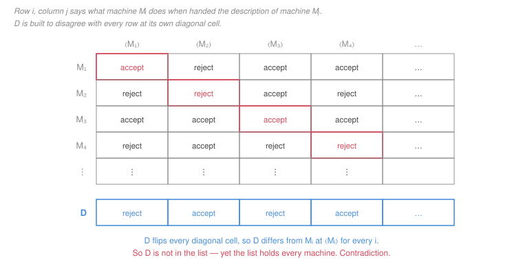

# Automata & Computability · Lesson 4.1: Diagonalization & the halting problem

> ⏱ ~15 min · Module 4: Undecidability & Reductions · Builds on: [3.3 (encoding machines, the universal machine)](03-03-church-turing-thesis-and-the-universal-machine.md), [3.4 (decidable vs recognizable)](03-04-decidable-vs-turing-recognizable.md) · Unlocks: 4.2 (reducibility & mapping reductions)

## Why this matters

This is the theorem the course has been building toward. **There is a perfectly well-posed yes/no question about programs that no program can answer.** Not "we have not found the algorithm," not "it would take too long" — no algorithm exists, and there is a two-page proof.

The consequences are everywhere and they are permanent. No tool will ever tell you, for arbitrary code, whether it terminates, whether that branch is reachable, whether two functions compute the same thing, or whether a given input triggers the bug. Static analysers, type checkers and verifiers are not weak; they are working inside a proved boundary, and the way they cope — restrict the question, accept false positives, demand annotations — is a response to this theorem and not to engineering laziness.

Knowing where the boundary is, is worth more than knowing any particular algorithm. It is the difference between "let me try harder" and "that cannot be done, here is the nearest thing that can." An LLM will cheerfully write you a halting checker; it is on you to know that the specification is impossible.

## The idea

Two ingredients, both already in hand.

**Counting.** A Turing machine is a finite string ([Lesson 3.3](03-03-church-turing-thesis-and-the-universal-machine.md)), and there are only countably many finite strings — you can list them all, shortest first. So there are countably many Turing machines, hence countably many recognizable languages. But there are *uncountably* many languages, one for each subset of $\Sigma^*$. Uncountably many problems, countably many programs: **almost every language is unrecognizable.** That is a one-line proof that undecidability is not exotic, it is generic.

Counting tells you the bad languages exist. It does not tell you which one. For that you need the second ingredient.

**Diagonalization.** Cantor's move, in a computational costume. Line up all the machines $M_1, M_2, M_3, \dots$ and all their descriptions $\langle M_1 \rangle, \langle M_2 \rangle, \dots$, and imagine a table: row $i$, column $j$ records what $M_i$ does on input $\langle M_j \rangle$. Now build a machine $D$ that deliberately **disagrees with $M_i$ at cell $(i,i)$** for every $i$. Then $D$ is not $M_1$ (they differ on $\langle M_1 \rangle$), not $M_2$ (they differ on $\langle M_2 \rangle$), and so on — $D$ is on no row of a table that was supposed to list every machine.

The only escape is that $D$ was never a machine at all. And since every step of $D$'s description is executable *except one*, that one step is what does not exist.

That step is the halting decider. The proof is engineered so that the contradiction lands on exactly the thing you assumed.

## The formal version

**Counting, precisely.**

*$\Sigma^*$ is countable.* List its strings by length, and alphabetically within each length. Every string appears at a finite position.

*The set of Turing machines is countable.* Each is a finite string $\langle M \rangle$ over a fixed alphabet, and distinct machines have distinct encodings, so the map $M \mapsto \langle M \rangle$ injects the machines into a countable set.

*The set of languages over $\Sigma$ is uncountable.* A language is a subset of $\Sigma^*$; writing $\Sigma^* = \{s_1, s_2, s_3, \dots\}$, a language corresponds to an infinite binary string (its characteristic sequence: bit $i$ is 1 iff $s_i$ is in it). Suppose the languages were countable, listed as $L_1, L_2, \dots$; define $L_D$ by putting $s_i \in L_D$ exactly when $s_i \notin L_i$. Then $L_D \ne L_i$ for every $i$ — they differ on $s_i$ — contradicting the listing. So there are uncountably many languages.

**Corollary.** Some languages are not Turing-recognizable — in fact all but countably many.

**The main theorem.** Let

$$A_{\mathrm{TM}} = \{\, \langle M, w\rangle : M \text{ is a TM and } M \text{ accepts } w \,\}.$$

**Theorem.** $A_{\mathrm{TM}}$ is Turing-recognizable but **undecidable**.

*Recognizable:* run the universal machine ([Lesson 3.3](03-03-church-turing-thesis-and-the-universal-machine.md)) on $\langle M, w \rangle$ and accept if it accepts.

*Undecidable.* Suppose $H$ is a decider for $A_{\mathrm{TM}}$:

$$H(\langle M, w\rangle) = \begin{cases} \textbf{accept} & \text{if } M \text{ accepts } w,\\ \textbf{reject} & \text{if } M \text{ does not accept } w,\end{cases}$$

halting in both cases. Build a new machine $D$:

> **$D$ = on input $\langle M \rangle$, where $M$ is a TM:**
> 1. Run $H$ on $\langle M, \langle M \rangle\rangle$.
> 2. Output the **opposite**: if $H$ accepted, **reject**; if $H$ rejected, **accept**.

Every step of $D$ is executable given $H$: reading its input, duplicating it (an easy tape operation), calling $H$ — which halts by assumption — and flipping the answer. So if $H$ exists, $D$ exists.

Now run $D$ on $\langle D \rangle$ — legal, since $\langle D \rangle$ is just a string and $D$ takes strings.

$$D \text{ accepts } \langle D\rangle \iff H \text{ rejects } \langle D, \langle D\rangle\rangle \iff D \text{ does } \textbf{not} \text{ accept } \langle D \rangle.$$

The first step is $D$'s definition; the second is $H$'s. So $D$ accepts $\langle D \rangle$ iff it does not: a contradiction. Every other ingredient was constructed explicitly, so the false assumption is the existence of $H$. $\blacksquare$

**The halting problem.** Let

$$\mathit{HALT}_{\mathrm{TM}} = \{\, \langle M, w\rangle : M \text{ halts (accepts or rejects) on } w \,\}.$$

**Theorem.** $\mathit{HALT}_{\mathrm{TM}}$ is undecidable.

*Proof.* Suppose $R$ decides it. Then decide $A_{\mathrm{TM}}$ as follows: on $\langle M, w\rangle$, run $R$ on $\langle M, w\rangle$; if $R$ rejects, then $M$ loops on $w$, so **reject** ($M$ certainly does not accept). If $R$ accepts, then $M$ halts on $w$, so simulate $M$ on $w$ with the universal machine — the simulation is guaranteed to terminate — and answer as it does. This always halts and is correct, so it decides $A_{\mathrm{TM}}$, contradicting the theorem above. $\blacksquare$

**And by [Lesson 3.4](03-04-decidable-vs-turing-recognizable.md):** $A_{\mathrm{TM}}$ is recognizable and undecidable, so $\overline{A_{\mathrm{TM}}}$ is **not Turing-recognizable**. There is no procedure that reliably announces "this machine does not accept this input," even one allowed to run forever.

## Picture

The table is a fiction — nobody can fill it in, since its entries are exactly what $H$ was supposed to compute — but it is a *legitimate* fiction, because we are inside a proof by contradiction where $H$ is assumed to exist.

$D$'s row is the diagonal, flipped. It cannot equal row $i$, because it disagrees with it in column $i$. So $D$ is a machine that is not in a list of all machines. The list is genuinely complete — encodings are strings and every machine has one — so the fault is upstream: $D$ was never constructible, and the only step in $D$ that could fail is the call to $H$.

The same picture, read differently, is the counting argument: the diagonal trick is what shows the languages outnumber the machines. **One idea, used twice — once to show bad languages exist, once to name one.**

## Worked examples

**Example 1 (mechanical): why $D(\langle D\rangle)$ is not a trick.** The step people distrust is running $D$ on its own description. It is worth seeing that nothing sneaky happens.

$D$ is a machine that takes a *string* as input. $\langle D\rangle$ is a *string*. So $D(\langle D\rangle)$ is a perfectly ordinary computation, no more paradoxical than a compiler compiling itself or a text editor editing its own source. Concretely, $D$ on $\langle D\rangle$:

1. reads the string $\langle D\rangle$ off its tape;
2. writes a second copy after it, producing $\langle D, \langle D\rangle\rangle$;
3. runs $H$ on that — a terminating computation, by assumption;
4. flips the verdict.

Now trace the two possibilities.

- Suppose $D$ **accepts** $\langle D \rangle$. By step 4, that means $H$ rejected $\langle D, \langle D\rangle\rangle$, which by $H$'s specification means $D$ does *not* accept $\langle D\rangle$. Contradiction.
- Suppose $D$ does **not** accept $\langle D \rangle$. Since $H$ halts, $D$ halts, so $D$ rejects. By step 4, $H$ accepted $\langle D, \langle D\rangle\rangle$, which means $D$ *does* accept $\langle D\rangle$. Contradiction.

Both branches close, so the assumption is false. Note that the second branch quietly uses that $D$ **halts** — which it does precisely because $H$ was assumed to be a *decider*. If $H$ were merely a recognizer, $D$ could loop and there would be no contradiction. **The proof refutes the existence of a decider, and it uses the halting assumption to do it.** That is why $A_{\mathrm{TM}}$ can be, and is, recognizable.

**Example 2 (why you'd care): what this rules out in practice.** Every one of these is a real request, and every one is impossible in full generality:

- *"Warn me if this function might not terminate."* That is $\mathit{HALT}_{\mathrm{TM}}$.
- *"Flag unreachable code."* Deciding whether a statement is reachable means deciding whether some input drives the program there — undecidable ([Lesson 4.2](04-02-reducibility-and-mapping-reductions.md) gives the reduction).
- *"Tell me whether my refactor changed the behaviour."* That is program equivalence, undecidable (Lesson 4.3).
- *"Prove this program never dereferences null."* Undecidable in general, by the same route.

What real tools do instead is instructive, and it is the same three moves every time.

1. **Decide a stricter question.** A type checker asks a *syntactic* question with a decidable answer, chosen so that a yes implies the semantic property you wanted. Programs that are fine but do not typecheck are the price.
2. **Accept one-sided error.** A static analyser reports "may leak" rather than "leaks," being sound (never misses a real leak) and incomplete (raises false alarms). False positives are the tax on decidability.
3. **Ask for help.** A verifier demands loop invariants and termination measures from the programmer, turning the undecidable search into a decidable *check*.

If someone offers you a tool with none of these compromises — sound, complete, fully automatic, for arbitrary programs — this theorem says they are mistaken. That is a genuinely useful thing to know cold, and it is the sort of claim a plausible-sounding system will make.

## Watch out

- **You might think** the halting problem is undecidable because programs are complicated — **but actually** it is undecidable for a specific structural reason: programs can be handed their own descriptions, and negation then has no fixed point. Simplicity does not help. Even the *tiny* fragment $\{\langle M, w\rangle : M \text{ is a two-symbol machine…}\}$ stays undecidable, and the same self-reference makes Gödel's incompleteness theorem work in arithmetic.
- **You might think** undecidability means no instance can be settled — **but actually** it means no *single algorithm* settles all instances. Most programs you meet are obviously terminating, and tools prove termination for large classes of them every day. The theorem forbids a total method, not local success. Confusing the two leads to the wrong conclusion that static analysis is pointless.
- **You might think** a faster or bigger computer might one day decide halting — **but actually** the proof mentions no resource at all. It refutes the existence of the *function*, not the feasibility of computing it. By the Church–Turing thesis, that covers every model of computation anyone has proposed, quantum included.

## One-liner

> Line up every machine, ask each one about itself, and build the machine that disagrees with all of them — it cannot exist, so the halting decider that would have built it cannot either.

## Problems

**P1 (🟢)** (a) Show the set of Turing machines is countable, in two sentences. (b) Show the set of languages over $\{0,1\}$ is uncountable, by a diagonal argument on characteristic sequences. (c) Conclude that some language is not Turing-recognizable, and say in one sentence why this argument does **not** name such a language.

**P2 (🟡)** Suppose $R$ is a decider for $\mathit{HALT}_{\mathrm{TM}}$.

(a) Using $R$, give a decider for $A_{\mathrm{TM}}$, and say why yours always halts. (b) Conclude that $\mathit{HALT}_{\mathrm{TM}}$ is undecidable. (c) Is $\mathit{HALT}_{\mathrm{TM}}$ Turing-recognizable? Justify. (d) Is $\overline{\mathit{HALT}_{\mathrm{TM}}}$ Turing-recognizable? Justify.

**P3 (🔴)** A colleague proposes a halting checker.

> "Given $\langle M, w\rangle$, simulate $M$ on $w$ and record every configuration you have seen. If a configuration ever repeats, $M$ is in a loop — report *does not halt*. If $M$ halts, report *halts*. Every non-halting computation must repeat a configuration eventually, since it runs forever."

(a) The final sentence is false. Explain why, and give a concrete machine and input on which the checker never reports anything.
(b) Now suppose the input is restricted so that $M$ may use **at most $k$ tape cells**, for a fixed $k$ given as part of the input. Show that halting **is** decidable in that case, and give an explicit bound on the number of steps after which you may safely declare a loop.
(c) Reconcile (a) and (b): what exactly is the resource whose unboundedness makes halting undecidable, and why does the diagonalization proof not go through under the restriction in (b)?

Solutions

**P1** (a) Every Turing machine has a finite encoding $\langle M\rangle$ over a fixed finite alphabet, and distinct machines have distinct encodings ([Lesson 3.3](03-03-church-turing-thesis-and-the-universal-machine.md)). The set of finite strings over a finite alphabet is countable — list them by length, alphabetically within each length — so the machines inject into a countable set and are therefore countable.

(b) List $\{0,1\}^* = \{s_1, s_2, s_3, \dots\}$ (possible by (a)'s listing). A language $L$ corresponds to its characteristic sequence $\chi_L \in \{0,1\}^\infty$, where the $i$-th bit is 1 iff $s_i \in L$; the correspondence is a bijection between languages and infinite binary sequences.

Suppose the languages were countable: $L_1, L_2, L_3, \dots$. Define

$$L_D = \{\, s_i : s_i \notin L_i \,\}.$$

For each $i$, $L_D$ and $L_i$ disagree about $s_i$ — $s_i \in L_D \iff s_i \notin L_i$ — so $L_D \ne L_i$. Hence $L_D$ is a language missing from the list, contradicting that the list was complete. So the languages are uncountable. $\blacksquare$

(c) Each recognizable language is $L(M)$ for at least one machine $M$, so the recognizable languages are at most as numerous as the machines: countable. The languages are uncountable. A countable set cannot cover an uncountable one, so some — indeed all but countably many — languages are unrecognizable.

**Why it names nothing:** the argument is pure cardinality. It shows the recognizable languages are a vanishingly small part of all languages, but it uses no property of any specific language, and $L_D$ as constructed depends on an arbitrary listing that was assumed for contradiction and does not exist. Producing a *named* unrecognizable language takes the constructive diagonalization of this lesson plus [Lesson 3.4's](03-04-decidable-vs-turing-recognizable.md) theorem: $\overline{A_{\mathrm{TM}}}$.

**P2** (a) **On input $\langle M, w\rangle$:**

1. Run $R$ on $\langle M, w\rangle$.
2. If $R$ **rejects**, then $M$ does not halt on $w$; in particular it does not accept, so **reject**.
3. If $R$ **accepts**, then $M$ halts on $w$. Run the universal machine $U$ on $\langle M, w\rangle$. Since $M$ halts, this simulation terminates. **Accept** if $M$ accepted, **reject** if $M$ rejected.

*Why it always halts.* Step 1 halts because $R$ is a decider. Step 2 halts immediately. Step 3 is entered only when $R$ has certified that $M$ halts on $w$, so the simulation is guaranteed to terminate. Every path halts, so this is a decider — and it is correct by construction.

(b) A decider for $A_{\mathrm{TM}}$ contradicts this lesson's theorem. Since every other step of (a) is unconditionally constructible, the false assumption is the existence of $R$. So $\mathit{HALT}_{\mathrm{TM}}$ is undecidable. $\blacksquare$

(c) **Yes, recognizable.** On $\langle M, w\rangle$, simulate $M$ on $w$ with $U$ and accept as soon as $M$ halts (either way). If $M$ halts, this accepts after finitely many steps; if $M$ loops, the simulation loops, which is permitted for a recognizer.

(d) **No.** $\mathit{HALT}_{\mathrm{TM}}$ is recognizable by (c) and undecidable by (b), so by [Lesson 3.4's](03-04-decidable-vs-turing-recognizable.md) corollary its complement cannot be recognizable — otherwise the parallel-simulation construction would decide it. So there is no procedure that reliably confirms "this machine loops on this input," even one allowed unbounded time.

**P3** (a) The claim "every non-halting computation must repeat a configuration" is false because a **configuration includes the entire tape and the head position**, and a machine that keeps writing on fresh cells never repeats one. It runs forever through infinitely many *distinct* configurations.

Concrete counterexample: $\Sigma = \{0\}$, one working state $q$, and

$$\delta(q, s) = (q, 1, R) \quad \text{for every } s \in \Gamma.$$

On any input this machine marches right forever, writing a `1` in each cell. After $t$ steps its configuration has $t$ more `1`s than at step 0, so all configurations are distinct and none ever repeats. The checker simulates forever, its record of seen configurations growing without bound, and **never reports anything** — it is not a decider. (It is, at best, a recognizer for a *subset* of the non-halting instances: the ones that loop through finitely many configurations.)

(b) With at most $k$ tape cells and a machine with $|Q|$ states and tape alphabet $\Gamma$, the number of distinct configurations is finite:

$$\#\text{configurations} \;=\; \underbrace{|Q|}_{\text{state}} \times \underbrace{k}_{\text{head position}} \times \underbrace{|\Gamma|^{k}}_{\text{tape contents}} \;=\; |Q|\,k\,|\Gamma|^{k}.$$

The machine is deterministic, so if it ever revisits a configuration it repeats forever. Hence: **simulate for $|Q|\,k\,|\Gamma|^{k}$ steps. If it has not halted by then, it must have repeated a configuration (pigeonhole), so it never will — declare "does not halt."** This always terminates and is correct, so it is a decider.

(This is exactly [Lesson 1.5's](01-05-pumping-lemma-and-non-regularity.md) pigeonhole argument again, now applied to configurations rather than states, and it is why *linear-bounded automata* — TMs restricted to the input's own tape cells — have a decidable halting problem.)

(c) The unbounded resource is **space**, not time. Once space is capped at $k$, the configuration graph is finite, so "runs forever" and "revisits a configuration" coincide and both are checkable by brute force.

The diagonalization proof breaks under the restriction because the machine $D$ it constructs cannot be built. $D$ must run $H$ on $\langle D, \langle D\rangle\rangle$ — an input strictly larger than $\langle D \rangle$ itself, since it contains two copies of it plus separators — and a $k$-cell decider is not entitled to the working space that simulation needs. **Self-application is exactly what a space bound forbids**, because a machine cannot fit both its own description and the scratch space to interpret it inside a budget fixed in advance. Undecidability lives on the interaction between self-reference and unbounded space, and removing either one removes it.

## Flashback

**From Lesson 3.3 (The Church–Turing thesis & the universal machine):** Show that the following language is decidable, at the level of rigour Lesson 3.3's Example 2 established:

$$\mathit{FIN}_{\mathrm{DFA}} = \{\, \langle D \rangle : D \text{ is a DFA and } L(D) \text{ is finite} \,\}.$$

Say explicitly why your procedure halts.

Solution

*The key observation.* $L(D)$ is infinite iff the transition graph of $D$ contains a **cycle** that is both reachable from the start state and can still reach an accept state. If such a cycle exists, going round it $0, 1, 2, \dots$ times produces infinitely many distinct accepted strings; if none exists, every accepting path is simple (no repeated state), so has length at most $|Q| - 1$, so $L(D) \subseteq \Sigma^{\le |Q|-1}$, a finite set.

*The procedure.* **On input $\langle D \rangle$:** if it is not a well-formed DFA encoding, reject. Otherwise:

1. Compute $\mathrm{Reach}$, the set of states reachable from $q_0$ — mark $q_0$, then repeatedly mark anything one step from a marked state, until no change ([Lesson 3.4's P1](03-04-decidable-vs-turing-recognizable.md)).
2. Compute $\mathrm{Co}$, the set of states from which some accept state is reachable — the same marking run backwards along the transitions, starting from $F$.
3. Let $U = \mathrm{Reach} \cap \mathrm{Co}$ — the states that lie on at least one complete accepting path.
4. Search the subgraph induced on $U$ for a cycle (a depth-first search, or repeatedly delete any state with no outgoing edge inside $U$ and see whether anything survives).
5. **Accept** (finite) iff no cycle is found.

*Why it halts.* Steps 1 and 2 are marking loops over the finite set $Q$: each round marks at least one new state or ends the loop, so each runs at most $|Q|$ rounds. Step 3 is a set intersection. Step 4 is a search of a finite graph with $|U| \le |Q|$ vertices, which terminates. Nothing in the procedure is an unbounded search, so it halts on every input. $\blacksquare$

*The contrast worth carrying into this lesson.* The corresponding question for Turing machines — $\{\langle M\rangle : L(M) \text{ is finite}\}$ — is undecidable, and by Lesson 4.3 it is not even close. The difference is not the question; it is that a DFA's behaviour is **fully readable from its finite transition graph**, while a TM's is not.

## Connections

- **Backward:** the construction of $D$ needs [Lesson 3.3's](03-03-church-turing-thesis-and-the-universal-machine.md) encoding (so a machine can be handed a machine) and the universal machine (so it can be simulated); the corollary about $\overline{A_{\mathrm{TM}}}$ is [Lesson 3.4's](03-04-decidable-vs-turing-recognizable.md) theorem, and P3(b) is [Lesson 1.5's](01-05-pumping-lemma-and-non-regularity.md) pigeonhole applied to configurations.
- **Forward:** Lesson 4.2 stops re-running diagonalization and instead *reduces* new problems to this one; Lesson 4.3 shows that essentially every question about $L(M)$ is undecidable; Lesson 4.4 asks the analogous question about *time* rather than possibility, which is P vs NP.
- **Sideways:** the same self-reference proves Gödel's first incompleteness theorem in [mathematical-logic](../../mathematical-logic/syllabus.md) — replace "accepts" by "proves" and $D$ by a sentence asserting its own unprovability — and Tarski's undefinability of truth. In practice it is the reason [programming-languages](../../programming-languages/syllabus.md) tools are sound-but-incomplete, and the reason no antivirus can perfectly classify arbitrary programs by behaviour.
