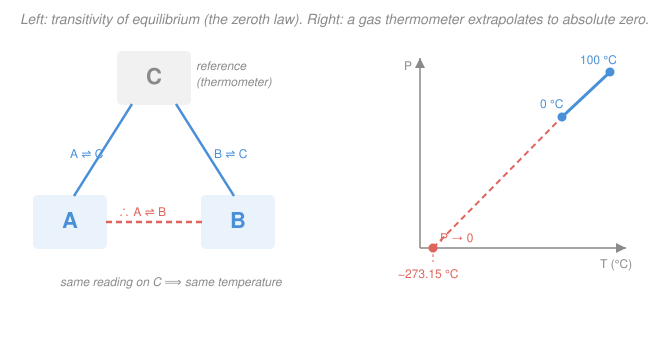

# Classical Thermodynamics · Lesson 1.1: Temperature & the zeroth law

> ⏱ ~15 min · Module 1: State, heat, work & the first law · Builds on: [`calc-refresher` syllabus](../../calc-refresher/syllabus.md) · Unlocks: [1.2 State variables & equations of state](01-02-state-variables-equations-of-state.md)

## Why this matters

Every equation in this course has a $T$ in it — the ideal gas law, entropy, the Boltzmann factor, the efficiency of an engine. But before we can *use* temperature we have to earn the right to write it down: what does it mean for two things to "have the same temperature," and why is that even a number rather than a vague feeling of warmth? The answer is a quiet little law — so basic it was discovered *after* the first, second, and third laws and had to be squeezed in ahead of them as the **zeroth**. It is the law that makes thermometers possible.

## The idea

Put a warm brick against a cold one and wait. Something flows from hot to cold, and after a while nothing changes anymore — they've reached **thermal equilibrium**. A system left to itself always drifts to one such settled state and then stays there. "Same temperature" is going to mean exactly this: *put them in contact and nothing happens.*

The catch: you can't put your coffee in direct thermal contact with the idea of "70 degrees." You need a middle-man — a **thermometer**. And for a thermometer to work, one fact about nature has to hold, a fact so obvious-sounding it's easy to miss it's a fact at all:

> If A agrees with the thermometer, and B agrees with the same thermometer, then A and B agree with **each other**.

That transitivity is not logic — it's physics, and it happens to be true. It's the whole reason a single dial reading can stand in for "will these two reach equilibrium if I touch them together?" Without it, temperature would not be a number; it'd be a tangle of "A matches B, B matches C, but A doesn't match C." Nature is kinder than that, and the reward is that we get to attach *one real number* to every object and compare any two by comparing their numbers.

## The formal version

**Thermal equilibrium.** Two systems in **thermal contact** (touching through a wall that lets energy pass but not matter — a *diathermal* wall) are in **thermal equilibrium** when there is no net flow of energy between them and their macroscopic properties have stopped changing. *In words: they're touching, and nothing is happening anymore.* An isolated system always evolves to a unique such equilibrium state and remains there.

**The zeroth law of thermodynamics.** Let "$\sim$" mean "is in thermal equilibrium with." Then for any systems $A$, $B$, $C$:

$$A \sim C \quad\text{and}\quad B \sim C \qquad\Longrightarrow\qquad A \sim B.$$

*In words: two systems each in equilibrium with a third are in equilibrium with each other.* Together with the obvious facts that $A\sim A$ and that $A\sim B$ implies $B\sim A$, this makes "$\sim$" an **equivalence relation** — it sorts all systems into non-overlapping classes, and every system in one class is in mutual equilibrium.

**Temperature.** We label each equivalence class with a number, the **temperature** $T$, chosen so that

$$T_A = T_B \iff A \sim B.$$

*In words: equal temperature means — and is the only thing that means — mutual thermal equilibrium.* The thermometer $C$ is just a conveniently portable member we carry from class to class to read off the label. Temperature is **intensive**: it describes a state ("how hot"), not an amount, so cutting a uniform body in half leaves $T$ unchanged (mass, volume, and energy — *extensive* quantities — halve).

**Empirical scales.** To turn the label into a *measurement* we pick a **thermometric property** $X$ — something monotonic in hotness that's easy to read: the pressure of a gas held at fixed volume, the length of a mercury column, the resistance of a wire. We *define* a scale by making $T$ a simple function of $X$. The constant-volume gas thermometer uses pressure, $T \propto P$, and it has a remarkable feature: measure $P$ at a few temperatures, draw the line, and extrapolate down — the pressure of *every* dilute gas heads toward zero at the **same** temperature,

$$-273.15\ ^\circ\mathrm{C}.$$

Nothing can be colder (you can't have negative pressure from a gas), so we anchor an absolute scale there — the **Kelvin scale** — and shift the Celsius numbers up to meet it:

$$\boxed{\,T(\mathrm{K}) = T(^\circ\mathrm{C}) + 273.15\,}$$

*In words: Kelvin is Celsius with its zero moved down to the coldest possible temperature.* A degree is the same size on both; only the origin differs. (This "same zero for every gas" is a hint of something deeper — that $T$ measures energy per particle — which [`stat-mech`](../../stat-mech/syllabus.md) will cash out. Note also: temperature is *not* heat. Heat is energy *in transit* between systems at different temperatures; a hot object doesn't "contain heat." We keep that distinction sharp starting in [1.3](01-03-heat-work-first-law.md).)

## Picture

## Worked examples

**Example 1 (mechanical — a thermometric property becomes a temperature).** A constant-volume gas thermometer reads a pressure $P = 2.20\times10^{4}\ \mathrm{Pa}$ when dipped in melting ice ($0\,^\circ\mathrm{C}$) and $P = 3.00\times10^{4}\ \mathrm{Pa}$ in boiling water ($100\,^\circ\mathrm{C}$). Because we've *defined* $T$ to be linear in $P$ on this scale, two points fix the line. What temperature corresponds to a reading of $P = 2.50\times10^{4}\ \mathrm{Pa}$?

The slope of the line (in $^\circ\mathrm{C}$ per Pa) is

$$\frac{\Delta t}{\Delta P} = \frac{100 - 0}{(3.00 - 2.20)\times10^{4}} = \frac{100}{0.80\times10^{4}} = 1.25\times10^{-2}\ ^\circ\mathrm{C/Pa}.$$

Starting from the ice point and adding the extra pressure $\times$ slope,

$$t = 0 + (2.50 - 2.20)\times10^{4}\times 1.25\times10^{-2} = 0.30\times10^{4}\times1.25\times10^{-2} = 37.5\,^\circ\mathrm{C}.$$

The gas didn't "know" what a degree is — *we* built the correspondence by choosing $T$ linear in $P$ and pinning two reference points. That's what an empirical scale is.

**Example 2 (why you'd care — extrapolating to absolute zero).** Using the same two readings, where does the line say $P$ hits zero? Set $P=0$ and walk down from the ice point:

$$t_0 = 0 - \frac{P_{\text{ice}}}{\text{slope of }P\text{ vs }t}.$$

The slope of $P$ vs $t$ is the reciprocal of before, $0.80\times10^{4}/100 = 80\ \mathrm{Pa/^\circ C}$, so

$$t_0 = 0 - \frac{2.20\times10^{4}\ \mathrm{Pa}}{80\ \mathrm{Pa/^\circ C}} = -275\,^\circ\mathrm{C}.$$

A real dilute gas would give $-273.15\,^\circ\mathrm{C}$; our round numbers land close. The point is conceptual: the *same* intercept emerges no matter which gas you use, which is why that temperature deserves to be called **absolute zero** and to anchor the Kelvin scale. In Kelvin the thermometer law is even cleaner — $P \propto T(\mathrm{K})$ straight through the origin, no offset.

## Watch out

- **You might think the zeroth law is just logic and needs no stating.** It isn't — transitivity of "settles down together" is a *physical* fact about thermal contact that could conceivably fail (and for other equilibria it can). It's precisely this fact that lets a thermometer reading substitute for direct contact, so it earns its place as a law.
- **You might think a hotter object "contains more heat."** Temperature (intensive, "how hot") and heat (energy in transit) are different animals. A thimble of molten metal is far hotter than a warm bathtub but transfers far less energy. We'll formalize heat in [1.3](01-03-heat-work-first-law.md); for now, keep "temperature = the label on the equilibrium class."
- **You might think temperatures add when you combine systems.** They don't — $T$ is intensive. Two 300 K cups of water poured together give 300 K water, not 600 K. What adds are extensive quantities (mass, volume, energy), not the intensive ones (temperature, pressure, density).

## One-liner

> Because "settles down together" is transitive (the zeroth law), every system carries a single number — its temperature — and equal numbers mean mutual equilibrium; a thermometer just reads that label off.

## Problems

**P1 (🟢)** A constant-volume gas thermometer records pressure $P = 1.000\ \mathrm{atm}$ at $0\,^\circ\mathrm{C}$ and $P = 1.366\ \mathrm{atm}$ at $100\,^\circ\mathrm{C}$. Treating $T$ as linear in $P$, extrapolate to the temperature at which $P \to 0$. How close is it to the accepted absolute zero?

**P2 (🟡)** You touch a thermometer $C$ to block $A$; it reads the same value it read a moment earlier on block $B$. You conclude $A$ and $B$ are in thermal equilibrium and predict that placing them in direct contact produces no heat flow. But when you do it, energy clearly flows from $A$ to $B$. Which law did your reasoning rely on, and what must have gone wrong — name at least one concrete possibility?

**P3 (🔴, optional)** (a) Convert $37\,^\circ\mathrm{C}$ (human body temperature) and $-40\,^\circ\mathrm{C}$ to Kelvin. (b) Two identical sealed flasks of gas, each at $300\ \mathrm{K}$, are clamped together through a diathermal wall and left overnight. What is the final temperature, and why isn't it $600\ \mathrm{K}$? Which quantities, if any, *would* add?

Solutions

**P1** The slope of $P$ vs $t$ is

$$\frac{\Delta P}{\Delta t} = \frac{1.366 - 1.000\ \mathrm{atm}}{100 - 0\,^\circ\mathrm{C}} = 3.66\times10^{-3}\ \mathrm{atm/^\circ C}.$$

The line reaches $P=0$ a distance $P_{\text{ice}}/(\Delta P/\Delta t)$ below the ice point:

$$t_0 = 0 - \frac{1.000\ \mathrm{atm}}{3.66\times10^{-3}\ \mathrm{atm/^\circ C}} = -273.2\,^\circ\mathrm{C}.$$

*Check.* The accepted value is $-273.15\,^\circ\mathrm{C}$; our result matches to the precision of the data. Sanity: the ratio $1.366 = 373.15/273.15$ is exactly what an ideal gas ($P \propto T$ in Kelvin) gives between $373.15\ \mathrm{K}$ and $273.15\ \mathrm{K}$, so the extrapolation *must* land on $-273.15\,^\circ\mathrm{C}$. ✓

**P2** The prediction relied on the **zeroth law**: $A\sim C$ and $B\sim C$ should imply $A\sim B$. Observing heat flow means $A$ and $B$ were *not* actually in mutual equilibrium, so a premise was false. Concrete possibilities: (i) $C$ was not truly in equilibrium with $A$ (or $B$) at the moment of reading — you didn't wait long enough, so an equal *dial reading* didn't reflect an equal *temperature*; (ii) the thermometer's thermometric property isn't single-valued/reproducible (e.g. hysteresis, or $C$'s own temperature drifted between the two readings); (iii) $A$ or $B$ isn't in internal equilibrium (a temperature gradient inside it), so "the temperature of $A$" isn't even well defined. The zeroth law itself is fine — the setup violated its hypotheses.

*Check.* The logic is exactly that of an equivalence relation: if $A\sim C$ and $B\sim C$ genuinely held, $A\sim B$ is forced. A counterexample therefore indicts a hypothesis, not the implication. ✓

**P3** (a) Add $273.15$:

$$37\,^\circ\mathrm{C} \to 310.15\ \mathrm{K}, \qquad -40\,^\circ\mathrm{C} \to 233.15\ \mathrm{K}.$$

(b) Both flasks are already at the same temperature, so they're in thermal equilibrium the instant they touch — no net heat flows and the final temperature is $300\ \mathrm{K}$, unchanged. It isn't $600\ \mathrm{K}$ because temperature is **intensive**: it's a property of the state, not a tally you sum. The quantities that *would* add are the **extensive** ones — total gas amount (moles), total volume, total internal energy — each doubling.

*Check.* Intensive/extensive litmus: cut the combined system back in half and you recover one flask at $300\ \mathrm{K}$ (temperature survives the cut) with half the moles and energy (those don't). Consistent. ✓ Note $-40\,^\circ\mathrm{C} = 233.15\ \mathrm{K}$ is the one temperature where Celsius and Fahrenheit coincide — a memorable anchor. ✓

## Connections

- **Backward:** the extrapolation in Examples 1–2 is nothing but fitting and reading off a straight line — the linear functions and interpolation from [`calc-refresher`](../../calc-refresher/syllabus.md). Here the line's slope and intercept carry physical meaning: intercept = absolute zero.
- **Forward:** [1.2 State variables & equations of state](01-02-state-variables-equations-of-state.md) promotes $T$ to a bona fide **state variable** and ties it to $P$ and $V$ through the ideal gas law $PV = nRT$ — the "$T \propto P$ at fixed $V$" of the gas thermometer is that law seen edge-on.
- **Sideways (statistical mechanics & math):** the "$\sim$ is an equivalence relation" structure is the same one that partitions a set into classes in pure math; and the deep *why* — that all gases hit zero pressure together — is because $T$ secretly measures average energy per particle, the bridge that [`stat-mech`](../../stat-mech/syllabus.md) builds with $\tfrac32 k_B T$.
