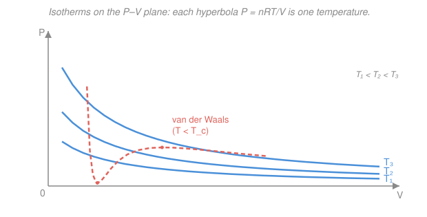

# Classical Thermodynamics · Lesson 1.2: State variables & equations of state

> ⏱ ~15 min · Module 1: State, heat, work & the first law · Builds on: [1.1 Temperature & the zeroth law](01-01-temperature-zeroth-law.md) · Unlocks: [1.3 Heat, work & the first law](01-03-heat-work-first-law.md)

## Why this matters

A litre of air has something like $10^{22}$ molecules, each with a position and a velocity — a description with $10^{23}$ numbers in it. Yet to a thermodynamicist that gas is captured by **four**: pressure, volume, temperature, amount. That collapse — from Avogadro-scale chaos to a handful of dials — is the founding trick of the whole subject, and it works only because the gas is in *equilibrium*. This lesson pins down which quantities are those dials, how they are chained together by an **equation of state**, and why some quantities (energy, entropy) care only about *where you are* while others (heat, work) care about *how you got there*. That last distinction is the hinge the entire first law turns on next lesson.

## The idea

Leave a gas alone in a sealed box. It sloshes, then settles: pressure even throughout, one temperature everywhere, nothing changing. That settled condition is a **state** (an equilibrium state), and the remarkable fact is that you can reproduce it exactly knowing only a few gross numbers — you never need the molecular details. Those numbers are the **state variables**: $P, V, T, N$.

Two things then organize everything:

**First, the dials are not independent.** Fix the volume and temperature of a gas and its pressure is *forced* — you cannot dial it separately. The relation that ties them together is the **equation of state**. For a simple system it's one equation among the four variables, so only **two of them are free**; the rest follow. Choose $V$ and $T$, and $P$ is determined.

**Second, some quantities are properties of the state itself, others are properties of the journey.** Ask "what is the gas's pressure?" and the answer depends only on the current state — a **state function**. Ask "how much heat did it absorb?" and there is no answer until you say *by what process* it got there — a **path function**. The gas doesn't "contain" heat the way it "has" a pressure. Keeping these two categories apart is the single most common place beginners trip.

## The formal version

**State function vs. path function.** A quantity $X$ is a **state function** if its value is fixed by the current equilibrium state alone, independent of history. Then for any change its increment is an *exact differential* $dX$, and around any **closed path** (return to the start)

$$\oint dX = 0.$$

*In words: if a quantity only depends on where you are, then going on a round trip and coming home changes it by nothing.* The state functions here are $P, V, T, N$ and later the internal energy $U$ and entropy $S$. By contrast **heat** $Q$ and **work** $W$ are **path functions**: $\oint \delta Q \neq 0$ and $\oint \delta W \neq 0$ in general. We write their tiny increments as $\delta Q, \delta W$ (inexact) rather than $dQ, dW$ precisely to flag that there is no function "$Q$" to differentiate — the little $\delta$ is a running tally along a route, not the change in a stored property. (We cash this out in [1.3](01-03-heat-work-first-law.md).)

**Intensive vs. extensive.** Imagine cloning your system — putting two identical copies side by side.

- **Extensive** variables *double*: volume $V$, particle number $N$, internal energy $U$, entropy $S$. They scale with system size.
- **Intensive** variables *stay put*: pressure $P$, temperature $T$, density $\rho = N/V$, chemical potential $\mu$. They are local properties, blind to how much stuff there is.

*In words: cut the system in half — extensive things halve, intensive things don't budge.* A useful tell: any ratio of two extensives is intensive (density $\rho=N/V$ is extensive-over-extensive, hence intensive).

**The ideal-gas law.** For a dilute gas the equation of state is

$$PV = N k_B T = n R T,$$

where $P$ is pressure (pascals, Pa $=$ N/m²), $V$ volume (m³), $T$ absolute temperature (kelvin, K), $N$ the number of molecules, and $n$ the number of **moles** with $N = n N_A$ and Avogadro's number $N_A = 6.022\times10^{23}\ \text{mol}^{-1}$. The two constants are the same constant seen at two scales:

$$k_B = 1.38\times10^{-23}\ \text{J/K} \quad(\text{per molecule}), \qquad R = N_A k_B = 8.314\ \text{J/(mol·K)} \quad(\text{per mole}).$$

*In words: pressure times volume equals the amount of gas times a constant times the absolute temperature.* Notice the bookkeeping is consistent: $P,T$ are intensive; $V,N$ are extensive; the products $PV$ and $NT$ are both extensive, so the equation balances under cloning.

**The P–V–T surface.** One equation among three variables ($P,V,T$ for fixed $N$) is a **surface** floating in $P$–$V$–$T$ space. Every equilibrium state of the gas is a point *on* that surface; off-surface points are simply not equilibrium states the gas can occupy. Slicing the surface at a fixed temperature gives an **isotherm**,

$$P = \frac{nRT}{V},$$

a hyperbola in the $P$–$V$ plane — higher $T$ pushes the hyperbola outward (see the figure). Fixing $P$ instead gives $V \propto T$ (isobar); fixing $V$ gives $P \propto T$ (isochore).

**Van der Waals — a first correction.** Real gases deviate because the ideal law assumes point particles that never attract. Van der Waals patched both:

$$\left(P + \frac{a n^2}{V^2}\right)(V - nb) = nRT.$$

*In words: subtract off the room the molecules themselves take up, and add back the pressure lost to their mutual attraction.* The $nb$ term is the **finite molecular volume** — the gas can't be squeezed below it, so the *effective* volume is $V-nb$. The $a n^2/V^2$ term is **attraction** — neighbours pulling inward soften the push on the walls, so the measured $P$ is *lower* than the ideal value (you add it back to recover $nRT$). As $a,b\to 0$, or at low density (large $V$, so $nb\ll V$ and $an^2/V^2\ll P$), it collapses straight back to $PV=nRT$. Below a **critical temperature** $T_c$ the isotherm develops a non-physical S-shaped *wiggle* (the coral curve) — the mathematical fingerprint of the gas–liquid transition we return to in [3.3](03-03-phase-transitions-clausius-clapeyron.md).

## Picture

## Worked examples

**Example 1 (the law in action).** Two moles of gas ($n=2$) fill $V=0.05\ \text{m}^3$ at $T=300\ \text{K}$. The pressure is forced by the equation of state:

$$P = \frac{nRT}{V} = \frac{2 \times 8.314 \times 300}{0.05} = \frac{4988.4}{0.05} \approx 9.98\times10^{4}\ \text{Pa} \approx 1\ \text{atm}.$$

We didn't get to *choose* $P$ — picking $n, V, T$ used up all the freedom. And the molecule count is $N = nN_A = 2 \times 6.022\times10^{23} \approx 1.20\times10^{24}$, confirming both forms $PV=Nk_BT=nRT$ agree.

**Example 2 (why the state/path split earns its keep).** Take a gas from state $A$ to state $B$ by two different processes — say, cool-then-compress versus compress-then-cool. The **temperature change** $\Delta T = T_B - T_A$ is *identical* for both routes, because $T$ is a state function: it reads the endpoints only. Same for $\Delta P$, $\Delta V$, and (next lesson) $\Delta U$. But the **work done** and **heat exchanged** generally *differ* between the two routes — they are path functions, tallying the area swept and the heat drawn *along the way*. This is exactly why an equation of state is written among state functions only: it is a statement about points on the surface, not about trips across it.

## Watch out

- **You might think a gas "contains" a certain amount of heat.** It doesn't. Heat is energy *in transit* during a process; once the gas settles, there is no "stored heat" to point at — only its state functions ($T$, $U$, …). "How much heat?" is only answerable for a *process*, never for a *state*.
- **You might think you can set $P$, $V$, and $T$ all independently.** For a simple one-component system you can't — the equation of state spends one degree of freedom, leaving exactly **two** free. Choosing all three over-determines the system (or lands you off the equilibrium surface).
- **You might read the van der Waals $a$-term as raising the pressure.** The *attraction* it represents *lowers* the pressure the gas exerts on the walls; the term is *added to* the measured $P$ only to reconstruct the ideal-gas right-hand side $nRT$. Physically, real attractive gases push on their container a little *less* than an ideal gas would.

## One-liner

> An equilibrium state is set by a few state variables tied together by one equation of state, so a simple system has two free; state functions (P, V, T, U, S) depend only on *where* you are — $\oint dX=0$ — while heat and work depend on *how you got there*.

## Problems

**P1 (🟢)** A tank holds $n = 3\ \text{mol}$ of nitrogen at $T = 350\ \text{K}$ in a volume $V = 0.02\ \text{m}^3$. Find the pressure $P$, and state how many molecules $N$ are present. Then, without recomputing from scratch, say what happens to $P$ if the temperature is raised to $700\ \text{K}$ at fixed volume.

**P2 (🟡)** A gas is carried from state $A$ to state $B$ along **path 1**, then back from $B$ to $A$ along a *different* **path 2**, completing a closed cycle. (a) What are $\oint dU$, $\oint dT$, and $\oint dV$ for the full cycle, and why? (b) Along path 1 the internal energy rises by $30\ \text{J}$. What is $\Delta U$ along path 2? (c) Can you determine the work done on path 1 from this information alone? Explain in one sentence.

**P3 (🔴, optional)** One mole of CO₂ occupies $V = 1.0\ \text{L} = 1.0\times10^{-3}\ \text{m}^3$ at $T = 300\ \text{K}$. Using $a = 0.364\ \text{Pa·m}^6/\text{mol}^2$ and $b = 4.27\times10^{-5}\ \text{m}^3/\text{mol}$, estimate the pressure from *both* the ideal-gas law and van der Waals, and say which correction (finite volume or attraction) dominates the difference.

Solutions

**P1** Straight from the equation of state:

$$P = \frac{nRT}{V} = \frac{3 \times 8.314 \times 350}{0.02} = \frac{8729.7}{0.02} \approx 4.36\times10^{5}\ \text{Pa} \ (\approx 4.3\ \text{atm}).$$

Molecule count: $N = nN_A = 3 \times 6.022\times10^{23} \approx 1.81\times10^{24}$. At fixed $V$ and $n$, the law gives $P \propto T$ (an isochore), so **doubling $T$ to $700\ \text{K}$ doubles the pressure** to $\approx 8.7\times10^{5}\ \text{Pa}$.

*Check.* Units: $\dfrac{\text{mol}\cdot(\text{J/mol·K})\cdot\text{K}}{\text{m}^3}=\dfrac{\text{J}}{\text{m}^3}=\dfrac{\text{N·m}}{\text{m}^3}=\dfrac{\text{N}}{\text{m}^2}=\text{Pa}$ ✓. A few atmospheres for a few moles in $20\ \text{L}$ is physically sensible. ✓

**P2** (a) $\oint dU = \oint dT = \oint dV = 0$. Each of $U$, $T$, $V$ is a **state function**, so a round trip that returns to the starting state changes them by nothing — the defining property $\oint dX = 0$. (b) $U$ is path-independent, so $\Delta U_{A\to B}$ is $+30\ \text{J}$ on *every* route; going back $B\to A$ along path 2 gives $\Delta U = -30\ \text{J}$ (it must cancel so the cycle sums to zero). (c) **No** — work is a path function, so knowing only the endpoints (or $\Delta U$) does not fix it; you would need the actual $P$–$V$ route taken on path 1.

*Check.* Consistency: $\oint dU = \Delta U_{\text{path 1}} + \Delta U_{\text{path 2}} = (+30) + (-30) = 0$ ✓, exactly as a state function requires.

**P3** *Ideal:*

$$P_{\text{ideal}} = \frac{nRT}{V} = \frac{1 \times 8.314 \times 300}{1.0\times10^{-3}} = \frac{2494.2}{10^{-3}} \approx 2.49\times10^{6}\ \text{Pa}.$$

*Van der Waals*, solved for $P$: $\;P = \dfrac{nRT}{V-nb} - \dfrac{a n^2}{V^2}$. The two pieces:

$$\frac{nRT}{V-nb} = \frac{2494.2}{1.0\times10^{-3} - 4.27\times10^{-5}} = \frac{2494.2}{9.573\times10^{-4}} \approx 2.61\times10^{6}\ \text{Pa},$$
$$\frac{a n^2}{V^2} = \frac{0.364 \times 1^2}{(1.0\times10^{-3})^2} = \frac{0.364}{10^{-6}} = 3.64\times10^{5}\ \text{Pa}.$$

So $P_{\text{vdW}} \approx 2.61\times10^{6} - 0.364\times10^{6} \approx 2.24\times10^{6}\ \text{Pa}$ — about **10% below** the ideal value. The finite-volume term *raised* $P$ by $\sim1.1\times10^{5}\ \text{Pa}$, but the **attraction** term *lowered* it by $3.64\times10^{5}\ \text{Pa}$ — attraction wins, so the real gas pushes on the walls noticeably *less* than an ideal gas would at this density.

*Check.* Units of the attraction term: $\dfrac{\text{Pa·m}^6/\text{mol}^2 \cdot \text{mol}^2}{\text{m}^6} = \text{Pa}$ ✓. Limiting sense: at $V = 1\ \text{m}^3$ (a thousandfold dilution) both corrections shrink by factors of $\sim10^3$–$10^6$ and $P_{\text{vdW}}\to P_{\text{ideal}}$, as it must. ✓

## Connections

- **Backward:** the *absolute* temperature $T$ in $PV=nRT$ is the very thermometric scale built in [1.1](01-01-temperature-zeroth-law.md) — the zeroth law is what let us treat $T$ as a well-defined state variable in the first place.
- **Forward:** [1.3 Heat, work & the first law](01-03-heat-work-first-law.md) promotes the path-function $\delta W = P\,dV$ into the area under a P–V curve and pairs it with $\delta Q$ to build the internal energy $U$ — the first genuinely thermodynamic state function; the closed-loop rule $\oint dU = 0$ derived here is exactly what makes the first law a conservation law.
- **Sideways (stat mech):** $k_B$ is the bridge from this macroscopic law to the molecular world — $PV=Nk_BT$ falls out of counting microstates in [`stat-mech`](../../stat-mech/syllabus.md), where $R = N_A k_B$ is just the per-mole face of the per-molecule constant.
