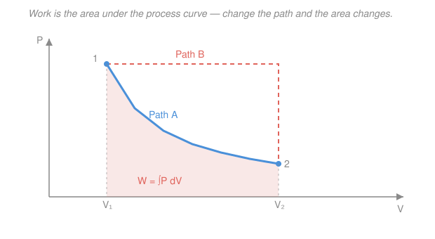

# Classical Thermodynamics · Lesson 1.3: Heat, work & the first law

> ⏱ ~15 min · Module 1: State, heat, work & the first law · Builds on: [1.2 State variables & equations of state](01-02-state-variables-equations-of-state.md) · Unlocks: [1.4 Heat capacities & processes on the P–V diagram](01-04-heat-capacities-pv-processes.md)

## Why this matters

Energy conservation is the one law you can't cheat, but for a gas it comes with a twist: energy enters a system two entirely different ways — as **heat** (a temperature difference driving it in) and as **work** (something pushing on a piston). The first law is just careful bookkeeping of those two flows. Get the bookkeeping right and you can predict how much a gas heats up when you compress it, how much work an engine can extract, and — the punchline of this module — why heat and work are *not* stored quantities the way internal energy is. That last distinction, that $U$ is a property of the state while $Q$ and $W$ are properties of the *journey*, is the seed of the entire second law.

## The idea

Picture a gas in a cylinder with a piston. There are exactly two ways to change its internal energy $U$ (the total microscopic kinetic + potential energy of all its molecules). You can **heat it** — put it in contact with something hotter, and energy flows in as heat $Q$. Or you can **do work on it** — shove the piston in, and the gas gets compressed. Conversely the gas can *give back* energy: it can dump heat to something colder, or it can *push the piston out* and do work on the outside world. Energy in minus energy out equals energy stored. That's the whole first law.

The subtle part is that $U$ is like the **balance in a bank account** — it depends only on *where you are* (the current state: this $P$, this $V$, this $T$), never on how you got there. But $Q$ and $W$ are like **deposits and withdrawals** — they only make sense *during a transaction*. You can't ask "how much heat does this gas contain?" any more than you can ask "how much deposit is in your account?" Heat and work are energy *in transit*, measured only while something is flowing. Two different processes carrying a gas between the *same* two states can move totally different amounts of heat and work — even though $\Delta U$ is identical for both.

## The formal version

**Internal energy is a state function.** $U$ is fixed by the state of the system. Over any process from state 1 to state 2,

$$\Delta U = U_2 - U_1,$$

depends only on the endpoints, not the path. *In words: internal energy is a property you can read off the current state, so its change is endpoint-minus-endpoint.* Because of this, over a closed cycle that returns to its starting state,

$$\oint dU = 0.$$

**Heat and work are path functions.** $Q$ and $W$ are energy in transit — they exist only during a process and depend on which path you take. To flag that a small bit of heat or work is *not* the change of any stored quantity, we write it with a $\delta$ (some texts use a barred $d$, $\bar{d}Q$) instead of a $d$:

$$\delta Q, \qquad \delta W.$$

*In words: $\delta Q$ is "a little heat that flowed," not "the change in some heat-content $Q(\text{state})$" — there is no such function to take the differential of.* A quantity like $dU$ whose integral depends only on endpoints is an **exact differential**; $\delta Q$ and $\delta W$ are **inexact** — their integrals depend on the path. This is the same exact-vs-inexact distinction you meet with line integrals in [`calc-refresher`](../../calc-refresher/syllabus.md): $\oint dU = 0$ always, but $\oint \delta Q$ and $\oint \delta W$ need not vanish.

**The first law.** Conservation of energy for the gas reads

$$\boxed{\,dU = \delta Q - \delta W\,}$$

with the **physics ("by-gas") sign convention**: $\delta W$ is the work done **by** the gas *on its surroundings*. *In words: the gas's energy rises by whatever heat flows in, minus whatever work it does pushing on the world.* Signs, memorized once:

- $\delta Q > 0$: heat flows **into** the gas. $\delta Q < 0$: gas releases heat.
- $\delta W > 0$: gas **does** work (it expands, pushing out). $\delta W < 0$: work is done **on** the gas (it's compressed).

> **One convention, chosen and kept.** Chemistry texts instead track work done *on* the system and write $dU = \delta Q + \delta W$. Same physics, opposite sign on $W$. We use the **by-gas** convention $dU = \delta Q - \delta W$ everywhere in this course. Pick one and never mix them.

**Quasi-static $P$–$V$ work.** Push a piston of area $A$ slowly (quasi-statically, so the gas stays in equilibrium at a well-defined pressure $P$ throughout). The gas pushes the piston with force $PA$; if the piston moves out by $dx$, the volume rises by $dV = A\,dx$ and the gas does work $\delta W = PA\,dx = P\,dV$:

$$\delta W = P\,dV \qquad\Longrightarrow\qquad W = \int_{V_1}^{V_2} P\,dV.$$

*In words: the work done by an expanding gas is the pressure times the volume swept out — and over a whole process it's the **area under the process curve** on a $P$–$V$ diagram.* Expansion ($dV > 0$) gives $W > 0$ (gas does work); compression ($dV < 0$) gives $W < 0$ (work done on gas). Because the *height* $P$ at each $V$ depends on which path you follow, so does the area — that's exactly why $W$ is a path function.

**Around a cycle.** Traverse a closed loop on the $P$–$V$ diagram back to the start. Then $\oint dU = 0$, so the first law forces

$$\oint \delta Q = \oint \delta W = \text{area enclosed by the loop}.$$

*In words: the net heat absorbed over a cycle equals the net work done, which equals the loop's enclosed area — the internal energy came back to where it started, but heat and work did not net to zero.* This is the engine principle, and it's [Boss problem 1](../syllabus.md) in miniature.

**Three staple processes.** For an ideal gas ($PV = nRT$, from [1.2](01-02-state-variables-equations-of-state.md)):

- **Isothermal** (constant $T$): $P = nRT/V$, so $W = \int_{V_1}^{V_2}\frac{nRT}{V}\,dV = nRT\ln\!\dfrac{V_2}{V_1}$.
- **Isobaric** (constant $P$): $W = \int_{V_1}^{V_2} P\,dV = P\,\Delta V$.
- **Isochoric** (constant $V$): $dV = 0$, so $W = 0$ — a rigid container does no $P$–$V$ work no matter how much you heat it.

## Picture

Both paths start at state 1 and end at state 2, so $\Delta U$ is identical for either. But the shaded area under Path A (an isotherm-like curve) is visibly smaller than the area under Path B (expand at high pressure, then drop). Different area means different $W$ — and by the first law, different $Q$ too. Same endpoints, different journey.

## Worked examples

**Example 1 (mechanical — isothermal expansion).** Two moles of ideal gas at $T = 300\,\text{K}$ expand isothermally to triple their volume, $V_2 = 3V_1$. Find the work done by the gas, the heat absorbed, and $\Delta U$.

The work is the isothermal formula:

$$W = nRT\ln\frac{V_2}{V_1} = (2)(8.314)(300)\ln 3 = 4988.4 \times 1.0986 \approx 5.48\times10^3\,\text{J}.$$

For an ideal gas $U$ depends on temperature alone (an experimental fact — Joule's result, proved cleanly in [3.2](03-02-maxwell-relations.md)). Isothermal means $T$ is constant, so $\Delta U = 0$. The first law then hands us the heat directly:

$$\Delta U = Q - W = 0 \quad\Longrightarrow\quad Q = W \approx 5.48\times10^3\,\text{J}.$$

Every joule of heat that flowed in walked straight back out as work; the gas is just a conduit. That $\Delta U = 0$ while $Q = W = 5.48\,\text{kJ}$ are both nonzero is the state-vs-path distinction in a single line.

**Example 2 (why you'd care — a rectangular cycle).** Run a gas around this closed loop: **A→B** expand isobarically at $P_1 = 2.0\times10^5\,\text{Pa}$ from $V_1 = 1.0\times10^{-3}\,\text{m}^3$ to $V_2 = 3.0\times10^{-3}\,\text{m}^3$; **B→C** cool isochorically to $P_2 = 1.0\times10^5\,\text{Pa}$; **C→D** compress isobarically at $P_2$ back to $V_1$; **D→A** heat isochorically back to $P_1$. Find the net work.

Leg by leg, using $W = P\,\Delta V$ on the isobars and $W = 0$ on the isochores:

$$W_{AB} = P_1(V_2 - V_1) = (2.0\times10^5)(2.0\times10^{-3}) = 400\,\text{J},$$
$$W_{BC} = 0, \qquad W_{CD} = P_2(V_1 - V_2) = (1.0\times10^5)(-2.0\times10^{-3}) = -200\,\text{J}, \qquad W_{DA} = 0.$$

Net work $= 400 - 200 = 200\,\text{J}$. Check against the enclosed area — the loop is a rectangle of height $P_1 - P_2$ and width $V_2 - V_1$:

$$\oint \delta W = (P_1 - P_2)(V_2 - V_1) = (1.0\times10^5)(2.0\times10^{-3}) = 200\,\text{J}. \checkmark$$

Since the gas returns to state A, $\oint dU = 0$, so the net heat absorbed is $\oint \delta Q = \oint \delta W = 200\,\text{J}$: over one cycle the gas swallowed 200 J of net heat and delivered 200 J of net work. That is exactly how an engine turns heat into work — and it's the skeleton of [Boss problem 1](../syllabus.md), where the isobars become isotherms.

## Watch out

- **You might think a gas "contains" heat.** It doesn't. There is no function $Q(\text{state})$ — heat only exists *while it flows*. That's the entire reason for the $\delta$ in $\delta Q$: it warns you this is not $d$ of anything. Say "heat absorbed *in this process*," never "the heat of the gas."
- **You might drop or flip the sign on $W$.** In the by-gas convention, compression does *negative* work by the gas ($dV < 0$). If you find yourself writing $dU = \delta Q + \delta W$, you've silently switched to the chemistry convention — fine, but then $W$ means work *on* the gas and you must be consistent throughout the whole problem.
- **You might use $W = P\,\Delta V$ when $P$ isn't constant.** Pulling $P$ out of the integral is only legal on an isobar. On an isotherm $P$ changes as $1/V$, so you get the log, $nRT\ln(V_2/V_1)$ — not $P\,\Delta V$. Always ask whether $P$ is constant before you factor it out.

## One-liner

> Internal energy is where you *are* and changes only endpoint-to-endpoint ($\oint dU=0$); heat and work are how you *travel* ($\delta Q,\delta W$, path-dependent), and the first law $dU=\delta Q-\delta W$ says the two flows must balance — with $W=\int P\,dV$ the area under the curve.

## Problems

**P1 (🟢)** One mole of ideal gas at $T = 350\,\text{K}$ expands isothermally from $V_1 = 2.0\,\text{L}$ to $V_2 = 8.0\,\text{L}$. Find the work done by the gas, and state $\Delta U$ and $Q$ for the process.

**P2 (🟡)** A gas is compressed: 500 J of work is done *on* the gas, and during the compression it releases 300 J of heat to its surroundings. Using the by-gas convention $dU = \delta Q - \delta W$, find $\Delta U$. Does the internal energy rise or fall?

**P3 (🔴, optional)** A gas goes from state 1 $(P_1, V_1)$ to state 2 $(P_2, V_2)$ with $P_1 > P_2$ and $V_2 > V_1$, by two different quasi-static paths. **Path I:** expand isobarically at $P_1$ to $V_2$, then drop isochorically to $P_2$. **Path II:** drop isochorically to $P_2$ first, then expand isobarically at $P_2$ to $V_2$. Find $W$ for each path and their difference, and interpret that difference on the $P$–$V$ diagram.

Solutions

**P1** Isothermal ideal-gas expansion, so use the log formula with $n = 1$, $R = 8.314\,\text{J/(mol·K)}$, $T = 350\,\text{K}$, and the ratio $V_2/V_1 = 8.0/2.0 = 4$ (units cancel in the ratio, so litres are fine):

$$W = nRT\ln\frac{V_2}{V_1} = (1)(8.314)(350)\ln 4 = 2909.9 \times 1.3863 \approx 4.03\times10^3\,\text{J}.$$

For an ideal gas $U = U(T)$ only, and $T$ is constant, so $\Delta U = 0$. Then the first law gives $Q = W \approx 4.03\times10^3\,\text{J}$ — all the absorbed heat leaves as work.

*Check.* Units: $\text{mol}\cdot\text{J/(mol·K)}\cdot\text{K} = \text{J}$ ✓. Sanity: expansion ($V_2 > V_1$) gives $W > 0$, the gas does work — correct sign. And $Q = W > 0$: heat must flow *in* to keep $T$ fixed while the gas does work, exactly as expected. ✓

**P2** Translate into by-gas quantities. "Work done *on* the gas is 500 J" means the gas does $-500\,\text{J}$ of work: $W = -500\,\text{J}$. "Releases 300 J of heat" means heat leaves: $Q = -300\,\text{J}$. Then

$$\Delta U = Q - W = (-300) - (-500) = +200\,\text{J}.$$

Internal energy **rises** by 200 J.

*Check.* Sanity: 500 J of energy was pushed in as work while only 300 J leaked out as heat, so $500 - 300 = 200\,\text{J}$ must remain stored — the sign and size both make sense. ✓

**P3** On each isobar $W = P\,\Delta V$; on each isochore $W = 0$.

- **Path I:** $W_{\text{I}} = P_1(V_2 - V_1) + 0 = P_1(V_2 - V_1)$.
- **Path II:** $W_{\text{II}} = 0 + P_2(V_2 - V_1) = P_2(V_2 - V_1)$.

Since $P_1 > P_2$, Path I does *more* work: $W_{\text{I}} > W_{\text{II}}$. Their difference is

$$W_{\text{I}} - W_{\text{II}} = (P_1 - P_2)(V_2 - V_1).$$

That is precisely the area of the rectangle enclosed if you go out along Path I and back along Path II — the enclosed loop area. Same endpoints, so $\Delta U$ is identical for both paths, but $W$ (and hence $Q$) differs by that area: a direct demonstration that work is a path function.

*Check.* Limiting case $P_1 \to P_2$: the two paths collapse onto the same corner route, the enclosed area shrinks to zero, and $W_{\text{I}} - W_{\text{II}} \to 0$ ✓. Units: $\text{Pa}\cdot\text{m}^3 = \text{J}$ ✓.

## Flashback

**From Lesson 1.2 (State variables & equations of state):** A rigid tank holds $0.50\,\text{mol}$ of an ideal gas at pressure $2.0\times10^5\,\text{Pa}$ in a volume of $6.0\,\text{L}$. Find the gas temperature. (Fresh variant — solve for $T$ rather than $P$.)

Solution

Rearrange the ideal-gas law $PV = nRT$ for temperature, converting the volume to SI: $6.0\,\text{L} = 6.0\times10^{-3}\,\text{m}^3$.

$$T = \frac{PV}{nR} = \frac{(2.0\times10^5)(6.0\times10^{-3})}{(0.50)(8.314)} = \frac{1200}{4.157} \approx 289\,\text{K}.$$

*Check.* Units: $\dfrac{\text{Pa}\cdot\text{m}^3}{\text{mol}\cdot\text{J/(mol·K)}} = \dfrac{\text{J}}{\text{J/K}} = \text{K}$ ✓. Sanity: 289 K ≈ 16 °C, an unremarkable room-ish temperature for a few litres of gas at a couple of atmospheres. ✓

## Connections

- **Backward:** this rests on the state-vs-path-function distinction introduced in [1.2](01-02-state-variables-equations-of-state.md) — $U$ inherits its endpoint-only behaviour from being a state function, while $Q$ and $W$ do not. The isothermal work formula uses that lesson's ideal-gas law $PV = nRT$.
- **Forward:** [1.4](01-04-heat-capacities-pv-processes.md) classifies these $P$–$V$ paths systematically, defines the heat capacities $C_V$ and $C_P$ (how $Q$ splits between raising $T$ and doing $W$), and derives the adiabat $PV^\gamma = \text{const}$ — the one staple process with $\delta Q = 0$. The cycle in Example 2 is the template for every engine in [Module 2](02-01-heat-engines-carnot-cycle.md).
- **Sideways (calculus):** $W = \int P\,dV$ is a line integral, and $\delta Q,\delta W$ being inexact is the thermodynamic face of a differential form that isn't the gradient of any potential — the same "path-dependent integral" idea from [`calc-refresher`](../../calc-refresher/syllabus.md). The by-gas work $\int P\,dV$ is also the mechanical work-energy theorem from mechanics, applied to a piston.
