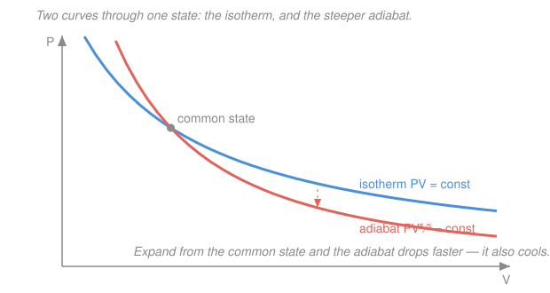

# Classical Thermodynamics · Lesson 1.4: Heat capacities & processes on the P–V diagram

> ⏱ ~15 min · Module 1: State, heat, work & the first law · Builds on: [1.3 Heat, work & the first law](01-03-heat-work-first-law.md) · Unlocks: [2.1 Heat engines, refrigerators & the Carnot cycle](02-01-heat-engines-carnot-cycle.md)

## Why this matters

"How much heat does it take to warm this up by one degree?" sounds like it has one answer. It has *two* — and which one you get depends on whether you let the gas expand while you heat it. That single fork is the reason a Carnot engine works, the reason the adiabat is steeper than the isotherm, and the reason air cools as it rises. This lesson turns the first law into a working toolkit: name the four ways to move on a $P$–$V$ diagram, and derive the one curve — the **adiabat** — that every engine cycle leans on.

## The idea

Heat capacity answers "joules in per degree up." But heat is a *path* quantity (that's the $\delta$ in $\delta Q$ from [1.3](01-03-heat-work-first-law.md)), so its "capacity" depends on the road you take.

Heat a gas in a **sealed rigid box**: every joule you add has nowhere to go but into the internal energy $U$ — the molecules just jiggle faster. Heat that same gas under a **loose piston** that keeps pressure constant: now it expands as it warms, so some of your joules leak out as work pushing the piston. You have to pay *extra* to hit the same temperature. So the constant-pressure heat capacity is **bigger** than the constant-volume one — bigger by exactly the expansion work.

That's the whole conceptual core. The four "processes" are just the four natural ways to hold one thing fixed while you move: fix $T$ (isothermal), fix $V$ (isochoric), fix $P$ (isobaric), or add **no heat at all** (adiabatic). The last one is special — cut off the heat, force the gas to pay for any work out of its own internal energy, and it cools as it expands. That trade is the adiabat.

## The formal version

**Heat capacity is path-dependent.** For a process, the heat capacity is

$$C = \frac{\delta Q}{dT}.$$

*In words: joules of heat per kelvin of temperature rise — but the value depends on which process you hold to.* The two that matter:

**Constant volume.** With $V$ fixed the gas does no work ($\delta W = P\,dV = 0$), so the first law $dU = \delta Q - \delta W$ collapses to $\delta Q = dU$. Hence

$$C_V = \left(\frac{\partial U}{\partial T}\right)_V.$$

*In words: at fixed volume all the heat goes straight into internal energy.*

**Constant pressure.** Now the gas also does work $P\,dV$, so $\delta Q = dU + P\,dV = d(U + PV)$. Defining the **enthalpy** $H \equiv U + PV$ (we meet it properly in [3.1](03-01-thermodynamic-potentials.md)),

$$C_P = \left(\frac{\partial H}{\partial T}\right)_P.$$

*In words: at fixed pressure the natural "heat bucket" is enthalpy, because it already bakes in the expansion work.*

**Mayer's relation (ideal gas).** For an ideal gas the internal energy depends on temperature *alone*, $U = U(T)$ (energy doesn't care about volume when molecules don't interact). Using $PV = nRT$ so $H = U + nRT$, differentiate both heat capacities in $T$:

$$\boxed{\,C_P - C_V = nR\,}$$

*In words: the constant-pressure capacity beats the constant-volume one by exactly $nR$ — the price of the expansion work per degree.* Here $n$ is the number of moles and $R = 8.314\ \mathrm{J\,mol^{-1}K^{-1}}$ the gas constant.

For a **monatomic** ideal gas $U = \tfrac32 nRT$, so

$$C_V = \tfrac32 nR, \qquad C_P = C_V + nR = \tfrac52 nR.$$

(A **diatomic** gas stores energy in rotation too, giving $C_V = \tfrac52 nR$, $C_P = \tfrac72 nR$.) The ratio is the **adiabatic index**

$$\gamma \equiv \frac{C_P}{C_V} \;=\; \begin{cases}5/3 \approx 1.67 & \text{monatomic}\\[2pt] 7/5 = 1.40 & \text{diatomic.}\end{cases}$$

**The four processes.** Each fixes one thing (all taken **quasi-static** — slow enough that $P,V,T$ stay well-defined the whole way, so $W = \int P\,dV$ applies):

| Process | Held fixed | Work $W=\int P\,dV$ | Heat $Q$ | $\Delta U$ (ideal gas) |
|---|---|---|---|---|
| Isothermal | $T$ | $nRT\ln(V_f/V_i)$ | $Q = W$ | $0$ |
| Isochoric | $V$ | $0$ | $Q = C_V\,\Delta T$ | $C_V\,\Delta T$ |
| Isobaric | $P$ | $P\,\Delta V$ | $Q = C_P\,\Delta T$ | $C_V\,\Delta T$ |
| Adiabatic | $Q=0$ | $-\Delta U$ | $0$ | $C_V\,\Delta T$ |

The isothermal row uses $\Delta U = 0$ (since $U=U(T)$ and $T$ is fixed), so all the heat becomes work. The adiabatic row uses $Q=0$, so the work comes entirely out of $U$ — the gas cools when it does work.

**Deriving the adiabat.** Take an ideal gas with $Q = 0$. The first law gives $dU = -P\,dV$. Substitute $dU = C_V\,dT$ and $P = nRT/V$:

$$C_V\,dT = -\frac{nRT}{V}\,dV \;\Longrightarrow\; \frac{dT}{T} = -\frac{nR}{C_V}\frac{dV}{V} = -(\gamma-1)\frac{dV}{V},$$

using $nR = C_P - C_V$ so $nR/C_V = \gamma - 1$. Integrate both sides:

$$\ln T = -(\gamma-1)\ln V + \text{const} \;\Longrightarrow\; \boxed{\,TV^{\gamma-1} = \text{const}.}$$

Finally use $T \propto PV$ (from $PV=nRT$) to trade $T$ for $P$:

$$\boxed{\,PV^{\gamma} = \text{const}.}$$

*In words: with heat sealed off, pressure and volume don't trade at $PV=\text{const}$ (that's the isotherm) — they trade at $PV^\gamma=\text{const}$, a steeper curve.* **Steeper** is exact: differentiate each curve at a shared point. The isotherm slope is $\left.\frac{dP}{dV}\right|_T = -P/V$; the adiabat slope is $\left.\frac{dP}{dV}\right|_{Q} = -\gamma P/V$. The adiabat is steeper by the factor $\gamma > 1$. Physically: expand adiabatically and the gas *also* cools, so its pressure drops for two reasons at once (more room **and** colder) — it plunges faster than the isotherm, which only feels the extra room.

## Picture

## Worked examples

**Example 1 (the two capacities, side by side).** Heat 2 mol of monatomic ideal gas from 300 K to 400 K. Compare the heat needed at constant volume vs. constant pressure.

$$C_V = \tfrac32 nR = \tfrac32(2)(8.314) = 24.9\ \mathrm{J/K}, \qquad Q_V = C_V\,\Delta T = 24.9 \times 100 = 2494\ \mathrm{J}.$$
$$C_P = \tfrac52 nR = 41.6\ \mathrm{J/K}, \qquad Q_P = C_P\,\Delta T = 4157\ \mathrm{J}.$$

The constant-pressure run costs $4157 - 2494 = 1663\ \mathrm{J}$ more. That surplus is exactly the work the gas did expanding: $W = nR\,\Delta T = 2(8.314)(100) = 1663\ \mathrm{J}$. Same $\Delta U = 2494\ \mathrm{J}$ in both cases (it's set by $\Delta T$ alone) — you just paid extra for the piston stroke.

**Example 2 (why the adiabat matters — heat vs. no heat).** A gas expands from a state $(P_0, V_0)$ to double its volume. Compare an **isothermal** expansion with an **adiabatic** one (monatomic, $\gamma = 5/3$).

- Isothermal: $T$ fixed, so $P$ falls only from the extra room, $P_f = P_0 V_0 / V_f = P_0/2$. The gas keeps absorbing heat to hold its temperature, and turns all of it into work.
- Adiabatic: no heat, so $P_f = P_0 (V_0/V_f)^\gamma = P_0 \, 2^{-5/3} = P_0/3.17$. Pressure drops *further* because the gas also cooled: $T_f = T_0\,2^{-(γ-1)} = T_0\,2^{-2/3} = 0.63\,T_0$.

Ending lower on the $P$–$V$ plane, the adiabat encloses less area, so the gas does **less** work — it had only its own internal energy to spend, while the isothermal gas was fed heat the whole way. This is the picture above, and it is the machinery of every engine in [Module 2](02-01-heat-engines-carnot-cycle.md).

## Watch out

- **You might think heat capacity is a property of the substance.** It's a property of the substance **and the path**. Quote $C_V$ or $C_P$, never a bare "$C$" — the two differ by $nR$, which for real engines is not small.
- **You might expect the adiabat and isotherm to look alike** because both are downward-sloping $P$–$V$ curves. They cross at one point and separate immediately: the adiabat is steeper by the factor $\gamma$, and it drops faster because expanding *without* heat also cools the gas.
- **You might write $Q = C_V\,\Delta T$ for any constant-volume-ish process.** $Q = C_V \Delta T$ needs $V$ genuinely constant; $Q = C_P\Delta T$ needs $P$ genuinely constant. Off those two rails, go back to $\delta Q = dU + P\,dV$ and integrate. ($\Delta U = C_V\Delta T$, though, holds for *any* ideal-gas process, because $U=U(T)$.)

## One-liner

> Heat capacity depends on the path — $C_P - C_V = nR$ — and cutting off heat gives the adiabat $PV^\gamma=\text{const}$, steeper than the isotherm because an expanding gas also cools.

## Problems

**P1 (🟢)** 3 mol of monatomic ideal gas is warmed from 250 K to 350 K. Find the heat required (a) at constant volume, (b) at constant pressure, and (c) the work the gas does in case (b). Use $R = 8.314\ \mathrm{J\,mol^{-1}K^{-1}}$.

**P2 (🟡)** A monatomic ideal gas ($\gamma = 5/3$) starting at $T_0 = 300\ \mathrm{K}$ is compressed **adiabatically** to half its volume. Find the factor by which its temperature rises and the factor by which its pressure rises. (Diesel engines ignite fuel this way — no spark plug.)

**P3 (🔴, optional)** Two curves leave the same state $(P_0,V_0)$ heading to larger volume: curve A obeys $PV = \text{const}$, curve B obeys $PV^{5/3} = \text{const}$. (a) Which is which — isotherm or adiabat? (b) For the same final volume, which one leaves the gas at higher pressure, and which delivers more work? (c) Along each curve, is heat entering the gas, leaving it, or neither?

Solutions

**P1** With $n = 3$: $C_V = \tfrac32 nR = \tfrac32(3)(8.314) = 37.4\ \mathrm{J/K}$ and $C_P = \tfrac52 nR = 62.4\ \mathrm{J/K}$; $\Delta T = 100\ \mathrm{K}$.

$$\text{(a)}\quad Q_V = C_V\,\Delta T = 37.4 \times 100 = 3740\ \mathrm{J}.$$
$$\text{(b)}\quad Q_P = C_P\,\Delta T = 62.4 \times 100 = 6236\ \mathrm{J}.$$
$$\text{(c)}\quad W = Q_P - \Delta U = Q_P - Q_V = 6236 - 3740 = 2496\ \mathrm{J}.$$

*Check.* Independently, $W = P\,\Delta V = nR\,\Delta T = 3(8.314)(100) = 2494\ \mathrm{J}$ ✓ (rounding). And $Q_P > Q_V$ by exactly that work, as it must.

**P2** Volume halves: $V_0/V_f = 2$. Temperature from $TV^{\gamma-1}=\text{const}$:

$$\frac{T_f}{T_0} = \left(\frac{V_0}{V_f}\right)^{\gamma-1} = 2^{2/3} = 1.59, \qquad T_f = 300 \times 1.59 \approx 476\ \mathrm{K}.$$

Pressure from $PV^\gamma = \text{const}$:

$$\frac{P_f}{P_0} = \left(\frac{V_0}{V_f}\right)^{\gamma} = 2^{5/3} = 3.17.$$

*Check.* Consistency via $PV=nRT$: $\dfrac{P_fV_f}{P_0V_0} = 3.17 \times \tfrac12 = 1.59 = \dfrac{T_f}{T_0}$ ✓. Compression heats and pressurizes the gas — the diesel principle.

**P3** (a) The gentler curve $PV=\text{const}$ is the **isotherm**; the steeper $PV^{5/3}=\text{const}$ is the **adiabat** (steeper by $\gamma=5/3$). (b) Heading to larger $V$, the adiabat falls faster, so it ends at **lower** pressure; the isotherm ends **higher** and, enclosing more area under the curve, delivers **more work**. (c) Isotherm: $\Delta U = 0$ so $Q = W > 0$ — **heat enters** throughout. Adiabat: $Q = 0$ by definition — **no heat**; the work is paid for by the gas cooling.

*Check.* Consistent with Example 2 and the figure: the adiabat sits below the isotherm for $V>V_0$, so less area, less work — and it had no heat feeding it. ✓

## Flashback

**From Lesson 1.3 (Heat, work & the first law):** A gas is compressed: 800 J of work is done **on** it, and during the compression it releases 500 J of heat to its surroundings. Find the change in its internal energy $\Delta U$. (Watch the signs.)

Solution

Use $\Delta U = Q - W$, with $W$ the work done *by* the gas. Work done *on* the gas is 800 J, so the gas does $W = -800\ \mathrm{J}$. Heat released means $Q = -500\ \mathrm{J}$. Then

$$\Delta U = Q - W = (-500) - (-800) = +300\ \mathrm{J}.$$

*Check.* Internal energy **rises** by 300 J: the piston pumped 800 J in, only 500 J escaped as heat, and the 300 J that stayed is exactly the surplus. Signs consistent with $dU = \delta Q - \delta W$. ✓

## Connections

- **Backward:** this is the first law of [1.3](01-03-heat-work-first-law.md) applied four ways. The path-dependence of $Q$ and $W$ — versus the path-independence of $U$ — is exactly why $C$ needs a subscript, and it drives Boss Problem 1's cycle where $\oint dU = 0$ but $\oint\delta Q \neq 0$.
- **Forward:** [2.1 The Carnot cycle](02-01-heat-engines-carnot-cycle.md) is built from precisely two of these curves — two isotherms and two adiabats stitched into a loop. The adiabat's steepness is what lets the cycle close.
- **Sideways (calculus):** $W = \int P\,dV$ is the area under the curve from [`calc-refresher`](../../calc-refresher/syllabus.md), and the adiabat derivation is a separable ODE — $\frac{dT}{T} = -(\gamma-1)\frac{dV}{V}$ — integrated exactly as in that refresher. The enthalpy $H = U + PV$ previewed here is the first of the Legendre transforms formalized in [3.1](03-01-thermodynamic-potentials.md).
