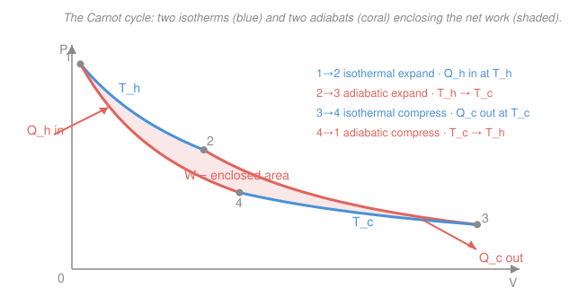

# Classical Thermodynamics · Lesson 2.1: Heat engines, refrigerators & the Carnot cycle

> ⏱ ~15 min · Module 2: Engines, the second law & entropy · Builds on: [1.4 Heat capacities & processes on the P–V diagram](01-04-heat-capacities-pv-processes.md) · Unlocks: [2.2 Carnot efficiency & the second law](02-02-carnot-efficiency-second-law.md)

## Why this matters

The first law says energy is conserved, so you might guess you could take a tank of hot gas and turn *all* of its heat into work. You can't — and the reason is the entire second half of this course. A **heat engine** is any device that skims useful work off heat as it flows "downhill" from hot to cold, and it always leaves some heat un-converted. This lesson builds the engine as a picture (heat in, work out, heat dumped), runs the same machine backwards to get a refrigerator, and then draws the one cycle every real engine is measured against: **Carnot's**. Next lesson proves Carnot's cycle is the best possible; here we just learn to *draw* it and trace its four strokes.

## The idea

Heat naturally flows from hot to cold, the way water flows downhill. A heat engine is a **waterwheel in that stream**: it sits between a hot thing and a cold thing, lets heat pass through, and diverts a fraction of the flow into work (a turning shaft) on the way. Two facts fall right out of the picture. First, you need *both* a hot side and a cold side — a waterwheel does nothing in a flat pond, and an engine does nothing surrounded by uniform temperature. Second, most of the heat still comes out the bottom: whatever you don't capture as work gets dumped to the cold side. That un-captured exhaust is not sloppy engineering — it is *mandatory*, and that mandate is the second law.

A **reservoir** is a body so enormous that dumping heat into it (or pulling heat out) doesn't change its temperature — the ocean as a heat sink, the atmosphere, a huge furnace. It's the thermodynamic version of "infinitely deep pockets": you can transact with it freely and its price (temperature) never moves.

Now run the wheel backwards by *cranking it*: pay in work and you can push heat the wrong way, from cold to hot. That's a **refrigerator** (keeping the cold side cold by pumping its heat out) or a **heat pump** (warming the hot side by scooping heat up from outside). Same machine, same diagram — just every arrow reversed.

## The formal version

**A heat engine, per cycle.** Let $Q_h > 0$ be the heat absorbed from the hot reservoir at temperature $T_h$, and $Q_c > 0$ the heat rejected to the cold reservoir at $T_c$ (both written as positive magnitudes). The working substance returns to its starting state every cycle, so its internal energy is unchanged: $\oint dU = 0$. Since $U$ is a state function its change round any loop is zero, while heat and work are *path* quantities (recall the inexact $\delta Q,\ \delta W$ versus the exact $dU$ from [1.3](01-03-heat-work-first-law.md)). The first law over one cycle therefore reads

$$\oint dU = 0 \quad\Longrightarrow\quad W = Q_h - Q_c.$$

*In words: over a full cycle the gas stores no net energy, so the work it delivers is exactly the heat it took in minus the heat it threw away.* The figure of merit is the **thermal efficiency**

$$\boxed{\;\eta = \frac{W}{Q_h} = \frac{Q_h - Q_c}{Q_h} = 1 - \frac{Q_c}{Q_h}\;}$$

*In words: efficiency is the fraction of the heat you paid for that came out as work.* You'd love $Q_c = 0$ (all heat converted, $\eta = 1$); the second law will forbid it.

**A refrigerator / heat pump.** Reverse every arrow: you supply work $W > 0$, the machine pulls $Q_c$ out of the cold reservoir and delivers $Q_h = Q_c + W$ to the hot one (the first law again, $W = Q_h - Q_c$, unchanged). Efficiency isn't the right scorecard here — you're moving heat, not making work — so we use the **coefficient of performance**:

$$\mathrm{COP}_{\text{fridge}} = \frac{Q_c}{W} \quad(\text{heat removed per unit work}), \qquad \mathrm{COP}_{\text{heat pump}} = \frac{Q_h}{W} \quad(\text{heat delivered per unit work}).$$

*In words: how much heat you shift for each joule of work you pay.* Note $\mathrm{COP}_{\text{heat pump}} = \mathrm{COP}_{\text{fridge}} + 1$, since $Q_h = Q_c + W$, and both can exceed 1 — that's why a heat pump beats a resistive heater for warming a house.

**The Carnot cycle.** The reference engine, built from four **reversible** strokes — reversible meaning *quasi-static* (slow enough to stay in equilibrium at every instant) *and free of dissipation* (no friction, no turbulent heat leak). On the $P$–$V$ diagram they form a closed loop between the two reservoir temperatures:

1. **Isothermal expansion at $T_h$** (state 1→2): gas expands in contact with the hot reservoir, absorbing $Q_h$; $T$ stays at $T_h$ so $\Delta U = 0$ and all the heat becomes work.
2. **Adiabatic expansion** (2→3): gas is insulated and keeps expanding, doing work at the cost of its own internal energy, so it cools $T_h \to T_c$ (no heat exchanged — the adiabat $PV^\gamma=\text{const}$ from [1.4](01-04-heat-capacities-pv-processes.md)).
3. **Isothermal compression at $T_c$** (3→4): now in contact with the cold reservoir, the gas is compressed and rejects $Q_c$ at constant $T_c$.
4. **Adiabatic compression** (4→1): insulated again, compression heats it $T_c \to T_h$, returning it exactly to the start.

Because it's a closed loop, $\oint dU = 0$ and the **enclosed area equals the net work** $W = \oint P\,dV$ (positive because the loop runs clockwise). Two isotherms, two adiabats, one closed area of work.

**Preview (proved next lesson).** For the *reversible* Carnot cycle the heat ratio collapses to a pure temperature ratio, $Q_c/Q_h = T_c/T_h$, giving

$$\eta_{\text{Carnot}} = 1 - \frac{T_c}{T_h}.$$

*In words: the best any engine between $T_h$ and $T_c$ can do depends only on those two temperatures — not on the gas, the size, or the design.* Take this on loan for now; [2.2](02-02-carnot-efficiency-second-law.md) earns it.

## Picture

## Worked examples

**Example 1 (an engine — read off $Q_c$, $\eta$, and power).** A steam engine absorbs $Q_h = 1000\ \mathrm{J}$ of heat from its boiler each cycle and delivers $W = 400\ \mathrm{J}$ of work. What heat does it exhaust, what is its efficiency, and if it runs at 5 cycles per second, what is its power output?

The first law over the cycle gives the exhaust directly:

$$Q_c = Q_h - W = 1000 - 400 = 600\ \mathrm{J}.$$

Efficiency is work-out over heat-in:

$$\eta = \frac{W}{Q_h} = \frac{400}{1000} = 0.40 \quad(40\%).$$

Power is work per cycle times cycles per second: $P = W \cdot f = 400\ \mathrm{J} \times 5\ \mathrm{s^{-1}} = 2000\ \mathrm{W} = 2\ \mathrm{kW}$. Note 600 J of every 1000 J is thrown away — typical, and not fixable by better machining.

**Example 2 (the same box, run backwards — a fridge and a heat pump).** A refrigerator's compressor does $W = 100\ \mathrm{J}$ of work per cycle and thereby extracts $Q_c = 300\ \mathrm{J}$ from the cold interior. How much heat does it dump into the kitchen, and what are its coefficients of performance as a fridge and as a heat pump?

Heat delivered to the hot side (the kitchen) is everything that went in:

$$Q_h = Q_c + W = 300 + 100 = 400\ \mathrm{J}.$$

$$\mathrm{COP}_{\text{fridge}} = \frac{Q_c}{W} = \frac{300}{100} = 3, \qquad \mathrm{COP}_{\text{heat pump}} = \frac{Q_h}{W} = \frac{400}{100} = 4.$$

For every joule of electricity, the machine moves 3 joules out of the cold box — or, viewed as a heat pump, delivers 4 joules of warmth. Both exceed 1 and both obey $\mathrm{COP}_{\text{heat pump}} = \mathrm{COP}_{\text{fridge}} + 1$, exactly because $Q_h = Q_c + W$.

## Watch out

- **You might think efficiency is $W/Q_c$ or $Q_c/Q_h$.** It's $W/Q_h$ — work out divided by the heat you *paid for* (the hot input). $Q_c$ is the exhaust you'd like to shrink; it goes in the numerator only through $W = Q_h - Q_c$.
- **You might expect $Q_c = 0$ is just an engineering goal.** No engine with a single finite $T_h$ and $T_c$ can reach it — some heat *must* be dumped cold. That impossibility is the Kelvin form of the second law ([2.2](02-02-carnot-efficiency-second-law.md)); it's a law of physics, not a tolerance to tighten.
- **You might read "reversible" as "runs in reverse."** Every engine can be cranked backwards; *reversible* is the stricter condition of being quasi-static and dissipation-free, so the reverse retraces the exact same states. Only reversible cycles hit the Carnot bound.
- **You might think a COP above 1 breaks conservation.** It doesn't — COP isn't efficiency. You're not creating energy, you're *relocating* heat, and one joule of work can shove several joules of pre-existing heat across a temperature gap.

## One-liner

> A heat engine skims work $W = Q_h - Q_c$ off heat flowing hot-to-cold with efficiency $\eta = 1 - Q_c/Q_h$; run it backwards and it becomes a fridge — and Carnot's two-isotherm, two-adiabat loop is the yardstick for both.

## Problems

**P1 (🟢)** An engine absorbs $Q_h = 800\ \mathrm{J}$ per cycle from a hot reservoir and rejects $Q_c = 500\ \mathrm{J}$ to a cold one. Find the work $W$ per cycle and the efficiency $\eta$. If it completes 20 cycles per second, what is its power output?

**P2 (🟡)** A heat pump warms a house, delivering $Q_h = 1200\ \mathrm{J}$ to the interior per cycle while consuming $W = 300\ \mathrm{J}$ of electrical work. How much heat $Q_c$ does it pull from the cold outdoors, and what is its coefficient of performance as a heat pump? Compare to a resistive heater, which turns the same 300 J of electricity into 300 J of heat — how much more warmth does the pump deliver per joule?

**P3 (🔴, optional)** A Carnot engine runs between $T_h = 400\ \mathrm{K}$ and $T_c = 300\ \mathrm{K}$. (a) Name which of the four strokes absorbs heat, which rejects heat, and which two exchange no heat at all. (b) Using the preview result, find its efficiency. (c) If it absorbs $Q_h = 1200\ \mathrm{J}$ from the hot reservoir per cycle, how much work does it deliver and how much heat does it reject?

Solutions

**P1** First law over the cycle: $W = Q_h - Q_c = 800 - 500 = 300\ \mathrm{J}$. Efficiency $\eta = W/Q_h = 300/800 = 0.375$ (37.5%). Power is work per cycle times cycle rate: $P = W f = 300\ \mathrm{J} \times 20\ \mathrm{s^{-1}} = 6000\ \mathrm{W} = 6\ \mathrm{kW}$.

*Check.* $\eta = 1 - Q_c/Q_h = 1 - 500/800 = 1 - 0.625 = 0.375$ ✓ (agrees with $W/Q_h$). Units: $\mathrm{J}\cdot\mathrm{s^{-1}} = \mathrm{W}$ ✓, and $\eta$ is a pure fraction between 0 and 1 ✓.

**P2** The work adds to the heat scooped from outside to make the delivered heat: $Q_h = Q_c + W \Rightarrow Q_c = Q_h - W = 1200 - 300 = 900\ \mathrm{J}$. Coefficient of performance as a heat pump: $\mathrm{COP} = Q_h/W = 1200/300 = 4$. So each joule of electricity delivers 4 joules of warmth, versus 1 joule for the resistive heater — the pump delivers **4× as much heat per joule** (because 3 of those 4 joules are pumped up from outside, not paid for).

*Check.* Energy balances: $Q_c + W = 900 + 300 = 1200 = Q_h$ ✓. As a fridge the same machine would have $\mathrm{COP}_{\text{fridge}} = Q_c/W = 900/300 = 3 = 4 - 1$ ✓.

**P3** (a) Stroke 1→2, **isothermal expansion at $T_h$**, absorbs $Q_h$. Stroke 3→4, **isothermal compression at $T_c$**, rejects $Q_c$. The two **adiabatic** strokes (2→3 and 4→1) exchange *no* heat — they only convert between internal energy and work, sliding the gas between $T_h$ and $T_c$.

(b) $\eta_{\text{Carnot}} = 1 - T_c/T_h = 1 - 300/400 = 1 - 0.75 = 0.25$ (25%).

(c) $W = \eta\, Q_h = 0.25 \times 1200 = 300\ \mathrm{J}$, and $Q_c = Q_h - W = 1200 - 300 = 900\ \mathrm{J}$.

*Check.* The reversible ratio must hold: $Q_c/Q_h = 900/1200 = 0.75 = T_c/T_h = 300/400$ ✓. Limiting sense: if $T_c \to 0$ then $\eta \to 1$, and if $T_c \to T_h$ then $\eta \to 0$ (no temperature gap, no work) — both correct. ✓

## Flashback

**From Lesson 1.4 (Heat capacities & processes on the P–V diagram):** An ideal monatomic gas ($\gamma = 5/3$) starts at $T_1 = 300\ \mathrm{K}$ and is compressed *adiabatically* to one-eighth of its original volume. Find its final temperature. (This is exactly Carnot's stroke 4→1 in miniature — an insulated compression that heats the gas.)

Solution

Along an adiabat, $PV^\gamma = \text{const}$; combined with $PV = nRT$ this gives the temperature form $TV^{\gamma - 1} = \text{const}$. Hence

$$T_2 = T_1\left(\frac{V_1}{V_2}\right)^{\gamma - 1} = 300 \times 8^{\,2/3} = 300 \times \left(8^{1/3}\right)^2 = 300 \times 2^2 = 300 \times 4 = 1200\ \mathrm{K}.$$

*Check.* Compression ($V$ down) with no heat escaping should *raise* $T$ — and $1200 > 300$ ✓. Exponent: $\gamma - 1 = 5/3 - 1 = 2/3$ ✓, and $8^{2/3} = 4$ exactly. Physically this is why the adiabatic strokes of a Carnot cycle can bridge a large temperature gap with no reservoir contact at all.

## Connections

- **Backward:** the two adiabatic strokes are the $PV^\gamma = \text{const}$ process from [1.4](01-04-heat-capacities-pv-processes.md), and the whole $W = Q_h - Q_c$ balance is just the first law $dU = \delta Q - \delta W$ from [1.3](01-03-heat-work-first-law.md) applied around a closed loop where $\oint dU = 0$.
- **Forward:** [2.2](02-02-carnot-efficiency-second-law.md) proves the previewed $\eta = 1 - T_c/T_h$ and shows *no* engine beats it — turning it into the second law; [2.3 Entropy](02-03-entropy.md) then upgrades the reversible ratio $Q_c/Q_h = T_c/T_h$ into the definition $dS = \delta Q_{\text{rev}}/T$.
- **Sideways (engineering thermodynamics):** the Otto, Diesel, Rankine, and Brayton cycles in [engineering-thermodynamics](../../engineering-thermodynamics/syllabus.md) are all just different closed loops on this same $P$–$V$ diagram, each judged by how close its efficiency comes to the Carnot bound between its temperature limits.
