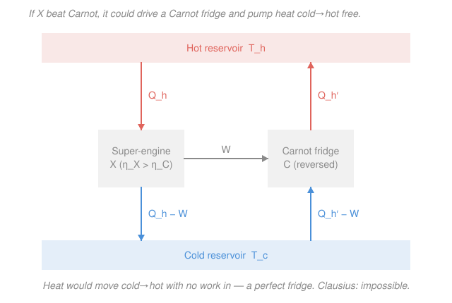

# Classical Thermodynamics · Lesson 2.2: Carnot efficiency & the second law

> ⏱ ~15 min · Module 2: Engines, the second law & entropy · Builds on: [2.1 Heat engines, refrigerators & the Carnot cycle](02-01-heat-engines-carnot-cycle.md) · Unlocks: [2.3 Entropy](02-03-entropy.md)

## Why this matters

The first law says energy is conserved, so it *permits* an engine that turns a bucket of heat entirely into work — nothing is created. Yet no such engine has ever run. The second law is the physics of that gap: some energy-conserving processes simply never happen. In this lesson we pin down exactly how good an engine *can* be, prove the famous bound $\eta \le 1 - T_c/T_h$, and discover that it's so fundamental it ends up **defining the temperature scale itself**. Everything downstream — entropy, free energies, why your phone warms up — hangs off this one inequality.

## The idea

Two everyday impossibilities, both obvious once you say them out loud:

- **You can't build a perfect engine.** Drop a hot stone in the ocean and you can't recover *all* that heat as useful work — some always leaks away as low-grade warmth. Heat converts to work only when it *flows downhill*, from hot to cold, and you skim off a cut on the way.
- **You can't build a perfect fridge.** Heat won't crawl from cold to hot on its own. Your kitchen fridge *does* move heat uphill, but only because it's plugged in — you pay with work. Unplug it and the flow reverses.

These sound like two different facts. The stunning claim of this lesson is that they are the **same fact wearing two hats**: if you could violate one, you could rig up a machine that violates the other. And from that single principle follows a hard ceiling on every engine ever built — a ceiling set purely by the two temperatures it runs between, nothing else.

## The formal version

**Two statements of the second law.** Both forbid a "with no other effect" free lunch — meaning the machine returns to its start each cycle (it's *cyclic*) and leaves nothing else changed.

> **Kelvin–Planck:** No cyclic process can convert heat *entirely* into work with no other effect. *In words: there is no perfect engine — you can't take heat from one reservoir and turn all of it into work.*

> **Clausius:** No cyclic process can transfer heat from a colder body to a hotter body with no other effect. *In words: there is no perfect fridge — heat won't move uphill for free.*

**Kelvin ⟺ Clausius.** They are logically equivalent; we show each violation manufactures the other. (Recall an engine takes $Q_h$ from hot, does work $W$, dumps $Q_c$ to cold with $Q_h = W + Q_c$; a fridge is that run backward.)

- **Violate Kelvin ⟹ violate Clausius.** Suppose a perfect engine exists: it draws $Q$ from the hot reservoir and produces work $W = Q$, dumping nothing. Feed that work into an ordinary fridge, which uses $W$ to pull $Q_c$ from the cold reservoir and deliver $Q_c + W$ to the hot one. Tally the hot reservoir: it *loses* $Q = W$ to the engine but *gains* $Q_c + W$ from the fridge — net gain $Q_c$. The cold reservoir simply lost $Q_c$. Combined, with zero net work, heat $Q_c$ moved cold → hot. That's a perfect fridge — Clausius violated.
- **Violate Clausius ⟹ violate Kelvin.** Suppose a perfect fridge exists: it moves $Q_c$ from cold to hot with no work. Run an ordinary engine that takes $Q_h$ from hot, does work $W$, and dumps exactly $Q_c$ to cold. Now the cold reservoir gains $Q_c$ (from the engine) and loses $Q_c$ (to the fridge): net zero — the cold reservoir is untouched. The only net effect is $Q_h - Q_c = W$ of heat drawn from the hot reservoir alone, converted entirely to work. That's a perfect engine — Kelvin violated.

Each statement props up the other; deny one and the other collapses. They are one law.

**Carnot's theorem.** This is where the bound comes from.

> **(a)** No engine operating between two reservoirs can be more efficient than a reversible (Carnot) engine running between the same two. **(b)** All reversible engines between the same two reservoirs have the *same* efficiency. *In words: reversibility is the gold standard, every reversible engine hits it, and nothing beats it.*

*Proof of (a) by contradiction.* Suppose some engine $X$ beats a Carnot engine: $\eta_X > \eta_C$. A Carnot engine is **reversible**, so we can run it backward as a fridge. Arrange $X$ to produce exactly the work $W$ that the Carnot fridge $C$ needs. Because $X$ is more efficient, it extracts *less* heat from the hot reservoir to make that same $W$ than $C$ delivers back to the hot reservoir: $Q_h^X < Q_h^C$ (higher $\eta = W/Q_h$ means smaller $Q_h$ for fixed $W$). Combine the two into one machine (see figure). Net heat given to the hot reservoir is $Q_h^C - Q_h^X > 0$; by energy conservation the same amount is pulled from the cold reservoir; and the works cancel, so no net work is done. The pair is a **perfect fridge** — Clausius violated. Contradiction. Hence $\eta_X \le \eta_C$.

*Proof of (b).* Take two reversible engines and run the argument in *both* directions (either can play the fridge). Direction one gives $\eta_1 \le \eta_2$; direction two gives $\eta_2 \le \eta_1$. Together $\eta_1 = \eta_2$. So every reversible engine shares one efficiency — a number that can depend on *nothing but the two temperatures*, since we never used any detail of the working substance.

**Computing the Carnot efficiency (ideal gas).** Since the number is substance-independent, compute it with the easiest substance — an ideal gas around the four-stroke Carnot cycle from [2.1](02-01-heat-engines-carnot-cycle.md). Label the corners so the isotherms are $1\to2$ (hot, expansion) and $3\to4$ (cold, compression).

On an isotherm $\Delta U = 0$ (ideal-gas $U$ depends on $T$ alone), so the first law gives $\delta Q = \delta W = P\,dV$, and with $P = nRT/V$:

$$Q_h = \int_{V_1}^{V_2} \frac{nRT_h}{V}\,dV = nRT_h \ln\!\frac{V_2}{V_1}, \qquad Q_c = nRT_c \ln\!\frac{V_3}{V_4},$$

where $Q_c$ is the heat *released* to the cold reservoir during compression ($V_3 > V_4$, so it's positive). Now the two **adiabatic** strokes ($2\to3$ and $4\to1$) obey $TV^{\gamma-1} = \text{const}$ (from [1.4](01-04-heat-capacities-pv-processes.md)):

$$T_h V_2^{\gamma-1} = T_c V_3^{\gamma-1}, \qquad T_h V_1^{\gamma-1} = T_c V_4^{\gamma-1}.$$

Divide the first by the second: $\left(V_2/V_1\right)^{\gamma-1} = \left(V_3/V_4\right)^{\gamma-1}$, hence the two log-ratios are **equal**, $V_2/V_1 = V_3/V_4$. The logs cancel in the ratio:

$$\frac{Q_c}{Q_h} = \frac{T_c \ln(V_3/V_4)}{T_h \ln(V_2/V_1)} = \frac{T_c}{T_h}.$$

Therefore

$$\boxed{\ \eta_{\text{Carnot}} = 1 - \frac{Q_c}{Q_h} = 1 - \frac{T_c}{T_h}\ }$$

with $T$ in kelvin. *In words: the best possible efficiency is set entirely by the ratio of the two absolute temperatures — no engineering, no clever fluid, changes it.* Two consequences worth carving in stone:

- **This defines absolute temperature.** Because $Q_c/Q_h = T_c/T_h$ holds for *any* reversible engine regardless of substance, we can turn it around and *define* the ratio of two temperatures as the ratio of heats a reversible engine exchanges with them. That's the **thermodynamic (Kelvin) temperature scale** — no thermometer fluid required.
- **Real engines do worse.** Any friction, any finite-rate (irreversible) step drops you strictly below: $\eta_{\text{real}} < 1 - T_c/T_h$. The bound is a wall you approach but never touch.

## Picture

## Worked examples

**Example 1 (the bound in numbers).** A power plant runs between a boiler at $T_h = 600\ \text{K}$ and a river at $T_c = 300\ \text{K}$. The best it can do is

$$\eta_{\text{Carnot}} = 1 - \frac{300}{600} = 0.50.$$

So at most half the fuel's heat becomes electricity; the other half *must* go to the river — not from bad engineering but from the second law. If a vendor claims 60%, they're claiming $\eta > \eta_{\text{Carnot}}$, i.e. a machine that (by Carnot's theorem) could be wired into a Clausius-violating perfect fridge. Impossible — walk away.

**Example 2 (why the cold side matters more).** Suppose you can spend a fixed budget to shift *one* reservoir by $10\ \text{K}$, starting from $T_h = 400\ \text{K}$, $T_c = 300\ \text{K}$ (base $\eta = 1 - 300/400 = 0.250$).

- Raise the hot side to $410\ \text{K}$: $\eta = 1 - 300/410 = 0.268$.
- Lower the cold side to $290\ \text{K}$: $\eta = 1 - 290/400 = 0.275$.

Lowering $T_c$ wins. The reason is in the derivatives of $\eta = 1 - T_c/T_h$: $\partial\eta/\partial T_c = -1/T_h$ while $\partial\eta/\partial T_h = +T_c/T_h^2$. Their size ratio is $T_h/T_c > 1$, so a kelvin off the cold reservoir always buys more efficiency than a kelvin onto the hot one. This is why real plants obsess over cold-side condenser temperature.

## Watch out

- **You might think Kelvin and Clausius are separate assumptions.** They're not — they're logically equivalent, and the "violate one, build the other" chain proves it. State either one and you've stated the whole second law.
- **You might forget the temperatures must be in kelvin.** $\eta = 1 - T_c/T_h$ is a ratio of *absolute* temperatures. Plug in Celsius and you'll get nonsense (even a negative "efficiency"). Convert first.
- **You might read $\eta = 1 - T_c/T_h$ as a promise, not a ceiling.** It's the *maximum*, achieved only by a perfectly reversible (infinitely slow, frictionless) engine. Every real engine, running at finite speed, lands strictly below it.
- **"With no other effect" is the load-bearing phrase.** A fridge *does* move heat cold→hot — that's allowed, because it leaves an *other effect*: it consumed work. The second law forbids only the version with the books left perfectly clean.

## One-liner

> No engine beats $1 - T_c/T_h$, because one that did could be run backward into a perfect fridge — and "no perfect fridge" (Clausius) is the same law as "no perfect engine" (Kelvin).

## Problems

**P1 (🟢)** A Carnot engine operates between $T_h = 500\ \text{K}$ and $T_c = 300\ \text{K}$ and draws $1{,}000\ \text{J}$ of heat from the hot reservoir each cycle. Find its efficiency, the work it produces, and the heat it dumps to the cold reservoir.

**P2 (🟡)** An inventor advertises an engine that takes in $2{,}000\ \text{J}$ per cycle from a $450\ \text{K}$ source, delivers $900\ \text{J}$ of work, and exhausts the rest to a $300\ \text{K}$ sink. Is this possible? Decide with a second-law check, and if it's impossible say which statement it would violate.

**P3 (🔴, optional)** You run a Carnot engine between $T_h$ and $T_c$, then want to boost its efficiency by $\Delta T$ of "temperature improvement." Show from $\eta = 1 - T_c/T_h$ that spending it *entirely on lowering $T_c$* beats spending it *entirely on raising $T_h$*, for any $T_h > T_c$. (Compare the two efficiency gains to first order in $\Delta T$.)

Solutions

**P1** Efficiency depends only on the temperatures:

$$\eta = 1 - \frac{T_c}{T_h} = 1 - \frac{300}{500} = 0.40.$$

Work is $W = \eta\, Q_h = 0.40 \times 1{,}000 = 400\ \text{J}$. Heat dumped is $Q_c = Q_h - W = 1{,}000 - 400 = 600\ \text{J}$ (or directly $Q_c = Q_h\, T_c/T_h = 1{,}000 \times 300/500 = 600\ \text{J}$).

*Check.* $Q_c/Q_h = 600/1000 = 0.6 = T_c/T_h$ ✓, and energy balances: $W + Q_c = 400 + 600 = 1{,}000 = Q_h$ ✓. (This is Boss-problem-2 part (a) with $Q_h$ scaled.)

**P2** The claimed efficiency is $\eta_{\text{claim}} = W/Q_h = 900/2000 = 0.45$. The Carnot ceiling for these reservoirs is

$$\eta_{\text{Carnot}} = 1 - \frac{300}{450} = 1 - 0.667 = 0.333.$$

Since $0.45 > 0.333$, the engine claims to beat Carnot — **impossible**. By Carnot's theorem such an engine could drive a reversed Carnot engine to pump heat cold→hot with no net work, so it violates the **Clausius** statement (equivalently Kelvin). The inventor is selling a second-law violation.

*Check.* The first law alone is *satisfied* ($Q_c = 2000 - 900 = 1100 > 0$, energy conserved), which is exactly the point: the first law permits this engine; only the second law forbids it. ✓

**P3** Start from $\eta = 1 - T_c/T_h$. Lowering $T_c$ by $\Delta T$ (to $T_c - \Delta T$):

$$\eta_{\text{cold}} = 1 - \frac{T_c - \Delta T}{T_h} = \eta + \frac{\Delta T}{T_h}, \qquad \text{gain } = \frac{\Delta T}{T_h}.$$

Raising $T_h$ by $\Delta T$ (to $T_h + \Delta T$), expanding to first order in the small quantity $\Delta T/T_h$:

$$\eta_{\text{hot}} = 1 - \frac{T_c}{T_h + \Delta T} = 1 - \frac{T_c}{T_h}\left(1 + \frac{\Delta T}{T_h}\right)^{-1} \approx \eta + \frac{T_c}{T_h^2}\,\Delta T, \qquad \text{gain } \approx \frac{T_c}{T_h^2}\,\Delta T.$$

Compare the two gains:

$$\frac{\text{cold gain}}{\text{hot gain}} = \frac{\Delta T / T_h}{T_c\,\Delta T / T_h^2} = \frac{T_h}{T_c} > 1 \quad\text{since } T_h > T_c.$$

So lowering $T_c$ always yields the larger efficiency boost.

*Check.* Numbers from Example 2 ($T_h=400$, $T_c=300$, $\Delta T = 10$): cold gain $=10/400 = 0.025$, hot gain $\approx 300\times10/400^2 = 0.0188$; ratio $\approx 1.33 = 400/300 = T_h/T_c$ ✓, matching the exact $0.275$ vs $0.268$ found earlier.

## Flashback

**From Lesson 2.1 (Heat engines, refrigerators & the Carnot cycle):** A (non-Carnot) heat engine absorbs $Q_h = 800\ \text{J}$ from its hot reservoir and rejects $Q_c = 500\ \text{J}$ to its cold reservoir each cycle. Find its efficiency and the work it does per cycle. (Fresh variant — the efficiency definition, no temperatures given.)

Solution

Efficiency is work out over heat in, and by the first law over a cycle $W = Q_h - Q_c$:

$$W = Q_h - Q_c = 800 - 500 = 300\ \text{J}, \qquad \eta = \frac{W}{Q_h} = \frac{300}{800} = 0.375.$$

*Check.* Equivalently $\eta = 1 - Q_c/Q_h = 1 - 500/800 = 0.375$ ✓. This is the *general* engine efficiency from heats — the Carnot formula $1 - T_c/T_h$ of this lesson is the special case where $Q_c/Q_h$ collapses to $T_c/T_h$ for a reversible engine.

## Connections

- **Backward:** the efficiency computation runs straight on the Carnot cycle of [2.1](02-01-heat-engines-carnot-cycle.md), using the isothermal work $\int P\,dV = nRT\ln(V_f/V_i)$ and the adiabat relation $TV^{\gamma-1} = \text{const}$ from [1.4](01-04-heat-capacities-pv-processes.md). Without those two ingredients the logs wouldn't cancel.
- **Forward:** the ratio $Q_c/Q_h = T_c/T_h$ rearranges to $Q_h/T_h = Q_c/T_c$ — a hint that $Q/T$ is the conserved bookkeeping quantity for reversible cycles. [2.3 Entropy](02-03-entropy.md) promotes exactly this into the state function $dS = \delta Q_{\text{rev}}/T$ and turns the second-law *inequality* into an equation.
- **Sideways (measurement & stat-mech):** because $\eta_{\text{Carnot}}$ is substance-free, it *defines* the absolute temperature scale — a rare case where a piece of physics fixes a unit. Later, [stat-mech](../../stat-mech/syllabus.md) will explain *why* the impossibilities hold, deriving the second law from counting microstates instead of postulating it.
