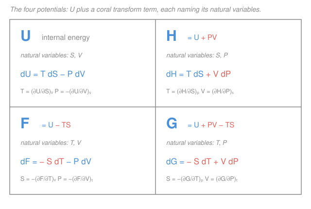

# Classical Thermodynamics · Lesson 3.1: The four thermodynamic potentials

> ⏱ ~15 min · Module 3: Potentials, Maxwell relations & phase transitions · Builds on: [2.3 Entropy](02-03-entropy.md) · Unlocks: [3.2 The Maxwell relations](03-02-maxwell-relations.md)

## Why this matters

The first law tracks energy; the second law tracks entropy. Combine them and you get a single master equation for the internal energy — but it comes wired to the variables $S$ and $V$, which are exactly the two things a lab rarely controls. You clamp a thermostat ($T$ fixed), you work at atmospheric pressure ($P$ fixed). So we rebuild the energy bookkeeping four times over, each version tuned to a different pair of held-fixed variables. The reward is enormous: pick the potential whose *natural variables* match your experiment, and equilibrium becomes a simple "roll downhill to the minimum." This is where thermodynamics stops describing and starts *predicting* — which phase forms, which reaction runs, how much work you can extract.

## The idea

Start with a fact you already have from the first and second laws: for a reversible change, heat is $\delta Q = T\,dS$ and work done *by* the gas is $\delta W = P\,dV$. Feed both into the first law $dU = \delta Q - \delta W$ and you get

$$dU = T\,dS - P\,dV.$$

Read it as a recipe: to change the internal energy, you either dump in entropy (heat) or let it push out its walls (work). The energy "wants" to be described by $S$ and $V$ — they are its **natural variables**.

But here's the practical snag. Entropy has no dial. You cannot walk into a lab and "set $S = 5$." What you *can* set is temperature — its conjugate partner, the slope $T = (\partial U/\partial S)_V$. The trick to swap a variable for its slope is a **Legendre transform**, and it is the very same move that carries you from the Lagrangian (a function of velocity $\dot q$) to the Hamiltonian (a function of momentum $p = \partial L/\partial \dot q$) in mechanics. Same machine, new subject.

Apply it in the two possible directions — trade $S\to T$, trade $V\to P$, or both — and you manufacture four energies, one for each pair of variables you might hold fixed. That's the whole lesson: **choose the potential whose natural variables are the ones your setup nails down.**

## The formal version

**The fundamental relation.** For a simple compressible system,

$$\boxed{\,dU = T\,dS - P\,dV\,}, \qquad U = U(S,V).$$

*In words: the internal energy's own currency is entropy and volume.* From the differential you read the first derivatives straight off the coefficients:

$$T = \left(\frac{\partial U}{\partial S}\right)_V, \qquad P = -\left(\frac{\partial U}{\partial V}\right)_S.$$

*In words: temperature is how fast energy rises when you add entropy at fixed volume; pressure is how fast it falls when you expand at fixed entropy.*

**The Legendre transform.** To replace an independent variable by its conjugate slope, subtract off (or add) the product "slope $\times$ variable." Trading $V$ (slope $-P$) for $P$ means adding $PV$; trading $S$ (slope $T$) for $T$ means subtracting $TS$. Each swap turns a differential term $(\text{slope})\,d(\text{variable})$ into the opposite $-(\text{variable})\,d(\text{slope})$, courtesy of the product rule $d(PV) = P\,dV + V\,dP$. Doing this gives the other three potentials:

**Enthalpy** $H \equiv U + PV$, natural variables $(S,P)$:
$$dH = dU + d(PV) = (T\,dS - P\,dV) + (P\,dV + V\,dP) = T\,dS + V\,dP.$$
$$T = \left(\frac{\partial H}{\partial S}\right)_P, \qquad V = \left(\frac{\partial H}{\partial P}\right)_S.$$

**Helmholtz free energy** $F \equiv U - TS$, natural variables $(T,V)$:
$$dF = dU - d(TS) = (T\,dS - P\,dV) - (T\,dS + S\,dT) = -S\,dT - P\,dV.$$
$$S = -\left(\frac{\partial F}{\partial T}\right)_V, \qquad P = -\left(\frac{\partial F}{\partial V}\right)_T.$$

**Gibbs free energy** $G \equiv H - TS = U + PV - TS$, natural variables $(T,P)$:
$$dG = -S\,dT + V\,dP.$$
$$S = -\left(\frac{\partial G}{\partial T}\right)_P, \qquad V = \left(\frac{\partial G}{\partial P}\right)_T.$$

*In words: each potential is the internal energy with a "$\pm(\text{slope}\times\text{variable})$" correction bolted on, and its differential tells you exactly which two variables it likes to be a function of.* The pattern to memorize: whichever variable you traded away disappears from the differential, replaced by its conjugate.

**The extremum principles (the payoff).** The second law says the *universe's* entropy never decreases: $\Delta S_\text{univ} \ge 0$. Take a system in thermal contact with a big reservoir at temperature $T$. The reservoir's entropy change is $\Delta S_\text{res} = -Q/T$ (it loses the heat the system gains), so

$$\Delta S_\text{univ} = \Delta S_\text{sys} - \frac{Q}{T} \ge 0 \;\Longrightarrow\; Q \le T\,\Delta S_\text{sys}.$$

Combine with the first law $Q = \Delta U + W$ and specialize:

- **Fixed $T$ and $V$** (no work, $W=0$): the inequality becomes $\Delta U - T\,\Delta S \le 0$, i.e. $\Delta F \le 0$. *In words: at fixed temperature and volume, $F$ can only fall — equilibrium **minimizes** $F$.*
- **Fixed $T$ and $P$** (work is $P\,\Delta V$): it becomes $\Delta U + P\,\Delta V - T\,\Delta S \le 0$, i.e. $\Delta G \le 0$. *In words: at fixed temperature and pressure, equilibrium **minimizes** $G$.*

These are the thermodynamic analogues of a ball rolling to the bottom of a potential well — hence the name *potentials*.

**Three physical readings to keep.**
- $H$ **is heat at constant pressure.** At fixed $P$, $dH = T\,dS = \delta Q$, so $Q_P = \Delta H$. Reaction enthalpies are just heats measured in an open beaker.
- $F$ **is the maximum extractable work at constant $T$.** The "free" in free energy: $-\Delta F$ is the most work you can get out of an isothermal process (the rest of $U$ is locked up as $TS$).
- $G$ **is the chemistry and phase potential.** At the $(T,P)$ conditions of most bench chemistry and phase coexistence, spontaneity means $\Delta G \le 0$, and equilibrium sits at the minimum of $G$. Lesson [3.3](03-03-phase-transitions-clausius-clapeyron.md) runs entirely on this.

## Picture

## Worked examples

**Example 1 (mechanical — build a potential from scratch).** Derive $dG$ from the definition $G = U + PV - TS$, assuming only the fundamental relation $dU = T\,dS - P\,dV$.

Differentiate term by term, using the product rule on both $PV$ and $TS$:

$$dG = dU + \underbrace{(P\,dV + V\,dP)}_{d(PV)} - \underbrace{(T\,dS + S\,dT)}_{d(TS)}.$$

Substitute $dU = T\,dS - P\,dV$:

$$dG = (T\,dS - P\,dV) + P\,dV + V\,dP - T\,dS - S\,dT.$$

The $T\,dS$ terms cancel and the $P\,dV$ terms cancel, leaving

$$dG = V\,dP - S\,dT = -S\,dT + V\,dP.$$

So $G$'s natural variables are $(T,P)$ — precisely the two you fix in a beaker at room conditions. Reading off the coefficient of $dP$: $V = (\partial G/\partial P)_T$.

**Example 2 (why you'd care — enthalpy as heat).** Show that the heat absorbed at constant pressure equals $\Delta H$, and use it to interpret a reaction.

At constant pressure, $dP = 0$, so the enthalpy differential collapses:

$$dH = T\,dS + V\,dP \;\xrightarrow{\,dP=0\,}\; dH = T\,dS = \delta Q_\text{rev}.$$

Integrating, $Q_P = \Delta H$. So when a combustion reaction in an open flask releases 500 kJ of heat, that number *is* $\Delta H = -500$ kJ (negative because energy leaves the system — the reaction is **exothermic**). No work bookkeeping needed: at constant $P$, the $P\,dV$ work of pushing back the atmosphere is already folded into $H$. This is exactly why chemists tabulate enthalpies of formation rather than internal energies — the lab runs at constant pressure, not constant volume.

## Watch out

- **You might think a potential is "the" energy of the system.** It isn't — $F$ and $G$ are *bookkeeping* energies that already have the reservoir's entropy cost ($-TS$) or the atmosphere's work ($+PV$) subtracted in. Only $U$ is the raw internal energy; the others are engineered to make a *minimum principle* work under specific constraints.
- **You might mix up which pair is held fixed.** The rule is airtight: a potential's natural variables are the ones held constant in the process it governs. $F$ for isothermal-isochoric $(T,V)$, $G$ for isothermal-isobaric $(T,P)$. Use the wrong potential and the "minimize" statement is simply false.
- **You might drop a sign in the Legendre transform.** Trading $V$ for $P$ *adds* $PV$ (since $P = -\partial U/\partial V$ carries a minus); trading $S$ for $T$ *subtracts* $TS$. Get the sign wrong and $S$ comes out negative — a quick sanity check on any potential you build.

## One-liner

> Each potential is the internal energy Legendre-transformed to speak your experiment's language — hold its natural variables fixed and equilibrium is just its minimum.

## Problems

**P1 (🟢)** Derive $dH$ from $H = U + PV$ and the fundamental relation $dU = T\,dS - P\,dV$. Then read off both first derivatives, $(\partial H/\partial S)_P$ and $(\partial H/\partial P)_S$.

**P2 (🟡)** A biochemical reaction runs in a sealed, rigid, temperature-controlled vessel. Which of the four potentials is minimized at equilibrium, and why? What if the vessel were instead an open dish on the bench?

**P3 (🔴, optional)** Starting from $dF = -S\,dT - P\,dV$, suppose an ideal gas has Helmholtz free energy $F(T,V) = -nRT\left[\ln V + f(T)\right]$ for some function $f(T)$. Recover the pressure $P$ as a function of $T$ and $V$, and identify the result.

Solutions

**P1** Differentiate $H = U + PV$ with the product rule:

$$dH = dU + d(PV) = dU + P\,dV + V\,dP.$$

Substitute $dU = T\,dS - P\,dV$:

$$dH = (T\,dS - P\,dV) + P\,dV + V\,dP = T\,dS + V\,dP.$$

The $P\,dV$ terms cancel, confirming $H = H(S,P)$. Matching coefficients:

$$\left(\frac{\partial H}{\partial S}\right)_P = T, \qquad \left(\frac{\partial H}{\partial P}\right)_S = V.$$

*Check.* The coefficient of $dS$ must carry units of temperature (energy per unit entropy, J per J/K $=$ K ✓), and the coefficient of $dP$ must carry units of volume (energy per pressure, J per Pa $=$ m³ ✓). Signs: both terms are positive, matching the row for $H$ on the reference card.

**P2** Sealed and rigid means the **volume** is fixed; temperature-controlled means **temperature** is fixed. The held-fixed pair is $(T,V)$, so the governing potential is the **Helmholtz free energy $F$** — equilibrium minimizes $F$. The reasoning: with the vessel exchanging heat (but no work, since $V$ is fixed) with a thermostat at $T$, the second law $\Delta S_\text{univ}\ge 0$ rewrites to $\Delta F \le 0$, so $F$ falls until it can fall no further.

Open dish on the bench: volume is *not* fixed (the mixture can expand against the atmosphere) but **pressure** is — it's atmospheric — and temperature is still set by the room. The pair is $(T,P)$, so now the **Gibbs free energy $G$** is minimized. This is the usual case for wet chemistry, which is why $\Delta G$ is the spontaneity criterion you meet in a chemistry class.

*Check.* In both cases the fixed variables are exactly the natural variables of the chosen potential — the defining test. Sealed/rigid $\to (T,V)\to F$; open/isobaric $\to (T,P)\to G$. ✓

**P3** From the differential, the pressure is the derivative with respect to volume at fixed temperature:

$$P = -\left(\frac{\partial F}{\partial V}\right)_T.$$

Differentiate $F = -nRT[\ln V + f(T)]$ with respect to $V$ (treating $T$, and hence $f(T)$, as constant):

$$\left(\frac{\partial F}{\partial V}\right)_T = -nRT\cdot\frac{1}{V},$$

so

$$P = -\left(-\frac{nRT}{V}\right) = \frac{nRT}{V}.$$

That is $PV = nRT$ — the **ideal gas law**, recovered from the free energy alone.

*Check.* The unknown $f(T)$ dropped out entirely (it has no $V$-dependence), so it cannot affect the pressure — consistent with $f(T)$ encoding only the temperature-dependent, volume-independent part of $F$. Units: $nRT/V$ has (mol)(J mol⁻¹K⁻¹)(K)/m³ $=$ J/m³ $=$ Pa ✓.

## Flashback

**From Lesson 2.3 (Entropy):** One mole of an ideal gas expands isothermally and reversibly at $T = 300$ K from volume $V_1$ to $V_2 = 2V_1$. Find the entropy change of the gas. (Fresh variant — a doubling, computed from the reversible-heat definition.)

Solution

Isothermal means $\Delta U = 0$ for an ideal gas (internal energy depends only on $T$), so by the first law all the heat absorbed goes into work: $\delta Q = \delta W = P\,dV$. With $P = nRT/V$,

$$\Delta S = \int \frac{\delta Q_\text{rev}}{T} = \int_{V_1}^{V_2} \frac{P}{T}\,dV = \int_{V_1}^{V_2} \frac{nR}{V}\,dV = nR\ln\frac{V_2}{V_1}.$$

For $n = 1$ mol and $V_2/V_1 = 2$:

$$\Delta S = R\ln 2 = (8.314)(0.693) \approx 5.76\ \mathrm{J/K}.$$

*Check.* The gas expands, so it has more places to be — entropy should *increase*, and $\ln 2 > 0$ gives $\Delta S > 0$ ✓. Note $T$ cancelled out of the final expression: for an isothermal ideal-gas expansion, $\Delta S$ depends only on the volume ratio, not the temperature. ✓

## Connections

- **Backward:** the fundamental relation $dU = T\,dS - P\,dV$ is just the first law $dU = \delta Q - \delta W$ with $\delta Q = T\,dS$ from [2.3 Entropy](02-03-entropy.md) and $\delta W = P\,dV$ from [1.3 Heat, work, and the first law](01-03-heat-work-first-law.md) — the whole module is built on those two substitutions.
- **Forward:** [3.2 The Maxwell relations](03-02-maxwell-relations.md) applies equality of mixed second partials ($\partial^2 U/\partial S\,\partial V = \partial^2 U/\partial V\,\partial S$) to each of these four differentials, generating four "hidden" identities among $T,S,P,V$; and [3.3 Phase transitions](03-03-phase-transitions-clausius-clapeyron.md) runs on minimizing $G$ at fixed $(T,P)$.
- **Sideways (analytical mechanics):** the Legendre transform that swaps $S\leftrightarrow T$ and $V\leftrightarrow P$ here is the identical operation that swaps velocity $\dot q$ for momentum $p = \partial L/\partial\dot q$ when passing from the Lagrangian to the Hamiltonian — see the [`analytical-mechanics` syllabus](../../analytical-mechanics/syllabus.md). Recognizing it as *one* mathematical tool, not two, is the payoff of seeing both subjects.
