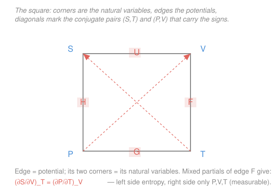

# Classical Thermodynamics · Lesson 3.2: The Maxwell relations

> ⏱ ~15 min · Module 3: Potentials, Maxwell relations & phase transitions · Builds on: [3.1 The four thermodynamic potentials](03-01-thermodynamic-potentials.md) · Unlocks: [3.3 Phase transitions & Clausius–Clapeyron](03-03-phase-transitions-clausius-clapeyron.md)

## Why this matters

Some thermodynamic quantities you can put a meter on — pressure, volume, temperature. Others you cannot: nobody owns an "entropy gauge." Yet the quantities you actually want (how much heat a process needs, how internal energy changes when a gas expands) are riddled with entropy derivatives like $(\partial S/\partial V)_T$. The **Maxwell relations** are four small identities that let you rewrite every such entropy derivative as a combination of $P$, $V$, and $T$ derivatives you *can* measure on a bench. They are the single most useful piece of manipulation in all of thermodynamics, and they fall out of one fact from calculus you already know: mixed partial derivatives commute.

## The idea

Here is the whole trick in one breath. A state function — $U$, $H$, $F$, $G$ — has a definite value at each point of the equilibrium surface. So its graph is a genuine surface, smooth, no creases. On any smooth surface it doesn't matter whether you walk *east then north* or *north then east*: you arrive at the same height, and the two ways of measuring the slope-of-the-slope agree. That's it. "The cross-slopes agree" is the engine. Every Maxwell relation is that statement wearing thermodynamic clothing.

The payoff is a swap of the unmeasurable for the measurable. Take a potential's differential, say $dF = -S\,dT - P\,dV$. The coefficient of $dT$ is $-S$ (entropy — hard) and the coefficient of $dV$ is $-P$ (pressure — easy). Demanding that the two cross-slopes match forces a relation *between* those coefficients — and out pops $(\partial S/\partial V)_T = (\partial P/\partial T)_V$. An entropy derivative on the left; nothing but $P$ and $T$ on the right. You just traded a quantity you can't meter for one you can.

## The formal version

**The calculus fact (Clairaut / Schwarz).** Suppose a quantity has an *exact* differential

$$d\Phi = A\,dx + B\,dy, \qquad\text{so that}\qquad A = \left(\frac{\partial\Phi}{\partial x}\right)_y,\quad B = \left(\frac{\partial\Phi}{\partial y}\right)_x.$$

Then, because $\Phi$ is a well-defined function of $(x,y)$, its two mixed second partials are equal, $\partial^2\Phi/\partial y\,\partial x = \partial^2\Phi/\partial x\,\partial y$, i.e.

$$\boxed{\ \left(\frac{\partial A}{\partial y}\right)_x = \left(\frac{\partial B}{\partial x}\right)_y\ }$$

*In words: for any state function, differentiate the coefficient of $dx$ by $y$, or the coefficient of $dy$ by $x$ — you get the same thing.* (Symbols: $\Phi$ any potential; $x,y$ its two natural variables; $A,B$ the two coefficients; subscripts name what is held fixed.) This is exactly the "$\partial M/\partial y = \partial N/\partial x$" exactness test from [`calc-refresher`](../../calc-refresher/syllabus.md), reused verbatim.

**Turn the crank on all four potentials.** In [3.1](03-01-thermodynamic-potentials.md) we built the four potentials, each with its own natural variables and differential. Apply the boxed rule to each:

$$dU = T\,dS - P\,dV \ \Longrightarrow\ \left(\frac{\partial T}{\partial V}\right)_S = -\left(\frac{\partial P}{\partial S}\right)_V$$

$$dH = T\,dS + V\,dP \ \Longrightarrow\ \left(\frac{\partial T}{\partial P}\right)_S = \left(\frac{\partial V}{\partial S}\right)_P$$

$$dF = -S\,dT - P\,dV \ \Longrightarrow\ \left(\frac{\partial S}{\partial V}\right)_T = \left(\frac{\partial P}{\partial T}\right)_V$$

$$dG = -S\,dT + V\,dP \ \Longrightarrow\ \left(\frac{\partial S}{\partial P}\right)_T = -\left(\frac{\partial V}{\partial T}\right)_P$$

*In words: four identities, one per potential.* Notice where each sign comes from — it is simply the product of the signs sitting in front of the two differentials. $dU$ carries $+T$ and $-P$, so its relation inherits a minus; $dF$ carries $-S$ and $-P$, two minuses that cancel to a plus. Nothing mysterious — just bookkeeping on the coefficients.

**Read the punchline loudly.** In the two most-used relations (from $F$ and $G$), the **left side is an entropy derivative** — the thing with no meter — and the **right side involves only $P$, $V$, $T$** — all measurable. Maxwell relations *are* the dictionary that translates entropy into mechanical variables. Everything downstream (heat capacities, expansion coefficients, the Clausius–Clapeyron slope in [3.3](03-03-phase-transitions-clausius-clapeyron.md)) runs through this translation.

## Picture

The four relations are a lot to memorize sign-and-all. The **thermodynamic square** stores all of it in one doodle.

How to build and read it:

- **Corners** are the four natural variables. Going clockwise from top-left: $S,\ V,\ T,\ P$. (Mnemonic for the layout: *"**S**tudy **V**ery **T**horoughly, **P**hysicist."* — top-left, top-right, bottom-right, bottom-left.)
- **Edges** are the potentials, each flanked by *its own two natural variables*: top edge $U$ sits between $S$ and $V$ (indeed $dU$ uses $dS,dV$); right edge $F$ between $V$ and $T$; bottom edge $G$ between $T$ and $P$; left edge $H$ between $P$ and $S$. So the square *tells you each potential's natural variables* for free.
- **Diagonals** connect the **conjugate pairs** $(S,T)$ and $(P,V)$ — the partners that multiply together to give an energy ($T\,dS$, $P\,dV$). The arrows point "up," and they carry the sign.

To read a Maxwell relation off the square: pick a potential's edge and take the mixed partial of its two flanking corners. For the right edge $F$ (corners $V$ and $T$), that is $(\partial S/\partial V)_T = (\partial P/\partial T)_V$ — cross the corners diagonally to pair $V$ with the entropy at the far corner and $T$ with the pressure. The sign is $+$ here; it turns $-$ for the two horizontal-edge potentials $U$ (top) and $G$ (bottom), matching the coefficient bookkeeping above.

## Worked examples

**Example 1 — prove $(\partial U/\partial V)_T = 0$ for an ideal gas (does energy care about volume?).** Physically: if you let an ideal gas expand into more room at fixed temperature, does its internal energy change? Start from the master relation $dU = T\,dS - P\,dV$ and divide through by $dV$ holding $T$ fixed:

$$\left(\frac{\partial U}{\partial V}\right)_T = T\left(\frac{\partial S}{\partial V}\right)_T - P.$$

The first term still has an entropy derivative — unmeasurable as written. Kill it with the $F$-Maxwell relation, $(\partial S/\partial V)_T = (\partial P/\partial T)_V$:

$$\boxed{\ \left(\frac{\partial U}{\partial V}\right)_T = T\left(\frac{\partial P}{\partial T}\right)_V - P\ }$$

This boxed identity is completely general — true for *any* substance. Now feed in the ideal gas $P = nRT/V$, so $(\partial P/\partial T)_V = nR/V$:

$$\left(\frac{\partial U}{\partial V}\right)_T = T\cdot\frac{nR}{V} - P = \frac{nRT}{V} - P = P - P = 0.$$

*In words: an ideal gas's internal energy depends on temperature alone, never on volume* — Joule's law. The reason is physical: ideal-gas molecules don't attract each other, so spreading them out costs no energy. We just proved a famous experimental fact with one Maxwell relation and no experiment.

**Example 2 — the same machine on a real gas (van der Waals).** Real molecules *do* attract. The van der Waals equation adds that in: $P = \dfrac{nRT}{V - nb} - \dfrac{an^2}{V^2}$, where $a$ (attraction) and $b$ (molecular size) are constants. Reuse the boxed general result. First,

$$\left(\frac{\partial P}{\partial T}\right)_V = \frac{nR}{V - nb} \qquad(\text{the } a\text{-term has no } T).$$

Then

$$\left(\frac{\partial U}{\partial V}\right)_T = T\cdot\frac{nR}{V-nb} - P = \frac{nRT}{V-nb} - \left(\frac{nRT}{V-nb} - \frac{an^2}{V^2}\right) = \frac{an^2}{V^2} > 0.$$

*In words: for an attracting gas, internal energy **rises** as you increase the volume.* Pulling mutually-attracting molecules apart is like stretching tiny springs — it stores energy, so $U$ climbs with $V$. And as $V\to\infty$ the term $an^2/V^2 \to 0$: dilute enough, every gas forgets its attractions and looks ideal. The two examples are the same calculation; the physics lives entirely in the equation of state you plug in.

## Watch out

- **You might think you need entropy data to compute an energy change.** You almost never do — that's the whole point. Any lone $(\partial S/\partial V)_T$ or $(\partial S/\partial P)_T$ should trigger a reflex: apply the $F$- or $G$-Maxwell relation and it becomes a $P$-$V$-$T$ derivative. Derivatives of $S$ at constant $T$ are the "measurable" ones; a stray $(\partial S/\partial T)$ is *not* a Maxwell target — that one is a heat capacity.
- **You might grab the wrong sign.** The sign is not decoration: it flips whether internal energy rises or falls. Get it from the differential, not from memory — the relation's sign is the product of the signs in front of the two differentials ($dU$: $+T$ and $-P$ give $-$; $dF$: $-S$ and $-P$ give $+$). On the square, minus for the horizontal edges $U,G$; plus for the vertical edges $H,F$.
- **You might apply a Maxwell relation to a non-state function.** The relation needs an *exact* differential. Heat $\delta Q$ and work $\delta W$ are inexact (path-dependent) — they have no potential, no square, no Maxwell relation. Only $U,H,F,G$ qualify.

## One-liner

> Mixed partials commute, so each potential's differential hands you one Maxwell relation — and each one trades an unmeasurable entropy derivative for a $P$-$V$-$T$ derivative you can read off a gauge.

## Problems

**P1 (🟢)** Starting from $dH = T\,dS + V\,dP$, derive the Maxwell relation for the enthalpy $H$. State clearly which calculus fact you use.

**P2 (🟡)** You are told a certain gas has $(\partial S/\partial P)_T$ and want it in measurable terms. Use the appropriate Maxwell relation to convert it, then evaluate for an ideal gas ($V = nRT/P$). What is the sign, and what does it say about compressing a gas isothermally?

**P3 (🔴, optional)** Show that for an ideal gas $(\partial H/\partial P)_T = 0$, the enthalpy analogue of Joule's law. (Hint: start from $dH = T\,dS + V\,dP$, divide by $dP$ at constant $T$, and use a Maxwell relation to remove the entropy derivative.) This quantity governs the Joule–Thomson effect behind refrigeration — its vanishing for an ideal gas is exactly why an ideal gas can't be cooled by throttling.

Solutions

**P1** For $H$ the natural variables are $S$ and $P$, and $dH = T\,dS + V\,dP$ has the form $d\Phi = A\,dx + B\,dy$ with $A = T$, $x = S$, $B = V$, $y = P$. Because $H$ is a state function its differential is exact, so mixed second partials commute (Clairaut/Schwarz): $(\partial A/\partial y)_x = (\partial B/\partial x)_y$, i.e.

$$\left(\frac{\partial T}{\partial P}\right)_S = \left(\frac{\partial V}{\partial S}\right)_P.$$

*Check.* Both coefficients ($+T$, $+V$) are positive, so the product of signs is $+$ — no minus, matching the table above. Units: each side is (temperature or volume) per (pressure or entropy); the identity is dimensionally an equation between the same mixed derivative of $H$, so it is consistent. ✓

**P2** The entropy derivative is at constant $T$ with respect to $P$ — that is the $G$-Maxwell relation:

$$\left(\frac{\partial S}{\partial P}\right)_T = -\left(\frac{\partial V}{\partial T}\right)_P.$$

For an ideal gas $V = nRT/P$, so $(\partial V/\partial T)_P = nR/P$, giving

$$\left(\frac{\partial S}{\partial P}\right)_T = -\frac{nR}{P} < 0.$$

The sign is negative: **raising the pressure at fixed temperature lowers the entropy.** That is exactly right — squeezing the gas into a smaller volume reduces the number of accessible microstates, so entropy falls. (This is the same physics as $(\partial S/\partial V)_T = nR/V > 0$: more room, more entropy.)

*Check.* Units: $nR/P$ has units of (J/K)/Pa = m³/K, matching $(\partial V/\partial T)_P$. ✓ Limiting sense: at higher $P$ the magnitude $nR/P$ shrinks — a nearly-incompressible dense gas gives up little entropy per extra pascal, as expected. ✓

**P3** Divide $dH = T\,dS + V\,dP$ by $dP$ at constant $T$:

$$\left(\frac{\partial H}{\partial P}\right)_T = T\left(\frac{\partial S}{\partial P}\right)_T + V.$$

Use the $G$-Maxwell relation $(\partial S/\partial P)_T = -(\partial V/\partial T)_P$:

$$\left(\frac{\partial H}{\partial P}\right)_T = -T\left(\frac{\partial V}{\partial T}\right)_P + V.$$

This boxed form is general. For an ideal gas $(\partial V/\partial T)_P = nR/P$ and $V = nRT/P$:

$$\left(\frac{\partial H}{\partial P}\right)_T = -T\cdot\frac{nR}{P} + \frac{nRT}{P} = -\frac{nRT}{P} + \frac{nRT}{P} = 0.$$

*In words: an ideal gas's enthalpy, like its energy, depends only on temperature.* 

*Check.* Perfect cancellation, dimensionless-consistent (both terms in J/Pa = m³). ✓ Physically it mirrors Example 1: no intermolecular forces means throttling an ideal gas produces no temperature change — the Joule–Thomson coefficient vanishes, and you cannot liquefy an ideal gas by expansion. Real gases have the extra $an^2/V^2$-type term that makes this nonzero. ✓

## Flashback

**From Lesson 3.1 (The four thermodynamic potentials):** A system's Helmholtz free energy is found to be $F(T,V) = -a\,T^4 V$, where $a > 0$ is a constant (this is the form for thermal radiation). Read off the entropy $S$ and the pressure $P$ from the differential $dF = -S\,dT - P\,dV$. (Fresh variant — a new $F$ to differentiate.)

Solution

From $dF = -S\,dT - P\,dV$ we identify $S = -(\partial F/\partial T)_V$ and $P = -(\partial F/\partial V)_T$. Differentiate $F = -aT^4V$:

$$S = -\left(\frac{\partial F}{\partial T}\right)_V = -(-4aT^3 V) = 4aT^3 V, \qquad P = -\left(\frac{\partial F}{\partial V}\right)_T = -(-aT^4) = aT^4.$$

*Check.* Both come out positive (as $a>0$), as entropy and pressure must. Note $P = aT^4$ depends on temperature only — radiation pressure is set by $T$ alone, independent of volume, a hallmark of a photon gas. And one can verify the $F$-Maxwell relation on this $F$: $(\partial S/\partial V)_T = 4aT^3 = (\partial P/\partial T)_V$ ✓ — the cross-slopes agree, exactly as this lesson promises. ✓

## Connections

- **Backward:** this is [3.1](03-01-thermodynamic-potentials.md)'s four differentials run through one calculus fact. The exactness test $(\partial A/\partial y)_x = (\partial B/\partial x)_y$ is the same one from [`calc-refresher`](../../calc-refresher/syllabus.md) that decides whether a differential form has a potential — here every potential exists *by construction*, so the test always passes and instead hands you a physical identity.
- **Forward:** [3.3 Phase transitions & Clausius–Clapeyron](03-03-phase-transitions-clausius-clapeyron.md) derives the slope of a coexistence line, $dP/dT = \Delta S/\Delta V$, whose entropy jump is tamed with these same relations; heat-capacity and thermal-expansion identities throughout the rest of the course all begin "apply a Maxwell relation."
- **Sideways (math & stat-mech):** "cross-slopes agree" is literally the equality of mixed partial derivatives for a smooth surface — the closed-form / exact-differential story from multivariable calculus. And the entropy derivatives these relations expose are exactly what statistical mechanics computes from microstate counting (`stat-mech`), joining the bench-measurable $P,V,T$ world to the microscopic one.
