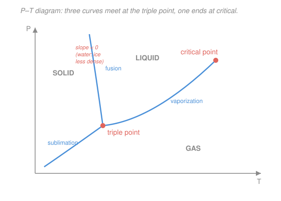

# Classical Thermodynamics · Lesson 3.3: Phase transitions & Clausius–Clapeyron

> ⏱ ~15 min · Module 3: Potentials, Maxwell relations & phase transitions · Builds on: [3.2 The Maxwell relations](03-02-maxwell-relations.md) · Unlocks: [3.4 The third law & chemical potential](03-04-third-law-chemical-potential.md)

## Why this matters

Water boils at 100 °C at sea level — but at 90 °C on a Himalayan pass, which is why high-altitude recipes need longer times. Ice melts *sooner* when you squeeze it, which is part of why a glacier flows and why a skate glides. Both facts fall out of a single equation, **Clausius–Clapeyron**, that tells you exactly how a phase boundary bends in the pressure–temperature plane. Given nothing but a latent heat and a volume change, you can predict the slope of the melting line, the shape of the vapor-pressure curve, and how the boiling point tracks the weather. It is the most practical payoff of the potentials machinery from [3.1](03-01-thermodynamic-potentials.md)–[3.2](03-02-maxwell-relations.md).

## The idea

Cool steam and it eventually condenses; cool water and it freezes. Whether a substance is solid, liquid, or gas is a competition, and the referee is the **Gibbs free energy per particle** $g$ (Gibbs energy per mole, joules per mole). At fixed temperature $T$ and pressure $P$, matter settles into whichever phase has the **lowest** $g$ — nature minimizes Gibbs energy (that was the whole point of [3.1](03-01-thermodynamic-potentials.md)).

Plot the winning phase for every $(T,P)$ and you get a **phase diagram**: a map with a solid country, a liquid country, and a gas country. The borders between countries are **coexistence curves** — the special lines where two phases tie, $g_1 = g_2$, so both can exist at once (ice floating in water at 0 °C). Three borders meet at one **triple point**, where solid, liquid, and gas all tie simultaneously. And the liquid–gas border doesn't run forever: it stops at the **critical point**, beyond which "liquid" and "gas" become indistinguishable.

Here's the key move. A coexistence curve is defined by the *tie* $g_1 = g_2$. Walk a little along the curve and the tie must be preserved — both sides change by the same amount. That single constraint, "$g$ changes equally on both sides," pins down the slope of the border. That's Clausius–Clapeyron, and the rest of the lesson is squeezing it for everything it's worth.

## The formal version

**First-order transitions.** A transition is **first-order** when the two phases have equal $g$ on the curve but *differ* in the first derivatives of $g$ — namely entropy and volume. Recall from [3.1](03-01-thermodynamic-potentials.md) that per mole,

$$dg = -s\,dT + v\,dP, \qquad s = -\left(\frac{\partial g}{\partial T}\right)_P, \quad v = \left(\frac{\partial g}{\partial P}\right)_T,$$

where $s$ is molar entropy (J/(mol·K)) and $v$ is molar volume (m³/mol). *In words: $g$ is continuous across the border, but its slopes jump* — the phases have different entropy per mole $\Delta s = s_1 - s_2$ and different volume per mole $\Delta v = v_1 - v_2$. Two consequences:

- **Latent heat.** Converting one mole from phase 2 to phase 1 at fixed $T,P$ absorbs heat $L = T\,\Delta s$ (J/mol). *In words: the entropy jump costs real heat — the energy that goes into breaking a crystal or boiling a liquid without raising the temperature.* At constant $T,P$ the reversible heat is $\delta Q = T\,ds$, so integrating across the jump gives $L = T\Delta s$.
- **Volume jump.** The phases occupy different volumes $\Delta v$ (steam is ~1600× bulkier than water; ice is *bigger* than the water it came from).

**Deriving Clausius–Clapeyron.** On the coexistence curve $g_1(T,P) = g_2(T,P)$. Take a step along the curve; both sides change identically, $dg_1 = dg_2$:

$$-s_1\,dT + v_1\,dP = -s_2\,dT + v_2\,dP.$$

Collect terms: $(v_1 - v_2)\,dP = (s_1 - s_2)\,dT$, so

$$\boxed{\ \frac{dP}{dT} = \frac{\Delta s}{\Delta v} = \frac{L}{T\,\Delta v}\ }$$

using $L = T\Delta s$. *In words: the steepness of a phase border equals the latent heat divided by the temperature times the volume change.* (Everything here is per mole; the identical equation holds per kilogram if $L$, $s$, $v$ are all per kilogram — just be consistent.) Big latent heat and small volume change ⟹ a steep, nearly vertical border.

**Reading the slope.** Going solid → liquid → gas, entropy *increases* (more disorder), so $\Delta s > 0$ climbing that ladder. The sign of $dP/dT$ is then set entirely by the sign of $\Delta v$:

- **Normal case, $\Delta v > 0$** (liquid bulkier than solid): melting line tilts **right** (positive slope). Squeezing favors the denser phase.
- **Water anomaly, $\Delta v < 0$:** ice is *less* dense than liquid water (hydrogen bonds hold the crystal open), so freezing *expands*. The solid–liquid line therefore has **negative slope** — raising the pressure *lowers* the melting point. Squeeze ice and it melts.

**The vapor-pressure law (liquid → gas).** On the boiling line two approximations simplify things enormously. First, gas is vastly bulkier than liquid, so $\Delta v = v_{\text{gas}} - v_{\text{liq}} \approx v_{\text{gas}}$. Second, treat the vapor as ideal, $v_{\text{gas}} = RT/P$. Then

$$\frac{dP}{dT} = \frac{L}{T\,\Delta v} \approx \frac{L}{T\,(RT/P)} = \frac{LP}{RT^2} \quad\Longrightarrow\quad \frac{1}{P}\frac{dP}{dT} = \frac{L}{RT^2}.$$

Treating $L$ as roughly constant and integrating $\frac{d\ln P}{dT} = \frac{L}{RT^2}$ gives

$$\boxed{\ \ln P \approx -\frac{L}{RT} + \text{const}\ } \qquad\text{equivalently}\qquad P(T) \approx P_0\,e^{-L/RT}.$$

*In words: vapor pressure climbs exponentially with temperature* — the reason a small warming causes a big jump in how much water the air can hold. (Here $L$ and $R$ are both per mole, or both per kilogram — for water vapor per kilogram use the specific gas constant $R_v = R/M = 8.314/0.018 \approx 461\ \mathrm{J/(kg\cdot K)}$.)

## Picture

## Worked examples

**Example 1 (mechanical — slope of the ice line).** How steep is water's melting curve? Per kilogram: latent heat of fusion $L = 3.34\times10^5\ \mathrm{J/kg}$, at $T = 273\ \mathrm{K}$. Specific volumes are $v_{\text{water}} = 1.000\times10^{-3}\ \mathrm{m^3/kg}$ and $v_{\text{ice}} = 1.091\times10^{-3}\ \mathrm{m^3/kg}$, so

$$\Delta v = v_{\text{water}} - v_{\text{ice}} = (1.000 - 1.091)\times10^{-3} = -9.1\times10^{-5}\ \mathrm{m^3/kg}.$$

$$\frac{dP}{dT} = \frac{L}{T\,\Delta v} = \frac{3.34\times10^5}{273\times(-9.1\times10^{-5})} \approx -1.34\times10^{7}\ \mathrm{Pa/K} \approx -134\ \mathrm{atm/K}.$$

Negative, as promised — and *enormous*: you must pile on ~134 atmospheres to drop the melting point by a single kelvin. Ice is stubborn, but it *does* give.

**Example 2 (why you'd care — humidity and boiling).** The vapor-pressure law $\ln P \approx -L/RT + \text{const}$ says the saturation pressure of water roughly doubles for every ~10 °C of warming near room temperature — that's why warm air holds so much more moisture, and why a modestly warmer atmosphere carries disproportionately more water. Flip it around: water boils when its saturation pressure *equals the ambient pressure*. Lower the ambient pressure (go up a mountain) and the boiling temperature drops to match. The next problem makes that quantitative.

## Watch out

- **You might think $g$ is discontinuous at a phase transition.** It isn't — $g$ is *equal* across the border (that's the definition of coexistence). What jumps are its *derivatives*, $s$ and $v$. "First-order" names exactly that: a discontinuity in the *first* derivatives of $g$.
- **You might drop a sign in $\Delta v$ and get water backwards.** Keep the *same* labeling top and bottom: $\Delta s = s_1 - s_2$ and $\Delta v = v_1 - v_2$ with $1,2$ the same two phases in both. For ice→water the volume *shrinks*, $\Delta v < 0$, which is the whole reason the line leans left.
- **You might apply the exponential vapor law to the melting line.** The $\ln P \approx -L/RT$ form used $\Delta v \approx v_{\text{gas}} = RT/P$ — an *ideal-gas* approximation. It's valid only for a phase boundary that produces a gas (vaporization, sublimation), never for solid–liquid, where both volumes are small and comparable.

## One-liner

> Along any coexistence line $g_1 = g_2$, so $dg_1 = dg_2$ forces $\dfrac{dP}{dT} = \dfrac{L}{T\,\Delta v}$ — latent heat over the volume jump — and water's $\Delta v < 0$ tilts its melting line left.

## Problems

**P1 (🟢)** Solid carbon dioxide (dry ice) melts to liquid at high pressure with latent heat $L = 1.96\times10^5\ \mathrm{J/kg}$ at $T = 216\ \mathrm{K}$, and the liquid is *less* dense than the solid: $\Delta v = v_{\text{liq}} - v_{\text{solid}} = +3.4\times10^{-4}\ \mathrm{m^3/kg}$. Find the slope $dP/dT$ of the CO₂ melting line and state whether it tilts left or right.

**P2 (🟡 — Boss 3b)** Near sea level the atmospheric pressure falls about 12% per kilometer of altitude. Using $L = 2.26\times10^6\ \mathrm{J/kg}$ for water and $R_v = 461\ \mathrm{J/(kg\cdot K)}$, estimate how many kelvin the boiling point of water drops per kilometer of altitude. (Take $T = 373\ \mathrm{K}$.)

**P3 (🔴, optional)** Explain, using $dP/dT = L/(T\Delta v)$ and no numbers, *why* the water melting line tilts left while the CO₂ line of P1 tilts right — and what a positive-sloped melting line means physically when you compress the solid at fixed temperature.

Solutions

**P1** Straight substitution into Clausius–Clapeyron:

$$\frac{dP}{dT} = \frac{L}{T\,\Delta v} = \frac{1.96\times10^5}{216\times(3.4\times10^{-4})} \approx \frac{1.96\times10^5}{7.34\times10^{-2}} \approx +2.7\times10^{6}\ \mathrm{Pa/K}.$$

Positive slope — the CO₂ melting line tilts **right**. This is the *normal* behavior; water is the oddball.

*Check.* Units: $\dfrac{\mathrm{J/kg}}{\mathrm{K}\cdot\mathrm{m^3/kg}} = \dfrac{\mathrm{J}}{\mathrm{K}\cdot\mathrm{m^3}} = \dfrac{\mathrm{Pa\cdot m^3}}{\mathrm{K}\cdot\mathrm{m^3}} = \mathrm{Pa/K}$ ✓. Sign follows $\Delta v > 0$ with $L>0$: right-leaning, opposite to water. ✓

**P2** Use the vapor-pressure form $\dfrac{dP}{dT} = \dfrac{LP}{R_v T^2}$, rearranged to give the temperature shift for a fractional pressure change:

$$dT = \frac{R_v T^2}{L}\,\frac{dP}{P}.$$

A 1 km rise gives $dP/P = -0.12$. Plug in $T = 373\ \mathrm{K}$:

$$dT = \frac{461 \times (373)^2}{2.26\times10^6}\times(-0.12) = \frac{461\times 1.391\times10^{5}}{2.26\times10^6}\times(-0.12) \approx 28.4\times(-0.12) \approx -3.4\ \mathrm{K}.$$

So the boiling point falls by roughly **3–4 K per kilometer** — about 3.4 °C lower per km, so water boils near 96–97 °C at 1 km. Matches the mountaineer's rule of thumb.

*Check.* Units: $\dfrac{(\mathrm{J/(kg\cdot K)})\cdot\mathrm{K^2}}{\mathrm{J/kg}} = \mathrm{K}$, times a dimensionless $dP/P$, gives K ✓. Sign: pressure drops ($dP<0$) ⟹ boiling point drops ($dT<0$) ✓. Magnitude is a few kelvin per km, matching everyday experience. ✓

**P3** In $dP/dT = L/(T\Delta v)$, the latent heat $L = T\Delta s$ is positive for melting because a liquid is more disordered than its solid ($\Delta s = s_{\text{liq}} - s_{\text{solid}} > 0$), and $T>0$. So the **sign of the slope is the sign of $\Delta v = v_{\text{liq}} - v_{\text{solid}}$**. For water, ice's open hydrogen-bonded lattice makes the solid *less* dense, so liquid water is denser and $\Delta v < 0$ ⟹ negative slope. For CO₂ (and most substances) the liquid is less dense than the solid, $\Delta v > 0$ ⟹ positive slope.

A positive-sloped melting line means that compressing the solid at fixed $T$ eventually crosses the line *into the solid* staying solid — more precisely, higher pressure *raises* the melting temperature, so squeezing favors the denser solid and helps it stay frozen. Water does the reverse: squeezing lowers the melting point, so enough pressure melts ice at a fixed sub-zero temperature.

*Check.* Consistent with P1/Example 1: same formula, opposite $\Delta v$ signs give opposite tilts, and the "squeeze favors the denser phase" reading holds in both cases (denser = solid for CO₂, denser = liquid for water). ✓

## Flashback

**From Lesson 3.2 (The Maxwell relations):** Starting from the Helmholtz free energy differential $dF = -S\,dT - P\,dV$, derive the Maxwell relation linking $\left(\frac{\partial S}{\partial V}\right)_T$ to a derivative of $P$, then evaluate the right-hand side for one mole of ideal gas ($PV = RT$).

Solution

$F$ is a state function, so its mixed second partials are equal (equality of mixed partials — the engine behind every Maxwell relation). From $dF = -S\,dT - P\,dV$ we read $-S = (\partial F/\partial T)_V$ and $-P = (\partial F/\partial V)_T$. Cross-differentiating:

$$\frac{\partial}{\partial V}\left(\frac{\partial F}{\partial T}\right) = \frac{\partial}{\partial T}\left(\frac{\partial F}{\partial V}\right) \;\Longrightarrow\; -\left(\frac{\partial S}{\partial V}\right)_T = -\left(\frac{\partial P}{\partial T}\right)_V \;\Longrightarrow\; \boxed{\left(\frac{\partial S}{\partial V}\right)_T = \left(\frac{\partial P}{\partial T}\right)_V}.$$

For one mole of ideal gas $P = RT/V$, so $\left(\frac{\partial P}{\partial T}\right)_V = R/V$, giving $\left(\frac{\partial S}{\partial V}\right)_T = R/V$.

*Check.* Integrating at fixed $T$ recovers the familiar $\Delta S = R\ln(V_2/V_1)$ for isothermal expansion — entropy rises as the gas spreads out, as it must. Units: $R/V$ has J/(mol·K·m³·mol⁻¹)… more simply, $(\partial P/\partial T)_V = R/V$ carries Pa/K, matching an entropy-per-volume derivative J/(K·m³) since Pa = J/m³. ✓

## Connections

- **Backward:** the derivation is pure [3.2](03-02-maxwell-relations.md)/[3.1](03-01-thermodynamic-potentials.md) — it uses $dg = -s\,dT + v\,dP$ and the fact ([3.1](03-01-thermodynamic-potentials.md)) that equilibrium at fixed $T,P$ minimizes Gibbs energy, so coexisting phases must tie on $g$. Latent heat $L = T\Delta s$ ties straight back to entropy from [2.3](02-03-entropy.md).
- **Forward:** [3.4](03-04-third-law-chemical-potential.md) reframes $g$ as the **chemical potential** $\mu$ (Gibbs energy per particle), and coexistence becomes "$\mu$ equal across phases" — the same idea that governs reactions and mixtures in the downstream `stat-mech` course.
- **Sideways (calculus):** the whole method — "differentiate a constraint $g_1 = g_2$ along the curve it defines" — is implicit differentiation, and the Maxwell relation in the Flashback is nothing but equality of mixed partials $\partial^2 F/\partial V\partial T = \partial^2 F/\partial T\partial V$ from multivariable calculus (`calc-refresher`).
