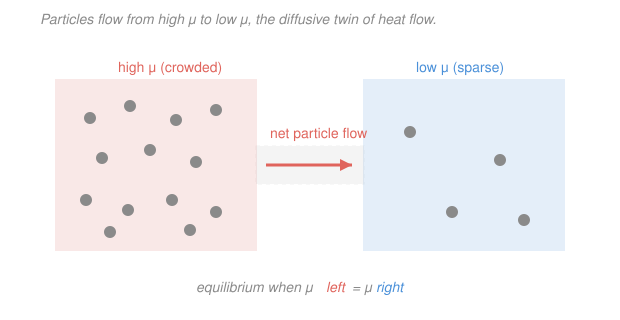

# Classical Thermodynamics · Lesson 3.4: The third law & chemical potential

> ⏱ ~15 min · Module 3: Potentials, Maxwell relations & phase transitions · Builds on: [3.3 Phase transitions & Clausius–Clapeyron](03-03-phase-transitions-clausius-clapeyron.md) · Unlocks: the microscopic story in [`stat-mech`](../../stat-mech/syllabus.md)

## Why this matters

Two loose ends remain, and both are gateways out of classical thermodynamics. The first: the second law defines entropy only up to a constant — $\Delta S$, never $S$ itself. The **third law** nails down that constant, giving entropy an absolute zero and, as a bonus, forbidding you from ever reaching $T = 0$. The second loose end: every relation so far assumed a *fixed* amount of stuff. The moment particles can move, react, or change phase, you need one more variable — the **chemical potential** $\mu$ — which turns out to be nothing more exotic than the Gibbs free energy carried by a single particle. Together these two ideas are the handoff to [`stat-mech`](../../stat-mech/syllabus.md) and to all of chemistry: $\mu$ is the star of the grand canonical ensemble, and $S \to 0$ is the fingerprint of a system freezing into a single quantum ground state.

## The idea

**The third law, in one breath:** cool anything toward absolute zero and its entropy stops depending on *anything* — pressure, field, volume — and settles to one universal value, taken to be zero for a perfect crystal. Why? Microscopically, entropy counts the number of microscopic arrangements a system can be in; at $T=0$ a well-ordered system has exactly *one* way to be — its ground state — and "one arrangement" means "no disorder," so $S \to 0$. You don't need the microscopics to *use* the law, but that picture is the whole reason it's true.

Two consequences fall straight out. First, if $S$ is finite (indeed zero) at $T=0$, then heat capacities must **vanish** as $T \to 0$ — there's no entropy left to add, so a spoonful of heat costs a diverging temperature change. Second, and stranger: you can **never actually reach** $T=0$. Every cooling trick works by alternately squeezing out entropy and letting the system re-cool, a staircase — but the third law shrinks each step to nothing as you approach the bottom, so it takes infinitely many steps. Absolute zero is an asymptote, not a destination.

**The chemical potential, in one breath:** ask "how much does the energy of my system rise if I sneak in one more particle, holding everything else fixed?" That price — energy per particle added — is $\mu$. Just as temperature is the thing that's equal when heat stops flowing, and pressure is the thing that's equal when volume stops shifting, $\mu$ is the thing that's equal when **particles** stop flowing. Particles drift from high $\mu$ to low $\mu$, exactly as heat drifts from high $T$ to low $T$ ([1.1](01-01-temperature-zeroth-law.md)).

## The formal version

**The third law (Nernst statement).** As the temperature approaches absolute zero, the entropy of a system approaches a constant that is independent of all its other parameters:

$$\lim_{T\to 0} S(T, X) = S_0, \quad\text{independent of } X \text{ (volume, pressure, field, \dots),}$$

and $S_0$ is conventionally taken to be $0$ for a perfect crystalline solid. *In words: at the bottom of the temperature scale every system loses all memory of its other variables and lands on the same entropy — call it zero.* This is what makes $S$ **absolutely** defined, not merely defined up to a constant the way the second law left it.

**Consequence 1 — heat capacities vanish.** Recall from [2.3](02-03-entropy.md) that at constant $X$ (volume or pressure), $dS = C_X\,dT/T$, so

$$S(T) - S(0) = \int_0^T \frac{C_X(T')}{T'}\,dT'.$$

For this integral to converge (and it must, since $S(0)=S_0$ is finite), the integrand must stay finite at the origin, which forces $C_X \to 0$ as $T \to 0$. Equivalently, $C_X = T\left(\frac{\partial S}{\partial T}\right)_X \to 0$ because the slope $\partial S/\partial T$ can't blow up faster than $1/T$. *In words: near absolute zero every heat capacity dies — you can't store heat in a system that has run out of entropy to hold it.* (This is a real prediction: the classical equipartition value $C_V = \tfrac32 Nk_B$ is *wrong* at low $T$; measured heat capacities do fall to zero, e.g. $C \propto T^3$ for a crystal.)

**Consequence 2 — unattainability of $T=0$.** You cool a system by cycling between two curves of $S$ vs. $T$ — say entropy at high field and at zero field. Each cooling step: pull entropy out isothermally (drop from the upper curve to the lower), then let the system cool adiabatically at fixed entropy (slide down the lower curve). Because the third law forces **both curves to meet at $S_0$ as $T\to 0$**, the vertical gap $\Delta S$ you can exploit shrinks to zero near the bottom, so each step carries you a smaller and smaller distance in $T$. *In words: the closer you get to absolute zero, the less each cooling step buys you — reaching $T=0$ would take infinitely many steps.* (See the staircase in the figure discussion below.)

**Microscopic bridge.** Statistical mechanics will define $S = k_B \ln \Omega$, where $\Omega$ is the number of accessible microstates and $k_B = 1.38\times10^{-23}\,\mathrm{J/K}$ is Boltzmann's constant. A perfectly ordered system at $T=0$ sits in its unique ground state, $\Omega = 1$, so $S = k_B \ln 1 = 0$. *That single equation is the third law's reason for being* — and it's the first thing [`stat-mech`](../../stat-mech/syllabus.md) proves.

**The chemical potential.** Extend the fundamental relation $dU = T\,dS - P\,dV$ (from [3.1](03-01-thermodynamic-potentials.md)) to allow the particle number $N$ to change, by adding one conjugate pair $(\mu, N)$:

$$\boxed{\,dU = T\,dS - P\,dV + \mu\,dN\,}$$

which defines

$$\mu \equiv \left(\frac{\partial U}{\partial N}\right)_{S,V}.$$

*In words: $\mu$ is the internal-energy cost of adding one particle while holding entropy and volume fixed.* Because $U$'s natural variables $(S,V)$ are awkward to hold fixed, rewrite this using the Gibbs free energy $G = U - TS + PV$ (from [3.1](03-01-thermodynamic-potentials.md)). Its differential picks up the same $\mu\,dN$ term:

$$dG = -S\,dT + V\,dP + \mu\,dN \quad\Longrightarrow\quad \mu = \left(\frac{\partial G}{\partial N}\right)_{T,P}.$$

*In words: $\mu$ is the Gibbs free energy it costs to add one particle at fixed temperature and pressure* — the lab-friendly version. Since $G$ is extensive and $T,P$ are intensive, $G$ must be exactly proportional to $N$: $G = N\mu$, so

$$\mu = \frac{G}{N} = g,$$

the **Gibbs free energy per particle**. Two facts fall out immediately:

- **Particle flow and equilibrium.** Particles move from high $\mu$ to low $\mu$; flow stops when $\mu$ is equal everywhere. Across a phase boundary this is exactly [3.3](03-03-phase-transitions-clausius-clapeyron.md)'s coexistence condition $g_1 = g_2$ — now recognizable as $\mu_1 = \mu_2$. *Equal $\mu$ is to diffusion what equal $T$ is to heat flow and equal $P$ is to mechanical push.*
- **Reactions.** For several species, $dG = -S\,dT + V\,dP + \sum_i \mu_i\,dN_i$, and a reaction with stoichiometric coefficients $\nu_i$ reaches equilibrium when $\sum_i \nu_i \mu_i = 0$. *In words: at equilibrium the chemical potentials balance along the reaction, weighted by how many of each molecule take part.*

## Picture

The diffusive analog of the temperature picture from [1.1](01-01-temperature-zeroth-law.md): swap "hot/cold" for "high $\mu$/low $\mu$" and "heat" for "particles," and the story is identical — flow runs downhill in the potential and stops at equality.

## Worked examples

**Example 1 (the third law bites — a heat capacity vanishing).** Suppose a solid has low-temperature entropy $S(T) = a T^3$ with $a$ a positive constant (the Debye form). Its heat capacity is

$$C = T\left(\frac{\partial S}{\partial T}\right) = T\cdot 3aT^2 = 3aT^3 \xrightarrow{\,T\to 0\,} 0.$$

Notice $S(0) = 0$ automatically, consistent with the third law, and $C \to 0$ as required by Consequence 1. Contrast the classical prediction $C = \tfrac32 Nk_B$, a *constant* — that would give $S = \int C\,dT/T = \tfrac32 Nk_B \ln T \to -\infty$ as $T\to 0$, a nonsense that the third law (and quantum mechanics) rules out.

**Example 2 (reading $\mu$ off an ideal gas — the handoff to stat-mech).** For one component of an ideal gas, statistical mechanics gives the Gibbs free energy the form $G(T,P,N) = N k_B T\big[\ln(P/P_0(T))\big]$ for some temperature-dependent reference $P_0(T)$. Then

$$\mu = \left(\frac{\partial G}{\partial N}\right)_{T,P} = k_B T\,\ln\!\frac{P}{P_0(T)} = \mu^\circ(T) + k_B T \ln\!\frac{P}{P_0},$$

the familiar "$\mu = \mu^\circ + k_BT\ln(P/P_0)$" of chemistry. The point isn't the formula — it's the *machine*: differentiate $G$ with respect to $N$ and you get an intensive $\mu$ that depends only on $T$ and $P$, never on how much gas you have. Raise the pressure (crowd the gas) and $\mu$ rises, so gas flows from high-pressure to low-pressure regions — pressure-driven diffusion, straight out of $\mu = g$.

## Watch out

- **You might think the third law says entropy is zero at $T=0$.** It says entropy approaches a *constant independent of the other variables*; setting that constant to zero is a convention (valid for a perfect crystal). A system frozen into disorder — a glass, or a crystal with residual orientational choices — can have a nonzero **residual entropy** at $T=0$. The universal, non-conventional content is "$S$ becomes parameter-independent and $C\to 0$."
- **You might think $\mu > 0$ always** (adding a particle "costs" energy). Not so: $\mu$ can be negative. For an ideal gas $\mu = k_BT\ln(P/P_0)$ is negative whenever $P < P_0$. The sign of $\mu$ tells you whether adding a particle raises or lowers $G$; it's a potential, not an energy magnitude.
- **You might confuse "particles flow high→low $\mu$" with "high→low concentration."** Usually they agree, but $\mu$ depends on temperature and field too, so a particle can flow *up* a concentration gradient if that lowers $\mu$ (e.g. toward a colder region, or into a phase where it binds). $\mu$, not density, is the true driver — just as $T$, not heat content, drives heat flow.

## One-liner

> The third law pins entropy's zero (so $C\to 0$ and $T=0$ is unreachable), and the chemical potential $\mu = (\partial G/\partial N)_{T,P} = g$ is the Gibbs free energy per particle — the thing that equalizes when particles stop flowing.

## Problems

**P1 (🟢)** A certain insulator has low-temperature entropy $S(T) = b\,T^2$ with $b > 0$ a constant. (a) Find its heat capacity $C(T)$ and confirm it vanishes as $T \to 0$. (b) Does $S(0)$ satisfy the third law?

**P2 (🟡)** For an ideal gas the Gibbs free energy can be written $G(T,P,N) = N\,f(T,P)$ for some function $f$. Show directly that $\mu = f(T,P)$ — i.e. that $\mu$ is intensive and equals $G/N$ — and explain in one sentence why this had to happen given that $T$ and $P$ are intensive while $G$ and $N$ are extensive.

**P3 (🔴, optional)** Two boxes of the same ideal gas at the same temperature are connected by a valve. Box L is at pressure $P_L = 3\,P_0$, box R at $P_R = P_0$. Using $\mu = \mu^\circ(T) + k_BT\ln(P/P_0)$, compute $\mu_L - \mu_R$, state which way particles flow when the valve opens, and give the condition on the pressures at which flow stops.

Solutions

**P1** (a) Heat capacity is $C = T\,\dfrac{\partial S}{\partial T}$. With $S = bT^2$, $\dfrac{\partial S}{\partial T} = 2bT$, so

$$C(T) = T\cdot 2bT = 2b\,T^2 \xrightarrow{\,T\to 0\,} 0. \checkmark$$

(b) $S(0) = b\cdot 0^2 = 0$, which is finite and (here) equal to the perfect-crystal convention $S_0 = 0$ — consistent with the third law. *Check.* Units: if $[S] = \mathrm{J/K}$ then $[b] = \mathrm{J/K^3}$, giving $[C] = \mathrm{(J/K^3)(K^2)} = \mathrm{J/K}$ ✓. Sanity: $C$ vanishing forces $S$ finite at $0$, and indeed $\int_0^T (C/T')\,dT' = \int_0^T 2bT'\,dT' = bT^2 = S(T)$, self-consistent. ✓

**P2** By definition $\mu = \left(\dfrac{\partial G}{\partial N}\right)_{T,P}$. With $G = N f(T,P)$ and $f$ independent of $N$,

$$\mu = \frac{\partial}{\partial N}\big[N f(T,P)\big]_{T,P} = f(T,P) = \frac{G}{N}.$$

So $\mu$ is independent of $N$ — intensive — and equals the Gibbs free energy per particle. *Why it had to happen:* $G$ is extensive (double the system, double $G$) while $T,P$ are intensive, so at fixed $T,P$ the only way $G$ can scale is linearly in $N$, i.e. $G = N\mu$ with $\mu$ intensive. *Check.* If instead $G$ had any sublinear or superlinear $N$-dependence, doubling the system at fixed $T,P$ wouldn't double $G$, contradicting extensivity. ✓

**P3** Subtract the two chemical potentials; the $\mu^\circ(T)$ term cancels (same gas, same $T$):

$$\mu_L - \mu_R = k_BT\Big[\ln\tfrac{P_L}{P_0} - \ln\tfrac{P_R}{P_0}\Big] = k_BT\ln\frac{P_L}{P_R} = k_BT\ln\frac{3P_0}{P_0} = k_BT\ln 3 > 0.$$

Since $\mu_L > \mu_R$, particles flow from L to R — from high pressure to low, as intuition demands. Flow stops when $\mu_L = \mu_R$, i.e. $\ln(P_L/P_R) = 0$, i.e. $P_L = P_R$ (equal pressures, hence equal $\mu$). *Check.* $\ln 3 \approx 1.10 > 0$, and at $T = 300$ K, $\mu_L - \mu_R = k_BT\ln 3 \approx (1.38\times10^{-23})(300)(1.10) \approx 4.6\times10^{-21}\,\mathrm{J}$ per particle — a positive, sensibly tiny per-particle energy. ✓

## Flashback

**From Lesson 3.3 (Phase transitions & Clausius–Clapeyron):** The ice–water melting line uses the Clausius–Clapeyron relation $\dfrac{dP}{dT} = \dfrac{L}{T\,\Delta v}$, where $L = 3.34\times10^{5}\,\mathrm{J/kg}$ is the latent heat of fusion, $T = 273\,\mathrm{K}$, and the specific-volume change on melting is $\Delta v = v_\text{water} - v_\text{ice} = (1.000 - 1.091)\times10^{-3}\,\mathrm{m^3/kg}$. Estimate $dP/dT$ for the melting line, and explain what its sign tells you about how the melting point responds to pressure. (Fresh variant — melting line, not the boiling line you did in 3.3.)

Solution

The volume change is $\Delta v = (1.000 - 1.091)\times10^{-3} = -0.091\times10^{-3} = -9.1\times10^{-5}\,\mathrm{m^3/kg}$ (water is *denser* than ice, so melting shrinks the volume — the famous anomaly). Then

$$\frac{dP}{dT} = \frac{L}{T\,\Delta v} = \frac{3.34\times10^{5}}{(273)(-9.1\times10^{-5})} \approx \frac{3.34\times10^{5}}{-0.0248} \approx -1.35\times10^{7}\,\mathrm{Pa/K}.$$

The slope is **negative** — the ice–water coexistence line leans *backward* in the $P$–$T$ plane. Inverting, $dT/dP \approx -7.4\times10^{-8}\,\mathrm{K/Pa}$, so raising the pressure by one atmosphere ($\approx 10^{5}\,\mathrm{Pa}$) *lowers* the melting point by about $0.0074\,\mathrm{K}$: squeeze ice and it melts more easily. *Check.* Units: $\dfrac{\mathrm{J/kg}}{\mathrm{K}\cdot\mathrm{m^3/kg}} = \dfrac{\mathrm{J}}{\mathrm{K}\,\mathrm{m^3}} = \dfrac{\mathrm{Pa\,m^3}}{\mathrm{K}\,\mathrm{m^3}} = \mathrm{Pa/K}$ ✓. Sign check: $L>0$ and $T>0$, so the sign of $dP/dT$ is the sign of $\Delta v$, which is negative for water — matching the well-known backward tilt that lets pressurized ice melt. ✓

## Connections

- **Backward:** the coexistence condition $g_1 = g_2$ from [3.3](03-03-phase-transitions-clausius-clapeyron.md) is exactly $\mu_1 = \mu_2$ — phase equilibrium is chemical-potential equilibrium. And $\mu$ enters through the same Gibbs free energy $G = U - TS + PV$ built in [3.1](03-01-thermodynamic-potentials.md); the third law finally fixes the integration constant that [2.3](02-03-entropy.md)'s entropy left undetermined.
- **Forward:** this is the course finale, and both ideas are load-bearing next door. In [`stat-mech`](../../stat-mech/syllabus.md), $S = k_B\ln\Omega$ *derives* the third law ($\Omega\to 1$ at $T=0$), and $\mu$ becomes the control knob of the **grand canonical ensemble**, where systems exchange particles with a reservoir at fixed $\mu$ instead of fixed $N$.
- **Sideways (chemistry):** the reaction-equilibrium condition $\sum_i \nu_i \mu_i = 0$ is the thermodynamic foundation of the law of mass action and every equilibrium constant you'll meet in physical chemistry — $\mu$ is the variable that ties heat, phases, diffusion, and reactions into one framework.
