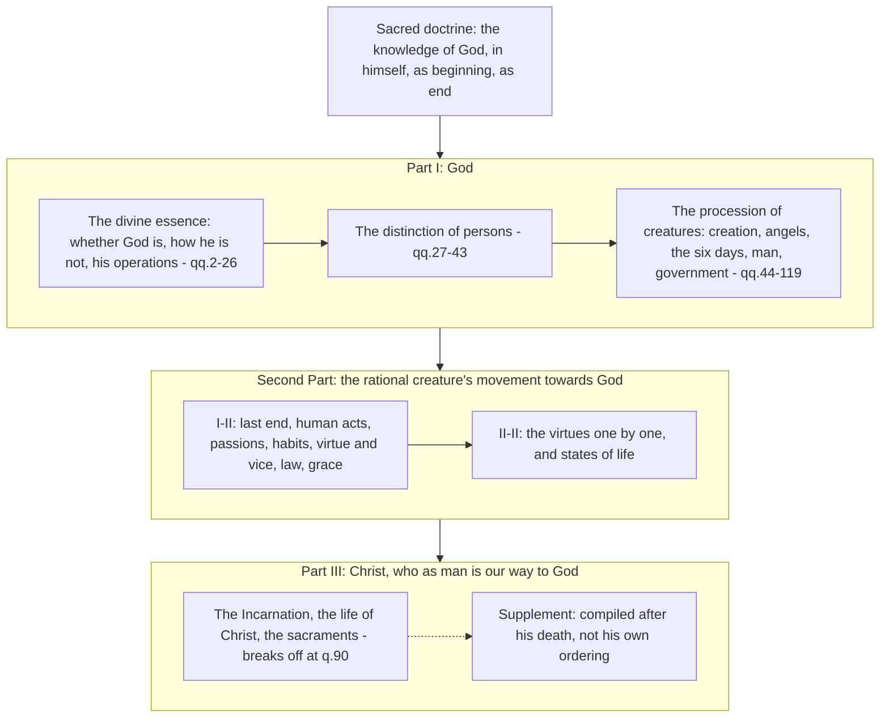

# The Thomistic Synthesis · Lesson 1.1: The plan of the Summa

> ⏱ ~15 min · Module 1: Reading the Summa · Builds on: [`fundamental-theology` 5.4](../../fundamental-theology/lessons/05-04-sacred-doctrine-as-a-science.md), [`ancient-medieval-philosophy` 7.3](../../ancient-medieval-philosophy/lessons/07-03-the-five-ways-as-text.md) · Unlocks: [1.2](01-02-reading-a-whole-question.md), [1.3](01-03-sacred-doctrine-one-science-about-god.md)

## Why this matters

For the next twenty-three lessons you will be handed references like *ST* I-II q.94 a.2 ad 1 and expected to find them, read them, and know what weight to give them. Two things make that possible: knowing how the reference works, and knowing where in the book you have landed. The second matters more than it sounds. The *Summa* is not a reference shelf of Aquinas's opinions; it is one ordered course of instruction, and where a passage sits is part of what it says. A sentence about human acts means something different when you know it stands inside a science whose subject is God. This lesson is the map. It also teaches the notation, so nothing later has to stop and explain it.

## The idea

Aquinas wrote in [several genres](../reference.md#aquinas-by-genre), and each has its own reason for the order it follows.

- **Scriptural commentaries** — his actual job. A master of theology at Paris was a *magister in sacra pagina*, a master of the sacred page, lecturing on Job, the Psalms, Paul, Matthew, John. The order is the biblical book's.
- **Commentary on the *Sentences*** (the *Scriptum*, from his years as a bachelor in the 1250s). Every theologian had to lecture on Peter Lombard's twelfth-century textbook. The order is Lombard's.
- **Disputed questions** — the university's public debates, written up afterwards: *De Veritate*, *De Potentia*, *De Malo*. Long, technical, with objections piled twenty deep. The order is the order of the occasions on which the debates were held.
- **The *Summa contra Gentiles*** (early 1260s) — four books of continuous argument in short chapters, not articles, sorted by what unaided reason can reach and what only revelation gives.
- **The *Summa Theologiae*** (begun in Italy about 1265, the Second Part finished at Paris, Part III written at Naples and broken off in 1273) — the subject of this course, and the one work whose order answers to nothing but its own subject matter and the reader Aquinas names.

That is the first thing to hold onto. In the commentaries and the disputed questions the sequence is imposed from outside, by a text, by a predecessor's book, by the calendar of disputations; even the *Contra Gentiles* takes its order from a purpose, what can be argued with whom. In the *Summa*, the sequence is a claim about the subject itself, and the prologue tells you what the claim is.

**[Citing it](../reference.md#citing-the-summa).** References look like this:

> *ST* I-II q.94 a.2 ad 1

Read right to left: **ad 1** is the reply to the first objection; **a.2** is article 2; **q.94** is question 94; **I-II** is the part. The five parts are **I** (*Prima Pars*), **I-II** (*Prima Secundae*), **II-II** (*Secunda Secundae*), **III** (*Tertia Pars*), and the **Supplement**. There is no "Part II" to cite: the second part comes in two halves and you must say which. A reference with no *ad* points to the body of the article, the *respondeo* — Aquinas's own answer, which is where you should read first. Anatomy of a single article, and why the *sed contra* is not always the answer, is [1.2](01-02-reading-a-whole-question.md)'s.

## Source

The general prologue, in the English Dominican Province translation (public domain):

> Because the doctor of Catholic truth ought not only to teach the proficient, but also to instruct beginners (according to the Apostle: As unto little ones in Christ, I gave you milk to drink, not meat — 1 Corinthians 3:1-2), we purpose in this book to treat of whatever belongs to the Christian religion, in such a way as may tend to the instruction of beginners. We have considered that students in this doctrine have not seldom been hampered by what they have found written by other authors, partly on account of the multiplication of useless questions, articles, and arguments, partly also because those things that are needful for them to know are not taught according to the order of the subject matter, but according as the plan of the book might require, or the occasion of the argument offer, partly, too, because frequent repetition brought weariness and confusion to the minds of readers.

Three complaints, and each names a genre he had worked in. *Useless questions and arguments*: the disputed questions. *The plan of the book*, or *the occasion of the argument*: commentary on a text, and disputation. *Frequent repetition*: what happens when the same doctrine surfaces wherever a text or an occasion drags it up. Against all three he sets one positive standard, **[the order of the subject matter](../reference.md#the-order-of-the-subject-matter)** — the sequence the material itself has, rather than the sequence in which it came up. And one audience: beginners. Note what "beginner" means here. These are young Dominicans who have done the arts course and are starting theology, not people who need things made easy. Milk, not meat, is about order and proportion, not about dilution.

## The argument

The prologue to I q.2 turns that standard into a division. Its premises:

1. **The aim of this teaching is to hand on the knowledge of God** — not only as he is in himself, but as he is the beginning of things and their last end, and especially of rational creatures.
   *In words:* one subject, God, considered under three descriptions — in himself, as source, as goal.
2. **"As is clear from what has been already said"** — the prologue leans on q.1, which has just argued that sacred doctrine is one science whose subject is God, everything else entering as related to him.
   *In words:* the division is not a filing convention; it is what having God as your subject forces. That argument is [1.3](01-03-sacred-doctrine-one-science-about-god.md)'s, and its treatment of theology as a science is [`fundamental-theology` 5.4](../../fundamental-theology/lessons/05-04-sacred-doctrine-as-a-science.md)'s.
3. **So [the work divides in three](../reference.md#the-three-parts-of-the-summa):** God; the rational creature's movement towards God; Christ, who as man is our way to God.
   *In words:* the three descriptions in premise 1, in that order — with the third added because the way to the goal was given in the Incarnation, which no analysis of the goal by itself would yield.
4. **And the same move repeats inside Part I:** the divine essence, the distinction of persons, the procession of creatures from God. Then inside the essence: whether God is (q.2); how he is, or rather how he is *not* (qq.3-11); then his operations — knowledge, will, power.
   *In words:* the book is a nest of divisions, each announced before it is executed. At the smallest scale the same habit produces the order of articles within a question, which is [1.2](01-02-reading-a-whole-question.md)'s subject.

So the plan is recursive, and every prologue in the work is a table of contents for what follows. Read them and you always know where you are.

## The map

Aquinas laid down his pen on 6 December 1273, after an experience in Mass he would not describe beyond saying that what he had written now seemed to him of little worth. He died the following March. The *Summa* stops at III q.90, inside the treatise on penance. The **Supplement** printed after it was assembled by another hand from his early commentary on the *Sentences* — Reginald of Piperno, his secretary, is the usual candidate, though the attribution is not secure. So Supplement citations are Aquinas's words in someone else's order: usable, but never evidence of how the mature plan would have finished. Part III's later questions, and the last things, are the part of the map we do not have.

## Worked examples

**Example 1 (clean): place a reference.** You are handed *ST* I-II q.94 a.2 ad 1. Decode: *Prima Secundae*, question 94, article 2, reply to the first objection. Locate: the *Prima Secundae* is the first half of the second movement, the rational creature's advance towards God; q.94 falls in its treatise on law, which comes after the last end, human acts, habits and virtue, because law is treated as an external principle moving us to the good once the internal ones are in place. What the reference does *not* license: quoting the *ad 1* as a free-standing thesis. A reply is calibrated to its objection, and reading it without the objection is the commonest way to misquote Aquinas. Here it says that the many precepts of the natural law are one law because they flow from one first precept — an answer to someone who had argued that a plurality of precepts means a plurality of laws. Natural law as an ethical theory is [`ethics` 4.4](../../ethics/lessons/04-04-natural-law-aquinas.md)'s; the placement is ours.

**Example 2 (hard): does [*exitus* and *reditus*](../reference.md#exitus-and-reditus) name the plan?** The most influential modern reading of the plan is M.-D. Chenu's, in his *Introduction à l'étude de saint Thomas d'Aquin* (1950). On it, the *Summa* traces a great circle inherited from Neoplatonism through Dionysius: all things go out from God (*exitus*) and all things return to him (*reditus*). Part I is the going out, the Second Part the return, and the divisions fall into place — notice that Part I's third section is announced in Aquinas's own words as "the procession of creatures" from God, and that the Second Part opens with the human being as the principle of his own acts, moving towards the end. It explains at a stroke why a book about God contains a treatise on the passions.

It strains in one place, and the place is Part III. Christ, who as man is our way, arrives *after* the return has been laid out, as the means by which it is actually made. On a strict circle he should be the form of the return, not an appendix to it; and readers have noted that Aquinas never names the scheme, while the general prologue names only the order of the subject matter and the needs of beginners. Defenders answer that the *ordo disciplinae*, the order of teaching, is not an order of importance, and that a historical scheme can organize a text whose author never labels it. Both readings are live, and this course does not settle it. Hold them side by side; [5.4](05-04-a-map-of-the-second-and-third-parts.md) returns to the same question from the other end of the book.

## Watch out

- **"Summa" does not mean "summary."** It is a complete ordered treatment, and this one runs to some five hundred questions. "For beginners" describes the order, not the difficulty.
- **"*ST* II q.94" is not a citation.** The second part is always I-II or II-II. Getting this wrong sends you to a different treatise entirely.
- **A Supplement reference is not the *Summa*'s plan.** It is early Aquinas, re-sorted posthumously. Say so when you cite it.
- **Do not read the *Summa* as a system of theses.** It is a course. A claim can appear in Part I in a thin form and be filled out in Part III, and an objection or a *sed contra* is not Aquinas talking ([1.2](01-02-reading-a-whole-question.md)).
- **The *Summa contra Gentiles* is not a first draft of this.** Different genre, different audience, different order; where the two differ, that is a fact about the works, not a development.

## One-liner

> The *Summa* is one science with one subject, laid out in the order the subject has rather than the order the questions arose in: God, the creature's way back to God, and Christ who is that way.

## Problems

**P1 (🟢) *(Exegetical.)*** Decode and place each reference in one line: which part, which movement of the three-part plan, and what the final element means. (a) *ST* I q.13 a.5. (b) *ST* II-II q.58 a.1 ad 3. (c) Suppl. q.69 a.2. (d) A fourth reference is malformed: *ST* II q.3 a.8. Say what is wrong with it, and what each of the two possible repairs would point to.

**P2 (🟡) *(Exegetical.)*** The prologue to I q.2 (English Dominican Province):

> Because the chief aim of sacred doctrine is to teach the knowledge of God, not only as He is in Himself, but also as He is the beginning of things and their last end, and especially of rational creatures, as is clear from what has been already said, therefore, in our endeavor to expound this science, we shall treat: (1) Of God; (2) Of the rational creature's advance towards God; (3) Of Christ, Who as man, is our way to God.

(a) Which words state the principle that generates the three parts, and which phrase tells you the principle was argued for somewhere earlier rather than asserted here? (b) The passage gives a reason for the third part that is different in kind from the reason for the first two. State the difference in one sentence. 150 words or fewer in total.

**P3 (🔴) *(Exegetical.)*** An invented blurb for a reading group:

> "Aquinas's final masterwork, written for his fellow masters at the University of Paris as the summary statement of a finished system, the *Summa Theologiae* carries the reader from creation through to the last things, closing with the resurrection of the body in its Supplement."

Name four claims in this that the lesson's evidence contradicts, and give the evidence for each. Two sentences per claim at most.

Solutions

**P1** *(Exegetical.)*

**Must hit, strict:** (a) *Prima Pars*, question 13 (the names of God), article 5; Part I, the first movement, inside the treatise on the divine essence; no *ad*, so the reference is to the body of the article, the *respondeo*. It is the univocity article, which is [4.4](04-04-analogy.md)'s. (b) *Secunda Secundae*, question 58 (justice), article 1, reply to the third objection; the second half of the second movement, the rational creature's advance towards God, in the treatment of the virtues one by one. (c) Supplement, question 69, article 2 — printed with the *Summa* but compiled after Aquinas's death from his early commentary on the *Sentences*, so it belongs to no part of his own plan. (d) "II" is not a part: the second part is *Prima Secundae* (I-II) or *Secunda Secundae* (II-II). I-II q.3 a.8 is a real address, in the treatise on the last end — whether happiness consists in seeing the divine essence. II-II q.3 a.8 is not: that question, on the outward act of faith, has only two articles. So the two repairs are not equally available, which is the second reason the part must be written out.

**Wrong turns:** reading "ad 3" as "article 3"; treating a Supplement question as evidence of Aquinas's mature ordering; saying a no-*ad* reference means "the whole article" rather than the body; assuming both repairs in (d) name existing articles.

**Model answer:** (a) First Part, q.13 a.5, the body of the article: God treated in himself, in the treatise on the divine essence, on whether anything is said univocally of God and creatures. (b) *Secunda Secundae* q.58 a.1, the reply to the third objection: the second movement, the creature's advance to God, among the individual virtues, on the definition of justice. (c) Supplement q.69 a.2: not part of Aquinas's plan at all, since the Supplement was compiled from his *Sentences* commentary after his death. (d) There is no part "II"; it must be I-II or II-II. I-II q.3 a.8 exists, on happiness as the vision of the divine essence; II-II q.3 has only two articles, so that repair points at nothing.

---

**P2** *(Exegetical.)*

**Must hit, strict (a):** the principle is that sacred doctrine teaches the knowledge of God "not only as He is in Himself, but also as He is the beginning of things and their last end, and especially of rational creatures" — one subject under three descriptions, which is what yields three parts. The phrase marking it as already established is "as is clear from what has been already said," pointing back to q.1 (God as the subject of the science).

**Must hit, strict (b):** the first two parts follow from the descriptions of God in the opening clause — God in himself, and God as the beginning and end towards which the rational creature moves. The third does not: "Christ, Who as man, is our way to God" names not a further aspect of God as subject but the means actually given for reaching the end, a fact of revelation rather than a division of the subject.

**Wrong turns:** answering (b) with "Christ is a person, not an aspect," which misses that the point is about what generates the division; taking "as is clear from what has been already said" to refer to the general prologue rather than to q.1; reading "especially of rational creatures" as a fourth part.

**Model answer:** (a) The generating clause is that this teaching hands on the knowledge of God "not only as He is in Himself, but also as He is the beginning of things and their last end, and especially of rational creatures." The words "as is clear from what has been already said" show the principle was argued in q.1, not asserted here. (b) Parts one and two are read off the descriptions of the subject itself, while the third part is added because the way to that end was given in Christ, which is a datum of revelation rather than another aspect under which God is considered.

---

**P3** *(Exegetical.)*

**Must hit, strict:** four of the following five, each with its evidence.
1. **"Written for his fellow masters"** — the general prologue says the opposite: it is written for the instruction of beginners, with the milk-and-meat text from 1 Corinthians attached.
2. **"Final masterwork ... of a finished system"** — it is unfinished. Aquinas stopped writing on 6 December 1273 and died in March 1274; the work breaks off at III q.90, inside the treatise on penance.
3. **"At the University of Paris"** — the *Summa* was begun in Italy around 1265; the Second Part was finished in Paris and Part III written at Naples. The blurb makes one place out of several.
4. **"Closing with the resurrection in its Supplement"** — the Supplement is not Aquinas's composition of the *Summa*; it was assembled after his death from his early commentary on the *Sentences*, so it is not the work's own ending.
5. **"Carries the reader from creation through to the last things"** — the plan does not begin at creation. It begins with God in himself; creation enters Part I as the procession of creatures, in the third of its three divisions.

**Wrong turns:** calling the Supplement a forgery (it is Aquinas's own material, re-sorted by another hand); saying the *Summa* was never finished by anyone, which is true of Aquinas but obscures what the Supplement is; naming "summary statement" as the error while granting the "finished system" claim — the point is that the system was not finished, and that a *summa* is not a summary.

**Model answer:** It was written for beginners, as the general prologue says in so many words, not for fellow masters. It is unfinished: Aquinas stopped on 6 December 1273 and the text breaks off at III q.90. It was not a Paris book — begun in Italy about 1265, with the Second Part completed at Paris and Part III written at Naples. And its Supplement is not its ending: that material was compiled after his death from his early commentary on the *Sentences*, so the work has no ending of its own.

## Connections

- **Backward:** [`fundamental-theology` 5.4](../../fundamental-theology/lessons/05-04-sacred-doctrine-as-a-science.md) read *ST* I q.1 aa.2 and 8 for what kind of knowing theology is; this course starts where that lesson hands it over. The disputed-question form itself is [`philosophical-method` 4.4](../../philosophical-method/lessons/04-04-arguing-within-a-tradition-the-disputed-question.md), and the Five Ways read as a thirteenth-century text are [`ancient-medieval-philosophy` 7.3](../../ancient-medieval-philosophy/lessons/07-03-the-five-ways-as-text.md).
- **Forward:** [1.2](01-02-reading-a-whole-question.md) drops one level down the nest of divisions, to the question and its articles. [1.3](01-03-sacred-doctrine-one-science-about-god.md) supplies the argument of q.1 that this lesson's plan assumes. [5.4](05-04-a-map-of-the-second-and-third-parts.md) maps the Second and Third Parts, where the *exitus* and *reditus* question comes back. [6.1](06-01-the-commentators.md) picks up what later readers did with the work, beginning with the commentators who printed their own text around it.
- **Sideways:** the order of a course of teaching against the order of discovery is an old distinction — [`metaphysics`](../../metaphysics/syllabus.md) faces it whenever a system has to start somewhere, and [`church-history` 5.2](../../church-history/lessons/05-02-friars-and-universities.md) has the thirteenth-century university and friars' schools that produced the lecturing and disputing whose orders this prologue sets aside.
