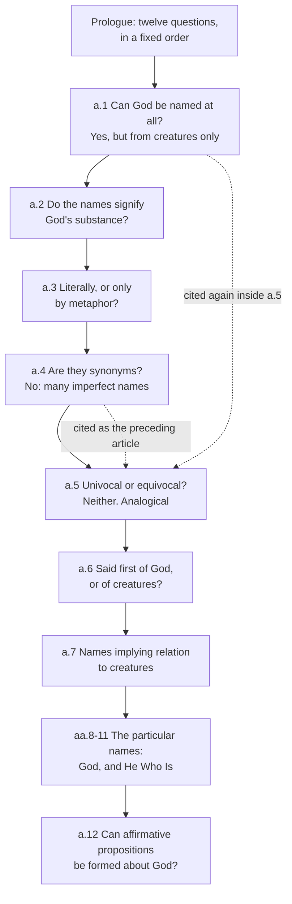

# The Thomistic Synthesis · Lesson 1.2: The article in depth: reading a whole question

> ⏱ ~15 min · Module 1: Reading the Summa · Builds on: [1.1 The plan of the Summa](01-01-the-plan-of-the-summa.md), [`philosophical-method` 4.4](../../philosophical-method/lessons/04-04-arguing-within-a-tradition-the-disputed-question.md) · Unlocks: [1.3 Sacred doctrine: one science about God](01-03-sacred-doctrine-one-science-about-god.md)

## Why this matters

Every reference the dogmatic courses will hand you looks like *ST* I q.13 a.5 — a part, a question, an article. The temptation is to open at the article, read its four parts, and close the book. That habit produces a *Summa* of detached proof-texts, and it is how Aquinas ends up quoted saying the reverse of what he holds. It is not a hypothetical: the single most quotable sentence in q.13 a.5 is a sentence Aquinas puts up in order to knock down, and you cannot see that from inside the sentence. The unit of reading is the [question](../reference.md#the-question-as-the-unit).

## The idea

You already have the four parts of an article — objections, *sed contra*, *respondeo*, replies — from [`philosophical-method` 4.4](../../philosophical-method/lessons/04-04-arguing-within-a-tradition-the-disputed-question.md), and this lesson does not repeat them. It adds the layer above and the layer below.

**Above:** a question is one argument spread over several articles. Its prologue is a table of contents, and the order is a claim about what has to be settled before what. Articles cite each other constantly — "as shown above", "as said in the preceding article" — so an article read alone is an argument with its premises removed.

**Below:** within an article, the two parts that look like packaging are where the content is. The **objections** are real positions, often somebody's, stated in their own strength. The **replies** are where Aquinas says what each objection got right, and the [distinction](../reference.md#distinguo) he uses there is usually the whole point of the article.

And one warning that belongs to this course and nowhere else: the [*sed contra*](../reference.md#sed-contra) is an **authority**, not a verdict. Most of the time it points where Aquinas is going. Sometimes it does not, and he says so.

Our specimen is *ST* I q.13, "The names of God" — twelve articles on whether and how a creature can say anything about God. [4.3](04-03-the-names-of-god.md) and [4.4](04-04-analogy.md) will take its doctrine apart. Here it is a machine we are learning to open.

## Source

The prologue to *ST* I q.13, which is simply a list of questions (English Dominican Province), four of its twelve items:

> Can God be named by us? ... Are any names applied to God predicated of Him substantially? ... Are some names applied to God and to creatures univocally or equivocally? Supposing they are applied analogically, are they applied first to God or to creatures?

Note the sixth item. It is *conditional on an answer the fifth has not yet given*. The list is not an index; it is a route.

Now the *sed contra* of article 5, and the last line of that same article:

> On the contrary, whatever is predicated of various things under the same name but not in the same sense, is predicated equivocally. But no name belongs to God in the same sense that it belongs to creatures ... Therefore whatever is said of God and of creatures is predicated equivocally.

> The arguments adduced in the contrary sense prove indeed that these names are not predicated univocally of God and creatures; yet they do not prove that they are predicated equivocally.

## The argument

A protocol, in the order you should actually work. Each step is a question you put to the text.

1. **Read the prologue first and treat its order as an argument.** Which article settles a presupposition of which? *In words:* the question tells you its own dependency structure before you read a word of it.
2. **For each article, find the back-references.** Scan the *respondeo* for "as shown above" and "in the preceding article", and fetch what they supply. *In words:* an article's premises are frequently in the articles before it, not in it.
3. **For each objection, ask whose position this is.** Sometimes it is a named authority quoted verbatim; sometimes an argument in circulation among masters; sometimes a good argument with no owner. It is never a straw man. *In words:* if the objection looks silly, you have misread it, not found a weak spot.
4. **Treat the *sed contra* as a premise with a source, not as the answer.** Ask what it establishes and what it does not. *In words:* it marks where the weight of the tradition falls and licenses the enquiry; whether Aquinas's own conclusion coincides with it is a separate question, to be checked.
5. **Find the distinction in the *respondeo*, then watch it do piecework in the replies.** *In words:* the *respondeo* states the distinction once; each reply is that distinction applied to one objection, which is why replies are often a single line.

Two notes on the authorities, since this is a course about a man who argues almost entirely by way of other people's texts. [Aquinas's cast](../reference.md#the-authorities) is small and fixed: **the Philosopher** is Aristotle, **the Commentator** is Averroes ([`ancient-medieval-philosophy` 6.3](../../ancient-medieval-philosophy/lessons/06-03-averroes-and-maimonides.md)), **Rabbi Moses** is Maimonides, and the theological authorities are Augustine, Dionysius (whom the Middle Ages took for Paul's Athenian convert; see [`patristics`](../../patristics/syllabus.md)), John Damascene, Ambrose, Hilary and Boethius. How Aquinas *ranks* authorities inside his science — proper or extrinsic, conclusive or probable — is ST I q.1 a.8, owned by [`fundamental-theology` 5.4](../../fundamental-theology/lessons/05-04-sacred-doctrine-as-a-science.md); take it from there and do not re-derive it.

The second note is the practice this course calls [reverent interpretation](../reference.md#reverent-interpretation). When a recognized authority has said something Aquinas cannot accept flatly, he does not usually say the man was wrong. He keeps the words and supplies a sense in which they are true — often a sense their author may not have intended. This is a real feature of the genre, not a lapse, and it has a real cost: **Aquinas's Damascene is not a reliable report of Damascene.** Watch the asymmetry in q.13 a.2. Damascene, a Father, gets rescued in the reply. Rabbi Moses, outside the tradition, is named in the *respondeo* and refuted in three reasons. Standing inside the tradition buys you a charitable reading; it does not buy agreement.

## The question as a whole

Solid arrows are the prologue's order. Dashed arrows are back-references Aquinas makes explicitly inside article 5: "we can name God only from creatures (Article 1)" and "as said in the preceding article". Article 5 is the hinge of the question, and it is load-bearing in both directions — a.6 cannot even be *asked* until a.5 has come out as it does.

## Worked examples

**Example 1 (clean machinery): article 6, where the distinction lands.**

The question is whether names common to God and creatures are said *primarily* of creatures. Three objections say yes, and each is a decent argument: we name things as we know them and we know creatures first; Dionysius says we name God from creatures; a name applied through a cause is secondary, as "healthy" is said of medicine only because animals are healthy.

The *sed contra* is one line of scripture, Ephesians 3:14-15, on the Father "of Whom all paternity in heaven and earth is named". It does not argue. It marks the direction.

The *respondeo* then produces the distinction that is the article: **what the name signifies** versus **the imposition of the name**. As regards what is signified, the perfection is in God first and flows to creatures, so the name belongs primarily to God. As regards imposition — who got called that first, by us — creatures come first, because they are what we know. Two orders, running opposite ways, and the objections had conflated them.

Now read the replies. Reply 1, in full: "This objection refers to the imposition of the name." Reply 3 is barely longer. They are short *because the work is already done*; the distinction from the *respondeo* is simply laid against each objection in turn. Skip the *respondeo* and the replies look like a brush-off. Read the question as a unit and they look like receipts.

**Example 2 (where it strains): article 5, where the *sed contra* points the wrong way.**

Article 5 asks whether what is said of God and of creatures is predicated **univocally**. Three objections argue that it is. The *sed contra* — reproduced in the Source — argues that it is **equivocal**: no name belongs to God in the sense it belongs to creatures, so predication must be equivocal. Notice that it is not a quotation at all but two compact arguments from reason, and notice where it leaves you if you stop there. You have Aquinas apparently teaching that nothing said of God means what it means of us.

The *respondeo* rejects both. Univocal predication is impossible, for the reason the *sed contra* gives. But pure equivocity is impossible too, "as some have said", because then nothing could be known or demonstrated about God from creatures at all, and every argument would commit the fallacy of equivocation. The answer is a third thing. (What that third thing is, and how the school fought over how to read it, is [4.4](04-04-analogy.md)'s business.)

Then comes the move that makes this article the standing example. After the three replies to the objections, Aquinas adds a paragraph addressed to the *sed contra* itself: those arguments prove that the names are not univocal, but they do not prove that they are equivocal. He has conceded the *sed contra*'s negative work and denied its conclusion — **in writing, at the end of the article.** The form allows him to; he is not obliged to endorse the authority he uses to answer the objections.

So the reading rule has a text behind it. *Sed contra* means "on the contrary", not "here is my answer".

## Watch out

- **You might think the *sed contra* is Aquinas's answer, and usually you would be right.** But "usually" is not "always", and q.13 a.5 is the case that proves it. Before you quote a *sed contra* as Aquinas's teaching, read to the end of the article and check whether he comes back to it.
- **You might think an objection is a straw man.** In this genre a weak objection would be a defect. When an objection looks obviously bad, the likely diagnosis is that you are missing the position it states — and the *respondeo* often names the position outright, as q.13 a.2 names Maimonides.
- **You might think reverent interpretation is just politeness.** It is a method, and it is exegetically expensive. When Aquinas tells you what Damascene meant, you have learned what Aquinas holds; you have not yet learned what Damascene held.
- **Do not promote anything here.** A reading protocol is a skill, and Aquinas's own handling of the authorities is a theologian's method. Neither is an act of the magisterium. Levels come from [`fundamental-theology` 4.4](../../fundamental-theology/lessons/04-04-the-ladder-of-doctrinal-authority.md) and nowhere else.

## One-liner

> An article is a move; the question is the game — and the *sed contra* is where the tradition stands, not always where Aquinas lands.

## Problems

**P1 (🟢) *(Exegetical.)*** *ST* I q.13 a.1, objection 1 and its reply (English Dominican Province). The body of the article concludes that God **can** be named by us, from creatures, though no such name expresses the divine essence.

> Objection 1. It seems that no name can be given to God. For Dionysius says (Div. Nom. i) that, "Of Him there is neither name, nor can one be found of Him;" and it is written: "What is His name, and what is the name of His Son, if thou knowest?" (Proverbs 30:4).

> Reply to Objection 1. The reason why God has no name, or is said to be above being named, is because His essence is above all that we understand about God, and signify in word.

(a) Does the reply deny Dionysius? Quote the words that decide it. (b) Name, in your own words, the distinction the reply relies on. Two sentences per part.

**P2 (🟡) *(Exegetical.)*** Using only what the lesson gives you: (a) Article 5's *respondeo* points back with the phrases "as said in the preceding article" and "we can name God only from creatures (Article 1)". State what each of those two articles supplies to article 5's argument. (b) The prologue's sixth item reads "Supposing they are applied analogically, are they applied first to God or to creatures?" Say what that wording shows about the relation between a.5 and a.6, and what would become of a.6 if a.5 had concluded for pure equivocity. 150 words or fewer in total.

**P3 (🔴, optional) *(Exegetical.)*** An invented parish-bulletin paragraph:

> "St Thomas himself teaches that no word we use of God means what it means of us. As he puts it, no name belongs to God in the same sense that it belongs to creatures, so whatever is said of God and of creatures is said equivocally. And since the Church gives us St Thomas as her common doctor, this is not one opinion among others — it is what a Catholic is to hold."

(a) Locate the quoted sentence inside q.13 a.5 by part, and say what Aquinas does with it. (b) The last sentence is wrong twice, and in opposite directions. Name both errors, citing [`fundamental-theology` 4.4](../../fundamental-theology/lessons/04-04-the-ladder-of-doctrinal-authority.md) and [`fundamental-theology` 1.2](../../fundamental-theology/lessons/01-02-natural-knowledge-of-god.md). Two sentences per part.

Solutions

**P1** *(Exegetical.)*

**Must hit, strict (a):** No. The reply keeps Dionysius's sentence and supplies a reason for it — it opens "**The reason why** God has no name, **or is said to be above being named**, is because...". Those words, plus "is above all that we understand about God, and signify in word", restrict the denial to a name that would express the essence, which is exactly what the body does not claim.
**Must hit, strict (b):** the distinction between naming a thing as far as we understand it — here, from creatures, as effects — and a name that expresses the essence in itself, the way a definition does. Dionysius's "no name" is true of the second sort; the body affirms only the first. Credit for spotting that the Proverbs text is carried along and not separately answered.
**Wrong turns:** reading the reply as a polite refutation ("Dionysius overstated the case"); reading it as flat agreement, which would contradict the body of the article; treating the reply as a concession that we know nothing of God.
**Model answer:** (a) It does not deny him. The reply begins by giving "the reason why God has no name, or is said to be above being named", which keeps the words and explains them, rather than correcting them. (b) The distinction is between a name we impose from God's effects, which we can understand, and a name that would express his essence as a definition does. The first is possible and is what the article grants; the second is not, and is what Dionysius was denying.

---

**P2** *(Exegetical.)*

**Must hit, strict (a):** a.4 supplies that the perfections that are divided and multiplied in creatures pre-exist in God unitedly — so "wise" said of a man signifies something distinct from his essence, power and existence, while said of God it signifies nothing distinct from them, and the same word therefore cannot be working in the same way. a.1 supplies that we can name God only from creatures, since his essence is not seen in this life — which is what puts the one word to two jobs in the first place and raises a.5's question at all.
**Must hit, strict (b):** the sixth item is written as conditional on an answer a.5 has not yet given ("Supposing they are applied analogically"), so a.6 is a follow-on rather than an independent query: the prologue's order is a dependency. If a.5 had concluded for pure equivocity there would be no common idea shared between the two uses, so nothing could be said to belong first to one and derivatively to the other, and a.6 would not arise.
**Wrong turns:** getting the direction backwards and making a.5 depend on a.6; saying a.6 would simply be answered "of creatures" under equivocity — under pure equivocity the question has no subject matter, because there is no one *notion* whose priority could be at issue; treating the prologue as an editor's index rather than the plan of the question.
**Model answer:** (a) Article 4 supplies that perfections divided among creatures pre-exist in God as one, so "wise" signifies something distinct from essence and power in a man and nothing distinct in God. Article 1 supplies that we can name God only from creatures, which is why one word is being stretched across both and why the question arises. (b) The sixth item is stated conditionally on the fifth's answer, so the order of articles is a dependency, not a list: a.6 asks about priority within an analogical community of meaning. Had a.5 concluded for pure equivocity there would be no shared notion at all, and the question of which it belongs to first would have nothing to be about.

---

**P3** *(Exegetical.)*

**Must hit, strict (a):** the quoted sentence is from the ***sed contra*** of a.5, not from the *respondeo*. Aquinas grants that those arguments show the names are not predicated univocally, and denies that they show equivocal predication, in the closing paragraph of the article; his own answer is that the names are said analogically. So the bulletin has published as Aquinas's teaching the position a.5 exists to refute.
**Must hit, strict (b):** two errors, opposite in direction. **Upward:** the inference from "common doctor" to "what a Catholic is to hold". The Church's recommendation of Aquinas as master belongs to the ordinary magisterium and to Church law; it is not a definition, and it does not convert his theses into doctrine. A position of his carries the weight of his argument plus his standing — a theologian's weight on the [`fundamental-theology` 4.4](../../fundamental-theology/lessons/04-04-the-ladder-of-doctrinal-authority.md) ladder, not a magisterial one. **Downward:** the content actually asserted, pure equivocity, is not a free school option either, because *Dei Filius* defines that God can be certainly known by the natural light of reason through created things ([`fundamental-theology` 1.2](../../fundamental-theology/lessons/01-02-natural-knowledge-of-god.md)) — which is the very consequence Aquinas says pure equivocity destroys. So the paragraph inflates the authority of its source and misses the one real doctrine bearing on its claim.
**Wrong turns:** answering only the upward error and calling the second sentence "merely one opinion", which is the mirror mistake; saying the recommendation of Aquinas is "just discipline" and stopping, which understates an act of the ordinary magisterium; treating analogy itself as defined doctrine — it is not.
**Model answer:** (a) It is the *sed contra*. Aquinas concedes that its arguments rule out univocity but says in the article's last paragraph that they do not prove equivocity, and his own answer is analogical predication. (b) First, "common doctor" does not make a thesis binding: the Church's recommendation of Aquinas is ordinary magisterium and Church law, not a definition, so his positions carry a theologian's weight and not a magisterial one. Second, the claim being asserted is not a free option in the other direction either, since pure equivocity would make God unknowable from creatures, against *Dei Filius*.

## Connections

- **Backward:** [`philosophical-method` 4.4](../../philosophical-method/lessons/04-04-arguing-within-a-tradition-the-disputed-question.md) gave the four parts of an article and the form of argument from authority; this lesson adds the question as the unit and the case where the *sed contra* is not the answer. [1.1](01-01-the-plan-of-the-summa.md) gave the plan of the whole work and the citation form this protocol assumes.
- **Forward:** [1.3](01-03-sacred-doctrine-one-science-about-god.md) applies the protocol to ST I q.1, where the order of articles carries the argument for the whole work's existence. Every later module reads whole questions this way: q.3 in [3.4](03-04-divine-simplicity-and-the-attributes.md), q.13 again in [4.3](04-03-the-names-of-god.md) and [4.4](04-04-analogy.md), q.44 and q.45 in [5.1](05-01-creation-and-conservation.md).
- **Sideways:** the doctrine of q.13 a.5 — analogy between univocity and equivocity — is the target Scotus takes aim at in [`ancient-medieval-philosophy` 8.2](../../ancient-medieval-philosophy/lessons/08-02-scotus-the-univocity-of-being.md), and the ranking of theological authorities that Aquinas assumes here is worked out in [`fundamental-theology` 5.4](../../fundamental-theology/lessons/05-04-sacred-doctrine-as-a-science.md).
