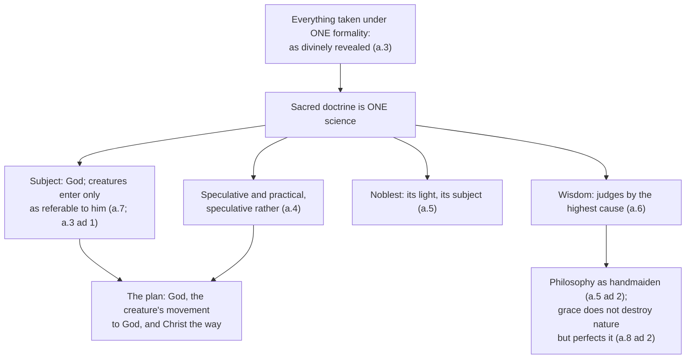

# The Thomistic Synthesis · Lesson 1.3: Sacred doctrine: one science about God

> ⏱ ~15 min · Module 1: Reading the Summa · Builds on: [1.2 The article in depth](01-02-reading-a-whole-question.md), [`fundamental-theology` 5.4](../../fundamental-theology/lessons/05-04-sacred-doctrine-as-a-science.md) · Unlocks: [2.1 Act and potency, extended](02-01-act-and-potency-extended.md)

## Why this matters

Question 1 is the only question in the *Summa* that is about the *Summa*. Before asking whether God exists, Aquinas asks what kind of knowing he is about to do, and the answer has to carry the plan [1.1](01-01-the-plan-of-the-summa.md) laid out — because that plan looks indefensible. A book whose subject is God spends hundreds of pages on motion, on the powers of the soul, on habits, passions and law. Either the work is an encyclopedia with a pious title, or one thing makes all of it a single science. Article 3 names that one thing, and the same answer decides what a philosophical argument is doing when it turns up inside a theological one — a quarrel Module 6 is still fighting.

## The idea

Ask what makes a science **one**. The tempting answer is: one list of things. Aquinas rejects it, and his counter-example is sight.

Man, ass and stone have nothing in common as things. They are one object for sight because each is *colored*, and color is what sight is sensitive to. The unity comes from the aspect under which they are taken, not from what they are. Call that aspect the [formal object](../reference.md#formal-object) — the light in which a power or a science takes its material.

Now apply it. [Sacred doctrine](../reference.md#sacred-doctrine) takes everything it treats under one aspect: **as divinely revealed**. Angels, bodies, human acts and God himself are as unlike each other as man, ass and stone. They are one object here because one light falls on all of them.

Two things follow at once, and they are the payload of this lesson.

First, **the same sentence can belong to two sciences.** Aquinas has already said so in a.1 ad 2: the astronomer and the natural philosopher both prove the earth is round, the one by mathematics, the other from matter itself. Same conclusion, different means of knowing, two sciences. So the theology that is part of philosophy and the theology inside sacred doctrine differ in kind, and revelation may teach what reason could also reach.

Second, **a science of God can treat creatures without changing its subject**, provided it takes them under that aspect — which is what a.7 says it does. God is the subject; everything else is in the science as referred to God, as beginning or as end. (The English Dominican translation renders *subiectum* as "object" in a.7; read it as "subject matter.")

## Source

*Summa Theologiae* I q.1 a.3, the body of the article (English Dominican Province translation, public domain):

> "Sacred doctrine is one science. The unity of a faculty or habit is to be gauged by its object, not indeed, in its material aspect, but as regards the precise formality under which it is an object. For example, man, ass, stone agree in the one precise formality of being colored; and color is the formal object of sight. Therefore, because Sacred Scripture considers things precisely under the formality of being divinely revealed, whatever has been divinely revealed possesses the one precise formality of the object of this science; and therefore is included under sacred doctrine as under one science."

The two objections are the ones anyone would raise, and Aquinas concedes both facts: one science treats one class of subjects, and creator and creature are not one class (obj. 1); angels, bodies and human morality are parcelled out among three philosophical sciences (obj. 2). What he denies is that a class of subjects makes a science one.

## The argument

**Article 3, in numbered form:**

> **P1.** The unity of a power or a habit of knowledge is measured by its object — not by the object's material aspect, meaning what the things are, but by the formality under which they are objects at all.
> *In words: what makes a science one is the light it works in, not the list it covers.*
>
> **P2.** Sight's formality is being colored, which is why man, ass and stone are one object for it.
>
> **P3.** Sacred doctrine considers everything it treats precisely under the formality of being divinely revealed.
> *In words: its light is revelation.*
>
> **∴ C.** Whatever is divinely revealed therefore has one and the same formality here, and falls under sacred doctrine as under one science.

P1 is Aristotelian machinery: *scientia* here means demonstrated knowledge from principles, not empirical inquiry ([`ancient-medieval-philosophy` 3.1](../../ancient-medieval-philosophy/lessons/03-01-predication-categories-and-the-syllogism.md)). P3 is the premise that does the theological work, and a.2 has already paid for it: the principles of this science are the articles of faith, held on the authority of a higher knowledge, God's own and the blessed's — [subalternation](../reference.md#subalternation), which [`fundamental-theology` 5.4](../../fundamental-theology/lessons/05-04-sacred-doctrine-as-a-science.md) owns, together with a.8 on arguing from those principles. This lesson redoes neither; it asks what the plan looks like once you have them.

Four consequences follow — most of the rest of q.1.

**It has a subject, and the subject is God (a.7, with a.3 ad 1).** The reply to the first objection states the asymmetry that keeps the science from becoming a survey of everything: "Sacred doctrine does not treat of God and creatures equally, but of God primarily, and of creatures only so far as they are referable to God as their beginning or end."

**It is speculative and practical, and speculative rather (a.4).** Because the unifying aspect is formal, one science can take in what philosophy splits between speculative and practical disciplines, as God by one knowledge knows both himself and his works. It is speculative rather, being more concerned with divine things than with human acts — though it treats those too, inasmuch as man is ordained by them to the knowledge of God in which eternal bliss consists. That last clause is the warrant for the whole moral part, mapped in [5.4](05-04-a-map-of-the-second-and-third-parts.md).

**It is the noblest science (a.5)**, on two stated counts: the certitude of its light, divine knowledge that cannot be misled where natural reason can err, and the worth of its subject matter. But its reply to the first objection concedes that the articles *seem* less certain to us — our intelligence is dazzled, as the owl is by the sun. Certainty in itself and certainty for us come apart, and the ranking is by the first.

**It is wisdom (a.6)**, because the wise man judges by the highest cause, and this science treats God as the highest cause. The edge is in the reply to the second objection: it does not prove other sciences' principles but judges them, and whatever is found in another science contrary to a truth of this one is to be condemned as false.

And under all of it, the rule for philosophy's place. Theology accepts its principles immediately from God, not from the philosophers, so it does not lean on them as on a higher science; it uses them as lesser things, [as handmaidens](../reference.md#philosophy-as-handmaiden), and does so because of the defect of our intelligence, which is led more easily from what reason knows to what is above reason (a.5 ad 2). The one-sentence version, from a.8 ad 2, is what every later module runs on: "Since therefore grace does not destroy nature but perfects it, natural reason should minister to faith as the natural bent of the will ministers to charity." ([Grace perfects nature](../reference.md#grace-does-not-destroy-nature-but-perfects-it).)

## The derivation

## Worked examples

**Example 1 (clean: one sentence, two sciences).** Take *everything that is moved is moved by another*. It is Aristotle's, argued in the *Physics*, and it is the first premise of the First Way at I q.2 a.3 (the text and its sources are [`ancient-medieval-philosophy` 7.3](../../ancient-medieval-philosophy/lessons/07-03-the-five-ways-as-text.md); its meaning inside this system is [3.2](03-02-the-first-and-second-ways-inside-the-system.md)). Has Aquinas changed the subject when he uses it?

Run a.3's criterion. The material is identical: same proposition, same proof. What differs is the formality. In the *Physics* it is taken as something natural reason establishes about movable being. In the *Summa* it is taken as a step toward the God whom revelation proposes for belief, set in this order for beginners whose salvation depends on knowing that end (a.1). Same sentence, two formal objects, two sciences — the astronomer and the natural philosopher of a.1 ad 2 again.

Notice what the criterion does *not* say. It does not say the proposition becomes more certain, or stops being demonstrable, in q.2. Its probative force is whatever natural reason gives it. What changes is the science it belongs to — which is why the *Summa* can open with philosophical arguments without ceasing to be theology, and why their conclusion can be a preamble rather than an article of faith ([3.1](03-01-demonstrating-that-god-exists.md)).

**Example 2 (where it strains: is the philosophy in the *Summa* still philosophy?).** Press the handmaiden image and something uncomfortable appears. a.5 ad 2 says theology does not need the philosophical sciences and uses them only to make its teaching clearer; a.6 ad 2 says it judges them and condemns as false whatever contradicts it. Hard conclusion: philosophy inside the *Summa* is decorative, pre-screened by a science that will not accept a contrary answer.

Two things loosen that. One does not.

*The norm is negative, not productive.* a.6 ad 2 gives this science no power to supply another's principles, only to judge its conclusions. Theology's approval adds nothing to an argument; a bad demonstration stays bad. The claim is only that a demonstration contrary to a revealed truth cannot be sound — the structure [`fundamental-theology` 5.4](../../fundamental-theology/lessons/05-04-sacred-doctrine-as-a-science.md) found in a.8: an argument against a truth is not a demonstration, so there is a flaw in it somewhere.

*The weakest premise still rules.* On a.8's own ranking, a philosopher enters a theological argument as an extrinsic and merely probable authority, and a conclusion is graded by its weakest premise ([`fundamental-theology` 5.5](../../fundamental-theology/lessons/05-05-the-loci-theologici.md)). Philosophy's contribution is neither decorative nor privileged; it is weighted.

*What does not loosen:* whether the philosophy in the *Summa* is then genuinely philosophy is a live twentieth-century dispute. Gilson held that philosophy done within faith is a distinct and better thing, Christian philosophy; critics answered that a discipline is defined by its method, so the arguments either stand on natural reason alone or are theology in philosophy's clothes; Maritain's distinction between philosophy's nature and its state is a third position. That quarrel is [6.3](06-03-strict-observance-and-existential-thomism.md)'s, and it starts here, at a.5 ad 2.

## Watch out

- **You might think "one science" means one subject matter.** a.3's objections say exactly that, and Aquinas grants their facts; his answer is that a class of subjects is not what unifies a science. Reading the *Summa* as an encyclopedia held together by its topics is the error this article exists to prevent.
- **You might think the handmaiden clause makes philosophy dispensable.** His stated reason for using it is the defect of *our* intelligence — a permanent feature of the learner, not a thirteenth-century convenience, which is why Modules 2 to 5 exist.
- **Don't import the modern word "science."** *Scientia* is demonstrated knowledge from principles; whether theology is one *strictly* is [`fundamental-theology` 5.4](../../fundamental-theology/lessons/05-04-sacred-doctrine-as-a-science.md)'s question, and it is freely disputed among Catholics.
- **Don't give q.1 a magisterial level.** Everything in this lesson is Aquinas's own theology, below the seam on [`fundamental-theology` 4.4](../../fundamental-theology/lessons/04-04-the-ladder-of-doctrinal-authority.md)'s ladder. That God can be known with certainty from created things is separately defined by Vatican I ([`fundamental-theology` 1.2](../../fundamental-theology/lessons/01-02-natural-knowledge-of-god.md)), and it keeps that level whether or not you accept a.3's account of what makes a science one. Reading a level off the vocabulary instead of off the act is the mistake this course grades hardest, in both directions.

## One-liner

> A science is one by the light it works in, not by the list it covers — so once everything is taken as divinely revealed and referred to God, motion, angels and human acts are not digressions in a book about God; they are that book.

## Problems

**P1 (🟢) *(Exegetical.)*** For each claim, give its level on [`fundamental-theology` 4.4](../../fundamental-theology/lessons/04-04-the-ladder-of-doctrinal-authority.md)'s ladder and name the act or text that fixes it there. One sentence each. Overstating a level is an error, and so is understating one.

(a) Sacred doctrine is one science, because everything in it is considered under the formality of being divinely revealed.
(b) God can be known with certainty from created things by the natural light of human reason.
(c) Sacred doctrine is speculative rather than practical.

**P2 (🟡) *(Exegetical.)*** Close-read the reply to the second objection of ST I q.1 a.5 (English Dominican Province translation):

> "This science can in a sense depend upon the philosophical sciences, not as though it stood in need of them, but only in order to make its teaching clearer. For it accepts its principles not from other sciences, but immediately from God, by revelation. Therefore it does not depend upon other sciences as upon the higher, but makes use of them as of the lesser, and as handmaidens: even so the master sciences make use of the sciences that supply their materials, as political of military science. That it thus uses them is not due to its own defect or insufficiency, but to the defect of our intelligence, which is more easily led by what is known through natural reason (from which proceed the other sciences) to that which is above reason, such as are the teachings of this science."

(a) Which words rule out theology's depending on philosophy the way a subalternated science depends on a higher one, and which words say what philosophy is for instead? (b) a.2 says sacred doctrine *does* take its principles from a higher science. Say in two sentences why a.5 ad 2 is not a contradiction of it. 150 words or fewer in total.

**P3 (🔴, optional) *(Exegetical (a) · Evaluative (b).)*** An invented remark from a graduate seminar:

> "The *Summa* is really two books bound as one. The parts about God are theology; the parts about motion, powers and habits are Aristotle, put in because thirteenth-century students needed the background. A modern reader can take the theology and skip the philosophy, or take the philosophy and skip the theology, and lose nothing either way, because the two are only stapled together."

(a) Name two things this gets wrong, and for each quote the words of the Source that decide it. (b) The speaker replies: "Grant the formal aspect. It still only tells you how Aquinas filed the material. A philosopher today can lift the First Way out of q.2, assess it on natural reason alone, and be doing exactly what Aquinas did in that paragraph — so the unity is a filing rule, not a fact about the arguments." Assess the reply in 150 words or fewer. Any verdict passes.

Solutions

**P1** *(Exegetical — strict.)*

**Must hit, strict:**
- (a) **Below the seam (rung 4 or 5) — a theologian's position, carrying no magisterial weight as such.** The text is ST I q.1 a.3, and no act of the Magisterium proposes it. Whether you file it as a common teaching of the school or simply as Aquinas's position, nothing binds; being close to uncontested among Thomists is not the same as being taught.
- (b) **Rung 1, defined** — Vatican I, *Dei Filius*, the canon on revelation ([`fundamental-theology` 1.2](../../fundamental-theology/lessons/01-02-natural-knowledge-of-god.md)). What is defined is that reason *can* know God with certainty from created things; no particular demonstration is defined along with it.
- (c) **Rung 5, freely disputed among Catholics.** It is Aquinas's answer in a.4; Scotus and much of the Franciscan school held theology to be practical. No act settles it, and a Catholic may argue either way.

**Wrong turns:** promoting (a) or (c) because Aquinas is the common doctor and the Church commends him as a master — being recommended as a teacher is not having one's conclusions taught, which is the distinction this whole course is drilling; demoting (b) to a school thesis because it is stated in scholastic vocabulary and appears here as a premise in a methodological discussion, which is the same error running the other way; treating (a) and (c) as identical because both are "just Aquinas" — (c) has a standing rival school behind it and (a) does not, and the ladder's rung 5 is about whether the question is open, not about who is right.

**Model answer:** (a) Aquinas's own position, ST I q.1 a.3, no magisterial act; (b) defined at Vatican I in *Dei Filius*, and defined as a capacity of reason, not as the soundness of any given proof; (c) freely disputed, a.4 against Scotus, with nothing magisterial on either side.

---

**P2** *(Exegetical — strict.)*

**Must hit, strict (a):** the words ruling out dependence are **"not as though it stood in need of them"**, **"accepts its principles not from other sciences, but immediately from God, by revelation"**, and **"not… as upon the higher, but… as of the lesser, and as handmaidens"**. The words saying what philosophy is for are **"only in order to make its teaching clearer"** and **"not due to its own defect or insufficiency, but to the defect of our intelligence"** — philosophy serves the learner, not the science.

**Must hit, strict (b):** the two articles are about two different higher sciences. a.2's subalternation makes sacred doctrine depend on the knowledge of God and the blessed, from which it takes the articles of faith as principles ([`fundamental-theology` 5.4](../../fundamental-theology/lessons/05-04-sacred-doctrine-as-a-science.md)). a.5 ad 2 denies that *philosophy* stands in that relation to it. Nothing in the two is in tension: theology has exactly one science above it, and it is not a human one.

**Wrong turns:** reading a.5 ad 2 as denying subalternation altogether, which contradicts a.2 rather than reconciling it; reading "handmaiden" as "useless", when the reply gives a standing reason for the use; citing the political-and-military example as proof that theology *commands* philosophy's subject matter — the comparison is about which science serves which, not about jurisdiction over conclusions.

**Model answer:** (a) "Not as though it stood in need of them," "accepts its principles not from other sciences, but immediately from God," and "as of the lesser, and as handmaidens" deny the dependence; "only in order to make its teaching clearer" and "the defect of our intelligence" say what philosophy is for — our weakness, not theology's. (b) The higher science of a.2 is God's own knowledge and the blessed's, not philosophy. So theology borrows its principles from above and borrows philosophy from below, and a.5 ad 2 denies only the second kind of dependence.

---

**P3** *(a) exegetical — strict; (b) evaluative — any verdict.*

**Must hit, strict (a):** two of —
1. **It makes unity a matter of subject matter.** The Source measures a science's unity "not indeed, in its material aspect, but as regards the precise formality under which it is an object." The remark counts topics, which is precisely the criterion a.3 rejects; on its criterion man, ass and stone could not be one object for sight either.
2. **It treats the philosophical material as foreign to the science.** "Whatever has been divinely revealed possesses the one precise formality of the object of this science" — material is in the science by the light under which it is taken, and Aquinas's objection 2 already granted that these topics belong to separate philosophical sciences without that costing him the unity.
3. **"Lose nothing either way" is the opposite of the article's claim.** What the formality adds is not decoration: taken under it, the material is ordered to God as beginning and end, which is the order the *Summa* is written in.

**Must hit, any verdict (b):** distinguish an argument's **probative force**, which natural reason supplies and which nothing in a.3 changes, from the **formal aspect** under which a science takes it — and say that Aquinas himself licenses the extraction, since a.1 ad 2 has the same conclusion proved in two sciences by different means. Then say what, if anything, is lost when it is lifted out: its place in an order that runs to God as end, the company of the articles of faith that set the question, and the ranking of a.5 ad 2 and a.6 ad 2 under which the philosopher enters as an extrinsic and probable authority. Either verdict passes: that the unity is a real feature of the science while the individual argument travels intact, or that a unity nothing in the arguments registers is doing only bookkeeping.

**Wrong turns:** answering that the First Way cannot be assessed philosophically because theology judges other sciences — a.6 ad 2 gives a negative norm over conclusions, not a veto on examining an argument; conceding that the philosophy is therefore "really" theology, which throws away the preamble and contradicts a.1 ad 2; arguing about whether the First Way is sound, which is [`philosophy-of-religion`](../../philosophy-of-religion/syllabus.md)'s question and not asked here.

**Model answer (b), one of several:** The reply is right about the argument and wrong about the filing. a.3 measures the unity of a *science*, not the force of a proposition, and nothing in it makes the premise about motion more certain or less checkable once Aquinas has written it down; a.1 ad 2 says outright that one conclusion can be reached in two sciences by different means, so lifting the First Way out is a licit operation and the philosopher who does it is not misreading. What he loses is not probative force but position: in q.2 the argument stands under an order that runs to God as beginning and end, was raised because revelation proposed that end to beginners, and is weighted as a merely probable extrinsic authority once it enters a theological argument. So it is more than bookkeeping and less than a change in the argument — which is why the twentieth-century quarrel over "Christian philosophy" was possible at all.

## Flashback

**From Lesson [1.1](01-01-the-plan-of-the-summa.md) (The plan of the Summa):** *(Exegetical — place them.)* The plan runs in three movements: God; the rational creature's movement towards God; Christ, who as man is our way to God. Part I has three sections of its own — the divine essence and its operations, the distinction of persons, the procession of creatures. (a) For each treatise below, name the part (I, I-II, II-II or III) and the movement, and for anything in Part I the section as well. One line each. (i) The divine ideas, the exemplars in God's mind on whose likeness creatures are made. (ii) The passions of the soul. (iii) Grace. (iv) The sacraments. (b) The *Summa*'s order is the order of the subject matter, not the order in which things happen. In one sentence, say what the placement of (iii) therefore claims and what it does not.

Solution

**Must hit, strict (a):**
- (i) **Part I, first movement (God), first section** — the divine essence and its operations. The ideas are in the divine mind and are treated along with God's knowing (ST I q.15, straight after q.14 on God's knowledge), not in the procession of creatures, even though what they are ideas of is creatures.
- (ii) **I-II, second movement.** The passions are treated among the principles of human acts, after the last end and after human acts themselves.
- (iii) **I-II, second movement,** and late in it: God moves the rational creature to good from outside by instructing through law and assisting by grace (the prologue to I-II q.90), so grace follows the treatise on law.
- (iv) **Part III, third movement** — after the Incarnation and the life of Christ, and the work breaks off inside the treatise on penance.

**Must hit, strict (b):** the placement is a claim about the subject matter — that grace belongs to the account of how a rational creature is moved towards its last end, as an exterior principle of its acts. It is not a claim about order in reality or in history: expounding grace before Part III does not make grace prior to Christ, because the order of teaching is neither the order of events nor an order of dignity.

**Wrong turns:** filing grace in Part III because grace reaches us through Christ and the sacraments — that is the order of events, the very thing the general prologue sets aside; filing the divine ideas with the procession of creatures because their content is creatures, when the science's subject is God and the ideas are God knowing his own essence as imitable; filing the passions in Part I because Part I treats man and the powers of his soul — Part I asks what man is, while I-II treats the passions as principles of acts ordered to the end; answering "Part II", which is not a part.

**Model answer:** (i) Part I, God, first section — the divine essence and its operations, with God's knowledge. (ii) I-II, the creature's movement to God, among the principles of human acts. (iii) I-II also, among the exterior principles: law, then grace. (iv) Part III, Christ our way, after the Incarnation and his life. (b) It claims that grace belongs to the analysis of how the rational creature is moved to its end; it does not claim that grace comes before Christ, since the sequence is the order of the subject matter and not of events.

## Connections

- **Backward:** [1.1](01-01-the-plan-of-the-summa.md) laid out the plan; this lesson supplies its licence, and [1.2](01-02-reading-a-whole-question.md) supplied the reading habit that made a.3 ad 1 rather than the *respondeo* carry the asymmetry between God and creatures. a.2 and a.8 — subalternation and argument from authority — belong to [`fundamental-theology` 5.4](../../fundamental-theology/lessons/05-04-sacred-doctrine-as-a-science.md), which hands the rest of q.1 here; *scientia* as demonstrated knowledge from principles is [`ancient-medieval-philosophy` 3.1](../../ancient-medieval-philosophy/lessons/03-01-predication-categories-and-the-syllogism.md), and the disputed-question form is [`philosophical-method` 4.4](../../philosophical-method/lessons/04-04-arguing-within-a-tradition-the-disputed-question.md).
- **Forward:** every borrowing in Modules 2 to 5 is made under a.5 ad 2 and a.8 ad 2, which is why a course in theology spends four lessons on act, *esse*, participation and the transcendentals ([2.1](02-01-act-and-potency-extended.md)). [3.1](03-01-demonstrating-that-god-exists.md) needs the point of Example 1 to call a demonstration a preamble. [5.4](05-04-a-map-of-the-second-and-third-parts.md) cashes out a.4's clause about human acts. [6.5](06-05-what-the-church-has-said-about-thomism.md) does at book length what P1 does in three lines, and [6.3](06-03-strict-observance-and-existential-thomism.md) picks up Example 2's quarrel.
- **Sideways:** the remaining articles of q.1, aa.9 and 10 on metaphor and the senses of Scripture, are [`old-testament`](../../old-testament/syllabus.md)'s. The rule that a conclusion is graded by its weakest premise, which is what keeps a.6 ad 2 from making theology a censor of physics, is [`fundamental-theology` 5.5](../../fundamental-theology/lessons/05-05-the-loci-theologici.md)'s. And the machinery Aquinas borrows under a.5 ad 2 is on the shelf next door: the act and potency, substance and essence that Module 2 picks up are the same doctrines [`metaphysics`](../../metaphysics/syllabus.md) 2.1 to 2.5 defends as live positions.
