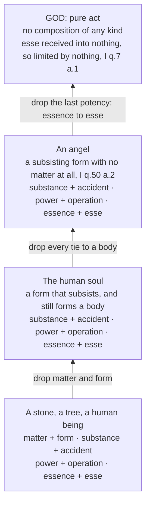

# The Thomistic Synthesis · Lesson 2.1: Act and potency, extended

> ⏱ ~15 min · Module 2: Being: the metaphysics theology runs on · Builds on: [1.3 Sacred doctrine: one science about God](01-03-sacred-doctrine-one-science-about-god.md), [`ancient-medieval-philosophy` 3.3](../../ancient-medieval-philosophy/lessons/03-03-change-privation-potency-and-act.md) · Unlocks: [2.2 Esse and essence: the real distinction](02-02-esse-and-essence-the-real-distinction.md)

## Why this matters

After the Five Ways, the treatise on God is mostly subtraction. God is not a body, not matter and form, not a subject carrying accidents (ST I q.3); and out of those denials come perfection, goodness, infinity, omnipresence, immutability, eternity and unity (qq.4-11). One tool does all the subtracting, and you already own it: act and potency. What Aquinas adds is reach. Aristotle used the pair to explain how a thing changes; Aquinas runs it past matter and past change, until it sorts everything there is into a ladder whose top rung has no potency left in it at all. That rung is called [pure act](../reference.md#pure-act), and it is exactly where theology takes the metaphysics over. Every later course in the dogmatic sequence speaks this vocabulary without stopping to explain it.

## The idea

The distinction itself is assumed here: as Aristotle's answer to Parmenides in [`ancient-medieval-philosophy` 3.3](../../ancient-medieval-philosophy/lessons/03-03-change-privation-potency-and-act.md), and as a position defended against contemporary rivals in [`metaphysics` 2.2](../../metaphysics/lessons/02-02-change-act-and-potency.md).

What this lesson owns is the use Aquinas makes of it once change has been left behind. Ask of anything at all: **is there in it something that receives, and something received?** If there is, the thing is composite, and each such pair is called a *composition*. Count the compositions in a thing and you have measured how far it stands from simplicity. Aquinas uses four, no more, and they stack.

The second move is the one that makes theology possible. Ask why a thing is *only so much*. The answer is never "because of the act it has, taken by itself." Humanity, considered in itself, is not this man or that one; it becomes this one by being received into this matter. Generalise, and you get the axiom this whole course runs on: [an act is limited only by the potency that receives it](../reference.md#act-is-limited-by-potency). Where nothing receives, nothing limits. Aquinas's own image for the limiting case is a whiteness that subsisted all by itself, in no subject at all: the very fact that it is in nothing would set it apart from every whiteness there is.

## Source

ST I q.7 a.1, *Whether God is infinite?*, from the *respondeo* (English Dominican Province translation):

> We must consider therefore that a thing is called infinite because it is not finite. Now matter is in a way made finite by form, and the form by matter. Matter indeed is made finite by form, inasmuch as matter, before it receives its form, is in potentiality to many forms; but on receiving a form, it is terminated by that one. Again, form is made finite by matter, inasmuch as form, considered in itself, is common to many; but when received in matter, the form is determined to this one particular thing. … Now being is the most formal of all things. … Since therefore the divine being is not a being received in anything, but He is His own subsistent being … it is clear that God Himself is infinite and perfect.

Three things to notice. First, limitation runs both ways here, and both directions are one rule: whatever is received is received according to the measure of the receiver. Second, the hinge is the clause about being — *being is the most formal of all things*. Form is what got limited by a receiver in the first half; if existing behaves as form does, then the limitation rule applies to existing too, and the argument can keep running where there is no matter left to run on. Third, look at the grammar of the conclusion. "Infinite" is a negative word — *not finite* — and it is reached by denying a receiver, not by measuring anything.

## The argument

The axiom, in premises, with each source marked:

1. **Act and potency divide being.** Whatever is, is either sheer actuality or a composite of an act and a potency that receives it. *In words:* every real thing either has something in it still waiting to be actualised, or does not. *(Assumed from Module 2's metaphysics, not proved here.)*
2. **Whatever is received is received according to the measure of the receiver.** *In words:* the vessel decides the shape. *(The Source, for matter and form.)*
3. **So an act is limited only by a potency receiving it.** *In words:* nothing is finite merely for being the kind of act it is; it is finite because of what it landed in. *(This general form is the school's formulation, generalising what q.7 a.1 states for matter and form; whether Aquinas demonstrates it or presupposes it is disputed among Thomists.)*
4. **Existing — *esse* — is itself an act, and the most formal of all.** *In words:* a thing's existing is not one more property it has; it is what makes anything in it real at all. *(The Source; argued in [2.2](02-02-esse-and-essence-the-real-distinction.md).)*
5. **Therefore an *esse* received into no essence is limited by nothing: infinite, perfect — and, since there is nothing to mark one unreceived *esse* off from another, unique.** *(The Source; the uniqueness argument is q.11 a.3, taken up in [3.4](03-04-divine-simplicity-and-the-attributes.md).)*

Now [the four compositions](../reference.md#the-four-compositions), each named by what receives what:

- **Matter and form.** Prime matter is in potency to a substantial form and is terminated by the one it gets ([`metaphysics` 2.3](../../metaphysics/lessons/02-03-hylomorphism-and-composition.md)). Bodies only.
- **Substance and accident.** An existing substance is still in potency to further determinations — size, place, knowledge, virtue — which it gains and loses without ceasing to be what it is ([`metaphysics` 2.1](../../metaphysics/lessons/02-01-substance-and-accident.md)).
- **[Power and operation](../reference.md#power-and-operation).** A creature's essence is not its power, and its power is not its operating. Aquinas's argument for the soul (ST I q.77 a.1) is beautifully direct: if the soul's essence just were its power, then whatever has a soul would always be actually performing its vital acts — and you are sometimes asleep. He says the same of angels (q.54 a.1). *In words:* no creature is its own activity, so every creature can be without acting.
- **Essence and *esse*.** The deepest and the last: the nature stands to its own existing as potency to act. [2.2](02-02-esse-and-essence-the-real-distinction.md) gives the argument and the rivals who deny it.

Each composition names a potency; each potency is a limit; remove them in order and you climb.

## The ladder

On [the ladder of beings](../reference.md#the-ladder-of-beings), only the last step is a step into a different kind of thing. The first two subtract ways of being a creature; the third subtracts creaturehood.

## Worked examples

**Example 1 — the machinery on a clean case: you, reading this.** Matter and form: a body organised by a soul that makes it the body it is. Substance and accident: you are five foot something and know some Latin; you were once neither, and are the same substance throughout. Power and operation: you have an intellect right now, and right now you are also using it — two different facts, as q.77 a.1 insists, which is why you survive dreamless sleep. Essence and *esse*: what you are does not account for the fact that you are; nothing in "human being" explains why there is one here. Four receivers, therefore four limits — and notice that the diagnostic question was the same each time.

**Example 2 — where it strains: an angel.** Take matter away. Aquinas does exactly this at ST I q.50 a.2: an angel is a subsisting form, not composed of matter and form at all. Does the machinery stop? The reply to the third objection says no — where there is no matter, there still remains the relation of the subsisting form to its own existence, as of potency to act, and the reply ends by concluding that God alone is pure act. So the deepest composition survives the loss of matter. So does power and operation: an angel's act of understanding is not its substance (q.54 a.1), and its power of understanding is not its essence (q.54 a.3), so an angel is not eternally thinking everything it can think.

Now watch the strain. In q.7 a.2 Aquinas allows that such a form, not received in matter, is *relatively* infinite — unlimited as that nature, since no matter contracts it — while its being is received and contracted to a determinate nature, so it remains absolutely finite. A creature called infinite in any sense is uncomfortable, and he controls it in the replies of that article: no made thing can have its essence be its existence, so no creature is infinite without qualification. That control is the whole weight-bearing wall. If essence and *esse* are not really distinct in an angel, the last rung of the ladder is gone and something else has to keep an angel from being God — which is precisely the dispute [2.2](02-02-esse-and-essence-the-real-distinction.md) owns.

## Watch out

- **Potency is not a small amount of act, and God's infinity is not a large amount.** The infinite of quantity, Aquinas says in the second reply of the Source article, is the infinite of matter, and it is denied of God. Infinity here is the absence of a receiver, not a size.
- **"Pure act" does not mean maximally busy.** It means no potency: nothing in God waiting to be actualised. That is why immutability (q.9) *follows* from it rather than fighting it. A God who never rests would be a God with somewhere to get to.
- **Keep the levels apart.** That God is altogether simple is taught by Lateran IV and by Vatican I (*Dei Filius* ch. 1): a doctrine stated in scholastic vocabulary keeps its own level ([`fundamental-theology` 4.4](../../fundamental-theology/lessons/04-04-the-ladder-of-doctrinal-authority.md)). The fourfold analysis of composition, and the axiom that act is limited only by receiving potency, are **school theses** freely disputed among Catholics — Scotists and Suárezians reject the last composition outright. The Twenty-Four Thomistic Theses of 1914 open with act and potency, but what weight that document carries is a question for [6.2](06-02-leo-xiii-and-the-thomist-revival.md) and [6.5](06-05-what-the-church-has-said-about-thomism.md), and it is no licence to promote the axiom to dogma. Demoting the dogma is the same error running the other way.

## One-liner

> Count what receives in a thing and you have counted its limits; take away the last receiver and you have stopped describing a creature.

## Problems

**P1 (🟢) *(Exegetical.)*** ST I q.54 a.1, *Whether an angel's act of understanding is his substance?*, from the *respondeo* (English Dominican Province translation):

> I answer that, It is impossible for the action of an angel, or of any creature, to be its own substance. For an action is properly the actuality of a power; just as existence is the actuality of a substance or of an essence. Now it is impossible for anything which is not a pure act, but which has some admixture of potentiality, to be its own actuality: because actuality is opposed to potentiality. But God alone is pure act. Hence only in God is His substance the same as His existence and His action.

(a) The passage asserts two act-and-potency pairs. Name both and quote the words that fix each.
(b) State in one sentence the general principle carrying the inference, and say what it establishes about every creature's acting. Two sentences per part.

**P2 (🟡) *(Exegetical.)*** An invented paragraph from a parish newsletter (nobody wrote this; it is built for the problem):

> "Ever wonder what the old phrase 'God is pure act' means? It means God is pure activity — the busiest being there is, never resting for an instant, always at full effort. And that is the difference between him and us. We are a little bit actual; some people are more actual than others; God is simply further along the same line, actual to the highest degree, the way the ocean is more water than a cup is."

(a) Name the two distinct confusions, quoting the words that carry each.
(b) For each, give the sentence from this lesson's argument or Source that blocks it. 150 words or fewer in total.

**P3 (🔴, optional) *(Apologetic.)*** A critic denies premise 3. On his account a finite act is finite of itself: a form has its own intrinsic degree of perfection, so this angel's being is being of just this intensity whether or not anything receives it. Being comes in degrees, and God's is the maximal one; no receiving potency is needed to explain any limit. (The Scotist tradition presses this line, and Suárez independently denies a real composition of essence and *esse* — see [2.2](02-02-esse-and-essence-the-real-distinction.md).)

(a) State that objection at its strongest in your own words, and say what it thereby no longer needs to prove.
(b) Give the Thomist reply from the Source, and name the premise the critic will deny in return. 150 words or fewer in total.

Solutions

**P1** *(Exegetical.)*

**Must hit, strict (a):** (i) **power and its operation** — "an action is properly the actuality of a power"; (ii) **substance or essence and its existence** — "existence is the actuality of a substance or of an essence." Both are act-potency pairs: in each, the second term is the actuality of the first.
**Must hit, strict (b):** the principle is that *actuality is opposed to potentiality, so whatever has any admixture of potency cannot be its own actuality* — with the minor that God alone is pure act. What it establishes: in every creature, acting is really distinct from the power to act and from the creature itself, so no creature is identical with its own operation (or its own existence); a creature can be without acting.
**Wrong turns:** reading "God alone is pure act" as the passage's conclusion — it is a premise, taken from earlier articles, and the conclusion is the last sentence. Treating the passage as *proving* that essence and existence differ in creatures: it leans on that, already shown at I q.3 a.4, and the *sed contra* says so. Inferring that an angel therefore does not understand — the claim is that its understanding is not its substance, not that it has none.
**Model answer:** (a) Power and operation: "an action is properly the actuality of a power." Essence (or substance) and existence: "existence is the actuality of a substance or of an essence." (b) Nothing with any potency in it can be its own actuality, since act and potency are opposed, and God alone has none. So in every creature power, operation and existence come apart: the creature has its acting rather than being it, which is why it can be there without doing anything.

---

**P2** *(Exegetical.)*

**Must hit, strict (a):** (i) **"act" read as activity or effort** — "pure activity," "the busiest being there is," "never resting," "full effort." *Actus* means actuality, not exertion. (ii) **limitation read as quantity, on one scale shared with creatures** — "a little bit actual," "more actual than others," "further along the same line," "the ocean is more water than a cup." This makes the difference between God and us a difference of amount within a common kind, which is univocal God-talk.
**Must hit, strict (b):** against (i): pure act means *no potency*, nothing in God waiting to be actualised — which is why immutability follows from it; busyness is a creature's operation, and operation is distinct from essence in every creature (q.54 a.1, q.77 a.1). Against (ii): the Source makes limitation come from a *receiver*, not from an amount, and the same article denies quantitative infinity of God, since the infinite of quantity is the infinite of matter. God is not more of what we are; he is *esse* not received at all.
**Wrong turns:** calling "God is pure act" itself the error. Answering that God is "not a being at all" — Aquinas's claim is the opposite, that God is subsistent being. Objecting to the ocean image merely for being an image: images are fine, and this one fails because of the single scale it implies. Naming one confusion twice under two labels.
**Model answer:** The first confusion is "act" as busyness — "pure activity," "never resting," "full effort." Pure act means no potency, not high output; that is why q.9 derives immutability from it, and in any case a creature's activity is distinct from its essence and power (q.77 a.1), so busyness measures creatures, not God. The second is quantity on a shared scale — "a little bit actual," "further along the same line," the ocean and the cup. ST I q.7 a.1 makes a thing finite by what receives its act, not by how much it has, and the same article rules out quantitative infinity in God, because the infinite of quantity is the infinite of matter. God is not more of what we are; his being is received into nothing.

---

**P3** *(Apologetic.)*

**Must hit, strict (a) — graded first:** the objection must appear as a real position, not a mistake. Limitation is **intrinsic** to an act: a form or a being is of a certain degree by what it is, so no receiving principle is needed to account for finitude; being admits of intensive degrees, and God is the maximal degree. What it no longer needs to prove: any real composition of essence and *esse* in creatures. The distance between creature and God can be carried by degree alone, so the critic can take the distinction to be formal (Scotus) or conceptual (Suárez) and still deny that any creature is God — and he need not rely on an axiom Aquinas nowhere states in that general form. Credit for noting that the objection concedes God's infinity rather than attacking it.
**Must hit (b):** the reply must run through the Source's claim that being is *the most formal of all things* — *esse* is not one nature among others with degrees of its own, but the act by which any nature is at all; so a limit in it cannot come from what it is, and must come from a receiver. Aquinas's separated-whiteness case is the test: an act in nothing is not thereby one instance among others. The premise the critic denies is exactly premise 4 as the Thomist reads it — that existing is an act of unlimited perfection in itself, rather than a nature that comes in intensities.
**Wrong turns:** answering from authority — that the Church recommends Aquinas, or that the Twenty-Four Theses teach the axiom. The axiom is a school thesis and the recommendation of a master settles no school thesis. Stating the objection as "God is finite" or as a denial of creation. Claiming q.7 a.1 refutes it outright: the article states the Thomist premise rather than proving it against this rival, which is why the dispute is live.
**Model answer:** (a) Finitude needs no explanation outside the act itself. A form or a being has an intrinsic degree, so this angel's being is simply being of that intensity, received or not; God is that same perfection at its maximum. The gain is that no real composition of essence and existence is required to keep creatures from being God — a formal or conceptual distinction suffices — and no general axiom about receiving potencies is needed. (b) The Thomist replies that being is the most formal of all things: *esse* is not a nature with intensities but the act of every nature, so a limit in it has to be imposed by a receiver, as whiteness subsisting in nothing would not be one whiteness among many. The critic denies precisely that premise, and the dispute moves to 2.2.

## Flashback

**From Lesson [1.2](01-02-reading-a-whole-question.md) (The article in depth: reading a whole question):** *(Exegetical — close reading.)* ST I q.15 a.1 asks whether there are ideas. Its body concludes that ideas must be supposed in the divine mind, since the world was not made by chance but by God acting through intellect, and in such an agent the form of what is to be made pre-exists. Here is its first objection with the reply to it (English Dominican Province):

> Objection 1. It seems that there are no ideas. For Dionysius says (Div. Nom. vii), that God does not know things by ideas. But ideas are for nothing else except that things may be known through them. Therefore there are no ideas.
>
> Reply to Objection 1. God does not understand things according to an idea existing outside Himself. Thus Aristotle (Metaph. ix) rejects the opinion of Plato, who held that ideas existed of themselves, and not in the intellect.

(a) Name the practice at work in the reply, quote the words that carry it, and say exactly what Aquinas concedes to the objection and what he denies. Three sentences at most. (b) 1.2 called that practice exegetically expensive. State the cost here, in one sentence.

Solution

**Must hit, strict (a):** **reverent interpretation** — a recognized authority's words are kept and a sense is supplied in which they are true, instead of being contradicted. The words that carry it are "according to an idea **existing outside Himself**"; that qualification is the whole reply. **Conceded:** there are no ideas subsisting apart from the divine intellect, which is what the reply takes Dionysius's denial to amount to, with Aristotle's rejection of Plato brought in as backing. **Denied:** the objection's step from there to the conclusion that there are no ideas at all, since the body has just put them in the divine mind. Credit for noticing that the objection's second premise — that ideas exist only so things may be known through them — is the other thing the article splits, the body allowing a form apart from the thing to be either the type on which it is made or a principle of knowing it.

**Must hit, strict (b):** what you have learned is Aquinas's position, not Dionysius's — the reply shows that Aquinas can accept the sentence, and tells you nothing about what its author meant in denying that God knows by ideas.

**Wrong turns:** reading the reply as a refutation of Dionysius, when it never says he is wrong; reading it as agreement that there are no ideas, which contradicts the body of the article; treating the objection as a straw man rather than a position — it is an authority's sentence plus a premise about what ideas are for; taking "Aristotle rejects Plato" to be the reply's main work, when it is support for the sense being supplied.

**Model answer:** (a) Reverent interpretation. The load is carried by "according to an idea existing outside Himself": Aquinas grants that there are no self-subsisting ideas apart from the divine intellect, which is how he reads the denial, and rejects only the move from that to there being no ideas at all, since the body places them in God's mind. (b) You now know what Aquinas holds and not what Dionysius held; his Dionysius is not a report of Dionysius.

## Connections

- **Backward:** act and potency as Aristotle's tool for change ([`ancient-medieval-philosophy` 3.3](../../ancient-medieval-philosophy/lessons/03-03-change-privation-potency-and-act.md)) and as a defended position ([`metaphysics` 2.2](../../metaphysics/lessons/02-02-change-act-and-potency.md)); Aquinas's join of act with existing ([`ancient-medieval-philosophy` 7.2](../../ancient-medieval-philosophy/lessons/07-02-aquinas-essence-and-existence.md)). [1.3](01-03-sacred-doctrine-one-science-about-god.md) explained why a science of God treats such things at all.
- **Forward:** [2.2](02-02-esse-and-essence-the-real-distinction.md) argues the last composition and meets its rivals; [2.3](02-03-participation.md) turns the limitation axiom into participation; [3.2](03-02-the-first-and-second-ways-inside-the-system.md) needs "motion" as reduction from potency to act, and [3.4](03-04-divine-simplicity-and-the-attributes.md) runs the whole subtraction. [5.3](05-03-the-human-soul-in-the-system.md) puts the soul's rung of the ladder under pressure.
- **Sideways:** the levels used in the third Watch out bullet come from [`fundamental-theology` 4.4](../../fundamental-theology/lessons/04-04-the-ladder-of-doctrinal-authority.md). Substance and accident, the composition this lesson treats in one line, is the machinery `sacraments-and-liturgy` will need for the Eucharist, and the essence-*esse* composition is what `christology` argues over in the one *esse* of Christ.
