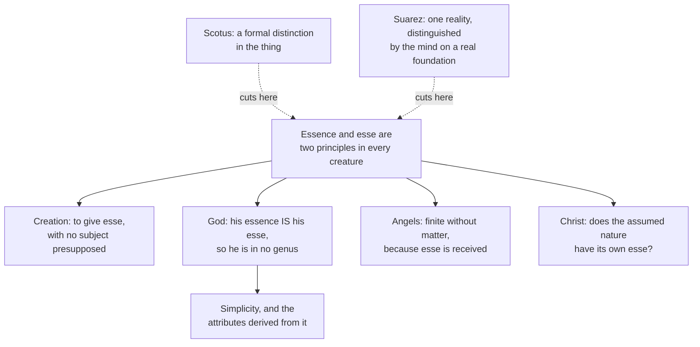

# The Thomistic Synthesis · Lesson 2.2: Esse and essence: the real distinction

> ⏱ ~15 min · Module 2: Being: the metaphysics theology runs on · Builds on: [2.1 Act and potency, extended](02-01-act-and-potency-extended.md), [`ancient-medieval-philosophy` 7.2](../../ancient-medieval-philosophy/lessons/07-02-aquinas-essence-and-existence.md), [`metaphysics` 2.5](../../metaphysics/lessons/02-05-essence-and-existence.md) · Unlocks: [2.3 Participation](02-03-participation.md), [3.4 Divine simplicity and the derivation of the attributes](03-04-divine-simplicity-and-the-attributes.md)

## Why this matters

You have met this distinction twice. [`ancient-medieval-philosophy` 7.2](../../ancient-medieval-philosophy/lessons/07-02-aquinas-essence-and-existence.md) gave the *De Ente et Essentia* argument and flagged the step its readers fight over; [`metaphysics` 2.5](../../metaphysics/lessons/02-05-essence-and-existence.md) put the three live positions on the table — Thomist, Scotist, Suárezian — and handed both the adjudication and the systematic role here. This is that lesson, and its question is not the abstract one. It is: **what does the theology actually rest on this for?**

Four things, as it turns out: what creation is, how God gets identified, why a creature with no matter is still finite, and what is going on in the Incarnation. That is a great deal of weight for one thesis. Which raises the discipline this course never drops — a thesis can be load-bearing for a whole school and still be freely disputed among Catholics. This one is.

## The idea

Two sentences of reload. The argument runs: you can grasp what a thing is without knowing that it is, so in everything but (at most) one being, essence and [the act of existing](../reference.md#the-act-of-existing) — *esse* — are two principles of one thing, essence standing to *esse* as potency to act. All three parties agree the creature need not have existed; they disagree about whether that gap is a seam in the thing (the Thomist [real distinction](../reference.md#real-distinction)), a [formality in it](../reference.md#formal-distinction), or a [distinction the mind draws on a real foundation](../reference.md#distinction-of-reason-with-a-foundation-in-the-thing).

Now the thing this course adds, without which the distinction stays a remark about concepts. **The act of existing is the act of all acts.** Aquinas's sharpest statement is in *De Potentia* q.7 a.2 ad 9, paraphrased: *esse* is the most perfect of all things, because act is always more perfect than potency. Take any determinate form — humanity, fieriness. You can consider it as a potency in matter, or as within the power of an agent, or as a concept in a mind; what makes it actually existing is nothing but having *esse*. So, in his phrase, *esse* is *actualitas omnium actuum*, the actuality of all acts, and for that reason the perfection of all perfections.

The same reply adds the move that matters most. Nothing can be added to *esse* from outside, because outside being there is nothing but non-being. *Esse* is therefore not narrowed by some further form laid over it. It is narrowed only by the essence that receives it. [2.1](02-01-act-and-potency-extended.md) gave the rule — an act is limited by the potency that receives it — and here it runs at the deepest level: a thing is finite not because it is made of stuff, but because its very existing is received into *this* nature. Matter is not what makes a creature small. Reception is.

That is why the distinction is an instrument and not an observation. It gives theology a way to say what a creature is that does not mention bodies.

## Source

*Summa Theologiae* I q.61 a.1, "Whether the angels have a cause of their existence?", the *respondeo* (English Dominican Province translation, public domain):

> It must be affirmed that angels and everything existing, except God, were made by God. God alone is His own existence; while in everything else the essence differs from the existence, as was shown above (I:3:4). From this it is clear that God alone exists of His own essence: while all other things have their existence by participation. Now whatever exists by participation is caused by what exists essentially; as everything ignited is caused by fire. Consequently the angels, of necessity, were made by God.

Watch the joints. The distinction is not argued here; it is *cited* — "as was shown above" points back to q.3 a.4, inside the treatise on God. What the distinction does here is serve as a middle term: it converts "not God" into "exists by participation," and participation into "caused." An entire doctrine of creation is being drawn out of a distinction in eight lines. And the image that carries it — fire and the ignited thing — is the participation image that [2.3](02-03-participation.md) takes up.

## The argument

The *respondeo* in premises, with each premise's source marked, since in this course that marking is half the exegesis:

1. **God alone is his own existence.** *(ST I q.3 a.4, established earlier in the* Summa*, not here.)* In words: in one case, and only one, what the thing is and that it is are not two.
2. **In everything else, essence differs from existence.** *(Same article; the real distinction, taken as settled.)* In words: every other being has its existing rather than being it.
3. **Whatever has existence without being existence has it by participation.** *(Module 2's participation doctrine,* [2.3](02-03-participation.md)*.)* In words: it holds a share of something it does not simply *be*.
4. **Whatever is by participation is caused by what is such essentially** — as everything ignited is caused by fire. In words: a borrowed perfection traces back to something that has it in its own right.
5. **Angels are not God.** ∴ **Angels were made by God.**

Notice how little of this is about angels. Premise 2 is doing the work, and it is about every creature whatever. That is the pattern to carry into the rest of the course: the real distinction is rarely the conclusion of a Thomist argument and almost always a premise in one.

**The four loads it carries.**

- **Creation.** To create is to give *esse* absolutely, with no subject presupposed — which is why creation is not a change and needs no "before" ([5.1](05-01-creation-and-conservation.md) owns this, and the parallel argument at q.44 a.1).
- **The identification of God** as [subsisting being itself](../reference.md#subsisting-being-itself). Because the members of any genus share an essence and differ in existence, and in God they do not differ, God falls in no genus at all (q.3 a.5) — hence no definition, and no demonstration of him except from effects. Simplicity and the attributes follow in [3.4](03-04-divine-simplicity-and-the-attributes.md).
- **Angelic finitude.** An angel has no matter and is still not God, because its existing is received (Example 1).
- **The Incarnation.** Whether the assumed human nature has its own *esse* becomes a real question, because *esse* is now something a nature can have or lack (Example 2; the doctrine belongs to [`christology`](../../christology/syllabus.md)).

**The disputed order, which Thomists have not settled.** Can the real distinction be demonstrated *before* God's existence is reached, or only after? On the earlier route, the uniqueness step of *De Ente* ch. 4 (chapter numbering differs between editions) does real work on its own: a nature that is nothing but existing has no difference, no matter and no recipient by which a second one could be told from it, so at most one thing can be its own *esse* — and any being that is one among many of its kind is demonstrably not that one. On the later route, that step yields only a conditional; what you actually have before reaching God is the phoenix observation, which is about understanding, and a distinction in things arrives only once a being whose essence is its *esse* has been shown to exist. The stake is structural: on the later reading *De Ente* ch. 4 analyses creatures rather than opening an independent road to God, and the Five Ways carry the whole evidential weight. The *Summa*'s own order is a datum both sides claim, and settles nothing by itself: the order of teaching and the order of proof are not the same.

## The derivation

The dashed edges matter. Neither rival denies creation, divine simplicity or the contingency of creatures; both reach them by other routes. What they deny is that *this* premise is what gets you there.

## Worked examples

**Example 1 (clean: an angel, against Aristotle).** In q.61 a.1 the second objection quotes the Philosopher: a substance that is a form without matter straightway has being of itself and has no cause of its being. The reasoning is exactly Aristotle's — what needs a cause of its being is a compound, something got by educing a form from matter; a pure form has nothing to be educed. So immaterial means uncaused.

Run the machinery. Aquinas concedes the angel is a subsisting form; he denies the inference. His reply distinguishes kinds of cause: an angel has no formal cause of its existence, and no agent cause of the sort that works by moving matter from potency to act — but it has a cause productive of its whole substance. That third kind of causing is creation, and it is available precisely because there is a composition in the angel that has nothing to do with matter. Aristotle's principle is left standing and rendered harmless: it is about the only kind of causing he recognized.

**Example 2 (hard: the being of Christ, where the machinery strains).** One divine person, two natures. If in every creature a nature stands to a received *esse* as potency to act, does the assumed human nature bring its own *esse* with it? Aquinas answers in ST III q.17 a.2, "Whether there is only one being in Christ?", that there is one. But the school divided over it: some Thomists hold a secondary, created *esse* of the human nature alongside the personal *esse* of the Word, and a late disputed article on the union of the Incarnate Word is read by some as allowing it — its place in Aquinas's development is argued over, and this lesson does not settle it.

Mark the levels while you are here, because the case is designed to trip you. That the Word is one person in two natures is defined dogma (Chalcedon). *How many acts of existing there are in Christ* is a [school thesis](../reference.md#school-thesis), disputed among Thomists, and nothing in the definition settles it. [`christology`](../../christology/syllabus.md) owns the doctrine; what this lesson owns is the observation that the question only becomes askable once *esse* is something a nature can be said to have.

## Watch out

- **You might think that because the distinction is a school thesis, everything stated in its vocabulary is one too.** It is not. That God is one simple and unchangeable substance is taught by Lateran IV and by Vatican I's *Dei Filius*, ch. 1, and sits at the top of the ladder in [`fundamental-theology` 4.4](../../fundamental-theology/lessons/04-04-the-ladder-of-doctrinal-authority.md) — a doctrine phrased in scholastic terms keeps its own level. The error runs both ways, and both directions are graded strictly: promoting the [real distinction](../reference.md#real-distinction) to dogma because Aquinas held it and the Church commends him ([6.5](06-05-what-the-church-has-said-about-thomism.md) gives the actual acts), or demoting simplicity to one school's opinion because a Thomist says it in Latin.
- **You might think a "real" distinction means two things.** No party holds that. Essence and *esse* are two principles of one being, as matter and form are; neither is an item that could sit somewhere on its own. If your statement of the view lets the essence exist while waiting to be switched on, you have stated a caricature ([`metaphysics` 2.5](../../metaphysics/lessons/02-05-essence-and-existence.md)).
- **You might think the Source proves the distinction from the angels' case.** Read it again: it *cites* q.3 a.4 and applies it. Getting this backwards is how students end up with the circular version of the argument that the disputed-order question is about.

## One-liner

> A creature is not finite because it is made of matter but because its very existing is received into a nature that is not it — and from that one seam Aquinas draws creation, the identification of God, and the finitude of angels.

## Problems

**P1 (🟢) *(Exegetical.)*** Close reading. From the same question as the Source, ST I q.61 a.1 (English Dominican Province):

> **Objection 2.** Further, the Philosopher says (Metaph. viii, text. 16) that if any substance be a form without matter, "straightway it has being and unity of itself, and has no cause of its being and unity." But the angels are immaterial forms, as was shown above (I:50:2). Therefore they have no cause of their being.
>
> **Reply to Objection 2.** Substances that are subsisting forms have no 'formal' cause of their existence and unity, nor such active cause as produces its effect by changing the matter from a state of potentiality to actuality; but they have a cause productive of their entire substance.

(a) The reply denies two kinds of cause and affirms a third. Name all three, and say why the two denied are exactly the ones the objection's principle covers. (b) Does the reply reject the objection's citation of I:50:2? Say which claim in the objection it actually rejects, and which earlier article of the *Summa* the rejection leans on. Two sentences per part.

**P2 (🟡) *(Exegetical (a) · Evaluative (b).)*** (a) The Source says essence differs from existence in everything but God "as was shown above (I:3:4)." Say what that tells you about the order in which the *Summa* establishes the distinction, and what it does not tell you about the order of proof. Two sentences. (b) Thomists divide over whether the real distinction can be demonstrated before God's existence is reached or only afterwards. Give the strongest reason on each side, and say what a defender of the earlier route must make good. 150 words or fewer; any verdict.

**P3 (🔴, optional) *(Exegetical — strict.)*** Assign each claim its level on the ladder of [`fundamental-theology` 4.4](../../fundamental-theology/lessons/04-04-the-ladder-of-doctrinal-authority.md), naming the act or text that fixes it — or saying that no act does. For (iv), say instead whether the inference holds, and why. One sentence each; do not overstate in either direction.

(i) In every creature, essence and the act of existing are really distinct.
(ii) God is one simple and altogether unchangeable substance.
(iii) In Christ there is only one act of existing.
(iv) A Catholic who follows Suárez on (i) is dissenting from the Church, since the Church has made Aquinas its master.

Solutions

**P1** *(Exegetical, strict.)*

**Must hit, strict (a):** the reply denies (1) a **formal** cause of the angel's existence and unity, and (2) an **active cause of the sort that works by changing matter** from potency to act; it affirms (3) a cause **productive of the angel's entire substance** — creation, not change. The objection's principle is Aristotle's, and it recognizes only causes of those first two kinds, since for him what needs a cause of its being is a matter-form compound whose form is educed from matter. Take matter away and both denied causes go with it, which is why the principle looks decisive — and why affirming a third kind of causing leaves Aristotle's claim standing while removing its force.

**Must hit, strict (b):** no, the reply concedes I:50:2 entirely — angels really are subsisting forms with no matter. What it rejects is the objection's **inference**, that having no matter entails having no cause of being. The rejection leans on **ST I q.3 a.4**, cited in the same article's *respondeo*: God alone is his own existence, so every other being, matter or no matter, has its existence from another.

**Wrong turns:** reading the reply as denying that angels are immaterial (it does not, and q.50 a.2 stands); collapsing the two denied causes into one, which loses the point that "no formal cause" and "no cause by way of matter" are separate concessions; treating "cause productive of its entire substance" as a third species of *change* rather than as creation.

**Model answer:** (a) Denied: a formal cause of its existence and unity, and an agent cause working by educing form from matter. Affirmed: a cause productive of the whole substance. Aristotle's principle covers only the first two, since for him a cause of being is needed where a form is educed from matter; with no matter there is nothing for either to do. (b) It concedes I:50:2 and rejects only the inference from "immaterial" to "uncaused," on the strength of q.3 a.4: God alone is his own existence, so anything else has its existence from another, whether or not it has matter.

---

**P2** *(Exegetical (a) · Evaluative (b).)*

**Must hit, strict (a):** the back-reference shows that in the *Summa*'s order the distinction is established inside the treatise on God, at q.3 a.4, and is simply applied in q.61 — so it is not proved from the angelic case. It tells you nothing about the order of *proof*: the order of teaching a beginner and the order in which claims support one another are different orders, and q.3 a.4 itself argues from God's being first efficient cause, which q.2 a.3 had reached.

**Must hit, any verdict (b):**
- State the earlier route's resource: *De Ente*'s uniqueness step, which argues that a nature that is nothing but existing has no difference, no matter and no recipient by which a second could be distinguished, so at most one thing can be its own *esse*; any being that is one among many of its kind is therefore not it.
- State the later route's objection: the premise everyone starts from (grasping the essence leaves existence open) is about understanding, so before a being whose essence is its *esse* has been shown to exist, the uniqueness step delivers a conditional, not a distinction in things.
- Name the burden on the earlier route: show that the uniqueness argument is categorical, not conditional — i.e. that it works on the nature *existence alone* without presupposing that such a being is actual.
- Say what turns on it: whether *De Ente* ch. 4 is an independent route to God or an analysis of creatures that presupposes one.

**Wrong turns:** settling it by the *Summa*'s order of questions, which is the order of teaching; treating the later route as a denial of the real distinction (it is a claim about when it is secured); saying the earlier route is "circular" without locating the circle in a specific premise.

**Model answer (b), one of several acceptable:** The earlier route leans on the uniqueness argument: existence taken alone admits no difference, no matter and no recipient, so nothing could distinguish a second such being; any being that is one of many of its kind is therefore not its own *esse*, and the distinction holds in the thing before God is reached. The later route answers that the only premise in hand at that stage is epistemic — the essence can be grasped with existence left open — and that what is really established is a conditional: *if* anything is its own *esse*, only one thing is. A distinction in things arrives when a being of that description is shown to exist. The earlier route must therefore show the uniqueness step is categorical, resting on what "existence alone" excludes rather than on a being already reached. Verdict: the earlier route is defensible, but only on that showing.

---

**P3** *(Exegetical, strict.)*

**Must hit, strict:**
- **(i) Freely disputed among Catholics** — the bottom rung. No magisterial act proposes it; it is a school thesis, and Scotists and Suárezians hold otherwise in good standing.
- **(ii) Divinely revealed and proposed as such** — the top rung, fixed by solemn conciliar acts: Lateran IV and Vatican I, *Dei Filius*, ch. 1. Scholastic vocabulary does not lower a doctrine's level.
- **(iii) A school thesis, disputed among Thomists.** What sits at the top rung is the hypostatic union, defined at Chalcedon; the count of acts of existing is not part of that definition, and the doctrinal question belongs to [`christology`](../../christology/syllabus.md).
- **(iv) False.** The Church's recommendation of Aquinas belongs to the ordinary magisterium and to Church law; it commends a master and a method and does not raise his school's theses to a binding level (6.5 handles the acts themselves).

**Wrong turns:** promoting (i) because Aquinas held it and the Church commends him — the error the course names first; demoting (ii) to a school opinion because it is stated in Thomist terms — the same error running the other way; treating (iii) as defined because the union it describes is defined.

**Model answer:** (i) Freely disputed; no act of the Magisterium proposes it. (ii) Divinely revealed and solemnly taught — Lateran IV and *Dei Filius*, ch. 1; the scholastic phrasing changes nothing. (iii) A disputed school thesis; Chalcedon defines the one person in two natures, not the number of acts of existing. (iv) False: the recommendation of Aquinas is ordinary magisterium and Church law about a master and a method, not a definition making his school's theses binding.

## Flashback

**From Lesson [1.3](01-03-sacred-doctrine-one-science-about-god.md) (Sacred doctrine: one science about God):** *(Exegetical — diagnose.)* An invented notice for a reading group (nobody wrote this; it is built for the problem):

> "Theology is the queen of the sciences, and the title has teeth. Since she judges every other science, the theologian can settle a disputed question in physics or in history out of his own principles: if a result contradicts the faith it is false, and there is no need to go through the argument. And since she takes her principles immediately from God, she has no use for philosophy at all — the philosophy in the *Summa* is thirteenth-century scaffolding, and we can take it down."

Name the two errors, and for each name the article of ST I q.1 whose words are being abused and give the correction. Two sentences per error.

Solution

**Must hit, strict:**
1. **The judging clause, a.6 ad 2, read as a productive power.** That reply says this science has no concern to prove the principles of other sciences but only to judge of them, and that whatever is found in them contrary to a truth of this science is to be condemned as false. The norm is **negative and falls on conclusions**: it supplies no premises and decides no question of physics or history, and what follows from a revealed truth is only that a demonstration against it is unsound somewhere — which is a reason to work through the argument, not a warrant for skipping it. Theology's approval adds nothing to a proof, and a conclusion is still graded by its weakest premise.
2. **The handmaiden clause, a.5 ad 2, read as making philosophy dispensable.** The same reply that denies theology stands in need of philosophy gives a standing reason for using it: not the science's "own defect or insufficiency" but "the defect of our intelligence," which is more easily led from what is known by natural reason to what is above reason. The defect is the learner's and does not expire with the thirteenth century, so the use is permanent rather than scaffolding — and a.8 ad 2's rule that grace does not destroy nature but perfects it points the same way.

**Wrong turns:** correcting the first error by denying that theology judges other sciences at all, which contradicts a.6 ad 2 and is the mirror mistake; letting the first sentence pass because Aquinas does call this science wisdom — wisdom there means judging by the highest cause, not jurisdiction over another science's premises; defending philosophy's place by its usefulness in apologetics, when the reply's stated reason is how our minds learn; naming "queen of the sciences" itself as the error.

**Model answer:** The first error abuses a.6 ad 2: judging is a negative norm over other sciences' conclusions, and this science has no concern to prove their principles. So it licenses saying that a demonstration against a revealed truth has a flaw in it, and obliges you to find the flaw rather than excusing you from the argument. The second abuses a.5 ad 2: that reply denies philosophy is a higher science on which theology depends, while giving a reason for using it that cannot date — not theology's insufficiency but the defect of our intelligence, which is led from what reason knows to what is above reason.

## Connections

- **Backward:** [2.1](02-01-act-and-potency-extended.md) gave the rule that an act is limited by the potency receiving it; this lesson runs it on the deepest act there is. The argument and its history are [`ancient-medieval-philosophy` 7.2](../../ancient-medieval-philosophy/lessons/07-02-aquinas-essence-and-existence.md); the three-way dispute as a live contemporary question, with the Kantian and Fregean objection, is [`metaphysics` 2.5](../../metaphysics/lessons/02-05-essence-and-existence.md).
- **Forward:** [2.3](02-03-participation.md) unpacks the Source's "by participation" and its fire image; [3.4](03-04-divine-simplicity-and-the-attributes.md) uses q.3 a.4 and a.5 as the hinge of the whole treatise on God; [5.1](05-01-creation-and-conservation.md) turns "to give *esse*" into a doctrine of creation and conservation. [`trinity-and-god`](../../trinity-and-god/syllabus.md) and [`creation-grace-last-things`](../../creation-grace-last-things/syllabus.md) assume all of it; [`christology`](../../christology/syllabus.md) takes up the one *esse* of Christ.
- **Sideways:** Scotus's rival account of being, from which his formal distinction and his univocity both flow, is [`ancient-medieval-philosophy` 8.2](../../ancient-medieval-philosophy/lessons/08-02-scotus-the-univocity-of-being.md), and it returns in [4.4](04-04-analogy.md) as the standing alternative to analogy. The habit of asking which act fixes a claim's level is [`fundamental-theology` 4.4](../../fundamental-theology/lessons/04-04-the-ladder-of-doctrinal-authority.md), and [6.5](06-05-what-the-church-has-said-about-thomism.md) applies it to Thomism as a whole.
