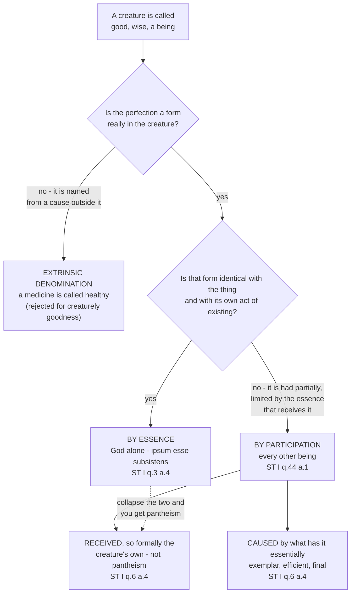

# The Thomistic Synthesis · Lesson 2.3: Participation

> ⏱ ~15 min · Module 2: Being: the metaphysics theology runs on · Builds on: [2.1 Act and potency, extended](02-01-act-and-potency-extended.md), [2.2 Esse and essence: the real distinction](02-02-esse-and-essence-the-real-distinction.md) · Unlocks: [2.4 The transcendentals](02-04-the-transcendentals.md), [3.3 The Third, Fourth and Fifth Ways](03-03-the-third-fourth-and-fifth-ways.md)

## Why this matters

One sentence runs under every course downstream of this one: everything other than God has its being from God, and yet what it has is really its own. Creation, conservation, grace, and the whole theory of how divine names work lean on it — and on its face it contradicts itself. **Participation** is Aquinas's name for why it does not. It is also the doctrine most often mangled from a pulpit, in one direction ("you are a spark of the divine") or the other ("God handed out being and stepped back"). The machinery below stops both.

## The idea

Put a bar of iron in a fire. The iron is hot; the fire is hot. But the heat is in them differently. The fire does not *get* hot — being hot is what a fire is, and there is no moment when a fire is waiting to be heated. The iron does get hot, from the fire, to the degree iron can take, and it cools when the fire goes out. Aquinas uses exactly that image:

> "For whatever is found in anything by participation, must be caused in it by that to which it belongs essentially, as iron becomes ignited by fire." (ST I q.44 a.1)

So there are three ways a thing can be called good, or wise, or a being.

**[By essence](../reference.md#being-by-essence).** The thing *is* the perfection: no receiver, nothing received, nothing falling short.

**[By participation](../reference.md#participation).** The thing *has* the perfection, received from something that is it, in a measure set by what the receiver is. [2.1](02-01-act-and-potency-extended.md) gave the principle: [an act is limited only by the potency that receives it](../reference.md#act-is-limited-by-potency). [2.2](02-02-esse-and-essence-the-real-distinction.md) gave the receiver: in every creature the essence is really other than the *esse*, the act of existing, and stands to it as potency to act. Together they give participation its strict Thomist form. A dog's existing is dog-shaped not because God rationed it, but because a dog is what is doing the existing.

**[By extrinsic denomination](../reference.md#extrinsic-denomination).** The thing does not have the perfection at all and is named from something else that does: a medicine is called healthy because it causes health in an animal, not because health is in the bottle. Keep this option in view — half the errors about participation are really the claim that creaturely goodness is nothing but extrinsic denomination, the reading of divine names [4.3](04-03-the-names-of-god.md) has to refuse.

[Two conditions](../reference.md#the-two-conditions-of-participation) define participation and both must hold. What is participated is **caused** by what has it essentially. And it is **received**, which makes it formally the receiver's own — the heat really is in the iron. Drop the first and you get a world of independent goods; drop the second and you get pantheism.

Aquinas did not invent the word. Plato's things are F by participating in a separate Form ([`ancient-medieval-philosophy` 2.1](../../ancient-medieval-philosophy/lessons/02-01-the-forms-and-what-goes-wrong-with-them.md)), and Plotinus made the chain of participations a procession from the One ([4.4](../../ancient-medieval-philosophy/lessons/04-04-plotinus-the-one-intellect-and-soul.md)). It reached Aquinas through two Christian channels: the Dionysian corpus, written around 500, whose language of the Good pouring itself out he quotes constantly (the corpus and its false attribution belong to [`patristics`](../../patristics/syllabus.md)); and the [*Liber de causis*](../reference.md#liber-de-causis), a short book of propositions on the first cause that the schools read as Aristotle's. Aquinas commented on it in 1272 and, with William of Moerbeke's Latin version of Proclus's *Elements of Theology* in front of him, said the book was excerpted from Proclus — a working theologian correcting an attribution by reading.

## Source

ST I q.6 a.4, "Whether all things are good by the divine goodness?" (English Dominican Province). First the *sed contra*:

> "All things are good, inasmuch as they have being. But they are not called beings through the divine being, but through their own being; therefore all things are not good by the divine goodness, but by their own goodness."

Then the close of the *respondeo*, after Aquinas has laid out Plato's separate Ideas:

> "Although this opinion appears to be unreasonable in affirming separate ideas of natural things as subsisting of themselves — as Aristotle argues in many ways — still, it is absolutely true that there is first something which is essentially being and essentially good, which we call God … Hence from the first being, essentially such, and good, everything can be called good and a being, inasmuch as it participates in it by way of a certain assimilation which is far removed and defective.
>
> Everything is therefore called good from the divine goodness, as from the first exemplary, effective, and final principle of all goodness. Nevertheless, everything is called good by reason of the similitude of the divine goodness belonging to it, which is formally its own goodness, whereby it is denominated good. And so of all things there is one goodness, and yet many goodnesses."

Practise here what [1.2](01-02-reading-a-whole-question.md) teaches about the *sed contra*. It flatly denies that things are good by the divine goodness — and Aquinas's own answer does not endorse it. He says *both*: from the divine goodness, and by a goodness formally each thing's own. The *sed contra* was pushing back on the objections, not stating the conclusion.

## The argument

The *respondeo* of q.6 a.4 in numbered premises. This is where Aquinas keeps Plato's machinery and throws away Plato's furniture.

1. **Some things are named from something outside them.** A thing is called "placed" from place, "measured" from measure. *In words:* certain labels report a relation, not a form in the thing.
2. **Plato extended that pattern to absolute terms.** He posited separate Ideas — of man, horse, being, one — and a supreme Good, and said things are called good by participating in it. *In words:* for Plato, goodness itself is a thing standing apart from good things.
3. **Separate Ideas of natural things, subsisting of themselves, do not survive Aristotle's objections.** *In words:* Aquinas drops the separate Forms.
4. **Even so, there is a first something that is essentially being and essentially good, which we call God.** Imported, not argued here: from I q.2 a.3, with its content from I q.3 a.4, that God's essence is his existing. *In words:* the top of the Platonic ladder survives, relocated — not a Form we posit but a being we demonstrate, in Module 3.
5. **So everything else is called good and a being inasmuch as it participates in that first, by a likeness that is remote and deficient** (I q.4 a.3). *In words:* creatures resemble God faintly, and that faint resemblance is what their goodness consists in.
6. **Therefore the divine goodness is the first exemplary, efficient and final principle of all goodness** — the *cause* condition. *In words:* every good traces to God three ways at once: as pattern, as source, as end.
7. **And nevertheless each thing's goodness is formally its own** — the *reception* condition. *In words:* a creature's goodness is not God's goodness lodged inside it but a real form of the creature's own, made in God's likeness.
8. **Conclusion: one goodness, and yet many goodnesses.**

Premises 6 and 7 are the whole lesson. Take 6 without 7 and creatures are empty labels, named from a goodness they do not have. Take 7 without 6 and creaturely goodness is underived, which q.44 a.1 exists to exclude.

## Map of positions

The dotted edge is the failure mode: pantheism is not an exaggeration of participation but the denial of one of its two conditions.

## Worked examples

**Example 1 (clean): this man is wise.** Run the branches. Is wisdom really in him, or is he named from something else? Really in him — he answers hard questions well, and would still do so if nobody named him wise. Not extrinsic denomination, then. Is that wisdom identical with him and with his act of existing? No: he was once a child and unwise, he can lose it, and even while he has it he is not *wisdom* but a man who has some. So: by participation — meaning, by the two conditions, that his wisdom is caused by what is wisdom essentially, and that it is genuinely his, a form of his own soul. Now ask the same three questions about his *existing*. The answers come out the same way, because his essence is not his *esse* ([2.2](02-02-esse-and-essence-the-real-distinction.md)). That is the participation the others ride on: a wisdom that did not exist would be nobody's perfection.

**Example 2 (hard: what is doing the participating?).** Ask why this man's goodness falls short of God's. Two answers are available inside Aquinas, and the twentieth century's recovery of participation split on which is primary.

On one reading — associated with Cornelio Fabro's *La nozione metafisica di partecipazione secondo S. Tommaso d'Aquino* (second edition 1950) — the fundamental case is participation **of *esse***. What is received is the act of being; essence is the potency that receives and so limits it; every other participation is parasitic on that one. The friendly texts are the ones where participated being is the hinge: q.44 a.1's iron and fire, and God as [self-subsisting being](../reference.md#subsisting-being-itself) in q.3 a.4.

On the other — associated with Louis-Bertrand Geiger's *La participation dans la philosophie de S. Thomas d'Aquin* (1942) — the fundamental case is participation **by formal similitude**. Creatures are graded likenesses of the divine perfection, and limitation is limitation of form: a creature falls short because it images God under one narrow formality. The Source passage favours this, making a creature's goodness a *similitude* of the divine goodness that is *formally its own*.

Both kinds of text are in Aquinas, and neither reader denies the other's. The dispute is over which is the architectural principle and which the consequence, and it is live: it feeds the quarrel in [6.3](06-03-strict-observance-and-existential-thomism.md) over whether the primacy of *esse* is Aquinas's discovery or a modern emphasis. This lesson takes no side.

## Watch out

- **You might think participation means getting a piece of God. It means the opposite.** *Esse* is not a quantity to be divided; there is no stock of being from which portions are issued. The guard is the word *formally*: the goodness by which a creature is denominated good is the creature's own form, not the divine goodness on loan inside it.
- **You might think Aquinas is a Platonist with better manners. He rejects the separate Forms by name.** What replaces them is not a third thing between God and creatures: the exemplars are the divine ideas, God knowing his own essence as imitable (ST I q.44 a.3). Participation without separate Forms is the whole trick, and it is why "moderate realism" and "Platonism" both fit Aquinas badly.
- **Do not promote the analysis to the level of the doctrine.** That God created all things out of nothing, and is really and essentially distinct from the world, is defined dogma — Lateran IV, and Vatican I's *Dei Filius* ch. 1 with its canons against pantheism — so rung 1 on the ladder in [`fundamental-theology` 4.4](../../fundamental-theology/lessons/04-04-the-ladder-of-doctrinal-authority.md); the doctrine itself belongs to [`creation-grace-last-things`](../../creation-grace-last-things/syllabus.md). That *participation* is the right analysis of that dependence is Thomist theology: common in the school, taught by no defining act, so rung 4 at most. Whether the primary participation is of *esse* or by formal similitude is rung 5, freely disputed. Overstating any of the three is an error, and so is deflating the first into "one school's opinion".

## One-liner

> A creature's being is received, and therefore really its own: participation is the reason "everything is God's" and "it is genuinely yours" are the same sentence rather than rival ones.

## Problems

**P1 (🟢) *(Exegetical.)*** Close reading. ST I q.104 a.1, "Whether creatures need to be kept in being by God?", from the *respondeo* (English Dominican Province):

> "On the other hand, air is not of such a nature as to receive light in the same way as it exists in the sun, which is the principle of light. Therefore, since it has not root in the air, the light ceases with the action of the sun.
>
> Now every creature may be compared to God, as the air is to the sun which enlightens it. For as the sun possesses light by its nature, and as the air is enlightened by sharing the sun's nature; so God alone is Being in virtue of His own Essence, since His Essence is His existence; whereas every creature has being by participation, so that its essence is not its existence."

(a) Which words make the light genuinely present in the air, and which words deny that the air has it of itself? Name both. (b) On the strength of this passage alone, what follows about a creature at the instant God's action ceases, and which clause carries that conclusion? Two sentences per part.

**P2 (🟡) *(Exegetical.)*** An invented parish-newsletter paragraph:

> "Scripture says that in God we live and move and have our being. Take that seriously. Your being is not something separate from God's being — it *is* God's being, shining out in your particular shape, the way one flame lights a thousand candles. In the end there is only one Being in the universe, and we are its expressions. Saying you have a being of your own is pride's last hiding place."

(a) Name the two conditions of participation set out in this lesson, say which one the paragraph drops, and quote the words of the Source that rule the paragraph out. (b) Give the level of the claim the paragraph denies — that God is distinct in reality and in essence from the world — and name what fixes that level. Then give the level of "every being other than God is a being by participation", and name what fixes that one. Do not overstate either. 150 words or fewer in total.

**P3 (🔴, optional) *(Evaluative.)*** Thomists still disagree about what is architecturally primary in Aquinas's participation: the reception of *esse* by an essence that limits it, or a graded formal similitude to the divine perfection. Take a side. (a) Name one text or move from this lesson that the reading you reject handles best, and say how your reading accommodates it. (b) Say what would look different downstream — in the account of creation, or in the Fourth Way's ladder of degrees — if the other reading were right. 150 words or fewer.

Solutions

**P1** *(Exegetical.)*

**Must hit, strict (a):** the light is genuinely in the air — the air *is enlightened*, it *receives light*, and the passage is about light existing in the air rather than about the air merely being called bright. The denial that it is the air's own runs through two phrases: the air does not receive light *in the same way as it exists in the sun*, and *it has not root in the air*. The sun/God side is fixed by *possesses light by its nature* and *God alone is Being in virtue of His own Essence, since His Essence is His existence* — being by essence — against *every creature has being by participation, so that its essence is not its existence*.

**Must hit, strict (b):** the creature ceases to be, at once and not gradually. The clause that carries it is *the light ceases with the action of the sun*, read through the comparison of every creature to the air: what has no root in the receiver stops when the giving stops. Credit for noting the reason under it — the essence is not the existence, so nothing in the creature holds the *esse* in place.

**Wrong turns:** reading "has not root in the air" as though the light were not really in the air at all, which would make the case extrinsic denomination and lose the reception condition; saying the creature would "become nothing over time", which the analogy excludes; importing the doctrine of conservation from [5.1](05-01-creation-and-conservation.md), which is that lesson's business — this part asks only what these words carry.

**Model answer:** (a) The light is really there: the air *is enlightened* and receives light. That it is not the air's own is carried by "not … in the same way as it exists in the sun" and "it has not root in the air", against the sun that "possesses light by its nature". (b) It ceases to be immediately: "the light ceases with the action of the sun", and the creature is compared to the air. Nothing in the creature roots its existing, since its essence is not its existence.

---

**P2** *(Exegetical.)*

**Must hit, strict (a):** the two conditions are (i) **caused** — what is had by participation is caused by what has it essentially; (ii) **received**, and therefore formally the receiver's own. The paragraph keeps (i) in a distorted form and drops (ii): it makes the creature's being numerically God's being rather than a received form of the creature's own. The deciding words of the Source are "everything is called good by reason of the similitude of the divine goodness belonging to it, which is formally its own goodness", and the summary "of all things there is one goodness, and yet many goodnesses". The *sed contra* line "they are not called beings through the divine being, but through their own being" is equally good.

**Must hit, strict (b):** that God is distinct in reality and in essence from the world, and that all things were created from nothing, is **defined dogma (rung 1)**, fixed by conciliar definition — Lateran IV, and Vatican I's *Dei Filius* ch. 1 with its canons against pantheism; denying it is heresy if obstinate. That every being other than God is a being by participation is **not** at that level: it is Aquinas's metaphysical analysis, taught by no defining act, so at most **theologically certain or common teaching (rung 4)**, and arguably lower, on the ladder of [`fundamental-theology` 4.4](../../fundamental-theology/lessons/04-04-the-ladder-of-doctrinal-authority.md), fixed by the standing of ST I q.44 a.1 in the school, not by a magisterial act.

**Wrong turns:** calling the paragraph heresy without noting that heresy is obstinate denial by a baptized person, a canonical term with conditions; saying the paragraph is fine because "everything is from God", which is condition (i) and not what is at issue; promoting participation itself to dogma because the creation dogma is dogma — the error the course grades strictly; the mirror error of calling the distinction of God from the world "one school's metaphysics".

**Model answer:** (a) The conditions are that what is participated is caused by what has it essentially, and that it is received, hence formally the receiver's own. The newsletter drops the second: it makes my being God's being. The Source forbids this — goodness is "formally its own goodness", and "of all things there is one goodness, and yet many goodnesses". (b) That God is really and essentially distinct from the world, all things being created from nothing, is defined dogma (rung 1), fixed by Lateran IV and *Dei Filius* ch. 1 with its canons. That every non-divine being is a being by participation is Thomist analysis, fixed by no defining act — rung 4 at most.

---

**P3** *(Evaluative.)*

**Must hit, any verdict:** (i) state the two readings accurately — participation of *esse*, with essence as the limiting potency, against participation by formal similitude, with limitation as limitation of form; (ii) concede that both kinds of text are in Aquinas, so the claim being made is about primacy, not about presence, and name a specific text on the other side and say how your reading absorbs it (the *esse* reader must handle the Source's "similitude … formally its own goodness"; the similitude reader must handle q.44 a.1's iron and fire and q.3 a.4's self-subsisting being); (iii) name one downstream difference and say why it follows. Any verdict passes, including "the texts underdetermine it", provided (i)–(iii) are done.

**Wrong turns:** treating the dispute as one about whether Aquinas uses participation at all; assigning either reading a magisterial level — this is rung 5, freely disputed; asserting a downstream difference without saying which premise produces it; simply reporting that Fabro and Geiger disagree without engaging a text.

**Model answer, one of several:** I take participation of *esse* as primary. The Source is the hard text for me, since goodness there is a formal similitude belonging to the thing. But q.6 a.4 is about goodness, and goodness is convertible with being ([2.4](02-04-the-transcendentals.md)); a similitude that did not exist would resemble nothing, so formal likeness presupposes received *esse* rather than competing with it. Downstream, creation then has a single proper effect, *esse* itself, and God's causing is the giving of existence rather than the imposing of a pattern. On the similitude reading creation looks more like the distribution of graded perfections, and the Fourth Way's ladder becomes the primary phenomenon instead of an application.

## Flashback

**From Lesson [2.1](02-01-act-and-potency-extended.md) (Act and potency, extended):** *(Exegetical — a case he does not discuss.)* Aquinas's quickest argument that a creature's essence is not its power is the one from sleep: if the soul's essence were the immediate principle of operation, whatever has a soul would always be performing its vital acts, and we observe that it does not (ST I q.77 a.1). Now a case he does not treat. Imagine a creature whose intellect never once ceases to be in act — understanding without interruption for as long as it exists. (a) Does the argument from sleep reach it? (b) Is it therefore pure act? Answer with the principle 2.1 takes from ST I q.54 a.1 — that nothing which has some admixture of potentiality can be its own actuality, since God alone is pure act — and name the compositions that would remain in such a creature. Two sentences per part.

Solution

**Must hit, strict (a):** no, not as stated. The argument runs through an observed fact — what has a soul is *not* always actually performing its vital operations — and the case removes exactly that minor premise, so that route to the conclusion is closed for this creature. Credit for noting that Aquinas does not rely on it alone: the same article gives a second, independent proof, that a power and its act belong to the same genus and that only in God is the operation in the genus of substance.

**Must hit, strict (b):** no. Being always in act is not the same as having no potency: this creature's existing is still received into an essence that is not it, so essence stands to *esse* as potency to act, and by q.54 a.1's principle whatever has any admixture of potency cannot be its own actuality. So its operation is still not its substance and its power still not its essence — it *could* be without acting, even though it never in fact is. Compositions remaining: substance and accident, power and operation, essence and *esse*, plus matter and form if it is bodily.

**Wrong turns:** inferring pure act from perpetual operation, which is "pure act means maximally busy" arriving from the other direction; saying the sleep argument still applies because the creature *could* stop — that assumes the potency at issue, and so begs the question; declaring the case impossible and stopping there, when the question is what the machinery yields if it is granted; dropping substance and accident from the list because the creature never changes its operation.

**Model answer:** (a) No: the argument turns on the observed fact that ensouled things are not always performing their vital acts, and this creature is the exception to it — though Aquinas gives a second proof in the same article that does not depend on the observation. (b) It is still not pure act. Its existing is received into an essence that is not it, so a potency remains at the deepest level, and nothing with any admixture of potency can be its own actuality; its essence, its power and its operating stay three, along with substance and accident, so it could be without acting even though it never is.

## Connections

- **Backward:** [2.1](02-01-act-and-potency-extended.md) supplied the limitation principle that makes participation more than a metaphor, and [2.2](02-02-esse-and-essence-the-real-distinction.md) supplied the essence/*esse* pair that does the receiving. The Platonic original is [`ancient-medieval-philosophy` 2.1](../../ancient-medieval-philosophy/lessons/02-01-the-forms-and-what-goes-wrong-with-them.md) and its Neoplatonic form [4.4](../../ancient-medieval-philosophy/lessons/04-04-plotinus-the-one-intellect-and-soul.md); [7.2](../../ancient-medieval-philosophy/lessons/07-02-aquinas-essence-and-existence.md) is where Aquinas's own version was first met historically.
- **Forward:** [2.4](02-04-the-transcendentals.md) needs "one goodness, and yet many goodnesses" to say how good and being are the same in reality and differ in idea. [3.3](03-03-the-third-fourth-and-fifth-ways.md) reads the Fourth Way as this doctrine used as a proof. [5.1](05-01-creation-and-conservation.md) is participation in the causal direction — creation as the giving of *esse*, conservation as its continuation. [4.2](04-02-knowing-god-from-creatures-the-three-ways.md) and [4.4](04-04-analogy.md) turn it into a theory of language: what a creature participates is what a divine name can reach, and how far. Boss problem 2 runs the machinery on ST I q.44 a.1.
- **Sideways:** the realist's unexplained primitive in [`metaphysics` 1.3](../../metaphysics/lessons/01-03-universals-the-realists-case.md) is the same word doing very different work; and [`patristics`](../../patristics/syllabus.md) owns the Dionysian corpus that carried the vocabulary west. Whether any of this survives contact with contemporary rivals is [`metaphysics` 2.5](../../metaphysics/lessons/02-05-essence-and-existence.md)'s question, not this course's.
