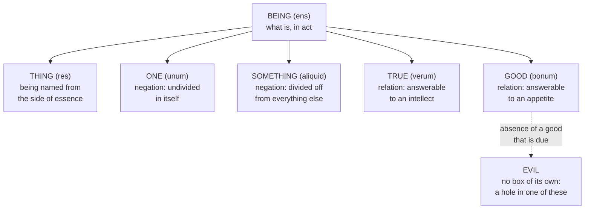

# The Thomistic Synthesis · Lesson 2.4: The transcendentals

> ⏱ ~15 min · Module 2: Being: the metaphysics theology runs on · Builds on: [2.1 Act and potency, extended](02-01-act-and-potency-extended.md), [2.3 Participation](02-03-participation.md) · Unlocks: [3.4 Divine simplicity and the derivation of the attributes](03-04-divine-simplicity-and-the-attributes.md), [4.3 The names of God](04-03-the-names-of-god.md)

## Why this matters

The dogmatic courses will say in one breath that God is one, that God is goodness itself, that God is truth, and that God is altogether simple — no parts, no accidents, nothing in him that is not he. Take those sentences at face value and they fight. If "good" names something over and above existing, and "true" names something else again, then a being who is all of them has at least three items in him, and simplicity is dead before [3.4](03-04-divine-simplicity-and-the-attributes.md) starts. The transcendentals are the piece of metaphysics that stops the fight. They also carry the tradition's oldest reply to the oldest objection: if everything God made is good, what is evil?

## The idea

A [transcendental](../reference.md#transcendentals) is said of absolutely everything there is: it crosses every category and every genus, so that nothing falls outside it. "Being" is the first. The puzzle is what any of the others can possibly *add*.

Normally you add a property by bringing in content from outside: "white" adds something to "man" because whiteness is no part of being human. But nothing lies outside being to be brought in — anything you could fetch would itself be something, hence already inside. So the addition can only be a **mode of being that was there all along and is now made explicit**: either a negation (what the thing is not) or a relation (how it stands to something else). The road to Thebes and the road from Athens are one road under two descriptions; the second name adds no gravel.

The classic list comes from *De Veritate* q.1 a.1, where Aquinas derives six (paraphrased): **being**, and then **thing**, which names being from the side of its essence; **one**, undivided in itself; **something** (*aliquid*, literally "another what"), divided off from everything else; **true**, answerable to an intellect; and **good**, answerable to an appetite. Two negations and two relations. They are *convertible* with being: exactly the same things fall under each, and the difference is one of idea, not of inventory.

The one doing the most theological work is [good](../reference.md#good-and-being-are-convertible). ST I q.5 a.1 states it flatly: "Goodness and being are really the same, and differ only in idea." Good adds desirability; a thing is desirable so far as it is perfect, perfect so far as it is in act, in act so far as it exists. That is the ladder of [2.1](02-01-act-and-potency-extended.md) climbed in reverse: goodness tracks actuality, and actuality bottoms out in *esse*.

Which sets up the rest of the lesson. If good and being coincide in reality, evil cannot be a being at all.

## Source

ST I q.48 a.1, "Whether evil is a nature?", the *respondeo* (English Dominican Province translation):

> I answer that, One opposite is known through the other, as darkness is known through light. Hence also what evil is must be known from the nature of good. Now, we have said above that good is everything appetible; and thus, since every nature desires its own being and its own perfection, it must be said also that the being and the perfection of any nature is good. Hence it cannot be that evil signifies being, or any form or nature. Therefore it must be that by the name of evil is signified the absence of good. And this is what is meant by saying that "evil is neither a being nor a good." For since being, as such, is good, the absence of one implies the absence of the other.

Three things to notice. First, "we have said above" is a back-reference to q.5 a.1: the article does not argue that good and being coincide, it *spends* that result. Second, the operative phrase is "the absence of good", not "the opposite of good" — evil is located as a lack, not as a rival at the far end of a scale. Third, the sentence in quotation marks is Dionysius, whose line was this article's *sed contra*; Aquinas closes the body by reaching the authority's words, which is what a *sed contra* is usually for.

## The argument

The *respondeo* in numbered steps.

1. **Good is whatever is desirable.** *(Imported from ST I q.5 a.1, not proved here.)* In words: to call a thing good is to say it is the sort of thing something could be after.
2. **Every nature desires its own being and its own perfection.** *(From act and potency, [2.1](02-01-act-and-potency-extended.md): what is in potency tends toward its act.)* In words: nothing wants to stop being what it is, or to stay half-finished.
3. **So the being and the perfection of any nature is good.** *(1, 2.)* In words: every nature is desirable to itself, and therefore good.
4. **So "evil" cannot signify a being, a form or a nature.** *(3.)* In words: there is no evil *kind* of thing; whatever exists is good so far as it exists.
5. **So "evil" signifies the absence of a good.** *(4, with the division: a name signifies either a nature or the lack of one.)* In words: "evil" names a hole, not an occupant.
6. **And since being as such is good, the absence of the one is the absence of the other** — evil is neither a being nor a good (Dionysius, *Div. Nom.* iv). In words: a missing goodness is a missing bit of being.

One refinement this article leaves to the next but one. ST I q.48 a.3 separates a **privative** absence from a merely **negative** one: a man who lacks the swiftness of a roe or the strength of a lion is not thereby evil, because those goods were never due to him. Only the absence of a good that *ought* to be there is an evil. So the finished doctrine is [evil as privation](../reference.md#evil-as-privation) — Aristotle's privation from [`ancient-medieval-philosophy` 3.3](../../ancient-medieval-philosophy/lessons/03-03-change-privation-potency-and-act.md), carrying Augustine's account from [`ancient-medieval-philosophy` 5.2](../../ancient-medieval-philosophy/lessons/05-02-augustine-evil-and-the-will.md).

## The ladder

Before the map, the two transcendentals the lesson has not yet cashed out. [One](../reference.md#one-as-undivided) (ST I q.11 a.1) adds no reality to being but only the negation of division: "one" means undivided being, and a thing has being just in so far as it is undivided. [True](../reference.md#truth-in-the-intellect-and-in-things) (ST I q.16 a.1) is primarily in the intellect and only derivatively in things, which are called true in so far as they answer to the intellect they depend on — a house for matching the architect's idea, a natural thing for matching the divine one. ST I q.16 a.3 lines the pair up: as good adds to being a relation to appetite, true adds a relation to intellect.

Every arrow out of the top box adds an idea, never an ingredient. The dashed arrow is the point: evil hangs off the good as a lack, and no route runs to it from the top box.

### Whether beauty belongs on the list

Aquinas never enumerates beauty among the transcendentals. But ST I q.5 a.4 ad 1 says beauty and goodness are identical in the thing, both resting on its form, and differ only logically: goodness relates to appetite, while "beautiful things are those which please when seen", so beauty relates to a knowing power. Maritain (*Art and Scholasticism*) and much of the Neoscholastic aesthetic tradition read that as giving beauty exactly a transcendental's profile — same reality, distinct idea, its own faculty. Critics reply that the same text makes beauty the good *under a relation to knowing*, a species of the good rather than a seventh item, and that no list Aquinas wrote includes it. The dispute is live and this lesson settles nothing: see [the card](../reference.md#whether-beauty-is-a-transcendental).

## Worked examples

**Example 1 (clean: one watch, a true watch, a good watch).** Put a working watch on the table and ask what must be added to make it one, true and good.

*One*: nothing. It is one because it is undivided — its parts are no longer several things but one thing. Smash it and you do not subtract a property called unity; you subtract the watch.

*True*: nothing. It is a true watch because it answers to the idea in the watchmaker's mind. Truth sits primarily in that intellect; the watch is true derivatively, for conforming to the intellect it depends on (q.16 a.1).

*Good*: nothing. It is good because it is desirable, and desirable because it is in act — it actually keeps time. Remove the act and the goodness goes with it, in one motion, not two.

Three names, one watch, no third property anywhere on the table. That is "convertible with being, differing in idea" in the hand.

**Example 2 (hard: a deliberate cruelty, where the account strains).** A man poisons a rival to take his post. Run the doctrine. Every positive item here has being and is therefore good so far as it has being: the chemistry works, the will is a real power really exercised, the planning is a real perfection of intellect, and the post is a real good. So where did the evil go?

Aquinas answers in q.48 a.1 ad 2: in moral matters evil is never a bare privation standing on its own, but a real good joined to the privation of another good. What the intemperate man pursues is not "the absence of reason's good"; it is a pleasure, sought outside reason's order. The murder is a real act missing the order due to it. It has no ingredient of its own.

Readers dig in here, rightly: it can sound as though the horror has been dissolved into a bookkeeping remark. Two separate things hold the account in place. First, a privation is not a nothing-at-all — blindness is a privation and entirely real, the warning [`ancient-medieval-philosophy` 5.2](../../ancient-medieval-philosophy/lessons/05-02-augustine-evil-and-the-will.md) already posts — and the privation here is of the due order of a will, the gravest thing the man had. Second, q.48 a.1 ad 4 separates the senses of acting: evil corrupts *formally*, as a privation corrupts, and effects nothing of itself, but only by the good annexed to it. So nothing here makes the poisoning smaller; it locates the horror in the ruin of what ought to have been there rather than in a rival substance.

Where this lesson stops: whether the privation account answers the *problem* of evil — whether God's permitting such privations is defensible — belongs to [`philosophy-of-religion`](../../philosophy-of-religion/syllabus.md) 4.3.

## Watch out

- **You might think that because good adds no reality to being, calling a thing good says nothing.** It adds an *idea* — a relation to appetite that "being" by itself does not express; q.11 a.1 ad 3 makes the same move for unity. The transcendentals are not synonyms but one reality under several formalities, which is exactly the machinery [4.3](04-03-the-names-of-god.md) needs to say many non-redundant things about a being with no parts.
- **You might think evil-as-privation means evil is unreal, or minor.** It means neither; see Example 2, and the same warning in [`ancient-medieval-philosophy` 5.2](../../ancient-medieval-philosophy/lessons/05-02-augustine-evil-and-the-will.md).
- **You might think that because this doctrine is the tradition's standard furniture, all of it is Church teaching.** Three levels are in play, and collapsing any into another is an error in either direction. That God is the one creator of all things visible and invisible, and that the devil and the other demons were created good in nature and became evil by their own act, was professed by Lateran IV (1215), ch. 1, against the dualism of the day — rung 1 on the ladder of [`fundamental-theology` 4.4](../../fundamental-theology/lessons/04-04-the-ladder-of-doctrinal-authority.md). The *analysis* of evil as the privation of a due good is not defined; it is at most common teaching. And whether the transcendentals number exactly six, and whether beauty joins them, is a school question freely disputed among Catholics.

## One-liner

> The transcendentals add nothing to being but a way of looking at it — which is why evil, having nothing of its own to be, is a hole in something good rather than a thing.

## Problems

**P1 (🟢) *(Exegetical.)*** ST I q.11 a.1, "Whether 'one' adds anything to 'being'?", *respondeo* (English Dominican Province):

> "One" does not add any reality to "being"; but is only a negation of division; for "one" means undivided "being." This is the very reason why "one" is the same as "being." Now every being is either simple or compound. But what is simple is undivided, both actually and potentially. Whereas what is compound, has not being whilst its parts are divided, but after they make up and compose it. Hence it is manifest that the being of anything consists in undivision; and hence it is that everything guards its unity as it guards its being.

(a) Which words carry the claim that "one" adds no reality, and what work does the split into simple and compound do in the proof? (b) The last clause — everything guards its unity as it guards its being — is offered as evidence, not decoration. What is it evidence *for*? Two sentences per part.

**P2 (🟡) *(Exegetical.)*** An invented paragraph from a parish homily (no real preacher is being quoted):

> Two powers are loose in the world, and you have felt them both. One builds; the other unmakes. Evil is not nothing, friends — it is a force with an energy of its own, a nature set against the Maker from the beginning. That is why the struggle is real, and why you cannot stand neutral in it.

(a) Which numbered step of "The argument" does the paragraph deny, and which of its phrases give the denial away? (b) The paragraph is reaching for something the privation account actually keeps. Name it, and cite the reply of q.48 a.1 that keeps it. (c) Give the level of the Church's teaching against an uncreated evil principle and name what fixes it — and say what in this lesson does *not* stand at that level. Two sentences per part.

**P3 (🔴, optional) *(Exegetical (a) · Evaluative (b))*** (a) A mule is sterile. Aquinas does not discuss the case. Using the distinction of ST I q.48 a.3, say whether that sterility is an evil in the mule: name the criterion, apply it, and name the prior question that decides the application. Three sentences. (b) Is beauty a transcendental? Argue either way in 150 words or fewer, using ST I q.5 a.4 ad 1 and the fact that Aquinas's own enumerations omit beauty.

Solutions

**P1** *(Exegetical.)*

**Must hit, strict (a):** the words are "does not add any reality to 'being'; but is only a negation of division" and the gloss "'one' means undivided 'being.'" The simple/compound split is an exhaustive case proof that being and undividedness coincide: what is simple is undivided both actually and potentially, and what is compound has no being at all while its parts are divided and has being once they compose. Since the two cases are exhaustive, "the being of anything consists in undivision", so "one" names being under a negation rather than adding a further reality.
**Must hit, strict (b):** it is evidence that the coincidence is real and not merely a way of speaking — a thing's holding together and its staying in existence are not two projects but one, which is what you expect if unity *is* its being under a negation.
**Wrong turns:** reading "negation of division" as making unity unreal or purely mental (q.11 a.1 ad 3 says "one" does add an idea); running the two senses of "one" together — ad 1 separates the "one" convertible with being from the "one" that is the principle of number, and says Avicenna's mistake was to treat the first like the second; taking (b) as a claim that things consciously desire unity.
**Model answer:** (a) "Does not add any reality to 'being'; but is only a negation of division", since "one" just means undivided being. The simple/compound division covers every case and shows that in each one being and undividedness arrive together — the simple thing is undivided outright, the compound has being only once its parts are united — so unity is being viewed under a negation. (b) That the identity shows in how things behave: a thing preserves itself by holding together, so guarding unity and guarding being are one act, not two.

---

**P2** *(Exegetical.)*

**Must hit, strict (a):** step 4 (and with it step 5) — that "evil" cannot signify a being, a form or a nature. The giveaway phrases are "a force with an energy of its own" and "a nature set against the Maker from the beginning"; "from the beginning" is the dualist load, an evil principle that was never made.
**Must hit, strict (b):** that evil is real and really does damage — the privation account never says evil is an illusion or that the struggle is fake. ST I q.48 a.1 **ad 4**: evil corrupts good formally, as a privation is itself the corruption; it effects nothing of itself, but acts and is desired only by virtue of some good joined to it. So there is real agency in evil deeds; it belongs to the good in them (power, will, intelligence), not to the privation.
**Must hit, strict (c):** the highest level. Lateran IV (1215), ch. 1, professes one God, creator of all things visible and invisible, and teaches that the devil and the other demons were created good in nature by God and became evil by their own doing — defined against Albigensian dualism. On [`fundamental-theology` 4.4](../../fundamental-theology/lessons/04-04-the-ladder-of-doctrinal-authority.md) that is rung 1, divinely revealed and proposed as such, and obstinate denial is heresy. What does *not* stand there: the privation analysis itself (at most common teaching), the six-item list, and the beauty question.
**Wrong turns:** treating the paragraph as mere rhetoric and grading nothing; saying the Church has defined that evil is a privation (overstating in one direction); saying that because evil is a privation the struggle is unreal (overstating in the other); naming step 1 or 2, which the paragraph never touches.
**Model answer:** (a) Step 4: it makes evil a nature and a form with its own energy, and "set against the Maker from the beginning" makes that nature uncreated. (b) That evil is real and destructive; q.48 a.1 ad 4 keeps this by distinguishing how evil acts — formally, as a privation corrupting, and efficiently only through the good annexed to it. (c) Rung 1: Lateran IV ch. 1 defines one creator of all things visible and invisible and teaches that the demons were created naturally good and fell by their own act. The philosophical analysis of evil as privation of a due good is not defined at that level, and whether beauty is a transcendental is freely disputed.

---

**P3** *(Exegetical (a) · Evaluative (b))*

**Must hit, strict (a):** the criterion from q.48 a.3 — an absence of good is an evil only when taken *privatively*, that is, when the missing good is due to this subject; a merely *negative* absence, the lack of a good belonging to some other kind, is not an evil (a man lacking the roe's swiftness or the lion's strength is not thereby evil). Applied: generative power is a perfection due to a complete animal of a kind, so if the mule is a defective member of the equine kind, its sterility is a privation and an evil in it; if "mule" names a stable nature of its own whose specification does not include fertility, the sterility is a bare negation and no evil at all. The prior question, which q.48 a.3 does not settle, is whether a sterile hybrid has a nature of its own or is a damaged instance of another kind — a question of natural philosophy, not of this distinction. Either verdict passes provided the criterion and the prior question are both named.
**Wrong turns:** deciding it by whether the sterility is inconvenient to farmers (usefulness is not the criterion); saying it is an evil because the mule "cannot do what horses do", which is exactly the negative reading the roe-and-lion example rules out; concluding that it is no evil because nothing suffers.
**Model answer (a):** Only a good that is due to the subject counts, since a privative absence is an evil and a negative one is not (q.48 a.3). If the mule is a defective member of the horse kind, the missing generative power is due to it and the sterility is a privation, hence an evil in it, though not a disorder in the universe; if "mule" is a nature of its own that never included fertility, the lack is like a man's lack of the lion's strength and is no evil. Which of those the mule is — a kind or a defective cross — is the prior question, and q.48 a.3 does not answer it.

**Must hit, any verdict (b):** state the test a candidate must pass — convertibility with being (every being beautiful) plus adding only an idea, not a content; engage q.5 a.4 ad 1, where beauty and goodness are identical in the thing, both resting on its form, and differ logically, goodness relating to appetite and beauty to a cognitive power ("beautiful things are those which please when seen"); say what that text does for your verdict; and register that Aquinas's own enumerations, including *De Veritate* q.1 a.1, do not list beauty.
**Wrong turns:** settling it by observing that beautiful things exist; treating "he never lists it" as decisive on its own without handling q.5 a.4 ad 1; treating "it is really the same as the good" as decisive against, when the same is true of *every* transcendental; claiming the Church has settled the question.
**Model answer (b), one of several:** Yes. The test is convertibility plus addition in idea alone, and q.5 a.4 ad 1 gives beauty both: it is identical with the good in reality, resting on the same form, and distinguished only logically by the power it answers to — a cognitive power rather than appetite. That is structurally what separates *verum* from *bonum*, so if the relation-to-intellect earns truth a place, the relation-to-a-power-that-delights should earn beauty one. The omission from Aquinas's lists is real but weak evidence: those lists derive the transcendentals from appetite and intellect as such, and beauty falls out as their join rather than as a further root. The opposite verdict is equally defensible on the same ad: if beauty is the good *under* a relation to knowing, it is a mode of the good, not a seventh name for being.

## Flashback

**From Lesson [2.2](02-02-esse-and-essence-the-real-distinction.md) (Esse and essence: the real distinction):** *(Exegetical — reconstruct.)* ST I q.3 a.5 asks whether God is contained in a genus, and gives three reasons why he cannot be a species of one. The third runs: all the members of one genus agree in the quiddity, that is the essence, which the genus predicates of them, but they differ in their existence — the existence of a man and of a horse is not the same, nor is this man's that man's; whereas in God essence and existence do not differ, "as shown in the preceding article." (a) Put that reason in numbered premises with its conclusion, and mark the premise that is imported from an earlier article rather than argued here. (b) The article then draws a corollary: God has no genus and no difference, so there can be no definition of him, and no demonstration of him except through his effects — "for a definition is from genus and difference; and the mean of a demonstration is a definition." In one sentence, say why that follows.

Solution

**Must hit, strict (a):** four premises and a conclusion, in any equivalent wording.
> **P1.** The members of any one genus agree in the quiddity or essence that the genus predicates of them.
> **P2.** They nevertheless differ in their existence: this man's existing is not that man's.
> **P3.** So in every member of a genus, existence and essence must differ. *(P1, P2.)*
> **P4.** In God, essence and existence do not differ. ***(Imported — ST I q.3 a.4, "as shown in the preceding article," not argued here.)***
> **∴ C.** God is not in a genus as a species of it.

The mark on P4 is the point of the exercise, and P2 deserves a note too: the real distinction in creatures is asserted here with an example rather than proved, which is the pattern 2.2 flagged — the distinction is rarely the conclusion of a Thomist argument and almost always a premise in one.

**Must hit, strict (b):** because a definition is composed of genus and difference, and the conclusion has left God with neither; so there is no definition of him, and since the middle term of a demonstration is a definition, no demonstration can start from what he is — only his effects can serve instead.

**Wrong turns:** making P4 a conclusion of this argument instead of an import, when the text says "as shown in the preceding article"; reading the reason as *proving* that essence and existence differ in creatures, when it uses that; concluding that God is above every genus in the sense of topping one — the article denies him a place in a genus even as a principle reducible to it, since a principle of a genus does not extend beyond that genus while God is the principle of all being; answering (b) with "God is unknowable," which the article does not say and the rest of q.3 contradicts.

**Model answer:** (a) P1: members of one genus agree in the essence the genus predicates. P2: they differ in their existence. P3: so in every member of a genus, essence and existence differ. P4, imported from q.3 a.4: in God they do not differ. Therefore God is in no genus as a species. (b) A definition is made of genus and difference, so a being with neither cannot be defined; and since a demonstration's middle term is a definition, nothing but his effects is left to argue from.

## Connections

- **Backward:** the good-desirable-perfect-actual chain of q.5 a.1 is the ladder of [2.1](02-01-act-and-potency-extended.md) climbed in reverse, ending in *esse*; [2.3](02-03-participation.md) supplies why a participated being is good at all, since what it has it has by receiving. Aristotle's privation is [`ancient-medieval-philosophy` 3.3](../../ancient-medieval-philosophy/lessons/03-03-change-privation-potency-and-act.md) and Augustine's evil-as-lack is [`ancient-medieval-philosophy` 5.2](../../ancient-medieval-philosophy/lessons/05-02-augustine-evil-and-the-will.md); Dionysius, the authority behind "evil is neither a being nor a good", belongs to [`patristics`](../../patristics/syllabus.md) 5.4.
- **Forward:** [3.4](03-04-divine-simplicity-and-the-attributes.md) needs convertibility to say that one simple *esse* is goodness, truth and unity without becoming three things; [4.3](04-03-the-names-of-god.md) needs "differing in idea" to explain how distinct divine names are not synonyms and not parts. Truth's primary home in the divine intellect (q.16 a.1) is picked up in [4.1](04-01-how-a-human-intellect-knows.md).
- **Sideways:** the good as the object of appetite is the root of the natural-law account in [`ethics`](../../ethics/syllabus.md) 4.4 — the first precept is built on "good is what all desire". Evil as privation assessed as a *theodicy*, rather than expounded as a doctrine, is [`philosophy-of-religion`](../../philosophy-of-religion/syllabus.md) 4.3.
