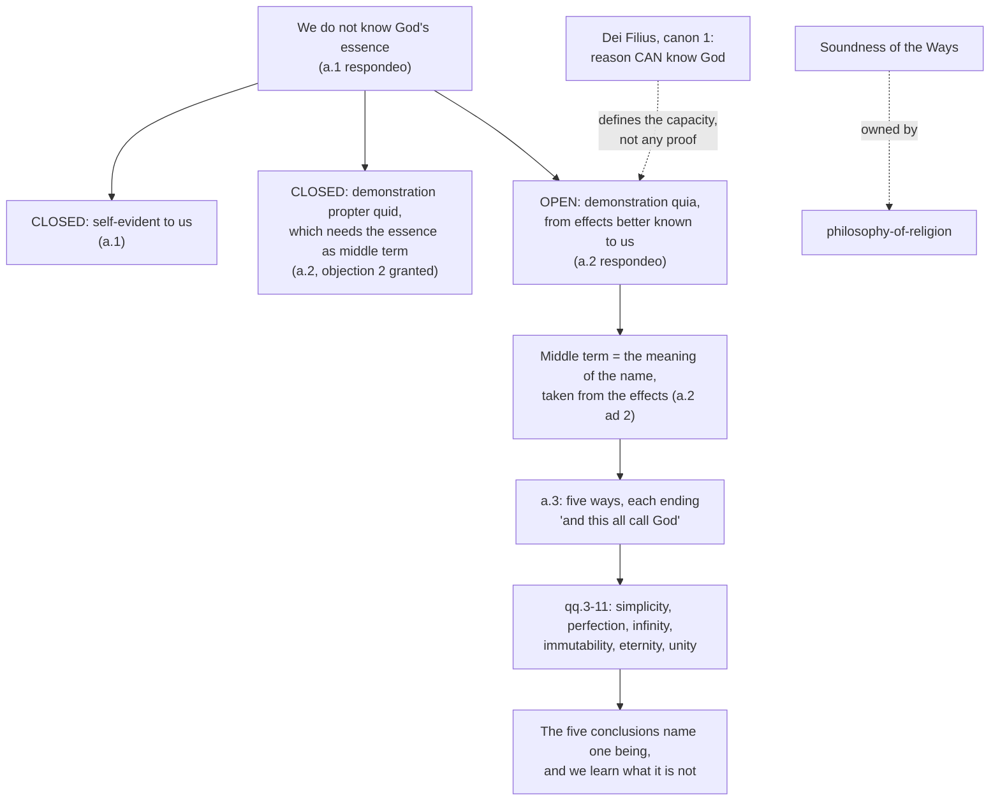

# The Thomistic Synthesis · Lesson 3.1: Demonstrating that God exists

> ⏱ ~15 min · Module 3: God: the Five Ways and simplicity · Builds on: [1.2 The article in depth: reading a whole question](01-02-reading-a-whole-question.md), [2.1 Act and potency, extended](02-01-act-and-potency-extended.md) · Unlocks: [3.2 The First and Second Ways inside the system](03-02-the-first-and-second-ways-inside-the-system.md)

## Why this matters

Everyone reads the third article of question 2. Hardly anyone reads the first two, and those are the articles that decide what the third one is allowed to be: what kind of proof it may be, what it may start from, and how thin its conclusion has to be. Skip them and you will misjudge the Five Ways in one direction or the other — as five paragraphs that vault straight to the God of the Creed, or as a botched draft of a modern cosmological argument. This lesson also holds the cleanest authority case in the course: the Church has defined something in this neighbourhood, it is narrower than both sides of the popular quarrel assume, and getting it exactly right is the discipline everything after this runs on.

## The idea

Question 2 has three articles, and [1.2](01-02-reading-a-whole-question.md) taught you to read that order as an argument. Is it self-evident that God exists? No — so we need a proof. Can such a proof be had at all? Yes, but only of one kind. Then: God exists, five times over.

One fact closes the first article and half the second. **We do not know what God is.** Aquinas grants the strongest form of the point his opponents want: "God exists" *is* self-evident in itself, because in God the predicate is the subject — God is his own existence. But that is true only for someone who sees God's essence, and we do not. So the proposition is [self-evident in itself and not to us](../reference.md#self-evident-in-itself-and-to-us), and it "needs to be demonstrated by things that are more known to us, though less known in their nature — namely, by effects" (ST I q.2 a.1).

The same fact bites again in a.2. A demonstration that runs from a cause down to its effect uses the cause's *essence* as its middle term. No essence, no such demonstration. What is left is the other direction: from an effect we can see to the existence of a cause we cannot. Smoke tells you there is fire without telling you what fire is.

That leaves one puzzle, and a.2's second reply is where Aquinas solves it. If we do not know what God is, what does the word "God" mean in the sentence we are trying to prove? His answer is the small technical device the whole of Module 3 depends on: the middle term is not God's essence but **the meaning of the name**, and the names of God are taken from his effects. This is why each of the Five Ways can end "and this all call God" without pretending to have reached God's essence — and why questions 3 to 11 still have work to do.

## Source

*Summa Theologiae* I q.2 a.2, the body of the article (English Dominican Province translation, public domain):

> "Demonstration can be made in two ways: One is through the cause, and is called 'a priori,' and this is to argue from what is prior absolutely. The other is through the effect, and is called a demonstration 'a posteriori'; this is to argue from what is prior relatively only to us. When an effect is better known to us than its cause, from the effect we proceed to the knowledge of the cause. And from every effect the existence of its proper cause can be demonstrated, so long as its effects are better known to us; because since every effect depends upon its cause, if the effect exists, the cause must pre-exist. Hence the existence of God, in so far as it is not self-evident to us, can be demonstrated from those of His effects which are known to us."

The translators' "a priori" and "a posteriori" render Aquinas's *propter quid* ("on account of which") and *quia* ("that"). Read them as Latin, not as Kant.

## The argument

The *respondeo* of a.2, with the replies that finish it. The bracket after each step says where the premise comes from — an earlier article, Module 2's metaphysics, or authority.

1. **Demonstration comes in two kinds: *propter quid*, through the cause, and *quia*, through the effect.** *(Aristotle, assumed from [`ancient-medieval-philosophy` 7.3](../../ancient-medieval-philosophy/lessons/07-03-the-five-ways-as-text.md).)* *In words:* you can argue down from what makes a thing so, or up from what it does.
2. **A *propter quid* demonstration takes the cause's essence as its middle term.** *(Granted from objection 2, which Aquinas does not contest.)*
3. **We do not know God's essence.** *(a.1's *respondeo*; the objection cites Damascene for it.)*
4. **So no *propter quid* demonstration of God is available to us.** *(1–3.)* *In words:* the route that would be best is the one route we cannot take.
5. **Every effect depends on its cause, so if the effect exists the cause pre-exists.** *(Metaphysics of causality; the structure of such dependence is [`metaphysics` 4.4](../../metaphysics/lessons/04-04-ordered-causal-series.md).)*
6. **Some effects of God are better known to us than God is.** *(Our knowing begins in the senses — the ground of this is [4.1](04-01-how-a-human-intellect-knows.md).)*
7. **Therefore God's existence can be [demonstrated *quia*](../reference.md#demonstration-quia-and-propter-quid), from effects.** *(5–6.)*

Two replies then patch the two holes this leaves.

> **ad 2.** "in order to prove the existence of anything, it is necessary to accept as a middle term the meaning of the word, and not its essence… Now the names given to God are derived from His effects."

8. **In a *quia* demonstration the effect stands in for the definition of the cause, and the middle term is a [nominal definition](../reference.md#nominal-definition-as-middle-term) drawn from the effects.** *In words:* you prove that *something answering to this name* exists, and you postpone the question what it is — which is the right order, since "what is it?" only arises once "is it?" is settled.

And ad 1, which [`fundamental-theology` 2.2](../../fundamental-theology/lessons/02-02-credibility-and-the-preambles-of-faith.md) owns: God's existence and its like are not articles of faith but **[preambles](../reference.md#preambles-of-faith)** to them, and the man who cannot follow a proof may still hold the same truth by faith. Read that lesson for what the preambles are and are not; it is not repeated here.

### What the Church has defined here, and what she has not

*Dei Filius*, the dogmatic constitution of the First Vatican Council (1870), defines in its first canon on revelation that the one true God **can be certainly known** by the natural light of human reason through created things. That is a claim about a [**capacity**, not about a **performance**](../reference.md#what-vatican-i-defined-about-natural-knowledge-of-god). It canonizes no argument and names no philosopher. [`fundamental-theology` 1.2](../../fundamental-theology/lessons/01-02-natural-knowledge-of-god.md) reads the canon word by word — object, certainty, instrument, starting point — and that lesson, not this one, is the authority for it. On the ladder in [`fundamental-theology` 4.4](../../fundamental-theology/lessons/04-04-the-ladder-of-doctrinal-authority.md) the canon sits on rung 1, *de fide*.

So: that reason can reach God is defined. That the First Way is a sound demonstration is not defined, not taught at any level, and is argued about by Catholics in good standing — rung 5. Whether the Ways succeed belongs to [`philosophy-of-religion`](../../philosophy-of-religion/syllabus.md) Module 2; what they *mean* inside Aquinas's system is what this course owns.

## The derivation

## Worked examples

**Example 1 (clean: the machinery on a case Aquinas did not use).** An astronomer sees a planet wander off its predicted path. He argues: this deflection is an effect; every effect has a proper cause; the deflection is better known to him than whatever is producing it; therefore something is producing it. He names that something "the perturber" — and "the perturber" just means *whatever is pulling this planet off course*, a description read off the effect. The conclusion is real and the name is empty of essence: he has proved that there is a perturber without knowing whether it is a planet, a dust cloud, or an error in the law he assumed.

Now map it. Step 5 is the causal principle, step 6 is the claim that the effect is better known, step 7 is the conclusion, and "the perturber" is step 8's nominal definition. Every Way has this shape, with its own effect and its own name — first mover, first efficient cause, necessary of itself — and none claims more at that point than the astronomer does. The difference comes next: he can eventually see his perturber, and we cannot see God's essence, so questions 3 to 11 proceed by removing (no body, no composition, no change), not by inspecting.

**Example 2 (hard: where the device strains).** The nominal definition looks like a cheat in both directions at once.

Make it *thin* — "first mover" means only "whatever is first in this series" — and the conclusion looks trivial. You have proved that a first member of a series exists, which is barely news, and certainly not that God does.

Make it *thick* — "God" means the omnipotent creator who is worshipped — and the proof looks circular: you smuggled the conclusion into the middle term.

Aquinas takes the first horn without apology. The nominal definition *is* thin, deliberately; a.3's "and this all call God" reports a linguistic fact about how the word is used, not an achievement. The work of thickening is done by the questions after it, one attribute at a time, from simplicity ([3.4](03-04-divine-simplicity-and-the-attributes.md)) to unity, which is where the five thin conclusions are argued to name one being. Read q.2 a.3 as the finished case and you have mistaken the first step for the whole argument.

But notice the cost, which the syllabus's Boss 3 will make you pay. The identification of the five results with each other and with the God of faith is carried entirely by later articles. If any of those articles fails, the Ways survive as proofs of five thin somethings, and the interesting claim goes with the failure. That is why simplicity is the hinge of the treatise and not an appendix to it.

## Watch out

- **"A priori" and "a posteriori" in the Source are not Kant's.** The Dominican translators used the eighteenth-century pair for Aquinas's *propter quid* and *quia*, which classify a demonstration by the **direction of the inference** — from cause to effect, or from effect to cause. Both of Aquinas's kinds start from experience. Nothing here is a priori in the modern sense of independent of experience.
- **"Self-evident in itself" is not a concession to the *Proslogion*.** Aquinas grants it because God is his own existence, which he proves later, at ST I q.3 a.4 ([`ancient-medieval-philosophy` 7.2](../../ancient-medieval-philosophy/lessons/07-02-aquinas-essence-and-existence.md)). A conclusion of q.3 cannot be a premise in q.2. His actual handling of the argument from the meaning of the name is a.1 ad 2, read historically in [`ancient-medieval-philosophy` 6.1](../../ancient-medieval-philosophy/lessons/06-01-anselm-and-the-proslogion-as-history.md).
- **The *sed contra* of a.2 is Romans 1:20 — authority, not the answer.** As [1.2](01-02-reading-a-whole-question.md) insists, the *sed contra* tells you where Aquinas will land, and the *respondeo* tells you why. The same verse is quoted by *Dei Filius* for its own warrant, which is a nice illustration of the ranking of arguments from authority in [`fundamental-theology` 5.4](../../fundamental-theology/lessons/05-04-sacred-doctrine-as-a-science.md).
- **Two opposite level errors, both graded strictly.** Upward: treating "the First Way is sound" as something a Catholic must hold, because the council defined that reason can know God. Downward: treating the canon itself as one school's philosophy, so that natural knowledge of God is optional for Catholics. The first confuses a performance with a capacity; the second denies a defined dogma.

## One-liner

> Because we cannot see what God is, the only proof left runs from effects upward, with a name borrowed from those effects doing the work an essence cannot — and the Church defined that such a route exists, not that any traveller has walked it.

## Problems

**P1 (🟢) *(Exegetical.)*** *Summa Theologiae* I q.2 a.2, objection 3 with its reply (English Dominican Province translation):

> **Objection 3.** "Further, if the existence of God were demonstrated, this could only be from His effects. But His effects are not proportionate to Him, since He is infinite and His effects are finite; and between the finite and infinite there is no proportion. Therefore, since a cause cannot be demonstrated by an effect not proportionate to it, it seems that the existence of God cannot be demonstrated."
>
> **Reply to Objection 3.** "From effects not proportionate to the cause no perfect knowledge of that cause can be obtained. Yet from every effect the existence of the cause can be clearly demonstrated, and so we can demonstrate the existence of God from His effects; though from them we cannot perfectly know God as He is in His essence."

(a) State exactly what the reply concedes and what it refuses, naming the words that carry each. (b) Which step of the lesson's reconstruction does the reply rely on, and which distinction of the lesson does it presuppose? 150 words or fewer in total.

**P2 (🟡) *(Exegetical.)*** Assign the level of each claim, naming the act or text that fixes it; for (iii), say instead whether the inference holds. Do not overstate in either direction. Two sentences per item.

(i) The one true God can be known with certainty by the natural light of human reason through created things.
(ii) The First Way is a sound demonstration.
(iii) "The Church has defined that reason can know God, so a Catholic who finds the Five Ways unpersuasive denies a dogma."

**P3 (🔴, optional) *(Exegetical.)*** An invented parish-newsletter paragraph, written for this problem:

> "Science still cannot say how the first living cell assembled itself. That gap is exactly where God is: the cell is the one effect chemistry cannot produce, so it is our proof of a Creator. And since the Church has defined that God is provable from nature, every Catholic is bound to hold this argument — the alternative is to deny the faith."

Name the two distinct errors, one about how a *quia* demonstration works and one about authority. For the first, say what the writer has made "God" the name of, and why that is not what a.2 ad 2 licenses. 150 words or fewer.

Solutions

**P1** *(Exegetical.)*

**Must hit, strict (a):** the reply **concedes** the objection's premise about proportion — "From effects not proportionate to the cause **no perfect knowledge** of that cause can be obtained" — so it grants that finite effects cannot yield knowledge of God's essence. It **refuses** the objection's inference: "**Yet from every effect the existence of the cause can be clearly demonstrated**." The deciding move is the distinction between knowing **that** a cause exists and knowing **what** it is; the words "perfect knowledge" and "as He is in His essence" mark the conceded half, "the existence of the cause" the refused half.

**Must hit, strict (b):** step 5, the causal principle that every effect depends on its cause, which is what survives the disproportion and delivers existence alone. The presupposed distinction is *quia* against *propter quid* — equivalently, that God's essence is not available as a middle term (step 3), which is why the disproportion costs nothing the argument was using.

**Wrong turns:** reading the reply as denying the objection's premise, when it grants it; saying it answers by making the effects proportionate after all; treating "perfect knowledge" as "certain knowledge", so that the reply looks like a retreat from certainty — the certainty of the conclusion is not in question, only its content.

**Model answer:** (a) It concedes that effects out of proportion to their cause yield "no perfect knowledge" of it, so nothing here reaches God "as He is in His essence." It refuses the inference to "cannot be demonstrated," because "from every effect the existence of the cause can be clearly demonstrated." The concession and the refusal fall on opposite sides of a single line: *that* it is, against *what* it is. (b) It relies on step 5, the dependence of every effect on its cause, which survives the disproportion; and it presupposes the *quia*/*propter quid* distinction, since the essence was never the middle term and so its inaccessibility costs the proof nothing.

---

**P2** *(Exegetical.)*

**Must hit, strict (i):** rung 1, defined dogma (*de fide*). Fixed by the First Vatican Council, *Dei Filius* (1870), canon 1 on revelation, with an anathema attached; see [`fundamental-theology` 1.2](../../fundamental-theology/lessons/01-02-natural-knowledge-of-god.md) and the ladder in [4.4](../../fundamental-theology/lessons/04-04-the-ladder-of-doctrinal-authority.md).

**Must hit, strict (ii):** no magisterial level at all — rung 5, freely disputed. No council or pope has declared any named argument sound; the canon speaks of what reason *can* do, not of any proof. Credit for adding that whether it succeeds is a philosophical question owned by [`philosophy-of-religion`](../../philosophy-of-religion/syllabus.md).

**Must hit, strict (iii):** the inference does **not** hold. It slides from a **capacity** claim to a claim about a particular **performance**. The canon is satisfied by reason's being able to reach God from created things; it is silent on whether any given argument does so, so one may doubt all five Ways and hold the canon without contradiction.

**Wrong turns:** calling (ii) "theologically certain" because Aquinas is the Church's common doctor — the recommendation of Aquinas as master is a different act, at a different level, and does not make his theses binding (that is the error this course grades strictly throughout, and the subject of [6.5](06-05-what-the-church-has-said-about-thomism.md)). The opposite error on (i): calling the canon a school opinion or a nineteenth-century flourish, when it is a canon of a dogmatic constitution with an anathema.

**Model answer:** (i) Defined dogma, rung 1: Vatican I, *Dei Filius*, canon 1 on revelation, which anathematizes the denial. (ii) No level; freely disputed, rung 5. No act of the magisterium endorses any particular proof, and its soundness is a philosophical question. (iii) The inference fails: the council defined a capacity of reason, not the success of any performance, so doubting the Five Ways leaves the canon untouched. One would deny the dogma only by holding that reason as such cannot reach God from created things.

---

**P3** *(Exegetical.)*

**Must hit, strict, error 1 (the demonstration):** the writer has made "God" the name of **whatever produced one event chemistry has not yet explained** — a cause of a particular becoming, inside the series of natural causes, identified by a gap in our knowledge. ST I q.2 a.2 ad 2 licenses a nominal definition drawn from the effects, but the effect in question must be one that *requires* a cause of the kind argued for, not one we merely cannot yet account for. Two consequences: the argument dies when chemistry advances, and its conclusion would be a competing natural cause rather than what the Ways reach. Credit for noting that this is a "God of the gaps", and that Aquinas's own starting points (motion, causation, contingency) are ordinary features of things that are not gaps at all.

**Must hit, strict, error 2 (authority):** the level is overstated. *Dei Filius* defines that God **can** be known by natural reason from created things — a capacity — and binds no one to any particular argument, least of all this one. Calling dissent from it a denial of the faith is the upward error of the lesson's last Watch out.

**Wrong turns:** answering that the paragraph is bad science, which is not the exegetical point; saying the Church has defined nothing here, which is the opposite error; treating the two errors as one, when the first is about what a *quia* demonstration may take as its effect and its name and the second about what has been defined.

**Model answer:** First, the demonstration. "God" is made the name of whatever assembled the first cell — a cause of becoming picked out by a gap in present chemistry. The nominal definition of a.2 ad 2 must be read off an effect that needs a cause of the sort argued for; an unexplained event is not such an effect, so the argument collapses when the explanation arrives, and its conclusion would be one more natural agent, not the first cause the Ways reach. Second, authority. *Dei Filius* defined that reason *can* know God from created things. It defined no argument, so no Catholic is bound to this one, and rejecting it is not denying the faith.

## Flashback

**From Lesson [2.3](02-03-participation.md) (Participation):** *(Exegetical.)* Three things are named: a stand of wheat is called **good**; a mountain road is called **dangerous**; God is called **good**. (a) Assign each to one of the three modes 2.3 distinguished — by essence, by participation, by extrinsic denomination — and give the two questions that decide the assignments. (b) For the one that is by participation, name the two conditions that must both hold, and say what dropping each would produce. Two sentences per part.

Solution

**Must hit, strict (a):** the wheat, **by participation** — goodness is a form really in it, but it is not identical with the wheat nor with the wheat's act of existing, so it is had in the measure the receiver sets. The road, **by extrinsic denomination** — no quality called danger is in the rock; the road is named from something outside it, the harm it tends to cause in travellers, exactly as a medicine is called healthy from the health it causes in an animal. God, **by essence** — no receiver, nothing received, nothing falling short; God does not have goodness but is it (ST I q.6 a.3, "Whether to be essentially good belongs to God alone?"). The two deciding questions: is the perfection a form really in the thing, or is the thing named from something else that has it; and, if it is really in the thing, is that form identical with the thing and with its own act of existing.

**Must hit, strict (b):** it must be **caused** by what has the perfection essentially, and it must be **received**, and so be formally the receiver's own. Drop the first and creaturely goodness is underived — a world of independent goods, which is what ST I q.44 a.1 exists to exclude. Drop the second and a creature's goodness is the divine goodness lodged inside it, which is pantheism.

**Wrong turns:** calling the road's danger a participated perfection because "the danger is really there" — what is really there is the gradient and the ice, and "dangerous" reports what the road does to travellers, not a form in the road; filing God's goodness under participation because God causes every good, which confuses being the source with receiving from one; making the wheat's goodness extrinsic denomination as well, which is the deflation 2.3 warns against and [4.3](04-03-the-names-of-god.md) has to refuse.

**Model answer:** (a) Wheat: by participation, since goodness is a real form in it yet is neither the wheat nor its existing, so it is had in a received measure. Road: extrinsic denomination, since nothing in the stone is danger; it is named from the harm it causes in those who travel it. God: by essence, since there is no receiver and no shortfall — God is his goodness (q.6 a.3). The questions that decide these are whether the perfection is a form in the thing at all, and, if it is, whether that form is identical with the thing and with its act of existing. (b) It must be caused by what is the perfection essentially, and received, hence formally the receiver's own. Without the first, creaturely goodness would be underived; without the second, it would be God's own goodness inside the creature, which is pantheism.

## Connections

- **Backward:** [1.2](01-02-reading-a-whole-question.md) gave the reading discipline this lesson applies — the order of articles as an argument, the *sed contra* as authority rather than answer. [1.3](01-03-sacred-doctrine-one-science-about-god.md) explains why a science whose subject is God must nonetheless begin from effects. The texts of the Five Ways themselves are assumed from [`ancient-medieval-philosophy` 7.3](../../ancient-medieval-philosophy/lessons/07-03-the-five-ways-as-text.md).
- **Forward:** [3.2](03-02-the-first-and-second-ways-inside-the-system.md) and [3.3](03-03-the-third-fourth-and-fifth-ways.md) read what each Way's key term means inside the system; [3.4](03-04-divine-simplicity-and-the-attributes.md) and the questions it maps do the thickening that Example 2 said was still owed. That a name is taken from the effects, and what that does to its meaning, becomes the problem of [4.2](04-02-knowing-god-from-creatures-the-three-ways.md), [4.3](04-03-the-names-of-god.md) and [4.4](04-04-analogy.md).
- **Sideways:** the capacity-versus-performance distinction is the model for every level assignment in this course, and it returns in full at [6.5](06-05-what-the-church-has-said-about-thomism.md), where the question is what the Church has said about Thomism itself. The preambles of faith are [`fundamental-theology` 2.2](../../fundamental-theology/lessons/02-02-credibility-and-the-preambles-of-faith.md); the ladder of levels is [4.4](../../fundamental-theology/lessons/04-04-the-ladder-of-doctrinal-authority.md) there, and where it and this course differ, it wins.
