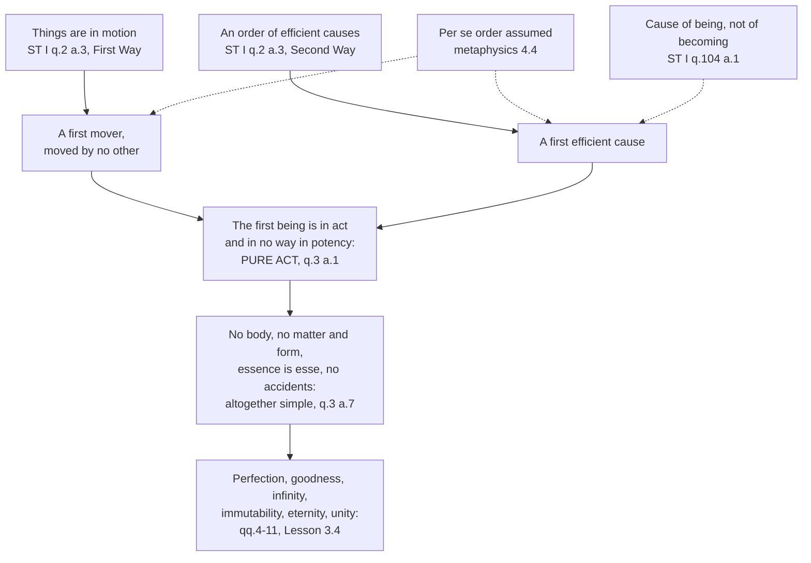

# The Thomistic Synthesis · Lesson 3.2: The First and Second Ways inside the system

> ⏱ ~15 min · Module 3: God: the Five Ways and simplicity · Builds on: [2.1 Act and potency, extended](02-01-act-and-potency-extended.md), [3.1 Demonstrating that God exists](03-01-demonstrating-that-god-exists.md), [`ancient-medieval-philosophy` 7.3 The Five Ways as text](../../ancient-medieval-philosophy/lessons/07-03-the-five-ways-as-text.md) · Unlocks: [3.3 The Third, Fourth and Fifth Ways](03-03-the-third-fourth-and-fifth-ways.md), [3.4 Divine simplicity and the derivation of the attributes](03-04-divine-simplicity-and-the-attributes.md)

## Why this matters

You have already read ST I q.2 a.3 as a text: its five starting facts, its dependence principles, its naming step ([`ancient-medieval-philosophy` 7.3](../../ancient-medieval-philosophy/lessons/07-03-the-five-ways-as-text.md)). This lesson asks a different question about the same page: what do its words mean *inside the system they belong to*, where "motion" is a defined term, "first" is not a date, and the conclusion is used as a premise on the very next page? Almost every famous objection to the [First Way](../reference.md#the-first-way), and almost every bad defence of it, goes wrong on one of those words. And the first thing Aquinas does in q.3 is cash the Way's conclusion into a claim about potency.

## The idea

Three terms mean less than a modern reader hears, and one means far more.

**"Motion" is not locomotion.** The article defines it on the spot: motion is *nothing else than the reduction of something from potentiality to actuality*. So water heating, a seed swelling, a learner coming to understand are all [*motus*](../reference.md#motion-as-reduction-from-potency-to-act); the stone and staff are illustrations, not the subject matter. The further question this course must face: does that definition reach a thing's being *held* in act now, and not merely its changing?

**"Order" is not a queue.** The Second Way's series is essentially ordered: each intermediate causes only in virtue of being caused at that same moment, which is why it cannot run on indefinitely as a line of ancestors can. That distinction is [`metaphysics` 4.4](../../metaphysics/lessons/04-04-ordered-causal-series.md)'s, assumed here; whether the regress argument built on it succeeds is [`philosophy-of-religion`](../../philosophy-of-religion/syllabus.md) 2.3's.

**"First" is not earliest.** A [cause of a thing's *becoming*](../reference.md#cause-of-becoming-and-cause-of-being) explains how it came to be; a cause of its *being* holds it in existence while it exists. The builder is the first kind, the sun lighting the air is the second — Aquinas's own pair at ST I q.104 a.1, taught in [`metaphysics` 4.4](../../metaphysics/lessons/04-04-ordered-causal-series.md) and taken into creation in [5.1](05-01-creation-and-conservation.md). The Ways reach a first in an order of *being*. Nothing in either argument is about the start of the universe, and nothing in either is threatened if the world always existed.

**How wide is *motus*?** Here Thomists divide, and the division is not idle. On the **narrow reading**, Aquinas is using motion in Aristotle's strict sense — the act of what is in potency precisely as in potency, which belongs only to divisible bodies. The article's examples are all physical, and the argument sits in a treatise written when physics meant Aristotle's physics. On the **broad reading**, the definition given in the article is unrestricted, the engine of the argument is act and potency rather than any particular physics, and q.3 a.1 immediately restates the conclusion as one about *being* in act, not about moving. Recent Thomists have pressed the broad reading hard (Edward Feser, *Aquinas: A Beginner's Guide*, 2009); historians of medieval science read q.2 a.3 in its Aristotelian setting. This lesson does not settle it. Notice only that the later articles need the broad conclusion whichever way the word is read.

## Source

Aquinas, *Summa Theologiae* I q.2 a.3 (English Dominican Province translation, public domain), [the Second Way](../reference.md#the-second-way):

> The second way is from the nature of the efficient cause. In the world of sense we find there is an order of efficient causes. There is no case known (neither is it, indeed, possible) in which a thing is found to be the efficient cause of itself; for so it would be prior to itself, which is impossible. Now in efficient causes it is not possible to go on to infinity, because in all efficient causes following in order, the first is the cause of the intermediate cause, and the intermediate is the cause of the ultimate cause, whether the intermediate cause be several, or only one. Now to take away the cause is to take away the effect. Therefore, if there be no first cause among efficient causes, there will be no ultimate, nor any intermediate cause.

Read for tense and for role. Every verb is present: the first *is* the cause of the intermediate, the intermediate *is* the cause of the ultimate. "First", "intermediate" and "ultimate" are positions in a structure, fixed by what causes what, not by when anything happened. The denial is present-tense too: take away the cause and the effect goes with it, now. A reader who hears "first efficient cause" as "the earliest event" is ignoring the grammar of the sentence that introduces it.

Note also what the passage does *not* say. It never says everything has a cause. It says nothing is the efficient cause *of itself*, and that in an ordered series intermediates cause only as caused.

## The argument

**Why a first mover has to be pure act** — ST I q.3 a.1, the second argument of the *respondeo*, which is the hinge of the whole treatise.

1. **Motion is the reduction of something from potency to act, and nothing is so reduced except by something already in act.** **[q.2 a.3; act and potency from 2.1]** *In words:* only what already has a perfection can hand it on.
2. **In any single thing that passes from potency to act, its potency is prior in time to its act.** **[q.3 a.1]** *In words:* the wood is cold before it is hot, so locally potency looks like the more basic thing.
3. **Absolutely speaking, act is nonetheless prior to potency, since a potency is reduced to act only by something in act.** **[q.3 a.1, granting 2]** *In words:* nothing anywhere gets actualised unless something is already actual, so actuality is the senior notion even where potency comes first on the clock.
4. **The first mover and the first efficient cause are moved by nothing and caused by nothing.** **[q.2 a.3]** *In words:* that is exactly what "first" delivered.
5. **Whatever has potency of any kind depends on something else in act to reduce it.** **[from 1 and 3]** *In words:* a potency is a debt, and it has to be paid from outside.
6. **∴ In the first being there is no potentiality whatever: it is [pure act](../reference.md#pure-act).** **[q.3 a.1]**

Two things to notice. No premise comes from authority: this is a philosophical argument inside a theological book, and can be assessed on its own terms. And premise 2 is a concession, not an oversight — Aquinas grants the obvious temporal point, then shows it does not give potency the priority it seems to claim.

From here q.3 uses one lever over and over. Every composition is a composition of something actual with something potential, so removing potency removes them all in turn: a body is divisible and therefore in potency (a.1); matter is potency (a.2); if essence and *esse* differed in God, essence would stand to *esse* as potency to act (a.4, with [`metaphysics` 2.5](../../metaphysics/lessons/02-05-essence-and-existence.md)); a subject is in potency to its accidents (a.6); and so God is altogether simple (a.7). By a.2 Aquinas simply refers back to q.2 a.3 as having shown that God is pure act. [3.4](03-04-divine-simplicity-and-the-attributes.md) walks that derivation.

## The derivation

Solid arrows are steps Aquinas takes in the text; dashed arrows are what a reader must supply from elsewhere for those steps to mean what they mean. The diagram is also a warning: everything downstream of the pure-act node inherits any weakness upstream of it.

## Worked examples

**Example 1 (clean): a student comes to understand a proof.** Run the three terms on a case that is plainly not locomotion.

*Is it motion?* By the article's own definition, yes: the intellect passes from potentially grasping the proof to actually grasping it. By the strict Aristotelian sense, no — strictly, motion belongs to divisible bodies, and an act of understanding is not one. *Summa contra Gentiles* I.13 notes Plato's wider usage, on which understanding is a motion, and says it is in a way not opposed to Aristotle's.

*What is the mover?* Whatever is already in act with respect to this knowledge: the teacher, the written proof. Premise 1 is doing real work here — a teacher who does not know the proof cannot impart it.

*Which kind of causing?* The teacher is a cause of the understanding's *becoming*: once the student has it, the teacher can leave the room and the knowledge stays. So citing this series as an instance of the Second Way would be a mistake. The Way needs cases where the intermediate is borrowing right now.

**Example 2 (hard: where the compression strains).** The *Summa Theologiae* is a textbook for beginners, and its First Way runs about 250 words. In *Summa contra Gentiles* I.13 Aquinas gives the same argument room, and the comparison is uncomfortable. (The standard English of that work is modern, so it is described here, not quoted.)

There he treats the two sentences the *Summa Theologiae* spends on "whatever is moved is moved by another" and "this cannot go on to infinity" as two distinct propositions, each needing proof, and supplies three Aristotelian arguments for each. Then two things surface that the shorter version conceals. First, one argument for the no-regress proposition works by showing that an infinite series of movers would all have to be bodies moved simultaneously — a proof about *physical* movers, which pulls toward the narrow reading of *motus*. Second, Aquinas raises two objections against his own chapter: that the arguments presuppose the eternity of motion, which Catholics deny, and that they presuppose the first moved body to be self-moving, that is, animated. His replies are honest rather than triumphant — a demonstration is in fact *more* efficacious granted an eternal world, since a world with a beginning obviously needs a cause; and if the first mover is not taken to be self-moving, an unmoved separate mover follows immediately.

The strain is not that the argument fails. It is that the tidy *Summa* version reads as free-standing while its author's fuller treatment leans on a cosmology nobody holds. Whether it survives detaching from that scaffolding is [`philosophy-of-religion`](../../philosophy-of-religion/syllabus.md) 2.3's question, not ours.

## Watch out

- **You might think the Ways argue to a starter.** Aquinas holds that reason cannot demonstrate that the world began (ST I q.46 a.2); he could hardly build his proofs on it. The first member is first in an order of causing that is in force now, which is why the becoming/being distinction is load-bearing rather than decorative.
- **You might think the premise is "everything has a cause", so that the obvious reply is "then what caused God?".** The text says something narrower: nothing is the efficient cause of itself, and intermediates cause only as caused. Whether that narrower premise really exempts the first member, and at what cost, is P3.
- **You might think "God is pure act" is dogma because its subject is God.** That God is altogether simple is taught by Lateran IV and by *Dei Filius* ch. 1, and that God can be known by natural reason from created things was defined at Vatican I ([3.1](03-01-demonstrating-that-god-exists.md)); no council has canonised any particular proof or the analysis of simplicity into act and potency. "Pure act" is the Thomist reading of a doctrine, not the doctrine, and sits on a different rung ([`fundamental-theology` 4.4](../../fundamental-theology/lessons/04-04-the-ladder-of-doctrinal-authority.md)). Overstating it and dismissing it as a school slogan are the same error in opposite directions; [3.4](03-04-divine-simplicity-and-the-attributes.md) marks the levels properly.

## One-liner

> Read from inside the system, the First and Second Ways are not about how the world started but about what is holding it in act right now — and their whole yield is one word, *potency*, which q.3 then removes from God entirely.

## Problems

**P1 (🟢) *(Exegetical.)* Close reading.** ST I q.3 a.1, from the *respondeo* (English Dominican Province):

> Secondly, because the first being must of necessity be in act, and in no way in potentiality. For although in any single thing that passes from potentiality to actuality, the potentiality is prior in time to the actuality; nevertheless, absolutely speaking, actuality is prior to potentiality; for whatever is in potentiality can be reduced into actuality only by some being in actuality. Now it has been already proved that God is the First Being. It is therefore impossible that in God there should be any potentiality.

(a) Which clause in the passage grants a point to the opposing view, and what is the point? (b) Which clause overrides it, and on what ground? (c) What does "Now it has been already proved" refer back to, and what does the passage therefore show about how q.2 a.3 functions in the rest of the treatise? 120 words or fewer.

**P2 (🟡) *(Exegetical.)* Diagnose.** An invented remark, overheard after a parish adult-education class:

> "What Aquinas proved is that the chain of causes can't go back forever, so there had to be a first push to get everything going. God lit the fuse, and the universe has been burning down ever since. That's why the argument is still good — science keeps pushing the beginning further back, but it can never get rid of it."

Name **three** distinct things the remark gets wrong about the Ways as Aquinas states them, and for each name the text or distinction that corrects it. Then say in one sentence which position the remark has actually arrived at, and why that position is not Aquinas's. 150 words or fewer.

**P3 (🔴, optional) *(Exegetical (a) · Apologetic (b).)* The special-pleading objection.** (a) State, at its strongest, the objection that the Second Way exempts its own conclusion from its own principle. Do not caricature it: the best version is not "what caused God?" but a dilemma about the scope of the causal premise. 100 words or fewer. (b) Reply from within the system, and concede what the reply leaves standing. 150 words or fewer.

Solutions

**P1** *(Exegetical — strict.)*

**Must hit, strict:**
- (a) The concession is "although in any single thing that passes from potentiality to actuality, the potentiality is prior in time to the actuality". Aquinas grants that within one individual, the potency really does come first chronologically — the wood is cold before it is hot. This is the natural evidence for thinking potency is the more basic notion.
- (b) The override is "nevertheless, absolutely speaking, actuality is prior to potentiality", and the ground is given immediately: "whatever is in potentiality can be reduced into actuality only by some being in actuality". Temporal priority within a case is compatible with actuality being prior *simply*, because the actualising always has to come from something already actual. The two priorities are different kinds, which is why the concession costs nothing.
- (c) It refers back to q.2 a.3, the Five Ways (the First Way in particular). So q.2 a.3 is not a self-contained set-piece: its conclusion enters q.3 as a premise on the first page, and everything q.3 removes from God is removed by way of this potency claim.

**Wrong turns:** reading "prior in time" as Aquinas's own final view and concluding that he contradicts himself; treating "absolutely speaking" as rhetorical emphasis rather than as naming a second, non-temporal order of priority; answering (c) with "Aristotle" — the back-reference is internal to the *Summa*.

**Model answer:** (a) The concession is that in any single thing passing from potency to act, potency is prior *in time*: the wood is cold before it is hot. (b) The override is that absolutely speaking act is prior, because nothing is reduced from potency to act except by a being already in act; the priorities are of different kinds, so the concession is harmless. (c) It refers to q.2 a.3. The Five Ways are therefore working machinery, not a display piece: their conclusion is the premise from which q.3 strips every potency, and so every composition, from God.

---

**P2** *(Exegetical — strict.)*

**Must hit, strict:** three of the following four, each with its corrective text or distinction.
- **"First push to get everything going" / "back forever" treats the first cause as first in time.** Corrected by the tense and the role-vocabulary of q.2 a.3 ("the first *is* the cause of the intermediate"), and by the becoming/being distinction of q.104 a.1 ([`metaphysics` 4.4](../../metaphysics/lessons/04-04-ordered-causal-series.md)): the Way reaches a cause of being, in force now.
- **It assumes the argument needs the world to have had a beginning.** Aquinas denies that a beginning is demonstrable (ST I q.46 a.2), and his fuller treatment in *Summa contra Gentiles* I.13 says the demonstration is if anything more efficacious on the supposition of an eternal world.
- **"The chain can't go back forever" misstates the no-regress premise.** What cannot be extended without limit is an essentially ordered series, where intermediates cause only as caused ([`metaphysics` 4.4](../../metaphysics/lessons/04-04-ordered-causal-series.md)); Aquinas allows accidentally ordered series to run back indefinitely (q.46 a.2 ad 7).
- **"Science can never get rid of it" makes the argument a gap-filler.** The Ways start from facts nobody disputes — that things change, that there is an order of causes — not from what science has failed to explain, so a better cosmology neither threatens nor rescues them.

**Must hit, strict (final sentence):** the remark has arrived at **deism** — a God who acts at the start and not since. Aquinas's God is the cause of the creature's *being*, so on his account withdrawal of that causing would end the creature now (q.104 a.1); the deist picture is the builder-and-house model, which is precisely the one he denies applies.

**Wrong turns:** listing three restatements of the same temporal error and calling them three mistakes; saying the remark is wrong because "God is outside time", which is true but is q.10's claim and does not diagnose *this* argument; calling it a God-of-the-gaps error only, which catches the last sentence but misses the first two.

**Model answer:** (i) It reads "first cause" as earliest: q.2 a.3's present tenses and the cause-of-being/cause-of-becoming distinction (q.104 a.1) make the first a first in a structure standing now. (ii) It makes the argument depend on a beginning of the world; Aquinas denies that a beginning is demonstrable (q.46 a.2) and says the proof is no weaker if the world is eternal. (iii) It states the no-regress premise as being about chains back through time; the premise concerns essentially ordered series, and accidental ones may run back indefinitely (q.46 a.2 ad 7). The remark ends in deism: a starter who lit a fuse. Aquinas's first cause sustains the effect in being, so it can never be finished.

---

**P3** *(Exegetical (a) — strict on the objection · Apologetic (b).)*

**Must hit, strict (a):** the dilemma, not the slogan. The Way needs a causal principle strong enough to force the regress. Either the principle is unrestricted — everything has a cause — in which case it applies to the first cause too and no first is reached; or it is restricted, say to things that are caused, or to things with potency, in which case (the objector says) the restriction has been chosen precisely so as to let the argument stop where the arguer wants, and nothing so far shown rules out the *series itself*, or some brute physical fact, occupying the exempt position. Stating the objection as "what caused God?" alone earns partial credit at best; the force of the objection is the charge that the exemption is stipulated rather than earned.

**Must hit (b), any verdict on how well the reply works:**
- The premise in the text is already the restricted one, and it is not introduced at the terminus: nothing is the efficient cause of itself, and intermediates cause only as caused. So the restriction is not a late patch.
- The exemption is not stipulated but argued for, and it is argued *outside* q.2 a.3: q.3 a.1 shows the first being has no potency at all, and premise 1 of the lesson's reconstruction only ever demanded a cause for what is in potency. A being with nothing to be actualised is not a being for which the principle fails; it is a being to which the principle does not apply.
- Concede honestly: this moves the weight from q.2 a.3 to q.3 a.1, so the reply is only as strong as the pure-act argument. And nothing in q.2 a.3 by itself rules out the objector's rival candidate for the exempt position; that has to be excluded by the later articles, whose job is to show that what has no potency is also simple, one and immaterial.

**Wrong turns:** replying "God is uncaused by definition", which concedes the stipulation charge; replying only that the series is essentially ordered, which answers a different objection (why not an infinite regress) and not this one; treating the concession as optional — a reply that claims q.2 a.3 alone defeats the objection has misread where the work is done.

**Model answer (b), one of several:** The article never uses an unrestricted causal principle. It says nothing causes itself, and that intermediates cause only as they are caused; both are restricted from the start, and neither was tailored at the finish line. What earns the exemption is argued a question later: q.3 a.1 concludes that the first being is in act and in no way in potency, and the demand for a cause was always a demand raised by potency. So the first cause is not a lucky exception to the rule but a case the rule never reached. What the reply concedes is real. All the load is now on the pure-act step, and q.2 a.3 taken alone does not show that the exempt position could not be filled by something else; questions 3 to 11 exist to close that gap, and if they fail the objection returns intact.

## Flashback

**From Lesson [2.4](02-04-the-transcendentals.md) (The transcendentals):** *(Exegetical.)* ST I q.16 a.1 holds that a thing may stand to an intellect in two ways: **essentially**, to the intellect on which it depends for its essence, as a house depends on the architect's; and **accidentally**, to an intellect that merely happens to know it. Aquinas then writes: "We do not judge of a thing by what is in it accidentally, but by what is in it essentially." (a) Using that sentence, say which intellect measures the truth of a *natural* thing, and why the other does not. (b) A stone lies undiscovered underground. Is it a true stone on this account, and what decides it? Two sentences per part.

Solution

**Must hit, strict (a):** the **divine** intellect. A natural thing depends for its essence on the intellect that preconceived it, so that relation is the essential one — "natural things are said to be true in so far as they express the likeness of the species that are in the divine mind" — whereas our intellect merely knows the thing and the thing does not depend on it, which is the accidental relation the quoted rule sets aside. Credit for adding that our intellect is not thereby cut out of truth: q.16 a.1's conclusion is that truth is primarily in an intellect and only secondarily in things, and our intellect is true by conforming to the thing.

**Must hit, strict (b):** yes, a true stone. Its truth is its expressing the likeness of its species in the divine mind, a relation it has whether or not anyone ever finds it; being knowable by us is the accidental relation, and a thing is not judged by what is in it accidentally.

**Wrong turns:** answering (a) with "ours, because truth is in the intellect" — right about where truth resides primarily, wrong about what measures a natural thing; concluding in (b) that an unfound stone is not true, which is the account of truth ("that is true which is seen") that the article's first objection reports Augustine as condemning, and which would make truth depend on who is looking; reversing the article so that truth is primarily in things and only derivatively in intellects.

**Model answer:** (a) The divine intellect: a natural thing depends on it for its essence and so is related to it essentially, expressing the likeness of the species in the divine mind. Ours only knows the stone, and the stone does not depend on our knowing it, so that relation is accidental and a thing is not judged by what is in it accidentally. (b) Yes. What decides it is the likeness it bears to its idea in the divine mind, which it bears unseen; being known by anyone is exactly the accidental relation, so nothing is lost by lying underground.

## Connections

- **Backward:** the Ways as text, with their sources and their common shape, are [`ancient-medieval-philosophy` 7.3](../../ancient-medieval-philosophy/lessons/07-03-the-five-ways-as-text.md); the essentially ordered series and the becoming/being distinction are [`metaphysics` 4.4](../../metaphysics/lessons/04-04-ordered-causal-series.md), with act and potency themselves at [`metaphysics` 2.2](../../metaphysics/lessons/02-02-change-act-and-potency.md) and [2.1](02-01-act-and-potency-extended.md). What kind of demonstration is on offer, and what *Dei Filius* did and did not define, is [3.1](03-01-demonstrating-that-god-exists.md).
- **Forward:** the pure-act conclusion is the lever of [3.4](03-04-divine-simplicity-and-the-attributes.md), and through it of the whole treatise on God. The remaining three Ways, and the problem of showing that the five conclusions name one being, are [3.3](03-03-the-third-fourth-and-fifth-ways.md). A cause of being rather than of becoming is what creation and conservation turn on in [5.1](05-01-creation-and-conservation.md), and what keeps [5.2](05-02-providence-and-secondary-causes.md) from collapsing into occasionalism or deism.
- **Sideways:** whether the *per se* regress argument is sound, and what modern physics does to a premise about movers, is [`philosophy-of-religion`](../../philosophy-of-religion/syllabus.md) 2.3. The levels used in the third *Watch out* bullet come from [`fundamental-theology` 4.4](../../fundamental-theology/lessons/04-04-the-ladder-of-doctrinal-authority.md), which owns them.
