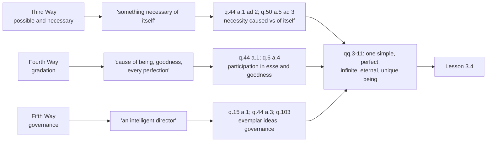

# The Thomistic Synthesis · Lesson 3.3: The Third, Fourth and Fifth Ways inside the system

> ⏱ ~15 min · Module 3: God: the Five Ways and simplicity · Builds on: [3.1](03-01-demonstrating-that-god-exists.md), [3.2](03-02-the-first-and-second-ways-inside-the-system.md), [2.2](02-02-esse-and-essence-the-real-distinction.md), [2.3](02-03-participation.md), [`ancient-medieval-philosophy` 7.3](../../ancient-medieval-philosophy/lessons/07-03-the-five-ways-as-text.md) · Unlocks: [3.4](03-04-divine-simplicity-and-the-attributes.md)

## Why this matters

Out of context these are the three embarrassing Ways. The Third seems to commit a quantifier shift, the Fourth seems to need a hottest thing, and the Fifth seems to be Paley's watch four centuries early. Read where they stand, they are the Ways most tightly wired into what Module 2 built: a creature that receives its *esse*, a perfection held by participation, a nature that tends somewhere without knowing it does. And Aquinas himself comes back to all three later in Part I and runs them again with the machinery he could not use in q.2. This lesson is about what the key words mean inside the system, and where the *Summa* cashes them. Whether any Way is a good argument is [`philosophy-of-religion`](../../philosophy-of-religion/syllabus.md) 2.3's question, not ours; the article as a thirteenth-century text belongs to [`ancient-medieval-philosophy` 7.3](../../ancient-medieval-philosophy/lessons/07-03-the-five-ways-as-text.md).

## The idea

Question 2 article 3 runs to barely a thousand words in a textbook for beginners who have not yet met act, potency, *esse* or participation. So every Way ends the same way: not with a divine nature but with a [nominal definition](../reference.md#nominal-definition-of-god), the meaning of the word "God" taken as the middle term rather than God's essence (q.2 a.2 ad 2, from [3.1](03-01-demonstrating-that-god-exists.md)). A Way deposits a placeholder — *something necessary of itself*, *a cause of every perfection*, *an intelligent director* — and the rest of Part I is where the placeholders get filled.

**The Third Way.** "Possible" does not mean logically possible. It is glossed by the text itself: things "generated" and "corrupted", that is, things with matter left in potency to losing their form. "Necessary" is then the contradictory: no potency to not-be, which means *incorruptible*. This is not the necessity of [`metaphysics` 3.1](../../metaphysics/lessons/03-01-kinds-of-necessity.md), which asks what could not have failed to exist under any description. Aquinas's world is therefore full of [necessary creatures](../reference.md#necessary-per-se-and-necessary-from-another): angels, which are subsisting forms with nothing to separate (q.50 a.5); the human soul, incorruptible for the same reason (q.75 a.6); and, on the physics he inherited, the heavenly bodies (q.9 a.2). That is exactly why the Way does not stop at the first necessary thing it meets. Half the argument is spent asking whether a necessary thing has its necessity *from another*.

The step everyone argues about is in the first half: from "each thing can fail to be" to "at some time everything had failed". That dispute, with its charitable readings, is [`ancient-medieval-philosophy` 7.3](../../ancient-medieval-philosophy/lessons/07-03-the-five-ways-as-text.md)'s; named here, cited, not redone. So is the question whether the article is Aristotelian or Avicennian in spirit. Both answers have text: the possible/necessary pairing and the split between necessity of itself and necessity from another are Avicenna's, while the gloss of "possible" as generable and corruptible is Aristotle's physics.

**The Fourth Way.** Degrees of good, true and noble point to a maximum, and the maximum in a kind causes the rest. Modern readers rank it last. In the system it is the most at home of the five, because it is the argument from [participation](../reference.md#participation) ([2.3](02-03-participation.md)) in its compressed form: what a thing has partially, it has from something that is it.

**The Fifth Way.** Its datum is regularity, not intricacy — things without knowledge hitting the same target again and again. Its principle is that tending to an end requires being aimed. This is [natural finality](../reference.md#natural-finality), not contrivance, and the difference decides what can refute it.

## Source

Aquinas, *Summa Theologiae* I q.2 a.3, the Fifth Way (English Dominican Province translation, public domain):

> We see that things which lack intelligence, such as natural bodies, act for an end, and this is evident from their acting always, or nearly always, in the same way, so as to obtain the best result. Hence it is plain that not fortuitously, but designedly, do they achieve their end. Now whatever lacks intelligence cannot move towards an end, unless it be directed by some being endowed with knowledge and intelligence; as the arrow is shot to its mark by the archer. Therefore some intelligent being exists by whom all natural things are directed to their end; and this being we call God.

Two words carry the weight. The evidence is *always, or nearly always* — the regularity of fire heating and acorns making oaks, not the fineness of anything's construction. And "designedly" translates *ex intentione*, "from intention"; the very next sentence says whose intention, and it is the archer's, not the arrow's. The argument is about aim, not about assembly.

## The argument

**The Third Way's second half, in the system.**

1. A thing is necessary when it has no potency to not-be. *In words:* there is nothing in it whose loss would end it. **[act and potency, [2.1](02-01-act-and-potency-extended.md)]**
2. Having no potency to not-be says nothing about where a thing gets its *esse*. In every creature essence and *esse* are distinct, so even an incorruptible creature holds existence from another. *In words:* nothing can corrupt an angel, and that still does not make the angel explain itself. **[[2.2](02-02-esse-and-essence-the-real-distinction.md)]**
3. So there are necessary things that have a cause of their necessity. Aquinas says this in so many words at q.44 a.1 ad 2, and applies it to angels at q.50 a.5 ad 3: it is not repugnant to an incorruptible being to depend on another for its existence. **[the text's own]**
4. Such caused-necessary things cannot regress to infinity, "as has been already proved in regard to efficient causes" — the Second Way's *per se* series ([3.2](03-02-the-first-and-second-ways-inside-the-system.md); [`metaphysics` 4.4](../../metaphysics/lessons/04-04-ordered-causal-series.md)). **[borrowed from the Second Way]**
5. So there is something necessary of itself, which causes necessity in others.

**The Fourth Way, run again at q.44 a.1.** Aquinas returns to it when he asks whether every being must be created by God, and the argument arrives at the same conclusion by a different road:

1. Whatever is found in a thing by participation is caused in it by that to which it belongs essentially — iron is ignited by fire.
2. God is subsisting being itself (q.3 a.4), and subsisting being can only be one (q.11 aa.3-4).
3. So everything other than God is a being by participation.
4. So all things, differing by the degree of being they participate, are caused by one First Being that possesses being most perfectly.

*In words:* the gradation premise no longer rests on a scale needing a top. It rests on received *esse*, which comes in degrees because each essence receives as much as it can hold ([2.1](02-01-act-and-potency-extended.md)). Aquinas then invokes the same passage of Aristotle's *Metaphysics* II, and the same fire example, that the Fourth Way used. At q.6 a.4 he does the same for goodness, citing q.2 a.3 by name, refusing Plato's separate ideas, and landing on the formula that saves the Way from pantheism: "of all things there is one goodness, and yet many goodnesses."

**The Fifth Way, run again at I-II q.1 a.2.** Every agent acts for an end, because an agent not determined to some effect would have no reason to do one thing rather than another. Determination comes two ways: by rational appetite, which is will, or by natural inclination. A thing with reason moves itself to its end; a thing without reason is *moved by another* to its end, "as an arrow tends to a determinate end through being moved by the archer". The reply to objection 3 names the other: things lacking reason are moved to their particular ends by a will that reaches the universal good, the divine will. Where the aim is stored is q.15 a.1 and q.44 a.3 — the exemplar ideas in the divine intellect, which is also why q.103 can call the world governed.

## The derivation

Left column: five nominal definitions. Middle: where Part I supplies the metaphysics. Right: the identification of the five conclusions as one being, which is [3.4](03-04-divine-simplicity-and-the-attributes.md)'s work, not q.2's.

## Worked examples

**Example 1 (clean): is your soul a necessary being?** Run steps 1-3. The human soul is subsistent — it has its own act of existing, not borrowed from the composite — so nothing can strip it of a form it *is* (q.75 a.6). It therefore has no potency to not-be, and by step 1 it is necessary in the Third Way's sense. By step 2 that tells us nothing about its origin: essence and *esse* are still distinct in it, so it holds existence from another, and it was created. So it is a necessary thing whose necessity is caused — precisely the case step 3 says exists.

Two payoffs. First, this is why the Way's second half is not padding: a reader who stopped at "something necessary exists" could be pointing at his own soul. Second, it shows what "necessary" is not. Aquinas holds that God could cease to sustain the soul, and that this would not be corruption but the withdrawal of existence (q.75 a.6 ad 2). A being can be necessary in his sense and still be annihilable in principle.

**Example 2 (hard): run the Fourth Way on heat.** Things are more and less hot. By the Way's own pattern there should be something hottest, and it should be the cause of all hot things. Aquinas offers exactly this as his illustration — and modern physics has no hottest thing, so the illustration fails on its own terms.

The system's answer is to restrict the Way to perfections that admit of more and less *because* of how much being they hold: good, true, noble, and being itself, the [transcendentals](../reference.md#transcendentals) of [2.4](02-04-the-transcendentals.md). A thing is not hotter by having more being; it is better by having more. On this reading step 2 of the q.44 a.1 argument is doing the work, and "the maximum in any genus" is shorthand, since being and goodness are not genera at all.

The strain is real, and worth naming rather than smoothing: the restriction is exactly what Aquinas's own fire example ignores. Thomists divide over whether the Fourth Way is a free-standing argument from degrees or a compressed participation argument that the later questions state properly. That is a live dispute, and this lesson does not settle it.

## Watch out

- **You might think a "necessary being" in the Third Way must be God, so the second half is a formality.** Necessary here means incorruptible, and Aquinas's universe is full of incorruptible creatures (q.50 a.5, q.75 a.6, q.9 a.2). Importing the modern sense of necessity makes the article's whole second half unintelligible.
- **You might think evolutionary biology answers the Fifth Way.** It answers an argument from intricate contrivance, which is Paley's ([`philosophy-of-religion`](../../philosophy-of-religion/syllabus.md) 3.1). The Fifth Way's datum is that natures act *always or nearly always* the same way toward a determinate result — which a Darwinian explanation uses rather than removes. Whether that saves the argument is a separate question, and not this course's.
- **You might think "and this all call God" claims that the five conclusions are one God.** It attaches a name fixed by a nominal definition. That the first mover, the necessary being and the intelligent director are one simple being is argued across qq.3-11, above all at q.3 a.7 and q.11 a.3 — [3.4](03-04-divine-simplicity-and-the-attributes.md).

## One-liner

> The last three Ways end in placeholders — a necessary being, a maximum, a director — and the rest of Part I fills them with received *esse*, participation and exemplar ideas.

## Problems

**P1 (🟢) *(Exegetical.)* Close reading.** The Third Way's second half (English Dominican Province):

> But every necessary thing either has its necessity caused by another, or not. Now it is impossible to go on to infinity in necessary things which have their necessity caused by another, as has been already proved in regard to efficient causes. Therefore we cannot but postulate the existence of some being having of itself its own necessity, and not receiving it from another, but rather causing in others their necessity. This all men speak of as God.

(a) Which words show that the argument does not stop at the first necessary thing it reaches, and what kind of thing would a "necessary thing which has its necessity caused by another" be? Give one of Aquinas's own examples with its article. (b) Which clause imports a result from an earlier Way, and which Way? (c) Does "necessary" here mean "could not have failed to exist under any circumstances"? Answer from the words, and say what it does mean. 150 words or fewer in total.

**P2 (🟡) *(Exegetical (a) · Evaluative (b).)* Reconstruct, then judge.** (a) Put the Fourth Way's move from gradation to a cause into numbered premises, and mark each premise as coming from the metaphysics of Module 2, from an earlier article of Part I, or from authority. (b) Thomists disagree about what the Fourth Way is: a free-standing argument from degrees of perfection, or a compressed form of the participation argument that q.44 a.1 and q.6 a.4 state properly. Argue for one reading in 150 words or fewer, using the text of the Way itself and at least one of those later articles against the reading you reject. Any verdict.

**P3 (🔴, optional) *(Exegetical.)* Diagnose.** An invented parish-newsletter paragraph, written for this problem:

> "Every year the microscopes get better, and every year they find machinery inside the cell that is far too finely fitted to have thrown itself together. Wherever the parts are too intricate for blind chance, we are looking straight at the hand of the Designer — and this, as St Thomas said, all men call God."

Name what the writer has substituted for the Fifth Way's datum, and say which sentence of the Source passage the substitution displaces. Then say what happens to the writer's argument, and what happens to Aquinas's, when a natural explanation of the intricacy is found. 150 words or fewer.

Solutions

**P1** *(Exegetical — strict.)*

**Must hit, strict:**
- (a) The decisive words are "either has its necessity caused by another, or not". They split necessary things into two classes, so reaching a necessary thing settles nothing until you know which class it is in. A caused-necessary thing is one that cannot be corrupted but still receives its existence from something else: an angel, a subsisting form with nothing to separate (q.50 a.5, with ad 3 saying explicitly that depending on another for existence is not repugnant to an incorruptible being); equally the human soul (q.75 a.6), or the heavenly bodies on Aquinas's physics (q.9 a.2). Credit for q.44 a.1 ad 2, where he says outright that some necessary things have a cause of their necessity.
- (b) "as has been already proved in regard to efficient causes" — the **Second Way**, whose no-regress result is borrowed rather than re-argued.
- (c) No. "Necessary" is the contradictory of the "possible to be and not to be" defined earlier in the article as being generated and corrupted. So it means **incorruptible**: having no potency to not-be. It is compatible with being caused, and even with being annihilable by the withdrawal of God's conserving act.

**Wrong turns:** answering (a) with "a contingent being", which is the other class; reading (c) with the modern notion of necessary existence, which makes a caused necessary being a contradiction and the whole second half pointless; saying the borrowed result in (b) comes from the First Way (movers, not efficient causes).

**Model answer:** (a) "Either has its necessity caused by another, or not" divides necessary things in two, so the first one found may be caused. Such a thing is incorruptible but receives existence — an angel (q.50 a.5, and ad 3 on depending for existence), or the human soul (q.75 a.6). (b) "As has been already proved in regard to efficient causes" imports the Second Way's denial of an infinite regress. (c) No: "necessary" contradicts the article's "possible to be and not to be", that is, generated and corrupted. It means incorruptible, having no potency to not-be, which a creature can be.

---

**P2** *(Exegetical (a) · Evaluative (b).)*

**Must hit, strict (a):** premises in this order, each marked.
- P1. Among beings some are more and some less good, true and noble. **[observation]**
- P2. "More" and "less" are said according as things resemble, in their different ways, something that is the maximum. **[the article's own premise, in the Platonic pattern]**
- P3. So there is something truest, best, noblest, and therefore something that is uttermost being — since the greatest in truth are the greatest in being. **[authority: Aristotle, *Metaph.* II, cited in the article]**
- P4. The maximum in any genus is the cause of all in that genus. **[authority: the article states it without attribution and illustrates it with fire; q.44 a.1 attributes the parallel principle to *Metaph.* II]**
- C. So there is something that is to all beings the cause of their being, goodness and every other perfection.
- The mark that matters: **nothing in the Way as written comes from Module 2.** Participation and received *esse* enter only when Aquinas runs the argument again at q.44 a.1, which uses q.3 a.4 (God as subsisting being) and q.11 (its uniqueness) — both earlier articles of Part I.

**Must hit, any verdict (b):**
- State what each reading must explain: the free-standing reading has to make P2 and P4 work on their own; the participation reading has to explain why q.2 a.3 does not mention participation at all.
- Use the Way's own words, not just the later articles.
- Use at least one later article as evidence, not as assertion: q.44 a.1 reaches the same conclusion with participation and the same Aristotle quotation; q.6 a.4 cites q.2 a.3 by name when it rewrites goodness as participated.
- A one-line verdict, either way.

**Wrong turns:** listing premises without marking their sources, which is the whole exercise; claiming the Way itself argues from *esse*, which it does not; treating q.6 a.4's back-reference as proof that the Way "really means" participation without saying why a back-reference settles a reading.

**Model answer (b), one of several:** The participation reading. The Way's weak joint is P4, which needs "genus" to cover being and goodness — and for Aquinas existence cannot of itself be a genus (q.3 a.5 ad 1), while goodness is convertible with being, so the premise cannot be read strictly. Read as participation it survives: what is had partially is had from what has it essentially, and degrees of perfection are degrees of received *esse*. The evidence that this is Aquinas's own repair is q.6 a.4, which cites q.2 a.3, drops Plato's separate ideas, and recasts the gradation as likeness to the divine goodness. Against me: the Way never says "participation", and q.44 a.1 may be a second argument rather than the same one. But a reading that leaves P4 literally false is worse than one that explains it.

---

**P3** *(Exegetical — strict.)*

**Must hit, strict:**
- The substitution: **intricacy or complexity of construction in place of regularity of operation**, and "blind chance could not assemble this" in place of "these act always or nearly always the same way". It is Paley's argument from contrivance ([`philosophy-of-religion`](../../philosophy-of-religion/syllabus.md) 3.1), not Aquinas's.
- It displaces the first sentence of the passage, which states the datum and its evidence: things lacking intelligence act for an end, "and this is evident from their acting always, or nearly always, in the same way".
- A second, related fault, worth credit: the writer's Designer is inferred as the *assembler of the parts*, a cause of the same order as the natural causes he is competing with — a God of the gaps. Aquinas's director is the one who gives natures their aim at all, including the natures a natural explanation would use.
- Bonus, not required: the closing tag is not even the Fifth Way's. "This all men speak of as God" ends the Third Way; the Fifth ends "and this being we call God".
- When a natural explanation of the intricacy appears, the writer's argument loses its evidence, because his evidence was the absence of such an explanation. Aquinas's does not, because a natural explanation is a description of things acting always or nearly always in the same way, which is his datum, not his rival. Whether the Fifth Way is a *good* argument is still open, and is not this course's question.

**Wrong turns:** saying only "this is bad science"; treating the gaps problem and the contrivance substitution as the same point without distinguishing them; claiming that Aquinas is therefore refuted or vindicated by evolution, when the point is that the two arguments take different evidence.

**Model answer:** He has swapped intricacy for regularity: his evidence is machinery too finely fitted for chance, whereas Aquinas's is that things without knowledge act always or nearly always in the same way, to the best result — the passage's first sentence, which the substitution displaces. His Designer is also a rival to natural causes, assembling what they could not, which makes it a God of the gaps; Aquinas's director gives natures their aim, including any nature a natural explanation invokes. So a natural account of the cell's machinery removes the writer's evidence outright, while leaving Aquinas's untouched, since such an account just describes more things acting regularly toward an end.

## Flashback

**From Lesson [3.1](03-01-demonstrating-that-god-exists.md) (Demonstrating that God exists):** *(Exegetical.)* ST I q.2 a.1 asks whether "God exists" is self-evident, and concludes that it is self-evident in itself but not to us. Reconstruct that *respondeo* in four numbered premises and a conclusion. Then, in one sentence each: which premise concedes to the objector the strongest form of his point, and which premise imports a result the *Summa* has not yet proved — naming where it is proved.

Solution

**Must hit, strict:** the four premises, in any equivalent wording.

- **P1.** A proposition is self-evident when the predicate is included in the essence of the subject, as in "Man is an animal".
- **P2.** It is self-evident *to us* only if the essence of subject and predicate is known to us; where the terms are not known, the proposition is self-evident in itself but not to those who do not know them.
- **P3.** In "God exists" the predicate is the same as the subject, "because God is His own existence".
- **P4.** We do not know the essence of God.
- **∴ C.** "God exists" is self-evident in itself and not to us, and so needs to be demonstrated by what is more known to us though less known in its nature — namely, by effects.

**Must hit, strict (the two marks):** the concession is **P3**. Aquinas grants the strongest form of what the objector from the meaning of the name wants — that of itself the proposition is per se known, predicate and subject being the same — and puts the entire denial on the words "to us". The imported result is **P3** as well: that God is his own existence is proved only at ST I q.3 a.4, which a.1 cites forward as what "will be hereafter shown". It is therefore available to license a concession and not to serve as a premise in the proof that God exists, which would make q.2 lean on a conclusion of q.3.

**Wrong turns:** listing the *sed contra* as a premise — "The fool said in his heart, There is no God" (Psalm 53:2) tells you where Aquinas lands and does not argue it; making P4 the concession, when it is the point of denial; reporting that Aquinas simply rejects the self-evidence of "God exists", which loses the distinction the article is built on; leaving P2 out, so that P1 and P4 no longer connect. Bonus, not required: ad 1 concedes Damascene's implanted knowledge of God only "in a general and confused way", since knowing that someone is approaching is not knowing that Peter is approaching.

**Model answer:** P1 a proposition is self-evident when the predicate is contained in the essence of the subject, as "Man is an animal". P2 it is self-evident to us only where the essence of both terms is known to us; otherwise it is self-evident in itself alone. P3 in "God exists" predicate and subject are the same, since God is his own existence. P4 we do not know God's essence. ∴ C the proposition is self-evident in itself but not to us, and must be demonstrated from effects. P3 is the concession: everything the objector wants is granted except self-evidence *to us*. P3 is also the import, from q.3 a.4, cited forward — which is why it can warrant the concession but do no work in the demonstration.

## Connections

- **Backward:** the Third Way's "necessary" is act and potency applied to existing itself ([2.1](02-01-act-and-potency-extended.md)), and its second half needs the real distinction ([2.2](02-02-esse-and-essence-the-real-distinction.md)) to make sense of a creature that cannot corrupt. The Fourth Way is participation ([2.3](02-03-participation.md)) compressed, and the restriction that saves it is the transcendentals ([2.4](02-04-the-transcendentals.md)). The no-regress step is borrowed wholesale from the Second Way ([3.2](03-02-the-first-and-second-ways-inside-the-system.md)), and "and this all call God" depends on the nominal definition of [3.1](03-01-demonstrating-that-god-exists.md). The article as text, with its sources and its disputed step, is [`ancient-medieval-philosophy` 7.3](../../ancient-medieval-philosophy/lessons/07-03-the-five-ways-as-text.md).
- **Forward:** [3.4](03-04-divine-simplicity-and-the-attributes.md) takes the five placeholders and argues that they name one simple being. The Fifth Way's exemplar ideas and the governance of the world return in [5.1](05-01-creation-and-conservation.md) and [5.2](05-02-providence-and-secondary-causes.md), where the director becomes a doctrine of providence working through real secondary causes. The human soul of Example 1 is [5.3](05-03-the-human-soul-in-the-system.md).
- **Sideways:** the modern taxonomy of necessity that this lesson keeps warning you not to import is [`metaphysics` 3.1](../../metaphysics/lessons/03-01-kinds-of-necessity.md), and the *per se* series as a live thesis is [`metaphysics` 4.4](../../metaphysics/lessons/04-04-ordered-causal-series.md). Design as a likelihood argument, from Paley to fine-tuning, is [`philosophy-of-religion`](../../philosophy-of-religion/syllabus.md) 3.1; whether the contingency argument succeeds is 2.3 of the same course.
