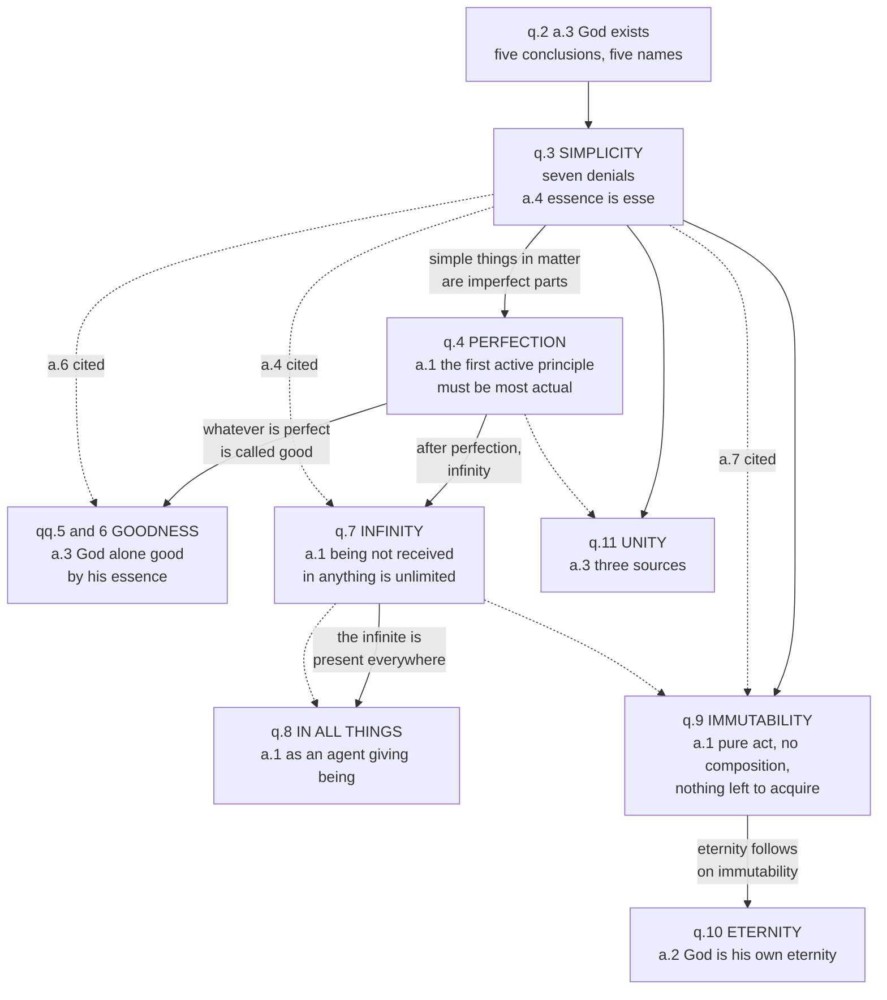

# The Thomistic Synthesis · Lesson 3.4: Divine simplicity and the derivation of the attributes

> ⏱ ~15 min · Module 3: God: the Five Ways and simplicity · Builds on: [2.1](02-01-act-and-potency-extended.md), [2.2](02-02-esse-and-essence-the-real-distinction.md), [3.3](03-03-the-third-fourth-and-fifth-ways.md) · Unlocks: [4.1](04-01-how-a-human-intellect-knows.md), [4.2](04-02-knowing-god-from-creatures-the-three-ways.md)

## Why this matters

Question 2 ended five times with "and this all call God" — five conclusions and five names, with nothing yet saying they name one thing, or that the thing named is not simply the largest item in the world's inventory. Questions 3 to 11 do that work, and question 3 is the hinge. It is also where this course's signature error gets its cleanest test. That God is altogether simple is a doctrine of the Church; the Thomist account of what simplicity rules out is theology; Scotus's rival account is a Catholic option. Three things, three levels, and collapsing any two is an error in either direction.

## The idea

Two moves, and the first is about method.

**Aquinas is not going to tell you what God is.** The treatise takes the compositions we find in everything we know and deletes them one at a time; what survives deletion is what may be said. Hence a section short on definitions and long on denials.

**[Simplicity](../reference.md#divine-simplicity) is the name for the completed deletion.** In God there is no composition of any kind: no parts, no matter, no form received in anything, no essence that *has* an act of existing, no subject carrying attributes. In plain words: God is not a thing that *has* properties. God does not *have* goodness or power or existence; God *is* them, and there is nothing in God that is not God.

Why a first being must be like that is two lines from [2.1](02-01-act-and-potency-extended.md). Parts are prior to the whole, so a composite depends on them; whatever depends is caused; a first uncaused being therefore has no parts — not even the thinnest sort, an essence standing to its own existence as potency to act.

Everything in questions 4 to 11 is then deletion continued, or repair of the damage deletion seems to do. Immutability is potency deleted. Eternity is immutability with succession deleted. Infinity is limit deleted. Unity is multiplicity deleted. Only perfection and goodness look positive, and they are argued a different way — which turns out to matter.

## Source

The prologue to ST I q.3 (English Dominican Province), the sentence everything above is compressed from:

> When the existence of a thing has been ascertained there remains the further question of the manner of its existence, in order that we may know its essence. Now, because we cannot know what God is, but rather what He is not, we have no means for considering how God is, but rather how He is not. Therefore, we must consider: (1) How He is not; (2) How He is known by us; (3) How He is named. Now it can be shown how God is not, by denying Him whatever is opposed to the idea of Him, viz. composition, motion, and the like. Therefore (1) we must discuss His simplicity, whereby we deny composition in Him; and because whatever is simple in material things is imperfect and a part of something else, we shall discuss (2) His perfection; (3) His infinity; (4) His immutability; (5) His unity.

Three things to take from it.

**["We cannot know what God is"](../reference.md#how-he-is-not) is a remark about our intellect, not about God.** The same sentence immediately books the two questions that repair it: *how He is known by us* (q.12) and *how He is named* (q.13). The apophatic claim and the programme of Module 4 arrive in one breath; [4.2](04-02-knowing-god-from-creatures-the-three-ways.md) collects on the promissory note.

**The plan has five items, not eight.** Simplicity, perfection, infinity, immutability, unity. Goodness, presence in all things and eternity are not on this list; each is attached later by the prologue of its own question. The shape of the treatise cannot be read off this passage alone.

**The reason given for taking perfection second is an objection, not a premise.** Simple things in the material world — a lump of stuff without structure — are the imperfect bits out of which bigger things are made. So "simple" sounds like *meagre*, and the charge has to be cleared at once. A problem below turns on this.

## The argument

### The seven denials

Question 3 removes one composition per article, most obvious first:

1. **a.1 — not a body.** No quantitative parts.
2. **a.2 — not matter and form.** Nothing in God is potential to being informed.
3. **a.3 — his nature is not distinct from his *suppositum*.** In words: God is not an individual *instance* of divinity the way Socrates is an instance of humanity; God *is* his own deity.
4. **a.4 — his essence is his existence.**
5. **a.5 — not in a genus.** In words: there is no wider kind of which God is one species, so he is on no scale with anything.
6. **a.6 — no accidents.** Nothing is added to God that he might have lacked.
7. **a.7 — altogether simple.**

(a.8 adds a guard: God is not a component of anything else, blocking pantheism.)

Article 7's *respondeo* collects the six denials, then adds four arguments that stand alone: a composite is posterior to and dependent on its parts, while God is the first being; every composite has a cause, since things that differ do not unite unless something unites them, and God is uncaused; every composite involves potency and act; and nothing composite is wholly predicated of any of its parts, so in a composite there is always something that is not the thing itself.

The article doing the downstream work is **a.4**, which argues three ways. Whatever a thing has besides its essence must be caused, by its own principles or by an outside agent, and neither can supply existence to a first efficient cause. Existence stands to essence as actuality to potency, and there is no potency in God. And what *has* existence without *being* existence is a being by participation, so would not be first. That is the real distinction of [2.2](02-02-esse-and-essence-the-real-distinction.md) turned around to say what God is not.

### Three levels, not one

[Levels](../reference.md#simplicity-at-three-levels) on the ladder of [`fundamental-theology` 4.4](../../fundamental-theology/lessons/04-04-the-ladder-of-doctrinal-authority.md).

**The doctrine.** That God is altogether simple is taught by the Fourth Lateran Council (1215), whose opening confession of faith professes one true God, three persons in one altogether simple essence, substance or nature; and again by Vatican I, *Dei Filius* ch. 1, confessing one God who, being one, singular, altogether simple and unchangeable, is really and essentially distinct from the world. Both are solemn conciliar acts proposing the doctrine as the Catholic faith — **rung 1**. Note the date: Lateran IV is a decade before Aquinas was born.

**The analysis.** What simplicity excludes, item by item — above all a.4's identification of essence with *esse*, which leans on the real distinction in creatures — is Thomist theology. No council has defined the real distinction or a.4's argument. **Rung 5**, freely disputed.

**The alternative.** Scotus holds a [formal distinction](../reference.md#the-formal-distinction-among-the-attributes) among the divine attributes: wisdom and goodness in God are neither two things nor merely two of our words, but distinct formalities on the side of the thing, prior to any act of our minds, in one wholly indivisible reality. He affirms the doctrine and rejects the Thomist analysis of it. Thomists reply that no intermediate distinction is available — it collapses into a real distinction or into a distinction of reason; Scotists reply that this begs the question. A live intramural argument, not a denial of Lateran IV.

Both errors are graded strictly. Calling Scotus's position a denial of simplicity promotes a school thesis to a council's level. Calling simplicity "Aquinas's theory of God" demotes a conciliar doctrine to a school thesis. [6.5](06-05-what-the-church-has-said-about-thomism.md) makes this a procedure.

## The derivation of the attributes

In the [map](../reference.md#the-derivation-of-the-attributes), solid arrows are the order the questions' own prologues announce, with the licensing phrase on the edge; dashed arrows are dependencies the articles themselves cite.

The two kinds of arrow do not coincide, and that gap is the one hard point in the lesson.

## Worked examples

**Example 1 — the machinery on a clean case: infinity (q.7 a.1).** A thing is finite by being terminated: matter is made finite by the form it receives, a form by the matter that receives it. Being is the most formal of all things. *In words:* limit comes from a receiver, so to find out whether something is limited, look for what receives it. God's being is not received in anything — he is his own subsistent being, and the article cites a.4 by number for it. No receiver, therefore no limit, therefore infinity. "Infinite" here is not a superlative about size; it is the absence of anything doing the limiting, which is [act is limited by potency](../reference.md#act-is-limited-by-potency) read at the top of the ladder ([pure act](../reference.md#pure-act), 2.1).

**Example 2 — where the map strains: presence in all things (q.8).** The q.8 prologue files it under infinity, on the ground that presence everywhere plainly belongs to an infinite being. But the *respondeo* of q.8 a.1 argues nothing of the kind. God is in all things as an agent is present to what it acts on; since God is being by his own essence, created being is his proper effect, as igniting is fire's; and he causes that effect not only when a thing starts but as long as it is kept in being. So God is in each thing, and innermostly, because being is innermost in it. The only back-reference is to q.7 a.1 — for being's innermost character, not for infinity as a premise.

Teaching order and proof are two different things. Aquinas arranges questions by what a reader needs next, and argues each article from whatever is closest to hand. Question 9 a.1 is the clearest case: three arguments for immutability, from pure act (q.2 a.3), from simplicity (a.7 cited by number) and from infinite perfection. The treatise is a web, not a chain, and the prologues alone will not show you the web. [5.1](05-01-creation-and-conservation.md) rebuilds conservation out of q.8 a.1's causal argument.

## Watch out

- **You might think "simple" means easy, or thin.** It means undivided. A simple being is not one with less in it; on this account it is the only being with nothing missing, which is why q.4 comes next.
- **You might think "we cannot know what God is" is agnosticism.** The same prologue books "how He is known" and "how He is named" as questions 12 and 13. Aquinas denies quidditative knowledge, not that anything true can be said — the whole business of [4.3](04-03-the-names-of-god.md).
- **You might think God is at the top of the scale.** Then he is on the scale, and a.5 has just denied any genus containing him. Degree language quietly reinstates a limit, and q.7 is what it wrecks.
- **You might think the five-item plan is a proof chain.** It is an order of teaching. Only some edges in the map are derivations the articles actually make.
- **The standard objections are real, and not ours to settle.** A simple God identical with his own attributes invites the **property objection** (a property cannot cause anything); his identity with his act of will invites **modal collapse** (if God is his willing, and God is necessary, all he wills is necessary). Both are assessed in [`philosophy-of-religion`](../../philosophy-of-religion/syllabus.md) 1.4 and 2.3-2.4. Boss 3 answers modal collapse from inside the system; this lesson only names it.

## One-liner

> Aquinas will not tell you what God is — he deletes every composition in turn, and questions 4 to 11 are the list of what will not delete.

## Problems

**P1 (🟢) *(Exegetical.)*** For each claim, name the question it belongs to and what the *Summa* itself leans on for it — the prologue that licenses the placement, the earlier article cited by number, or both. **One sentence each.**

(a) God is his own eternity.
(b) God is infinite.
(c) God alone is good by his essence.

**P2 (🟡) *(Exegetical.)*** An invented parish-newsletter paragraph:

> "God is the greatest being there is. He has more power than anything else, more knowledge, more love — everything we have, he has in the highest degree, and he has it all perfectly and forever. That is what makes him worth worshipping: on every scale that matters, he is at the top."

(a) Which two of q.3's denials does the paragraph implicitly contradict, and which word or phrase carries each? (b) The picture also wrecks one of the later questions in the treatise. Name it and say what goes wrong. **100 words or fewer in total.**

**P3 (🔴, optional) *(Exegetical (a) · Evaluative (b).)*** From the *respondeo* of ST I q.4 a.1, "Whether God is perfect?" (English Dominican Province):

> "As the Philosopher relates (Metaph. xii), some ancient philosophers, namely, the Pythagoreans and Leucippus, did not predicate 'best' and 'most perfect' of the first principle. The reason was that the ancient philosophers considered only a material principle; and a material principle is most imperfect. For since matter as such is merely potential, the first material principle must be simply potential, and thus most imperfect. Now God is the first principle, not material, but in the order of efficient cause, which must be most perfect. For just as matter, as such, is merely potential, an agent, as such, is in the state of actuality. Hence, the first active principle must needs be most actual, and therefore most perfect; for a thing is perfect in proportion to its state of actuality, because we call that perfect which lacks nothing of the mode of its perfection."

(a) On what does the article rest its conclusion? Quote the words that carry it, and say whether God's simplicity is among its premises. (b) A reader concludes that questions 4 to 11 are not a derivation *from* simplicity at all — q.4 a.1 argues from actuality, q.8 a.1 from God's causing being, so simplicity merely heads the list without doing the work. Assess, **150 words or fewer**. Any verdict, provided you say what the q.3 prologue actually claims about the order and name one later article in which simplicity really is a premise.

Solutions

**P1** *(Exegetical — strict.)*

**Must hit, strict:**
- (a) **q.10 a.2.** It leans on **q.9**: the prologue to q.9 announces "His eternity following on His immutability," and the article opens by saying the idea of eternity follows immutability as the idea of time follows movement. Credit also for the second half, which leans on q.3 — God is his own uniform being, and so, as he is his own essence, he is his own eternity.
- (b) **q.7 a.1.** Placed after perfection by the q.7 prologue, but the premise it actually uses is **q.3 a.4**, cited by number: the divine being is not received in anything but is his own subsistent being, and what is not received is not terminated. Credit for also naming q.4 a.1 ad 3, which the article cites for being as the most formal of all things.
- (c) **q.6 a.3.** Placed by the q.4 prologue ("everything in so far as it is perfect is called good"), and argued from **q.3**: God alone is the one in whom essence is existence, and in whom there are no accidents, the article citing a.6 by number.

**Wrong turns:** answering only with the prologue chain (simplicity → perfection → infinity) and never naming an article; giving q.11 for (a) or (c) because both sound like unity claims; saying (b) rests on q.4, which supplies the placement and one *ad*, not the premise.

**Model answer:** (a) q.10 a.2, from q.9 — the q.9 prologue makes eternity follow on immutability, and the article repeats the point. (b) q.7 a.1, from q.3 a.4, cited by number: unreceived being is unlimited. (c) q.6 a.3, from q.3 a.4 and a.6 — God alone is his own existence and has no accidents — with the placement after perfection set by the q.4 prologue.

---

**P2** *(Exegetical — strict.)*

**Must hit, strict (a):** two of the following, with the phrase named.
1. **a.6, no accidents.** "He *has* more power ... more knowledge, more love," and "he has it all" — attributes are treated as possessions of a subject that could in principle be without them, which is what an accident is.
2. **a.5, not in a genus.** "The greatest being there is," "on every scale that matters, he is at the top" — a top is a position *within* a scale, so God is placed in a common kind and differs from creatures by degree.
3. (Also creditable in place of 2) **a.4, essence is existence.** A being that *has* perfections listed alongside its existing is a being that has existence rather than being it.

**Must hit, strict (b):** **q.7, infinity.** Degree language is limit language: what stands at the top of a scale is measured and terminated by that scale, whereas q.7 a.1 makes God infinite precisely because his being is received in nothing and therefore terminated by nothing. "Highest degree" is a ceiling, and a ceiling is a limit.

**Wrong turns:** naming q.4 as the wrecked question — the paragraph asserts perfection, and its error is *how* it construes it; treating "forever" as the problem, which is the one orthodox-sounding word in the passage; objecting to the paragraph's piety rather than its metaphysics.

**Model answer:** (a) a.6 — "he has ... in the highest degree" makes the attributes things God possesses, that is, accidents; and a.5 — "the greatest being there is," "at the top," puts God on one scale with creatures. (b) q.7: a being at the top of a scale is measured by it, but God is infinite because nothing receives and so nothing terminates his being.

---

**P3** *(a) exegetical — strict; (b) evaluative — any verdict.*

**Must hit, strict (a):** the conclusion rests on the principle that **a thing is perfect in proportion to its actuality**, applied to God as the first **efficient** (active) principle rather than a material one. The carrying words are "the first active principle must needs be most actual, and therefore most perfect; for a thing is perfect in proportion to its state of actuality," with "an agent, as such, is in the state of actuality" supplying the middle. **Simplicity is not among the premises** — the article never cites q.3. What q.3 contributes is the *occasion*: the prologue flagged that simplicity looks like the poverty of a material part, so the charge is answered here.

**Must hit, any verdict (b):** two moves, whichever verdict follows.
1. **What the prologue claims.** It announces an order of topics and gives simplicity's apparent meagreness as the reason perfection is treated next. It does not say questions 4 to 11 are deduced from question 3. So "not a derivation from simplicity" is not by itself a criticism of Aquinas; it may just be an accurate description of what he said he was doing.
2. **One article where simplicity really is a premise.** q.7 a.1 cites a.4 by number for unreceived being; q.9 a.1's second argument cites a.7 by number for the absence of composition; q.6 a.3 cites a.6 for the absence of accidents. Naming any one, with the citation, suffices.

**Wrong turns:** reading the prologue's five-item list as a proof chain and then blaming Aquinas for not honouring it; concluding that simplicity does no argumentative work anywhere, which q.7 a.1's explicit citation of a.4 refutes; deciding the question from q.4 a.1 alone, which is one article, and one of the two where simplicity is most clearly absent.

**Model answer (b), one of several:** The reader's observation is right and the conclusion overshoots. Question 4 a.1 does argue from actuality, not from simplicity, and q.8 a.1 argues from God's causing created being; the prologue to q.3, for its part, only sets an order of teaching and explains that perfection comes next because a simple thing in matter looks like an impoverished part. Nothing there promises a deduction. But simplicity is not decorative either: q.7 a.1 makes infinity turn on a.4's unreceived being, citing it by number, and the second argument of q.9 a.1 cites a.7 for the absence of composition. So the honest description is a web with question 3 as its densest node, rather than a chain hanging from it — which is what "hinge" should be taken to mean.

## Flashback

**From Lesson [3.2](03-02-the-first-and-second-ways-inside-the-system.md) (The First and Second Ways inside the system):** *(Exegetical.)* A crane holds a steel beam motionless thirty metres above a building site: the beam hangs from the cable, the cable is wound on the drum, the drum is held by the motor, and the motor holds against the load on current from a generator running now. Separately, the beam was rolled two years ago at a mill that has since closed. (a) Say which of the two series is essentially ordered, give the test that separates them, and say which could serve as the Second Way's starting point. (b) Neither series supplies one thing the beam needs; name it, and name the article where Aquinas treats it. Three sentences for (a), one for (b).

Solution

**Must hit, strict (a):** the **crane** series. In it each intermediate causes only in virtue of being caused at that same moment, so the test is simultaneous removal — whether taking away a higher member stops the effect *now*: cut the current and drum, cable and beam go together, while the mill closed two years ago and the beam still has the shape it was given. The mill therefore caused the beam's *becoming*, as a builder causes a house in its becoming and is not the direct cause of its being (ST I q.104 a.1), and the series it heads is accidentally ordered; the crane holds the beam where it is only while it acts. Only the crane series has the shape the Second Way needs, in which intermediates cause as caused.

**Must hit, strict (b):** the beam's *esse*, its act of existing. The mill gave it its shape and the crane gives it its place, and neither keeps it in being; that is the question of ST I q.104 a.1, "Whether creatures need to be kept in being by God?", which [5.1](05-01-creation-and-conservation.md) takes into creation and conservation.

**Wrong turns:** calling the crane series accidentally ordered because the machine was built up part by part — what is at issue is causal dependence now, not the order of assembly; answering (b) with "a first mover", which renames the problem instead of naming what is missing; treating the generator as the Second Way's first efficient cause, when it is one more intermediate running on something else; saying the mill series proves nothing because the mill has closed, when the point is that its closing left the beam untouched.

**Model answer:** (a) The crane series is essentially ordered: each member causes only as it is itself being caused, and the test is whether removing it stops the effect at once — cut the current and the beam falls, whereas closing the mill changed nothing about the beam. The mill caused the beam's becoming, as a builder causes a house in its becoming and not in its being (q.104 a.1), so that series is accidentally ordered. The crane series is the one shaped like the Second Way. (b) Neither gives the beam its act of existing, which is the question of q.104 a.1 and belongs to [5.1](05-01-creation-and-conservation.md).

## Connections

- **Backward:** [2.1](02-01-act-and-potency-extended.md) supplied the axiom that act is limited only by a receiving potency, and this is where it pays: q.7 a.1 is that axiom with the receiver removed. [2.2](02-02-esse-and-essence-the-real-distinction.md)'s real distinction is what q.3 a.4 denies of God, which is why it had to be settled in creatures first. [3.1](03-01-demonstrating-that-god-exists.md)–[3.3](03-03-the-third-fourth-and-fifth-ways.md) produced the five conclusions that questions 3 to 11 turn into one being.
- **Forward:** the q.3 prologue books [4.1](04-01-how-a-human-intellect-knows.md)–[4.3](04-03-the-names-of-god.md) in advance — "how He is known by us," "how He is named" — and simplicity is what makes them hard, since a God with no composition has nothing in him answering one-to-one to our separate words. [5.1](05-01-creation-and-conservation.md) takes over q.8 a.1's causal argument for conservation.
- **Where it goes:** `trinity-and-god` takes simplicity and the attributes as doctrine and then has to state three persons without composition — the heaviest load simplicity is ever asked to carry.
- **Sideways:** [`metaphysics`](../../metaphysics/syllabus.md) 2.5 has the real distinction as a live contemporary dispute; [`ancient-medieval-philosophy`](../../ancient-medieval-philosophy/lessons/08-02-scotus-the-univocity-of-being.md) 8.2 has Scotus's univocity, the neighbouring Scotist thesis to the formal distinction met here; [`philosophy-of-religion`](../../philosophy-of-religion/syllabus.md) 1.4 and 2.3-2.4 assess the property and modal-collapse objections. Levels throughout come from [`fundamental-theology` 4.4](../../fundamental-theology/lessons/04-04-the-ladder-of-doctrinal-authority.md).
