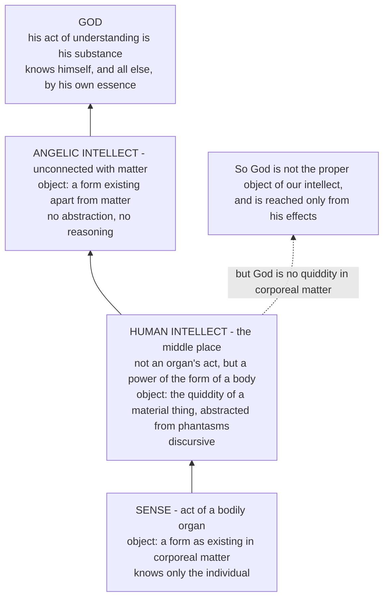

# The Thomistic Synthesis · Lesson 4.1: How a human intellect knows

> ⏱ ~15 min · Module 4: Knowing and naming God · Builds on: [3.4 Divine simplicity and the derivation of the attributes](03-04-divine-simplicity-and-the-attributes.md), [`ancient-medieval-philosophy` 3.5](../../ancient-medieval-philosophy/lessons/03-05-soul-and-intellect.md) · Unlocks: [4.2 Knowing God from creatures: the three ways](04-02-knowing-god-from-creatures-the-three-ways.md)

## Why this matters

Module 3 left us somewhere awkward. God is simple, in no genus, not composed of form and matter — and almost every one of those results was reached by denying something ([3.4](03-04-divine-simplicity-and-the-attributes.md)). If that is what God is, the next question is ugly: can anything true be said of him, or is the treatise that follows a long list of things he is not?

Aquinas answers not by staring harder at God but by asking what kind of knower is doing the asking. The limit Module 4 works inside is not a fact about God's availability; it is a fact about this intellect, the one that has to start with its eyes open. Get it stated exactly and the rest of the module — the three ways ([4.2](04-02-knowing-god-from-creatures-the-three-ways.md)), the divine names ([4.3](04-03-the-names-of-god.md)), analogy ([4.4](04-04-analogy.md)) — is a series of solutions to one known constraint. State it loosely and the module floats.

## The idea

Look at an oak. Your eyes give you *this* tree: this bark, these leaves, this angle of light. Nothing in that delivery is universal — sense is the act of a bodily organ, and organs receive forms the way matter holds them, as this one here. What imagination stores afterwards is the same kind of thing, an image of an individual: a [phantasm](../reference.md#phantasm).

But you also understand *oak*, a nature that is no more this tree than that one. Where did that come from?

Not from the phantasm as it stands, because a form sunk in matter is not actually intelligible. And nothing goes from potency to act except by something already in act ([`metaphysics` 2.2](../../metaphysics/lessons/02-02-change-act-and-potency.md)). So something on the mind's side must *make* the phantasm's content actually intelligible: the [agent intellect](../reference.md#agent-intellect), which Aristotle compared to light — it does not supply the colour, it makes the colour able to be seen.

What it produces is an [intelligible species](../reference.md#intelligible-species), the nature stripped of this-flesh-and-these-bones, received in the other half of the intellect, the possible or passive intellect. That stripping is [abstraction](../reference.md#abstraction).

Now the rider that decides everything downstream. The species is **not what you understand**; it is *that by which* you understand the oak. Say otherwise and the mind is sealed inside its own furniture, and the treatise on the divine names becomes a treatise on our vocabulary.

## Source

*Summa Theologiae* I q.85 a.2, the body, abridged (English Dominican Province translation, public domain):

> "Some have asserted that our intellectual faculties know only the impression made on them... According to this theory, the intellect understands only its own impression, namely, the intelligible species which it has received, so that this species is what is understood. This is, however, manifestly false for two reasons. First, because the things we understand are the objects of science; therefore if what we understand is merely the intelligible species in the soul, it would follow that every science would not be concerned with objects outside the soul, but only with the intelligible species within the soul... Secondly, it is untrue, because it would lead to the opinion of the ancients who maintained that 'whatever seems, is true'... Therefore it must be said that the intelligible species is related to the intellect as that by which it understands."

Both reasons are reductios. If the species is what is understood, physics is about physicists and every science collapses into psychology; and a faculty that knows only its own impression can judge only that impression, so every judgement is true and contradictories stand together. Aquinas is not proving realism from a first principle; he is showing that its denial destroys the possibility of being wrong.

The article does concede something. By reflecting on itself the intellect understands its own act and the species by which it understands — but *secondarily*. What is understood first is the thing, of which the species is a likeness.

## The argument

Why an agent intellect at all? ST I q.79 a.3, in numbered form:

> **P1.** Forms of natural things do not exist apart from matter. *In words: Aristotle's refusal of Plato's separate Forms ([`ancient-medieval-philosophy` 8.1](../../ancient-medieval-philosophy/lessons/08-01-porphyrys-questions-universals-to-aquinas.md)).*
>
> **P2.** Forms existing in matter are not actually intelligible; a thing is intelligible in proportion as it is separate from matter. *In words: what is locked into this lump is not yet a candidate for being thought.*
>
> **P3.** Nothing is reduced from potentiality to act except by something in act — as the senses are made actual by what is actually sensible. *In words: Module 2's rule, applied to the mind ([2.1](02-01-act-and-potency-extended.md)).*
>
> **∴ C.** There must be a power on the intellect's side that makes things actually intelligible, by abstraction of the species from material conditions: the agent intellect.

P1 forces the apparatus, as Aquinas says outright: on Plato's supposition no agent intellect would be needed to make things intelligible, since the Forms already are. Abstraction is the price of putting natures in things.

Two articles later the machinery is located. The agent intellect is **a power of this soul**, not a separate substance shared by everyone (a.4, a.5). Aquinas grants the participation structure his opponents wanted — what is such by participation requires something essentially such — and says the higher intellect our light derives from is, "according to the teaching of our faith", God himself. But a participated light in the air is not the sun: there are as many agent intellects as souls, since one power cannot belong to several substances. The Averroist alternative is [`ancient-medieval-philosophy` 7.1](../../ancient-medieval-philosophy/lessons/07-01-faith-reason-and-the-paris-crisis.md)'s.

And the object this power is proportioned to is fixed. ST I q.84 a.7:

> "the proper object of the human intellect, which is united to a body, is a quiddity or nature existing in corporeal matter; and through such natures of visible things it rises to a certain knowledge of things invisible."

That article — whether the intellect can understand without turning to phantasms — is read as philosophy of mind, against modern rivals and the evidence from brain injury, by [`philosophy-of-mind`](../../philosophy-of-mind/syllabus.md) 5.2-5.3. This course takes its conclusion and asks what it costs theology. Two words do the work: *proper* (what the power is per se directed to, not all it can reach) and *corporeal* (the nature we grasp is a body's).

## The ladder of intellects

ST I q.85 a.1 sorts three grades of cognitive power by one variable: how far the power stands from matter. Its principle is that the object of knowledge is proportionate to the power, so each grade's object reads straight off the power's relation to a body — and we land in the middle, since the human intellect is not an organ's act yet is a power of the soul that is the form of a body.

The same ladder sorts *how* each knows. Because we advance from one thing understood to another we are called rational — reasoning stands to understanding as movement to rest — while angels, apprehending truth without that march, are called intellectual (q.79 a.8). At the top, God's act of understanding is his substance (q.14 a.4), which [3.4](03-04-divine-simplicity-and-the-attributes.md) derived from simplicity.

*Arrows run from less perfect to more perfect. The dashed edge is what this lesson delivers to the rest of Module 4.*

## Worked examples

**Example 1 (clean: the machinery on an oak).** You see the tree; imagination keeps a phantasm of it, also individual. The agent intellect lights that phantasm and abstracts the specific nature, disregarding the conditions of individuality. Aquinas is precise about what gets dropped: individual matter goes, common matter stays. The species of man is abstracted from *this flesh and these bones*, not from flesh and bones (q.85 a.1 ad 2) — so this wood is left behind and wood is not. The possible intellect receives the species, and you understand oak.

Two questions matter. *What do you understand?* Oaks — the nature, which exists only in individual oaks. *Whose is the universality?* Your consideration's: the nature is in this oak and that one, and that it be apprehended without conditions of individuality happens to it in the intellect (q.85 a.2 ad 2, the text [`ancient-medieval-philosophy` 8.1](../../ancient-medieval-philosophy/lessons/08-01-porphyrys-questions-universals-to-aquinas.md) uses). The species is the medium, not the terminus. And even now you turn back to some image — q.84 a.7 again.

**Example 2 (where it strains: run it on God).** Run the same machinery on the God of [3.4](03-04-divine-simplicity-and-the-attributes.md) and watch every step fail.

There is no phantasm of God — he is not a body, and there is nothing to sense. So the agent intellect has nothing to light up, and no species of the divine essence is abstracted from anything. Nor is the failure a shortage of data: God is not a quiddity existing in corporeal matter, so he is not the sort of object this power is *proportioned* to at all.

What survives is stated in the article this course hands to [4.2](04-02-knowing-god-from-creatures-the-three-ways.md): "Our natural knowledge begins from sense. Hence our natural knowledge can go as far as it can be led by sensible things" (q.12 a.12). Sensible things are God's effects, so they lead us to know that he exists and what must belong to him as first cause — but not to see his essence, since effects unequal to their cause cannot display its whole power.

So every concept the rest of this module uses of God is a species abstracted from a creature, redeployed. Not a defeat, not yet a solution: the exact shape of the problem. How to redeploy is [4.2](04-02-knowing-god-from-creatures-the-three-ways.md); what the redeployed name signifies is [4.3](04-03-the-names-of-god.md); why it is neither the same meaning nor a different one is [4.4](04-04-analogy.md).

## Watch out

- **You might think the intelligible species is what we think about.** That is the position q.85 a.2 exists to kill, and the misreading turns Aquinas into an ancestor of the veil of ideas. The species is *that by which*; it becomes an object only in a second, reflexive act. Get it wrong and Module 4 reads as an account of our God-language rather than of God.
- **You might think abstraction frees the intellect from the body.** The intellect has no organ, but cannot understand even what it has abstracted without turning to phantasms (q.84 a.7). That is why the ladder puts us in the middle, not one rung below the angels.
- **You might think "proper object" means "only possible object".** It means what the power is per se directed to and therefore cannot fail about (q.85 a.6). Intellectual knowledge extends further than sensitive, since sense is not its entire cause (q.84 a.6 ad 3). The constraint on knowing God is not that we cannot think past what we have seen; it is that God is outside the genus the proper object names.
- **Do not give any of this a magisterial level.** Abstraction, the agent intellect as a power of the soul, the species as *that by which* — all of it is Aquinas's own philosophy, freely disputed among Catholics, below the seam on [`fundamental-theology` 4.4](../../fundamental-theology/lessons/04-04-the-ladder-of-doctrinal-authority.md)'s ladder. Two neighbouring claims are not, and must not be demoted with it: that the rational soul is of itself and essentially the form of the human body (Council of Vienne, owned by `creation-grace-last-things`), and that God can be known with certainty from created things by natural reason (Vatican I, [`fundamental-theology` 1.2](../../fundamental-theology/lessons/01-02-natural-knowledge-of-god.md)) — defined whether or not Aquinas's account of *how* is right.

## One-liner

> We are the intellect in the middle of the ladder: everything we understand comes off a body, which is why God is reached from his effects and not looked at, and why the next three lessons are about borrowed words.

## Problems

**P1 (🟢) *(Exegetical.)*** Close-read this passage from the body of ST I q.85 a.1 (English Dominican Province translation; the phrase "the form the body" is a typographical slip in the online text for "the form of the body"):

> "the object of knowledge is proportionate to the power of knowledge. Now there are three grades of the cognitive powers. For one cognitive power, namely, the sense, is the act of a corporeal organ. And therefore the object of every sensitive power is a form as existing in corporeal matter... There is another grade of cognitive power which is neither the act of a corporeal organ, nor in any way connected with corporeal matter; such is the angelic intellect, the object of whose cognitive power is therefore a form existing apart from matter... But the human intellect holds a middle place: for it is not the act of an organ; yet it is a power of the soul which is the form the body... And therefore it is proper to it to know a form existing individually in corporeal matter, but not as existing in this individual matter."

(a) Which clause states the principle the whole three-way division rests on, and for each grade, which feature of the *power* fixes its object? (b) Using only this passage and [3.4](03-04-divine-simplicity-and-the-attributes.md), say in one sentence why God is not the proper object of the human intellect. 100 words or fewer in total.

**P2 (🟡) *(Exegetical (a) · Evaluative (b).)*** An invented remark from a seminar:

> "Everything you have ever thought about was a concept in your own head. You never get outside your concepts to compare them with the world, because the comparison would just be another concept. So 'God' is a concept too, and theology is the study of a concept. I don't mean that as an attack. I mean that's what the subject is."

(a) Name the position the first two sentences take, name the article of the *Summa* that answers it, and give the two consequences Aquinas says follow from it. (b) The speaker presses: grant the reply for oaks, where there are oaks and a species is abstracted from them — but no species is abstracted from God, so doesn't the reply fail exactly where you wanted it? In 150 words or fewer, say what this lesson alone can answer, and name which later lesson of Module 4 owns the rest. Any verdict.

**P3 (🔴, optional) *(Exegetical (a) · Evaluative (b).)*** A physicist understands what a neutrino is. Nobody has ever sensed one.

(a) In three sentences, using this lesson's account together with q.84 a.6 ad 3: what are the phantasms here, what is abstracted from them, and what operation gets from those natures to the neutrino? (Aquinas's name for the operation that builds a definition out of natures already abstracted is *composition and division*, ST I q.85 a.5; you are not expected to cite it.) Then say whether the neutrino falls inside the proper object of the human intellect, and why. (b) A reader concludes: "then the proper object constrains nothing — with enough composing you get anywhere, God included." In 150 words or fewer, state the difference Aquinas needs between the neutrino case and the God case, and say whether the texts of this lesson supply it. Any verdict.

Solutions

**P1** *(Exegetical — strict.)*

**Must hit, strict (a):** the governing clause is **"the object of knowledge is proportionate to the power of knowledge."** Each grade's object is then fixed by the power's relation to matter, and the answer must name that feature in all three cases: sense **is the act of a corporeal organ**, so its object is a form as existing in corporeal matter (and, since that matter individuates, only the individual); the angelic intellect is **neither the act of a corporeal organ nor in any way connected with corporeal matter**, so its object is a form existing apart from matter; the human intellect is **not the act of an organ, yet is a power of the soul which is the form of the body**, so its object is a form existing individually in corporeal matter, taken not as in this individual matter.

**Must hit, strict (b):** God is not a form or quiddity existing in corporeal matter at all — he is simple, in no genus, not composed of form and matter (3.4) — so nothing proportionate to our power answers to him.

**Wrong turns:** giving the human intellect's object as "the individual", which is sense's; describing the middle place as a compromise between grasping universals and grasping particulars, when the passage's variable is the power's distance from matter, not the generality of what it grasps; concluding from (b) that God is unknowable, which the passage does not say — it fixes the *proper* object, and knowledge from effects is a separate question (4.2).

**Model answer:** (a) "The object of knowledge is proportionate to the power of knowledge." Sense is an organ's act, so it takes form in corporeal matter, hence individuals; the angelic intellect is unconnected with matter, so it takes form apart from matter; the human intellect is not an organ's act but belongs to the form of a body, so it takes a form existing individually in matter, not as in this matter. (b) God is no quiddity in corporeal matter, so he is not what a power so proportioned is directed to.

---

**P2** *(a) exegetical — strict; (b) evaluative — any verdict.*

**Must hit, strict (a):** the position is that the intellect knows only the impression made on it — that the intelligible species is *what* is understood. It is answered at **ST I q.85 a.2**. The two consequences Aquinas draws: (i) the things we understand are the objects of science, so no science would be about anything outside the soul, only about species within it; (ii) it reduces to the ancients' view that "whatever seems, is true", since a faculty that knows only its own impression can judge only that impression, so every judgement is true and contradictories stand together. Full credit also states the positive conclusion: the species is *that by which* the intellect understands, what is primarily understood being the thing of which the species is a likeness, the species itself being understood only secondarily by reflection.

**Must hit, any verdict (b):** concede the disanalogy exactly — no species is abstracted from God, so God is not known as oaks are, and q.85 a.2's realism does not by itself deliver knowledge of God. Then say what this lesson does establish: the species from which our God-talk is built are abstracted from creatures, and those species are likenesses *of creatures*, so a concept formed from them is about a creature and about God only so far as God stands to that creature as its cause (q.12 a.12). Then name the owner of the remainder: 4.2 for the three ways, 4.3 for what a divine name signifies, 4.4 for analogy. Either verdict passes: that the slide to "theology is the study of a concept" is already blocked, because our concepts are of creatures and creatures are not concepts; or that nothing here yet secures reference to God, and the burden falls entirely on 4.2-4.4.

**Wrong turns:** answering (a) with q.84 a.7 and the turn to the phantasm — that article is about needing images, not about what is understood; reading the remark as scepticism about the external world generally rather than as a claim about the object of the intellect; settling (b) by asserting analogy, which 4.4 has to earn and this lesson has not.

**Model answer (b), one of several:** The disanalogy is real and should be granted at full strength: there is no divine phantasm, so no species of God, so the oak case does not transfer. What transfers is narrower. Every concept theology will use is a species abstracted from a creature, and q.85 a.2 says such a species is a likeness of that creature and not an object in its own right — so the study is of creatures at least, not of our own furniture, and any reference to God rides on a real relation of creatures to their cause. That is all 4.1 delivers: the raw material is creaturely, the mind is not sealed, and the relation that might carry a name across is causal. Whether it does carry across is 4.2's question, what the name then signifies is 4.3's, and how it can be neither the same meaning nor a different one is 4.4's.

---

**P3** *(a) exegetical — strict; (b) evaluative — any verdict.*

**Must hit, strict (a):** the phantasms are images of *sensed* things — instrument readings, detector traces, diagrams, the written and spoken words of the theory; q.84 a.7's turn to phantasms requires images, not images that resemble. What is abstracted are natures of sensible things: mass, charge, motion, quantity, cause. The operation that reaches the neutrino is composition and division, and then reasoning from one composition to another — a definition built out of natures already abstracted; naming it as q.85 a.5 does is a bonus, not a requirement. The neutrino therefore **is** inside the proper object: it is a quiddity existing in corporeal matter, however unsensed, and q.84 a.6 ad 3 says sensitive knowledge is not the entire cause of intellectual knowledge, so the intellect reaches further than sense without leaving the object it is proportioned to.

**Must hit, any verdict (b):** state the difference Aquinas needs — the neutrino stays *inside* the genus that the proper object names, so composition extends the intellect within its object, whereas God is in no genus at all (3.4), so no composing of creaturely natures builds a quiddity of God. Then test whether this lesson's texts supply it, citing q.12 a.12: our knowledge goes as far as sensible things can lead, and effects unequal to their cause cannot show the essence — which states the boundary but does not yet say what a name means once it crosses. Either verdict passes: that the difference is textually grounded and does real work, or that "in no genus" was itself reached by abstracting and negating creaturely notions, so it cannot mark a boundary the method is bound to respect without the further argument of 4.2-4.4.

**Wrong turns:** failing the neutrino because nobody has sensed one — the proper object is fixed by what kind of thing it is, not by whether anyone has met it; demanding a phantasm *of* the neutrino; answering (b) by helping yourself to analogy or the three ways, neither of which this lesson has established; treating "God is in no genus" as an extra premise smuggled in here, when 3.4 derived it.

**Model answer (b), one of several:** The difference has to be categorial, not quantitative. Composing gets the physicist to the neutrino because every ingredient — mass, charge, motion — is a nature of body, and the result is one more quiddity in corporeal matter; the operation never leaves the object the intellect is proportioned to. God is not a further, harder case of the same kind: 3.4 put him in no genus, so there is no composition of creaturely natures whose result is his quiddity. The texts of 4.1 supply the boundary and not the crossing: q.12 a.12 says plainly that sensible effects cannot equal their cause and so cannot yield the essence. What it does not say is what "wise" means when it is said of him anyway. That silence is why Module 4 has three more lessons.

## Flashback

**From Lesson [3.3](03-03-the-third-fourth-and-fifth-ways.md) (The Third, Fourth and Fifth Ways inside the system):** *(Exegetical.)* An invented remark from an adult-education class, written for this problem:

> "The Fifth Way is really about nature's own striving. The acorn is reaching for the oak; the river is looking for the sea; the whole world is straining toward what it is meant to be. That straining is what people have always called God. So we need nothing outside nature to account for the order — nature is the intelligence, doing the only thing it knows how to do."

The remark keeps the Fifth Way's datum and denies its principle. (a) State the principle in one sentence, and say whose intention the Way locates the aim in. (b) Name the position the remark has arrived at, and say why it is not the conclusion the Way argues to. Two sentences per part.

Solution

**Must hit, strict (a):** whatever lacks knowledge cannot move towards an end unless it is directed by some being endowed with knowledge and intelligence — the arrow does not aim itself but is shot to its mark by the archer. The intention is the director's, not the thing's: the Way's "designedly" renders *ex intentione*, and the sentence that follows names whose intention it is. Credit for the parallel at I-II q.1 a.2 ad 2, that being ordained to an end can belong to an irrational nature, but only owing to someone possessed of reason.

**Must hit, strict (b):** pantheism — the striving of natural things is itself named God, and each thing becomes its own director. The Way argues instead to an intelligent being by whom all natural things are directed to their end, distinct from the things directed, precisely because on the principle in (a) the aim cannot be stored in what has no knowledge. So the remark does not extend the argument; it deletes the step the argument is made of.

**Wrong turns:** locating the error in the datum, when the regularity the speaker points at is exactly Aquinas's own starting point; objecting that the acorn has no real tendency to the oak — it has one, and a tendency in what does not know is what calls for a director; treating this as a mistake about biology rather than about who does the aiming; calling it deism, which is the opposite error, a director who acts once and withdraws.

**Model answer:** (a) What lacks intelligence cannot tend to an end unless directed by something that has knowledge and intelligence, as an arrow is shot to its mark by an archer; the intention belongs to the archer, not the arrow. (b) The remark ends in pantheism, naming the striving itself God and letting each thing direct itself. The Way concludes to an intelligent being distinct from natural things, by whom they are directed, since by its own principle nothing without knowledge can be the source of its own aim.

## Connections

- **Backward:** the act-and-potency rule that forces an agent intellect is [2.1](02-01-act-and-potency-extended.md)'s, generalized from [`metaphysics` 2.2](../../metaphysics/lessons/02-02-change-act-and-potency.md); the soul as form of a body, and Aristotle's fifteen unexplained lines on the separable intellect, are [`ancient-medieval-philosophy` 3.5](../../ancient-medieval-philosophy/lessons/03-05-soul-and-intellect.md); the abstracted nature and the question of universals are [`ancient-medieval-philosophy` 8.1](../../ancient-medieval-philosophy/lessons/08-01-porphyrys-questions-universals-to-aquinas.md), which reads q.85 a.1-2 for what they settle about universality. Everything this lesson denies about God comes from [3.4](03-04-divine-simplicity-and-the-attributes.md).
- **Forward:** [4.2](04-02-knowing-god-from-creatures-the-three-ways.md) takes q.12 a.12 and turns "only from effects" into a method; [4.3](04-03-the-names-of-god.md) needs the *that by which* of q.85 a.2 to distinguish what a name signifies from the way it signifies; [4.4](04-04-analogy.md) needs Example 2's result that our concepts are creaturely to rule out univocity. [5.3](05-03-the-human-soul-in-the-system.md) places the soul whose powers these are, and [`trinity-and-god`](../../trinity-and-god/syllabus.md) inherits the whole constraint.
- **Sideways:** whether the Thomist account of intellect survives contact with functionalism, determinacy arguments and neurology is [`philosophy-of-mind`](../../philosophy-of-mind/syllabus.md) 5.2-5.3, which owns q.84 a.7 as philosophy of mind; the unity-of-intellect fight behind a.5 is [`ancient-medieval-philosophy` 7.1](../../ancient-medieval-philosophy/lessons/07-01-faith-reason-and-the-paris-crisis.md). And the reason a theology course spends a lesson on cognitive psychology at all is [1.3](01-03-sacred-doctrine-one-science-about-god.md)'s handmaiden clause: philosophy is used here because of the defect of our intelligence, which is precisely what this lesson measures.
