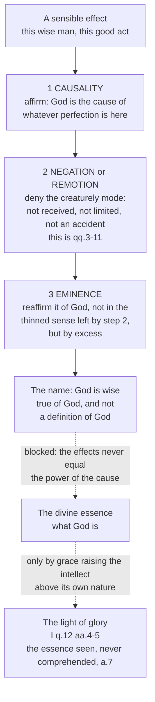

# The Thomistic Synthesis · Lesson 4.2: Knowing God from creatures: the three ways

> ⏱ ~15 min · Module 4: Knowing and naming God · Builds on: [4.1 How a human intellect knows](04-01-how-a-human-intellect-knows.md), [3.4 Divine simplicity and the derivation of the attributes](03-04-divine-simplicity-and-the-attributes.md) · Unlocks: [4.3 The names of God](04-03-the-names-of-god.md), [4.4 Analogy](04-04-analogy.md)

## Why this matters

[4.1](04-01-how-a-human-intellect-knows.md) left the treatise on God with a problem. A human intellect begins in the senses and its proper object is the nature of a material thing, so in this life it cannot reach God's essence. But nine questions of the *Summa* have already been spent saying things about God — simple, perfect, good, infinite, unchanging, eternal, one. Either those questions are bluff, or a method yields true statements about a being whose essence is out of reach. ST I q.12 a.12 gives the licence, marks its extent, and performs the method the rest of Module 4 runs on: causality, negation, eminence.

## The idea

Call them "the three ways" and you expect three arguments with three conclusions. They are not. [The three ways](../reference.md#the-three-ways) are three phases of one motion that starts at a creature and ends at a word said of God. Start with some perfection you actually meet — this wise man, this good act, this living thing:

1. **Causality.** Whatever perfection is here came from God, the cause of everything that is; so something in God answers to it.
2. **Negation**, or *remotion*. Strip the creaturely way of having it: received, limited, held as an accident by a subject, had partly and by degrees. Deny every one.
3. **Eminence.** Reaffirm the perfection of God — not in the reduced sense left by step 2, but as his by excess. The creature falls short of God; God does not fall short of the creature.

Two things to notice. First, step 2 is not a new activity: it is what [3.4](03-04-divine-simplicity-and-the-attributes.md) already did for nine questions. Every one of q.3's eight articles is a denial — not a body, not matter and form, no essence distinct from subject, no composition of essence and *esse*, no genus, no accidents — step 2 run systematically. Second, and this is the hinge of Module 4: **step 2 is not the last step.** A theology stopping at negation would have nothing left to say and no analogy to argue about. Aquinas does not stop, and [4.3](04-03-the-names-of-god.md) is why he is entitled not to.

The triad is not his invention: it reaches him from Dionysius the Areopagite, quoted on nearly every page of qq.12-13, and through him from the Neoplatonism that also gave Aquinas participation ([2.3](02-03-participation.md)). What Aquinas adds is the causal metaphysics underneath. The circuit works because creatures *are effects*, and an effect tells you something about its cause.

## Source

ST I q.12 a.12, *Whether God can be known in this life by natural reason?*, from the *respondeo* (English Dominican Province translation):

> Our natural knowledge begins from sense. Hence our natural knowledge can go as far as it can be led by sensible things. But our mind cannot be led by sense so far as to see the essence of God; because the sensible effects of God do not equal the power of God as their cause. … But because they are His effects and depend on their cause, we can be led from them so far as to know of God "whether He exists," and to know of Him what must necessarily belong to Him, as the first cause of all things, exceeding all things caused by Him. Hence we know that His relationship with creatures so far as to be the cause of them all; also that creatures differ from Him, inasmuch as He is not in any way part of what is caused by Him; and that creatures are not removed from Him by reason of any defect on His part, but because He superexceeds them all.

Read the last sentence slowly: its three clauses *are* the three ways, in order. *Cause of them all* — causality. *Creatures differ from Him* — negation. *Not by reason of any defect on His part, but because He superexceeds them all* — eminence. Aquinas names them as a method in the next question: we know God from creatures "as their principle, and also by way of excellence and remotion" (q.13 a.1), and again at q.13 a.8 ad 2, which lists eminence, causality and negation and points back to this article.

Notice what closes the essence off: not that God hides or that we sin, but a fact about effects. They *do not equal the power of God as their cause*, so they cannot exhibit it whole. The obstacle is metaphysical, and ad 3 says so — natural knowledge of God is open to good and bad alike.

## The argument

The *respondeo* in premises, with each one's source marked:

1. **Our natural knowledge begins from sense.** *In words:* nothing gets into a human intellect except through the senses and what is abstracted from them. *(From [4.1](04-01-how-a-human-intellect-knows.md); ST I q.84, q.85.)*
2. **So it reaches exactly as far as sensible things can lead it.** *In words:* no data, no conclusion. *(a.12, from 1.)*
3. **God's sensible effects do not equal the power of God as their cause.** *In words:* the output is finite and the cause is not. *(a.12, resting on the infinity of q.7 a.1 — [2.1](02-01-act-and-potency-extended.md), [3.4](03-04-divine-simplicity-and-the-attributes.md).)*
4. **An effect unequal to its cause does not display the cause's essence — but it still displays the cause as cause.** *In words:* smoke will not tell you what fire is, and still tells you there is one. *(a.12; demonstration *quia* from [3.1](03-01-demonstrating-that-god-exists.md).)*
5. **Therefore in this life natural reason attains: that God is; that he is the cause of all things; that creatures differ from him; and that the difference is by his excess, not by any defect in him.** *(a.12; [what natural reason reaches](../reference.md#what-natural-reason-reaches) stands for the rest of the course.)*
6. **And it does not attain what God is.** *(a.12 ad 1: reason cannot reach up to simple form so as to know "what it is", but it can know "whether it is".)*

Premises 5 and 6 fix the shape of every later claim in this course: nothing after q.12 defines God, and everything after it claims to be true of him.

One other route to the essence exists, and it is not this one. ST I q.12 a.4 argues that no created intellect sees the divine essence naturally, since a knower knows according to its own mode of being and only God's mode is subsistent being itself; so if the essence is seen, God must unite himself to the created intellect. Article 5 names what makes that possible: a created light, the [light of glory](../reference.md#the-light-of-glory), added by grace so the intellect can bear an object above its nature — and even then, a.7 insists, the blessed see God without comprehending him, since a finite light cannot know an infinite object infinitely. That vision belongs doctrinally to [`creation-grace-last-things`](../../creation-grace-last-things/syllabus.md). What matters here is the boundary: the three ways are the *natural* route, and never cross into the essence.

## The circuit

Every divine name in [4.3](04-03-the-names-of-god.md) is made on this circuit; what [4.4](04-04-analogy.md) inherits is what a word can mean at the end of it, given where it started.

## Worked examples

**Example 1 — the machinery on a clean case: "God is wise".** Step 1, causality: wisdom is a real perfection in Socrates, and Socrates is an effect of God, who cannot give what in no way belongs to him; so wisdom names something in God. Step 2, negation: strip the mode. Socrates's wisdom is an accident he acquired and can lose, a quality of a power distinct from his essence, had by degrees and alongside much he lacks. Each of those q.3 denies of God. Step 3, eminence: what remains is not "God has a trace of wisdom" but that wisdom belongs to God more truly than to Socrates, because Socrates has it and God *is* it. The name is true; the definition of wisdom we possess is taken from Socrates and never fits.

Each step earns its place. Drop step 1 and there is no warrant for the word; drop step 2 and God is a very clever man, the univocal God-talk of [4.4](04-04-analogy.md); drop step 3 and "God is wise" means only "God is not stupid", the negative reading q.13 a.2 refutes.

**Example 2 — where it strains: how far does negation go?** Push the circuit and an uncomfortable question appears: if every creaturely mode is denied and the eminence left over is one we cannot conceive, has step 3 added anything but an adverb?

The Greek Fathers pressed this before the scholastics did. Gregory of Nyssa's *Life of Moses* reads the ascent of Sinai as an ascent into darkness: the soul that comes closest finds God unknown, and the stretching forward never ends ([`patristics`](../../patristics/syllabus.md) 3.3). It is tempting to file Aquinas as the drier, more confident Latin. That is a misreading. On incomprehensibility they agree: q.12 a.7 denies that any created intellect ever comprehends God, and a.11 that a human being sees his essence while living this mortal life.

The real question between the two traditions is narrower than "how apophatic". It is whether affirmative names are *true of God himself* or only of what he does to us. Aquinas takes it up in the next lesson, naming the two positions he means to defeat: that "God is good" means only "God is not evil" (the reading he attributes to Rabbi Moses, Maimonides), and that it means only "God causes goodness in things" ([4.3](04-03-the-names-of-god.md)). His answer, that such names signify God's substance imperfectly, is what makes analogy a live problem rather than a decoration. Where [apophatic theology and its limits](../reference.md#apophatic-theology-and-its-limits) fall decides whether Module 4 has anything left to do.

## Watch out

- **Negation is not agnosticism.** You might think that since q.3 says we cannot know what God is, the denials that follow are confessions of ignorance. They are knowledge: to establish that God is not a body is to know something true about God, and each denial is licensed by something already established causally — that God is first mover, and so pure act. The reply at a.12 ad 1 puts it exactly — we do not reach "what it is", we do reach "whether it is".
- **The route runs from effects, not from gaps.** The premise is that a sensible thing is an *effect* and depends on its cause, which is true of it whether or not physics has explained how it came to be. An argument from what nobody has explained yet is a different and weaker argument; [3.2](03-02-the-first-and-second-ways-inside-the-system.md) makes the difference.
- **Three levels here, and they are not one level.** That God can be known with certainty from created things by the natural light of human reason is defined by Vatican I (*Dei Filius* ch. 2 and the first canon on revelation) — the top rung of the ladder in [`fundamental-theology` 4.4](../../fundamental-theology/lessons/04-04-the-ladder-of-doctrinal-authority.md). That no one sees the divine essence while living this mortal life, and that the blessed see it by a grace no creature can claim by nature, is the Church's teaching, which Aquinas transmits rather than invents; its dogmatic history belongs to [`creation-grace-last-things`](../../creation-grace-last-things/syllabus.md). But that natural reason works *this* way — effects, then remotion, then eminence — is a school account, recommended and freely disputed. Promoting the third to the level of the first is the error this course grades most strictly; demoting the first two to "one school's opinion" is the same error running the other way.

## One-liner

> Affirm the perfection because God caused it, deny the creaturely way of having it, and then affirm it again by excess — that circuit, run once per word, is everything natural reason can say about God.

## Problems

**P1 (🟢) *(Exegetical.)*** The first two replies of ST I q.12 a.12 (English Dominican Province translation):

> Reply to Objection 1. Reason cannot reach up to simple form, so as to know "what it is"; but it can know "whether it is."
>
> Reply to Objection 2. God is known by natural knowledge through the images of His effects.

(a) Which words in the first reply fix the limit on natural knowledge of God, and what exactly is conceded on the near side of that limit?
(b) The second reply answers an objection that we cannot imagine God. What does it claim about the route natural knowledge takes, and which premise of this lesson's argument does it confirm? Two sentences per part.

**P2 (🟡) *(Exegetical.)*** An invented paragraph from an adult-education handout (nobody wrote this; it is built for the problem):

> "Since Aquinas says we cannot know what God is, we should be honest about what our God-talk amounts to. Calling God 'good' does not tell us anything positive about him; it just rules something out, the way calling a rock 'non-musical' does. And the reason we can argue to God at all is that science still cannot say why there is a universe rather than nothing — the day it can, the argument goes away."

(a) Name the two distinct errors, quoting the words that carry each.
(b) For each, give the step of the circuit or the premise of the argument that blocks it, and cite the article. 150 words or fewer in total.

**P3 (🔴, optional) *(Exegetical.)***
(a) Assign the level of each of these three claims and name the act or text that fixes it, without overstating in either direction: (i) that the one true God can be known with certainty by the natural light of human reason from created things; (ii) that Aquinas's Five Ways are sound demonstrations of it; (iii) that the divine names are correctly formed by causality, remotion and eminence.
(b) A student objects that eminence is "causality plus negation plus an adverb" — that step 3 adds no content. Using the last clause of the Source, say in two sentences what step 3 asserts that steps 1 and 2 do not.

Solutions

**P1** *(Exegetical.)*

**Must hit, strict (a):** the limit is fixed by "cannot reach up to simple form, so as to know 'what it is'" — the quiddity or essence of God is what is denied, and it is denied because God is a *simple* form, with nothing composite for our abstractive intellect to resolve. Conceded on the near side: "it can know 'whether it is'" — the fact of God's existence, and with it, per the *respondeo*, what must belong to him as first cause.
**Must hit, strict (b):** the claim is that natural knowledge of God runs *through images of his effects* — not through any image of God, which is what the objection rightly says we lack, but through phantasms of creatures from which the intellect works. It confirms premises 1 and 2: knowledge begins from sense and goes only as far as sensible things can lead it, so even the denials of q.3 are reached by way of creatures.
**Wrong turns:** reading ad 1 as conceding that we know God's essence dimly or partially — the contrast is between two questions, *an sit* and *quid sit*, not between two degrees of one knowledge. Reading ad 2 as saying we form an image of God; it says the opposite, and locates the images on the side of the effects.
**Model answer:** (a) "Cannot reach up to simple form, so as to know 'what it is'" fixes the limit: God's quiddity is closed to us. What is conceded is the other question — that he is, and what must belong to the first cause of all. (b) It says natural knowledge of God travels through the images of creatures, which are his effects, so the absence of any image of God costs us nothing. That confirms premises 1 and 2: our knowledge starts in sense and goes no further than sensible things can carry it.

---

**P2** *(Exegetical.)*

**Must hit, strict (a):** (i) **negation-only theology** — "does not tell us anything positive about him; it just rules something out", with the rock analogy. This collapses the circuit into step 2 and drops eminence; it is the position Aquinas attributes to Rabbi Moses and rejects at q.13 a.2. (ii) **God of the gaps** — "the reason we can argue to God at all is that science still cannot say why there is a universe", with the concession that "the day it can, the argument goes away". This replaces effects with unexplained effects.
**Must hit, strict (b):** against (i): step 3, eminence — the Source ends by denying that creatures fall short "by reason of any defect on His part", and asserting that "He superexceeds them all", which is a positive claim about God, not a further denial; q.12 a.12, developed at q.13 a.2. Against (ii): premises 3 and 4 — the argument runs from the fact that sensible things *are effects and depend on their cause*, which holds of an explained thing exactly as much as of an unexplained one; a scientific explanation supplies another cause within the series, not a rival to the first cause.
**Wrong turns:** naming "we cannot know what God is" as one of the errors — that sentence is Aquinas's own and is correct. Answering (ii) by saying science cannot explain the universe: the point is that the argument does not depend on the answer. Treating the two errors as one, or as both being "too negative".
**Model answer:** The first error is negation-only theology: "it just rules something out", like calling a rock non-musical. That drops step 3. The Source denies that creatures fall short through any defect in God and says he superexceeds them all, which affirms something of God rather than removing it; q.13 a.2 argues the point at length. The second is a God of the gaps — the argument is said to rest on what "science still cannot say", so that it "goes away" once science can. But premises 3 and 4 run from a sensible thing's being an effect that depends on its cause, which is true whether or not its proximate causes are known. A scientific explanation adds a cause inside the series; it does not supply one for the series.

---

**P3** *(Exegetical.)*

**Must hit, strict (a):** (i) **Defined dogma** — Vatican I, *Dei Filius* ch. 2 and the first canon on revelation attaching an anathema to the denial; rung 1 of the ladder in [`fundamental-theology` 4.4](../../fundamental-theology/lessons/04-04-the-ladder-of-doctrinal-authority.md). Note what is defined is that God *can* be so known, not that any particular proof succeeds. (ii) **Not fixed by any act; freely disputed among Catholics** — the definition in (i) covers the *capacity*, and no council or pope has declared any particular proof sound; Catholics who think the Second or Fifth Way fails are disputing a philosophical claim, not denying a dogma. (iii) **A school thesis** — Aquinas's own account of how names are formed, resting on his metaphysics, recommended with the rest of his doctrine but fixed as *the* account by no magisterial act.
**Must hit, strict (b):** step 3 asserts that the perfection belongs to God *more* than to the creature, by excess — the Source's "not removed from Him by reason of any defect on His part, but because He superexceeds them all". Steps 1 and 2 yield only that God is the cause and that he is not as creatures are; eminence adds the direction of the shortfall, which is what stops negation from turning "God is wise" into a sentence with no content.
**Wrong turns:** calling (ii) or (iii) dogma because the Church recommends Aquinas as master — the recommendation is not a definition, and no act makes every Thomist thesis binding. The error running the other way: treating the natural knowability of God in (i) as merely the Thomist school's view, when it is defined. Reading (i) as defining the Five Ways, which is exactly the slide (ii) tests.
**Model answer:** (i) Defined dogma: *Dei Filius* ch. 2 and the first canon on revelation; what is defined is the capacity, not any one proof. (ii) Nothing fixes it — the definition stops at the capacity, so the soundness of any given Way is freely disputed among Catholics. (iii) A school thesis: Aquinas's account of how the names are formed, recommended with his doctrine but nowhere defined. (b) Eminence asserts that the perfection is in God by excess, so that the creature's falling short is the creature's limitation and not a defect in God. Causality gives only that God is its source, and negation only that he does not have it as creatures do; without step 3 the name has been emptied rather than purified.

## Flashback

**From Lesson [3.4](03-04-divine-simplicity-and-the-attributes.md) (Divine simplicity and the derivation of the attributes):** *(Exegetical.)* On Aquinas's account an angel is a subsisting form with no matter whatever: not a body, and not something in which a form is received. Take four of question 3's denials — a.1, not a body; a.2, not composed of matter and form; a.4, his essence is his existence; a.7, altogether simple.

(a) Which of the four hold of an angel, and which do not? (b) Name the composition that remains in an angel, and say in one sentence what the case shows about how much of simplicity immateriality buys. 100 words or fewer.

Solution

**Must hit, strict (a):** a.1 and a.2 **hold** of an angel — it is altogether incorporeal, and there is no matter in it to receive a form. a.4 and a.7 **do not**: an angel is not its own existence, and therefore is not altogether simple.

**Must hit, strict (b):** what remains is the composition of essence and existence — of "what is" and "whereby it is". The form subsists, but it is not its own act of existing, so the nature stands to that existence as potency to act, and the existence is received. ST I q.50 a.2 ad 3 says just this, points back to q.3 a.4 for the contrast, and concludes that God alone is pure act. What the case shows: immateriality buys a.1 and a.2 and stops there. The denial carrying the weight of simplicity is a.4, which is why the real distinction had to be settled in creatures first ([2.2](02-02-esse-and-essence-the-real-distinction.md)).

**Wrong turns:** ruling that a.4 holds of an angel because an angel is a pure form — a form can subsist without being its own *esse*, which is the whole point of q.50 a.2 ad 3. Concluding instead that an angel must be composed of matter and form after all, which is the position that article rejects. Treating "simple" as a synonym for "immaterial", the confusion this case exists to break.

**Model answer:** (a) a.1 and a.2 hold: an angel is incorporeal and has no matter in it to be informed. a.4 and a.7 fail. (b) What is left is the composition of essence and existence: an angel's subsisting form is not its own act of existing, so its nature is in potency to an existence it receives (q.50 a.2 ad 3, citing q.3 a.4). Immateriality therefore delivers only the first two denials. Simplicity in Aquinas's sense turns on a.4, and an angel is the standing proof that being immaterial is not yet being simple.

## Connections

- **Backward:** the sense-bound intellect and its proper object come from [4.1](04-01-how-a-human-intellect-knows.md) and, as history and live debate, from [`ancient-medieval-philosophy` 3.5](../../ancient-medieval-philosophy/lessons/03-05-soul-and-intellect.md). The negation phase is [3.4](03-04-divine-simplicity-and-the-attributes.md) in retrospect: qq.3-11 were step 2 all along. Demonstration *quia* from effects is [3.1](03-01-demonstrating-that-god-exists.md), and the Dionysian inheritance came in with participation at [2.3](02-03-participation.md).
- **Forward:** [4.3](04-03-the-names-of-god.md) asks what the names produced on this circuit signify, and defeats the negation-only and causality-only readings; [4.4](04-04-analogy.md) asks what kind of meaning survives the journey, against Scotus's univocity ([`ancient-medieval-philosophy` 8.2](../../ancient-medieval-philosophy/lessons/08-02-scotus-the-univocity-of-being.md)). The vision of God named here is taken up doctrinally by [`creation-grace-last-things`](../../creation-grace-last-things/syllabus.md), and [`trinity-and-god`](../../trinity-and-god/syllabus.md) inherits both the limit and the licence.
- **Sideways:** [`patristics`](../../patristics/syllabus.md) 3.3 has the Cappadocian version of the same problem, and the Greek and Latin answers are closer than the slogans suggest. The authority levels used in the third Watch out bullet come from [`fundamental-theology` 4.4](../../fundamental-theology/lessons/04-04-the-ladder-of-doctrinal-authority.md); q.12 a.13, that grace gives a fuller knowledge than reason, is the door into revealed theology that [`fundamental-theology` 5.4](../../fundamental-theology/lessons/05-04-sacred-doctrine-as-a-science.md) walks through.
