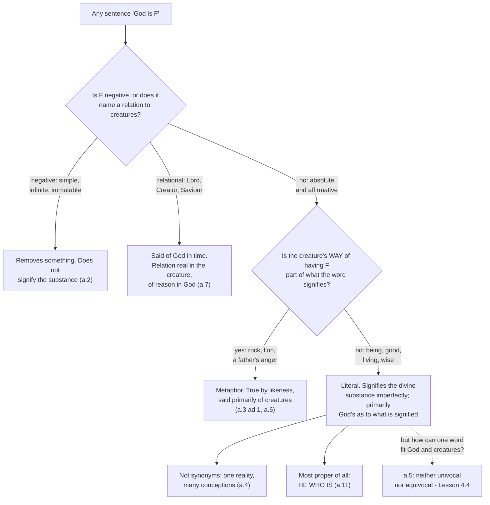

# The Thomistic Synthesis · Lesson 4.3: The names of God

> ⏱ ~15 min · Module 4: Knowing and naming God · Builds on: [4.1 How a human intellect knows](04-01-how-a-human-intellect-knows.md), [4.2 Knowing God from creatures: the three ways](04-02-knowing-god-from-creatures-the-three-ways.md) · Unlocks: [4.4 Analogy](04-04-analogy.md)

## Why this matters

Every sentence the dogmatic courses are going to write — God is good, God is our Creator, God became man — is a creature's word aimed at what no creature resembles. Question 13 asks whether any of them lands, and its answer is the licence on which `trinity-and-god` and `christology` operate. The two ways of failing that Aquinas names are still the two you will meet: God-talk that means only *he made nice things*, and God-talk that quietly means nothing at all. Both sound reverent. Both, he argues, are false.

## The idea

[4.2](04-02-knowing-god-from-creatures-the-three-ways.md) left a hard result: in this life we do not see God's essence, and what we have instead are his effects, worked over by causality, negation and eminence. Question 13 takes the next step. We name a thing as far as we understand it, and we understand God only from creatures; so we can name him, but no name expresses what he is (a.1).

Two respectable answers say that such names therefore do not really describe God at all, and a.2 names both.

**Remotion only.** "God lives" means only that God is not like a stone; every affirmative sentence is a negation in disguise. This is Maimonides — Aquinas calls him Rabbi Moses — whose case is read in [`ancient-medieval-philosophy` 6.3](../../ancient-medieval-philosophy/lessons/06-03-averroes-and-maimonides.md): a positive attribute would add to God's essence and make him many, so negations are not a second best but the truth.

**Causality only.** "God is good" means only that God causes goodness in things — a sentence about the world, dressed as one about God.

Aquinas rejects both for the harder line: names like *good*, *wise* and *living* **signify the divine substance** — truly and imperfectly at once. Making that coherent takes one distinction, the engine of this question and the next lesson: the difference between **what** a word signifies and the **way** it signifies it.

## Source

*Summa Theologiae* I q.13 a.3, "Whether any name can be applied to God in its literal sense?", the body of the article (English Dominican Province translation, public domain):

> "According to the preceding article, our knowledge of God is derived from the perfections which flow from Him to creatures, which perfections are in God in a more eminent way than in creatures. Now our intellect apprehends them as they are in creatures, and as it apprehends them it signifies them by names. Therefore as to the names applied to God — viz. the perfections which they signify, such as goodness, life and the like, and their mode of signification. As regards what is signified by these names, they belong properly to God, and more properly than they belong to creatures, and are applied primarily to Him. But as regards their mode of signification, they do not properly and strictly apply to God; for their mode of signification applies to creatures."

The third sentence is broken English because it is broken in the translation; the Latin says *two things* must be considered here, the perfection signified and the mode of signifying. What follows takes them in turn.

So: the [thing signified and the mode of signifying](../reference.md#the-thing-signified-and-the-mode-of-signifying) come apart. The *thing signified* by "good" is goodness, and goodness is God's more properly than it is anyone's. The *mode of signifying* is the creature-shaped packaging our language cannot drop: a concrete noun signifies a subsisting composite, an abstract noun a form that is not itself a subject (a.1 ad 2), and God is neither composite nor a non-subsistent form. The packaging fails; the content does not. That is why "God is good" is **literally true** and permanently under-describing — and why, as a.6 adds with the *distinguo* you met in [1.2](01-02-reading-a-whole-question.md), "good" is said *primarily of God* as regards what it signifies, though we impose the word on creatures first.

## The argument

The *respondeo* of a.2, in numbered steps. The bracket says where each comes from.

1. **Negative names, and names of God's relation to creatures, do not signify his substance.** *(Conceded at the head of the article; the relational ones are a.7's business, below.)* *In words:* the question is only about absolute affirmative names — *good*, *wise*, *living*.
2. **Three accounts of those are on offer: remotion only, causality only, signifying the substance.**
3. **Against both reductions, first: neither can say why some names fit God and others do not.** God causes bodies exactly as he causes good things, so if "God is good" meant no more than "God causes good things", "God is a body" would be licensed on the same terms. *In words:* a rule that lets everything through is not a rule.
4. **Second: every divine name would then be said in a secondary sense**, as "healthy" is said of medicine only because health is in the animal. *(The health example [4.4](04-04-analogy.md) takes over at a.5.)*
5. **Third: it is against the intention of those who speak of God.** The man who says God lives means more than that God differs from a rock, or that God caused his life.
6. **These names express God so far as our intellect knows him, and it knows God from creatures, as far as creatures represent him.** *([4.1](04-01-how-a-human-intellect-knows.md), [4.2](04-02-knowing-god-from-creatures-the-three-ways.md).)*
7. **God prepossesses in himself all the perfections of creatures, being simply and universally perfect.** *(ST I q.4 a.2, from the derivation mapped in [3.4](03-04-divine-simplicity-and-the-attributes.md). This is the load-bearing premise: without divine perfection, the two reductions win.)*
8. **So every creature represents God as far as it has any perfection — not as of the same species or genus, but as an excelling principle whose effects fall short of its form.** *(q.4 a.3.)*
9. **Therefore these names [signify the divine substance](../reference.md#signifying-the-divine-substance), but imperfectly, as creatures represent it imperfectly.** *(6–8.)*

Aquinas then says what the sentence means, and the negation is deliberate:

> "the meaning is not, 'God is the cause of goodness,' or 'God is not evil'; but the meaning is, 'Whatever good we attribute to creatures, pre-exists in God,' and in a more excellent and higher way."

And he reverses the causal reading's order of explanation: God is not good *because* he causes goodness; he causes goodness *because* he is good.

One more article closes the loop. If all these names land on one utterly simple reality, are they synonyms? No (a.4) — because [the plurality is in our conceptions](../reference.md#why-the-divine-names-are-not-synonyms), formed proportioned to the many perfections of creatures, which pre-exist in God unitedly and simply. Many words, many conceptions, one reality, imperfectly understood under each.

## Map of the names

The last box is a.11, where Module 2 comes back. ["He Who Is"](../reference.md#he-who-is) is most proper for three reasons: it signifies no form but existence itself, and God's existence *is* his essence ([subsisting being itself](../reference.md#subsisting-being-itself), [2.2](02-02-esse-and-essence-the-real-distinction.md)); it is the least determinate name there is, so adds no mode; and it signifies present existence. In ad 1 he concedes that as regards what a name is *imposed to signify*, "God" is more proper still.

## Worked examples

**Example 1 (clean: "God is good").** Run it down the map. Affirmative and absolute, so not a negation and not a relation. Is a creature's way of being good part of what "good" means? No — goodness is convertible with being ([2.4](02-04-the-transcendentals.md)), and nothing in the word says "good the way a finite thing is good". So the name is literal, and what it signifies is more God's than ours; what fails is our mode of meaning it, since we form the conception from things that *have* goodness rather than *are* it.

Now test the reductions here. Cause-only: then "God is a body" is equally warranted, since he causes bodies (step 3). Remotion-only: then the sentence says no more than "God is not evil", and the man at prayer means more (step 5). What it does mean: whatever good we find in creatures pre-exists in God more excellently, and he causes it because he is it.

**Example 2 (hard: "God became our Lord").** Article 7 is where the machine strains, and it is the article `trinity-and-god` will need first.

"Lord" implies a relation to creatures, and a relation has two ends. It can be real at both (father and son), at neither (a thing "the same as itself"), or at one end only — as a column becomes "on the right" of an animal when the animal walks round it, with nothing happening to the column. God is outside the whole order of creation; creatures are ordered to him and not he to them. Hence "in God there is no real relation to creatures, but a relation only in idea." So "Lord" is [said of God in time](../reference.md#names-said-of-god-in-time), by the change in the creature.

Then his own objection 5: if the lordship is not really in God, God is not really Lord, which is plainly false. His reply: because the relation of subjection is real *in the creature*, God is Lord in reality and not merely in idea. And ad 6 concedes the half that sounds shocking — God was not Lord until there was a creature subject to him. Nothing new in God; a new creature, really related.

Do not carry this into the Trinity. The relations there are **real in God**, which is exactly what makes them persons. Article 7 is groundwork for reading that treatise, not a preview of it, and `trinity-and-god` owns it.

## Watch out

- **You might think a failing mode of signification makes the sentence false.** It makes it inadequate, which is not the same thing. Article 3 puts the two on opposite sides of one line: as to what is signified, "good" belongs to God properly and primarily; as to how the word means it, it fits creatures. Collapse the line and you get the view that everything said of God is a picturesque lie — the objection a.3 exists to refuse.
- **You might think "not synonyms" means the attributes are really distinct in God.** Article 4 puts the multiplicity in our conceptions and in the creatures grounding them, never in God; simplicity ([3.4](03-04-divine-simplicity-and-the-attributes.md)) is untouched. This is the joint at which Scotus inserts his formal distinction ([2.2](02-02-esse-and-essence-the-real-distinction.md)) — a Catholic alternative freely held, not an error.
- **You might think [metaphor is a weaker grade of proper predication](../reference.md#metaphor-and-proper-predication).** Different mechanism. In "God is a rock" the creature's mode is inside what the word signifies — a rock is a material thing — so the name is said primarily of creatures and of God only by likeness (a.6). In "God is good" the creaturely mode is only in the way we mean it. The test is not how vivid the word is, but whether the creature's way of having the perfection is part of its meaning.
- **Two level errors, both graded strictly.** That God can be truly known and named from creatures is not a school opinion: *Dei Filius* puts natural knowledge of God at rung 1 on the ladder in [`fundamental-theology` 4.4](../../fundamental-theology/lessons/04-04-the-ladder-of-doctrinal-authority.md), as [3.1](03-01-demonstrating-that-god-exists.md) works out. But this lesson's machinery — the thing-signified-and-mode analysis, the three refutations of a.2, "He Who Is" as the most proper name — is Aquinas's theology, argued, and a [school thesis](../reference.md#school-thesis) until some act says otherwise. Maimonides is refuted here by argument and condemned by nobody, and the apophatic tradition the Cappadocians hand on ([`patristics`](../../patristics/syllabus.md)) is not on trial in q.13.

## One-liner

> A creature's word reaches God and falls short in the same breath: what it says of him is more his than ours, and the way it says it will always be ours.

## Problems

**P1 (🟢) *(Exegetical.)*** *Summa Theologiae* I q.13 a.4, from the body of the article (English Dominican Province translation):

> "For the idea signified by the name is the conception in the intellect of the thing signified by the name. But our intellect, since it knows God from creatures, in order to understand God, forms conceptions proportional to the perfections flowing from God to creatures, which perfections pre-exist in God unitedly and simply, whereas in creatures they are received and divided and multiplied. As therefore, to the different perfections of creatures, there corresponds one simple principle represented by different perfections of creatures in a various and manifold manner, so also to the various and multiplied conceptions of our intellect, there corresponds one altogether simple principle, according to these conceptions, imperfectly understood."

(a) Two readings of why the divine names are not synonyms: **R1**, they differ because each picks out a different feature of God; **R2**, they differ because each expresses a different conception of one thing. Which does the passage support, and which words decide it? (b) Objection 2 of the same article says that an idea to which no reality corresponds is a vain notion. In one sentence, using the passage, say why these conceptions are not vain. 120 words or fewer in total.

**P2 (🟡) *(Exegetical.)*** Two passages written for this problem. No real person said either.

> **(a) A catechist, in an adult class.** "Think of God as a person like you with the limits taken off. You are a little wise; he is wise without end. You love a handful of people; he loves everyone. Same qualities, no ceiling — that is all 'infinite' means."
>
> **(b) A parish bulletin, on the hymn chosen for Sunday.** "We sing 'O God, our rock', and the psalm has the Lord growing angry with his people. Take these as they stand: they are said of God exactly as directly as 'God is good'. Scripture would not put a word in our mouths that needed translating."

For (a) and (b): name the distinction of q.13 the passage ignores, cite the article, and say which side of it the passage lands on. Two sentences each. (c) In one further sentence: both cross the *same* line of q.13 — name it, and say where each crosses it.

**P3 (🔴, optional) *(Exegetical.)*** Apply the map to two names q.13 does not sort, written for this problem: **"God is merciful"** and **"God is our Judge"**. For each, say whether it is negative, relational, metaphorical or proper — and if it is mixed, say which part goes where and why. Name the article that decides each part. Two sentences each.

Solutions

**P1** *(Exegetical.)*

**Must hit, strict (a):** **R2**. The deciding words put every plurality somewhere other than in God: "the idea signified by the name is the **conception in the intellect**"; the perfections "pre-exist in God **unitedly and simply**, whereas in creatures they are **received and divided and multiplied**"; and to "the various and multiplied conceptions of our intellect there corresponds **one altogether simple principle**". R1 would require different features in God, which is exactly what "one altogether simple principle" denies.

**Must hit, strict (b):** the conceptions are "proportional to the perfections flowing from God to creatures" — real perfections, which really represent God, though manifoldly and imperfectly. So what answers to them is one thing rather than nothing; the notions are inadequate, not empty. (Aquinas's own ad 2 says just this.)

**Wrong turns:** reading "not synonymous" as "really distinct in God", which denies simplicity ([3.4](03-04-divine-simplicity-and-the-attributes.md)) — the article is designed to give you the non-synonymy *without* that price. The opposite slip: saying the names are merely different words for one thought, which is the synonymy the article denies. Also: saying the conceptions are vain but useful, when the passage grounds them in something real.

**Model answer:** R2. The passage locates the difference in "the conception in the intellect", and says the perfections pre-exist in God "unitedly and simply" while being "received and divided and multiplied" in creatures; to our "various and multiplied conceptions" there corresponds "one altogether simple principle". So the names differ in aspect, not in what they hit. (b) They are not vain because each is proportioned to a real perfection of creatures which really represents God, so one simple reality answers to them all, imperfectly understood under each.

---

**P2** *(Exegetical.)*

**Must hit, strict (a):** it ignores **the thing signified against the mode of signifying** (a.3). It treats the creature's *way* of having wisdom and love as transferable to God with the ceiling removed, so the only difference is quantity. Aquinas grants the half the catechist gets right — "wise" is said of God properly, and primarily as to what it signifies — and denies the half he assumes, since our mode of meaning it is creaturely and does not go up with the scale. This lands him on **univocal predication**, the reading a.5 rules out ([4.4](04-04-analogy.md)); credit for adding that "a person like you" makes God a subject with qualities, that is, a substance with accidents, which q.3 a.6 denies ([3.4](03-04-divine-simplicity-and-the-attributes.md)), and that infinite act is not finite act scaled up ([2.1](02-01-act-and-potency-extended.md)).

**Must hit, strict (b):** it ignores **metaphorical against proper predication** (a.3, with a.3 ad 1 and a.6). "Rock" and a father's "anger" carry the creature's mode inside what they signify — a material being, a passion in a body — so they are said of God by likeness and primarily of creatures; "good" does not, and is said of God literally and primarily. The writer lands on the side that makes metaphor do the work of proper predication. Credit for noting that Aquinas agrees the metaphors are *true*: what he denies is that they are said in the same way.

**Must hit, strict (c):** the common line is the one between **what a word signifies and the mode in which it signifies it**. (a) crosses it at a proper name, by carrying the creaturely mode up into God along with the content. (b) crosses it at the boundary of the metaphors, by refusing to separate mode from content at all, so that a name whose creaturely mode is part of its very signification is treated as though it were an absolute perfection.

**Wrong turns:** answering (a) with "that is anthropomorphism" and stopping, without naming the distinction or the article. Saying (a) denies God's infinity, when the writer loudly affirms it — the error is in what he thinks infinity is. Saying (b) makes Scripture false: a.3 ad 1 and a.6 keep metaphors true. Treating the two as unrelated errors, when (c) is the point of the pair.

**Model answer:** (a) ignores a.3's split between what a name signifies and its mode of signifying, keeping the creaturely mode and adding "no ceiling"; it lands on univocity, which a.5 refuses, and makes God a subject with qualities. (b) ignores a.3's metaphor/proper distinction: "rock" and "angry" have the creature's mode inside what they signify, so they are true of God by likeness and said primarily of creatures, unlike "good". (c) Both cross the line between thing signified and mode of signifying — (a) at a proper name, by importing the mode; (b) at the metaphors, by denying there is a mode to separate.

---

**P3** *(Exegetical.)*

**Must hit, strict, "God is merciful":** **mixed**, and the split is a.3's. As commonly meant, mercy is sorrow at another's misery — a passion, with the creature's mode inside what the word signifies — and in that sense it is denied of God. As to its effect, dispelling another's defect, it belongs to God most properly of all. ST I q.21 a.3 makes exactly this division: mercy is to be attributed to God as seen in its effect, not as an affection of passion. So the name is proper in what it signifies once the affection is stripped out, metaphorical if the affection is kept in. Credit for connecting the expelling of defects to God as the source of goodness ([2.4](02-04-the-transcendentals.md)).

**Must hit, strict, "God is our Judge":** **relational**, and so governed by a.7. Like "Lord", it imports a relation to creatures, and by that article the relation is real in the creature and of reason in God — so nothing in God changes when we come under judgment; the change is ours. Credit for a.7 ad 1's finer sorting: does "Judge" merely signify the habitude, as "Lord" does, or signify God's action and the habitude consequently, as "Saviour" and "Creator" do? Credit too for noticing that a.7 ad 3 makes the article's own answer arguable here — relations following an act of intellect or will are said of God from eternity, those following acts that terminate in an external effect temporally — and for saying which reading of judging you are taking. Credit for adding that the justice it presupposes is in God properly (q.21 a.1), though the courtroom picture is ours.

**Wrong turns:** calling "merciful" a plain metaphor with nothing proper left in it, when q.21 a.3 says mercy is *especially* to be attributed to God — only the passion is denied. The opposite slip: reading the effect-side as the cause-only account a.2 refuted, when the expelling of defect is God's own act, and his act is his essence. Calling "Judge" metaphorical because courts are human: the relational route decides it first, and a name can import a relation without importing a bodily mode. Saying that a relation of reason in God makes "God is our Judge" a mere way of speaking — a.7 ad 5's answer for "Lord" applies here, since the judgment is real because the creature's relation is real.

**Model answer:** "God is merciful" is mixed. Mercy as an affection — sorrow at another's misery — carries the creature's mode inside what the word signifies, so in that sense it is metaphorical and denied of God; mercy as the effect, the expelling of another's defect, belongs to God most properly (q.21 a.3, with a.3's split doing the sorting). "God is our Judge" is relational: it imports a relation to creatures, so by a.7 it is predicated of God temporally, the relation being real in us and of reason in him. I take it with "Saviour" rather than "Lord" under a.7 ad 1, as signifying God's action directly and the habitude consequently; either way nothing in God changes when we come under judgment, because the real relation is at our end.

## Flashback

**From Lesson [4.1](04-01-how-a-human-intellect-knows.md) (How a human intellect knows):** *(Exegetical.)* Some of Aquinas's contemporaries held that the agent intellect is a separate substance, one and the same for all human beings, lighting up everyone's phantasms from outside. Reconstruct his answer (ST I q.79 aa.4-5) in four numbered premises and a conclusion, marking the premise he **concedes** to that view and the premise that **refutes** it. Then, in one sentence: what does he say the higher intellect our light comes from actually is, and on what authority?

Solution

**Must hit, strict:** premises of this shape, in any wording.

- **P1 (the concession).** The human soul is intellectual only by participation — it is not wholly intellectual, it reaches truth by reasoning, and in what it does understand it passes from potency to act — and whatever is such by participation requires something essentially such, unmoved and perfect. So a higher intellect above the soul must be supposed. *(a.4; the opponents' own principle, granted in full.)*
- **P2.** We do in fact abstract universal forms from their particular conditions, which is to make them actually intelligible. *(a.4, from experience.)*
- **P3 (the refutation).** No action belongs to anything except through a principle formally inherent in it. So even granting a separate intellect above the soul, the soul must still have a power of its own, derived from that higher intellect, by which it does the lighting. *(a.4.)*
- **P4.** One and the same power cannot belong to several substances. *(a.5.)*
- **∴ C.** The agent intellect is a power of the soul, and there are as many agent intellects as there are souls.

**The one sentence:** the separate higher intellect is God himself, the soul's creator — and Aquinas says so "according to the teaching of our faith", not as something the argument of a.4 has demonstrated. Credit for Aristotle's image of light received into the air against Plato's sun: a participated light is not the source it comes from.

**Wrong turns:** refusing P1 and making the soul intellectual of itself — Aquinas concedes the participation structure entirely and wins the argument at P3, on where the participated power has to sit. Treating a.5 as an independent proof, when a.5 says its answer depends on a.4 and adds only the one-power-one-substance premise. Settling the question by citing the condemnation of the unity of the intellect instead of giving the argument.

**Model answer:** P1, the soul is intellectual by participation — partly, discursively, and moving from potency to act — and what is such by participation needs something essentially such, so there is a higher intellect above it (conceded). P2, we observably abstract universals from particular conditions. P3, no action belongs to a thing except through a principle formally inherent in it, so the soul needs its own derived power to light up phantasms, whatever separate intellect stands above it (this refutes). P4, one power cannot belong to several substances. Therefore the agent intellect is a power of the soul, and there are as many as there are souls. The higher intellect from which that light derives is God, the soul's creator — held on the teaching of faith, not proved here.

## Connections

- **Backward:** the whole question runs on [4.1](04-01-how-a-human-intellect-knows.md) — names follow conceptions, conceptions follow abstraction from creatures — and on [4.2](04-02-knowing-god-from-creatures-the-three-ways.md), whose way of eminence is what step 8 formalizes. Step 7 is borrowed outright from divine perfection in [3.4](03-04-divine-simplicity-and-the-attributes.md), and a.11 cashes out in the *esse* of [2.2](02-02-esse-and-essence-the-real-distinction.md). The convertibility of good and being that Example 1 leans on is [2.4](02-04-the-transcendentals.md); Maimonides's own case is [`ancient-medieval-philosophy` 6.3](../../ancient-medieval-philosophy/lessons/06-03-averroes-and-maimonides.md).
- **Forward:** a.5 is the one article of q.13 this lesson deliberately leaves shut, and [4.4](04-04-analogy.md) opens it — how one word can be neither univocal nor equivocal across God and creatures, and the quarrel over how to read Aquinas's answer. Article 7's relations of reason are the groundwork `trinity-and-god` needs before it can say that the relations *in* God are real; [5.1](05-01-creation-and-conservation.md) uses the same article for why creating changes the creature and not the Creator.
- **Sideways:** the thing-signified-and-mode distinction is a claim about how reference survives a failure of sense, which is why [`philosophy-of-language-and-logic`](../../philosophy-of-language-and-logic/syllabus.md) hands theological language to this course rather than keeping it. The catechist of P2 is making Scotus's move without knowing it ([`ancient-medieval-philosophy` 8.2](../../ancient-medieval-philosophy/lessons/08-02-scotus-the-univocity-of-being.md)), which is the argument [4.4](04-04-analogy.md) answers.
