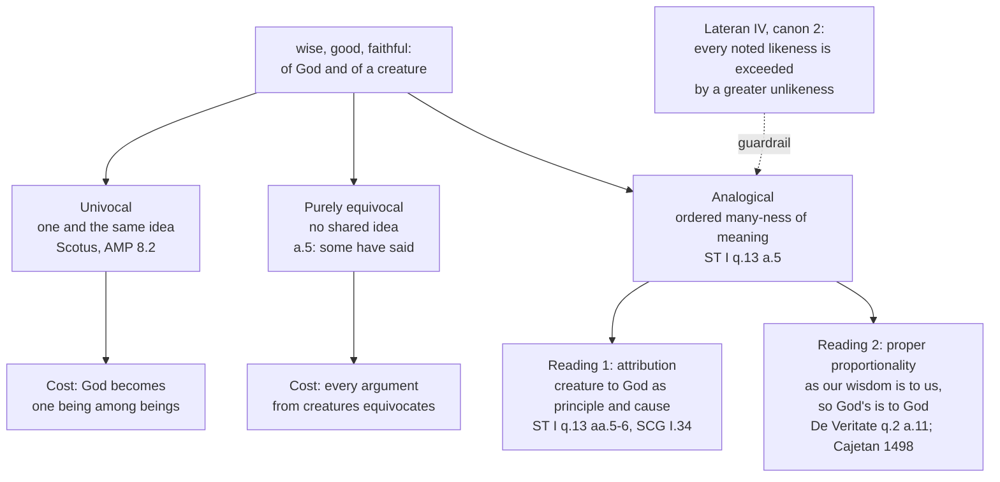

# The Thomistic Synthesis · Lesson 4.4: Analogy

> ⏱ ~15 min · Module 4: Knowing and naming God · Builds on: [4.2 Knowing God from creatures](04-02-knowing-god-from-creatures-the-three-ways.md), [4.3 The names of God](04-03-the-names-of-god.md) · Unlocks: [5.1 Creation and conservation](05-01-creation-and-conservation.md), [6.1 The commentators](06-01-the-commentators.md)

## Why this matters

Every sentence in the treatise on God is made of words we learned from creatures. If "wise" said of God means exactly what it means of Socrates, God is one wise thing among others and Module 3 has proved the existence of a very large creature. If it means nothing in common, every argument from the world to God has four terms instead of three, and the Creed is noise we are obliged to recite. Analogy is the narrow gap between those two disasters — and the place where the Thomist school splits most famously against itself: the course's cleanest case of a [school thesis](../reference.md#school-thesis) that is not a doctrine.

## The idea

A word can be used of two things in three ways. **Univocally**: "animal" of a dog and of a horse, one and the same idea both times. **Equivocally**, by accident: "bark" of a dog and of a tree, two ideas sharing a noise. Aquinas's third option is neither. "Healthy" is said of a body, a medicine, a diet, urine — not one idea repeated, and not four unrelated idioms, but an ordered family: health belongs to the body, and every other use is defined by a *reference* to it, which the medicine causes and the urine signals. That is [analogical predication](../reference.md#analogical-predication): many meanings, ordered to a first.

Analogy is not a blurred univocity, a meaning halfway between the other two. One meaning is primary, and the rest are fixed by a *stated* relation to it — which is what lets an argument run, since naming the relation blocks the fallacy of equivocation. Aquinas's account of God-talk: the names of God work like "healthy", and the ordering relation is *creature to God as principle and cause*.

## Source

*ST* I q.13 a.6, "Whether names predicated of God are predicated primarily of creatures?" — *respondeo*, opening and close (English Dominican Province):

> In names predicated of many in an analogical sense, all are predicated because they have reference to some one thing; and this one thing must be placed in the definition of them all. […] Hence as regards what the name signifies, these names are applied primarily to God rather than to creatures, because these perfections flow from God to creatures; but as regards the imposition of the names, they are primarily applied by us to creatures which we know first.

Two orders are distinguished, and the article is that distinction. The order of **reality**: where the perfection actually is first. The order of **imposition**: what the word was first fastened onto. They come apart — we learn "wise" from wise men, because wise men are what we meet, while the wisdom is in God first, because it flows from him to them. This is [the order of naming](../reference.md#the-order-of-naming), and why a name can be genuinely about God while carrying a mode of meaning borrowed from creatures ([4.3](04-03-the-names-of-god.md)). The quote's first sentence carries the structural claim — an analogical name has *one thing* in the definition of every other use — and the dispute below is over what that one thing is.

## The argument

*ST* I q.13 a.5's *respondeo*, in premises, each marked: **[art.]** an earlier article of q.13 or of Part I, **[M2]** Module 2's metaphysics, **[auth.]** an authority.

1. An effect that does not match the full power of its cause receives its likeness in a lesser measure, so that what is divided and multiplied in the effects is one in the cause. **[art.: q.13 a.4; behind it q.4 a.2]** *In words:* the sun makes many kinds of warmth with one power.
2. So a perfection-word said of a creature signifies something *distinct* from that creature's essence, power and existence; said of God, nothing distinct from these. **[M2: simplicity, [3.4](03-04-divine-simplicity-and-the-attributes.md)]** *In words:* Socrates's wisdom is one of his features; God's wisdom is not a feature of God.
3. And the word, said of a creature, circumscribes what it signifies; said of God it leaves the thing signified uncomprehended and exceeding the name. *In words:* "wise" fits a man and overflows God.
4. Therefore no name is predicated univocally of God and of creatures.
5. Neither are such names purely equivocal, "as some have said". For then nothing could be known or demonstrated of God from creatures, since the reasoning would always be exposed to the fallacy of equivocation. **[auth.: the philosophers who proved things about God; Romans 1:20]** *In words:* pure equivocity does not make theology humble, it makes it impossible.
6. So they are said analogically, "according to proportion", which happens in two ways — the text six centuries of Thomists fight over:

> Now names are thus used in two ways: either according as many things are proportionate to one […] or according as one thing is proportionate to another.

7. Which of the two applies to God? The next sentences answer: we can name God only from creatures **[art.: a.1]**, so whatever is said of God and creatures is said according to *the relation of a creature to God as its principle and cause*, in whom all perfections pre-exist excellently. *In words:* the second kind, with God as the one the other is ordered to.
8. Therefore this mode is a mean between pure equivocation and simple univocation: the idea is not one, as in univocals, nor wholly diverse, as in equivocals, but signifies various proportions to one thing.

Premise 6 is genuinely ambiguous on the page. What decides it is premise 7's "relation of a creature to God as its principle and cause" — and *SCG* I.34, which rules out the many-to-one mode because it would require something prior to God.

Premise 5 is worth a pause: the argument for analogy is that theology must be possible — q.2's move again, and the doctrine is defended by its consequences as much as by its metaphysics.

## Map of positions

**Reading 1, [analogy of attribution](../reference.md#analogy-of-attribution).** One analogate is primary; every other use is defined by its relation to it. This is what premise 7 and a.6's first sentence say on their face: the one thing in every definition is God, and the relation is causal participation. Its modern defenders — Ralph McInerny (*The Logic of Analogy*, 1961; *Aquinas and Analogy*, 1996) and Bernard Montagnes (*La doctrine de l'analogie de l'être*, 1963) — argue that analogy in Aquinas is a doctrine about *names* and their ordered meanings, not a separate metaphysical machine, and that his mature works converge on it.

**Reading 2, [analogy of proper proportionality](../reference.md#analogy-of-proper-proportionality).** The likeness is not between two things but between two *relations*: as our wisdom is to us, so God's is to God. Cajetan's *De Nominum Analogia* (1498) sorts analogy into inequality, attribution and proportionality, and argues that only proportionality is analogy properly so called, and the only kind yielding knowledge of God — attribution risks leaving the perfection formally in one analogate only, so that "God is good" would say no more than that God causes goodness, which a.6 rejects. The manual tradition made this *the* Thomist account for four centuries.

Cajetan had a text. In *De Veritate* q.2 a.11 the early Aquinas distinguishes agreement *of proportion* — a determinate relation between two things, as two is to one — from agreement *of proportionality*, a likeness between two relations, and rules the first out for God and creature: no creature stands in a determinate relation that could bound divine perfection. But that rejected category covers **both** modes a.5 later distinguishes, and a.5's chosen mode — creature to God as principle and cause — is precisely such a determinate relation. Montagnes reads this as development: the early work reaches for proportionality, the mature work settles on attribution grounded in causality. A defender of Cajetan reads two complementary descriptions, the *Summa* naming the causal ground and *De Veritate* the semantic form — and presses the collapse objection back on Reading 1.

None of this is doctrine: no magisterial act has settled it, both readings are held by Catholics in good standing, and it sits among the freely disputed questions at the bottom of [`fundamental-theology` 4.4](../../fundamental-theology/lessons/04-04-the-ladder-of-doctrinal-authority.md)'s ladder.

## Worked examples

**Example 1 (clean: "God is wise").** Step one: the name is not metaphorical — "wise" includes no defect and no matter in its definition, unlike "lion" or "rock". That test comes first, since by a.6 metaphors *are* primary in creatures. Step two, a.5's two tests: in Socrates, "wise" signifies a quality really other than his essence, power and act of existing ([2.2](02-02-esse-and-essence-the-real-distinction.md)), and measures him; in God it signifies nothing other than the divine essence, which is [subsisting being itself](../reference.md#subsisting-being-itself), and overflows him. Not univocal. Step three, premise 5: nor wholly other, or the Fourth Way and everything after q.3 is void. So it is analogical, the creature's wisdom ordered to God's as effect to principle. Step four, a.6: as regards what is signified, "wise" belongs first to God; as regards the imposition of the name, first to Socrates. Drop the first half and you get Maimonides ([4.3](04-03-the-names-of-god.md)); drop the second and you have claimed to know how God is wise.

**Example 2 (hard: where analogy strains).** The bill comes due when someone asks *how much* likeness analogy claims. Lateran IV (1215), canon 2, condemning Joachim of Fiore's error about the Trinity, laid down a general rule in passing: between Creator and creature no likeness can be noted without a greater unlikeness having to be noted between them. Call it [the greater unlikeness](../reference.md#the-greater-unlikeness). It is conciliar teaching, binding every theory of analogy — the Thomist one included, which must show its mean leaning to the unlikeness side, not putting God and creatures on one scale.

That is the twentieth century's charge. Erich Przywara's *Analogia Entis* (1932) built a metaphysics out of the Lateran formula, making ever-greater dissimilarity the rhythm of the creature's relation to God. Karl Barth, in the same years, named the analogy of being the "invention of Antichrist" and the reason he could not become a Catholic: any common concept of *being* spanning God and creature gives the creature a foothold to reach God without grace. The Thomist reply is in place already — analogy is not a common concept, premise 8 denies the idea is one, and a.6 concedes we start from creatures because that is all we have. Barth later developed analogies of his own, of faith and of relation. The objection is to the enterprise, not to either reading of a.5, so both answer it alike.

## Watch out

- **You might think analogy is a hedge — "sort of wise".** The opposite: several strictly ordered meanings, one of them primary.
- **You might think analogical means metaphorical.** a.6 separates them: metaphors ("God is a rock") are primary in creatures in *both* orders, since said of God they mean only a likeness to such creatures.
- **You might think a.5's *sed contra* is Aquinas's answer.** It argues for equivocity; the article's last line refuses it ([1.2](01-02-reading-a-whole-question.md)).
- **Do not promote Cajetan.** The Church's commending Aquinas as master makes no Thomist's reading of him binding, nor Aquinas's own school theses. Above the school level here are the Lateran IV rule and the Church's teaching that God can be known from creatures — assign each by its own act.
- **Do not demote Scotus.** [Univocity of being](../reference.md#univocity-of-being) is a school position held by a Catholic doctor of the Church, not a condemned error, and it has its own guardrail: the univocal concept is thin, and thick predicates stay analogical ([`ancient-medieval-philosophy` 8.2](../../ancient-medieval-philosophy/lessons/08-02-scotus-the-univocity-of-being.md)).

## One-liner

> "Healthy" belongs to the body and to urine only by reference to it; "wise" belongs to God and to Socrates only by reference to him — except that we learned the word from Socrates.

## Problems

**P1 (🟢) *(Exegetical.)*** Scripture calls God faithful. Take the name "faithful" as said of God and of a man who keeps his promises.
(a) Run the three ways of [4.2](04-02-knowing-god-from-creatures-the-three-ways.md) on it — causality, negation, eminence — one sentence each.
(b) Classify it by *ST* I q.13 a.5 and a.6: univocal, purely equivocal, metaphorical, or properly analogical; and in each of a.6's two orders, does it belong first to God or first to the man? Two sentences.

**P2 (🟡) *(Exegetical — level assignment, strict.)*** Two claims:

> (i) Between the Creator and any creature, no likeness can be noted without a greater unlikeness having to be noted between them.
>
> (ii) Analogy of proper proportionality is the analogy by which theological language works; analogy of attribution is not analogy properly so called.

(a) For each, name the act or text that fixes its level, place it on the ladder of [`fundamental-theology` 4.4](../../fundamental-theology/lessons/04-04-the-ladder-of-doctrinal-authority.md), and say what a Catholic who denied it would be doing. Two sentences per claim.
(b) Two students go wrong in opposite directions. The first says (ii) binds, because the Church gives us Aquinas as master and Cajetan is his authoritative interpreter. The second says (i) does not bind, because it appears inside a condemnation of Joachim's error about the Trinity and so is only a claim about Trinitarian language. Name the error in each, one sentence apiece.

**P3 (🔴, optional) *(Exegetical.)*** Boethius defines a person as "an individual substance of a rational nature". *ST* I q.29 a.3 asks whether the word "person" should be said of God, and answers that it is fittingly applied to him, "not, however, as it is applied to creatures, but in a more excellent way", citing q.13 a.2. Its reply to objection 4 adds that God cannot be called an individual in the sense that his individuality comes from matter, but only in the sense that implies incommunicability.
(a) Apply a.5's two tests to "person" — does the term signify something distinct from the thing's essence, power and existence? does it circumscribe what it signifies? — and say what follows about univocity.
(b) By a.6, is "person" said of God properly or metaphorically, and which of the two orders puts God first? Then say what would follow for the Creed if "person" were purely equivocal.
150 words or fewer in total.

Solutions

**P1** *(Exegetical.)*

**Must hit, strict (a):** **Causality** — God is called faithful as the cause of whatever fidelity is found in creatures; fidelity pre-exists in him as in its principle. **Negation** — remove the creaturely mode: a man's fidelity is a habit really other than his essence and his act of existing, is acquired, can be lost, and is exercised across time; none of that is in God. **Eminence** — fidelity is in God in a higher and unlimited way, identical with his essence, and the name leaves what it signifies uncomprehended.
**Must hit, strict (b):** **Properly analogical.** Not univocal: in the man "faithful" signifies something distinct from his essence, power and existence, and circumscribes what it signifies, and in God it does neither (a.5). Not purely equivocal, or nothing could be argued from a man's fidelity to God's. Not metaphorical: fidelity includes no defect and no matter in its definition, unlike "rock". By a.6: as regards **what the name signifies**, first of God, because the perfection flows from God to creatures; as regards **the imposition of the name**, first of the man, whom we know first.
**Wrong turns:** calling it a metaphor because Scripture also calls God a rock and a shield — a.6's test is whether the definition of what the name signifies includes matter or defect, not whether the Bible uses images nearby. Saying "faithful" means only that God causes fidelity in us: that is the causal-only reading a.2 and a.6 explicitly reject, and it would make the name primary in creatures in *both* orders. Answering only "God is faithful in a higher way" without naming which order is which — that is eminence without a.6, and it is half the answer.
**Model answer:** (a) God is called faithful as the cause of every creature's fidelity; the creaturely mode is then denied of him, since his fidelity is not an acquired habit distinct from his essence, cannot be lost, and is not exercised over time; and it is affirmed of him eminently, as identical with his own being and exceeding the name. (b) Properly analogical, not metaphorical: what the name signifies includes no defect or matter, and the two analogates are ordered as effect to principle and cause. As regards what is signified it belongs first to God, from whom the perfection flows; as regards the imposition of the name it belongs first to the man, since we meet faithful men before we name God from them.

---

**P2** *(Exegetical — strict. Overstating or understating a level is the error.)*

**Must hit, strict (a), claim (i):** the act is the **Fourth Lateran Council (1215), canon 2**, an ecumenical council teaching doctrinally. That is a magisterial act, so the claim is above the seam in `fundamental-theology` 4.4 — a solemn conciliar judgment, at the definitive end of the ladder (rung 1; an answer of "rung 1 or 2, and by can. 749 §3 do not promote without a manifest proposal as revealed" is fully acceptable, and better than a bare assertion). Denying it is rejecting the teaching of an ecumenical council, not departing from a school.
**Must hit, strict (a), claim (ii):** **no magisterial act proposes it at all.** Its text is Cajetan's *De Nominum Analogia* (1498), a theologian's book, defended later by the manual tradition and contested by McInerny and Montagnes. It is below the seam: **rung 5**, freely disputed. Denying it is taking a side in an open question — not disobedience, and not even rashness, since the consensus it once enjoyed has been broken by serious Thomists.
**Must hit, strict (b):** *First student* — he treats the Church's **recommendation of a master** as if it were a definition making that master's theses binding, and then adds a second step the Church never took, canonizing an interpreter of the master; neither step is a magisterial act, and even a genuine one would bind only what it proposed. *Second student* — he confuses the **occasion** of a teaching with its **scope**: the council states the likeness–unlikeness rule as a general truth about Creator and creature and uses it to settle a Trinitarian error, and in any case the rung tracks the mode in which a claim is proposed, not its subject matter.
**Wrong turns:** putting (ii) at rung 3 or 4 because "the manuals taught it for centuries" — long consensus among theologians is still below the seam, and this one no longer holds. Putting (i) at rung 4 or 5 because it is a sentence of argument inside a condemnation rather than a canon of its own. Deciding (ii) by whether Cajetan's reading is *correct*; the level question is about acts, not about who is right.

---

**P3** *(Exegetical.)*

**Must hit, strict (a):** in a human being, "person" signifies a subsistent individual whose rational nature is one thing and whose act of existing is another ([2.2](02-02-esse-and-essence-the-real-distinction.md)), with power and operation distinct again; and the term circumscribes, marking this one off from others — in the Boethian definition by individuation proper to a material nature. In God nothing signified is distinct from the divine essence, and q.29 a.3 ad 4 denies that "individual" can be taken of him in the sense drawn from matter, leaving only incommunicability. So the idea is not one and the same: **"person" is not univocal of God and of us.**
**Must hit, strict (b):** **properly, not metaphorically.** The reply to objection 4 rescues each element of the definition in a sense fit for God rather than declaring the whole name an image, and the *respondeo* says "person" signifies what is most perfect in nature and so is fittingly applied to God — in a more excellent way, citing q.13 a.2, which is the article establishing that such names signify God's substance and not merely his causality. So by a.6 it belongs first to God **as regards what the name signifies**, and first to creatures **as regards the imposition of the name**. If it were purely equivocal, "three persons in one God" would assert nothing at all, and every argument in the Trinitarian treatise would commit a.5's fallacy of equivocation.
**Wrong turns:** calling "person" said of God a metaphor — that is a.6's other category, and q.29 a.3 places it with the names that signify God substantially. Reading "person signifies what is most perfect in all nature" as making the name univocal; the very next clause denies that it is applied as to creatures. Inferring from "we impose the name on creatures first" that it signifies creatures primarily — that inference is objection 1 of a.6, and the *respondeo* answers it by splitting the two orders.
**Model answer:** In us, "person" signifies a subsistent individual whose nature, existence and powers are really distinct, and it circumscribes what it signifies, individuating by a material nature. In God none of this holds: nothing signified is other than the essence, and q.29 a.3 ad 4 allows "individual" only in the sense of incommunicability. The idea is therefore not one, so the name is not univocal. It is nevertheless proper, not metaphorical, since q.29 a.3 applies it to God in a more excellent way on the strength of q.13 a.2. By a.6 it belongs first to God as regards what it signifies and first to creatures as regards the imposition of the name. Were it purely equivocal, "three persons in one God" would say nothing, and the Trinitarian treatise would argue with four terms.

## Flashback

**From Lesson [4.2](04-02-knowing-god-from-creatures-the-three-ways.md) (Knowing God from creatures: the three ways):** *(Exegetical.)* ST I q.12 a.4 asks whether any created intellect can see the divine essence by its natural powers, and answers no. Its *respondeo* opens (English Dominican Province):

> "For knowledge is regulated according as the thing known is in the knower. But the thing known is in the knower according to the mode of the knower."

It closes by saying that the created intellect cannot see God's essence unless God by his grace unites himself to it as an object made intelligible to it.

(a) Which words make the obstacle a fact about the knower rather than about God's availability, and what feature of God's own mode of being does the article say puts his essence beyond natural reach? (b) The same principle does not shut down the three ways. Say in one sentence why not. 100 words or fewer.

Solution

**Must hit, strict (a):** the deciding words are "**according to the mode of the knower**" — knowledge is measured by the nature of the one knowing, so an object whose mode of being exceeds that nature is above its power, and the limit is a proportion between natures rather than anything God does or withholds. The feature: God alone is his own subsistent being, while every creature's existence is participated and not its own; so to know self-subsistent being is natural to the divine intellect alone. Credit for tying this to [4.2](04-02-knowing-god-from-creatures-the-three-ways.md)'s point that the barrier is metaphysical — effects that do not equal their cause — and not hiddenness or sin.

**Must hit, strict (b):** because the three ways never require God's own mode of being to be in the knower. They run on species abstracted from creatures and yield only that God is, that he is the cause of all things, that creatures differ from him, and that the difference is by his excess — knowledge from effects, not the essence seen (q.12 a.12).

**Wrong turns:** reading the limit as divine reticence, a punishment, or a shortage of evidence. Concluding from (a) that natural reason reaches nothing of God, which a.12 denies in the next breath. Saying that grace makes the vision natural to the creature: a.5's created light raises a power above its own nature, and even then the blessed never comprehend God (a.7).

**Model answer:** (a) "According to the mode of the knower": what can be known is fixed by the knower's own nature, so the obstacle is a mismatch of natures and nothing about God's willingness. What exceeds us is that God alone is his own subsistent being, every creature's existence being received. (b) The three ways ask for nothing of the kind: working from creaturely species, they reach that God is and what must belong to the first cause of all — his essence stays out of the claim, so the mode-of-the-knower principle leaves them standing.

## Connections

- **Backward:** [4.1](04-01-how-a-human-intellect-knows.md) is why the order of imposition runs from creatures — an intellect that begins in the senses has no other place to get its words. [4.2](04-02-knowing-god-from-creatures-the-three-ways.md) supplies causality, negation and eminence, which are the procedure whose *semantics* this lesson states. [4.3](04-03-the-names-of-god.md) settled that these names signify God's substance and not only his causality (q.13 a.2) and separated the thing signified from the mode of signifying (a.3); without those two results a.5 has nothing to be a mean between. Premise 2 leans on simplicity from [3.4](03-04-divine-simplicity-and-the-attributes.md) and the real distinction from [2.2](02-02-esse-and-essence-the-real-distinction.md).
- **Forward:** analogy is what makes the language of [5.1](05-01-creation-and-conservation.md) and [5.2](05-02-providence-and-secondary-causes.md) possible — "cause" said of God and of a secondary agent is the same problem in a new place. Cajetan returns in person in [6.1](06-01-the-commentators.md), the manual settlement of his reading in [6.2](06-02-leo-xiii-and-the-thomist-revival.md), and the level assignments rehearsed in P2 are the whole business of [6.5](06-05-what-the-church-has-said-about-thomism.md). `trinity-and-god` takes P3's question and builds on it.
- **Sideways:** Scotus's argument is [`ancient-medieval-philosophy` 8.2](../../ancient-medieval-philosophy/lessons/08-02-scotus-the-univocity-of-being.md), and his formal distinction appeared already in [2.2](02-02-esse-and-essence-the-real-distinction.md). [`philosophy-of-language-and-logic`](../../philosophy-of-language-and-logic/syllabus.md) hands analogy to this course and takes back the general questions about meaning and reference that a.6's two orders raise. The ladder that P2 runs on is [`fundamental-theology` 4.4](../../fundamental-theology/lessons/04-04-the-ladder-of-doctrinal-authority.md), and where it and this course differ, it wins.
