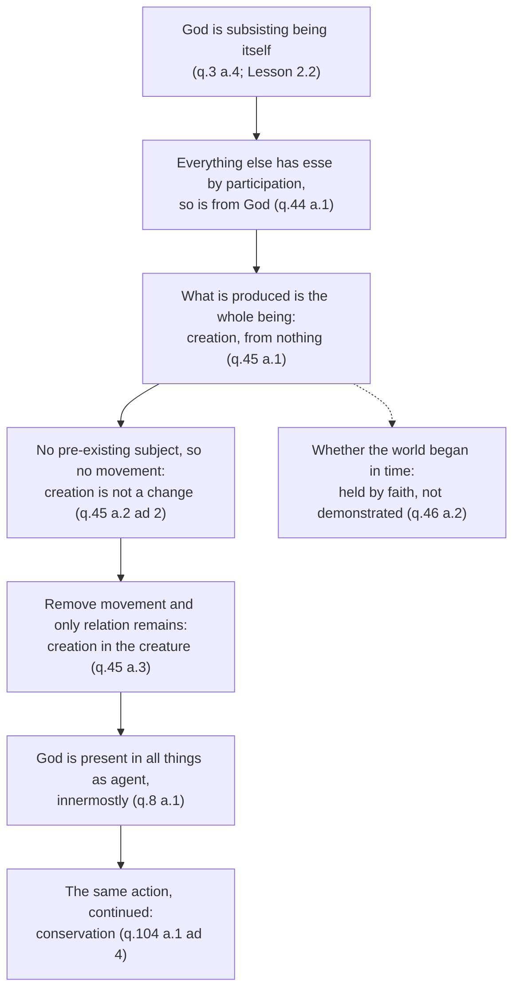

# The Thomistic Synthesis · Lesson 5.1: Creation and conservation

> ⏱ ~15 min · Module 5: Creatures and their return · Builds on: [2.2 Esse and essence: the real distinction](02-02-esse-and-essence-the-real-distinction.md), [2.3 Participation](02-03-participation.md), [3.4 Divine simplicity and the derivation of the attributes](03-04-divine-simplicity-and-the-attributes.md) · Unlocks: [5.2 Providence and secondary causes](05-02-providence-and-secondary-causes.md)

## Why this matters

Two arguments you have met. "Cosmology has explained where the universe came from, so a creator is surplus." And its mirror: "The Big Bang shows the universe began, which proves it was created." Aquinas's treatise on creation makes both beside the point — not by dodging the physics, but by being more exact than either side about what *creation* names. Get this right and you can say in one sentence why no cosmological result settles the question either way. You also get the two claims the dogmatic sequence runs on: God's causing of the world is not an event inside its history, and keeping a thing in being is not a second job after making it.

## The idea

Take an ordinary making. A carpenter makes a table: wood is already there, it takes on a new arrangement, and when he puts down his tools the table stays. Three features — a persisting subject, a process, independence afterwards.

Now subtract the first. Not "he used a very thin material", but: nothing whatever is presupposed. What is left is not impressive carpentry; it is a different kind of act. Aquinas's name for it is the emanation of all being from the universal cause, and that emanation is what we call **[creation](../reference.md#creation)** (ST I q.45 a.1). Where a particular agent makes *this* out of *that*, the universal cause of being has no *that* to work from, because there is no being outside what it causes.

Once the persisting subject goes, the process goes with it. A change is something's being different now from how it was, and that needs a something — actually the same (a wall turning white) or potentially the same (matter under a new form). In creation the whole substance is produced, so nothing is left over to be first this and then that.

And once the process goes, so does the picture of God finishing and stepping back. The carpenter supplied an arrangement, which the wood then holds by itself. God supplies *esse*, the act of existing, which a creature's essence never holds by itself, since in every creature the two are [really distinct](../reference.md#real-distinction) ([2.2](02-02-esse-and-essence-the-real-distinction.md)). That is the difference between a **cause of becoming** and a **cause of being**, set out in [`metaphysics` 4.4](../../metaphysics/lessons/04-04-ordered-causal-series.md) and not repeated here. The builder is the first; the sun lighting the air is the second. Aquinas uses both examples, and they are the whole of [conservation](../reference.md#conservation).

## Source

*Summa Theologiae* I q.45 a.2, reply to the second objection (English Dominican Province translation, public domain). The objection: to be created is to be made, to be made is to be changed, every change needs a subject — so nothing can be made from nothing.

> "Creation is not change, except according to a mode of understanding. For change means that the same something should be different now from what it was previously. Sometimes, indeed, the same actual thing is different now from what it was before, as in motion according to quantity, quality and place; but sometimes it is the same being only in potentiality, as in substantial change, the subject of which is matter. But in creation, by which the whole substance of a thing is produced, the same thing can be taken as different now and before only according to our way of understanding, so that a thing is understood as first not existing at all, and afterwards as existing."

Notice what he concedes and where he stops. He does not deny that we *talk* about creation as a change; he grants that the grammar is unavoidable, since our mode of signifying follows our mode of understanding. What he denies is that the grammar reports a structure in the thing. "Except according to a mode of understanding" is the entire concession, and it is about language.

## The argument

The *respondeo* of q.45 a.3 turns that reply into a positive result. Each premise's source is marked.

1. **Whatever is made by movement or change is made from something pre-existing.** *(The definition of change, assumed from [`ancient-medieval-philosophy` 3.3](../../ancient-medieval-philosophy/lessons/03-03-change-privation-potency-and-act.md).)* *In words:* change always has a "what" that undergoes it.
2. **In the production of all being by the universal cause of all beings, nothing pre-exists.** *(q.44 a.1, reached through participation: whatever has *esse* by sharing gets it from the one whose essence is *esse* — [2.3](02-03-participation.md), [subsisting being itself](../reference.md#subsisting-being-itself).)*
3. **So God by creation produces things without movement.** *(1, 2.)* *In words:* [creation is not a change](../reference.md#creation-is-not-a-change).
4. **Action and passion, with movement removed, leave only relation.** *(q.45 a.2 ad 2, the Source.)* *In words:* strip out the process and what remains between maker and made is a dependence.
5. **Therefore what creation puts in the creature is only a certain relation to the Creator as to the principle of its being.** *(3, 4.)* — [creation as a real relation](../reference.md#creation-as-a-real-relation-in-the-creature).

Two consequences follow at once. The relation is **real in the creature and only of reason in God** (a.3 ad 1, resting on q.13 a.7, which [4.3](04-03-the-names-of-god.md) reads): the creature is genuinely ordered to God, while God acquires nothing by creating. And the name "creation" carries "a certain newness or beginning", so a creature is not *being created* for as long as it exists (a.3 ad 3) — a fence, with the next section on its far side.

### Conservation is the same act, still being given

Question 104 asks whether creatures need to be kept in being by God. Aquinas answers with the becoming/being distinction: the builder causes the house's *becoming*, and its *being* then rests on the natures of stone and timber, so he may die and it will stand. But a creature stands to God as air to the sun. The air has no light of its own and cannot hold light once the sun stops, so it is not lit a moment longer. God alone is being by his essence; every creature has being by participation, and so holds nothing of itself with which to keep going.

Is conservation then a further act, a maintenance contract after the build? No:

> "The preservation of things by God is a continuation of that action whereby He gives existence, which action is without either motion or time." (ST I q.104 a.1 ad 4)

One action, not two. And because an agent must be present to what it works on, and what God works is existing, God is in all things as an agent is present to its effect — innermostly, since being is the innermost thing in anything at all (q.8 a.1). Divine presence is a corollary of causing *esse*, not a separate doctrine about where God is.

### The question of a beginning

Nothing so far has mentioned a first moment, and that is deliberate. Aquinas holds that the world *did* begin, and that this is [held by faith and cannot be demonstrated](../reference.md#a-beginning-in-time-is-held-by-faith) (q.46 a.2). Reason cannot get it from the world, since a thing's species tells you nothing about its "when"; nor from the cause, since God creates by will, which reason cannot read off. He adds a pastoral reason: parading a bad proof of what is in fact believed invites unbelievers to laugh at the faith. The Paris dispute, and Bonaventure's contrary view, are [`ancient-medieval-philosophy` 7.1](../../ancient-medieval-philosophy/lessons/07-01-faith-reason-and-the-paris-crisis.md)'s.

## The derivation

The dashed edge is the point of the lesson. The solid path is all about dependence; only the dashed branch is about duration, and Aquinas cuts it off from demonstration.

## Worked examples

**Example 1 (clean): a stone, at noon.** What is God doing to this stone right now? Wrong answer: he made it long ago and has not interfered since. Run the machinery. Its essence and *esse* are really distinct, so its existing is not something its stone-nature supplies; it stands to the giver of *esse* as lit air to the sun, not as a house to its builder (q.104 a.1). At noon it is really related to God as to the principle of its being (q.45 a.3), and God is present to it innermostly, as an agent to what it works on (q.8 a.1). The answer: exactly what he did when the stone came to be — one action, without motion or time, called conservation because we are describing its continuation (q.104 a.1 ad 4). Note what this does *not* say, that the stone is created again at noon. The action is the same; the name is not, since "creation" carries newness (a.3 ad 3).

**Example 2 (hard): run it on modern cosmology.** Two supposals Aquinas never discusses.

*Suppose the universe has no first moment* — an infinite past, or a model whose cosmic time has no earliest instant. Does that refute creation? No: this is exactly the case q.46 a.1–a.2 contemplates. Aquinas reports the image the eternalists themselves used, a foot resting in dust from all eternity, leaving a print with no beginning that is nonetheless caused entirely by the foot. A beginningless world is one whose every moment is wholly dependent, which is all creation asserts. Aquinas thinks such a world is not ours — on faith, not physics.

*Suppose instead there is an absolute first moment.* Does that prove creation? Also no, and for a sharper reason. Creation is not a change (Source), so it is not the earliest member of a series of changes. A first moment is a boundary of the physical description, not the giving of *esse*; and a "cause of the first moment" is a cause of becoming, explaining an origination, where creation answers why anything has being at all — at noon as much as at the boundary. The physics is [`cosmology`](../../cosmology/syllabus.md)'s, and whether a temporal beginning can be argued to a cause is the kalam, owned by [`philosophy-of-religion`](../../philosophy-of-religion/syllabus.md) 2.5. Aquinas is prior to both: these are different questions.

Hence a sentence you can use anywhere. *Creation is not a claim about the first moment; it is a claim about every moment.*

## Watch out

- **You might think "creation is not a change" is a hedge, but it is the stronger claim.** Saying God changed nothing into something would make him one cause among causes, working on a subject. Saying there is no subject makes the dependence total.
- **You might think conservation means God re-creates the world each instant.** Aquinas says the opposite twice: preservation is the *continuation* of one action, without motion or time (q.104 a.1 ad 4), and a creature need not be *being created* for as long as it exists (q.45 a.3 ad 3). Re-creation posits a series of acts; the doctrine posits one. (Whether persistence needs a cause at all — existential inertia denies it — is argued in [`metaphysics` 4.4](../../metaphysics/lessons/04-04-ordered-causal-series.md), not here.)
- **You might think "before creation" names a time. It names nothing.** Time is measured by change, creation is not a change, and time is itself created (q.46 a.3).
- **Do not let the levels collapse.** Paraphrasing: Lateran IV (1215, ch. 1) and Vatican I's *Dei Filius* (1870, ch. 1 with its canons) teach that God created all things from nothing *from the beginning of time*. Both claims are rung 1, *de fide*, on the ladder of [`fundamental-theology` 4.4](../../fundamental-theology/lessons/04-04-the-ladder-of-doctrinal-authority.md). That the beginning cannot be *demonstrated* is Aquinas's own thesis (q.46 a.2), contested by Bonaventure, fixed by no magisterial act — rung 5. So is the analysis that creation is a relation rather than a change: theology, not definition. Creation as doctrine belongs to [`creation-grace-last-things`](../../creation-grace-last-things/syllabus.md).

## One-liner

> Creation says nothing about when the universe started and everything about what holds it up now — which is why conserving it is not a second act but the same one, still being given.

## Problems

**P1 (🟢) *(Exegetical.)*** *Summa Theologiae* I q.45 a.3, from the body of the article (English Dominican Province translation):

> "Creation places something in the thing created according to relation only; because what is created, is not made by movement, or by change. For what is made by movement or by change is made from something pre-existing. And this happens, indeed, in the particular productions of some beings, but cannot happen in the production of all being by the universal cause of all beings, which is God. Hence God by creation produces things without movement. Now when movement is removed from action and passion, only relation remains, as was said above. Hence creation in the creature is only a certain relation to the Creator as to the principle of its being."

(a) Which words carry the step from "not made by movement" to "only relation remains", and what fact about the universal cause makes that step available here but not in an ordinary making?
(b) The same article's reply to objection 3 adds that it is not necessary that a creature be *being created* for as long as it exists. What does that reply add to the bare relation of (a), and why does adding it not weaken the creature's dependence on God?

Two sentences per part.

**P2 (🟡)** (a) *(Exegetical.)* Two supposals about our universe, neither discussed by Aquinas: (i) it has an infinite past with no first moment; (ii) it has an absolute first moment. For each, say whether it establishes, refutes, or leaves untouched the claim that the world is created in Aquinas's sense, and name the article that decides it. One sentence each.
(b) *(Exegetical.)* Give the level of each claim and name the act or text that fixes it, without overstating in either direction: (i) God made all things from nothing; (ii) the world had a beginning in time; (iii) that the world had a beginning in time cannot be demonstrated by natural reason. One sentence each.

**P3 (🔴, optional) *(Exegetical.)*** An invented parish-newsletter paragraph:

> "Science has pushed God further and further back, but it cannot push him off the edge. Something had to set off the Big Bang, and that something is God. Once the laws were running, of course, the universe has carried itself along ever since — which is why the origin of the universe is the one place where believers should plant their flag."

Name the two mistakes about creation, cite one article of the *Summa* against each, and say what the writer would have to change to say something Aquinas could sign. 150 words or fewer.

Solutions

**P1** *(Exegetical (a) · Exegetical (b))*

**Must hit, strict (a):** the operative clause is "when movement is removed from action and passion, only relation remains" — the inference runs through the removal of *movement*, not through anything about relations as such. What licenses the removal is stated just before: what is made by movement is made from something pre-existing, and in the production of *all* being by the universal cause of all beings nothing pre-exists. In an ordinary making there is always a pre-existing subject (the wood, the matter), so movement is not removed and the making is a genuine change; only a cause of being as such has nothing left over to work on.

**Must hit, strict (b):** it adds "a certain newness or beginning" — the name "creation" is the relation of dependence *plus* that note, which is why a creature is not being created at every moment of its life. Dependence is untouched because the relation in (a) is to the Creator "as to the principle of its **being**", not of its beginning, and the continuing side of it is handled in q.104 a.1: the preservation of things is the continuation of the one action by which God gives existence.

**Wrong turns:** answering (a) with "relation only" — that is the conclusion, not the step that reaches it. Reading (b) as a concession that the creature becomes independent once launched, which is the deism q.104 a.1 exists to block. Taking "according to relation only" to mean that nothing at all is in the creature, or that the relation is some third thing standing between Creator and creature; the article's second objection presses that, and the reply answers that passive creation is in the creature and is itself a creature.

**Model answer:** (a) "Now when movement is removed from action and passion, only relation remains." The step is available because the universal cause of all beings has nothing pre-existing to work from, whereas every particular making presupposes a subject and so really is a change. (b) It adds the note of newness or beginning that the word "creation" carries, so that "being created" is not predicated of a thing throughout its existence. Dependence is untouched, because the relation is to God as principle of the creature's *being*, and its continuation is what q.104 a.1 calls preservation: one and the same action, still being given.

---

**P2** *(Exegetical (a) · Exegetical (b))*

**Must hit, strict (a):** (i) **Leaves it untouched.** A beginningless world would still have its whole being from the universal cause; q.46 a.1–a.2 is precisely the case, and a.2 ad 1 reports the eternalists' own footprint-in-the-dust image to show that a beginningless effect can be wholly caused. (Credit for citing q.45 a.1 instead, since creation is defined there with no reference to time.) (ii) **Leaves it untouched — it does not establish creation.** Creation is not a change (q.45 a.2 ad 2), so it is not the first member of a series of changes; a first moment is a boundary of the physical description, and a cause of it would be a cause of becoming, not of being. Credit for adding that such a finding would sit comfortably with what faith holds about a beginning (q.46 a.2) without thereby demonstrating creation. Answers must not say (ii) refutes creation either.

**Must hit, strict (b):** (i) **Rung 1, *de fide*.** Fixed by conciliar acts: Lateran IV ch. 1 and Vatican I's *Dei Filius* ch. 1 with its canons. (ii) **Rung 1, *de fide*,** by the same acts, which say God created from nothing *from the beginning of time*. (iii) **Rung 5 — freely disputed, no magisterial act.** It is Aquinas's thesis at q.46 a.2, denied by Bonaventure and others; nothing defines it, and *Dei Filius* defines what God did, not what reason can prove about it.

**Wrong turns:** promoting (iii) to a taught doctrine because Aquinas held it and the Church commends Aquinas — the recommendation of a master does not make his theses binding. Demoting (ii) to a school opinion because its *demonstration* is disputed; the demonstrability of a doctrine and its level are independent. Saying that Big Bang cosmology confirms (ii), which is the confusion (a) rules out.

**Model answer:** (a) (i) Untouched: q.46 a.1–a.2 — a world with no beginning would still be wholly dependent, and a.2 ad 1's footprint image makes the point. (ii) Untouched: q.45 a.2 ad 2 — creation is not a change, so a first moment of the physical story is not the giving of *esse*. (b) (i) Rung 1, *de fide*: Lateran IV ch. 1, *Dei Filius* ch. 1 and canons. (ii) Rung 1, *de fide*: the same acts specify "from the beginning of time". (iii) Rung 5, freely disputed: Aquinas's position in q.46 a.2, contested by Bonaventure, fixed by no act of the Magisterium.

---

**P3** *(Exegetical.)*

**Must hit, strict:** two distinct mistakes. (1) **God of the gaps.** The paragraph makes God the cause of one event at the edge of the physical story, which means any account of that event displaces him; but q.44 a.1 (with q.45 a.1) makes God the cause of every being *as being*, not a cause among causes filling a gap, and q.45 a.2 ad 2 denies that creation is a change at all, so it is not an event that can be "set off". (2) **Deism.** "Carried itself along ever since" denies conservation: q.104 a.1 holds that the being of every creature depends on God at each moment as light depends on the sun, so withdrawing that influence is annihilation, not neglect. The fix: move the claim from the first moment to every moment, and from an origination to the giving of *esse*. Credit for a third observation — that planting the flag on a beginning treats as demonstrable what q.46 a.2 says is held by faith, the exact move Aquinas warns brings the faith into contempt.

**Wrong turns:** calling both errors "deism" or both "God of the gaps"; they are separable, and the paragraph commits each in a different sentence. Objecting to the cosmology rather than to the concept of creation. Replying that God also acts through secondary causes — true, and [5.2](05-02-providence-and-secondary-causes.md)'s subject, but it does not name what is wrong here.

**Model answer:** Two mistakes. First, a God of the gaps: God is cast as the cause of one event, the start, so every scientific advance shrinks him. Against this, q.44 a.1 makes God the cause of all being as being, and q.45 a.2 ad 2 denies that creating is a change, so it is not an event with a before and after that could be "set off". Second, deism: "carried itself along ever since" denies that anything is needed now. Against this, q.104 a.1 argues that a creature's essence is not its existence, so it holds being as air holds light, and would fall into nothing if the influence stopped. The writer would have to relocate the claim from the first moment to every moment, and from starting the universe to giving it *esse*.

## Flashback

**From Lesson [4.3](04-03-the-names-of-god.md) (The names of God):** *(Exegetical.)* ST I q.13 a.1 asks whether a name can be given to God. Its answer is that God can be named by us from creatures, "yet not so that the name which signifies Him expresses the divine essence in itself" (English Dominican Province).

Reconstruct that *respondeo* in four numbered premises and a conclusion, marking which premise comes from how a human intellect knows ([4.1](04-01-how-a-human-intellect-knows.md)) and which from the three ways ([4.2](04-02-knowing-god-from-creatures-the-three-ways.md)). Then say in one sentence which half of the conclusion the mode of signifying explains.

Solution

**Must hit, strict:** premises of this shape, in any wording.

- **P1.** Words are signs of ideas, and ideas likenesses of things, so a word reaches what it means only through the intellect's conception of it. *(Aristotle, cited in the article.)*
- **P2.** Therefore we can name a thing only so far as we can understand it.
- **P3.** In this life we do not see the essence of God. *(**From [4.1](04-01-how-a-human-intellect-knows.md)**: an intellect whose proper object is the nature of a material thing has no species of God; the article cites q.12 aa.11-12.)*
- **P4.** But we do know God from creatures — as their principle, and by way of excellence and remotion. *(**From [4.2](04-02-knowing-god-from-creatures-the-three-ways.md)**: causality, eminence, negation.)*
- **∴ C.** God can be named by us, and named from creatures; but no such name expresses the divine essence in itself, as "man" expresses man's, since what a name expresses is the definition.

**The one sentence:** the mode of signifying explains the **negative half** — the content signified (goodness, life, wisdom) is God's and more properly his than ours, while the creature-shaped way our words mean it does not fit him, so the name is true without expressing what he is ([4.3](04-03-the-names-of-god.md), a.3).

**Wrong turns:** turning P2 into "we can name only what we can define", which would make the conclusion a denial that God can be named at all — the article's own objection 1. Reading the conclusion as saying that the names are false, or that they are really about creatures; that is the causality-only reduction a.2 refutes. Dropping P4 and leaving only P3, which yields Maimonides rather than Aquinas. Assigning P3 to the three ways and P4 to the doctrine of intellect — the marks are the other way round.

**Model answer:** P1, words signify through the intellect's conception, since words are signs of ideas and ideas likenesses of things. P2, so a thing can be named only as far as it is understood. P3 (from [4.1](04-01-how-a-human-intellect-knows.md)), in this life we do not see God's essence. P4 (from [4.2](04-02-knowing-god-from-creatures-the-three-ways.md)), but we know God from creatures as their principle, by excellence and by remotion. Therefore he can be named by us from creatures, though no name expresses the divine essence in itself, the way "man" expresses man's essence by signifying its definition. The mode of signifying accounts for the second half: what our words signify belongs to God first, but the creaturely manner in which they signify it never does.

## Connections

- **Backward:** the whole argument runs on [2.2](02-02-esse-and-essence-the-real-distinction.md)'s real distinction and [2.3](02-03-participation.md)'s participation — without them, "cause of being" has no content and q.104 a.1's sun-and-air comparison is only a simile. [3.4](03-04-divine-simplicity-and-the-attributes.md) supplied the God who can be present to everything without being part of anything, and [3.2](03-02-the-first-and-second-ways-inside-the-system.md)'s causes of becoming against causes of being is the same distinction met earlier in the derivation.
- **Forward:** [5.2](05-02-providence-and-secondary-causes.md) asks the obvious next question — if God is giving being to everything at every moment, what is left for creatures to do? The answer depends on this lesson's result that God's causing is not on the same level as theirs. The doctrine of creation, and the fate of creatures, go to [`creation-grace-last-things`](../../creation-grace-last-things/syllabus.md).
- **Sideways:** the conservation claim is a live modern dispute, with existential inertia as its denial, in [`metaphysics` 4.4](../../metaphysics/lessons/04-04-ordered-causal-series.md). The temporal question this lesson refuses to answer is argued in [`philosophy-of-religion`](../../philosophy-of-religion/syllabus.md) 2.5, against the physics of [`cosmology`](../../cosmology/syllabus.md); the thirteenth-century form of the same fight is [`ancient-medieval-philosophy` 7.1](../../ancient-medieval-philosophy/lessons/07-01-faith-reason-and-the-paris-crisis.md).
