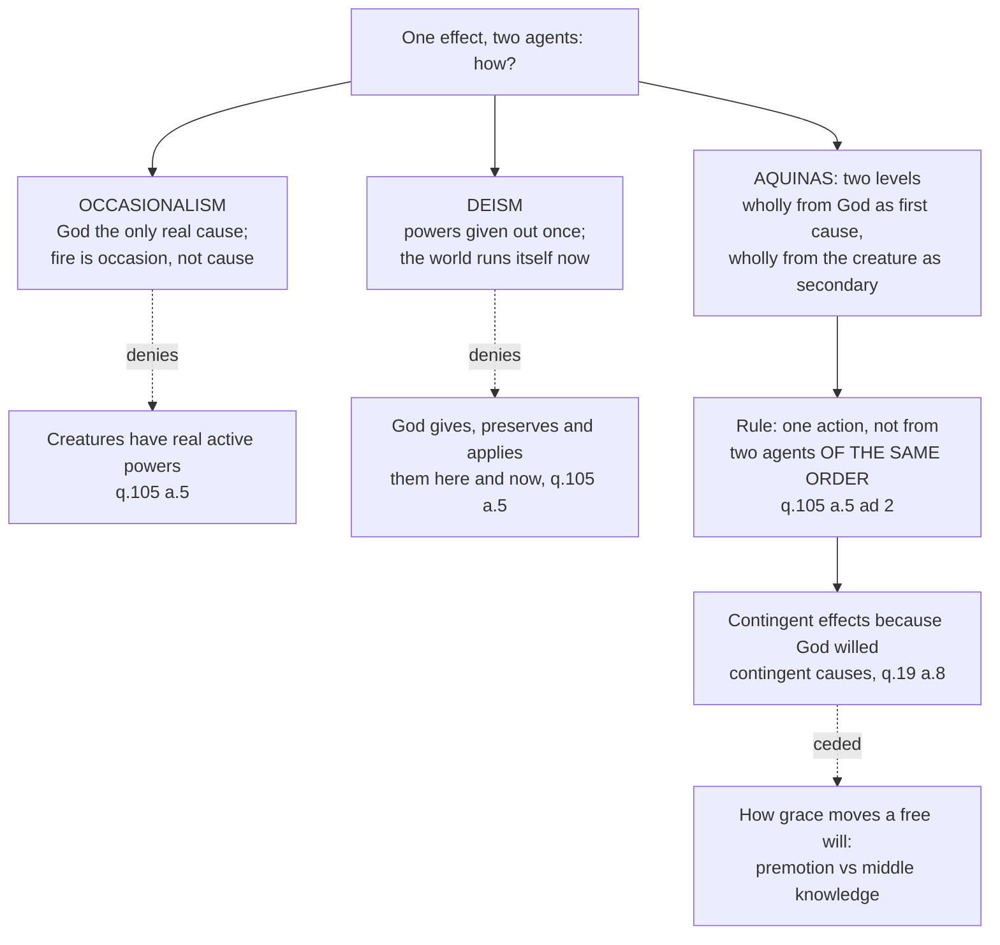

# The Thomistic Synthesis · Lesson 5.2: Providence and secondary causes

> ⏱ ~15 min · Module 5: Creatures and their return · Builds on: [5.1 Creation and conservation](05-01-creation-and-conservation.md), [2.1 Act and potency](02-01-act-and-potency-extended.md) · Unlocks: [5.3 The human soul in the system](05-03-the-human-soul-in-the-system.md)

## Why this matters

Nearly every doctrine still ahead of you is a special case of one question: how can God do something and a creature do the same thing? Grace and free will, miracles, the sacraments as instruments, the inspiration of Scripture — each names one effect with two agents. If God's acting and the creature's are two contributions to a single job, all of them become a haggle over shares, and the modern reflex follows: the more the sciences explain, the less is left for God to have done. Aquinas's reply is that the haggle was never available: the two agents are not on the same level.

## The idea

[Providence, for Aquinas, is two things](../reference.md#providence-as-plan-and-government), and the pair does the work. There is the **plan** — the order of things towards their end, existing in God's intellect — and the **execution** of that plan, which he calls *government* (ST I q.22 a.3). The plan is immediate and covers everything, down to this individual thing rather than its species (a.2). The execution runs through intermediaries, not because God runs short of attention: a cause powerful enough can give its effects the power to be causes in turn. Governing the lower through the higher hands creatures something real, the dignity of causing.

So there are two questions, not one, answered in opposite directions. *Who plans?* God, immediately, all of it. *Who does it?* God and the creature, both, wholly.

That last word is the hinge. Aquinas's image in q.105 a.5 is a craftsman and an axe, easy to misread as a division of labour. The axe cuts. The craftsman cuts. The cut is not half each, and it is not a relay in which one hands off to the other: the whole cut comes from the axe, by its sharpness, and the whole cut comes from the craftsman, who applies the axe to the wood. You can say both without contradiction because "cause" is not said in the same sense twice. That is the difference between [primary and secondary causes](../reference.md#primary-and-secondary-causes), a difference of **level**, not of **share**.

## Source

*Summa Theologiae* I q.19 a.8, "Whether the will of God imposes necessity on the things willed?", from the body of the article (English Dominican Province):

> "The divine will imposes necessity on some things willed but not on all. The reason of this some have chosen to assign to intermediate causes, holding that what God produces by necessary causes is necessary; and what He produces by contingent causes contingent. This does not seem to be a sufficient explanation… It is better therefore to say that this happens on account of the efficacy of the divine will… Since then the divine will is perfectly efficacious, it follows not only that things are done, which God wills to be done, but also that they are done in the way that He wills… Hence it is not because the proximate causes are contingent that the effects willed by God happen contingently, but because God prepared contingent causes for them, it being His will that they should happen contingently."

Read the last sentence twice. The obvious defence of contingency — *God's plan is firm, but the causes he works through are floppy, so a little slips* — is precisely the defence Aquinas refuses.

## The argument

The *respondeo* of q.19 a.8, in premises; the bracket says where each comes from.

1. **The divine will imposes necessity on some things willed, not on all.** *(The thesis; the *sed contra* warns that the alternative ends free will and counsel.)*
2. **Rejected: that this is because the intermediate causes differ.** Two reasons. First, elsewhere a first cause's effect turns out contingent because a deficient second cause blocks it — the sun's power failing in a damaged plant — but no defect of any creature can block God's will. Second, it would put the division between necessary and contingent outside God's intention, which is inadmissible. *In words:* if contingency were leakage, it would be leakage God did not choose, and nothing in the world is unchosen.
3. **When a cause is efficacious, its effect follows it not only in what is done but in the manner of the doing.** *(Metaphysics of causality; Aquinas's case is a weakness in the seed showing up in the child.)*
4. **The divine will is perfectly efficacious.** *(Earlier in q.19, resting on the pure act of [3.4](03-04-divine-simplicity-and-the-attributes.md).)*
5. **So things are done in the way God wills them to be done.** *(3, 4.)*
6. **God wills every grade of being, because the perfection of the universe requires all of them.** *(The reason q.22 a.4 gives in the vocabulary of providence.)*
7. **So he attached necessary causes to some effects, and defectible, contingent causes to others.** *In words:* [contingency is a feature of the plan](../reference.md#contingent-causes-and-contingent-effects), not a shortfall in it.

Question 22 a.4 says this again of providence: God prepared contingent causes for some effects, so that they happen contingently "according to the nature of their proximate causes." Out of context that clause looks like the explanation a.8 just rejected; seeing why it is not is Boss 5's close reading.

### God works in every agent

Question 105 a.5 opens by naming the extreme position: some have held that no created power has any effect at all — that it is not fire that gives heat, but God in the fire. Aquinas calls this impossible for two reasons worth having by heart. First, it takes the order of cause and effect away from created things, which implies a lack of power in the Creator: it belongs to a cause's power to bestow active power on its effect. Second, the powers we see in things would have been given for nothing, and since a thing's purpose is its operation, creatures would be purposeless.

Then the positive account, in three. God works in every agent as the **end**, since every operation is for some good and nothing is good except by a likeness to the Supreme Good; as the **first agent**, since where agents are ordered the second acts in virtue of the first; and as giver and preserver of the very **forms and powers** by which agents act, applying them as a workman applies an axe. The reply to the second objection states the rule the doctrine turns on:

> "One action does not proceed from two agents of the same order. But nothing hinders the same action from proceeding from a primary and a secondary agent." (q.105 a.5 ad 2)

The *Summa contra Gentiles* argues the same at III.69–70, against those who take proper actions away from natural things, and on how the same effect is from God and from a natural agent. Its conclusion gives the formula the tradition has used since: the effect is not partly God's and partly nature's but [wholly both, in different ways](../reference.md#the-whole-effect-from-both-causes), as one effect is wholly the instrument's and wholly the principal agent's.

### What is taught here, and at what level

*Dei Filius* (Vatican I, 1870), chapter 1, teaches that everything God has made he protects and governs by his providence, and that all things lie open to his eyes, including what will come about through the free activity of creatures. That is doctrinal teaching in a dogmatic constitution of an ecumenical council, and taught constantly besides: rung 1 on the ladder in [`fundamental-theology` 4.4](../../fundamental-theology/lessons/04-04-the-ladder-of-doctrinal-authority.md). One detail that gets overstated: the canons attached to that chapter anathematize materialism, pantheism, emanationism and the denial of creation from nothing — not the denial of providence by name.

That creatures are true causes is harder. No magisterial act defines it in those words; it is the constant teaching of theologians, presupposed wherever the Church speaks of secondary causes or instruments, which puts it below the seam [4.4](../../fundamental-theology/lessons/04-04-the-ladder-of-doctrinal-authority.md) draws after rung 3 — among the theological notes, not the definitions.

And *how* God's causality reaches a free act — by a physical premotion moving the will from within (Báñez and the Dominicans), or through God's knowing, prior to any decree of his, what each free creature would freely do in any set of circumstances, and arranging them accordingly (Molina's middle knowledge) — is **freely disputed**, rung 5. Rome examined it under Clement VIII and Paul V and closed the Congregation *de auxiliis* in 1607 without deciding, leaving both schools free. This course names [the dispute](../reference.md#the-dispute-over-efficacious-grace) and stops; it belongs to [`creation-grace-last-things`](../../creation-grace-last-things/syllabus.md). Nobody may tell you it is settled either way — that is the [school thesis](../reference.md#school-thesis) error, graded strictly.

## Map of positions

## Worked examples

**Example 1 (clean: chance).** Two servants meet in the market, each sent to that place by the same master, neither knowing of the other. To them the meeting is sheer coincidence; to the master it was the plan. Aquinas uses this at q.22 a.2 ad 1; the reasoning is general. A thing escapes the order of a *particular* cause only by the interference of some other particular cause — wood is kept from burning by water. A universal cause has no outside, so nothing escapes it. Hence the same event is genuinely casual relative to particular causes and genuinely foreseen relative to the universal one — both descriptions true at once.

Notice what this does not say: not that the meeting was secretly necessary, nor that the servants were steered. "Chance" names a relation between an event and a set of particular causes, and that relation is untouched by a cause of another order — the craftsman and the axe again, run on knowledge instead of power.

**Example 2 (hard: evil).** Here the machinery strains. In q.22 a.2 ad 2 Aquinas distinguishes the particular provider, who excludes every defect he can from what is in his care, from the universal provider, who permits some defect rather than hinder the good of the whole — no lions without the death of other animals, no patience of martyrs without persecution.

The strain is that "permits" carries the whole weight, and has to carry it asymmetrically. God causes the *being* of every act; evil is a privation, the absence of what ought to be there, so it is not caused in the way an act is caused ([2.4](02-04-the-transcendentals.md)). Whether that asymmetry survives the worst cases is the problem of evil, [`philosophy-of-religion`](../../philosophy-of-religion/syllabus.md)'s. What belongs here is narrower: dual causation by itself does not make God the author of the defect, since the defect is not an act.

## Watch out

- **You might think the two levels are a split — 50/50, or 100/0.** Both are the same error: treating "cause" as one quantity to be divided. The effect is wholly from both, in different senses of the word. Any sentence beginning "how much of it did God do" has already gone wrong.
- **You might think the primary cause is the earliest cause.** That is deism, and the mistake objection 3 of q.105 a.5 makes: God gave the form at the start, so he is done. "Primary" means first in the order of dependence, not in time — a *per se* ordered series, [`metaphysics` 4.4](../../metaphysics/lessons/04-04-ordered-causal-series.md). The axe depends on the craftsman while it is cutting, not before.
- **You might think "contingent" means uncaused or random.** A contingent cause is one that *can fail* — whose effect does not follow from it with necessity. It is fully a cause. Chance, in Example 1, is not a third thing beside necessity and contingency but a way of describing an effect outside what a particular cause aimed at.

## One-liner

> God is not one of the causes in the world but the reason there are any, which is why one effect can be wholly his and wholly the creature's without either doing less.

## Problems

**P1 (🟢) *(Exegetical.)*** *Summa Theologiae* I q.22 a.3, "Whether God has immediate providence over everything?", from the body of the article (English Dominican Province translation):

> "Two things belong to providence — namely, the type of the order of things foreordained towards an end; and the execution of this order, which is called government. As regards the first of these, God has immediate providence over everything, because He has in His intellect the types of everything, even the smallest; and whatsoever causes He assigns to certain effects, He gives them the power to produce those effects. Whence it must be that He has beforehand the type of those effects in His mind. As to the second, there are certain intermediaries of God's providence; for He governs things inferior by superior, not on account of any defect in His power, but by reason of the abundance of His goodness; so that the dignity of causality is imparted even to creatures."

(a) Which distinction lets Aquinas hold both that God's providence over everything is immediate and that it works through intermediaries? Name the words that state each half. (b) A reader says the closing clause is a courteous way of saying that God delegates and steps back. Which words in the passage refuse that reading? 150 words or fewer in total.

**P2 (🟡) *(Exegetical.)*** An invented newspaper column, written for this problem:

> "The oncologist says the tumour shrank because of the drug. The family says it shrank because they prayed. Both cannot be right, and honesty requires us to admit which way the trend runs. A century ago God still had most of medicine to work in; today he has only the residue the doctors cannot account for. Our task is to defend that shrinking territory, because on the day it closes there will be nothing left for him to do."

(a) The first two sentences rest on one premise about causes. State it in a single sentence, and say which objection in ST I q.105 a.5 makes the same move. (b) Say what is wrong with the question "which was it?", and what Aquinas would say about the drug's causing the shrinkage. Do not claim or deny a miracle. 150 words or fewer for both.

**P3 (🔴, optional) *(Exegetical.)*** An invented classroom remark:

> "A miracle would have to be God breaking his own rules. So either the healing broke a law of nature, and God is an intruder in his own world overruling what he set up — or it followed some law we have not discovered yet, and nothing divine happened. There is no third option."

Using ST I q.105 a.6 ad 1 and a.7: (a) name the distinction a.6 ad 1 draws between two ways a thing can happen outside the natural order, say which one God's action is, and why that makes it not "against nature". (b) Say what a.7 makes the word "miracle" pick out, and use (a) and (b) to show that the remark's two options are not exhaustive. 150 words or fewer. Whether any particular miracle has occurred, and how such a claim is assessed, belongs to [`philosophy-of-religion`](../../philosophy-of-religion/syllabus.md); this is exegesis of Aquinas.

Solutions

**P1** *(Exegetical.)*

**Must hit, strict (a):** the distinction between the two things that belong to providence — "the type of the order of things foreordained towards an end" (the plan, in God's intellect) and "the execution of this order, which is called government". Immediacy is claimed only of the first: "As regards the first of these, God has immediate providence over everything." Intermediaries appear only in the second: "As to the second, there are certain intermediaries of God's providence." Credit for adding that the intermediaries are themselves items in the plan — "whatsoever causes He assigns to certain effects, He gives them the power to produce those effects."

**Must hit, strict (b):** "not on account of any defect in His power" refuses the deficiency reading outright; "by reason of the abundance of His goodness" supplies the opposite reason; and "imparted" makes causality something given to creatures rather than a task handed off by someone who has withdrawn. The first half of the passage refuses it too: the causes of those effects have their power from God's giving.

**Wrong turns:** reading "immediate" as "without any intermediary anywhere" and then declaring the passage self-contradictory. Treating government as a second, later act of God, when conservation and government are the one giving of being continued ([5.1](05-01-creation-and-conservation.md)). Reading the passage as a division of labour in which God takes the large matters and creatures the small — the passage says God's plan reaches "everything, even the smallest".

**Model answer:** (a) Providence divides into the plan — "the type of the order of things foreordained towards an end" — and its execution, "which is called government". God's providence is immediate as regards the first ("God has immediate providence over everything"), while intermediaries belong to the second ("there are certain intermediaries of God's providence"). No contradiction: the immediacy and the mediation are claimed of different things. (b) The words "not on account of any defect in His power" and "by reason of the abundance of His goodness" refuse the delegation reading, and "imparted" makes the creature's causality a gift rather than a vacated post. God also gives those intermediate causes the power by which they produce their effects.

---

**P2** *(Exegetical.)*

**Must hit, strict (a):** the premise is that God and the creature would be causes of the same kind and in the same order, so that one effect cannot have both, and whatever is credited to the drug is subtracted from God. That is objection 2 of q.105 a.5, which argues that a single work cannot issue from two agents at once, any more than one movement can belong to two movable things. (Objection 1 — that God's working sufficiently would make the creature's work superfluous — is an acceptable second answer if the same-order premise is named; objection 3 is the deist's, not this writer's.)

**Must hit, strict (b):** the question presupposes one level. On Aquinas's account the drug is a true and whole cause of the shrinkage at its own level, by the power it actually has; God is the whole cause of the same effect at another level — as its end, as the first agent in whose power the drug acts, and as giver and preserver of that power, applying it to act (q.105 a.5). So the answer to "which was it?" is "both, wholly, in different ways", and it is available without any appeal to a gap. Credit for naming the consequence in the second half of the column: on the shared premise, God's territory must shrink as explanation advances, which is the God-of-the-gaps result — whereas on Aquinas's account God is at work most in the ordinary operations of things, not in the residue.

**Wrong turns:** answering "God used the drug as his instrument, so really God did it" — that keeps the competition and merely awards God the bigger share. Grading the column as bad theology of prayer without naming the causal premise. Asserting that the shrinkage was a miracle, which the problem forbids and the case does not support.

**Model answer:** (a) The writer assumes God and the drug would be causes of the same kind in the same order, so that one effect cannot come from both and credit given to one is taken from the other — the move of objection 2 in q.105 a.5, that a single work cannot proceed from two agents at once. (b) "Which was it?" is malformed. The drug wholly causes the shrinkage by its own power; God wholly causes the same effect at another level, as end, as the first agent in whose power the drug acts, and as the giver and preserver of that power, applying it to act. Nothing is subtracted from either, and the shrinking-territory picture follows only from the premise in (a).

---

**P3** *(Exegetical.)*

**Must hit, strict (a):** a.6 ad 1 distinguishes something happening outside the natural order (i) through an agent that did not give the thing its natural inclination — a man throwing a heavy body upwards — which is against nature; from (ii) through the very agent on which that natural inclination depends, which is not against nature. Aquinas's example of (ii) is the tide, which rises contrary to water's downward movement and yet is not against nature, because it is owed to a heavenly body on which lower bodies' inclinations depend. God is case (ii) in the strongest possible sense, since the order of nature is given to things by God in the first place; so his acting outside that order is not against nature. Aquinas seals the point with a line from Augustine to the effect that what is natural to a thing is whatever comes from the source of all mode, number and order in nature.

**Must hit, strict (b):** a.7 defines a miracle by the hiddenness of its cause. Wonder arises when an effect is manifest and its cause hidden; an eclipse astonishes a rustic but not an astronomer, so relative hiddenness is not enough. A miracle is what God does outside the causes known to us, its cause being hidden absolutely from all. The dilemma therefore fails twice: its first option describes divine action as an outside agent breaking rules, which (a) refuses, since a higher cause is not subject to a lower order; and its second option assumes that any real cause must be a natural cause, which is what a.7 denies.

**Wrong turns:** reading a.7 as making a miracle merely an unexplained event — the eclipse example is there precisely to block that, since the cause must be hidden absolutely, not to some observers. Calling creation a miracle: a.7 ad 1 says creation and the justification of the unrighteous, though done by God alone, are not miracles properly speaking, because they were never inside the order of nature to fall outside it. Arguing about the evidence for the healing, which the problem does not ask for.

**Model answer:** (a) a.6 ad 1 separates what happens outside the natural order through an agent that did not give the thing its inclination — a man hurling a stone upwards, which is against nature — from what happens through the agent on which that inclination itself depends, like the tide, which is not. God is the second case at its limit, because the order of nature is his own gift to things; so acting outside it is not breaking it. (b) a.7 makes "miracle" pick out an effect whose cause is hidden absolutely from all, namely God, working outside the causes we know. So the remark's options are not exhaustive: divine action is neither rule-breaking by an intruder nor one more natural cause awaiting discovery.

## Flashback

**From Lesson [4.4](04-04-analogy.md) (Analogy):** *(Exegetical.)* Two sentences: *the craftsman is powerful enough to cut the beam*, and *God is powerful enough to make a world from nothing*.

(a) Run the two tests of ST I q.13 a.5 on "powerful" — does the word signify something distinct from the thing's essence, power and existence? does it circumscribe what it signifies? — and classify it: univocal, purely equivocal, metaphorical, or properly analogical. (b) By ST I q.13 a.6's two orders, does "powerful" belong first to God or first to the craftsman? Answer for each order, with the reason. Two sentences per part.

Solution

**Must hit, strict (a):** both tests come out the same way. In the craftsman, "powerful" signifies a capacity really other than his essence and his act of existing, one he acquired and can lose; in God it signifies nothing other than the divine essence — q.25 a.1 ad 2 says that God's action is not distinct from his power, both being his essence, and that his existence is not distinct from his essence either. And in the craftsman the word circumscribes and measures what it signifies, a definite degree of strength and skill, while said of God it leaves the thing signified uncomprehended and exceeding the name. So **not univocal**; not **purely equivocal** either, or nothing about divine power could be argued from any power we meet; and not **metaphorical**, since active power includes no matter and no defect in its definition, unlike "rock" (q.25 a.1 denies passive power of God and assigns active power to him in the highest degree). Therefore **properly analogical**.

**Must hit, strict (b):** as regards **what the name signifies**, first of God, because the perfection flows from him to creatures and is his in the highest degree; as regards **the imposition of the name**, first of the craftsman, since powers we can meet are what we name first and the word was fastened on them. Credit for naming the ordering relation: the craftsman's power is referred to God's as effect to principle and cause.

**Wrong turns:** calling "powerful" metaphorical because we learned the word from arms and tools — a.6's test is whether the definition of what the name signifies includes matter or defect, not where we picked the word up. Reading "God is powerful" as "God causes power in creatures", which is the causality-only account a.2 refutes and would make the name primary in creatures in both orders. Putting God first in both orders, which denies that an intellect beginning in the senses names from creatures ([4.1](04-01-how-a-human-intellect-knows.md)).

**Model answer:** (a) In the craftsman, "powerful" signifies a capacity distinct from his essence and his existence and measures him by a definite degree; in God it signifies the divine essence itself and is exceeded by what it signifies (q.25 a.1 ad 2). So it is neither univocal nor purely equivocal, and it is not metaphorical, since active power carries no matter or defect in its definition: it is properly analogical, the craftsman's power ordered to God's as effect to principle. (b) As regards what the name signifies it belongs first to God, from whom the perfection flows; as regards the imposition of the name it belongs first to the craftsman, whose power we meet and name before we name God's from it.

## Connections

- **Backward:** [5.1](05-01-creation-and-conservation.md) supplied the premise this lesson leans on hardest — that conserving is not a second act but the same giving of being continued, which is why God's working in the agent now is not an intervention. The ordering of causes by dependence rather than by time is [`metaphysics` 4.4](../../metaphysics/lessons/04-04-ordered-causal-series.md); the hierarchy of agents that makes "in virtue of the first" mean something is the ladder of [2.1](02-01-act-and-potency-extended.md).
- **Forward:** [5.3](05-03-the-human-soul-in-the-system.md) puts a creature with its own operation on the boundary of the two orders, which is where secondary causality gets interesting. Everything about grace — how a movement can be wholly God's and wholly a free will's — is [`creation-grace-last-things`](../../creation-grace-last-things/syllabus.md), including the dispute this lesson named and refused to settle.
- **Sideways:** occasionalism is argued on its own ground in [`modern-philosophy`](../../modern-philosophy/syllabus.md) 2.4, where Malebranche's case that no finite thing is necessarily connected to its effect is read as the seventeenth century's problem and as Hume's source. The problem of evil and the assessment of miracle claims are [`philosophy-of-religion`](../../philosophy-of-religion/syllabus.md)'s. Whether causal powers are real at all — the premise q.105 a.5 spends its *respondeo* defending — is the live question of [`metaphysics` 4.3](../../metaphysics/lessons/04-03-powers-dispositions-and-laws.md).
