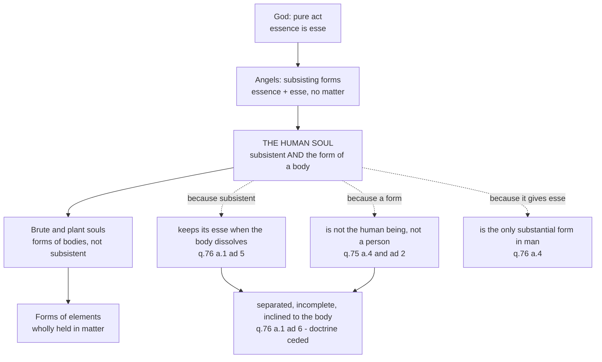

# The Thomistic Synthesis · Lesson 5.3: The human soul in the system

> ⏱ ~15 min · Module 5: Creatures and their return · Builds on: [2.1](02-01-act-and-potency-extended.md), [2.2](02-02-esse-and-essence-the-real-distinction.md), [5.1](05-01-creation-and-conservation.md) · Unlocks: [5.4](05-04-a-map-of-the-second-and-third-parts.md), [`creation-grace-last-things`](../../creation-grace-last-things/syllabus.md), [`christology`](../../christology/syllabus.md)

## Why this matters

Every rung of the [ladder of beings](../reference.md#the-ladder-of-beings) from [2.1](02-01-act-and-potency-extended.md) was clean: bodies carry all four compositions, angels are subsisting forms, God is pure act. The human soul belongs to two rungs at once — a form of matter, like the form of an oak, and a thing with an act of existing of its own, like an angel. Aquinas refuses to relieve the strain in either direction, and what the dogmatic courses later ask for depends on his holding both: that a human being is *one* substance and not a spirit driving a machine, and that something of him can be judged before his body is raised. This lesson is about the placement and what it buys. Whether the arguments for an immaterial intellect succeed is [`philosophy-of-mind`](../../philosophy-of-mind/syllabus.md) 5.1-5.2's question; the separated soul, immortality and the resurrection as *doctrine* are [`creation-grace-last-things`](../../creation-grace-last-things/syllabus.md)'s.

## The idea

Two claims, held together.

**The soul is the form of the body.** Not a mover inside it, not a pilot in a ship: the principle by which this matter is one living thing of this kind, so that the same subject digests, sees and understands (ST I q.76 a.1 — argued as a theory of mind in [`philosophy-of-mind`](../../philosophy-of-mind/syllabus.md) 5.1, cited, not redone).

**The soul is subsistent.** It has one operation, understanding, that no bodily organ performs; and what operates on its own has existence on its own (q.75 a.2, likewise cited). So it is not a form that perishes when its matter is spoiled.

Together the two claims look like a contradiction, and the objections to q.76 a.1 press exactly there. A form is *that by which* something else exists; how can it be the sort of thing that exists? Aquinas's answer is the hinge of the lesson, given in a reply rather than a body: there are not two acts of existing here, one for the soul and one for the body. The soul has its own *esse* and **shares it** — the existence of the whole composite is the soul's existence, handed over to matter (a.1 ad 5). That is [one *esse* in the composite](../reference.md#one-esse-in-the-composite), and it keeps the position from being dualism with Aristotelian manners. The dualist has two things that must be related; Aquinas has one act of existing with two principles, one of which can hold that act alone.

Three consequences follow, and they are the rest of the lesson. The soul, being a part, **is not the human being** (q.75 a.4). Since it gives *esse* to the matter, there is **no other substantial form** in a human being (q.76 a.4). And a soul persisting alone persists as something **incomplete**, keeping "an aptitude and a natural inclination to be united to the body" (a.1 ad 6).

## Source

Aquinas, ST I q.75 a.4, "Whether the soul is man?", from the *respondeo* (English Dominican Province translation, public domain):

> It may also be understood in this sense, that this soul is this man; and this could be held if it were supposed that the operation of the sensitive soul were proper to it, apart from the body; because in that case all the operations which are attributed to man would belong to the soul only; and whatever performs the operations proper to a thing, is that thing; wherefore that which performs the operations of a man is man. But it has been shown above that sensation is not the operation of the soul only. Since, then, sensation is an operation of man, but not proper to him, it is clear that man is not a soul only, but something composed of soul and body.

Read what Aquinas concedes. He accepts the Platonist's criterion whole — *whatever performs the operations proper to a thing, is that thing* — and then denies the minor premise. The load is carried by one clause, "sensation is not the operation of the soul only" (shown at a.3). Sensing is an act of the composite, and sensing is something *I* do; so I am the composite. The article never denies that the soul is what is most principal in a man, and its first half refuses a related error: common matter, flesh and bones in general, belongs to the definition of *man*, though this flesh belongs only to Socrates.

## The argument

**Unicity of substantial form** (q.76 a.4, *respondeo*), in premises.

1. A substantial form makes a thing **be simply**; an accidental form only makes it be *such*, as heat makes a thing hot. **[Module 2's substance and accident, [2.1](02-01-act-and-potency-extended.md)]**
   *In words:* one kind of form puts a thing on the list of what exists; the other decorates something already on the list.
2. So a thing is generated simply when its substantial form arrives and corrupted simply when it departs; an accidental form's arrival is mere alteration. **[follows from 1]**
3. The intellectual soul is united to the body as its substantial form. **[an earlier article, q.76 a.1]**
4. Suppose some other substantial form were in the matter before the soul. Then what the soul arrives at is already an actual being. **[the supposition under test]**
5. Then the soul would not give being simply — it would make an existing thing *such* — so by 1 it would not be a substantial form, against 3; and a human being's coming to be would be alteration, not generation, which is false. **[reductio]**
6. Therefore there is no other substantial form in a human being besides the intellectual soul. It **virtually contains** the sensitive and nutritive souls, and "itself alone does whatever the imperfect forms do in other things." **[conclusion; the *sed contra* adds the principle that of one thing there is but one substantial being]**

*In words:* you are not a body with life added, nor a living thing with reason added. One form makes the matter be at all, and it is the rational soul, which does the lower forms' work rather than sitting on top of them — [unicity of substantial form](../reference.md#unicity-of-substantial-form).

**And the *esse* that form gives is shared.** The reply that rescues subsistence from incoherence:

> The soul communicates that existence in which it subsists to the corporeal matter, ... so that the existence of the whole composite is also the existence of the soul. ... For this reason the human soul retains its own existence after the dissolution of the body; whereas it is not so with other forms. (q.76 a.1 ad 5)

*In words:* the soul does not lend the body a second existence; it lets the body into its own. Survival is then not a new fact needing a new argument — it is the same *esse*, held by a principle that never needed matter to hold it. What this does **not** make the soul: its essence is still not its existence, so the [real distinction](../reference.md#real-distinction) of [2.2](02-02-esse-and-essence-the-real-distinction.md) holds in it, and its *esse* is created and conserved like anything else's ([5.1](05-01-creation-and-conservation.md)).

## Where the soul sits

The soul is less a rung than the seam: read down, the highest form of matter; read up, the lowest intellect — and not an angel of a lesser grade, since two subsisting forms cannot differ in number without differing in species (q.75 a.7).

## Worked examples

**Example 1 (clean): what happens when a man dies.** Run the two theses, and say only what they license.

One substantial form departs. So there is not first a human being and then his body without its soul: with the form gone, "we do not speak of an animal or a man unless equivocally, as we speak of a painted animal or a stone animal," and the same holds of the hand, the eye and the flesh (q.76 a.8). What lies there is matter under other forms, keeping accidents and dimensions but not the species. The soul keeps the *esse* it had communicated — and keeps it as a part, not as a man: it is not the human being (q.75 a.4), and not a person, since a person has the complete nature of a species (a.4 ad 2).

So the strictly Thomistic sentence is odd and worth saying slowly: at death the human being ceases, and the human being's soul does not. Whether the separated soul is nonetheless *you* is the live corruptionist-survivalist dispute of [`metaphysics` 6.5](../../metaphysics/lessons/06-05-what-a-person-is.md), cited and not re-argued here.

**Example 2 (strained): the corpse that looks like the same body.** The best objection to unicity split the schools within a decade of Aquinas's death. A body does not obviously stop being *this body* when its owner dies; we bury the body we knew. The older Franciscan and Augustinian position kept that appearance by positing a **form of corporeity** beneath the soul: the matter is already a body by one form, and the soul then makes that body alive and rational. Plurality of forms explains continuity across death cheaply, and eases a Christological question the schools felt keenly — whether the body in the tomb was numerically the same body ([`christology`](../../christology/syllabus.md)'s, not ours).

Aquinas pays the bill instead. He grants that the corpse is not the same body except equivocally, and explains what continuity there is by matter and its accidents rather than by an underlying substantial form — which is why q.76 a.4 ad 4 takes trouble to say that the forms of the elements remain in a mixed body "not actually but virtually". The cost is real: our ordinary talk about the dead becomes loose talk.

Which is why it became a **fight**. Around 1277 propositions touching Aquinas's positions were condemned at Paris by Tempier and prohibited at Oxford by the archbishop of Canterbury, Robert Kilwardby — himself a Dominican — whose Franciscan successor John Pecham renewed the attack; the events are [`church-history` 5.2](../../church-history/lessons/05-02-friars-and-universities.md) and [`ancient-medieval-philosophy` 7.1](../../ancient-medieval-philosophy/lessons/07-01-faith-reason-and-the-paris-crisis.md), the Paris list being revoked as far as it touched Aquinas in 1325. The Franciscan William de la Mare compiled a *Correctorium fratris Thomae* listing the articles needing correction, and his order required it to accompany the *Summa*; Dominicans answered with *Correctoria corruptorii*, "corrections of the corrupter". None of this makes unicity a doctrine.

## Watch out

- **You might think "subsistent" means the soul is a complete substance, so Aquinas is a dualist with extra vocabulary.** The replies deny that: the soul is a particular substance but not a hypostasis, lacking "the complete nature of its species," as a hand does (q.75 a.4 ad 2). And a dualist's soul would need no "natural inclination" back to a body (q.76 a.1 ad 6).
- **You might think the Church's teaching that the soul is the form of the body makes unicity of substantial form a dogma too.** Two different claims. That the rational soul is of itself and essentially the form of the human body was fixed by a conciliar act (the Council of Vienne, 1311-12); the doctrine and its level are [`creation-grace-last-things`](../../creation-grace-last-things/syllabus.md)'s, on the ladder of [`fundamental-theology` 4.4](../../fundamental-theology/lessons/04-04-the-ladder-of-doctrinal-authority.md). That there is *no other* substantial form is a [school thesis](../reference.md#school-thesis) Catholics denied before and after Vienne, and whether the council's wording implies it is itself disputed. Promoting it because Aquinas held it is the course's signature error — and so is demoting the doctrine because he did.
- **You might think the one-*esse* thesis makes the soul its own existence.** It makes it the *holder* of an existence it also gives away. Essence and *esse* remain really distinct in it ([2.2](02-02-esse-and-essence-the-real-distinction.md)), which is why the soul is created, conserved, and in principle annihilable by the withdrawal of that act ([5.1](05-01-creation-and-conservation.md)).

## One-liner

> The rational soul is the seam of the system: a form low enough to make this flesh be a man at all, and high enough to hold, alone, the one act of existing it lends him.

## Problems

**P1 (🟢) *(Exegetical.)* Close reading.** The two replies of ST I q.75 a.4 (English Dominican Province). Objection 1 had quoted 2 Corinthians 4:16 on the "inward man"; objection 2 argued that the soul, being a particular substance, must be a person.

> **Reply to Objection 1.** According to the Philosopher, a thing seems to be chiefly what is principle in it; thus what the governor of a state does, the state is said to do. In this way sometimes what is principle in man is said to be man; sometimes, indeed, the intellectual part which, in accordance with truth, is called the "inward" man.
>
> **Reply to Objection 2.** Not every particular substance is a hypostasis or a person, but that which has the complete nature of its species. Hence a hand, or a foot, is not called a hypostasis, or a person; nor, likewise, is the soul alone so called, since it is a part of the human species.

(a) Which words let Aquinas keep St Paul's phrase true without granting that the soul is the man? Name the interpretive practice, and say why this move belongs in a reply rather than in the *respondeo*. (b) In the second reply, which clause decides that the soul is not a person, and what work is the hand doing? (c) A reader concludes that Aquinas therefore denies the soul is a substance at all. Answer from the words. **150 words or fewer in total.**

**P2 (🟡) *(Exegetical (a) · Exegetical (b).)* Reconstruct, then assign the level.** (a) Put the *respondeo* of ST I q.76 a.4 into numbered premises and a conclusion, marking each premise as coming from **Module 2's metaphysics**, from an **earlier article** of Part I, or from **authority**. (b) For each claim, say whether it is a doctrine of the Church or a school thesis, name the act or text that fixes it, and cite the course that owns the level. **Two sentences each; do not overstate in either direction.**

1. The rational soul is of itself and essentially the form of the human body.
2. In a human being there is no substantial form besides the intellectual soul.
3. The separated soul is not a person.

**P3 (🔴, optional) *(Exegetical.)* Diagnose.** An invented classroom remark, written for this problem:

> "Once you notice that Aquinas makes understanding an operation no organ performs, and lets the soul go on existing after the body rots, the 'form of the body' talk is just packaging. He is a substance dualist who kept Aristotle's vocabulary because he had to teach in a Paris faculty."

(a) Name the two things the remark gets right and the single inference that is the error, citing the article or reply that blocks it. (b) Name the premise Aquinas would have to accept for the remark to be true, say whose position that is, and give the text where he denies it. **150 words or fewer in total.**

Solutions

**P1** *(Exegetical — strict.)*

**Must hit, strict:**
- (a) "A thing seems to be chiefly what is principle in it" together with "sometimes what is principle in man is said to be man". The governor-and-state simile makes this a way of naming a whole from its principal part, not an identity. So "inward man" is true as a manner of speaking and false as a claim that the soul is the man. The practice is [reverent interpretation](../reference.md#reverent-interpretation) ([1.2](01-02-reading-a-whole-question.md)): the authority's words are kept and a sense is supplied in which they are true. It belongs in a reply because the *respondeo* states one distinction (soul as part versus the composite) and each reply applies that distinction to one objection — the *distinguo* of [1.2](01-02-reading-a-whole-question.md).
- (b) The deciding clause is "but that which has the complete nature of its species", with "since it is a part of the human species" applying it. Personhood needs completeness of nature, not mere particularity. The hand is a counterexample *within* the objector's own terms: an uncontroversial particular substance that nobody calls a person, because it is a part.
- (c) It does not. Objection 2's premise that the soul is a substance is not what the reply denies; the reply concedes *particular substance* and denies only *hypostasis or person*. Subsistence is affirmed at q.75 a.2 and required by the whole article. What is denied is completeness.

**Wrong turns:** reading ad 1 as Aquinas conceding "the soul is the man" in some sense that competes with the *respondeo* — the concession is about naming, not about being; reading ad 2 as reducing the soul to an accident or a mere arrangement, which contradicts q.75 a.2 and would make survival unintelligible; answering (c) with the corruptionist claim that the separated soul is "nothing much", which is a live dispute ([`metaphysics` 6.5](../../metaphysics/lessons/06-05-what-a-person-is.md)) and not what these words say.

**Model answer:** (a) "A thing seems to be chiefly what is principle in it," with the governor and the state: the whole is named from its principal part, so Paul's "inward man" is a way of speaking, not an identification. That is reverent interpretation, and it sits in a reply because replies apply the *respondeo*'s one distinction — part versus composite — to each objection in turn. (b) "That which has the complete nature of its species" decides it; the hand is a particular substance that is a part, hence no person, and the soul is likewise "a part of the human species". (c) No: the reply grants particular substance and denies only hypostasis. It denies completeness, not substantiality; q.75 a.2 has already made the soul subsistent.

---

**P2** *(Exegetical throughout — strict. Overstating or understating a level is the error.)*

**Must hit, strict (a):** the premises in this order, each marked.
- P1. A substantial form makes a thing be *simply*; an accidental form makes it be *such* (heat makes a thing hot, not to be). **[Module 2: substance and accident, [2.1](02-01-act-and-potency-extended.md)]**
- P2. Hence generation and corruption *simply* track the arrival and removal of a substantial form; an accidental form's arrival is only alteration. **[follows from P1, stated in the article]**
- P3. The intellectual soul is the substantial form of the body. **[earlier article: q.76 a.1]**
- P4. Suppose a prior substantial form made the matter an actual being before the soul arrived. **[supposition for reductio]**
- P5. Then the soul would not give being simply, hence would not be a substantial form (against P3), and a man's coming to be would be alteration, not generation — "all of which is clearly false". **[reductio]**
- C. There is no other substantial form in man besides the intellectual soul, which virtually contains the sensitive and nutritive souls and all lower forms.
- The authority mark belongs on the *sed contra*'s principle ("of one thing there is but one substantial being") and, in ad 4, on Aristotle (*De Gener.* i, 10) for the elements remaining virtually. Credit is for marking, not for listing.

**Must hit, strict (b):**
1. **Doctrine, not a school thesis.** The act is the Council of Vienne (1311-12), an ecumenical council, teaching that the rational soul is of itself and essentially the form of the human body; the level and the assent owed are [`creation-grace-last-things`](../../creation-grace-last-things/syllabus.md)'s, on the ladder of [`fundamental-theology` 4.4](../../fundamental-theology/lessons/04-04-the-ladder-of-doctrinal-authority.md). It is not a Thomist opinion merely because Aquinas argued for it.
2. **School thesis, freely disputed.** No magisterial act settles unicity; Franciscan and Augustinian masters denied it in Aquinas's own century and Scotists after them, and whether Vienne's wording implies it is itself a disputed reading. Prohibitions and *correctoria* on either side are not definitions.
3. **School thesis, and a live dispute** — it follows from q.75 a.4 ad 2 *for Aquinas*, but corruptionism and survivalism are both held by Catholic philosophers ([`metaphysics` 6.5](../../metaphysics/lessons/06-05-what-a-person-is.md)); the doctrinal claims about the separated soul are [`creation-grace-last-things`](../../creation-grace-last-things/syllabus.md)'s and do not decide it.

**Wrong turns:** promoting 2 to doctrine because Vienne taught 1, which is the collapse the course grades hardest; demoting 1 to "the Thomist view of the soul" because it is stated in scholastic vocabulary — the opposite error, equally strict; citing Aquinas's canonization, *Aeterni Patris* or the Church's recommendation of him as fixing any of the three (that recommendation is [6.5](06-05-what-the-church-has-said-about-thomism.md)'s subject and does not make school theses binding); in (a), listing premises without marking their sources.

---

**P3** *(Exegetical — strict.)*

**Must hit, strict:**
- (a) Right: that understanding is an operation of no bodily organ (q.75 a.2), and that the soul goes on existing when the body dissolves (q.76 a.1 ad 5). The error is the inference from *can exist apart* to *is a complete substance, and is the man*. Blocked twice: q.75 a.4, "man is not a soul only, but something composed of soul and body", and ad 2, where the soul is denied to be a hypostasis or person because it lacks the complete nature of its species. The one-*esse* reply itself is the deepest block: what survives is the very existence the soul communicated to the matter, which is a form's way of surviving, not a second substance's — and it survives with "an aptitude and a natural inclination to be united to the body" (ad 6), an inclination a dualist's soul would not have.
- (b) He would have to accept that sensation is an operation of the soul alone. That is Plato's premise, and q.75 a.4 names it: "Plato, through supposing that sensation was proper to the soul, could maintain man to be a soul making use of the body." Aquinas denies it, resting on q.75 a.3.
- Credit for noting the diagnosis runs the other way too: the remark's cure is not to deny subsistence, which q.75 a.2 asserts.

**Wrong turns:** conceding the remark because the soul survives, which is the very datum the article accommodates without dualism; over-correcting into "the soul is only the organization of the body", which denies q.75 a.2 and is not Aquinas's view; using the corruptionist thesis as if it settled the charge — it is a live dispute among Thomists ([`metaphysics` 6.5](../../metaphysics/lessons/06-05-what-a-person-is.md)), not a text.

**Model answer:** (a) Right on both counts: understanding uses no organ (q.75 a.2) and the soul keeps its existence after death (q.76 a.1 ad 5). The error is sliding from "can exist apart" to "is a complete substance, and is the man" — q.75 a.4 says man is not a soul only, and ad 2 refuses the soul the name of person because it lacks the complete nature of its species. What survives is the one existence the soul communicated to the body, retained with a natural inclination back to it (ad 6). (b) He would have to grant that sensation belongs to the soul alone — Plato's premise, named in the same article as what lets one call man "a soul making use of the body", and denied there on the strength of a.3.

## Flashback

**From Lesson [5.1](05-01-creation-and-conservation.md) (Creation and conservation):** *(Exegetical.)* An angel, on Aquinas's account, is a subsisting form with no matter, so nothing in it can corrupt: no matter able to take another form, and no contrary able to destroy it (ST I q.50 a.5). Does it follow that an angel, once created, needs no keeping in being? (a) ST I q.104 a.1 distinguishes two ways in which one thing preserves another. State both, and say which of the two an incorruptible creature can do without and which it cannot. (b) The same article's reply to objection 1 puts an incorruptible creature's potentiality to not-being somewhere other than in its own form or matter. Where, and what would such a creature's ceasing to be therefore require of God (q.104 a.3 ad 3)? **Two sentences per part.**

Solution

**Must hit, strict (a):** preserving is either indirect and accidental, by removing what would corrupt a thing — Aquinas's case is a man who preserves a child by keeping him from falling into the fire — or *per se* and direct, where what is preserved depends on the preserver in such a way that it cannot exist without it. An incorruptible creature can do without the first, and Aquinas concedes as much in the article: in that way God preserves some things but not all, since some have nothing that could corrupt them, and the reply to objection 3 disposes of this very argument by confining it to preservation from corruption. It cannot do without the second, which holds of every creature without exception — God alone is being by his essence, while every creature has being by participation, and so stands to him as air to the sun rather than as a house to its builder ([5.1](05-01-creation-and-conservation.md)).

**Must hit, strict (b):** in God. The reply to objection 1 places the potentiality to not-being of spiritual creatures and heavenly bodies rather in God, who can withdraw his influence, than in their form or matter. So the ceasing would require no act of God at all: q.104 a.3 ad 3 says that annihilating would not imply an action on God's part but a mere cessation of his action — which is what one continued giving of existence (a.1 ad 4) looks like when it stops.

**Wrong turns:** taking incorruptibility for independence and promoting the angel to a being necessary in God's own way, when essence and *esse* are still really distinct in it ([2.2](02-02-esse-and-essence-the-real-distinction.md)), which is precisely why it must be conserved; answering (b) that God would destroy it, which makes annihilation a positive act and quietly restores the picture of creation and its reverse as changes; denying that any creature is naturally incorruptible, when Aquinas grants it and answers anyway.

**Model answer:** (a) One thing preserves another either indirectly, by removing the cause of its corruption, as a man keeps a child from the fire, or directly, when what is preserved cannot exist at all without the preserver. An angel needs no preservation of the first kind, which Aquinas grants; it needs the second, since its essence is not its existence and it holds being by participation, as air holds light from the sun. (b) In God: the potentiality to not-being of a spiritual creature lies in his power to withdraw his influence, not in its own form or matter. Its ceasing would therefore be no act of God but the mere cessation of the one action by which he gives existence.

## Connections

- **Backward:** the soul is the awkward rung of the [ladder of beings](../reference.md#the-ladder-of-beings) built in [2.1](02-01-act-and-potency-extended.md), and it is the [real distinction](../reference.md#real-distinction) of [2.2](02-02-esse-and-essence-the-real-distinction.md) that keeps its subsistence from turning it into a little god. Its *esse* is created and held in being exactly like anything else's ([5.1](05-01-creation-and-conservation.md)), and its knowledge starts from the senses because it is the form of *this* body ([4.1](04-01-how-a-human-intellect-knows.md)).
- **Forward:** [5.4](05-04-a-map-of-the-second-and-third-parts.md) needs this creature — a rational animal that is the principle of its own acts — to explain why the *Summa* turns to human action next. [`creation-grace-last-things`](../../creation-grace-last-things/syllabus.md) takes the separated soul, immortality and the resurrection as doctrine, with the levels; [`christology`](../../christology/syllabus.md) inherits both theses, since the unity of Christ's *esse* and the status of his body in the tomb are argued in this vocabulary.
- **Sideways:** the same articles as a live theory of mind, against dualism and functionalism, are [`philosophy-of-mind`](../../philosophy-of-mind/syllabus.md) 5.1-5.2; what a person is, and whether the separated soul is you, are [`metaphysics` 6.5](../../metaphysics/lessons/06-05-what-a-person-is.md) and [6.6](../../metaphysics/lessons/06-06-personal-identity-over-time.md). The institutional fight over unicity belongs to [`church-history` 5.2](../../church-history/lessons/05-02-friars-and-universities.md) and [`ancient-medieval-philosophy` 7.1](../../ancient-medieval-philosophy/lessons/07-01-faith-reason-and-the-paris-crisis.md).
