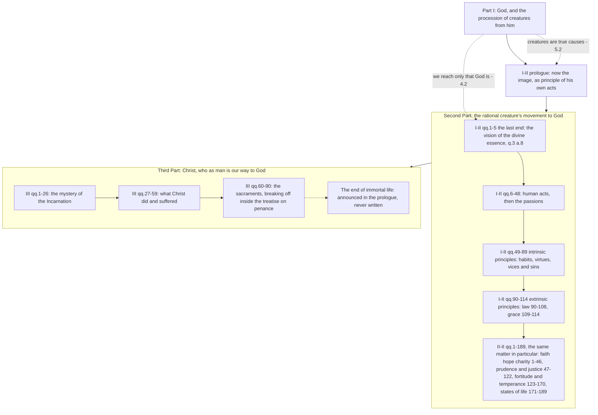

# The Thomistic Synthesis · Lesson 5.4: The return: a map of the Second and Third Parts

> ⏱ ~15 min · Module 5: Creatures and their return · Builds on: [1.1](01-01-the-plan-of-the-summa.md), [4.2](04-02-knowing-god-from-creatures-the-three-ways.md), [5.2](05-02-providence-and-secondary-causes.md) · Unlocks: [6.1](06-01-the-commentators.md), [`moral-theology`](../../moral-theology/syllabus.md), [`christology`](../../christology/syllabus.md)

## Why this matters

You have spent four modules inside Part I, and more than half the *Summa* is still ahead of you. This course will not teach it. The moral part belongs to [`moral-theology`](../../moral-theology/syllabus.md), grace and the last things to [`creation-grace-last-things`](../../creation-grace-last-things/syllabus.md), Christ to [`christology`](../../christology/syllabus.md), the sacraments to [`sacraments-and-liturgy`](../../sacraments-and-liturgy/syllabus.md). **This lesson is a map and nothing else.** A map gives you two things a table of contents does not: where a citation lands, and which Part I result it is standing on. Cite this lesson for placement; never cite it for doctrine.

## The idea

Part I ended with God's government of creatures ([5.2](05-02-providence-and-secondary-causes.md)). Then comes a sentence that changes what the book is about without changing its subject.

The move is a shift of role, not of topic. Part I treated God as **exemplar** — the original — and treated creatures as what proceeds from his power. What is left is the **image**: the creature that does not merely come from God but reproduces him, and reproduces him precisely by being a source of its own acts. John Damascene supplies the content of "image": an intelligent being with free will and command of what it does.

So the Second Part is not ethics bolted onto theology. It is Part I's own subject taken under the second of the three descriptions in the prologue to I q.2, God as the end towards which the rational creature moves ([1.1](01-01-the-plan-of-the-summa.md)). And the reason the creature can *move* at all is [5.2](05-02-providence-and-secondary-causes.md)'s: creatures are true causes, and God's causality does not displace theirs. Take that away and the Second Part has nothing left to discuss.

## Source

The prologue to the *Prima Secundae*, English Dominican Province translation:

> Since, as Damascene states (De Fide Orth. ii, 12), man is said to be made in God's image, in so far as the image implies "an intelligent being endowed with free-will and self-movement": now that we have treated of the exemplar, i.e. God, and of those things which came forth from the power of God in accordance with His will; it remains for us to treat of His image, i.e. man, inasmuch as he too is the principle of his actions, as having free-will and control of his actions.

Three expressions carry the whole plan. *Exemplar* names what Part I did. *Image* names the new object. And [**principle of his actions**](../reference.md#man-as-the-principle-of-his-own-acts) names the aspect under which the image is studied — not the human being's nature, which was Part I's business at qq.75-89 ([5.3](05-03-the-human-soul-in-the-system.md)), but the human being as a source of acts. Everything in the next two parts is an act, a principle of acts, or the end that acts are for.

## The argument

[The Second Part](../reference.md#the-plan-of-the-second-part) unfolds from that one phrase by repeated division, and Aquinas announces each division in a prologue of its own, so the structure is his and not a later editor's.

1. **The end comes first, because the end is the rule of whatever is ordained to it.** So I-II opens with the last end in general and then with happiness, qq.1-5.
   *In words:* you cannot say whether an act is any good until you know what it is for.
2. **The last end is the vision of the divine essence** (q.3 a.8). An intellect that knows of a cause only *that* it is, and not *what* it is, still has a desire left over, so nothing short of seeing God's essence is perfect happiness.
   *In words:* [4.2](04-02-knowing-god-from-creatures-the-three-ways.md) proved a limit on what natural reason reaches about God; here that same limit turns into [the goal of the moral life](../reference.md#the-last-end-as-the-vision-of-god). Whether and how the end is actually reached is grace and glory, ceded to [`creation-grace-last-things`](../../creation-grace-last-things/syllabus.md).
3. **Then the acts by which it is gained or lost** (qq.6-21), and then the acts we share with animals, the passions (qq.22-48).
4. **Then the principles of those acts, the intrinsic ones first:** habits in general (qq.49-54), then in particular — good habits, the virtues (55-70), and bad ones, vices and sins (71-89).
5. **Then the principles that come from outside.** God moves us to good in two ways: he instructs by law (qq.90-108) and assists by grace (109-114).
   *In words:* law and grace are not two topics that happened to land together. They are the two halves of one division, which is why the treatise on law sits in a book about human acts at all. Natural law as an ethical theory is [`ethics` 4.4](../../ethics/lessons/04-04-natural-law-aquinas.md)'s; the same doctrine in the light of revelation is [`moral-theology`](../../moral-theology/syllabus.md)'s; the grace questions are [`creation-grace-last-things`](../../creation-grace-last-things/syllabus.md)'s.
6. **Then the whole of it again, in particular.** The II-II prologue's reason, paraphrased: moral talk in universals is less useful, because actions are singular things. So each virtue is treated together with its corresponding gift, its opposite vices and its precepts — faith, hope and charity (qq.1-46), prudence and justice (47-122), fortitude and temperance (123-170) — and then the states of life (171-189).
7. **And then the way.** [The Third Part](../reference.md#the-plan-of-the-third-part) opens by saying that Christ showed us in his own Person the way of truth, and that the consideration of the Saviour follows "in order to complete the work of theology" after the last end and the virtues and vices. Its three announced divisions: the Saviour himself, the sacraments by which we attain salvation, and the end of immortal life reached by rising again.
   *In words:* Part III is not a new subject either. It is the *means* to the end fixed at step 2, and the prologue says as much by placing itself after steps 1-6 and calling itself the completion rather than an addition.

## The map

## Worked examples

**Example 1, the machinery on a clean case: why grace sits at the end of I-II.** Someone hands you *ST* I-II q.109 a.4, "Whether man without grace and by his own natural powers can fulfil the commandments of the Law?" Run the map. You are in the last block of the *Prima Secundae*, the extrinsic principles of human acts, whose two halves are law and grace. Three things follow from the placement alone. First, grace is being treated *here* as a principle of human action, which is why q.109's articles march through knowing truth, willing good, loving God, keeping the commandments and meriting, rather than through the nature of habitual grace — that comes next, at q.110. Second, grace stands opposite law in a division, so this article is asking about the commandments precisely because the eighteen questions before it were about law. Third, it comes at the *end*, after the last end of q.3 a.8 and the virtues of qq.55-70 have already been laid out; Aquinas is going back over ground he has covered to say which of it is beyond our unaided powers. All of that is placement, and placement is what you take from here. What the article teaches is [`creation-grace-last-things`](../../creation-grace-last-things/syllabus.md)'s.

**Example 2, the hard case where the plan strains: is Christ an afterthought?** The standard objection is blunt. A reader can go through I-II and II-II end to end — some three hundred questions, a complete account of happiness, action, passion, virtue, vice, law and the states of life — and meet Christ almost nowhere. Whatever the prologues say, a book that gives you a finished moral theology before it mentions the Saviour has made the Saviour an appendix; and the same complaint is where [*exitus* and *reditus*](../reference.md#exitus-and-reditus) strains hardest ([1.1](01-01-the-plan-of-the-summa.md)), since on a strict circle Christ should *be* the return, not follow it.

The reply is that the [order of teaching is not an order of importance](../reference.md#ordo-disciplinae). Aquinas is arranging a course for beginners by the order the subject matter has, and in that order you must know what an act is before you can say what grace does to acts, and what the last end is before you can say who the way to it is. The Part III prologue's own word for what it adds is *completion of the work of theology*, not supplement. And the moral part is not Christ-free by accident: it ends in the treatise on grace, which is where the Saviour's work enters the analysis of action, and its last end at q.3 a.8 is one nature cannot reach.

What the reply concedes is real. The order does let a reader take the Second Part as a free-standing philosophical ethics, and readers have. What it denies is that Aquinas invited them to. Both halves are live among Catholic theologians, and this lesson settles neither.

## Watch out

- **This is a map, not a syllabus of Aquinas's morals.** Question numbers tell you where a text sits and what it presupposes. They tell you nothing about what the text argues, and citing this lesson for the content of I-II or Part III is a misuse of it.
- **You might think "image of God" here is the doctrine of the image.** That is I q.93's, and it is richer. In this prologue the phrase does exactly one job: it licenses treating the human being as a source of acts, by way of Damascene's free will and self-command.
- **The order of the *Summa* carries no authority of its own.** It is not a doctrine, not the Church's recommendation of Aquinas as master, and not even a school thesis about a doctrinal question — it is one theologian's arrangement of one book. Levels come from [`fundamental-theology` 4.4](../../fundamental-theology/lessons/04-04-the-ladder-of-doctrinal-authority.md), and this sits nowhere on that ladder. What the Church has in fact said about teaching *with* Aquinas is [6.5](06-05-what-the-church-has-said-about-thomism.md)'s.
- **II-II is not only a catalogue of virtues.** Its last nineteen questions are about states of life, which is why the part runs to 189 questions and not to seven.
- **Part III has no ending.** The text breaks off at q.90, inside the treatise on penance, and the third division its own prologue announced was never written. What is printed after it is the Supplement, compiled from the early *Sentences* commentary by another hand ([1.1](01-01-the-plan-of-the-summa.md)).

## One-liner

> Part I treated the exemplar; the Second Part treats the image precisely as the principle of its own acts; the Third treats the way — and that sequence is an order of teaching, not an order of importance.

## Problems

**P1 (🟢) *(Exegetical.)*** For each reference, give the part, the block of the map it falls in, and which course in this library owns its content. One line each. Then answer, in one further line, how many of the four this course teaches.

(a) *ST* I-II q.100 a.1 · (b) *ST* I-II q.109 a.4 · (c) *ST* II-II q.161 a.1 · (d) *ST* III q.65 a.1

**P2 (🟡) *(Exegetical.)*** The prologue to the Third Part, English Dominican Province translation:

> Forasmuch as our Saviour the Lord Jesus Christ, in order to "save His people from their sins" (Mt. 1:21), as the angel announced, showed unto us in His own Person the way of truth, whereby we may attain to the bliss of eternal life by rising again, it is necessary, in order to complete the work of theology, that after considering the last end of human life, and the virtues and vices, there should follow the consideration of the Saviour of all, and of the benefits bestowed by Him on the human race.

(a) Which words tell you what has already been done, and which phrase states Part III's relation to it? (b) The prologue goes on to announce three divisions, listed in this lesson. Name the third and say what became of it. Two sentences per part.

**P3 (🔴) *(Exegetical (a) · Evaluative (b).)*** (a) An invented remark, overheard after a seminary class:

> "The Church has made St Thomas her own teacher, so the order of the *Summa* is the Church's order — morals first, then Christ. A seminary that begins with Christology is departing from what the Church requires."

Name the level error and say what would have to exist for the claim to hold. Two sentences. (b) Take the objection of Example 2 in its strongest form and say whether the *ordo disciplinae* reply answers it. 150 words or fewer. Any verdict.

Solutions

**P1** *(Exegetical.)*

**Must hit, strict:** the part and the block for each, with the right owner, and the closing count.

**Wrong turns:** putting q.109 in the treatise on law because both are about commandments — q.109 a.4 asks about the commandments *from inside* the treatise on grace, which is the point of Example 1; calling II-II q.161 part of the treatise on justice, since justice ends at q.122; answering that this course teaches (a) because [`ethics` 4.4](../../ethics/lessons/04-04-natural-law-aquinas.md) is in the library — that lesson is another course's.

**Model answer:**
(a) *Prima Secundae*, the treatise on law, qq.90-108, which is the first half of the extrinsic principles of human acts. Owned by [`moral-theology`](../../moral-theology/syllabus.md), with natural law as an ethical theory in [`ethics` 4.4](../../ethics/lessons/04-04-natural-law-aquinas.md).
(b) *Prima Secundae*, the treatise on grace, qq.109-114, the second half of the same division and the end of I-II. Ceded to [`creation-grace-last-things`](../../creation-grace-last-things/syllabus.md).
(c) *Secunda Secundae*, the block on fortitude and temperance, qq.123-170. Owned by [`moral-theology`](../../moral-theology/syllabus.md), which reads selected II-II questions.
(d) Third Part, the sacraments, qq.60-90. Owned by [`sacraments-and-liturgy`](../../sacraments-and-liturgy/syllabus.md).
None of the four. This course places them and stops.

---

**P2** *(Exegetical.)*

**Must hit, strict (a):** the back-reference is "after considering the last end of human life, and the virtues and vices", which names I-II and II-II in the order the map gives them. The phrase fixing the relation is "in order to complete the work of theology": Part III is presented as the completion of the whole enterprise, not as a further topic appended to it — which is the sentence the *ordo disciplinae* reply of P3 leans on.

**Must hit, strict (b):** the third division is the end of immortal life, attained by rising again. It was never written: the *Summa* breaks off at III q.90, in the treatise on penance, and the Supplement printed in its place was compiled after Aquinas's death from his early commentary on the *Sentences* ([1.1](01-01-the-plan-of-the-summa.md)), so it is not his execution of this announcement.

**Wrong turns:** naming the sacraments as the missing division — they are the second, and qq.60-90 are genuinely his; treating the Supplement as the third division carried out; reading "it is necessary" as the phrase that fixes the relation, when it states only that the consideration must follow, not what it contributes.

**Model answer:** (a) "After considering the last end of human life, and the virtues and vices" points back to the Second Part, and "in order to complete the work of theology" states that what follows completes the whole rather than appending to it. (b) The third is the end of immortal life reached by rising again; Aquinas never wrote it, since the work stops at III q.90 and the Supplement that fills the gap is posthumous material lifted from his *Sentences* commentary.

---

**P3** *(Exegetical (a) · Evaluative (b).)*

**Must hit, strict (a):** two collapses, and the reader should catch at least the second. The remark treats the Church's recommendation of Aquinas — a matter of the ordinary magisterium and of Church law ([6.5](06-05-what-the-church-has-said-about-thomism.md)) — as though it settled a doctrinal question; and it stretches that recommendation from Aquinas's doctrine and principles to the *arrangement of one of his books*, which is not a doctrine, not the recommendation, and not even a school thesis, and so appears nowhere on the ladder of [`fundamental-theology` 4.4](../../fundamental-theology/lessons/04-04-the-ladder-of-doctrinal-authority.md). For the claim to hold there would have to be an act of the Magisterium or a canon prescribing the *sequence of treatises*; what the relevant norms actually do is name a master for theology, not a running order.

**Wrong turns:** over-correcting into "the Church says nothing about Aquinas", which is the same error run backwards and is what [6.5](06-05-what-the-church-has-said-about-thomism.md) exists to prevent; or defending the remark on the ground that the order is pedagogically excellent, which is a judgment about teaching and not about authority.

**Model answer (a):** The remark collapses a disciplinary recommendation of a master into a binding doctrinal norm, and then applies it to something that is not doctrine at all — Aquinas's arrangement of his own book, which sits on no rung of the ladder in [`fundamental-theology` 4.4](../../fundamental-theology/lessons/04-04-the-ladder-of-doctrinal-authority.md). It would hold only if some magisterial act or canon prescribed the order of treatises in a curriculum, whereas the texts in question name St Thomas as teacher and leave the sequence open.

**Must hit, any verdict (b):** state the objection from the *contents* of the Second Part, not merely from its position — that a complete account of happiness, act, virtue and law is delivered before Christ is discussed. State the reply precisely: the *ordo disciplinae* is the order the subject matter has for a learner, not a ranking. Test it against at least one piece of textual evidence, for instance the Part III prologue's "complete the work of theology", the placement of grace at the close of I-II, or the fact that q.3 a.8 sets an end nature cannot reach. And say what the reply concedes, or why it concedes nothing.

**Model answer (b), one of several acceptable:** The objection is strongest when put as a fact about content rather than sequence: II-II hands the reader a finished account of the virtues, gifts and precepts, and a reader could take it whole without Christ. The *ordo disciplinae* reply meets that, but only partly. It is right that a course of teaching must define an act before it can say what grace does to acts, and right that Part III calls itself the completion of theology rather than an addition. It is also right that I-II ends in grace, so the moral part does not in fact close without the Saviour's work. What the reply cannot deny is that the arrangement makes the misreading available, and that later readers took it. Verdict: the reply succeeds as an account of Aquinas's intention and fails as a defence of the arrangement's effects, which is a smaller claim than either party usually makes.

## Flashback

**From Lesson [5.2](05-02-providence-and-secondary-causes.md) (Providence and secondary causes):** *(Exegetical.)* Biologists call the mutations natural selection works on random in a precise sense: they are not produced with an eye to what the organism needs. A popular writer concludes that the history of life is one long accident, and that an accident is exactly what nobody planned. (a) ST I q.22 a.2 ad 1 distinguishes universal from particular causes. Using it, say how one and the same event can be rightly called fortuitous and rightly called foreseen, and what it is about a universal cause that carries the distinction. (b) A second writer offers a rescue: the mutations must be steered after all, and only look random. Using ST I q.19 a.8, say why Aquinas neither needs that rescue nor can accept it. **Two sentences per part.**

Solution

**Must hit, strict (a):** a thing escapes the order of a particular cause only through the intervention of some other particular cause — Aquinas's example is wood kept from burning by water — and every particular cause is contained under the universal cause, outside whose range no effect can fall. So an effect that falls outside what a proximate cause was aiming at is genuinely called casual or fortuitous with respect to that cause, while the same effect is foreseen with respect to the universal cause; the two descriptions are not rivals, because each is relative to causes of a different order. What carries the distinction is that a universal cause has no outside: it is not a particular cause with a longer reach but the cause of there being any causes at all ([5.1](05-01-creation-and-conservation.md)), so no quantity of particular explanation encroaches on it.

**Must hit, strict (b):** he does not need it, because (a) has already made an event's being fortuitous compatible with its being provided for. He cannot accept it, because q.19 a.8 grounds the contingency of effects in the efficacy of the divine will rather than in the character of the intermediate causes: an efficacious cause's effect follows it not only in what is done but in the manner of the doing, and the divine will is perfectly efficacious, so things are done in the way God wills them to be done. Effects therefore happen contingently not because their proximate causes are weak but because God prepared contingent causes for them, willing that they should happen contingently — and a secretly steered mutation would be an effect whose manner failed to match what was willed, which is the one thing a perfectly efficacious will cannot suffer. Credit for noticing that the rescue shares the first writer's premise, that chance and plan compete for the same ground.

**Wrong turns:** reading "contingent" as uncaused, or as a gap in the order of causes — a contingent cause is one that *can fail*, and it is fully a cause; answering (a) that the event merely looks fortuitous while being secretly necessary, which is (b)'s error moved one step earlier; resting the answer on God's foreknowledge as a spectator's seeing, when q.19 a.8's ground is the efficacy of his will; treating the exegesis as a verdict for or against the biology, which it is not.

**Model answer:** (a) Nothing escapes a particular cause except through another particular cause, and all particular causes fall under the universal one, outside which no effect can fall; so the same event is fortuitous relative to its proximate causes and foreseen relative to the universal cause. The distinction holds because a universal cause has no outside — it is not a wider particular cause but the cause of there being any causes at all. (b) He does not need the rescue, since chance and providence were never competing for one job, and he cannot take it, because q.19 a.8 traces contingency to the efficacy of the divine will and not to slack in the intermediate causes. God prepared contingent causes because he willed those effects to come about contingently, so making them secretly necessary would spoil the very manner he willed.

## Connections

- **Backward:** [1.1](01-01-the-plan-of-the-summa.md) gave the three parts from the prologue to I q.2 and left the *exitus* and *reditus* question open; this lesson is the same question from the far end of the book. [4.2](04-02-knowing-god-from-creatures-the-three-ways.md) fixed what natural reason reaches about God, which I-II q.3 a.8 converts into the last end. [5.2](05-02-providence-and-secondary-causes.md) established that creatures are true causes, without which the Second Part could not begin.
- **Forward:** [`moral-theology`](../../moral-theology/syllabus.md) takes I-II and selected II-II questions and cedes the plan of the *Summa* as a whole to this lesson; [`creation-grace-last-things`](../../creation-grace-last-things/syllabus.md) takes qq.109-114 and the last things; [`christology`](../../christology/syllabus.md) and [`sacraments-and-liturgy`](../../sacraments-and-liturgy/syllabus.md) take Part III. Inside this course, [6.1](06-01-the-commentators.md) begins on what later readers did with the whole work, and [6.5](06-05-what-the-church-has-said-about-thomism.md) settles what weight the Church's recommendation of Aquinas actually carries.
- **Sideways:** natural law appears here only as a block of question numbers; as a philosophical theory with its own argument and its own critics it is [`ethics` 4.4](../../ethics/lessons/04-04-natural-law-aquinas.md). And the general question this lesson turns on — whether the order in which a body of knowledge is taught commits you to a claim about what matters most in it — is the one every syllabus in this library has to answer.
