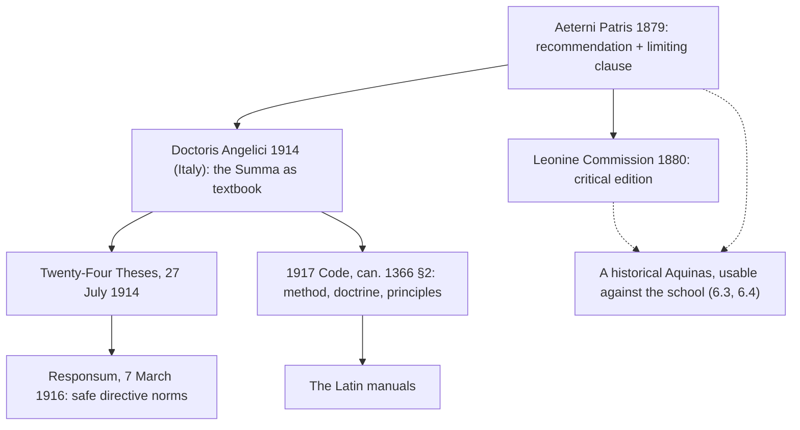

# The Thomistic Synthesis · Lesson 6.2: Leo XIII and the Thomist revival

> ⏱ ~15 min · Module 6: The Thomist tradition and its authority · Builds on: [6.1 The commentators](06-01-the-commentators.md), [2.2 Esse and essence: the real distinction](02-02-esse-and-essence-the-real-distinction.md) · Unlocks: [6.3 Strict observance and existential Thomism](06-03-strict-observance-and-existential-thomism.md), [6.5 What the Church has said about Thomism, and at what level](06-05-what-the-church-has-said-about-thomism.md)

## Why this matters

Almost everything in Modules 2-5 reached the twentieth century through a channel built between 1879 and 1917: an encyclical, a critical edition, a set of theses, a seminary syllabus and a canon of Church law. That channel is why a parish priest ordained in 1950 could define [*esse*](../reference.md#the-act-of-existing) and one ordained in 1850 probably could not. It is also the source of the most common mistake about Thomism — that the Church made it binding. The encyclical that started the revival contains, in the same paragraph as its command, a clause exempting part of what it recommends. Reading that clause is the whole discipline of this module.

## The idea

Leo XIII (pope 1878-1903) inherited a Church that had lost its state and gained a council's worth of new authority ([`church-history` 8.3](../../church-history/lessons/08-03-leo-xiii-and-the-modernist-crisis.md)). He was not the first to want scholasticism back — Italian and German revivals had been running for decades, at Naples, at Rome, and in the Jesuit journal *Civiltà Cattolica*, and Leo's brother Giuseppe Pecci was part of that world. Leo's contribution was to turn a movement into a programme with instruments.

The programme has three parts, and people routinely remember two of them.

1. **An argument.** Philosophy is not decoration on faith. It prepares the road to faith, it is the tool theology needs to be a science at all, and it is the faith's defence.
2. **A person.** Not "scholasticism" in general but Thomas Aquinas, and Aquinas drawn from his own works rather than from later summaries.
3. **A limit.** What the scholastic doctors said too subtly, too carelessly, or in conflict with what has since been discovered is *not* what Leo is proposing for imitation.

Then the irony that shapes the module. The same pope who wanted Aquinas taught also ordered a critical edition of him. A critical edition produces a *historical* author — one with a chronology, a development, and doctrines that can be shown to be his rather than his school's. Within fifty years that instrument was being used against the school the programme had built up. Leo's revival carried its own solvent.

Meanwhile the pressure ran the other way. What began in 1879 as an exhortation with an exemption clause became by 1914 a prescription: the *Summa* as the classroom textbook, twenty-four theses approved as Aquinas's principles, and then a Roman congregation asked whether those theses had to be *imposed*, answering that they were safe directive norms. The programme tightened, overshot, and was pulled back — all before the 1917 Code fixed its final legal form.

## Source

*Aeterni Patris* (4 August 1879), n. 31, in the public-domain translation:

> We exhort you, venerable brethren, in all earnestness to restore the golden wisdom of St. Thomas, and to spread it far and wide... The wisdom of St. Thomas, We say; for if anything is taken up with too great subtlety by the Scholastic doctors, or too carelessly stated — if there be anything that ill agrees with the discoveries of a later age, or, in a word, improbable in whatever way — it does not enter Our mind to propose that for imitation to Our age.

Four things decide the reading.

**"The wisdom of St. Thomas, We say."** This is a correction of Leo's own sentence. The object of the exhortation is narrowed from the scholastic inheritance at large to one author. Everything after the semicolon explains the narrowing.

**"by the Scholastic doctors."** The excluded material is attributed to the school, in the plural. Leo does not say Aquinas erred. He says the recommendation is not a blanket endorsement of the scholastics, and he leaves it open whether any given defect is Aquinas's.

**Three criteria, one of them empirical.** Too subtle; too carelessly stated; ill-agreeing with the discoveries of a later age. The third concedes that later science can force a scholastic conclusion to be dropped — a concession, not a grudging aside, in a document written eleven years after Vatican I.

**"It does not enter Our mind to propose that for imitation."** The verb governs *proposing*, not condemning. Leo is describing the scope of his recommendation. That is why the clause does not make every disputed scholastic opinion false; it makes it unrecommended. And one thing is conspicuously not said: who judges that something is "improbable in whatever way." The twentieth century fought over exactly that gap.

## The argument

*Aeterni Patris*, reconstructed:

1. **The public crisis has a philosophical cause** (n. 2): false conclusions born in schools of philosophy pass into the state and are adopted by the masses. *In words:* bad metaphysics eventually becomes bad politics.
2. **Philosophy prepares the way to faith** (n. 4): rightly used it "tends to smooth and fortify the road to true faith," which is why the ancients called it a steppingstone to Christianity. *In words:* reason gets a person to the door of revelation; it does not open it.
3. **Reason demonstrates the preambles** (n. 5): that God is, that God is wise and just and cannot deceive, and that the Church's spread and sanctity are themselves a motive of belief. *In words:* the credibility of revelation is itself arguable. Here Leo is restating Vatican I, not proposing a school opinion.
4. **Theology cannot be a science without philosophy** (n. 6): it must bind the many parts of revealed doctrine into one body, each in its place and from its own principles. *In words:* you need a metaphysics before you can order dogmas — the office [1.3](01-03-sacred-doctrine-one-science-about-god.md) calls [philosophy as handmaiden](../reference.md#philosophy-as-handmaiden).
5. **Philosophy is the defence of the faith** (n. 7): the hedge and fence of the vine, turning the adversary's own weapons.
6. **Among the scholastics Aquinas is chief** (nn. 17-18): he collected the Fathers' scattered doctrine, distinguished reason from faith while joining them, and on his wings reason can scarcely rise higher.
7. **Therefore: restore the golden wisdom of St Thomas** — with the limit of n. 31, and drawn "from his own fountains," not from streams said to flow from them (n. 31 again, a warning aimed at the commentators of [6.1](06-01-the-commentators.md)).

Mark the levels now, because the lesson's point is that they differ. Premise 3's content is a defined dogma — Vatican I's *Dei Filius* teaches the capacity of natural reason to know God with certainty, rung 1 on [`fundamental-theology` 4.4](../../fundamental-theology/lessons/04-04-the-ladder-of-doctrinal-authority.md)'s ladder. The recommendation itself (premise 7) is authentic ordinary magisterium, rung 3, and later Church law. The particular theses Aquinas argues — the [real distinction](../reference.md#real-distinction), say — remain rung 5, a [school thesis](../reference.md#school-thesis), exactly as before 1879.

## The programme and its instruments

The legal end-state is one sentence of the 1917 Code, can. 1366 §2 (Latin): *Philosophiae rationalis ac theologiae studia et alumnorum in his disciplinis institutionem professores omnino pertractent ad Angelici Doctoris rationem, doctrinam et principia, eaque sancte teneant.* The lesson's own translation: professors are to handle the studies of rational philosophy and theology, and the training of students in them, entirely according to the **method, doctrine and principles** of the Angelic Doctor, and hold to these reverently. Note what kind of norm that is: a law binding *teachers in seminaries*, about how to teach. It is discipline, not a definition of doctrine — and it is not nothing.

Out of it came the **manuals**: Latin textbooks of philosophy and dogma, organized by thesis, each followed by its proof, its adversaries, and its objections answered. What they do well is real: a student finishes with the whole field mapped, the vocabulary exact, and every position locatable. What they do badly is also real: a thesis stated for proof is a thesis already decided, the *Summa*'s question form disappears, and the author's development is invisible. A generation trained that way could state Aquinas's conclusions and had never watched him argue.

## Worked examples

**Example 1 (clean): what the critical edition could settle.** A critical edition does three things a nineteenth-century reprint could not: it fixes the wording from the manuscripts, separates authentic works from the many long printed under Aquinas's name, and dates them, which makes a *chronology* possible. The third is the one that mattered most. Once you can order the *Scriptum* on the Sentences, the *De Ente*, the *Summa contra Gentiles* and the *Summa Theologiae* in time, you can ask whether Aquinas changed his mind — a question a perennial-philosophy Thomism has no use for and a historical one lives on. That is Gilson's lever in [6.3](06-03-strict-observance-and-existential-thomism.md). The irony is in the edition's own pages: its *Summa* volumes print Cajetan's commentary beside the text, so Leo's instrument bound the commentator to Aquinas while equipping readers to prise them apart.

**Example 2 (where it strains): run the limiting clause on a real case.** At ST I q.118 a.2 ad 2 Aquinas holds that the soul is in the embryo "the nutritive soul from the beginning, then the sensitive, lastly the intellectual soul" — successive substantial forms, the rational soul arriving late. At q.118 a.1 ad 3 the active force in the semen works by a heat derived from the power of the heavenly bodies. Both rest on Aristotle's biology and astronomy. The clause of n. 31 seems built for this: here is something that "ill agrees with the discoveries of a later age," so it is not proposed for imitation, and a Thomist may drop it without leaving Thomism.

Now the strain. *How far does the drop propagate?* The embryology is not an isolated fact; it is an application of the doctrine that the soul is the substantial form of the body — and that is not a school thesis but conciliar teaching (Council of Vienne), owned by [`creation-grace-last-things`](../../creation-grace-last-things/syllabus.md). So one must separate the datable biology from the metaphysics it runs on, and the clause does not say how. *And who decides?* "Improbable in whatever way" names no judge. A strict-observance Thomist and a historically minded one will draw the line differently, and each can cite n. 31. This is the fault line that opens in [6.3](06-03-strict-observance-and-existential-thomism.md) and [6.4](06-04-transcendental-thomism-and-the-ressourcement-quarrel.md).

## Watch out

- **"Aeterni Patris made Thomism binding" — no, and the opposite is also wrong.** The encyclical exhorts and scopes itself. The instrument that binds is later, and it is *law* about teaching (can. 1366 §2), which is discipline. But do not overcorrect into "just a preference": four popes taught it, and it was written into the Code.
- **The Twenty-Four Theses were approved, not imposed.** The Sacred Congregation of Studies (27 July 1914, Card. Lorenzelli) replied that the theses "plainly contain the principles and major pronouncements" of St Thomas. The Congregation of Seminaries and Universities was then asked the sharper question — whether they must be imposed on Catholic schools to be held — and answered on **7 March 1916**, confirmed by Benedict XV, that they express Aquinas's genuine doctrine and are proposed *veluti tutae normae directivae*, as safe directive norms. That is neither a definition nor an imposition. (A small source-criticism bonus: the 1916 document cites the theses decree as of 29 July 1914, while the decree itself is dated 27 July.)
- **Check the address of *Doctoris Angelici*.** Pius X's motu proprio of 29 June 1914 is headed *pro Italia et insulis adiacentibus* — for Italy and the adjacent islands. It makes the *Summa* the textbook of lectures in degree-granting faculties under penalty of losing the right to grant degrees. Its reach beyond Italy comes through the 1917 Code, not through itself.
- **The Trent-altar story.** *Aeterni Patris* n. 22 repeats it as Aquinas's special glory. It is not a piece of the argument, and it is the subject of **P2** — handle it there before repeating it anywhere.

## One-liner

> Leo XIII put the recommendation and its exemption clause in the same paragraph; the next forty years enforced the recommendation and forgot the clause.

## Problems

**P1 (🟢) *(Exegetical.)*** The Leonine critical edition ordered in 1880 could fix wording from manuscripts, separate authentic works from spurious ones, and date the works. For each of the three claims below, say whether the edition is the kind of instrument that can settle it, and in one clause why.
(i) The *Supplement* to the *Summa Theologiae* was written by Aquinas himself.
(ii) Aquinas's account of *esse* in the *Summa Theologiae* differs from the one in his commentary on the Sentences.
(iii) Cajetan's proportionality reading of ST I q.13 a.5 is the correct reading of that article.
Two sentences or fewer per item.

**P2 (🟡) *(Exegetical.)*** *Aeterni Patris* n. 22, public-domain translation:

> But the chief and special glory of Thomas, one which he has shared with none of the Catholic Doctors, is that the Fathers of Trent made it part of the order of conclave to lay upon the altar, together with sacred Scripture and the decrees of the supreme Pontiffs, the "Summa" of Thomas Aquinas, whence to seek counsel, reason, and inspiration.

Pius XI repeats the story in *Studiorum Ducem* (29 June 1923, n. 11), but in a tightened form: there he says the Fathers of Trent resolved that two volumes *only*, Scripture and the *Summa*, should lie open on the altar during their deliberations.
(a) Name the differences between the two tellings, and say which single difference is evidence that the story is being *transmitted* rather than *documented*.
(b) Name the class of document that would settle whether it happened, and say what a careful lesson should do with the claim given that this course has not found it there.
Two sentences or fewer per part.

**P3 (🔴) *(Exegetical.)*** An invented paragraph from a seminary prospectus (no real institution is meant):

> Our house follows the mind of the Church without deviation. Since the Holy See defined the Twenty-Four Thomistic Theses in 1914, every student here holds them as he holds the Creed; a man who doubts the real distinction between essence and existence doubts a dogma. Nor is this a Roman peculiarity — by the Church's own law no Catholic may teach philosophy on any other principles, anywhere in the world.

Name each overstatement of authority, cite the act or text that fixes the real level, and give the correction in one clause each. Do not overcorrect. 150 words or fewer.

Solutions

**P1** *(Exegetical.)*

**Must hit, strict:** (i) **yes** — authenticity and authorship are precisely what a critical edition adjudicates, and the *Supplement* is known to have been compiled after Aquinas's death from his Sentences commentary ([1.1](01-01-the-plan-of-the-summa.md)). (ii) **partly, and this is the interesting one** — the edition cannot settle whether the accounts differ, because that is a reading; but by dating and by giving reliable texts it makes the comparison possible at all, which is the service Gilson's generation drew on. (iii) **no** — this is interpretation of a text whose wording was never in serious doubt; no manuscript evidence decides between proportionality and attribution.

**Wrong turns:** answering "yes" to (iii) because the edition is "authoritative" — authority over the *text* is not authority over its *sense*; answering a flat "no" to (ii) without noting that the edition supplies the chronology the question needs.

**Model answer:** (i) Yes: authorship is an editorial question, and the *Supplement* is a posthumous compilation. (ii) Not directly — whether the doctrines differ is a reading — but dating and reliable texts are what make the comparison askable, so the edition is a precondition. (iii) No: the dispute is over the sense of an undisputed text, which manuscripts cannot decide.

---

**P2** *(Exegetical.)*

**Must hit, strict (a):** the two tellings disagree on **what was on the altar** — Leo has three things (Scripture, the decrees of the popes, the *Summa*), Pius XI has two volumes *only* (Scripture and the *Summa*). Secondary differences: Leo makes it part of the "order of conclave," Pius XI a resolution of the Fathers about their deliberations. The *only* is the tell: an embellishment that sharpens the point (Aquinas alongside Scripture, nothing else) while dropping an item the earlier telling had. A detail that grows more pointed in retelling, across two papal documents forty-four years apart, is behaving like a tradition, not like a record.

**Must hit, strict (b):** the council's own documentation — the acts, decrees and diaries of Trent, above all the diaries of Massarelli, its secretary, as published in the critical edition of the *Concilium Tridentinum*. What to do with it: report it as a claim with its source and its status, say that it has not been documented in the council's records, and do not use it as evidence of anything; the point it is offered to prove (Aquinas's standing in the Church) is abundantly documented by things that *are* in the record, such as the papal acts listed in n. 21.

**Wrong turns:** treating a papal document's repetition of a historical story as settling the history — the level of a pope's teaching authority attaches to doctrine, not to his report of a sixteenth-century floor plan; going the other way and calling Leo's sentence an error or a falsehood, when the right description is undocumented; concluding that because this story is doubtful, the Church's estimate of Aquinas is doubtful.

**Model answer:** (a) Leo has three items on the altar and calls it part of the order of conclave; Pius XI has two volumes only and makes it a resolution about the Fathers' deliberations. The word *only* is the tell — the story gets sharper and simpler in retelling, which is how traditions behave and not how records do. (b) The council's acts and its secretary Massarelli's diaries, in the critical edition of the *Concilium Tridentinum*, would settle it. A lesson should cite the story with its source, state that it is not documented in the council's records, and rest nothing on it.

---

**P3** *(Exegetical.)*

**Must hit, strict:** four overstatements, each with the act that fixes the level.
1. **"defined."** The Sacred Congregation of Studies is not defining anything; its decree of 27 July 1914 replies that the theses contain Aquinas's principles and major pronouncements. Approving a list as a faithful summary of an author is not a definition.
2. **"as he holds the Creed."** The Congregation of Seminaries and Universities was asked on this very point whether the theses must be imposed on Catholic schools to be held, and answered on 7 March 1916 (confirmed by Benedict XV) that they are proposed as safe directive norms. That is at most a norm for teaching, nowhere near rung 1 of [`fundamental-theology` 4.4](../../fundamental-theology/lessons/04-04-the-ladder-of-doctrinal-authority.md)'s ladder.
3. **"doubts a dogma."** The real distinction is a [school thesis](../reference.md#school-thesis), rung 5, freely disputed among Catholics; Suárez and the Scotists deny it and are Catholic in good standing ([2.2](02-02-esse-and-essence-the-real-distinction.md)).
4. **"no Catholic... anywhere in the world."** The 1917 Code, can. 1366 §2, binds *professors* handling philosophy and theology studies and the training of students in them; it is a disciplinary norm about teaching in that setting, not a doctrinal definition binding every Catholic. *Doctoris Angelici*, the 1914 motu proprio behind it, was issued for Italy and the adjacent islands.

**Do not overcorrect:** the prospectus is wrong about the level, not about the fact that the Church recommends Aquinas. That recommendation is authentic ordinary magisterium — rung 3, religious submission — repeated by Leo XIII, Pius X and Pius XI and written into Church law. Answering "so none of this binds anyone" is the mirror-image error and is graded as strictly.

**Wrong turns:** calling can. 1366 §2 a doctrinal teaching because it is in the Code; saying the 1916 response "abolished" or "reversed" the theses — it confirmed that they express Aquinas's genuine doctrine and declined to impose them; treating the theses as a private opinion of some professors, when they were approved by a Roman congregation with papal mandate.

**Model answer:** *Defined* is wrong: the Congregation of Studies (27 July 1914) approved the theses as containing Aquinas's principles, which is not a definition. *As he holds the Creed* is wrong: asked on 7 March 1916 whether they must be imposed to be held, the Congregation of Seminaries proposed them as safe directive norms. *Doubts a dogma* is wrong: the real distinction is freely disputed among Catholics, as Suárez and the Scotists show. *No Catholic anywhere* is wrong: can. 1366 §2 is a disciplinary norm binding seminary professors' method, and *Doctoris Angelici* was issued for Italy. But the Church does recommend Aquinas, at rung 3 and in law.

## Flashback

**From Lesson [5.4](05-04-a-map-of-the-second-and-third-parts.md) (The return: a map of the Second and Third Parts):** *(Exegetical.)* Temperance is treated twice in the Second Part: among the virtues in general at I-II qq.55-70, and again in its own right in the last block of II-II, qq.141-170. (a) Give the reason the prologue to the *Secunda Secundae* offers for going back over the same matter in particular, and say which of the two treatments a reader looking for Aquinas on fasting should open. (b) That method does not treat a virtue on its own. Name the three other things it puts in the same tract with each virtue, and say what one of them implies for a reader who has been told that precepts are the business of the treatise on law at I-II qq.90-108. **Two sentences per part.**

Solution

**Must hit, strict (a):** the prologue's stated reason is that moral discourse in universals is less useful, because actions are singular things; so after the general treatment of virtues, vices and the rest, each must be gone over in particular. Fasting is in the second treatment — inside the temperance block of II-II, at q.147, between abstinence and gluttony — not in I-II's general treatise on the virtues. Credit for naming the block without the question number.

**Must hit, strict (b):** each virtue is treated in one tract together with its corresponding gift, its opposed vices, and its precepts. So the treatise on law is not the only place the *Summa* treats precepts: the precepts belonging to a particular virtue are treated with that virtue, which is why the temperance block closes at II-II q.170, "Of the Precepts of Temperance," and the block on fortitude at q.140 and the block on justice at q.122. The map shows why this is not a contradiction: I-II qq.90-108 takes law as an extrinsic principle of human acts *in general*, while II-II takes the precepts of a given virtue along with that virtue, in particular.

**Wrong turns:** giving as the reason for the second pass that II-II is more advanced or more practical, when the prologue's reason is about the singularity of actions; sending the reader to I-II because fasting is a matter of habit and habits are treated there; concluding from (b) that the treatise on law is redundant, or that q.170 supersedes it, when the general and the particular treatments are two halves of one plan; citing [5.4](05-04-a-map-of-the-second-and-third-parts.md) for what Aquinas teaches about fasting, which is [`moral-theology`](../../moral-theology/syllabus.md)'s — the map is for placement only.

**Model answer:** (a) Because moral talk in universals is less useful, actions being singular, so the general account has to be taken again in particular. Fasting belongs to the second treatment, in the temperance block of II-II (q.147), not to I-II's general treatise on the virtues. (b) Each virtue comes with its corresponding gift, its opposed vices and its precepts in the same tract. So precepts are not confined to I-II qq.90-108: that treatise handles law as an extrinsic principle of acts in general, while the precepts of a particular virtue are treated with it, which is why II-II's temperance block ends at q.170 on the precepts of temperance.

## Connections

- **Backward:** [6.1](06-01-the-commentators.md) supplied the "streams" Leo warns against in n. 31 when he tells teachers to draw Aquinas from his own fountains. The levels used throughout come from [`fundamental-theology` 4.4](../../fundamental-theology/lessons/04-04-the-ladder-of-doctrinal-authority.md); the real distinction as a school thesis is [2.2](02-02-esse-and-essence-the-real-distinction.md), and Thesis IV of the Twenty-Four is the analogy of attribution and proportionality of [4.4](04-04-analogy.md).
- **Forward:** [6.3](06-03-strict-observance-and-existential-thomism.md) and [6.4](06-04-transcendental-thomism-and-the-ressourcement-quarrel.md) are what happens when the historical Aquinas produced by Leo's own edition meets the manual Thomism produced by his own law. [6.5](06-05-what-the-church-has-said-about-thomism.md) takes the whole sequence of texts and assigns each its weight.
- **Sideways:** the political and ecclesial setting — the end of the Kulturkampf, *Rerum Novarum*, the modernist crisis and the anti-modernist oath of 1910 that stands directly behind *Doctoris Angelici* — is [`church-history` 8.3](../../church-history/lessons/08-03-leo-xiii-and-the-modernist-crisis.md). The modern sequel, *Fides et Ratio* (1998) on faith, reason and Aquinas, is [`fundamental-theology` 2.4](../../fundamental-theology/lessons/02-04-fides-et-ratio.md). The moral manuals that came out of the same machinery are [`moral-theology`](../../moral-theology/syllabus.md) 4.1.
