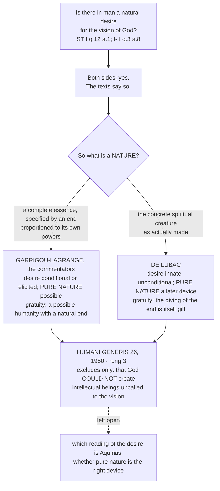

# The Thomistic Synthesis · Lesson 6.4: Transcendental Thomism and the ressourcement quarrel

> ⏱ ~15 min · Module 6: The Thomist tradition and its authority · Builds on: [6.3 Strict observance and existential Thomism](06-03-strict-observance-and-existential-thomism.md), [4.1 How a human intellect knows](04-01-how-a-human-intellect-knows.md) · Unlocks: [6.5 What the Church has said about Thomism, and at what level](06-05-what-the-church-has-said-about-thomism.md)

## Why this matters

By 1930 the Leonine revival had produced a school with a syllabus, a Latin, and a set of theses ([6.2](06-02-leo-xiii-and-the-thomist-revival.md)). Within twenty years two attacks opened from inside it, neither about a conclusion — both about where a Thomist is *allowed to start*. Between them they set the terms of Catholic theology after the Council, and one produced the only modern papal text this course has to level.

## The idea

Two quarrels, independent in origin, with one shape: each accuses the reigning Thomism of building a fortress on a foundation Aquinas never laid.

**The first is about knowing.** Kant's critique ([`modern-philosophy`](../../modern-philosophy/syllabus.md) 5.1) says metaphysics of the real is unreachable: whatever is given comes already shaped by the mind's own forms, and we never get behind the shaping. The school's answer was to refuse the question and refute Kant from outside. **Joseph Maréchal** (1878-1944), a Belgian Jesuit at Louvain, refused that refusal and asked Kant's own question — under what conditions is this act possible? — about the one act Kant had under-analysed, *judging*. That programme is **transcendental Thomism**: not Kant's idealism baptized, but Kant's *method* turned on the dynamism of the intellect.

**The second is about nature.** In 1946 **Henri de Lubac** (1896-1991), a French Jesuit at Lyon, argued in *Surnaturel: études historiques* that **pure nature** — a state in which human beings would have had a purely natural final end and no call to see God — is not Aquinas's concept but a device of Cajetan and the later commentators ([6.1](06-01-the-commentators.md)) for protecting the gratuity of grace, read back into a text that says the opposite. This was the *ressourcement*: back to the sources, over the heads of the school, letting them correct the system.

The two meet at one point: Maréchal's condition of judgement is the intellect's unrestricted reach toward being, and de Lubac's Aquinas is a spiritual creature whose desire terminates only in God. Both cash the same passages on [the natural desire to see God](../reference.md#the-natural-desire-to-see-god).

## The argument

### The transcendental move

Maréchal's *Le point de départ de la métaphysique* (five *cahiers*, 1922-1947; cahier V, on Thomism before the critical philosophy, 1926), paraphrased:

1. A judgement does more than assemble concepts; it **affirms**, referring its content to what is. *In words:* to judge is to say "it is so", not merely "these ideas fit".
2. That affirmation is possible only if the intellect is already in motion toward being without restriction — a dynamism, not one more concept among those being joined. *In words:* you can only call something real against a horizon of the real with no edge.
3. The dynamism is therefore never an object the mind inspects, but the condition under which objects appear at all. *In words:* Kant's question, asked about affirming rather than about the forms of sensibility.
4. A finite intellect whose tendency is unrestricted is ordered to infinite being, and an ordering has a real term. *In words:* an unlimited reach implies something unlimited to reach.
5. So the transcendental method, run to the end, ends in the affirmation of God: metaphysics survives the critique on the critique's own ground.

Aquinas supplies the anchor: being is what the intellect first conceives, its proper object (ST I q.5 a.2). **Karl Rahner**'s *Geist in Welt* (1939) named the dynamism the *Vorgriff*, the pre-apprehension of being implicit in every grasp of a finite thing, grounding it in Aquinas on the turn to the phantasm (ST I q.84 a.7) — the article that makes our knowing start in the senses ([4.1](04-01-how-a-human-intellect-knows.md)). **Bernard Lonergan** moved the ground again to cognitional theory (*Verbum*, *Theological Studies* 1946-49; *Insight*, 1957), where the invariant pattern of experience, understanding and judgement does the *Vorgriff*'s work.

**The objection**, pressed hardest by Gilson and Garrigou-Lagrange ([6.3](06-03-strict-observance-and-existential-thomism.md)): starting from the subject concedes the modern turn. Aquinas starts from what is and reaches God by [demonstration *quia*](../reference.md#demonstration-quia-and-propter-quid) from effects ([3.1](03-01-demonstrating-that-god-exists.md)). If God is instead whatever every act of knowing implicitly reaches, he becomes the **horizon of consciousness**, always co-affirmed and never concluded to, and the Five Ways become decorative.

**The reply:** the *Vorgriff* is no experience of God and yields no concept of him; it is a condition reached by reflecting on an act, and step 4 is an inference to a real term, not an intuition of one. Whether that holds is still disputed.

### The ressourcement argument

De Lubac, *Surnaturel* (1946), paraphrased:

1. **Historical.** The texts cited for pure nature do not, in context, state it; the concept enters as a systematic device with Cajetan and hardens after him.
2. **Textual.** Aquinas's natural desire is for the vision of the divine essence itself, not some lesser knowledge of God proportioned to our powers (ST I q.12 a.1; I-II q.3 a.8). The *respondeo* of q.12 a.1 is blunt: "if the intellect of the rational creature could not reach so far as to the first cause of things, the natural desire would remain void."
3. A natural desire cannot be void.
4. So the spiritual creature as actually created is ordered to an end beyond its own powers (ST I q.12 a.4) — and that ordering is itself God's gift.
5. So gratuity is secured without a hypothetical alternative humanity: what is gratuitous is the giving of the end, as creation itself is gratuitous.

Garrigou-Lagrange's counter-charge, in "La nouvelle théologie où va-t-elle?" (*Angelicum* 23, 1946, 126-145): if nature *as such* demands the vision, grace is owed to nature and the supernatural stops being supernatural; pure nature is the device that keeps "gratuitous" meaning something. Behind it lies a second charge: the historical method relativizes the perennial theses to their century.

### The crux - what nature means

The premise one side must deny is not about grace at all. It is the word **nature**.

- **Garrigou-Lagrange** (with the commentators): a nature is a complete intelligible essence, specified by an end **proportioned to its own powers**. If human nature were intrinsically ordered to an end it cannot reach, either the end is not really supernatural or the nature is not really a nature. So pure nature is at least possible, and the desire in the texts must be conditional or elicited — a wish that arises once revelation shows the vision to be on offer.
- **De Lubac**: for Aquinas "nature" means the concrete spiritual creature as actually made, and a spirit is the kind of being defined by a capacity that outruns its powers. An essence whose desire terminates only in the vision is still an essence; what it is not is a claim on God.

So Garrigou-Lagrange must deny that the desire is innate, and de Lubac that a nature is fixed by an end proportioned to its powers. Everything else follows from that one word.

### What Humani Generis settled, and what it did not

Pius XII's *Humani Generis* (1950), cited by section:

**It settled this.** Section 26 lists, among opinions destroying the gratuity of the supernatural order, the claim that God *cannot* create intellectual beings without calling them to [the beatific vision](../reference.md#the-last-end-as-the-vision-of-god). Excluded: any account on which the call to the vision is necessary to God. Section 20 supplies the rule about its own weight: what encyclicals expound is taught with the ordinary teaching authority and of itself demands consent, and where a pope deliberately judges a matter until then disputed, it ceases to be open among theologians. Nothing in it is a definition; Example 1 below levels the act on the ladder of [`fundamental-theology` 4.4](../../fundamental-theology/lessons/04-04-the-ladder-of-doctrinal-authority.md).

**It did not settle this.** It names no theologian. It does not use the term "pure nature" or canonize the commentators' device. It does not deny that Aquinas's natural desire is for the vision, nor choose between the conditional-elicited and the innate readings — the actual crux above. De Lubac held his position untouched, restating it in *Le mystère du surnaturel* and *Augustinisme et théologie moderne* (both 1965).

### After the Council

The Latin manuals lost their monopoly within a decade; three continuations matter. **Analytical Thomism**: Anscombe, Geach and Kenny read Aquinas with post-Wittgenstein tools from the 1950s on; John Haldane coined the label in the early 1990s. **The Lublin school**: Wojtyła and colleagues, as Edith Stein had tried earlier, joined Thomist metaphysics to phenomenology of the acting person ([`phenomenology-and-personalism`](../../phenomenology-and-personalism/syllabus.md) 4.4, 5.1). And a text-first **revival**: the Leonine critical edition, and readers such as Torrell, Wippel and Kerr — this course's secondary literature.

## Map of positions

The dashed edge is the point: the encyclical cuts across both branches without cutting either off.

## Worked examples

**Example 1 (clean: level a claim).** Take: *God could have created a human race never called to the vision.* Run the procedure from [`fundamental-theology` 4.4](../../fundamental-theology/lessons/04-04-the-ladder-of-doctrinal-authority.md). **Find the act:** *Humani Generis* 26, an encyclical deliberately judging a matter then in dispute. **Proposed as what?** Not as divinely revealed, and not by a definitive act; expounded, not defined — and where the mode is not manifest you **default down**. **Read off:** rung 3, religious submission of intellect and will; denying it is not heresy, and it is no longer a free question among theologians. Now the contrast claim: *pure nature is the right way to secure gratuity.* No act proposes it: rung 5, a [school thesis](../reference.md#school-thesis), on which a Catholic may take either side. The two are often stated in one breath; they are three rungs apart.

**Example 2 (hard: where the quarrels collide).** Suppose de Lubac is right that human nature as it is is already ordered to the vision, and Rahner that a reach toward unlimited being conditions every act of knowing. Does the analysis then *discover grace inside the structure of consciousness*? If so, gratuity is gone by a new route: what is universally available to reflection is hard to call a free gift.

Rahner's answer is a distinction. The *Vorgriff* is natural, a condition of finite knowing as such; the **supernatural existential** is God's free offer of self-communication, universally made and so shaping everyone's concrete situation, but owed to no one and no part of the essence. Nature keeps a meaning; no concrete human being is ever found in it.

Where it strains: no phenomenological mark separates the natural dynamism from the graced orientation, so a gratuity you cannot locate may be a gratuity in name — and the distinction is itself drawn to protect a doctrinal requirement — the move de Lubac accused Cajetan of.

## Watch out

- **You might think *Humani Generis* condemned de Lubac.** It names no one. What happened to him in 1950 — removal from teaching and editing, three books withdrawn from Jesuit houses — was **disciplinary**, and discipline has no rung on the doctrinal ladder. He was made a cardinal in 1983. Confusing the two scales is the mirror image of the level errors [6.5](06-05-what-the-church-has-said-about-thomism.md) drills.
- **You might think "transcendental Thomism" means Kantian idealism in a cassock.** It is the transcendental *method* — argue from an act to its conditions — applied to judgement, with the realist conclusion that method is meant to deliver. The interesting objection is not that Maréchal was a secret Kantian, but that a starting point chosen to answer Kant may not be neutral about where it ends.

## One-liner

> Maréchal moved Thomism's starting point from the object to the act of judging, de Lubac from a possible nature to the only one there is; the 1950 encyclical ruled out making God's call necessary and left the word "nature" exactly as disputed as it found it.

## Problems

**P1 (🟢) *(Exegetical.)*** Reconstruct the transcendental move from this lesson in **four or five numbered premises and a conclusion**. Beside each premise write one of three tags: **K** if the premise is Kant's question or method, **A** if it is a Thomist claim about the intellect that Aquinas himself supplies, **M** if it is Maréchal's own addition. Then, in one sentence, name the premise that the Gilson-style objection actually attacks.

**P2 (🟡) *(Exegetical.)*** Two remarks written for this problem. No real person said either.

> **(i) A homilist, at a university Mass.** "You do not need arguments for God. Every time you ask one more question, every time an answer leaves you restless, you are already touching him. God is not something you conclude to; he is the openness in you that nothing finite closes."
>
> **(ii) A reviewer, in a diocesan magazine.** "Once the Church admitted in 1950 that our nature by itself has nothing to do with the vision of God, the whole talk of a natural desire for God in Aquinas was finished. Strictly, nature wants only what nature can get."

For each: name the position it slides into, say which claim of this lesson it gets wrong, and name the distinction or text that corrects it. Two sentences per remark. 150 words or fewer in total.

**P3 (🔴, optional) *(Evaluative.)*** A Thomism that begins from the conditions of the knowing subject: still Thomism, or a different philosophy wearing the name? Argue it **only** for Maréchal's starting point — not for the century's schools generally. Use ST I q.5 a.2 (being as the proper object of the intellect) on one side and demonstration *quia* from effects ([3.1](03-01-demonstrating-that-god-exists.md)) on the other, and say what would have to be true of step 4 of the reconstruction for your verdict to hold. 150 words or fewer. Any verdict.

Solutions

**P1** *(Exegetical.)*

**Must hit, strict:** the five steps of the lesson's reconstruction, in order, with these tags — (1) a judgement affirms, it does not merely combine concepts: **A** (and partly M, since the emphasis on the act of affirming is Maréchal's; accept either if defended); (2) affirmation presupposes an unrestricted dynamism toward being: **M**; (3) the dynamism is a condition of objects, not an object: **K**; (4) an unrestricted tendency in a finite intellect is an ordering to infinite being, which has a real term: **M**; (5) conclusion, the method ends in the affirmation of God. Aquinas's supply is being as the intellect's first-conceived and proper object, ST I q.5 a.2 — **A** — which may be listed as a premise of its own. The objection attacks **step 4**: it is the step that moves from a feature of the subject to a real being, and Gilson's complaint is that it substitutes an analysis of the knower for a demonstration from effects.

**Wrong turns:** tagging step 3 **M** and step 2 **K** — the transcendental *question* is Kant's, the *answer* naming the dynamism is Maréchal's. Saying the objection attacks step 1 (both sides grant that judgements affirm). Saying it attacks step 5, which is the conclusion, not a premise.

**Model answer:** P1 (A/M) to judge is to affirm that something is, not merely to relate concepts. P2 (M) such affirmation is possible only against an unrestricted tendency of the intellect toward being. P3 (K) that tendency is not an object of the mind but a condition of any object appearing — Kant's own form of question. P4 (A) being is what the intellect first conceives and its proper object, ST I q.5 a.2. P5 (M) an unrestricted tendency in a finite intellect is an ordering to infinite being, and an ordering has a real term. ∴ C: the affirmation of God is a condition of any judgement whatever. The objection attacks P5, which is the lesson's step 4 renumbered because this answer lists Aquinas's supply as a premise of its own: it is where the argument crosses from the structure of the knower to a really existing God, and the Thomist route there is demonstration *quia* from effects.

---

**P2** *(Exegetical.)*

**Must hit, strict (i):** it makes God the **horizon of consciousness** — always already co-affirmed, never concluded to — which is the standing objection *to* transcendental Thomism, stated here as if it were the position. What it gets wrong: the *Vorgriff* is not an experience of God and yields no concept of him; it is a condition of knowing finite things, and step 4 is an inference, not an intuition. Correcting text: knowledge begins in the senses and God is reached *quia* from effects (ST I q.84 a.7; [3.1](03-01-demonstrating-that-god-exists.md), [4.1](04-01-how-a-human-intellect-knows.md)).

**Must hit, strict (ii):** it slides into a strict-observance reading and then **overstates the encyclical**. What it gets wrong: *Humani Generis* 26 excluded only the claim that God *cannot* create intellectual beings without calling them to the vision; it did not deny the natural desire, did not adjudicate its kind, and did not endorse "pure nature". The correcting text is ST I q.12 a.1 (the desire would remain void), which both sides of the quarrel accept and read differently.

**Wrong turns:** calling (i) simply "Rahner's view" — it is the caricature the objection describes, and Rahner's own distinctions are what it drops. Treating (ii) as merely too strongly worded: its error is a level error, attributing to a 1950 encyclical a judgment it declined to make.

**Model answer:** (i) This is God as the horizon of consciousness, the objection to transcendental Thomism rather than its claim. It drops the point that the pre-apprehension of being is a condition of knowing finite things, giving no concept of God, so the step to God is an inference; our knowing still begins in the senses (ST I q.84 a.7) and reaches God from effects. (ii) This overstates *Humani Generis*, which excluded only the claim that God could not create intellectual beings uncalled to the vision, and left the natural desire and the term "pure nature" alone. ST I q.12 a.1 states the desire that would otherwise remain void; the dispute is over its kind, not its presence.

---

**P3** *(Evaluative.)*

**Must hit, any verdict:** (1) state the starting point precisely — not "the subject" loosely, but the conditions of the act of judging; (2) use ST I q.5 a.2 as the pro-Thomist resource and say what it does and does not license (it makes being the intellect's proper object; it does not by itself make the intellect's dynamism a road to a really existing infinite); (3) name what step 4 must be — an inference from an ordering to a real term — and say what makes such an inference valid or invalid; (4) say what happens to demonstration *quia* on your verdict: is it replaced, duplicated, or grounded? A verdict that leaves the Five Ways with no work to do must say so out loud.

**Wrong turns:** deciding the question by calling Maréchal a Kantian (a label, not an argument); arguing about Rahner or Lonergan instead, which the problem excludes; asserting that a natural tendency cannot be void without noticing that this is the same premise the other quarrel turns on, and that it is disputed.

**Model answer, one of several:** Maréchal starts inside the act of judging, and ST I q.5 a.2 makes that congenial: being is what the intellect first conceives, so an analysis of judgement is an analysis of a reach toward being, not toward a mental construct. Whether it stays Thomism depends on step 4. If the unrestricted tendency only shows that no finite object terminates the intellect, the conclusion is a negative one and God must still be demonstrated from effects — in which case the method is a preface to the Five Ways and Thomism is intact. If step 4 is meant to establish the real infinite by itself, the demonstration *quia* has been replaced by an argument from the knower's structure, and the system's own account of how we reach God has been set aside. On the first reading it is Thomism; on the second it is a different philosophy keeping the name.

## Flashback

**From Lesson [6.2](06-02-leo-xiii-and-the-thomist-revival.md) (Leo XIII and the Thomist revival):** *(Exegetical.)* *Aeterni Patris* gives philosophy three distinct offices in the service of faith: it **prepares the road** to faith, the steppingstone the ancients spoke of; it is the **instrument without which theology is not a science**, binding the many parts of revealed doctrine into one body, each in its place and from its own principles; and it is the **defence** of the faith, turning the adversary's own weapons. Three pieces of work, invented for this problem:

> (i) A theologian shows that the Church's teaching on the Eucharist, on the union of natures in Christ and on the habits of grace all trade on one account of what a substance is, and sets the three out accordingly.
> (ii) A philosopher takes an influential argument that no metaphysics of the real is possible, and shows that on its own principles the argument fails.
> (iii) A missionary argues with an educated unbeliever that there is one first cause, wise and just, before he says anything about Christ.

(a) Name the office each performs, in one clause each. (b) Two of the three concern what reason can reach about God apart from revelation. Name them, and say in one sentence what distinguishes the office of the one from the office of the other.

Solution

**Must hit, strict (a):** (i) the **instrument of theology as a science** — the work is ordering revealed doctrines under common principles, which is what makes a set of doctrines one body rather than a list. (ii) the **defence** — an attack on the faith's rational ground is repelled with the attacker's own principles, the office's signature move. (iii) the **preparation of the road** — a preamble that reason can establish is established, bringing the hearer to the door of revelation without opening it.

**Must hit, strict (b):** (ii) and (iii). The offices are distinguished by the job, not the topic: (iii) **builds**, arguing positively to something about God that reason can hold before faith, and stopping there; (ii) only **clears**, showing that an objection to reason's reach defeats itself, which establishes nothing about God and leaves the road open without walking it. Credit for noting that what (iii) reaches — that God is, and is wise and just and cannot deceive — is in the encyclical's argument a restatement of Vatican I rather than a school opinion, so the office is not a Thomist thesis.

**Wrong turns:** calling (iii) the defence because the interlocutor is an unbeliever — the office is fixed by what the philosophy does, not by who is listening; calling (i) the defence because heresies stand behind the doctrines being ordered; treating "prepares the road" as though reason opened the door, when the office stops at the preambles and faith is still faith.

**Model answer:** (a) (i) the instrument of theology as a science: doctrines ordered under shared principles into one body. (ii) the defence: the adversary's own weapons turned against him. (iii) the preparation of the road: a preamble demonstrated, reason bringing a man as far as the door. (b) (ii) and (iii). (iii) is constructive and reaches a truth about God that reason can hold on its own, while (ii) is negative and only removes the claim that reason can reach such truths at all — clearing an obstacle is not the same act as arriving.

## Connections

- **Backward:** [6.1](06-01-the-commentators.md) supplied the Cajetan whose construction de Lubac attacks, and [6.3](06-03-strict-observance-and-existential-thomism.md) supplied both Garrigou-Lagrange and the Gilson who objects to Maréchal from the other side. [4.1](04-01-how-a-human-intellect-knows.md) is the account of knowing that the *Vorgriff* claims to be reading, and [3.1](03-01-demonstrating-that-god-exists.md) the demonstration *quia* it is accused of displacing.
- **Forward:** [6.5](06-05-what-the-church-has-said-about-thomism.md) adds *Humani Generis* to the sequence of texts and assigns levels across the whole of it. `creation-grace-last-things` owns everything this lesson deliberately stopped short of: gratuity, the supernatural order, and the natural desire as a question in the doctrine of grace rather than an episode in the history of a school.
- **Sideways:** the Kant being answered is [`modern-philosophy`](../../modern-philosophy/syllabus.md) 5.1; the Lublin school's other half is [`phenomenology-and-personalism`](../../phenomenology-and-personalism/syllabus.md) 4.4 and 5.1; the *ressourcement* as an event in the life of the Church, and the Council it fed, are [`church-history` 9.2](../../church-history/lessons/09-02-the-second-vatican-council.md).
