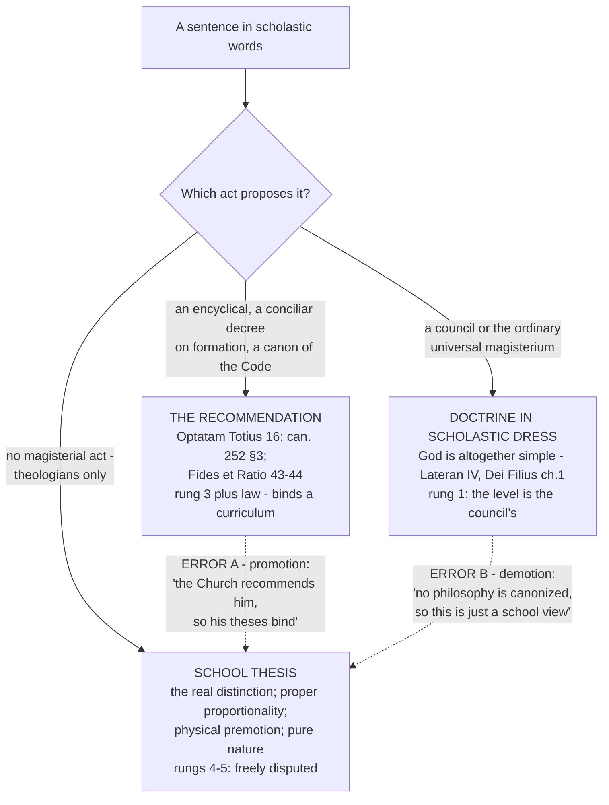

# The Thomistic Synthesis · Lesson 6.5: What the Church has said about Thomism, and at what level

> ⏱ ~15 min · Module 6: The Thomist tradition and its authority · Builds on: [6.2](06-02-leo-xiii-and-the-thomist-revival.md), [6.3](06-03-strict-observance-and-existential-thomism.md), [6.4](06-04-transcendental-thomism-and-the-ressourcement-quarrel.md) · Unlocks: [`trinity-and-god`](../../trinity-and-god/syllabus.md), [`christology`](../../christology/syllabus.md), [`creation-grace-last-things`](../../creation-grace-last-things/syllabus.md), [`sacraments-and-liturgy`](../../sacraments-and-liturgy/syllabus.md)

## Why this matters

Everything in this course has been said in one vocabulary: act and potency, *esse* and essence, participation, analogy. Some of what was said in that vocabulary is what the Church believes. Some of it is what one school of Catholic theologians thinks. And standing between them is a third thing that is neither — the Church's standing instruction that her clergy be trained with Aquinas as their master.

Three things, three levels. This course has been holding them apart all along; this lesson states it outright, because from here you go on to the dogmatic courses, where every page runs on Thomist terms and nobody stops to say which of the three you are looking at. The tool is the ladder of [`fundamental-theology`](../../fundamental-theology/syllabus.md) [4.4](../../fundamental-theology/lessons/04-04-the-ladder-of-doctrinal-authority.md), used unchanged.

## The idea

That ladder's cardinal rule is the one to import: **it grades acts, not topics.** Never ask how important Thomism is. Ask which act proposed this particular sentence, and what that act proposed it *as*. Do that here and the three things fall apart cleanly.

**1. A doctrine that happens to be stated in scholastic words.** That God is altogether simple; that the rational soul is the form of the body; that God can be known with certainty by the light of natural reason. These were taught by councils, and they keep the level of the act that taught them — rung 1 — even though the words came out of the schools. Scholastic vocabulary is the *dress*; the level belongs to the act underneath.

**2. The Church's recommendation of Aquinas.** A pope praising him and Church law requiring him are real acts with real force, but their object is a *master* and a *curriculum*, not a list of propositions. What they bind is what seminaries teach; what they express is the Magisterium's judgement that he is the model — authentic ordinary magisterium, rung 3, plus the ordinary obligation of a law.

**3. A [school thesis](../reference.md#school-thesis).** That [essence and *esse* are really distinct](../reference.md#real-distinction); that analogy must be read as [proper proportionality](../reference.md#analogy-of-proper-proportionality); that efficacious grace works by [physical premotion](../reference.md#the-dispute-over-efficacious-grace); that there is a state of pure nature. No magisterial act proposes these. They sit below the seam, at rungs 4–5, where theologians argue and nobody is bound.

And now the two errors, which are mirror images and are graded equally hard.

**Error A, promotion.** *Aquinas held it, and the Church recommends Aquinas, therefore it binds.* This runs the recommendation through a school thesis and comes out with a dogma. It fails at the first step: recommending a teacher is not proposing his conclusions.

**Error B, demotion.** *That is just the Thomists' Aristotelian apparatus, and the Church canonizes no philosophy, so I may take it or leave it.* This runs a genuine conciliar definition backwards through the same vocabulary and comes out with an opinion. It fails because the sentence's level was fixed by the council, not by the idiom it was phrased in.

Error B is the one a reader of this course is more likely to commit, having spent five modules learning to say "that is the Thomist analysis."

## Source

Pius XI, *Studiorum Ducem* (1923), section 30 — the sentence that contains both halves at once, quoting the Code then in force:

> "Let everyone therefore inviolably observe the prescription contained in the Code of Canon Law that 'teachers shall deal with the studies of mental philosophy and theology and the education of their pupils in such sciences according to the method, doctrine and principles of the Angelic Doctor and religiously adhere thereto' ... in questions, which in Catholic schools are matter of controversy between the most reputable authorities, let none be prevented from adhering to whatever opinion seems to him the more probable."

Read what the two halves do. The first is a **law about teaching**, quoted from the 1917 Code (can. 1366 §2) and addressed to professors: it prescribes a method, a doctrine and a set of principles as the frame of instruction. The second is an explicit **reservation of liberty** on precisely the questions Catholic schools dispute — the Dominican–Jesuit quarrels of [6.1](06-01-the-commentators.md), and everything at rung 5.

So the strongest endorsement of Thomism in the modern papal record carries its own limit in the same paragraph. An encyclical that wanted to make Thomist theses binding had the sentence in hand and wrote the opposite clause instead.

## The argument

The sequence, each act read for what it proposes and what it therefore binds.

| Act | What it does | What it binds |
|---|---|---|
| Canonization (1323), Doctor of the Church (Pius V, 1567) | Declares sanctity; names him a Doctor, with a general commendation of his teaching | Nothing propositional; no thesis of his is thereby taught |
| *Aeterni Patris* (Leo XIII, 1879) | Restores scholastic and above all Thomist philosophy in Catholic schools, **with a limiting clause on what is recommended** ([6.2](06-02-leo-xiii-and-the-thomist-revival.md)) | Rung 3, and a programme of study |
| *Doctoris Angelici* (Pius X, 1914); the Twenty-Four Theses of the Congregation of Studies, same year | Sets the capital theses as the foundation of instruction; the Theses' binding force was contested from the start and later softened ([6.2](06-02-leo-xiii-and-the-thomist-revival.md)) | Disputed at the time and since; do not report a settled level |
| 1917 Code, can. 1366 §2; *Studiorum Ducem* (1923) | Law: teach philosophy and theology by his method, doctrine and principles — with the liberty clause above | A curriculum |
| *Humani Generis* (Pius XII, 1950) | Warns against abandoning the scholastic vocabulary the Church has tested, and notes that a papal pronouncement on a disputed matter closes it for theologians ([6.4](06-04-transcendental-thomism-and-the-ressourcement-quarrel.md)) | Rung 3 |
| *Optatam Totius* 16 (Vatican II, 1965) | Directs that seminarians learn to penetrate the mysteries of salvation by speculation, **with St Thomas as teacher** (*S. Thoma magistro*) | A curriculum, by conciliar decree |
| *Lumen Ecclesiae* (Paul VI, 1974) | Apostolic letter for the seventh centenary of his death; restates the recommendation and its reasons | Rung 3 |
| 1983 Code, can. 252 §3 | Law: dogmatic theology classes are to teach the mysteries of salvation especially with St Thomas as teacher | A curriculum |
| *Fides et Ratio* (John Paul II, 1998), nn. 43–44 and 49 | Proposes Aquinas as a master of thought and a model of how to do theology; states that the Church has no philosophy of her own and canonizes none in preference to others ([`fundamental-theology`](../../fundamental-theology/syllabus.md) [2.4](../../fundamental-theology/lessons/02-04-fides-et-ratio.md)) | Rung 3 |

Notice what the right-hand column never contains: a proposition of Aquinas's that a Catholic must now hold. Seven centuries of increasingly warm recommendation, and its object stays the same — a master, a method, a syllabus.

**Holding *Fides et Ratio* together.** Its two statements look like a contradiction and are not. Section 49 denies that any *philosophical system* is the Church's own: pinning the faith to one would make it hostage to that system's fortunes, and the Magisterium's competence in philosophy is mainly the negative one of saying *not that*. Sections 43–44 then propose Aquinas not as such a system but as the man in whom the right *relation* between faith and reason is visible. That course's [2.4](../../fundamental-theology/lessons/02-04-fides-et-ratio.md) works the whole document; do not relitigate it here. The formula: **the Church prescribes a teacher, not a set of theses.**

## Map of the three levels

The dashed edges are the two errors, both pointing at the school-thesis box: one drags a thesis up into binding doctrine, the other drops a doctrine down into the schools. A well-run judgement moves along the solid arrows only.

## Worked examples

**Example 1 (mechanical — running the procedure on the recommendation itself).** *Claim: dogmatic theology in seminaries is to be taught with St Thomas as teacher.*

Find the act: *Optatam Totius* 16, a decree of an ecumenical council, and can. 252 §3 of the 1983 Code, a law. What does each propose it **as**? The council directs a formation programme; the canon prescribes what classes must do. Neither says "we define" or "to be held," and neither has a proposition of Aquinas's as its object.

Read off the consequence. A seminary that teaches dogmatics without him is not complying with the law, and a bishop may be asked why. A Catholic who thinks Cajetan misread analogy is not doing anything at all to this norm — the norm does not reach him, because **binding a curriculum and binding a proposition are different acts**. The conciliar source raises the norm's dignity; it does not change its object.

**Example 2 (the hard case — two sentences that look like flat contradiction).** In 1923 *Studiorum Ducem* says, of Aquinas, that "the Church has adopted his philosophy for her own" (section 11). In 1998 *Fides et Ratio* says the Church has no philosophy of her own. Same claim, opposite answers, seventy-five years apart. What do you do?

First, levels: both are encyclical statements at rung 3, so neither outranks the other by its act. Second, read each in its own document for what it is doing. Pius XI's sentence is a claim about **adoption in use** — the Church thinks in these terms — and the same encyclical, thirty sections later, refuses to bind the disputed theses of that very philosophy. John Paul II's sentence answers a different question: whether any system is **canonized as the faith's own**, such that the faith would stand or fall with it. Deny that, and the earlier sentence survives as it was meant.

Third, the later document teaches on the same subject. Where genuine tension remains, a reader owes religious submission to both and a report of the difficulty, not a choice of favourites. What is *not* available is the reading Error A wants — "the Church has adopted his philosophy" taken as making the philosophy binding, which the same encyclical's own liberty clause forbids.

## Watch out

- **You might think a stronger act makes a broader object.** A conciliar decree outranks an encyclical, so *Optatam Totius* 16 outranks *Aeterni Patris* — in dignity of the act. The object does not grow with the dignity: it is still a curriculum. Always ask *what* was proposed before asking how strongly.
- **You might think "no philosophy of her own" demotes scholastic doctrine.** It denies that a system is canonized. Divine simplicity was defined by Lateran IV and Vatican I and keeps rung 1 whether or not anyone likes the vocabulary — [simplicity at three levels](../reference.md#simplicity-at-three-levels), from [3.4](03-04-divine-simplicity-and-the-attributes.md).
- **You might think a disciplinary norm is a doctrine.** Can. 252 §3 is law: it can be dispensed, amended or repealed, which no dogma can. Treating it as doctrine overstates; treating it as a suggestion understates.
- **You might think the question "is Thomism binding?" is well formed.** It is not. Some sentences a Thomist says are dogma, most are not, and the Church's warmth toward the man settles neither. Only a particular sentence is answerable.
- **You might think the Twenty-Four Theses settle the matter.** Their force was contested from 1914 onward and their status afterwards clarified in a weaker direction ([6.2](06-02-leo-xiii-and-the-thomist-revival.md)). Report the dispute; do not report a level.
- **A level is not a verdict on truth.** "Rung 5" means no act binds you, not that the thesis is weak. The real distinction may be true and well argued and still bind nobody.

## One-liner

> The Church has given you a teacher and a syllabus, not a list of propositions — so ask which act proposed the sentence in front of you, and never let the vocabulary set the level.

## Problems

**P1 (🟢) *(Exegetical.)*** For each claim, name the level on [`fundamental-theology`](../../fundamental-theology/syllabus.md) [4.4](../../fundamental-theology/lessons/04-04-the-ladder-of-doctrinal-authority.md)'s ladder, name the act or source that fixes it, and say in one clause what a Catholic who denied it would be doing. **One sentence each; do not overstate in either direction.**

(a) The Church has no philosophy of her own and canonizes none in preference to others.
(b) Analogy of the divine names must be read as analogy of proper proportionality.
(c) God is subsisting being itself.

**P2 (🟡) *(Exegetical.)*** Two invented classroom remarks, one from each end of the course's signature error.

> **Remark A.** "Canon law requires that we be taught dogmatics with St Thomas as our teacher. So a student in this house who denies that there is any state of pure nature is departing from the mind of the Church."
>
> **Remark B.** "*Fides et Ratio* says the Church has no philosophy of her own. So 'God is altogether simple' is the Aristotelian apparatus, not the faith — a Catholic is free to work without it."

For each: name the error by direction, name the act the speaker has misread and the one he has ignored, and give the one sentence that corrects him. **120 words or fewer in total.**

**P3 (🔴, optional) *(Exegetical (a) · Evaluative (b).)*** The 1917 Code, can. 1366 §2, read in the Latin:

> "Philosophiae rationalis ac theologiae studia et alumnorum in his disciplinis institutionem professores omnino pertractent ad Angelici Doctoris rationem, doctrinam et principia, eaque sancte teneant."

The 1983 Code replaced it with can. 252 §3, which prescribes classes in dogmatic theology, always grounded in the written word of God together with sacred tradition, through which students learn to penetrate the mysteries of salvation more intimately, **especially** with St Thomas as a teacher.

(a) Name **three** differences in what the two norms prescribe — in the disciplines covered, the force of the requirement, and what the teaching is said to be grounded in. (b) A reader concludes that the Church quietly retired the Thomist requirement in 1983. Assess in **150 words or fewer**, any verdict, using *Optatam Totius* 16 (1965), which stands between the two codes.

Solutions

**P1** *(Exegetical — strict.)*

**Must hit, strict:**
- (a) **Rung 3**, authentic ordinary magisterium: *Fides et Ratio* n. 49, an encyclical, which defines nothing. It is also the Magisterium reporting its own settled practice, so denial is not a private opinion about philosophy but a refusal of religious submission on a point the document states flatly — not heresy.
- (b) **Rung 5**, freely disputed: **no magisterial act proposes it.** It is Cajetan's reading, contested by other Thomists (McInerny among them) and never adopted by any act; denying it is taking a side in a school dispute, which anyone may do. Credit for noting that the recommendation of Aquinas does not reach it.
- (c) **Split the sentence.** That God is altogether simple, and that his essence is not other than his being, is taught by Lateran IV's confession of faith and by Vatican I's *Dei Filius* ch. 1 — **rung 1**, and obstinate denial would be heresy. The further Thomist analysis, that this is to be construed as essence identical with the act of existing in the technical sense of [2.2](02-02-esse-and-essence-the-real-distinction.md), is **rung 5**; Scotus's formal distinction is a Catholic alternative.

**Wrong turns:** promoting (b) because "the Church recommends Aquinas and Cajetan is his classic commentator" — Error A exactly; demoting the whole of (c) to a school thesis because the phrase is scholastic — Error B; calling (a) a definition because it sounds like a rule about the Church herself.

**Model answer:** (a) Rung 3, *Fides et Ratio* n. 49; denying it withholds the religious submission an encyclical asks. (b) Rung 5, fixed by no act at all; denying it is joining one side of a Thomist dispute. (c) Rung 1 for the doctrine that God is simple and his essence is his being, from Lateran IV and *Dei Filius* ch. 1 — denial would be heresy; rung 5 for the Thomist construal of it.

---

**P2** *(Exegetical — strict.)*

**Must hit, strict (A):** **Error A, promotion.** Misread: can. 252 §3 (with *Optatam Totius* 16 behind it), a law binding a **curriculum**, taken as binding **propositions**. Ignored: that "pure nature" is a disputed construct of the commentators, attacked by de Lubac and defended by Garrigou-Lagrange ([6.4](06-04-transcendental-thomism-and-the-ressourcement-quarrel.md)), which no act has settled — rung 5. Correction: the norm says with whom you must study, not what you must conclude.

**Must hit, strict (B):** **Error B, demotion.** Misread: *Fides et Ratio* n. 49, which denies that a philosophical **system** is canonized, taken as licence to discard a **doctrine** that happens to use scholastic words. Ignored: Lateran IV and *Dei Filius* ch. 1, which teach divine simplicity at rung 1. Correction: the act that taught simplicity was a council, so the level is the council's, whatever the vocabulary.

**Wrong turns:** answering B by citing *Fides et Ratio* nn. 43–44 against n. 49 — that corrects the speaker's reading of the encyclical but leaves the real point, the conciliar act, unmade; saying A is wrong "because the pure-nature question is now settled against Garrigou-Lagrange," which swaps one overstatement for another; treating both remarks as the same error.

**Model answer:** A is promotion: he reads can. 252 §3, a law about what is taught, as a law about what is held, and ignores that pure nature is a school thesis no act has settled — the canon tells him whose guidance to study under, not which conclusions to reach. B is demotion: he reads n. 49's refusal to canonize a philosophical system as a demotion of a doctrine, and ignores Lateran IV and *Dei Filius* ch. 1, which teach God's simplicity at rung 1 — the level was set by the council, not by the idiom.

---

**P3** *(a) exegetical — strict; (b) evaluative — any verdict.*

**Must hit, strict (a):** three of these, correctly stated.
1. **Disciplines.** The 1917 canon covers *philosophiae rationalis ac theologiae* — rational philosophy **and** theology, the whole of both. The 1983 canon speaks of classes in **dogmatic theology**; the philosophy requirement is not carried in the same words.
2. **Force.** 1917 has *omnino pertractent* ("let them deal with it entirely/without exception") and *eaque sancte teneant* ("and hold them religiously") — a double, unqualified demand. 1983 has **especially** (*praesertim*) with St Thomas as teacher: a strong preference, expressly not an exclusive one.
3. **Ground.** 1917 names Aquinas's method, doctrine and principles as the frame. 1983 says the teaching is always grounded in **the written word of God together with sacred tradition**, with Aquinas as the teacher under whom the mysteries are penetrated — Thomas is the guide within a scriptural and traditional frame, not himself the frame.

Credit also for: 1917 addresses **professors**; 1983 describes what the **students** are to learn to do.

**Must hit, any verdict (b):** whichever way it lands, the answer must
1. **place *Optatam Totius* 16 correctly** — between the codes, and *raising* rather than lowering the act's dignity: a conciliar decree, using the same phrase (*S. Thoma magistro*) that can. 252 §3 then carries into law. Whatever 1983 did, it was executing a council, not quietly reversing one; and
2. **say what kind of thing could be "retired" at all.** These are disciplinary norms about a curriculum. Softening or narrowing a norm is an ordinary act of legislation and implies nothing about any proposition's level, because the norm never fixed one.

Credit for adding that *Fides et Ratio* nn. 43–44 (1998) restates the recommendation after the new Code, which is evidence against a quiet retirement.

**Wrong turns:** reading the 1917 *sancte teneant* as making Thomist theses matters of faith — it binds professors' practice, and *Studiorum Ducem*'s liberty clause in the same era shows how it was understood; inferring from the narrowing that the Church has changed her mind about Aquinas's *truth*, which is not what a canon can do in either direction; ignoring the council.

**Model answer (b), one of several:** Narrowed, not retired, and "quietly" is wrong twice over. The 1983 text is the execution of *Optatam Totius* 16, a public conciliar decree that had already put the same phrase into the council's own mouth — so the intervening act raised the recommendation's dignity while fixing its object as formation. What 1983 did change is real: the scope contracts to dogmatic theology, *omnino* and *sancte teneant* give way to *praesertim*, and scripture with tradition is named as the ground. That is a legislator loosening a disciplinary norm, which is exactly the sort of thing a legislator may do, and it tells you nothing about the level of any Thomist thesis — the old canon did not fix one either. *Fides et Ratio* nn. 43–44, fifteen years later, is hard to square with retirement.

## Flashback

**From Lesson [6.3](06-03-strict-observance-and-existential-thomism.md) (Strict observance and existential Thomism):** *(Exegetical.)* The perennialist argument turns on its **premise 5**: a body of truths that does not depend on its date can be extracted from the texts and set out as ordered propositions, losing nothing. Garrigou-Lagrange affirms it, and took the Twenty-Four Thomistic Theses as the system's backbone. Gilson grants that Aquinas's principles are true and denies premise 5 — the doctrine likeliest to evaporate in a restatement is *esse* as act, because every apparatus for stating things is built to state what a thing is. Maritain affirms the perennial principles but holds that a list of conclusions summarizes a knowledge and never produces one.

A professor proposes to settle the quarrel by evidence: go through the Twenty-Four Theses one at a time and check whether each can be matched to a sentence in Aquinas's own works.

(a) Why would Gilson say the test begs the question? Say what a clean match would show and what it would not. (b) What would Garrigou-Lagrange take a clean match to establish, and what would Maritain say the test cannot show either way? **Two sentences per part.**

Solution

**Must hit, strict (a):** the test matches **propositions against propositions**, and Gilson's whole charge is that a proposition can survive intact while what it was for is lost — "essence and existence are really distinct" reads equally well as a claim about whether an essence is instantiated, which is the essentialism he says the school fell back into. So a clean match shows the **wording** has warrant in Aquinas, which nobody disputes; it does not show that the **sense** does, and counting the match as decisive simply helps itself to premise 5, that the propositions carry everything.

**Must hit, strict (b):** Garrigou-Lagrange would take it as confirming what perennialism predicts — if the truths do not depend on their date or their author, a faithful ordered set should be recoverable from the texts, and the commentators who assembled one were transmitters rather than distorters. Maritain would say the test is beside the point in both directions: match or mismatch, a list of conclusions still cannot hand anyone the knowledge, which is reached by the intuition of being and only summarized in theses. Credit for noting that nothing in the test bears on Maritain's own distinction between a philosophy's nature and its state.

**Wrong turns:** making Gilson deny that the theses are true — he grants premises 1 to 3 and disputes only whether the restatement keeps Aquinas's discovery; enlisting Maritain in Gilson's charge against the commentators, when he goes on using John of St Thomas freely; concluding that because this test cannot settle the question nothing can, when Gilson's own proposal is a different test — compare the restatement with the texts read in their own order and at their own date.

**Model answer:** (a) Because it tests theses by matching propositions, and the disputed question is whether a matching proposition still carries what Aquinas meant by it. A clean match shows the wording is his; it does not show that *esse* is still being read as act rather than as an essence's being instantiated, and to treat it as showing that is to assume premise 5. (b) Garrigou-Lagrange: that the system is recoverable from the texts as ordered propositions, which is exactly what a perennial philosophy should permit, and that the school handed Aquinas on. Maritain: nothing either way about whether a student actually has the metaphysics, since the theses summarize a knowledge that only the intuition of being supplies.

## Connections

- **Backward:** this is the rule [3.4](03-04-divine-simplicity-and-the-attributes.md) used on simplicity and [2.2](02-02-esse-and-essence-the-real-distinction.md) on the real distinction, now stated in general form. The schools it adjudicates were met in [6.1](06-01-the-commentators.md)–[6.4](06-04-transcendental-thomism-and-the-ressourcement-quarrel.md); the limiting clause of *Aeterni Patris* is [6.2](06-02-leo-xiii-and-the-thomist-revival.md)'s.
- **The tool, unchanged:** [`fundamental-theology`](../../fundamental-theology/syllabus.md) [4.4](../../fundamental-theology/lessons/04-04-the-ladder-of-doctrinal-authority.md) for the ladder and [4.5](../../fundamental-theology/lessons/04-05-reading-a-documents-weight.md) for reading a document's genre, and [2.4](../../fundamental-theology/lessons/02-04-fides-et-ratio.md) for *Fides et Ratio* entire. Where that course and this one differ, it wins.
- **Sideways:** the same move — a *law* binds practice, a *definition* binds assent, and confusing them wrecks the argument — is how [`catholic-social-teaching`](../../catholic-social-teaching/syllabus.md) separates principle from prudential application, and how [`philosophy-of-law`](../../philosophy-of-law/syllabus.md) separates a norm's authority from its content.

## Closing the course

You now have the vocabulary the dogmatic sequence speaks, and the rule for grading anything said in it.

- [`trinity-and-god`](../../trinity-and-god/syllabus.md) takes simplicity and the derivation of the attributes from [3.4](03-04-divine-simplicity-and-the-attributes.md), and the names, relations of reason and analogy from [4.3](04-03-the-names-of-god.md)–[4.4](04-04-analogy.md). Without this lesson it cannot say why the processions are doctrine and the psychological analogy is Augustine's and Aquinas's model.
- [`christology`](../../christology/syllabus.md) takes act and potency and *esse* from [2.1](02-01-act-and-potency-extended.md)–[2.2](02-02-esse-and-essence-the-real-distinction.md) — and the dispute over whether Christ has one *esse* or two is its own rung-5 question, a textbook case for the rule above.
- [`creation-grace-last-things`](../../creation-grace-last-things/syllabus.md) takes creation, conservation and providence through secondary causes from [5.1](05-01-creation-and-conservation.md)–[5.2](05-02-providence-and-secondary-causes.md), the soul from [5.3](05-03-the-human-soul-in-the-system.md), the vision of God from [4.2](04-02-knowing-god-from-creatures-the-three-ways.md), and the natural-desire quarrel from [6.4](06-04-transcendental-thomism-and-the-ressourcement-quarrel.md).
- [`sacraments-and-liturgy`](../../sacraments-and-liturgy/syllabus.md) takes matter and form, and instrumental causality, from [2.1](02-01-act-and-potency-extended.md) with [`metaphysics`](../../metaphysics/syllabus.md) 2.1.

One sentence to carry out of the whole course: *ask which act proposed it, and what it proposed it as.*
