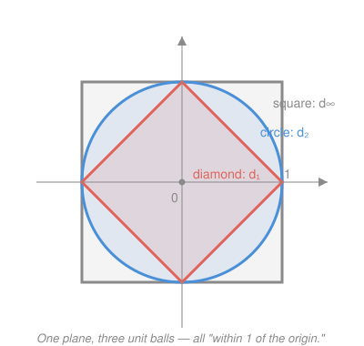

# Topology · Lesson 1.1: Metric spaces

> ⏱ ~15 min · Module 1: Spaces · Builds on: `real-analysis` (ε–δ, open/closed sets on $\mathbb{R}$) · Unlocks: [1.2 Open sets and the metric topology](01-02-open-sets-metric-topology.md)

## Why this matters

In `real-analysis` every idea — limits, continuity, Cauchy sequences — was built on one number: $|x-y|$, the distance between two reals. That single tool did enormous work, but it only knows how to measure the line. The plane, the space of infinite sequences, the space of *all continuous functions on $[0,1]$* — each has its own natural sense of "close," and we'd like the ε–δ reasoning to run on every one of them without rewriting it. Topology's first move is to stop asking *what* distance is and instead ask what **properties** distance must have. Whatever satisfies those properties gets the whole machine for free. This lesson is that abstraction, and the surprising variety of things that pass the test.

## The idea

Think about what you actually use when you reason about $|x-y|$. You never need the subtraction — you need three plain facts. Distance is never negative, and it's zero only when you haven't moved. It doesn't care which way you measure: from here to there is the same as from there to here. And the direct route is never longer than a detour through a third point. That's it. Those three facts are the entire logical content of "distance."

So we promote them to axioms and call *anything* obeying them a **metric**. The payoff is leverage: the moment you check those three lines for some exotic notion of nearness — how far apart two functions are, how many bits differ between two codewords — every theorem proved from the axioms applies instantly. And there are far more metrics than you'd guess. On the very same plane $\mathbb{R}^2$ we'll put down three genuinely different distances; a fourth metric declares every pair of distinct points to sit *exactly one apart*; a fifth measures the gap between two functions. One definition, wildly different geometries.

## The formal version

**Definition (metric).** Let $X$ be a set. A **metric** on $X$ is a function $d:X\times X\to[0,\infty)$ — it eats two points and returns a nonnegative real — satisfying, for all $x,y,z\in X$:

- **(M1) Identity of indiscernibles:** $d(x,y)=0 \iff x=y$.
- **(M2) Symmetry:** $d(x,y)=d(y,x)$.
- **(M3) Triangle inequality:** $d(x,z)\le d(x,y)+d(y,z)$.

The pair $(X,d)$ is a **metric space**. Elements of $X$ are called **points** — even when they're functions.

> In words (M1): the distance between two points is zero exactly when they're the same point — nothing else is at distance zero, and a point sits at distance zero from itself.
> In words (M2): measuring from $x$ to $y$ gives the same number as measuring from $y$ to $x$.
> In words (M3): going straight from $x$ to $z$ is never longer than detouring through $y$. This is the workhorse — nearly every estimate in the subject is a triangle inequality in disguise.

Notice what's *not* required: no coordinates, no subtraction, no algebra on $X$ at all. $X$ is just a bag of points and $d$ a rule for spacing them.

**Definition (open ball).** For $x\in X$ and radius $r>0$,
$$B(x,r)=\{\,y\in X : d(x,y)<r\,\}.$$

> In words: the open ball $B(x,r)$ is the set of all points *strictly* less than $r$ away from $x$ — the abstract version of the open interval $(x-r,x+r)$ on the line. Its **shape depends entirely on which $d$ you chose**, and that shape is the visible fingerprint of the metric.

## A gallery of metrics

The point of the axioms is how much fits them. All five below are genuine metric spaces.

**1. Euclidean distance $d_2$ on $\mathbb{R}^n$.** The straight-line ruler distance,
$$d_2(x,y)=\sqrt{\textstyle\sum_{i=1}^n (x_i-y_i)^2}.$$
On $\mathbb{R}$ this is just $|x-y|$ — the metric `real-analysis` used all along, now revealed as one instance.

**2. Taxicab (Manhattan) distance $d_1$ on $\mathbb{R}^n$.** Sum the coordinate gaps:
$$d_1(x,y)=\textstyle\sum_{i=1}^n |x_i-y_i|.$$
The distance a cab drives on a grid of streets — you can't cut across blocks.

**3. Sup (Chebyshev) distance $d_\infty$ on $\mathbb{R}^n$.** The single largest coordinate gap:
$$d_\infty(x,y)=\max_{1\le i\le n} |x_i-y_i|.$$
How many king-moves on a chessboard separate two squares.

**4. The discrete metric on any set $X$.**
$$d(x,y)=\begin{cases}0,& x=y,\\ 1,& x\neq y.\end{cases}$$
Every two distinct points are exactly $1$ apart — no point has a nearer neighbor than any other. It looks like a toy, but it is a fully legitimate metric on *any* set whatsoever, and it will be our go-to counterexample generator for the rest of the course.

**5. The sup metric on functions.** Let $X$ be the set of bounded functions $f:[0,1]\to\mathbb{R}$ — here a single "point" of $X$ is an entire function. Define
$$d_\infty(f,g)=\sup_{t\in[0,1]} |f(t)-g(t)|.$$
The distance between two functions is the widest vertical gap between their graphs. This is the leap that makes the abstraction worth it: we can now talk about one function being "close to" another, and every metric-space theorem — convergence, continuity, completeness — will apply to spaces whose points are functions. That is the doorway to analysis on function spaces.

**Verifying an axiom (M3 for the discrete metric).** The only interesting case for the discrete metric is the triangle inequality; let's check it honestly. Take any $x,y,z$ and look at $d(x,z)$.
- If $x=z$, then $d(x,z)=0\le d(x,y)+d(y,z)$ automatically, since the right side is $\ge 0$.
- If $x\neq z$, then $d(x,z)=1$. But $y$ cannot equal *both* $x$ and $z$ (they're different points), so at least one of $d(x,y),d(y,z)$ equals $1$. Hence $d(x,y)+d(y,z)\ge 1=d(x,z)$. $\checkmark$

(M1) and (M2) are immediate from the definition, so the discrete metric is a metric. The same "at most one of the two legs can be zero" idea reappears constantly.

## Picture

Fix the set $\mathbb{R}^2$ and draw the **unit ball** $B(0,1)$ — the points within distance $1$ of the origin — under three of our metrics. The set of points changes shape completely even though the underlying plane never does:

- $d_2$ gives $x_1^2+x_2^2<1$: a **round disk**.
- $d_1$ gives $|x_1|+|x_2|<1$: a **diamond** (square rotated $45°$), its corners on the axes.
- $d_\infty$ gives $\max(|x_1|,|x_2|)<1$: an **axis-aligned square**.

One plane, three notions of "close." The diamond sits inside the disk sits inside the square — reflecting $d_\infty\le d_2\le d_1$, so a smaller distance means a *more generous* ball. (Same three metrics turn out to define the *same open sets*, hence the same topology — the surprise that [1.2](01-02-open-sets-metric-topology.md) unpacks.)

## Worked examples

**Example 1 (mechanical — one pair, four verdicts).** Take $x=(0,0)$ and $y=(3,4)$ in $\mathbb{R}^2$.
$$d_2(x,y)=\sqrt{3^2+4^2}=5,\quad d_1(x,y)=|3|+|4|=7,\quad d_\infty(x,y)=\max(3,4)=4,$$
and under the discrete metric $d(x,y)=1$ (they're distinct, nothing else matters). Four different "distances" between the *same two points* — each internally consistent, none more "correct" than the others. Note $d_\infty\le d_2\le d_1$ holds here ($4\le5\le7$), as the nested balls predicted.

**Example 2 (why you'd care — the triangle inequality is an error bound).** In the function space of Example 5, suppose $g$ approximates $f$ with $d_\infty(f,g)\le 0.01$, and $h$ approximates $g$ with $d_\infty(g,h)\le 0.02$. How far is $h$ from $f$? By (M3),
$$d_\infty(f,h)\le d_\infty(f,g)+d_\infty(g,h)\le 0.01+0.02=0.03.$$
Chained approximation errors *add* — a Taylor polynomial within $0.01$ of the true function, then rounded to within $0.02$, is guaranteed within $0.03$. This one axiom is exactly what lets error bounds compose, and it's why "the triangle inequality" is the phrase you'll invoke more than any other in analysis.

## Watch out

- You might think (M1) is just "$d(x,x)=0$," but it's an **if and only if** — both directions matter. The direction $d(x,y)=0\Rightarrow x=y$ is called **positive-definiteness**, and it's the one that can genuinely fail: drop it and you get a **pseudometric**, where distinct points can sit at distance zero (e.g. rank sequences by $\lim$, and two sequences with the same limit are "distance zero"). Positive-definiteness is precisely what forbids that.
- You might dismiss the discrete metric as a gimmick, but it's a *real metric* and a workhorse counterexample — a space where every point is isolated, no sequence converges unless it's eventually constant, and yet every subset is both open and closed. Whenever a plausible-sounding topology claim needs a counterexample, try the discrete metric first.
- You might expect balls to be round. "Ball" is just the name for $\{y:d(x,y)<r\}$; under $d_1$ it's a diamond, under $d_\infty$ a square, under the discrete metric $B(x,1)=\{x\}$ (nothing else is within distance $1$) while $B(x,2)$ is the *entire space*. Never assume a ball's shape — derive it from the metric.

## One-liner

> A metric is distance stripped to three axioms — nonnegative-and-definite, symmetric, triangle — and once something passes, from the taxicab plane to a space of functions, all of analysis runs on it unchanged.

## Problems

**P1 (🟢)** On $\mathbb{R}^2$, let $x=(1,2)$ and $y=(4,-2)$. Compute $d_1(x,y)$, $d_2(x,y)$, and $d_\infty(x,y)$, and confirm the ordering $d_\infty\le d_2\le d_1$ holds for this pair.

**P2 (🟡)** Sketch the unit ball $B(0,1)=\{x\in\mathbb{R}^2: d(0,x)<1\}$ under the taxicab metric $d_1$, and prove that the point $(0.6,0.6)$ lies *outside* it even though both coordinates are less than $1$. What does this say about the difference between $d_1$ and $d_\infty$?

**P3 (🔴, optional)** Define $\rho:\mathbb{R}\times\mathbb{R}\to[0,\infty)$ by $\rho(x,y)=|x^3-y^3|$. Prove $\rho$ is a metric on $\mathbb{R}$. (Which axiom would fail if the exponent were $2$ instead of $3$, and why?)

Solutions

**P1** The coordinate gaps are $|1-4|=3$ and $|2-(-2)|=4$.
$$d_1=3+4=7,\qquad d_2=\sqrt{3^2+4^2}=\sqrt{25}=5,\qquad d_\infty=\max(3,4)=4.$$
Ordering: $4\le 5\le 7$, i.e. $d_\infty\le d_2\le d_1$. $\checkmark$ (Same numbers as Example 1 — no coincidence: this pair also has coordinate gaps $3$ and $4$.)

**P2** Under $d_1$, the unit ball is $\{(x_1,x_2):|x_1|+|x_2|<1\}$ — the open diamond with vertices at $(\pm1,0)$ and $(0,\pm1)$. For the point $(0.6,0.6)$:
$$d_1(0,(0.6,0.6))=|0.6|+|0.6|=1.2\not<1,$$
so it lies **outside** the ball, despite each coordinate being under $1$. The moral: $d_1$ *adds* the coordinate gaps while $d_\infty=\max(0.6,0.6)=0.6<1$ only tracks the largest, so $(0.6,0.6)$ *is* inside the $d_\infty$ unit square. The diamond sits strictly inside the square — the same nesting the Picture shows, seen at one point.

**P3** We check the three axioms for $\rho(x,y)=|x^3-y^3|$. The key fact is that $t\mapsto t^3$ is a **bijection** $\mathbb{R}\to\mathbb{R}$ (strictly increasing, hence one-to-one and onto).

- **(M1):** $\rho(x,y)=|x^3-y^3|\ge0$ always, and $\rho(x,y)=0\iff x^3=y^3\iff x=y$ — the last step because cubing is injective. Both directions hold. $\checkmark$
- **(M2):** $\rho(x,y)=|x^3-y^3|=|y^3-x^3|=\rho(y,x)$, since $|{-t}|=|t|$. $\checkmark$
- **(M3):** Let $a=x^3,\ b=y^3,\ c=z^3$. Then $\rho$ inherits the ordinary triangle inequality on $\mathbb{R}$:
$$\rho(x,z)=|a-c|=|(a-b)+(b-c)|\le|a-b|+|b-c|=\rho(x,y)+\rho(y,z).\ \checkmark$$

So $\rho$ is a metric. (In fact this is a general trick: pull back the standard metric through *any* injective function $\varphi$ via $\rho(x,y)=|\varphi(x)-\varphi(y)|$, and M1's forward direction is exactly injectivity of $\varphi$.)

If the exponent were $2$, so $\rho_2(x,y)=|x^2-y^2|$, then **(M1) fails**: $\rho_2(1,-1)=|1-1|=0$ but $1\neq-1$. Squaring isn't injective, so distinct points collapse to distance zero — we'd have only a *pseudometric*, exactly the positive-definiteness failure from Watch out.

## Connections

- **Backward:** the metric $d_2$ on $\mathbb{R}^1$ *is* the absolute value $|x-y|$ that `real-analysis` built limits and continuity on. Everything you proved there used only (M1)–(M3), which is why it will all lift to general metric spaces.
- **Forward:** [1.2](01-02-open-sets-metric-topology.md) uses open balls to define **open sets**, then shows continuity and convergence depend only on *which sets are open* — not on the numerical distances. That's the step from metric spaces to topology proper, in [1.3](01-03-topological-spaces-axioms.md).
- **Sideways:** the sup metric on functions (Example 5) is where `real-analysis`'s **uniform convergence** lives — $f_n\to f$ uniformly means exactly $d_\infty(f_n,f)\to0$. The same space, when you ask whether every Cauchy sequence converges, becomes the notion of a *complete* metric space that underwrites the existence theorems in functional analysis.
