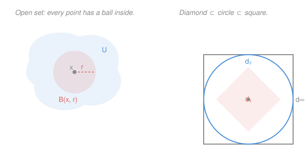

# Topology · Lesson 1.2: Open sets and the metric topology

> ⏱ ~15 min · Module 1: Spaces · Builds on: [1.1 Metric spaces](01-01-metric-spaces.md) · Unlocks: [1.3 Topological spaces: the axioms](01-03-topological-spaces-axioms.md)

## Why this matters

Here is the punchline of the entire course, delivered in its second lesson: **continuity, limits, and convergence never actually used the number $d(x,y)$ — they only used which sets are "open."** The metric was scaffolding. In `real-analysis` you proved theorems with $\varepsilon$ and $\delta$, chasing distances; every one of those proofs can be rewritten so no distance is ever named, only open sets. This lesson performs the extraction: from a metric we distill the one structure that mattered, the collection of open sets. Next lesson we burn the scaffolding — throw the metric away, keep only the open sets, and *that* is a topological space.

## The idea

Call a set $U$ **open** if you can stand at any of its points and still have a little room to wiggle in every direction without leaving $U$ — a tiny buffer of space around you that's still inside $U$. The open interval $(0,1)$ is open: wherever you stand, say at $0.999$, there's a sliver on both sides still inside. The closed interval $[0,1]$ is *not* open, because standing at the endpoint $1$, every step to the right leaves immediately — no wiggle room.

That's the whole concept: **open = every point has wiggle room.** The measuring stick (the metric) tells you what "a little room" means, but once you know which sets are open, notice how much you can say without ever measuring again. A sequence converges to $x$ when it eventually enters *every* buffer around $x$. A function is continuous when it never tears open sets apart. None of these sentences contains a number. The metric did its job — defining the buffers — and then quietly left the room.

## The formal version

Throughout, $(X,d)$ is a metric space and $B(x,r)=\{y\in X : d(x,y)<r\}$ is the **open ball** of radius $r>0$ centered at $x$, from [1.1](01-01-metric-spaces.md).

**Definition (open set).** A set $U\subseteq X$ is **open** if
$$\forall\,x\in U\ \ \exists\,r>0\ \text{ such that }\ B(x,r)\subseteq U.$$

> In words: every point of $U$ carries a whole ball's worth of company that's still inside $U$ — everyone has wiggle room.

The name promises that open balls are themselves open. This is not automatic — the ball is defined by a *strict* inequality, and we must show a point near the rim still has room. The triangle inequality does exactly this.

**Lemma (open balls are open).** For any $x\in X$ and $r>0$, the ball $B(x,r)$ is open.

*Proof.* Take any $y\in B(x,r)$; then $d(x,y)<r$, so the slack $s := r-d(x,y)$ is strictly positive. Claim $B(y,s)\subseteq B(x,r)$. Let $z\in B(y,s)$, so $d(y,z)<s$. By the triangle inequality,
$$d(x,z)\ \le\ d(x,y)+d(y,z)\ <\ d(x,y)+s\ =\ d(x,y)+\big(r-d(x,y)\big)\ =\ r,$$
so $z\in B(x,r)$. Thus every $y$ in the ball has its own smaller ball inside, and $B(x,r)$ is open. $\blacksquare$

> In words: a point sitting distance $d(x,y)$ from the center has exactly $r-d(x,y)$ of slack left to the rim, and a ball that small around it can't poke through.

**The three properties.** The open sets of any metric space obey exactly three rules. Prove them now; next lesson they are *promoted to axioms* and become the definition of a topology.

**(i)** $\varnothing$ and $X$ are open.

**(ii)** An **arbitrary** union of open sets is open: if each $U_\alpha$ is open ($\alpha$ ranging over any index set $A$, finite or infinite), so is $\bigcup_{\alpha\in A}U_\alpha$.

**(iii)** A **finite** intersection of open sets is open: if $U_1,\dots,U_n$ are open, so is $U_1\cap\cdots\cap U_n$.

*Proof.* **(i)** $\varnothing$ is open vacuously — there's no point to check. $X$ is open because for any $x$, the ball $B(x,1)\subseteq X$ trivially (every ball lives in $X$).

**(ii)** Let $x\in\bigcup_\alpha U_\alpha$. Then $x\in U_\beta$ for some particular $\beta$. Since $U_\beta$ is open, there is $r>0$ with $B(x,r)\subseteq U_\beta\subseteq\bigcup_\alpha U_\alpha$. So $x$ has wiggle room in the union. As $x$ was arbitrary, the union is open. (Notice: one witnessing $U_\beta$ was enough, so the number of sets never entered — hence *arbitrary* unions are fine.)

**(iii)** Let $x\in U_1\cap\cdots\cap U_n$. For each $i$, openness of $U_i$ gives a radius $r_i>0$ with $B(x,r_i)\subseteq U_i$. Set $r=\min\{r_1,\dots,r_n\}$. Because there are **finitely** many, this minimum is a positive number, and $B(x,r)\subseteq B(x,r_i)\subseteq U_i$ for every $i$, so $B(x,r)\subseteq\bigcap_i U_i$. Hence the intersection is open. $\blacksquare$

> In words: unions inherit one point's room from whichever set it came from; intersections must satisfy all sets at once, so you take the *smallest* room — and a smallest exists only because the list is finite.

**Why "finite" is not optional.** On $\mathbb{R}$ with the usual metric, each $B(0,1/n)=(-1/n,\ 1/n)$ is open, but
$$\bigcap_{n=1}^{\infty} B\!\left(0,\tfrac1n\right)=\{0\},$$
because the only real inside *every* $(-1/n,1/n)$ is $0$ itself. And $\{0\}$ is **not** open: any ball $B(0,r)=(-r,r)$ contains points other than $0$, so it can't fit inside $\{0\}$. The radii $1/n$ shrank to $0$, leaving no positive room — exactly the failure rule (iii) guards against.

**The metric topology.** The collection
$$\mathcal{T}_d=\{\,U\subseteq X : U\text{ is open}\,\}$$
of *all* open sets of $(X,d)$ is the **metric topology** induced by $d$. This set-of-sets is the object the rest of the course studies.

Two staples of analysis, re-said in this vocabulary with no $\varepsilon$ in sight:

- **Convergence.** $x_n\to x$ iff every open ball $B(x,\varepsilon)$ eventually contains the whole tail: for each $\varepsilon>0$ there is $N$ with $x_n\in B(x,\varepsilon)$ for all $n\ge N$. That is verbatim `real-analysis`'s $\varepsilon$–$N$ definition — "$d(x_n,x)<\varepsilon$" *is* "$x_n\in B(x,\varepsilon)$." And since every open set around $x$ contains some such ball, this is the same as: every open set containing $x$ eventually swallows the tail. The balls were a convenience; open sets suffice.

**Equivalent metrics.** Different rulers can generate the *identical* collection of open sets.

**Definition.** Two metrics $d,d'$ on the same set $X$ are **(topologically) equivalent** if $\mathcal{T}_d=\mathcal{T}_{d'}$ — they declare exactly the same sets open.

> In words: equivalent metrics may report wildly different distances, yet they cannot be told apart by any topological question — openness, convergence, continuity all agree.

The clean way to check it: if every $d$-ball contains a $d'$-ball around the same point and vice versa, then any set open for one is open for the other, so $\mathcal{T}_d=\mathcal{T}_{d'}$. On $\mathbb{R}^n$ the three metrics from [1.1](01-01-metric-spaces.md) —
$$d_1(x,y)=\sum_{i=1}^n|x_i-y_i|,\quad d_2(x,y)=\sqrt{\textstyle\sum_i (x_i-y_i)^2},\quad d_\infty(x,y)=\max_i|x_i-y_i|$$
— satisfy the pointwise chain
$$d_\infty(x,y)\ \le\ d_2(x,y)\ \le\ d_1(x,y)\ \le\ n\,d_\infty(x,y).$$
Each inequality nests one ball inside another (a small enough $d_1$-ball fits in a given $d_2$-ball, etc.), so all three generate the **same topology**. Their unit balls look completely different — a diamond, a disk, a square — but they define one and the same notion of open set. *Topology sees less than geometry:* it cannot distinguish the diamond from the square.

The contrast is the **discrete metric** $d(x,y)=1$ for $x\ne y$ (and $0$ if $x=y$). Here $B(x,\tfrac12)=\{x\}$, so every singleton is open, so (taking unions) **every** subset is open. That's the **discrete topology**, and no rescaling of a normal metric on $\mathbb{R}$ produces it — it is a genuinely different topology, not just a different-looking ruler.

## Picture

## Worked examples

**Example 1 (mechanical — is this set open?).** Is $S=\{(x,y)\in\mathbb{R}^2 : x>0\}$ (the open right half-plane) open in $d_2$? Take any $p=(a,b)\in S$, so $a>0$. Set $r=a>0$. If $q=(c,d)$ satisfies $d_2(p,q)<r=a$, then in particular $|c-a|\le d_2(p,q)<a$, so $c>a-a=0$, meaning $q\in S$. Thus $B(p,a)\subseteq S$ and every point has room: $S$ is open. (The choice $r=a$ = "distance to the wall $x=0$" is the same slack idea as the ball lemma.)

**Example 2 (why you'd care — the topology is the invariant).** Consider the sequence $x_n=(1/n,\ 1/n)$ in $\mathbb{R}^2$. Does it converge to the origin? In $d_2$: $d_2(x_n,0)=\sqrt{2}/n\to0$. In $d_1$: $d_1(x_n,0)=2/n\to0$. In $d_\infty$: $d_\infty(x_n,0)=1/n\to0$. All three say *yes*, and they must — convergence is defined purely through open sets, and the three metrics share a topology. Swap in the discrete metric, though, and everything changes: $d(x_n,0)=1$ for every $n$ (since $x_n\ne0$ always), so the "tail" never enters $B(0,\tfrac12)=\{0\}$ and $x_n\not\to0$. Same points, same origin, different topology → different verdict on convergence. This is precisely why the next lesson can afford to forget the metric: **the topology already carries every answer that analysis cares about.**

## Watch out

- You might think "open" is a property a set carries by itself, but it is relative to *both* the ambient space and the metric. The set $[0,1)$ is not open in $\mathbb{R}$, yet it is open when $[0,\infty)$ is the whole space (the point $0$ now sits on the world's edge, with no left side to fall off). And $\{0\}$ is not open in the usual metric on $\mathbb{R}$ but *is* open in the discrete metric. Always ask "open in *which* space, under *which* metric?"
- You might think intersecting open sets keeps them open, full stop — but only **finitely** many. The nested balls $\bigcap_n(-1/n,1/n)=\{0\}$ is the standing counterexample: infinitely many opens can squeeze down to a non-open set because the radii collapse to $0$. Rule (iii) says *finite* for a reason.
- You might think two metrics giving very different distances must be "topologically different," but distance and topology are separate layers. $d_1$ and $d_\infty$ disagree on almost every pair of points, yet they are topologically identical. Conversely, agreeing on the *idea* of nearness (same open sets) is all topology asks; the actual numbers are invisible to it.

## One-liner

> A set is open when every point has wiggle room; the collection of all open sets — the topology — is the only thing continuity and convergence ever needed, so equivalent metrics with different distances can still be the same space.

## Problems

**P1 (🟢)** Prove directly from the definition that the open ball $B((0,0),1)$ in $(\mathbb{R}^2,d_2)$ and its complement's interior are as expected: specifically, show the "punctured plane" $\mathbb{R}^2\setminus\{(0,0)\}$ is open. (Hint: at a point $p\ne0$, how much room do you have before hitting the origin?)

**P2 (🟡)** On $\mathbb{R}$, let $U_n=(-1,\,1+\tfrac1n)$ for $n=1,2,3,\dots$. Each $U_n$ is open. Compute $\bigcap_{n=1}^\infty U_n$ and decide whether it is open. Does this contradict the "infinite intersections can fail" warning? Explain in one sentence.

**P3 (🔴, optional)** Prove that the metrics $d_2$ and $d_\infty$ on $\mathbb{R}^2$ are topologically equivalent by showing that each ball contains a ball of the other type. Concretely: given $B_\infty(p,r)$, find $s>0$ with $B_2(p,s)\subseteq B_\infty(p,r)$; and given $B_2(p,r)$, find $t>0$ with $B_\infty(p,t)\subseteq B_2(p,r)$. Conclude $\mathcal{T}_{d_2}=\mathcal{T}_{d_\infty}$.

Solutions

**P1** Let $p\in\mathbb{R}^2\setminus\{0\}$, so $p\ne0$ and $r:=d_2(p,0)>0$ by the positivity axiom of a metric. Claim $B(p,r)\subseteq\mathbb{R}^2\setminus\{0\}$, i.e. the ball misses the origin. Indeed $0\notin B(p,r)$ because $d_2(p,0)=r\not<r$ — the origin sits exactly on the rim, not inside. So every $q\in B(p,r)$ is nonzero, giving $B(p,r)\subseteq\mathbb{R}^2\setminus\{0\}$. Every point of the punctured plane has wiggle room; it is open. (The "room" is exactly the distance to the removed point — the same slack construction as the ball lemma.)

**P2** Every $U_n$ contains $(-1,1]$, and as $n\to\infty$ the right endpoint $1+\tfrac1n\downarrow1$. A real $x$ lies in *every* $U_n$ iff $-1<x$ and $x<1+\tfrac1n$ for all $n$; the latter forces $x\le1$ (if $x>1$ then $x>1+\tfrac1n$ for large $n$). So
$$\bigcap_{n=1}^\infty U_n=(-1,\ 1].$$
This set is **not** open: the point $1$ has no room to its right (any $B(1,\varepsilon)=(1-\varepsilon,1+\varepsilon)$ pokes outside). So an infinite intersection of opens again produced a non-open set — fully consistent with the warning, which only guarantees openness for *finite* intersections and makes no promise for infinite ones.

**P3** Recall the pointwise inequalities on $\mathbb{R}^2$: for all $p,q$,
$$d_\infty(p,q)\ \le\ d_2(p,q)\ \le\ \sqrt{2}\,\,d_\infty(p,q).$$
(Left: the max of two squares is at most their sum, so $\max\le\sqrt{\text{sum of squares}}$. Right: sum of two squares is at most twice the max square, so $\sqrt{\text{sum}}\le\sqrt2\,\max$.)

*Given $B_\infty(p,r)$*, take $s=r$. If $d_2(p,q)<s=r$ then $d_\infty(p,q)\le d_2(p,q)<r$, so $q\in B_\infty(p,r)$. Hence $B_2(p,r)\subseteq B_\infty(p,r)$.

*Given $B_2(p,r)$*, take $t=r/\sqrt2$. If $d_\infty(p,q)<t=r/\sqrt2$ then $d_2(p,q)\le\sqrt2\,d_\infty(p,q)<\sqrt2\cdot\tfrac{r}{\sqrt2}=r$, so $q\in B_2(p,r)$. Hence $B_\infty(p,\,r/\sqrt2)\subseteq B_2(p,r)$.

Now take any $U$ open in $d_2$ and any $x\in U$: there is $r>0$ with $B_2(x,r)\subseteq U$, and by the first inclusion $B_\infty(x,r)\subseteq B_2(x,r)\subseteq U$, so $U$ is open in $d_\infty$. The second inclusion runs the argument the other way. Therefore $\mathcal{T}_{d_2}=\mathcal{T}_{d_\infty}$: same open sets, one topology, despite the disk and the square looking nothing alike. $\blacksquare$

## Connections

- **Backward:** the open balls, the metric axioms, and the three distances $d_1,d_2,d_\infty$ are all straight from [1.1](01-01-metric-spaces.md); the triangle inequality — the single axiom that carried the ball lemma — is what makes "wiggle room" propagate. Convergence recast here is the ball-picture of the same limits you'll meet formally throughout `real-analysis`.
- **Forward:** in [1.3](01-03-topological-spaces-axioms.md) the three properties (i)–(iii) stop being theorems and *become the axioms*: a topology is declared to be any collection of "open sets" closed under arbitrary unions and finite intersections, with no metric anywhere. Bases in [1.4](01-04-bases-and-subbases.md) then formalize "the balls generate the topology," and [1.5](01-05-closure-interior-boundary.md) builds interior/closure/boundary on top of openness. The "preimage of open is open" definition of continuity waits in [2.1](02-01-continuity-and-homeomorphisms.md).
- **Sideways:** "same open sets = same space" is the seed of *homeomorphism* — topological sameness — and explains why `topology` can treat a coffee mug and a doughnut as identical while a geometer cannot. It is also why, in analysis, so many results are stated for "equivalent norms": on a finite-dimensional space all norms are topologically equivalent, so they share every open set, every convergent sequence, every continuous function — this lesson's phenomenon in its functional analysis uniform.
